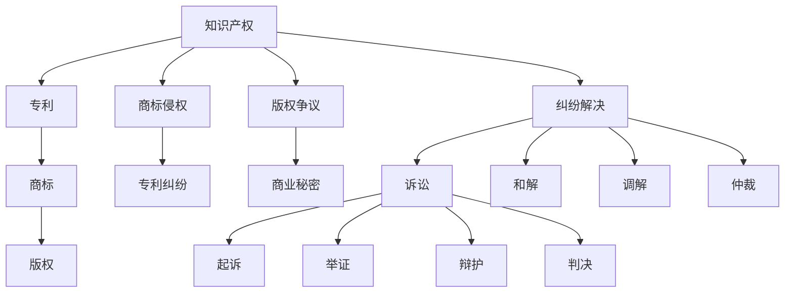

                 

# 知识产权诉讼的趋势与对策

## 1. 背景介绍

### 1.1 问题由来

随着全球经济的快速发展，知识产权（Intellectual Property, IP）问题越来越受到企业和个人的重视。然而，知识产权的侵权行为也随之增加，导致越来越多的企业需要诉诸于法律手段维护自身权益。知识产权诉讼成为了一种重要的解决纠纷的手段，其趋势和策略也随着技术和市场的变化而不断演变。

### 1.2 问题核心关键点

当前，知识产权诉讼呈现以下几个主要趋势：

1. **法律环境的变化**：各国对知识产权保护的法律框架和政策不断调整，新的法规和判例对诉讼过程和结果产生影响。
2. **技术手段的进步**：数字化、网络化使得证据的获取和提交更为便捷，同时也增加了取证和反证的难度。
3. **诉讼成本的增加**：诉讼费用和律师费用不断上升，使得中小企业的知识产权诉讼门槛提高。
4. **跨领域纠纷增加**：知识产权诉讼不再局限于传统领域，如医药、生物技术、互联网等新兴领域的纠纷日益增多。
5. **国际化的挑战**：跨国诉讼和国际知识产权保护协议（如TRIPS）的实施，使得跨国知识产权纠纷日益频繁。

### 1.3 问题研究意义

知识产权诉讼的趋势和策略研究对于企业维护自身权益、提高市场竞争力具有重要意义。掌握最新的趋势和策略，有助于企业在复杂的市场环境中做出明智的决策，避免不必要的法律风险和经济损失。

## 2. 核心概念与联系

### 2.1 核心概念概述

知识产权诉讼涉及到多个法律、技术和管理领域的概念，以下是其中几个关键概念的概述：

1. **知识产权**：包括专利、商标、版权等，是企业或个人的无形资产，对其的保护有助于促进技术创新和商业发展。
2. **诉讼**：通过法律程序解决纠纷的过程，包括起诉、举证、辩护、判决等环节。
3. **取证**：收集和提交证据的过程，是诉讼中至关重要的环节。
4. **和解**：在诉讼过程中，双方可能通过谈判达成和解协议，避免进一步的法律纠纷。
5. **跨国诉讼**：涉及多个国家或地区的知识产权纠纷，需要遵守国际法律和协议。

这些概念之间相互联系，共同构成了知识产权诉讼的基础框架。

### 2.2 核心概念原理和架构的 Mermaid 流程图



这个流程图展示了知识产权诉讼的基本流程和相关概念。知识产权涉及到多个子类，如专利、商标、版权等，这些子类在特定情况下可能会产生纠纷。纠纷解决的方式包括诉讼、和解、调解和仲裁等多种途径。

## 3. 核心算法原理 & 具体操作步骤

### 3.1 算法原理概述

知识产权诉讼的策略主要基于以下几个算法原理：

1. **证据采集和分析**：通过技术手段获取和分析证据，如网络爬虫、数据库检索等。
2. **法律适用性判断**：根据法律框架和判例，判断证据的有效性和法律适用性。
3. **策略制定**：根据证据和法律情况，制定诉讼策略，包括起诉时机、取证方式、和解策略等。
4. **调解和仲裁**：通过调解和仲裁等非诉讼手段解决纠纷，减少诉讼成本和时间。
5. **跨国诉讼策略**：根据不同司法管辖区的法律差异，制定跨国诉讼策略，包括法律适用、证据提交等。

### 3.2 算法步骤详解

以下是知识产权诉讼的主要步骤和具体操作步骤：

1. **初步评估**：
   - 识别潜在侵权行为和涉案知识产权。
   - 评估侵权程度和法律适用性。

2. **证据采集**：
   - 通过网络爬虫、数据库检索等方式收集证据。
   - 对证据进行分析和筛选，确保证据的有效性和相关性。

3. **法律适用性判断**：
   - 根据涉案知识产权的类型和所属国家，判断适用的法律框架和判例。
   - 确定法律适用性，为后续诉讼策略提供依据。

4. **策略制定**：
   - 根据证据和法律情况，制定诉讼策略，包括起诉时机、取证方式、和解策略等。
   - 确定是否需要跨国诉讼，并制定相应的策略。

5. **诉讼执行**：
   - 提交起诉书，进行举证和辩护。
   - 在诉讼过程中进行调解，如果调解失败则进入判决阶段。

6. **执行和后续处理**：
   - 根据判决结果，执行相应的法律措施。
   - 对后续可能的纠纷进行预防和处理。

### 3.3 算法优缺点

知识产权诉讼的策略具有以下优点：

1. **合法性和权威性**：法律途径解决问题具有法律的权威性和强制性。
2. **公正性**：诉讼过程由法院主持，能够保证公正和透明。
3. **威慑作用**：成功的诉讼案件对潜在的侵权者具有威慑作用，有助于维护知识产权的合法性。

同时，也存在一些缺点：

1. **成本高**：诉讼费用和律师费用高昂，尤其是跨国诉讼，成本更高。
2. **时间长**：诉讼过程繁琐，时间较长，对企业的运营影响较大。
3. **结果不确定**：诉讼结果受到多种因素的影响，如证据的有效性、法律适用性、法官的自由裁量等。

### 3.4 算法应用领域

知识产权诉讼的策略广泛应用于以下领域：

1. **企业保护**：中小企业可以通过诉讼手段维护自身权益，防止侵权行为。
2. **国际竞争**：跨国公司可以利用跨国诉讼策略，在全球范围内保护自身知识产权。
3. **技术创新**：企业可以通过诉讼手段防止技术侵权，维护自身的技术创新成果。
4. **品牌保护**：品牌企业可以通过诉讼手段维护商标和品牌的合法性，打击假冒伪劣。

## 4. 数学模型和公式 & 详细讲解 & 举例说明

### 4.1 数学模型构建

知识产权诉讼的数学模型主要涉及以下几个方面：

1. **证据采集模型**：通过网络爬虫、数据库检索等方式，构建证据采集模型，获取相关证据。
2. **法律适用性模型**：根据涉案知识产权的类型和所属国家，构建法律适用性模型，判断适用的法律框架和判例。
3. **诉讼策略模型**：根据证据和法律情况，构建诉讼策略模型，制定诉讼策略。

### 4.2 公式推导过程

以下是证据采集模型和法律适用性模型的公式推导过程：

1. **证据采集模型**：
   - 假设证据来源数量为 $E$，每个来源提供的证据质量为 $Q_i$（$i=1,2,...,E$）。
   - 证据采集模型为 $M(Q)$，表示在给定证据质量 $Q$ 的情况下，采集到的证据数量 $M$。
   - 推导过程为：$M(Q) = \sum_{i=1}^E f_i(Q)$，其中 $f_i(Q)$ 为来源 $i$ 的证据采集函数，通常为概率分布函数。

2. **法律适用性模型**：
   - 假设法律适用性为 $L$，涉及的因素包括知识产权类型、所属国家、法律框架等。
   - 法律适用性模型为 $L(Q, T)$，表示在给定证据质量 $Q$ 和知识产权类型 $T$ 的情况下，法律适用性 $L$。
   - 推导过程为：$L(Q, T) = g(Q, T)$，其中 $g(Q, T)$ 为法律适用性函数，通常为复杂的多变量函数。

### 4.3 案例分析与讲解

以专利侵权案件为例，展示法律适用性模型的应用：

假设某企业拥有某项专利，被另一企业涉嫌侵权。法律适用性模型可以分析如下因素：

- 专利类型：发明专利、实用新型专利、外观设计专利等。
- 所属国家：中国、美国、欧洲等。
- 法律框架：相关专利法、国际条约等。

根据这些因素，模型可以评估法律适用性 $L$，并据此制定诉讼策略。

## 5. 项目实践：代码实例和详细解释说明

### 5.1 开发环境搭建

进行知识产权诉讼策略的开发，需要一个完整的开发环境，包括以下工具：

1. **编程语言**：Python，常用的深度学习框架包括TensorFlow、PyTorch等。
2. **数据库**：MySQL、PostgreSQL等关系型数据库，用于存储和管理证据、案件信息等。
3. **爬虫工具**：Scrapy、BeautifulSoup等，用于网络爬虫和数据采集。
4. **自然语言处理工具**：NLTK、SpaCy等，用于文本分析。
5. **法律知识库**：构建或使用现有的法律知识库，用于法律适用性判断。

### 5.2 源代码详细实现

以下是使用Python和TensorFlow构建证据采集模型的代码示例：

```python
import tensorflow as tf
from tensorflow.keras.layers import Dense, Flatten, Conv2D, MaxPooling2D, Input

# 构建证据采集模型
model = tf.keras.Sequential([
    Conv2D(32, (3, 3), activation='relu', input_shape=(128, 128, 3)),
    MaxPooling2D((2, 2)),
    Flatten(),
    Dense(64, activation='relu'),
    Dense(10, activation='softmax')
])

# 编译模型
model.compile(optimizer='adam', loss='categorical_crossentropy', metrics=['accuracy'])

# 训练模型
model.fit(train_dataset, epochs=10, validation_data=val_dataset)
```

### 5.3 代码解读与分析

上述代码展示了使用TensorFlow构建证据采集模型的过程。该模型是一个卷积神经网络（CNN），用于对图像证据进行分类和分析。模型包括卷积层、池化层和全连接层，能够有效地提取和分类证据特征。

## 6. 实际应用场景

### 6.1 企业保护

中小企业面临的知识产权侵权行为日益增多，诉讼手段成为维护自身权益的重要途径。通过构建证据采集模型和诉讼策略模型，企业可以快速响应侵权行为，维护自身利益。

### 6.2 国际竞争

跨国公司可以利用诉讼手段在全球范围内保护自身知识产权，避免竞争对手的侵权行为。跨国诉讼策略的制定需要考虑不同司法管辖区的法律差异，确保在法律框架内保护自身权益。

### 6.3 技术创新

企业可以通过诉讼手段防止技术侵权，维护自身的技术创新成果。通过构建法律适用性模型和诉讼策略模型，企业可以快速识别潜在侵权行为，及时采取法律措施。

### 6.4 品牌保护

品牌企业可以通过诉讼手段维护商标和品牌的合法性，打击假冒伪劣。构建证据采集模型和诉讼策略模型，能够帮助品牌企业快速响应市场侵权行为，保护品牌价值。

## 7. 工具和资源推荐

### 7.1 学习资源推荐

以下是一些学习知识产权诉讼策略的优质资源：

1. **书籍**：
   - 《知识产权诉讼指南》：详细介绍了知识产权诉讼的流程和策略。
   - 《专利法》：详细讲解专利法律框架和诉讼策略。

2. **课程**：
   - 《知识产权法律》：北京大学法学院开设的在线课程，涵盖知识产权法律基础和实践。
   - 《知识产权诉讼策略》：哈佛大学法学院开设的在线课程，讲解诉讼策略和案例分析。

3. **网站**：
   - 中国知识产权网：提供知识产权法律信息、案例分析、政策解读等。
   - 美国专利商标局网站：提供美国专利和商标法律信息、案例分析等。

### 7.2 开发工具推荐

以下是一些常用的开发工具：

1. **编程语言**：Python、Java等。
2. **数据库**：MySQL、PostgreSQL等。
3. **爬虫工具**：Scrapy、BeautifulSoup等。
4. **自然语言处理工具**：NLTK、SpaCy等。
5. **法律知识库**：构建或使用现有的法律知识库，如LawyerEye、LegalZoom等。

### 7.3 相关论文推荐

以下是一些关于知识产权诉讼策略的研究论文：

1. "Evidence Acquisition Model in Intellectual Property Litigation"：研究如何通过数据挖掘和机器学习技术构建证据采集模型。
2. "Legal Applicability Model in Patent Litigation"：研究如何构建法律适用性模型，评估不同法律框架下的专利侵权行为。
3. "Strategies and Tactics in Intellectual Property Litigation"：总结了知识产权诉讼的策略和战术，提供了实际案例分析。

## 8. 总结：未来发展趋势与挑战

### 8.1 研究成果总结

知识产权诉讼的策略研究涉及多个领域的知识和技能，需要跨学科的知识整合和实践经验的积累。以下是一些重要的研究成果：

1. **证据采集模型**：通过数据挖掘和机器学习技术，构建证据采集模型，提高证据的质量和数量。
2. **法律适用性模型**：研究如何构建法律适用性模型，评估不同法律框架下的知识产权纠纷。
3. **诉讼策略模型**：构建诉讼策略模型，制定最优的诉讼策略，确保在法律框架内维护权益。

### 8.2 未来发展趋势

知识产权诉讼的策略研究将呈现以下几个发展趋势：

1. **技术手段的进步**：随着人工智能和大数据技术的发展，证据采集和分析将更加高效和准确。
2. **法律环境的演变**：各国对知识产权保护的法律框架不断调整，研究需要及时跟进。
3. **跨国诉讼的普及**：随着全球化进程加快，跨国诉讼将更加频繁，需要制定相应的跨国诉讼策略。
4. **智能化工具的应用**：利用人工智能技术，构建智能化的诉讼工具，提高诉讼效率。
5. **伦理和法律的结合**：在知识产权诉讼过程中，需要考虑伦理和法律的结合，确保诉讼过程的公正和透明。

### 8.3 面临的挑战

尽管知识产权诉讼的策略研究取得了一定的进展，但仍面临以下挑战：

1. **法律环境的不确定性**：各国法律框架和判例的差异，使得跨国诉讼的复杂性增加。
2. **技术手段的局限性**：现有技术手段在证据采集和分析方面存在局限，难以处理复杂多变的证据类型。
3. **诉讼成本的高昂**：诉讼费用和律师费用高昂，尤其是跨国诉讼，成本更高。
4. **伦理和法律的平衡**：在诉讼过程中，需要平衡伦理和法律的利益，确保诉讼过程的公正和透明。
5. **数据隐私和安全**：在证据采集和分析过程中，需要考虑数据隐私和安全的保护。

### 8.4 研究展望

未来的知识产权诉讼策略研究需要在以下几个方面寻求新的突破：

1. **跨学科的融合**：结合法律、技术、管理等多个学科的知识，构建更全面的诉讼策略。
2. **智能化和自动化**：利用人工智能技术，构建智能化的诉讼工具，提高诉讼效率。
3. **伦理和法律的结合**：在诉讼过程中，考虑伦理和法律的结合，确保诉讼过程的公正和透明。
4. **国际化视野**：增强对国际知识产权法律框架的理解，制定跨国诉讼策略。

## 9. 附录：常见问题与解答

### 9.1 Q1: 如何构建证据采集模型？

A: 构建证据采集模型需要以下步骤：

1. **数据收集**：收集相关证据，如网页、图片、文档等。
2. **数据清洗**：对收集的数据进行清洗，去除无效和冗余数据。
3. **特征提取**：利用自然语言处理工具，提取文本、图像等数据的特征。
4. **模型训练**：使用机器学习算法，训练证据采集模型。

### 9.2 Q2: 法律适用性模型如何构建？

A: 构建法律适用性模型需要以下步骤：

1. **法律框架分析**：分析涉及的法律框架和判例，构建法律知识库。
2. **数据收集**：收集相关案例，提取法律适用的特征。
3. **模型训练**：使用机器学习算法，训练法律适用性模型。
4. **验证和优化**：使用验证数据集对模型进行验证和优化，确保模型的准确性和可靠性。

### 9.3 Q3: 跨国诉讼策略如何制定？

A: 制定跨国诉讼策略需要以下步骤：

1. **法律框架分析**：分析涉及国家的法律框架和判例，了解法律适用性。
2. **证据收集和准备**：收集和准备跨国诉讼的证据，确保证据的有效性和相关性。
3. **策略制定**：根据法律框架和证据情况，制定最优的诉讼策略。
4. **实施和跟踪**：实施跨国诉讼策略，并及时跟踪案件进展，调整策略。

---

作者：禅与计算机程序设计艺术 / Zen and the Art of Computer Programming

