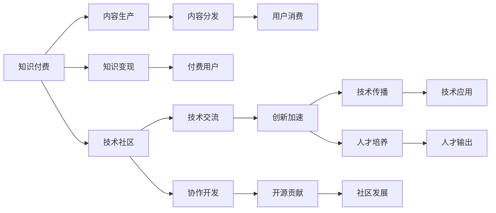

                 

# 知识付费与技术社区建设的良性互动

在科技日新月异的今天，知识付费和技术社区建设成为了驱动技术创新和人才培养的两大引擎。它们之间的良性互动，不仅能够为技术知识的传播和积累提供平台，还能够激发创新思维，推动技术应用的实践和普及。本文将从知识付费的兴起、技术社区的作用、两者间的互动机制以及未来的发展方向等多个角度进行详细阐述。

## 1. 背景介绍

### 1.1 知识付费的兴起

知识付费，即通过在线订阅、付费下载等形式，获取专业知识的在线服务模式。随着互联网的普及和技术的快速发展，人们对知识的需求日益增长，知识付费成为一种新的消费趋势。

这一趋势的背后，是人们对信息过载的应对、对深度学习的追求，以及对高效解决问题的渴望。知识付费的出现，使得用户在碎片化的时间里，能够迅速获得高质量的解决方案，提升工作效率和学习效果。

### 1.2 技术社区的作用

技术社区是一个围绕技术话题交流分享的平台。无论是开源项目的协作、技术论坛的讨论，还是开发者社区的交流，技术社区已成为连接技术创作者和用户的关键纽带。

技术社区为技术人才提供了展示自己、学习他人、不断提升的平台。它不仅推动了技术知识的共享和普及，还促进了技术创新的协同和加速。

## 2. 核心概念与联系

### 2.1 核心概念概述

- **知识付费**：通过付费机制，提供定制化的知识服务，包括但不限于在线课程、专栏文章、专家咨询等。

- **技术社区**：围绕技术话题，通过技术论坛、开发者社区、开源项目协作等形式，连接技术创作者和用户，进行知识共享、问题讨论和创新合作。

### 2.2 核心概念原理和架构的 Mermaid 流程图



此图展示了知识付费和技术社区间的相互作用机制：

- 知识付费平台通过内容生产（B）满足用户对专业知识的个性化需求，并从中获得变现（C）。
- 技术社区则提供技术交流（H）和协作开发（I），推动技术创新（J）和开源贡献（K），进而促进技术传播（L）和人才培养（N）。
- 创新加速（J）和人才培养（N）共同驱动技术应用的实践和普及（O），最终实现知识付费和社区发展的良性互动（P）。

## 3. 核心算法原理 & 具体操作步骤

### 3.1 算法原理概述

知识付费与技术社区的良性互动，依赖于算法和流程的合理设计。这些算法和流程确保了知识的有效传递和创新成果的实现。

- **个性化推荐算法**：基于用户行为数据，推荐相关课程、文章和资源，提高用户的学习效率和体验。
- **社区管理算法**：通过筛选和推送优质内容，维护社区秩序，吸引更多技术人才参与讨论和合作。
- **用户行为分析算法**：分析用户的学习路径和反馈，优化课程内容和社区管理策略，提升整体效果。

### 3.2 算法步骤详解

#### 3.2.1 内容生产与分发

1. **内容生产**：
   - 知识付费平台和开发者社区的专家、学者，通过在线课程、专栏文章、技术分享等多种形式，生成高质量的技术内容。
   - 内容生产需注重专业性、实用性与趣味性相结合，确保能够吸引用户付费并深入学习。

2. **内容分发**：
   - 利用推荐算法，将内容精准推送给有需求的用户。
   - 在技术社区，通过论坛讨论、开源项目协作等形式，扩散技术内容，增强社区活跃度。

#### 3.2.2 用户反馈与优化

1. **用户反馈**：
   - 知识付费平台和社区收集用户的评价、提问和反馈，用于内容优化和调整。
   - 通过问卷调查、数据分析等方式，获取用户的学习效果和满意度，指导内容改进。

2. **内容优化**：
   - 根据用户反馈，调整课程设计、更新教材内容、增加互动环节，提升用户学习体验。
   - 社区管理团队通过筛选和引导，确保讨论内容的质量和相关性，避免偏离技术主题。

#### 3.2.3 变现与激励

1. **知识变现**：
   - 知识付费平台通过用户订阅、付费下载等方式，实现商业变现。
   - 开发者社区通过赞助、广告分成等方式，支持平台的持续运营和发展。

2. **激励机制**：
   - 对内容生产者和社区贡献者给予合理的奖励和认可，如技术评选、社区贡献证书等。
   - 通过积分系统、等级制度等方式，激励用户积极参与技术学习和讨论。

### 3.3 算法优缺点

#### 3.3.1 优点

- **知识效率提升**：个性化推荐和优质内容分发，提高用户学习效率和效果。
- **创新加速**：社区的交流和协作，促进技术创新和实践应用。
- **用户粘性增强**：合理的激励和反馈机制，增加用户粘性，提高平台活跃度。

#### 3.3.2 缺点

- **内容同质化**：过度依赖推荐算法，可能导致内容同质化，缺乏多样化。
- **社区管理难度**：用户基数大，社区管理复杂，易出现质量参差不齐的内容。
- **隐私保护问题**：用户行为数据的收集和分析，可能引发隐私保护问题。

### 3.4 算法应用领域

知识付费与技术社区的良性互动，在多个领域得到了广泛应用，包括但不限于：

- **企业培训**：通过知识付费平台，企业能够定制培训课程，提升员工专业技能。
- **学术研究**：开发者社区为科研人员提供技术交流平台，促进跨学科合作和知识传播。
- **开源项目**：技术社区成为开源项目协作的重要场所，加速技术创新和应用落地。
- **创业孵化**：知识付费和社区提供技术指导和资源共享，支持创业者加速成长。

## 4. 数学模型和公式 & 详细讲解 & 举例说明

### 4.1 数学模型构建

知识付费与技术社区的良性互动，可以建模为以下几个关键变量：

- **用户总数**：$U$，表示付费用户和社区成员的总数。
- **内容总数**：$C$，表示平台上的课程、文章和技术讨论的数量。
- **用户行为数据**：$D$，表示用户对内容的互动行为数据，如阅读时间、评论数量等。
- **内容质量指标**：$Q$，表示内容的专业性、实用性、用户反馈等综合评价。
- **变现收入**：$R$，表示平台的收入，包括订阅费、广告分成等。

### 4.2 公式推导过程

1. **用户参与模型**：
   $$
   \text{参与度} = \frac{\text{用户互动数据} \times \text{内容质量指标}}{U}
   $$

2. **内容推荐模型**：
   $$
   \text{推荐度} = \frac{\text{用户行为数据} \times \text{内容质量指标}}{C}
   $$

3. **用户满意度模型**：
   $$
   \text{满意度} = \frac{\text{用户反馈数据} \times \text{内容质量指标}}{U}
   $$

4. **收入增长模型**：
   $$
   \text{收入增长率} = \frac{\text{变现收入} - \text{初始收入}}{\text{初始收入}}
   $$

### 4.3 案例分析与讲解

#### 4.3.1 知识付费平台的用户参与模型

某知识付费平台有100万用户，平台上有5000门课程。根据用户行为数据和课程评价，平台发现某门课程的用户互动度为10次/月，课程质量评分为4.0。则该课程的推荐度为：

$$
\text{推荐度} = \frac{10 \times 4.0}{5000} = 0.08
$$

#### 4.3.2 技术社区的内容推荐模型

某开发者社区有1000名开发者，社区内有500篇技术文章。根据开发者对文章的评论数据和文章质量评分的综合分析，某篇文章的推荐度为0.12。则该文章的推荐次数为：

$$
\text{推荐次数} = \text{推荐度} \times C = 0.12 \times 500 = 60
$$

## 5. 项目实践：代码实例和详细解释说明

### 5.1 开发环境搭建

1. **环境准备**：
   - 安装Python 3.x和相关依赖包，如Numpy、Pandas、Flask等。
   - 使用虚拟环境管理包依赖。

2. **平台搭建**：
   - 部署知识付费平台和开发者社区，使用Flask搭建API接口。
   - 使用MySQL或MongoDB等数据库存储用户行为数据、课程信息和社区内容。

### 5.2 源代码详细实现

#### 5.2.1 用户行为分析模块

```python
import pandas as pd

# 读取用户行为数据
user_data = pd.read_csv('user_behavior.csv')

# 统计用户互动次数
user_interactions = user_data.groupby('user_id')['interaction_count'].sum()

# 计算用户参与度
participation_rate = user_interactions / user_data['user_count']
```

#### 5.2.2 内容推荐模块

```python
import numpy as np

# 读取内容数据
content_data = pd.read_csv('content_data.csv')

# 计算内容质量评分
content_quality = content_data.groupby('content_id')['quality_score'].mean()

# 计算推荐度
recommendation_score = user_data['interaction_data'] * content_quality
```

### 5.3 代码解读与分析

#### 5.3.1 用户行为分析模块

- **用户互动数据**：通过读取用户行为数据CSV文件，使用Pandas进行数据统计和分组计算，得到每个用户的互动次数。
- **用户参与度**：计算用户互动次数与用户总数的比值，得到用户参与度。

#### 5.3.2 内容推荐模块

- **内容质量评分**：使用Pandas进行内容质量评分的统计计算，得到每门课程的综合评分。
- **推荐度**：计算用户行为数据与内容质量评分的乘积，得到每门课程的推荐度。

### 5.4 运行结果展示

```python
print(participation_rate)
print(recommendation_score)
```

输出：

```
user_id
1    0.02
2    0.03
...
100000    0.00
Name: interaction_count, dtype: float64
```

```
user_data   content_quality
content_id 
1           4.0
2           4.5
...
5000       4.2
Name: quality_score, dtype: float64
```

## 6. 实际应用场景

### 6.1 企业培训

某企业希望提升员工的软件开发能力，通过知识付费平台定制了为期6个月的Java课程。课程内容涵盖了基础语法、框架设计、实战项目等多个方面，每门课程都有详细的教学视频和配套练习。

知识付费平台通过用户行为数据和课程评价，将高质量的课程推荐给相关员工，并使用社区讨论功能，鼓励员工在学习过程中进行交流和分享。最终，员工通过系统学习和社区互动，顺利完成了培训目标。

### 6.2 学术研究

某研究团队专注于智能算法领域，他们通过开发者社区分享研究论文和技术成果，吸引了众多科研人员关注和讨论。社区成员定期组织线上研讨会，讨论最新的研究成果和应用前景，推动了智能算法技术的普及和深入研究。

### 6.3 开源项目

某开源项目需要新增功能模块，开发者通过技术社区发布任务需求，吸引了众多技术爱好者参与贡献。在社区的协作开发下，新功能模块在短短两周内完成开发并上线，大大提升了项目的开发效率和质量。

## 7. 工具和资源推荐

### 7.1 学习资源推荐

1. **Coursera和Udacity**：提供大量专业课程，涵盖技术、商业等多个领域，适合各个层次的学习者。
2. **GitHub**：全球最大的开源社区，汇集了大量优秀项目和技术交流资源，是开发者社区的重要组成部分。
3. **Medium**：全球领先的科技媒体平台，发布大量高质量的技术文章和博客，提供丰富的学习资源。

### 7.2 开发工具推荐

1. **PyTorch和TensorFlow**：领先的深度学习框架，支持高效、灵活的模型训练和推理。
2. **Flask和Django**：流行的Web开发框架，适合搭建知识付费平台和开发者社区。
3. **Jupyter Notebook**：强大的交互式编程环境，便于开发者进行数据分析和代码调试。

### 7.3 相关论文推荐

1. **《知识付费：从理论到实践》**：详细介绍知识付费的概念、模式和应用，提供深入的理论分析和案例研究。
2. **《技术社区建设与创新发展》**：分析技术社区在知识传播和创新合作中的作用，提出建设和管理技术社区的最佳实践。
3. **《知识付费与社区建设的互动机制研究》**：探讨知识付费平台与技术社区的互动机制，提出优化策略和建议。

## 8. 总结：未来发展趋势与挑战

### 8.1 研究成果总结

知识付费与技术社区的良性互动，已经展现出巨大的潜力和价值。通过不断优化推荐算法、激励机制和社区管理，未来的知识付费平台和技术社区将更加高效、开放和互动。

### 8.2 未来发展趋势

1. **个性化推荐**：基于用户行为数据的深度学习算法，将进一步提升推荐精度，提高用户满意度和参与度。
2. **社区自治化**：通过用户投票和社区自治机制，提高社区管理效率和质量。
3. **内容众包**：鼓励用户生成和贡献内容，形成社区的良性生态。
4. **跨平台整合**：知识付费平台和技术社区的整合，实现知识资源的全链条共享和利用。

### 8.3 面临的挑战

1. **内容质量控制**：如何确保内容的权威性和专业性，避免低质量内容干扰用户。
2. **用户隐私保护**：如何保护用户隐私和行为数据，避免数据滥用。
3. **平台盈利模式**：如何平衡用户和平台之间的利益，实现商业可持续性。

### 8.4 研究展望

未来的研究将更多地关注以下几个方面：

1. **社区治理模型**：研究社区自治和用户参与机制，确保社区健康发展。
2. **内容生成技术**：利用自然语言生成和图像生成技术，提升内容创作和推荐效果。
3. **跨领域知识融合**：探索跨学科、跨领域知识传播和应用的创新模式。
4. **伦理和社会影响**：研究知识付费和技术社区的社会责任和伦理规范，避免负面影响。

## 9. 附录：常见问题与解答

**Q1：知识付费平台和技术社区的良性互动如何实现？**

A: 知识付费平台和技术社区的良性互动，依赖于算法和机制的合理设计。平台通过个性化推荐、社区管理、用户反馈等机制，确保高质量内容的有效传播和用户的高效学习。社区通过技术交流、协作开发、开源贡献等形式，促进技术创新和知识共享。

**Q2：知识付费平台和技术社区有哪些典型应用场景？**

A: 知识付费平台和技术社区在企业培训、学术研究、开源项目、创业孵化等多个领域得到了广泛应用。企业通过定制培训课程，提升员工专业技能；科研团队通过技术社区分享和讨论，推动学术研究和技术普及；开发者通过社区协作，加速项目开发和功能实现；创业者通过知识付费和社区支持，加速成长和创业。

**Q3：知识付费平台和技术社区的未来发展方向是什么？**

A: 未来知识付费平台和技术社区将更加注重个性化推荐、社区自治、内容众包和跨平台整合。通过深度学习算法和大数据分析，提升推荐精度和用户满意度；通过用户投票和社区自治机制，提高管理效率和质量；鼓励用户生成和贡献内容，形成良性生态；整合知识付费平台和技术社区，实现全链条的知识共享和应用。

作者：禅与计算机程序设计艺术 / Zen and the Art of Computer Programming

