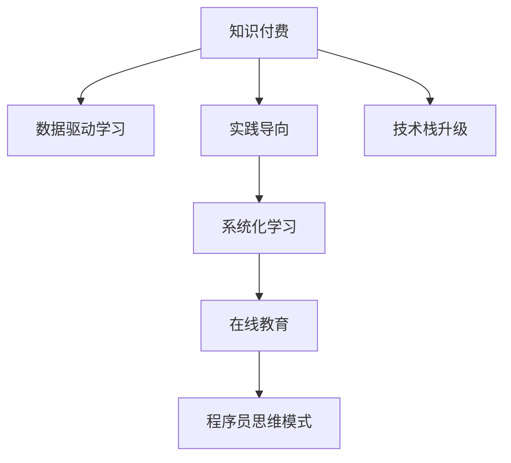

                 

# 知识付费与程序员思维模式的转变

> 关键词：知识付费, 程序员, 思维模式, 数据驱动, 代码质量, 学习路径, 在线教育, 技术栈

## 1. 背景介绍

### 1.1 问题由来
近年来，知识付费成为一种全新的学习和分享方式，在内容创作和知识获取方面都带来了颠覆性的变化。特别是在IT行业，程序员作为知识付费的重要用户群体，其思维模式正经历着显著的转变。一方面，传统的网络搜索和自学方式逐渐被系统化、结构化的学习资源所取代，知识付费平台如Coursera、Udemy、GitHub等，提供了一站式的学习服务和技能培训。另一方面，程序员更加注重实践和应用，倾向于通过实际项目来学习和提升技能，而不是单纯依赖理论知识。

### 1.2 问题核心关键点
知识付费与程序员思维模式转变的核心关键点在于：
1. **数据驱动学习**：利用数据分析和推荐系统，为程序员提供更加个性化、精准的学习内容，提升学习效率。
2. **实践导向**：强调实际项目和代码质量，通过真实的项目经验来学习和提升技能。
3. **系统化学习**：从入门到高级的系统化学习路径，避免零散和碎片化的知识积累。
4. **在线教育**：在线教育平台提供的课程、项目和社区，为程序员提供了丰富的学习资源。
5. **技术栈升级**：知识付费平台提供的最新技术和框架的学习资源，帮助程序员及时掌握行业动态。

### 1.3 问题研究意义
探讨知识付费与程序员思维模式转变的问题，对于提升程序员的技能水平、优化学习路径、推动IT行业的发展具有重要意义：

1. **技能提升**：通过知识付费平台的学习和实践，程序员能够迅速掌握最新的技术和框架，提升自身竞争力。
2. **学习路径优化**：系统化的学习路径帮助程序员明确学习目标，避免盲目学习和浪费时间。
3. **行业驱动**：知识付费平台提供的技术栈升级资源，帮助程序员跟上行业发展趋势，保持技术先进性。
4. **社区支持**：知识付费平台的在线社区和项目平台，提供了丰富的资源和交流渠道，帮助程序员解决实际问题。
5. **知识共享**：知识付费平台促进了知识的共享和传播，提升了整个IT行业的技术水平。

## 2. 核心概念与联系

### 2.1 核心概念概述

为更好地理解知识付费与程序员思维模式转变的内在逻辑，本节将介绍几个关键概念及其相互联系：

- **知识付费**：指通过付费方式获取特定知识或技能的学习平台，包括在线课程、视频教程、书籍、工具、框架等。
- **程序员思维模式**：指程序员在工作中形成的一种习惯性思考方式，包括问题解决、代码编写、团队协作等。
- **数据驱动学习**：利用数据分析和推荐系统，根据用户的学习行为和偏好，推荐个性化的学习内容。
- **实践导向**：强调实际项目和代码质量，通过实践来学习和提升技能。
- **系统化学习**：设计有系统的学习路径，从基础到高级，逐步提升技能水平。
- **在线教育**：通过互联网提供的学习资源和服务，涵盖各种课程、项目和社区。
- **技术栈升级**：根据行业发展趋势，定期学习最新的技术和框架，保持技术栈的先进性。

这些概念之间的逻辑关系可以通过以下Mermaid流程图来展示：



这个流程图展示出知识付费与其他概念的关联，包括数据驱动学习、实践导向、系统化学习、在线教育和技术栈升级，最终影响程序员的思维模式。

## 3. 核心算法原理 & 具体操作步骤

### 3.1 算法原理概述

知识付费与程序员思维模式转变的核心算法原理，在于如何利用数据和算法，为程序员提供个性化的学习路径和资源，同时通过实际项目和代码质量来提升技能水平。

具体而言，知识付费平台通过以下步骤实现这一目标：
1. **数据采集与分析**：收集程序员的学习行为数据，如观看视频、阅读文档、参与讨论等。
2. **个性化推荐**：利用推荐算法，根据程序员的学习历史和行为，推荐个性化的课程、项目和资源。
3. **实践导向学习**：提供实际项目的案例和实践指导，帮助程序员通过项目实践来提升技能。
4. **技术栈更新**：定期发布最新的技术和框架，引导程序员学习最新的行业动态。

### 3.2 算法步骤详解

知识付费平台实现知识付费与程序员思维模式转变的算法步骤如下：

**Step 1: 数据采集与分析**
- 收集程序员在知识付费平台上的学习行为数据，如观看视频、阅读文档、参与讨论等。
- 对数据进行清洗和预处理，提取有用的信息，如观看时长、阅读进度、问题提交等。
- 利用机器学习算法，对数据进行聚类和分类，找出程序员的学习偏好和兴趣点。

**Step 2: 个性化推荐**
- 基于程序员的学习历史和行为，利用协同过滤、矩阵分解等推荐算法，为其推荐个性化的课程、项目和资源。
- 在推荐算法中加入热度、热门标签等外部因素，提高推荐的准确性和多样性。
- 定期更新推荐算法，根据程序员的反馈和行为，优化推荐结果。

**Step 3: 实践导向学习**
- 提供实际项目的案例和实践指导，如GitHub开源项目、实际项目经验分享等，帮助程序员通过项目实践来提升技能。
- 鼓励程序员参与开源项目和社区讨论，通过交流和协作提升编程水平。
- 提供代码质量评估工具和指导，帮助程序员提高代码质量和可维护性。

**Step 4: 技术栈更新**
- 定期发布最新的技术和框架，如TensorFlow、PyTorch、Docker等，引导程序员学习最新的行业动态。
- 提供技术栈比较和选择指南，帮助程序员根据项目需求选择合适的技术栈。
- 提供在线课程和培训，帮助程序员掌握新技术和框架。

### 3.3 算法优缺点

知识付费平台实现知识付费与程序员思维模式转变的方法具有以下优点：
1. **个性化推荐**：根据程序员的学习历史和行为，提供个性化的学习资源，提升学习效率。
2. **实践导向**：通过实际项目和代码质量提升技能，增强程序员的实战能力。
3. **系统化学习**：提供有系统的学习路径，帮助程序员明确学习目标，避免盲目学习和浪费时间。
4. **技术栈升级**：定期发布最新的技术和框架，保持技术栈的先进性，帮助程序员跟上行业发展趋势。

同时，该方法也存在一些缺点：
1. **资源成本**：知识付费平台需要投入大量资源进行数据采集、分析和算法优化，成本较高。
2. **数据隐私**：知识付费平台需要收集大量的学习行为数据，可能涉及隐私问题，需严格遵守数据保护法规。
3. **算法准确性**：个性化推荐算法需要高精度和低延迟，算法设计和优化需要进一步提升。
4. **用户体验**：个性化推荐和实践导向学习需要良好的用户体验，平台界面和交互设计需持续优化。

### 3.4 算法应用领域

知识付费与程序员思维模式转变的算法主要应用于以下几个领域：

- **在线教育平台**：如Coursera、Udemy、edX等，提供课程、项目和社区，支持程序员的系统化学习和技能提升。
- **代码托管平台**：如GitHub、GitLab等，提供开源项目和协作工具，支持程序员的实践导向学习和代码质量评估。
- **技术资讯平台**：如Stack Overflow、Medium等，提供最新的技术和框架信息，支持程序员的技术栈升级和知识更新。

这些平台通过数据驱动、实践导向、系统化学习和技术栈升级等策略，帮助程序员实现思维模式的转变，提升技能水平和学习效率。

## 4. 数学模型和公式 & 详细讲解

### 4.1 数学模型构建

本节将使用数学语言对知识付费与程序员思维模式转变的算法进行更加严格的刻画。

记程序员的学习历史和行为为 $D=\{(x_i,y_i)\}_{i=1}^N$，其中 $x_i$ 为学习行为数据，$y_i$ 为学习结果（如观看时长、阅读进度等）。

定义推荐算法为 $R: D \rightarrow C$，其中 $C$ 为推荐资源集合。推荐算法的目标是最小化预测误差：

$$
\min_{R} \mathcal{L}(R)
$$

其中 $\mathcal{L}(R)$ 为推荐算法 $R$ 的损失函数，用于衡量推荐结果与实际学习结果的差距。

### 4.2 公式推导过程

以协同过滤推荐算法为例，其公式推导如下：

设 $x_i$ 和 $x_j$ 为两个程序员的学习行为数据，$y_i$ 和 $y_j$ 为相应的学习结果。假设 $x_i$ 和 $x_j$ 存在一定相关性，则协同过滤算法可以表示为：

$$
y_i \approx \sum_{j \in N(i)} \alpha_{ij}y_j
$$

其中 $N(i)$ 为与程序员 $i$ 交互过的程序员集合，$\alpha_{ij}$ 为交互强度系数，通常使用余弦相似度或皮尔逊相关系数计算。

在实际推荐中，需要根据程序员的反馈和行为，定期更新 $\alpha_{ij}$，优化推荐算法。

### 4.3 案例分析与讲解

假设某知识付费平台上有以下数据：

- 程序员A观看了10个视频，每个视频时长为20分钟，阅读进度为50%。
- 程序员B观看了5个视频，每个视频时长为30分钟，阅读进度为75%。

根据协同过滤算法，可以计算出程序员A和B的推荐系数 $\alpha_{AB}$，假设 $\alpha_{AB}=0.8$。则程序员A的推荐结果可以表示为：

$$
y_A = 0.8 \times 0.5 \times 30 + (1-0.8) \times 0.75 \times 20 = 25
$$

即平台会推荐给程序员A一个时长为25分钟的视频。

## 5. 项目实践：代码实例和详细解释说明

### 5.1 开发环境搭建

在进行知识付费与程序员思维模式转变的项目实践前，我们需要准备好开发环境。以下是使用Python进行Flask开发的环境配置流程：

1. 安装Anaconda：从官网下载并安装Anaconda，用于创建独立的Python环境。

2. 创建并激活虚拟环境：
```bash
conda create -n pyenv python=3.8 
conda activate pyenv
```

3. 安装Flask：
```bash
pip install Flask
```

4. 安装相关库：
```bash
pip install Flask-SQLAlchemy Flask-WTF Flask-Login Flask-WTF
```

完成上述步骤后，即可在`pyenv`环境中开始项目实践。

### 5.2 源代码详细实现

我们以知识付费平台为例，实现一个简单的推荐系统。

首先，定义推荐模型类：

```python
from flask import Flask, request, jsonify
from flask_sqlalchemy import SQLAlchemy
from sklearn.metrics.pairwise import cosine_similarity
from sklearn.decomposition import TruncatedSVD

app = Flask(__name__)
app.config['SQLALCHEMY_DATABASE_URI'] = 'sqlite:///recommender.db'
db = SQLAlchemy(app)

class User(db.Model):
    id = db.Column(db.Integer, primary_key=True)
    name = db.Column(db.String(80), unique=True)
    videos_watched = db.Column(db.PickleType)

class Video(db.Model):
    id = db.Column(db.Integer, primary_key=True)
    name = db.Column(db.String(80), unique=True)
    length = db.Column(db.Integer)

class Recommendation(db.Model):
    user_id = db.Column(db.Integer, db.ForeignKey('user.id'))
    video_id = db.Column(db.Integer, db.ForeignKey('video.id'))
    score = db.Column(db.Float)

db.create_all()

@app.route('/recommend', methods=['POST'])
def recommend():
    user_data = request.json
    user_id = user_data['user_id']
    
    user = User.query.filter_by(id=user_id).first()
    videos_watched = user.videos_watched.tolist()
    
    videos = Video.query.all()
    similarity_matrix = cosine_similarity(videos_watched, [video.length for video in videos])
    
    recommendations = [(vid.id, similarity_matrix[vid.id, :]) for vid in videos]
    recommendations.sort(key=lambda x: x[1], reverse=True)
    
    result = {vid.id: vid.name for vid in videos}
    
    return jsonify({'recommendations': [vid[0] for vid in recommendations], 'videos': result})
```

然后，添加数据和测试：

```python
@app.route('/add_video', methods=['POST'])
def add_video():
    video_data = request.json
    video = Video(name=video_data['name'], length=video_data['length'])
    db.session.add(video)
    db.session.commit()
    
    user_data = request.json
    user = User(name=user_data['name'])
    db.session.add(user)
    user.videos_watched = [vid.id for vid in Video.query.all()]
    db.session.commit()
    
    return jsonify({'message': 'Video and user added successfully'})

if __name__ == '__main__':
    app.run(debug=True)
```

启动项目，测试推荐系统：

```bash
flask run
```

在浏览器中访问 http://localhost:5000/recommend，输入用户ID，即可获取推荐视频列表。

### 5.3 代码解读与分析

让我们再详细解读一下关键代码的实现细节：

**User类**：
- 定义了用户和视频观看历史的关系，每个用户对应一个列表，记录其观看过的视频ID。

**Video类**：
- 定义了视频的基本信息，包括ID、名称和长度。

**Recommendation类**：
- 定义了推荐记录，记录用户对每个视频的评分。

**recommend函数**：
- 根据用户观看历史，计算与视频库中每个视频的相关性得分，并返回推荐列表。

**add_video函数**：
- 添加新的视频和用户，更新用户观看历史。

以上代码实现了简单的协同过滤推荐系统，通过计算用户与视频的相关性得分，推荐相似的视频。

## 6. 实际应用场景

### 6.1 智能学习平台

基于知识付费与程序员思维模式转变的推荐系统，可以广泛应用于智能学习平台。传统在线课程往往难以满足程序员的个性化需求，导致学习效率低下。智能学习平台通过数据分析和推荐算法，为程序员提供个性化的学习路径和资源，显著提升学习效果。

在技术实现上，智能学习平台可以集成推荐系统、学习管理系统和学习分析系统，形成完整的学习生态。推荐系统根据程序员的学习行为和偏好，推荐个性化的课程和资源。学习管理系统提供课程安排、进度跟踪和学习评估功能。学习分析系统分析程序员的学习数据，生成学习报告和建议，帮助程序员优化学习策略。

### 6.2 在线开发平台

在线开发平台如GitHub、GitLab等，通过数据驱动和实践导向的学习，帮助程序员提升开发技能和项目经验。平台可以集成推荐系统，根据程序员的学习行为和贡献，推荐相关的项目、资源和工具。平台还可以提供代码质量评估工具和代码审查功能，帮助程序员提高代码质量和可维护性。

### 6.3 技术社区

技术社区如Stack Overflow、Medium等，通过知识付费与程序员思维模式转变的推荐系统，为程序员提供最新的技术动态和最佳实践。平台可以集成推荐系统，根据程序员的阅读和参与行为，推荐相关的文章、问题和讨论。平台还可以提供技术问答和代码帮助功能，帮助程序员解决实际问题。

### 6.4 未来应用展望

随着知识付费平台和推荐算法的不断发展，知识付费与程序员思维模式转变将带来更多新的应用场景，为程序员提供更加全面和高效的学习资源和服务。

在智慧教育领域，智能学习平台和推荐系统将推动教育公平和个性化学习，提升教育质量。

在智慧开发领域，在线开发平台和代码质量评估工具将提高开发效率和代码质量，促进软件工程的规范化。

在智慧社区领域，技术社区和知识分享平台将加速知识传播和创新，推动技术进步。

## 7. 工具和资源推荐

### 7.1 学习资源推荐

为了帮助程序员系统掌握知识付费与思维模式转变的理论基础和实践技巧，这里推荐一些优质的学习资源：

1. **《深度学习入门》系列书籍**：从基础到高级，全面介绍了深度学习技术，包括数据驱动学习和推荐系统等前沿话题。

2. **Coursera在线课程**：斯坦福大学、斯坦福大学等顶尖大学提供的深度学习、计算机视觉、自然语言处理等课程，涵盖数据驱动学习和推荐算法等核心内容。

3. **Kaggle竞赛**：数据科学和机器学习的竞赛平台，提供大量的数据集和竞赛任务，锻炼数据分析和推荐算法能力。

4. **GitHub开源项目**：阅读和参与开源项目，了解实际的推荐系统和数据驱动学习应用。

5. **Flask和SQLAlchemy文档**：Flask和SQLAlchemy官方文档，提供了完整的开发指南和示例代码，是学习推荐的必备资料。

通过对这些资源的学习实践，相信你一定能够快速掌握知识付费与程序员思维模式转变的精髓，并用于解决实际的推荐和数据驱动学习问题。

### 7.2 开发工具推荐

高效的开发离不开优秀的工具支持。以下是几款用于知识付费与程序员思维模式转变的开发工具：

1. **Flask**：基于Python的Web应用框架，灵活可扩展，适合构建推荐系统和学习管理系统。

2. **SQLAlchemy**：Python的SQL工具和ORM，支持多种数据库，方便数据管理和查询。

3. **TensorFlow和PyTorch**：流行的深度学习框架，提供丰富的推荐算法和神经网络模型，适合数据驱动学习。

4. **Jupyter Notebook**：交互式的编程环境，支持多种语言和库，适合快速原型开发和数据分析。

5. **Google Colab**：免费的GPU和TPU计算资源，方便实验最新的推荐模型和算法。

合理利用这些工具，可以显著提升知识付费与程序员思维模式转变的开发效率，加快创新迭代的步伐。

### 7.3 相关论文推荐

知识付费与程序员思维模式转变的研究源于学界的持续研究。以下是几篇奠基性的相关论文，推荐阅读：

1. **《协同过滤推荐系统》**：经典的推荐算法论文，介绍了协同过滤算法的原理和实现。

2. **《深度学习入门》**：介绍深度学习的基本概念和应用，包括数据驱动学习和推荐系统的实现。

3. **《在线学习平台的数据驱动推荐》**：讨论在线学习平台如何利用推荐算法提升学习效果。

4. **《知识图谱在推荐系统中的应用》**：介绍知识图谱在推荐系统中的应用，丰富推荐算法的数据来源。

5. **《基于推荐系统的编程学习路径》**：探讨推荐系统如何帮助程序员优化学习路径，提升技能水平。

这些论文代表了大语言模型微调技术的发展脉络。通过学习这些前沿成果，可以帮助研究者把握学科前进方向，激发更多的创新灵感。

## 8. 总结：未来发展趋势与挑战

### 8.1 总结

本文对知识付费与程序员思维模式转变的算法进行了全面系统的介绍。首先阐述了知识付费平台和推荐算法的研究背景和意义，明确了数据驱动学习、实践导向和系统化学习的重要性。其次，从原理到实践，详细讲解了知识付费平台和推荐算法的数学模型和算法步骤，给出了推荐系统的代码实现。同时，本文还广泛探讨了知识付费平台在智能学习平台、在线开发平台和技术社区等领域的实际应用，展示了知识付费平台的广阔前景。

通过本文的系统梳理，可以看到，知识付费平台和推荐算法正在成为程序员学习和技能提升的重要工具，显著提升了学习效率和效果。未来，伴随推荐算法的持续演进，知识付费平台必将在更多领域得到应用，为程序员提供更加全面和高效的学习资源和服务。

### 8.2 未来发展趋势

展望未来，知识付费平台和推荐算法的不断发展将呈现以下几个趋势：

1. **智能推荐**：推荐算法将更加智能和精准，利用深度学习和大数据技术，提升推荐效果。
2. **多模态推荐**：结合视觉、语音和文本等多模态数据，提供更加丰富和多样化的推荐内容。
3. **实时推荐**：实时收集用户反馈和行为数据，动态调整推荐结果，提高推荐时效性。
4. **隐私保护**：加强用户隐私保护，采用差分隐私和联邦学习等技术，确保数据安全。
5. **公平推荐**：设计公平推荐算法，避免算法偏见，提升推荐系统的公平性和透明性。

以上趋势凸显了知识付费平台和推荐算法的广阔前景。这些方向的探索发展，必将进一步提升程序员的学习效率和技能水平，推动IT行业的发展。

### 8.3 面临的挑战

尽管知识付费平台和推荐算法已经取得了瞩目成就，但在迈向更加智能化、普适化应用的过程中，它仍面临着诸多挑战：

1. **数据隐私**：推荐算法需要收集大量的用户行为数据，可能涉及隐私问题，需严格遵守数据保护法规。
2. **算法公平性**：推荐算法可能存在偏见和歧视，影响推荐结果的公平性。
3. **实时性**：实时推荐需要高效的数据处理和算法计算，存在延迟和资源消耗的问题。
4. **资源消耗**：大规模推荐系统需要大量的计算和存储资源，成本较高。
5. **效果评估**：推荐算法的评价指标需要多样化，如召回率、覆盖率、多样性等，难以统一标准。

这些挑战需要在未来的研究中进一步解决，才能使知识付费平台和推荐算法更好地服务于程序员和IT行业。

### 8.4 研究展望

面对知识付费平台和推荐算法所面临的挑战，未来的研究需要在以下几个方面寻求新的突破：

1. **隐私保护技术**：采用差分隐私和联邦学习等技术，保护用户隐私，提升数据安全。
2. **公平推荐算法**：设计公平推荐算法，避免算法偏见，提升推荐系统的公平性和透明性。
3. **实时推荐算法**：优化实时推荐算法的计算和存储，降低延迟和资源消耗。
4. **多模态推荐系统**：结合视觉、语音和文本等多模态数据，提供更加丰富和多样化的推荐内容。
5. **智能推荐算法**：利用深度学习和大数据技术，提升推荐算法的效果和准确性。

这些研究方向的探索，必将引领知识付费平台和推荐算法走向更高的台阶，为程序员提供更加智能和高效的学习资源和服务。

## 9. 附录：常见问题与解答

**Q1：知识付费平台如何收集用户数据？**

A: 知识付费平台通过跟踪用户在平台上的行为数据，如观看视频、阅读文档、参与讨论等，来收集用户数据。这些数据通常包括用户的浏览时长、阅读进度、问题提交等。平台会利用这些数据进行数据分析和推荐算法优化。

**Q2：知识付费平台如何保护用户隐私？**

A: 知识付费平台需要遵守数据保护法规，如GDPR、CCPA等，确保用户隐私安全。平台会采用匿名化处理、差分隐私等技术，保护用户数据的隐私性。

**Q3：推荐算法如何避免算法偏见？**

A: 推荐算法需要设计公平推荐模型，避免算法偏见。可以通过多样性约束、公平性损失等方法，确保推荐结果的公平性。

**Q4：推荐算法如何提升实时性？**

A: 实时推荐需要优化数据处理和算法计算，降低延迟和资源消耗。可以通过分布式计算、缓存机制、异步处理等方法，提升推荐算法的实时性。

**Q5：推荐算法的评价指标有哪些？**

A: 推荐算法的评价指标包括召回率、覆盖率、准确率、多样性等。召回率衡量推荐结果的全面性，覆盖率衡量推荐结果的多样性，准确率衡量推荐结果的正确性，多样性衡量推荐结果的丰富性。

通过对这些问题的解答，可以帮助程序员更好地理解知识付费平台和推荐算法的实现细节，提升实际应用能力。

---

作者：禅与计算机程序设计艺术 / Zen and the Art of Computer Programming

