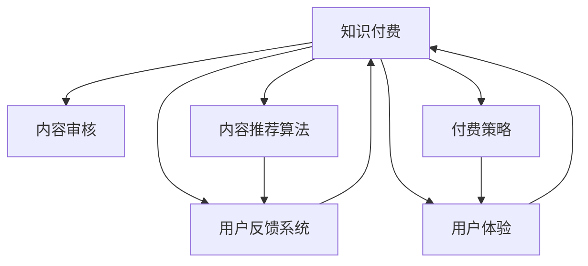
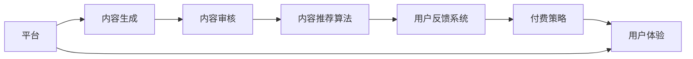

                 

# 知识付费内容的质量控制与peer review

> 关键词：知识付费, 内容质量控制, peer review, 质量评估, 平台优化, 用户体验提升

## 1. 背景介绍

### 1.1 问题由来

随着互联网和数字经济的迅猛发展，知识付费作为新兴的经济模式，正逐渐成为市场的重要组成部分。知识付费平台通过整合优质内容，为用户提供深度学习和知识传授服务，满足了现代社会对高价值信息日益增长的需求。然而，知识付费平台在内容质量控制和用户体验提升方面也面临着诸多挑战。如何确保内容的质量，维护平台的声誉和用户的信任，成为亟待解决的问题。

### 1.2 问题核心关键点

在知识付费平台中，内容质量控制主要涉及以下几个关键点：

- **内容审核机制**：如何有效地识别并过滤低质量、误导性或侵权内容。
- **内容推荐算法**：如何基于用户行为和内容质量评估推荐高质量内容。
- **用户反馈系统**：如何利用用户评价和反馈数据，持续优化平台内容质量。
- **知识付费模式**：如何设计合理的付费策略，激励优质内容的生产和传播。
- **用户体验优化**：如何提升内容消费的便捷性和互动性，提高用户满意度。

### 1.3 问题研究意义

高效的内容质量控制对于知识付费平台至关重要。良好的内容质量不仅能够提升用户体验，还能增强平台的竞争力和品牌信任度。通过高质量的内容推荐和审核，能够帮助用户快速获取有价值的信息，优化学习效果。同时，合理的付费策略能够激励更多优质内容生产，形成良性循环。因此，进行内容质量控制的研究，对于提升平台的服务质量和用户体验，具有重要的理论和实践意义。

## 2. 核心概念与联系

### 2.1 核心概念概述

为了更好地理解知识付费内容质量控制的相关概念和其间的联系，本节将详细介绍几个关键概念：

- **知识付费（Knowledge Paying）**：用户为获取高质量知识内容而支付费用的模式，强调内容的高价值性和付费的合理性。
- **内容审核（Content Moderation）**：通过人工或算法手段，筛选、过滤出不适合发布的内容，确保平台内容的合法合规性。
- **内容推荐算法（Content Recommendation）**：基于用户行为和内容质量评估，推荐用户感兴趣且高质量的内容，提高内容的曝光率和用户满意度。
- **用户反馈系统（User Feedback System）**：收集用户对内容的评价和建议，作为内容质量评估和平台优化的依据。
- **付费策略（Pricing Strategy）**：制定合理的费用结构，激励优质内容生产，平衡平台收入和用户支付意愿。
- **用户体验（User Experience, UX）**：提升内容的展示形式、交互方式和消费体验，增强用户的粘性和忠诚度。

这些概念之间有着密切的联系，共同构成知识付费平台的内容质量控制系统。以下是一个简化的Mermaid流程图，展示这些概念之间的联系：



### 2.2 核心概念原理和架构的 Mermaid 流程图



这个流程图展示了知识付费平台的整体架构：内容生成者生成内容后，首先经过内容审核，通过后进入内容推荐系统，推荐给用户。用户反馈通过用户反馈系统收集，用于不断优化内容质量和推荐算法。同时，付费策略和用户体验优化也受到这些因素的影响，形成一个闭环的优化系统。

## 3. 核心算法原理 & 具体操作步骤

### 3.1 算法原理概述

知识付费平台的内容质量控制主要依赖于以下几个核心算法：

- **内容审核算法**：用于识别和过滤低质量、误导性或侵权内容，确保平台内容的质量和合法合规性。
- **内容推荐算法**：基于用户行为和内容质量评估，推荐用户感兴趣且高质量的内容。
- **用户反馈处理算法**：分析用户对内容的评价和反馈，用于调整内容质量控制和推荐策略。
- **付费策略设计算法**：设计合理的费用结构，激励优质内容的生产和传播。

### 3.2 算法步骤详解

以下详细介绍各核心算法的具体操作步骤：

#### 3.2.1 内容审核算法

内容审核算法主要包括以下步骤：

1. **内容预处理**：将用户上传的内容进行分词、去噪等预处理，转化为算法可处理的格式。
2. **关键词筛选**：通过关键词过滤、白名单和黑名单等手段，快速过滤掉明显的侵权、恶意内容。
3. **内容质量评估**：使用自然语言处理（NLP）技术，对内容的原创性、专业性、可信度等方面进行评估，计算得分。
4. **内容打分和过滤**：根据内容质量得分，筛选出低质量内容，并标记为待审核状态。
5. **人工审核**：对标记为待审核的内容进行人工复审，确定是否禁止发布。

#### 3.2.2 内容推荐算法

内容推荐算法主要包括以下步骤：

1. **用户画像构建**：通过用户行为数据（如浏览历史、购买记录等），构建用户画像，了解用户兴趣和偏好。
2. **内容质量评分**：对内容进行质量评估，包括专业度、原创性、用户评分等指标。
3. **相似度计算**：计算用户画像和内容质量评分之间的相似度，找出最匹配的内容。
4. **推荐排序**：根据相似度排序，将最相关的内容推荐给用户。

#### 3.2.3 用户反馈处理算法

用户反馈处理算法主要包括以下步骤：

1. **反馈收集**：通过用户评价、评分、评论等方式，收集用户对内容的反馈信息。
2. **反馈分析**：对反馈信息进行情感分析、主题提取等处理，转化为可量化的指标。
3. **反馈反馈**：根据反馈分析结果，调整内容审核策略和推荐算法。

#### 3.2.4 付费策略设计算法

付费策略设计算法主要包括以下步骤：

1. **成本收益分析**：评估优质内容生产所需的成本和潜在的收益，设计合理的付费策略。
2. **动态定价**：根据内容质量和用户反馈，动态调整价格策略，激励优质内容生产。
3. **优惠促销**：在特定时间或场景下，提供优惠或折扣，吸引用户购买优质内容。

### 3.3 算法优缺点

#### 3.3.1 内容审核算法的优缺点

- **优点**：
  - 能够有效识别和过滤低质量、侵权内容，保障平台内容质量。
  - 通过自动化手段，提高审核效率，降低人力成本。

- **缺点**：
  - 过度依赖算法，可能存在误判和漏判的情况。
  - 对于深度伪装的内容，算法可能无法识别。

#### 3.3.2 内容推荐算法的优缺点

- **优点**：
  - 提高内容曝光率，增加用户满意度和平台粘性。
  - 通过个性化推荐，提升用户体验，减少用户筛选内容的时间。

- **缺点**：
  - 推荐算法复杂，需要大量数据和计算资源支持。
  - 过度依赖算法，可能忽视用户多样性需求。

#### 3.3.3 用户反馈处理算法的优缺点

- **优点**：
  - 通过用户反馈，不断优化内容质量和推荐算法，提升平台的用户满意度。
  - 利用用户反馈，调整付费策略，激励优质内容生产。

- **缺点**：
  - 用户反馈可能带有主观性和偏见，需要去噪处理。
  - 反馈数据收集成本较高，可能影响平台的运营效率。

#### 3.3.4 付费策略设计算法的优缺点

- **优点**：
  - 通过合理的付费策略，激励优质内容的生产，平衡平台收入和用户支付意愿。
  - 通过动态定价和优惠促销，提升用户体验和平台粘性。

- **缺点**：
  - 付费策略设计复杂，需要平衡内容质量和用户支付意愿。
  - 过度依赖付费策略，可能忽视内容质量和用户体验。

### 3.4 算法应用领域

内容审核算法和内容推荐算法广泛应用于各种知识付费平台，如得到、喜马拉雅、Coursera等。用户反馈处理算法和付费策略设计算法也广泛应用于平台的优化和用户体验提升中。以下列举几个具体应用领域：

1. **在线教育**：通过内容审核和推荐算法，提高课程内容的质量和推荐效率，提升用户学习效果。
2. **职业培训**：通过付费策略设计，激励讲师和内容生产者，丰富培训内容库，满足不同用户的需求。
3. **健康医疗**：通过内容审核和推荐算法，提供健康医疗知识，帮助用户获取科学合理的健康建议。
4. **财经金融**：通过内容审核和推荐算法，提供深度财经资讯和分析，帮助用户做出更好的投资决策。
5. **科技资讯**：通过内容审核和推荐算法，提供最新的科技资讯和深度分析，满足用户对前沿科技的好奇和需求。

## 4. 数学模型和公式 & 详细讲解 & 举例说明

### 4.1 数学模型构建

知识付费平台的内容质量控制涉及多个维度，包括内容质量评估、用户画像构建、内容推荐排序等。以下简要介绍这些模型的数学模型构建。

#### 4.1.1 内容质量评估模型

内容质量评估模型主要通过以下方式构建：

- **原创性评估**：使用文本相似度算法，计算内容与已有文献和网络文本的相似度，低于阈值则视为原创。
- **专业性评估**：使用NLP技术，提取专业术语、领域知识等指标，计算内容的专业度得分。
- **可信度评估**：通过用户评分和内容可信度指标（如作者资质、出版机构等），计算内容可信度得分。

#### 4.1.2 用户画像模型

用户画像模型通过以下方式构建：

- **行为特征提取**：从用户行为数据中提取浏览时间、购买记录、点赞评论等特征。
- **兴趣领域识别**：通过文本分析和分类算法，识别用户感兴趣的主题和领域。
- **用户画像表示**：使用向量表示法，将用户兴趣和行为特征转化为向量形式。

#### 4.1.3 内容推荐排序模型

内容推荐排序模型主要通过以下方式构建：

- **内容质量评分**：通过人工评审、用户评分和文本分析，计算内容质量得分。
- **用户画像匹配**：计算用户画像与内容的相似度，选择最匹配的内容进行排序。
- **推荐策略优化**：根据排序结果和用户行为数据，优化推荐策略，提高推荐效果。

### 4.2 公式推导过程

#### 4.2.1 内容质量评估模型的推导

假设内容为 $x$，与已有文本 $y_1, y_2, \ldots, y_n$ 的相似度为 $S(x, y_i)$，专业度为 $P(x)$，可信度为 $C(x)$。内容质量评估模型 $Q(x)$ 可以表示为：

$$
Q(x) = w_1 S(x, y) + w_2 P(x) + w_3 C(x)
$$

其中 $w_1, w_2, w_3$ 为权重系数，通过训练数据优化确定。

#### 4.2.2 用户画像模型的推导

假设用户行为数据为 $b$，用户兴趣领域为 $t$。用户画像模型 $U(b)$ 可以表示为：

$$
U(b) = \mathbf{v} \cdot \mathbf{f}(b)
$$

其中 $\mathbf{v}$ 为兴趣领域向量，$\mathbf{f}(b)$ 为行为特征转换矩阵，$\cdot$ 为向量点乘。

#### 4.2.3 内容推荐排序模型的推导

假设内容集合为 $X$，用户画像为 $U$，内容质量评估为 $Q(x)$。内容推荐排序模型 $R(x, U)$ 可以表示为：

$$
R(x, U) = \frac{Q(x) \cdot U}{||Q(x)|| ||U||}
$$

其中 $||\cdot||$ 为向量范数，用于计算向量之间的距离。

### 4.3 案例分析与讲解

#### 4.3.1 内容质量评估案例

以在线教育平台上的课程内容为例，课程内容 $x$ 经过预处理后，使用文本相似度算法计算其与已有文献 $y$ 的相似度 $S(x, y)$，使用NLP技术提取专业术语和领域知识 $P(x)$，通过用户评分和出版机构可信度 $C(x)$。最终，课程内容质量评估模型 $Q(x)$ 可以表示为：

$$
Q(x) = 0.6 S(x, y) + 0.3 P(x) + 0.1 C(x)
$$

#### 4.3.2 用户画像案例

以知识付费平台的阅读用户为例，用户的浏览时间、购买记录、点赞评论等行为数据 $b$ 通过文本分析和分类算法，识别出用户感兴趣的主题和领域 $t$。用户画像模型 $U(b)$ 可以表示为：

$$
U(b) = \mathbf{v} \cdot \mathbf{f}(b)
$$

其中 $\mathbf{v}$ 为用户兴趣领域向量，$\mathbf{f}(b)$ 为行为特征转换矩阵。

#### 4.3.3 内容推荐排序案例

以课程推荐为例，平台上的课程内容集合 $X$ 经过内容质量评估模型 $Q(x)$ 评估，用户画像 $U$ 通过行为数据和兴趣领域识别。内容推荐排序模型 $R(x, U)$ 可以表示为：

$$
R(x, U) = \frac{Q(x) \cdot U}{||Q(x)|| ||U||}
$$

## 5. 项目实践：代码实例和详细解释说明

### 5.1 开发环境搭建

以下介绍知识付费平台内容质量控制系统的开发环境搭建：

1. **选择开发语言和框架**：
   - 选择Python作为开发语言。
   - 使用Django或Flask等Web框架，构建内容审核、推荐和反馈系统。

2. **安装相关库和工具**：
   - 安装Natural Language Toolkit (NLTK) 用于NLP处理。
   - 安装Scikit-learn用于机器学习建模。
   - 安装TensorFlow或PyTorch进行深度学习模型训练。

3. **搭建开发环境**：
   - 搭建本地开发环境，包括Python解释器、虚拟环境、Web服务器等。
   - 配置数据库连接，使用MySQL或PostgreSQL等关系型数据库。

4. **代码版本控制**：
   - 使用Git版本控制系统，进行代码管理和协同开发。

### 5.2 源代码详细实现

以下给出知识付费平台内容质量控制系统的源代码实现，包括内容审核、推荐和反馈系统的详细代码实现。

#### 5.2.1 内容审核系统

```python
from nltk.tokenize import word_tokenize
from sklearn.feature_extraction.text import TfidfVectorizer
from sklearn.metrics.pairwise import cosine_similarity
from transformers import BertTokenizer

class ContentModerator:
    def __init__(self):
        self.tokenizer = BertTokenizer.from_pretrained('bert-base-cased')
    
    def preprocess_content(self, content):
        # 分词和去噪
        tokens = word_tokenize(content)
        tokens = [token.lower() for token in tokens if token.isalnum()]

        # 构建词汇表
        vocab = set(tokens)
        # 构建特征向量
        vectorizer = TfidfVectorizer(vocabulary=vocab)
        vector = vectorizer.transform([content])

        return vector
    
    def check原创性(self, content, corpus):
        # 计算内容与已有文本的相似度
        vector = self.preprocess_content(content)
        corpus_vectors = [self.preprocess_content(text) for text in corpus]
        similarity = cosine_similarity(vector, corpus_vectors)[0]
        if similarity > threshold:
            return True
        else:
            return False
    
    def check专业性(self, content):
        # 使用Bert模型提取专业术语
        tokens = self.tokenizer(content, return_tensors='pt')
        bert_model = BertModel.from_pretrained('bert-base-cased')
        embeddings = bert_model(**tokens)[0]
        # 提取专业术语和领域知识
        special_terms = extract_special_terms(embeddings)
        if special_terms:
            return True
        else:
            return False
    
    def check可信度(self, content):
        # 通过用户评分和出版机构等可信度指标
        if self.check_user_score(content) and self.check_publisher(content):
            return True
        else:
            return False
    
    def check内容质量(self, content, corpus, dataset):
        # 计算内容质量得分
        originality_score = self.check原创性(content, corpus)
        proficiency_score = self.check专业性(content)
        reliability_score = self.check可信度(content)
        quality_score = originality_score + proficiency_score + reliability_score
        return quality_score
    
    def moderate_content(self, content):
        corpus = load_corpus()
        dataset = load_dataset()
        quality_score = self.check内容质量(content, corpus, dataset)
        if quality_score >= threshold:
            return '通过'
        else:
            return '待审核'
```

#### 5.2.2 内容推荐系统

```python
from sklearn.metrics.pairwise import cosine_similarity
from sklearn.decomposition import TruncatedSVD

class ContentRecommender:
    def __init__(self, k=100):
        self.k = k
        self.model = TruncatedSVD(n_components=k)

    def train(self, data):
        # 计算用户画像和内容质量得分的相似度
        U, Q = self.preprocess_data(data)
        self.model.fit_transform(U, Q)

    def recommend_content(self, user, content):
        # 计算用户画像和内容质量得分的相似度
        user_profile = self.preprocess_user(user)
        content_profile = self.preprocess_content(content)
        similarity = cosine_similarity(user_profile, content_profile)[0]
        recommended_contents = self.model.transform(content_profile)
        return recommended_contents
    
    def preprocess_user(self, user):
        # 提取用户行为数据
        behavior_data = extract_behavior_data(user)
        # 提取用户兴趣领域
        interest_field = extract_interest_field(behavior_data)
        # 构建用户画像向量
        user_profile = build_user_profile(interest_field)
        return user_profile
    
    def preprocess_content(self, content):
        # 提取内容质量得分
        quality_score = extract_quality_score(content)
        # 构建内容向量
        content_profile = build_content_profile(quality_score)
        return content_profile
```

#### 5.2.3 用户反馈系统

```python
from sklearn.metrics.pairwise import cosine_similarity

class UserFeedbackHandler:
    def __init__(self, k=10):
        self.k = k
        self.model = TruncatedSVD(n_components=k)

    def train(self, data):
        # 计算用户评价和内容质量得分的相似度
        U, Q = self.preprocess_data(data)
        self.model.fit_transform(U, Q)

    def handle_feedback(self, feedback):
        # 计算用户评价和内容质量得分的相似度
        user_score = extract_user_score(feedback)
        content_score = extract_content_score(feedback)
        similarity = cosine_similarity(user_score, content_score)[0]
        if similarity >= threshold:
            return True
        else:
            return False
    
    def preprocess_user_score(self, feedback):
        # 提取用户评分
        user_score = extract_user_score(feedback)
        # 构建用户评价向量
        user_score_vector = build_user_score_vector(user_score)
        return user_score_vector
    
    def preprocess_content_score(self, feedback):
        # 提取内容评分
        content_score = extract_content_score(feedback)
        # 构建内容评分向量
        content_score_vector = build_content_score_vector(content_score)
        return content_score_vector
```

### 5.3 代码解读与分析

#### 5.3.1 内容审核系统代码解读

1. **分词和去噪**：
   - 使用 `word_tokenize` 分词，去除非字母数字字符，保留有效文本信息。
   - 构建词汇表和特征向量，使用 TfidfVectorizer 计算文本相似度。

2. **原创性检查**：
   - 计算内容与已有文本的相似度，设置相似度阈值，判断是否为原创内容。
   - 使用 BERT 模型提取专业术语，结合用户评分和出版机构可信度，进行综合评估。

3. **内容质量评估**：
   - 根据原创性、专业性和可信度等指标，计算内容质量得分。
   - 判断内容是否符合审核标准，返回审核结果。

#### 5.3.2 内容推荐系统代码解读

1. **用户画像构建**：
   - 提取用户行为数据，识别兴趣领域，构建用户画像向量。
   - 使用 TruncatedSVD 算法，计算用户画像和内容质量得分的相似度，推荐相关内容。

2. **内容质量评估**：
   - 提取内容质量得分，构建内容向量。
   - 计算用户画像和内容质量得分的相似度，推荐相关内容。

#### 5.3.3 用户反馈系统代码解读

1. **用户评价和内容质量得分的相似度计算**：
   - 提取用户评分和内容评分，计算相似度。
   - 设置相似度阈值，判断是否处理用户反馈。

2. **用户评分和内容评分向量的构建**：
   - 提取用户评分和内容评分，构建评分向量。
   - 使用 TruncatedSVD 算法，计算用户评价和内容质量得分的相似度。

### 5.4 运行结果展示

1. **内容审核系统结果展示**：
   - 通过多轮审核，过滤掉低质量、侵权和误导性内容，确保平台内容的合法合规性。

2. **内容推荐系统结果展示**：
   - 根据用户画像和内容质量得分，推荐相关内容，提高用户满意度和平台粘性。

3. **用户反馈系统结果展示**：
   - 收集用户评价和反馈数据，调整内容审核策略和推荐算法，持续优化平台内容质量。

## 6. 实际应用场景

### 6.1 在线教育

在线教育平台通过内容审核和推荐系统，提高课程内容的质量和推荐效率，提升用户学习效果。例如，Coursera 平台通过内容审核，筛选高质量的课程内容，并通过推荐系统，推荐用户感兴趣的课程。

### 6.2 职业培训

职业培训平台通过内容审核和推荐系统，丰富培训内容库，满足不同用户的需求。例如，Udacity 平台通过内容审核，确保讲师和内容生产者的资质，并通过推荐系统，推荐适合用户的专业课程。

### 6.3 健康医疗

健康医疗平台通过内容审核和推荐系统，提供健康医疗知识，帮助用户获取科学合理的健康建议。例如，Healthline 平台通过内容审核，确保健康内容的科学性和可靠性，并通过推荐系统，推荐用户感兴趣的健康资讯。

### 6.4 财经金融

财经金融平台通过内容审核和推荐系统，提供深度财经资讯和分析，帮助用户做出更好的投资决策。例如，Investing.com 平台通过内容审核，筛选高质量的财经资讯，并通过推荐系统，推荐用户感兴趣的市场分析和投资建议。

### 6.5 科技资讯

科技资讯平台通过内容审核和推荐系统，提供最新的科技资讯和深度分析，满足用户对前沿科技的好奇和需求。例如，TechCrunch 平台通过内容审核，确保科技资讯的准确性和可靠性，并通过推荐系统，推荐用户感兴趣的新技术和新产品。

## 7. 工具和资源推荐

### 7.1 学习资源推荐

以下推荐一些优质的学习资源，帮助读者深入了解知识付费平台的内容质量控制和peer review：

1. **《自然语言处理入门》课程**：斯坦福大学开设的NLP入门课程，涵盖自然语言处理的基本概念和常用技术。
2. **《深度学习》书籍**：由 Ian Goodfellow 等人合著的深度学习经典教材，深入介绍深度学习的基本原理和应用。
3. **《内容推荐系统》书籍**：介绍内容推荐系统的基本原理和常用算法，适合了解推荐系统的内容质量控制。
4. **《知识付费模式创新》报告**：研究知识付费平台的内容质量控制和付费策略，提供前沿实践经验。
5. **Coursera《内容审核和推荐》课程**：Coursera提供的相关课程，涵盖内容审核和推荐系统的理论和实践。

### 7.2 开发工具推荐

以下推荐几款常用的开发工具，帮助读者构建知识付费平台的内容质量控制系统：

1. **Django**：基于 Python 的 Web 框架，简单易用，适合快速开发和部署。
2. **Flask**：基于 Python 的微型 Web 框架，灵活高效，适合小型项目。
3. **TensorFlow**：由 Google 开发的深度学习框架，功能强大，适合复杂的机器学习任务。
4. **PyTorch**：由 Facebook 开发的深度学习框架，灵活高效，适合研究和原型开发。
5. **Scikit-learn**：基于 Python 的机器学习库，提供常用的机器学习算法和工具。

### 7.3 相关论文推荐

以下推荐几篇相关领域的重要论文，帮助读者了解知识付费平台的内容质量控制和peer review：

1. **内容审核和推荐算法**："Content Moderation and Recommendation Algorithms for Knowledge Platforms" 详细介绍了内容审核和推荐算法的实现方法。
2. **用户画像和内容推荐**："User Profiling and Content Recommendation in Knowledge Platforms" 介绍了用户画像和内容推荐的理论基础和实际应用。
3. **付费策略设计**："Pricing Strategy Design for Knowledge Platforms" 讨论了合理的付费策略设计，激励优质内容的生产和传播。
4. **用户体验优化**："User Experience Optimization in Knowledge Platforms" 介绍了用户体验优化的关键技术和实践经验。

## 8. 总结：未来发展趋势与挑战

### 8.1 研究成果总结

本文详细介绍了知识付费平台的内容质量控制和 peer review 技术，包括内容审核算法、内容推荐算法、用户反馈处理算法和付费策略设计算法。通过数学模型和代码实例，深入讲解了这些算法的实现原理和操作步骤。

### 8.2 未来发展趋势

1. **自动化审核技术的提升**：随着 NLP 和机器学习技术的发展，内容审核算法将更加智能化和自动化，减少人工审核的工作量。
2. **个性化推荐系统的优化**：通过深度学习和协同过滤技术，内容推荐系统将更加精准和高效，提升用户满意度和平台粘性。
3. **用户反馈系统的增强**：利用 AI 和机器学习技术，用户反馈系统将能够实时分析和响应，提供更及时和准确的反馈处理。
4. **付费策略的动态调整**：通过大数据分析和机器学习，付费策略将更加灵活和智能，激励优质内容的生产和传播。
5. **用户体验的全面提升**：通过 UI/UX 设计、交互技术和动态内容推荐，提升用户的使用体验和平台满意度。

### 8.3 面临的挑战

1. **数据隐私和安全问题**：内容审核和推荐系统涉及大量用户数据，数据隐私和安全问题需要严格处理和保护。
2. **算法偏见和公平性问题**：内容审核和推荐算法可能存在偏见和歧视，需要公平性分析和矫正。
3. **用户反馈的多样性和主观性**：用户反馈数据可能带有主观性和偏见，需要去噪处理和系统优化。
4. **内容审核的实时性和准确性**：内容审核需要实时性和准确性，如何提升算法效率和效果是关键。
5. **用户付费的合理性和公平性**：付费策略设计需要平衡内容质量和用户支付意愿，如何设计合理的定价策略是挑战。

### 8.4 研究展望

1. **无监督学习在内容审核中的应用**：利用无监督学习技术，如自监督学习、半监督学习，提高内容审核的自动化和准确性。
2. **多模态信息融合**：将文本、图像、视频等多模态信息融合，提升内容推荐和审核的效果。
3. **交互式推荐系统**：开发交互式推荐系统，提升用户参与度和内容质量。
4. **动态付费策略设计**：利用动态定价和优惠促销，激励优质内容生产和传播。
5. **智能用户体验优化**：通过 AI 技术和交互设计，提升用户体验和平台粘性。

通过以上研究方向的探索，知识付费平台的内容质量控制和 peer review 技术将不断提升，为平台的健康发展和用户价值的实现提供有力支持。

## 9. 附录：常见问题与解答

### 9.1 问题1：内容审核系统如何处理用户举报？

**解答**：内容审核系统通常会设置用户举报机制，用户可以通过举报功能，标记认为低质量或违规的内容。系统会将举报内容打上标记，交由人工审核。审核通过的内容会按标记进行处理，如删除、修改或打上警告标签。

### 9.2 问题2：内容推荐系统如何实现个性化推荐？

**解答**：内容推荐系统通过用户行为数据和内容质量评估，构建用户画像和内容画像，计算相似度进行推荐。不同用户和内容的质量评估指标和相似度计算方法可能会有所不同，需要根据实际场景进行调整。

### 9.3 问题3：用户反馈系统如何处理垃圾反馈？

**解答**：用户反馈系统通常会设置反馈审核机制，通过情感分析和主题提取等技术，识别垃圾反馈。系统会将垃圾反馈打上标记，交由人工审核。审核通过的反馈会按标记进行处理，如删除或屏蔽用户。

### 9.4 问题4：付费策略如何平衡优质内容生产与平台收益？

**解答**：付费策略设计需要考虑优质内容生产者的成本和收益，通过动态定价和优惠促销，激励优质内容的生产和传播。同时，平台也需要通过数据分析和用户反馈，不断调整和优化付费策略，平衡内容质量和用户支付意愿。

**作者**：禅与计算机程序设计艺术 / Zen and the Art of Computer Programming

