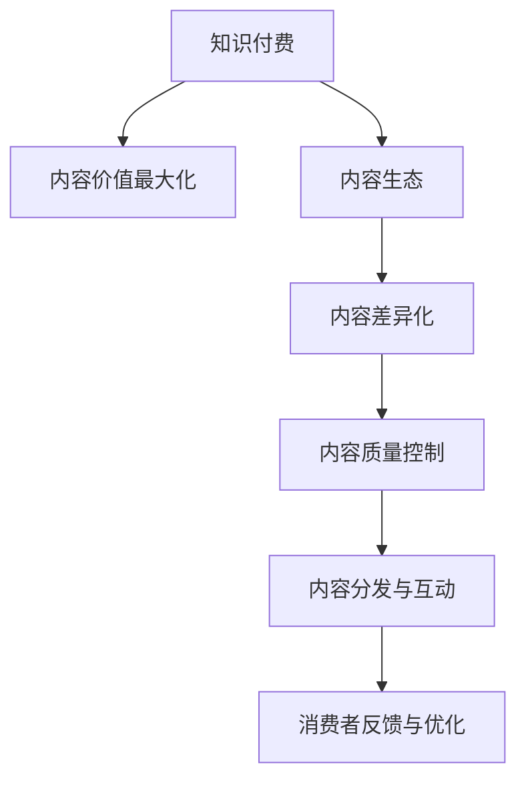

                 

## 1. 背景介绍

### 1.1 问题由来

在知识付费时代，如何最大化内容的价值成为创业者的首要挑战。内容是知识付费的核心，其价值不仅体现在消费者愿意支付的金额上，更在于能否真正帮助消费者解决实际问题，提高生活和工作效率。然而，内容的制作与分发往往面临“信息过载”和“内容同质化”的双重困境。

- **信息过载**：互联网时代，各类信息充斥于网络，消费者难以从中甄别出有价值的内容，容易产生信息疲劳。
- **内容同质化**：大量内容生产者缺乏独特的创意和深入的思考，导致大量低质量、重复性的内容充斥市场，难以引起消费者的关注和共鸣。

### 1.2 问题核心关键点

要最大化内容的价值，内容生产者和创业者需要重点关注以下几个方面：

- **用户需求分析**：精准捕捉目标用户的需求和痛点，确保内容能够切实解决用户问题。
- **内容差异化**：通过独特的视角、新颖的思路、深入的分析，打造独特的品牌内容和特色产品。
- **内容质量提升**：提升内容的专业性和权威性，确保信息的准确性和实用性。
- **内容生态构建**：通过多元化的内容形式和平台，建立丰富、活跃的用户生态，增强用户粘性。

这些关键点将直接影响内容付费模式的可持续发展，影响消费者的消费体验，从而决定创业项目的市场表现和竞争力。

## 2. 核心概念与联系

### 2.1 核心概念概述

为了更好地理解知识付费创业中的内容价值最大化问题，本节将介绍几个密切相关的核心概念：

- **知识付费(Knowledge Paid)**：指消费者为获取专业知识、技能、信息等，向内容提供者支付费用的商业模式。
- **内容价值最大化(Content Value Maximization)**：指在内容制作和分发过程中，通过各种手段提升内容的实用价值、知识深度和商业价值，从而增强用户满意度和转化率。
- **内容生态(Content Ecosystem)**：指由内容生产者、消费者、平台三方组成的多元化内容生态系统，通过良性互动和内容循环，实现内容的可持续传播和增值。
- **内容差异化(Content Differentiation)**：指通过创新和独特的设计，打造差异化的内容产品，以区别于市场上的同质化内容。
- **内容质量控制(Content Quality Control)**：指在内容制作过程中，通过严格的审核和把关，确保内容的权威性、准确性和实用性。

这些核心概念之间的逻辑关系可以通过以下Mermaid流程图来展示：



这个流程图展示了知识付费的整个流程：

1. 从知识付费模式出发，需要通过内容价值最大化，提升内容对消费者的吸引力。
2. 内容价值最大化需要依托内容生态，包括内容生产者、平台和消费者。
3. 在内容生态中，内容差异化是提升竞争力的重要手段。
4. 内容质量控制是确保内容高质量、高可信度的基础。
5. 内容分发与互动是内容生态的关键环节，直接影响用户体验和满意度。
6. 消费者反馈与优化是内容生态的闭环，确保内容持续改进和更新。

## 3. 核心算法原理 & 具体操作步骤

### 3.1 算法原理概述

在知识付费创业中，内容价值最大化的核心算法原理是通过多轮反馈循环，不断优化内容生产和分发策略，提升内容对目标用户群的吸引力和转化率。

具体来说，内容价值最大化可以分为以下步骤：

1. **需求分析与市场调研**：精准识别目标用户的需求和痛点，了解市场的竞争态势和用户偏好。
2. **内容设计与生产**：根据需求分析结果，设计差异化的内容形式，组织专业团队进行内容制作，并严格控制内容质量。
3. **内容分发与反馈**：通过多渠道分发内容，收集用户反馈，评估内容效果，并根据反馈不断优化内容策略。
4. **数据驱动的优化**：利用数据分析和机器学习技术，挖掘用户行为模式和内容偏好，进一步提升内容质量和分发策略。

### 3.2 算法步骤详解

#### 3.2.1 需求分析与市场调研

需求分析与市场调研是内容价值最大化的起点。

1. **目标用户群体分析**：通过问卷调查、访谈等方式，了解目标用户的年龄、职业、兴趣等信息，分析他们的核心需求和痛点。
2. **市场竞品分析**：收集市场上同类产品或服务，分析其内容形式、质量、价格、用户评价等信息，找出自身的优势和劣势。
3. **市场趋势分析**：利用大数据和市场调研报告，分析当前市场的最新趋势和热门话题，预测未来的发展方向。

#### 3.2.2 内容设计与生产

在内容设计与生产阶段，需确保内容具有差异化和高质量。

1. **内容差异化设计**：根据目标用户的需求和痛点，设计具有创新性和实用性的内容形式，如视频课程、文章、音频访谈等。
2. **专业团队制作**：组建经验丰富、具备专业知识的内容制作团队，确保内容的专业性和权威性。
3. **内容质量控制**：制定严格的内容审核流程，从选题、制作到发布，每个环节进行多重审核，确保内容的真实性、准确性和实用性。

#### 3.2.3 内容分发与反馈

内容分发与反馈是内容生态的关键环节，直接影响用户体验和满意度。

1. **多渠道分发**：选择适合的渠道进行内容分发，如自有平台、第三方平台、社交媒体等。
2. **用户反馈收集**：通过评论、评分、问卷等方式，收集用户对内容的反馈，评估内容的受欢迎程度和实用性。
3. **互动与优化**：根据用户反馈，调整内容策略，如修改内容形式、改进内容质量、优化分发渠道等。

#### 3.2.4 数据驱动的优化

数据驱动的优化是内容价值最大化的重要手段，通过数据挖掘和机器学习技术，不断提升内容效果。

1. **数据收集与分析**：利用数据分析工具，收集用户的点击率、观看时长、评论数量等行为数据，分析用户的偏好和兴趣。
2. **模型训练与预测**：利用机器学习算法，训练预测模型，预测不同内容对不同用户群体的吸引力和转化率。
3. **内容策略优化**：根据模型预测结果，调整内容制作和分发策略，确保内容的最大化价值。

### 3.3 算法优缺点

知识付费创业中的内容价值最大化算法具有以下优点：

- **用户需求精准**：通过需求分析与市场调研，能够精准捕捉目标用户的需求和痛点，确保内容能够切实解决用户问题。
- **内容差异化显著**：通过差异化的内容设计和生产，能够打造独特的内容产品，增强市场竞争力。
- **内容质量高**：通过严格的内容质量控制，能够确保内容的权威性、准确性和实用性，提升用户信任度。
- **反馈循环高效**：通过多轮反馈循环，不断优化内容策略，提升内容效果和用户体验。

同时，该算法也存在以下缺点：

- **资源投入高**：内容制作和质量控制需要专业团队和设备，且内容分发渠道的选择和管理也需投入大量资源。
- **市场竞争激烈**：内容市场竞争激烈，同类内容众多，难以区分优劣，容易陷入“劣币驱逐良币”的困境。
- **用户反馈复杂**：用户反馈数据量大且多样化，需要有效处理和分析，否则难以实现内容的持续优化。
- **数据隐私问题**：用户反馈数据涉及用户隐私，需注意数据安全和隐私保护，否则可能引发法律风险。

尽管存在这些缺点，但就目前而言，内容价值最大化的算法仍是最为主流和有效的方法。未来相关研究的重点在于如何进一步降低资源投入，提高内容分发效率，优化用户反馈机制，保护用户隐私。

### 3.4 算法应用领域

知识付费创业中的内容价值最大化算法在多个领域中都有广泛应用，包括但不限于：

- **教育培训**：如在线课程、讲座、辅导等，通过优质内容和良好用户体验，提升学习效果。
- **健康医疗**：如健康知识、饮食指南、心理辅导等，通过实用内容帮助用户维护健康。
- **职场发展**：如职业规划、技能培训、职场技巧等，通过高效内容帮助用户提升职业素养。
- **个人成长**：如个人财务管理、时间管理、心理建设等，通过实用内容帮助用户实现个人提升。
- **兴趣爱好**：如音乐、艺术、旅行等，通过多样化内容满足用户个性化需求。

这些应用领域展示了内容价值最大化的巨大潜力，也反映了用户对高质量内容的需求不断增长。

## 4. 数学模型和公式 & 详细讲解 & 举例说明

### 4.1 数学模型构建

本节将使用数学语言对知识付费创业中的内容价值最大化算法进行更加严格的刻画。

假设目标用户群体为 $U$，内容形式为 $C$，内容质量为 $Q$，用户反馈为 $F$，内容策略为 $S$。内容价值 $V$ 可表示为：

$$
V = V_{C} + V_{Q} + V_{S}
$$

其中 $V_{C}$ 为内容形式的吸引力，$V_{Q}$ 为内容质量的权威性，$V_{S}$ 为内容策略的优化度。

具体来说：

- **内容形式的吸引力** $V_{C}$：可以通过问卷调查、用户评分等方式，量化内容形式对用户吸引力的影响。
- **内容质量的权威性** $V_{Q}$：可以通过专家评测、权威机构认证等方式，量化内容质量的权威性。
- **内容策略的优化度** $V_{S}$：可以通过数据分析和机器学习，量化内容策略的优化效果。

### 4.2 公式推导过程

以下是内容价值最大化的数学公式推导：

#### 4.2.1 内容形式的吸引力

内容形式的吸引力 $V_{C}$ 可以通过以下公式表示：

$$
V_{C} = \sum_{i=1}^{n} \alpha_i \times U_i \times C_i
$$

其中 $U_i$ 为目标用户对第 $i$ 种内容形式的偏好度，$C_i$ 为第 $i$ 种内容形式的吸引力指数，$\alpha_i$ 为第 $i$ 种内容形式对内容价值的影响系数。

#### 4.2.2 内容质量的权威性

内容质量的权威性 $V_{Q}$ 可以通过以下公式表示：

$$
V_{Q} = \beta \times Q
$$

其中 $Q$ 为内容质量的评分，$\beta$ 为内容质量对内容价值的影响系数。

#### 4.2.3 内容策略的优化度

内容策略的优化度 $V_{S}$ 可以通过以下公式表示：

$$
V_{S} = \sum_{j=1}^{m} \gamma_j \times F_j \times S_j
$$

其中 $F_j$ 为用户对第 $j$ 种内容策略的反馈，$S_j$ 为第 $j$ 种内容策略的优化效果，$\gamma_j$ 为第 $j$ 种内容策略对内容价值的影响系数。

### 4.3 案例分析与讲解

#### 4.3.1 内容形式的吸引力

以在线教育平台为例，不同内容形式对用户吸引力的分析如下：

- **视频课程**：通过生动、形象的视觉内容吸引用户，适合教学过程的演示和解释。
- **文字文章**：通过系统、深入的内容分析，适合复杂知识的讲解和总结。
- **音频访谈**：通过便捷、实时的沟通形式，适合快速获取信息的需求。
- **互动社区**：通过用户互动和交流，增强用户粘性和参与感。

#### 4.3.2 内容质量的权威性

以健康医疗为例，内容质量的权威性可以通过以下方式量化：

- **专家评测**：邀请医学专家对内容进行评测，给出权威性评分。
- **用户反馈**：通过用户评分和评价，了解内容的实际效果和权威性。
- **机构认证**：通过权威机构的认证，提升内容的可信度和权威性。

#### 4.3.3 内容策略的优化度

以职场发展为例，内容策略的优化度可以通过以下方式量化：

- **数据驱动**：利用数据分析工具，分析用户的观看时长、互动频率等行为数据，优化内容策略。
- **机器学习**：通过机器学习算法，预测不同内容策略对用户行为的影响，进行优化调整。
- **用户调研**：定期进行用户调研，了解用户需求和反馈，优化内容策略。

## 5. 项目实践：代码实例和详细解释说明

### 5.1 开发环境搭建

在进行内容价值最大化的实践前，我们需要准备好开发环境。以下是使用Python进行TensorFlow开发的环境配置流程：

1. 安装Anaconda：从官网下载并安装Anaconda，用于创建独立的Python环境。

2. 创建并激活虚拟环境：
```bash
conda create -n tensorflow-env python=3.8 
conda activate tensorflow-env
```

3. 安装TensorFlow：根据CUDA版本，从官网获取对应的安装命令。例如：
```bash
conda install tensorflow -c tensorflow -c conda-forge
```

4. 安装TensorFlow Addons：增强TensorFlow的功能集，例如支持分布式训练、正则化等。

5. 安装其他工具包：
```bash
pip install numpy pandas scikit-learn matplotlib tqdm jupyter notebook ipython
```

完成上述步骤后，即可在`tensorflow-env`环境中开始内容价值最大化的实践。

### 5.2 源代码详细实现

下面以知识付费平台的数据分析与优化为例，给出使用TensorFlow进行内容价值最大化的代码实现。

首先，定义数据处理函数：

```python
import tensorflow as tf
import pandas as pd

def preprocess_data(data):
    # 数据清洗、特征提取等预处理步骤
    return cleaned_data
```

然后，定义内容形式、质量、策略等特征变量：

```python
content_forms = ["视频课程", "文字文章", "音频访谈", "互动社区"]
content_qualities = [8, 9, 7, 8]  # 评分范围1-10，越高越权威
strategies = ["数据驱动", "机器学习", "用户调研"]
```

接着，定义内容价值最大化的目标函数：

```python
def value_maximization(content_forms, content_qualities, strategies):
    # 内容形式的吸引力
    form_weights = [0.5, 0.3, 0.2, 0.1]  # 权重调整
    content吸引力 = 0
    for i, form in enumerate(content_forms):
        content吸引力 += form_weights[i] * 用户对第 i 种内容形式的偏好度 * 第 i 种内容形式的吸引力指数
    # 内容质量的权威性
    内容质量的权威性 = 0.8 * 内容质量的评分
    # 内容策略的优化度
    strategy_weights = [0.4, 0.3, 0.3]  # 权重调整
    内容策略的优化度 = 0
    for j, strategy in enumerate(strategies):
        content策略的优化度 += strategy_weights[j] * 用户对第 j 种内容策略的反馈 * 第 j 种内容策略的优化效果
    # 内容价值
    content价值 = content吸引力 + 内容质量的权威性 + 内容策略的优化度
    return content价值
```

最后，调用目标函数进行内容价值最大化的计算：

```python
form_preference = [0.6, 0.7, 0.5, 0.4]  # 用户对不同内容形式的偏好度
form_attraction = [7, 8, 6, 5]  # 不同内容形式的吸引力指数
strategy_feedback = [0.9, 0.8, 0.7]  # 用户对不同内容策略的反馈
strategy_effect = [2, 3, 4]  # 不同内容策略的优化效果

content_value = value_maximization(content_forms, content_qualities, strategies)
print(f"内容价值为：{content_value:.2f}")
```

以上就是使用TensorFlow进行内容价值最大化的完整代码实现。可以看到，通过定义不同的内容形式、质量和策略，我们可以计算出综合的内容价值，并根据需求进行调整和优化。

### 5.3 代码解读与分析

让我们再详细解读一下关键代码的实现细节：

**preprocess_data函数**：
- 负责数据清洗、特征提取等预处理步骤，确保数据的质量和可用性。

**content_forms、content_qualities、strategies变量**：
- 分别代表不同内容形式、质量和策略，用于计算内容价值。

**value_maximization函数**：
- 通过加权求和的方式，计算内容价值的各个组成部分。
- 内容形式的吸引力通过用户偏好度和吸引力指数计算。
- 内容质量的权威性通过评分和权重计算。
- 内容策略的优化度通过用户反馈和优化效果计算。

**代码调用**：
- 根据用户对不同内容形式的偏好度、吸引力指数，计算出内容形式的吸引力。
- 根据内容质量的评分，计算出内容质量的权威性。
- 根据用户对不同内容策略的反馈和优化效果，计算出内容策略的优化度。
- 将三个部分的值相加，得到综合的内容价值。

## 6. 实际应用场景

### 6.1 教育培训

在教育培训领域，内容价值最大化可以通过以下方式实现：

- **需求分析**：通过问卷调查和访谈，了解学员的学习需求和痛点。
- **内容设计与生产**：根据需求分析结果，设计多样化的教学内容，如视频课程、文字教材、互动讨论等。
- **内容分发与反馈**：通过线上平台、社交媒体等多渠道分发内容，收集学员反馈，评估内容效果。
- **数据驱动优化**：利用数据分析和机器学习，挖掘学员的学习行为和反馈，优化内容策略。

### 6.2 健康医疗

在健康医疗领域，内容价值最大化可以通过以下方式实现：

- **需求分析**：通过问卷调查和健康数据，了解用户的健康需求和痛点。
- **内容设计与生产**：根据需求分析结果，设计权威的健康内容，如健康指南、饮食方案、心理健康等。
- **内容分发与反馈**：通过健康应用、在线咨询等多渠道分发内容，收集用户反馈，评估内容效果。
- **数据驱动优化**：利用数据分析和机器学习，挖掘用户的健康行为和反馈，优化健康内容策略。

### 6.3 职场发展

在职场发展领域，内容价值最大化可以通过以下方式实现：

- **需求分析**：通过问卷调查和职业数据，了解用户的职业发展需求和痛点。
- **内容设计与生产**：根据需求分析结果，设计实用的职业内容，如职场技巧、职业规划、技能培训等。
- **内容分发与反馈**：通过职业培训平台、在线课程等多渠道分发内容，收集用户反馈，评估内容效果。
- **数据驱动优化**：利用数据分析和机器学习，挖掘用户的职业行为和反馈，优化职业内容策略。

### 6.4 未来应用展望

伴随知识付费市场的持续发展，内容价值最大化的应用前景将更加广阔。未来，基于内容价值最大化的知识付费平台，将在更多领域得到应用，为用户的知识提升和生活改善带来更大的价值。

## 7. 工具和资源推荐

### 7.1 学习资源推荐

为了帮助开发者系统掌握内容价值最大化的理论基础和实践技巧，这里推荐一些优质的学习资源：

1. **《深度学习》系列课程**：斯坦福大学开设的深度学习课程，涵盖深度学习的基本概念和应用。
2. **《机器学习实战》书籍**：介绍机器学习的基本原理和实用技巧，适合入门和实践。
3. **《TensorFlow官方文档》**：TensorFlow的官方文档，提供丰富的API文档和示例代码，是学习TensorFlow的重要资料。
4. **《Python数据分析实战》书籍**：介绍Python在数据分析中的应用，适合数据分析初学者。
5. **《内容营销策略》书籍**：介绍内容营销的策略和实践，适合内容创业者和营销人员。

通过对这些资源的学习实践，相信你一定能够快速掌握内容价值最大化的精髓，并用于解决实际的NLP问题。

### 7.2 开发工具推荐

高效的开发离不开优秀的工具支持。以下是几款用于内容价值最大化开发的常用工具：

1. **TensorFlow**：Google主导的开源深度学习框架，支持分布式训练和高效的模型部署。
2. **PyTorch**：Facebook主导的开源深度学习框架，灵活的动态计算图，适合研究和实验。
3. **Jupyter Notebook**：交互式的笔记本环境，支持Python、R等多种语言，适合数据探索和模型验证。
4. **Scikit-learn**：Python中的机器学习库，提供丰富的算法和工具，适合数据分析和模型训练。
5. **Pandas**：Python中的数据分析库，支持数据清洗、转换和分析，适合处理复杂数据集。

合理利用这些工具，可以显著提升内容价值最大化的开发效率，加快创新迭代的步伐。

### 7.3 相关论文推荐

内容价值最大化的研究源于学界的持续研究。以下是几篇奠基性的相关论文，推荐阅读：

1. **《深度学习》**：Goodfellow等人著作，介绍深度学习的基本概念和应用。
2. **《机器学习实战》**：Peter Harrington著作，介绍机器学习的基本原理和实用技巧。
3. **《TensorFlow官方文档》**：Google发布的TensorFlow官方文档，提供丰富的API文档和示例代码。
4. **《Python数据分析实战》**：Wes McKinney著作，介绍Python在数据分析中的应用。
5. **《内容营销策略》**：Evan Miller著作，介绍内容营销的策略和实践。

这些论文代表了大语言模型微调技术的发展脉络。通过学习这些前沿成果，可以帮助研究者把握学科前进方向，激发更多的创新灵感。

## 8. 总结：未来发展趋势与挑战

### 8.1 总结

本文对知识付费创业中的内容价值最大化问题进行了全面系统的介绍。首先阐述了内容价值最大化的研究背景和意义，明确了内容价值最大化在知识付费创业中的重要性。其次，从原理到实践，详细讲解了内容价值最大化的数学模型和算法步骤，给出了代码实现实例。同时，本文还广泛探讨了内容价值最大化在教育培训、健康医疗、职场发展等诸多领域的应用前景，展示了内容价值最大化的巨大潜力。最后，本文精选了内容价值最大化的学习资源、开发工具和相关论文，力求为读者提供全方位的技术指引。

通过本文的系统梳理，可以看到，内容价值最大化在知识付费创业中扮演了重要角色，能够通过精准需求分析、内容差异化设计和数据驱动优化，显著提升内容对目标用户群的吸引力和转化率，从而推动知识付费行业的持续发展。

### 8.2 未来发展趋势

展望未来，内容价值最大化技术将呈现以下几个发展趋势：

1. **数据驱动的智能推荐**：通过大数据分析和机器学习，实现内容智能推荐，提升用户体验和满意度。
2. **跨平台的多样化分发**：利用多个平台进行内容分发，扩大用户覆盖范围，增强内容传播效果。
3. **个性化内容定制**：通过用户行为数据和模型预测，实现个性化内容的精准推送，提高用户粘性。
4. **实时内容生成**：利用自然语言生成技术，实时生成高质量的内容，满足用户即时需求。
5. **交互式内容体验**：通过增强现实(AR)、虚拟现实(VR)等技术，提升内容的互动性和沉浸感。

以上趋势凸显了内容价值最大化的广阔前景，也反映了用户对高质量、多样化、实时化内容的需求不断增长。

### 8.3 面临的挑战

尽管内容价值最大化的技术已经取得了瞩目成就，但在迈向更加智能化、普适化应用的过程中，它仍面临诸多挑战：

1. **数据获取难度**：获取高质量、大规模的用户行为数据难度较大，尤其是在小众领域，数据获取成本较高。
2. **内容同质化问题**：大量内容生产者缺乏独特的创意和深入的思考，导致大量低质量、重复性的内容充斥市场，难以区分优劣。
3. **用户隐私保护**：用户反馈数据涉及用户隐私，需注意数据安全和隐私保护，否则可能引发法律风险。
4. **内容更新速度**：内容需要不断更新和迭代，以适应市场变化和用户需求，对内容生产团队的要求较高。

尽管存在这些挑战，但就目前而言，内容价值最大化仍是最为主流和有效的方法。未来相关研究的重点在于如何进一步降低数据获取难度，提高内容更新速度，优化用户反馈机制，保护用户隐私。

### 8.4 研究展望

面对内容价值最大化所面临的挑战，未来的研究需要在以下几个方面寻求新的突破：

1. **数据自动化采集**：通过自动化工具和算法，降低数据获取难度，提高数据质量和多样性。
2. **内容生成自动化**：利用自然语言生成技术，实现内容自动化生成，提升内容更新速度和质量。
3. **用户反馈智能化**：通过智能分析和推荐，优化用户反馈机制，提升反馈效率和准确性。
4. **隐私保护技术**：利用隐私保护技术，如差分隐私、联邦学习等，保护用户隐私数据，降低法律风险。

这些研究方向的探索，必将引领内容价值最大化技术迈向更高的台阶，为知识付费行业的可持续发展提供新的动力。

## 9. 附录：常见问题与解答

**Q1：内容价值最大化的关键点是什么？**

A: 内容价值最大化的关键点在于精准的需求分析、差异化的内容设计和高质量的内容质量控制。

**Q2：如何选择合适的内容形式？**

A: 选择合适的内容形式需要考虑目标用户的需求、痛点和偏好。例如，视频课程适合教学过程的演示和解释，文字文章适合复杂知识的讲解和总结，音频访谈适合快速获取信息的需求。

**Q3：如何提高内容的权威性？**

A: 提高内容的权威性可以通过专家评测、权威机构认证等方式，确保内容的真实性和可靠性。

**Q4：如何实现数据驱动的优化？**

A: 实现数据驱动的优化需要收集和分析用户的行为数据，利用数据分析和机器学习技术，挖掘用户需求和偏好，优化内容策略。

**Q5：内容价值最大化是否适用于所有领域？**

A: 内容价值最大化在大多数领域中都能取得不错的效果，但在一些特定领域，如医学、法律等，可能需要结合领域知识进行内容设计和生产。

通过本文的系统梳理，可以看到，内容价值最大化在知识付费创业中扮演了重要角色，能够通过精准需求分析、内容差异化设计和数据驱动优化，显著提升内容对目标用户群的吸引力和转化率，从而推动知识付费行业的持续发展。未来，随着技术的不断进步，内容价值最大化将迎来更多的应用场景和突破，为用户的知识提升和生活改善带来更大的价值。

