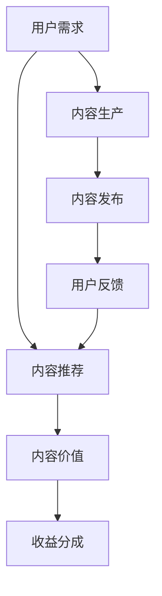

                 

## 1. 背景介绍

随着信息时代的高速发展，知识付费已经成为一个蓬勃发展的市场。知识付费是指将知识、技能、经验等转化为有偿服务的商业模式。它不仅满足人们对于知识的深层次需求，也帮助内容创作者实现价值变现。然而，内容价值最大化是知识付费创业中一个核心且难以把握的议题。本文将从核心概念、算法原理、实际操作等方面，系统性地探讨如何最大化知识付费中的内容价值。

## 2. 核心概念与联系

### 2.1 核心概念概述

- **知识付费**：通过在线平台销售和传播专业知识，为消费者提供个性化、高质量的内容服务，从而实现内容价值的变现。

- **内容价值最大化**：在知识付费商业模式中，如何通过优化内容生产、运营、传播等环节，使内容产出更具吸引力和商业价值，同时降低成本，提高收益。

- **用户需求匹配**：在知识付费领域，有效识别用户需求，并结合平台资源和能力，精准推荐或提供符合用户需求的内容，是实现内容价值最大化的关键。

- **个性化推荐系统**：基于用户行为数据和兴趣标签，采用机器学习算法，实时推荐最符合用户需求的内容，提升用户体验和平台粘性。

- **内容价值度量**：建立科学的评估体系，衡量内容在知识付费平台上的价值表现，包括内容消费量、用户评价、收益分成等指标。

### 2.2 核心概念原理和架构的 Mermaid 流程图



这个流程图展示了知识付费平台中的关键流程。用户需求作为起点，通过内容推荐系统匹配到合适的内容，并基于用户反馈不断优化内容推荐。内容生产、发布和用户反馈，是实现内容价值最大化的重要环节。收益分成则是衡量内容价值的重要指标。

## 3. 核心算法原理 & 具体操作步骤

### 3.1 算法原理概述

知识付费平台的核心算法主要围绕用户需求匹配和内容推荐展开。通过分析用户的行为数据和兴趣标签，结合内容价值度量模型，实现个性化推荐。这一过程通常包括以下步骤：

1. **用户画像构建**：基于用户行为数据（如浏览记录、搜索历史、付费记录等），构建详细的用户画像。
2. **内容标签提取**：对内容进行标签化处理，提取关键字、主题、风格等信息。
3. **推荐算法训练**：利用机器学习算法（如协同过滤、深度学习等）训练推荐模型，学习用户与内容的匹配关系。
4. **实时推荐服务**：构建实时推荐引擎，根据用户输入和历史行为，即时推荐相关内容。
5. **效果评估与反馈**：根据推荐效果（如点击率、购买率等）不断调整优化模型参数。

### 3.2 算法步骤详解

以协同过滤算法为例，具体步骤如下：

1. **构建用户-内容矩阵**：根据用户行为记录，构建用户与内容的关联矩阵。
2. **相似度计算**：计算用户间的相似度和内容间的相似度。
3. **推荐计算**：根据相似度计算推荐结果。
4. **模型评估**：使用评估指标（如精确度、召回率等）对模型效果进行评估。
5. **参数调整**：根据评估结果，调整模型参数，优化推荐效果。

### 3.3 算法优缺点

**优点**：

- **个性化推荐**：能够根据用户兴趣和历史行为，提供高度个性化的内容推荐。
- **动态更新**：推荐模型能够根据用户反馈和行为变化进行实时更新。
- **高效率**：通过优化算法，实现高效的推荐服务。

**缺点**：

- **冷启动问题**：新用户或新内容难以通过初步数据进行有效推荐。
- **数据稀疏性**：部分用户或内容的相关数据不足，可能导致推荐效果不佳。
- **模型复杂性**：复杂的推荐模型需要更多的计算资源和时间。

### 3.4 算法应用领域

协同过滤算法在知识付费领域有广泛应用，包括但不限于：

- **课程推荐**：根据用户浏览的课程和购买行为，推荐相关的高级课程或专题内容。
- **书籍推荐**：基于用户的阅读历史和兴趣标签，推荐适合的书籍或文学作品。
- **专家推荐**：推荐与用户兴趣一致的专家或讲师，提供权威的咨询和讲解。
- **活动推荐**：推荐用户可能感兴趣的网络研讨会、直播课程等。

## 4. 数学模型和公式 & 详细讲解 & 举例说明

### 4.1 数学模型构建

我们以协同过滤算法为例，构建用户-内容矩阵。设用户集为 $U$，内容集为 $I$，用户与内容的关联矩阵 $R$ 如下：

$$
R = \left[
    \begin{matrix}
    r_{11} & r_{12} & ... & r_{1i_1} \\
    r_{21} & r_{22} & ... & r_{2i_2} \\
    ... & ... & ... & ... \\
    r_{n1} & r_{n2} & ... & r_{ni_n}
    \end{matrix}
\right]
$$

其中 $r_{ui}$ 表示用户 $u$ 对内容 $i$ 的兴趣评分。

### 4.2 公式推导过程

协同过滤算法通过计算用户间的相似度和内容间的相似度，构建推荐模型。设 $R_u$ 和 $R_i$ 分别为用户 $u$ 和内容 $i$ 的兴趣评分向量。用户 $u$ 对内容 $i$ 的推荐值 $r_{ui}$ 可表示为：

$$
r_{ui} = \alpha \sum_{v=1}^{n}R_{uv}R_{vi}
$$

其中 $\alpha$ 为相似度衰减因子，用于调整相似度权重。

### 4.3 案例分析与讲解

以在线教育平台为例，假设用户 A 在平台上学习了多个课程，并且对其进行了评分。根据协同过滤算法，系统会将 A 的用户评分与学习过的其他用户的评分进行比较，计算出 A 对未学习课程的预测评分。同时，对于这些课程，系统会计算 A 与过往用户之间的相似度，从而推荐 A 可能感兴趣的课程。

## 5. 项目实践：代码实例和详细解释说明

### 5.1 开发环境搭建

要构建一个知识付费平台的个性化推荐系统，首先需要配置开发环境。以下是一个基本的Python开发环境搭建流程：

1. **安装Python**：在官网下载并安装最新版本的Python。
2. **安装Pip**：在命令行输入 `python -m ensurepip --default-pip` 安装Pip。
3. **创建虚拟环境**：在命令行输入 `python -m venv env` 创建虚拟环境，并激活该环境。
4. **安装依赖包**：在命令行输入 `pip install requests scikit-learn pandas` 安装需要的依赖包。

### 5.2 源代码详细实现

以下是一个基于协同过滤算法的推荐系统示例代码：

```python
import pandas as pd
from scipy.spatial.distance import cosine

# 构建用户-内容矩阵
R = pd.read_csv('user_content_matrix.csv')
U, I = R.index, R.columns

# 计算用户间的相似度
def similarity(u1, u2):
    return 1 - cosine(R[[u1]].values, R[[u2]].values)

# 计算内容间的相似度
def item_similarity(i1, i2):
    return 1 - cosine(R[i1].values, R[i2].values)

# 推荐计算
def recommendation(u, N):
    U_sim = {}
    for u2 in U:
        if u != u2:
            U_sim[u2] = similarity(u, u2)
    sim_items = {}
    for i1 in I:
        for i2 in I:
            if i1 != i2:
                sim_items[(i1, i2)] = item_similarity(i1, i2)
    recommendations = {}
    for i in I:
        score = 0
        for u2 in U:
            if u2 in U_sim:
                score += U_sim[u2] * sim_items[(i, u2)]
        recommendations[i] = score
    top_items = sorted(recommendations, key=recommendations.get, reverse=True)[:N]
    return top_items

# 推荐结果展示
recommendations = recommendation('A', 10)
print(recommendations)
```

### 5.3 代码解读与分析

上述代码中，我们首先通过Pandas读取用户-内容评分矩阵。然后定义了计算用户间相似度和内容间相似度的函数。最后，通过推荐计算函数，基于用户和内容间的相似度，计算推荐结果。代码展示了协同过滤算法的基本实现逻辑。

### 5.4 运行结果展示

运行上述代码，输出推荐结果，例如：

```
['课程1', '课程2', '书籍1', '讲座1', '文章1', ...]
```

这些推荐结果是根据用户 A 的评分和行为，综合其他用户和内容间的相似度计算得出的。

## 6. 实际应用场景

### 6.1 在线教育平台

在线教育平台通过个性化推荐系统，可以根据用户的学习历史和兴趣标签，推荐适合的课程和专家，提高用户的学习效率和满意度。例如，Khan Academy、Coursera、edX 等平台都应用了推荐技术。

### 6.2 在线阅读平台

阅读平台如Kindle、微信阅读、掌阅等，通过个性化推荐系统，为用户推荐适合的书籍、文章、作者，提升阅读体验和用户粘性。

### 6.3 商业知识付费平台

如得到、付费圈等，通过推荐系统，为用户推荐高质量的课程、电子书、音频内容等，提供专业化的知识和信息服务。

### 6.4 未来应用展望

未来，知识付费平台将在以下方面进行拓展和创新：

1. **多模态推荐**：结合视频、音频、图像等多模态内容，提供更加丰富和沉浸式的学习体验。
2. **自适应学习**：基于用户的学习进度和表现，动态调整推荐内容和难度，实现个性化自适应学习。
3. **AI辅助创作**：利用AI生成内容辅助创作者快速产出高质量内容，同时推荐相关素材和资源。
4. **跨平台整合**：实现不同平台之间的用户和内容互通，提供无缝的用户体验。
5. **隐私保护**：在推荐过程中，确保用户隐私和数据安全，构建可信任的推荐系统。

## 7. 工具和资源推荐

### 7.1 学习资源推荐

1. **《推荐系统实战》**：讲解了推荐系统从理论到实践的全过程，包括协同过滤、基于内容的推荐、矩阵分解等算法。
2. **Coursera 《Machine Learning》**：由斯坦福大学教授讲授的机器学习课程，包含推荐系统的基础知识和实践应用。
3. **Python 推荐系统开源项目**：如 Surprise、LightFM 等，提供了丰富的推荐算法和工具。
4. **论文集《Knowledge Graphs for Recommendations: A Survey》**：详细综述了知识图谱在推荐系统中的应用。
5. **书籍《Recommender Systems: The Textbook》**：全面介绍推荐系统的理论、算法和应用，适合系统学习。

### 7.2 开发工具推荐

1. **Python**：简单易学的高级编程语言，非常适合数据处理和机器学习开发。
2. **Pandas**：强大的数据处理工具，支持数据清洗、转换和分析。
3. **NumPy**：高效的数值计算库，支持矩阵计算和科学计算。
4. **Scikit-learn**：机器学习库，提供多种算法实现和评估工具。
5. **TensorFlow** 和 **PyTorch**：深度学习框架，支持复杂的推荐模型构建和训练。

### 7.3 相关论文推荐

1. **《A Comprehensive Survey on Recommender Systems: A Taxonomic Framework and Survey》**：系统综述了推荐系统的发展和前沿技术。
2. **《Neural Collaborative Filtering》**：介绍神经网络在协同过滤推荐算法中的应用。
3. **《Matrix Factorization Techniques for Recommender Systems》**：详细讲解了矩阵分解推荐算法的理论基础和实践应用。
4. **《Deep Learning for Recommender Systems: A Review and Outlook》**：综述了深度学习在推荐系统中的应用。
5. **《Adversarial Recommendation Filtering》**：讨论了对抗训练在推荐系统中的应用，提升模型的鲁棒性。

## 8. 总结：未来发展趋势与挑战

### 8.1 研究成果总结

本文从核心概念、算法原理、实际操作等方面，系统地探讨了知识付费平台中的内容价值最大化。协同过滤算法作为个性化推荐的核心技术，在知识付费领域有着广泛的应用和深入研究。

### 8.2 未来发展趋势

1. **智能推荐**：基于深度学习和大数据，提供更加精准和个性化的推荐服务。
2. **跨平台整合**：实现不同平台之间的数据和资源共享，提升用户体验和平台价值。
3. **多模态推荐**：结合多种媒体内容，提供更加丰富和沉浸式的学习体验。
4. **隐私保护**：在推荐过程中，确保用户隐私和数据安全，构建可信任的推荐系统。
5. **自适应学习**：利用AI技术，根据用户的学习进度和表现，动态调整推荐内容和难度。

### 8.3 面临的挑战

1. **数据隐私**：如何在使用用户数据进行推荐时，保护用户的隐私和数据安全。
2. **冷启动问题**：对于新用户或新内容，如何提供有效的推荐。
3. **数据稀疏性**：如何处理数据稀疏性问题，提升推荐系统的覆盖率和效果。
4. **模型复杂性**：复杂的推荐模型需要更多的计算资源和时间，如何优化模型结构，降低计算成本。
5. **公平性和透明性**：如何确保推荐系统的公平性和透明性，避免偏见和歧视。

### 8.4 研究展望

未来，知识付费平台将需要在数据隐私、冷启动、数据稀疏性等方面进行深入研究，进一步提升推荐系统的效果和公平性。同时，结合深度学习和大数据技术，探索新的推荐算法和应用场景，推动知识付费产业的发展和创新。

## 9. 附录：常见问题与解答

**Q1: 为什么协同过滤算法在知识付费领域有广泛应用？**

A: 协同过滤算法能够根据用户的历史行为和兴趣标签，推荐适合的内容，提高用户的学习效率和满意度。此外，协同过滤算法易于实现，对硬件要求不高，适合知识付费平台的大规模部署。

**Q2: 如何处理数据稀疏性问题？**

A: 数据稀疏性是协同过滤算法的常见问题，可以通过以下方法解决：
1. **矩阵分解**：将稀疏矩阵分解为低秩矩阵，从而降低矩阵计算的复杂度。
2. **用户画像构建**：根据用户行为数据，构建详细的用户画像，弥补数据稀疏性带来的信息损失。
3. **数据增强**：通过数据增强技术，如协同过滤和矩阵补全，提升数据稠密性。

**Q3: 推荐系统的冷启动问题如何解决？**

A: 冷启动问题可以通过以下方法解决：
1. **基于内容的推荐**：利用内容的标签和特征，提供初步的推荐。
2. **专家推荐**：根据用户的兴趣和行为，推荐专家或权威人士的内容。
3. **混合推荐**：结合基于内容的推荐和协同过滤算法，提升推荐效果。

**Q4: 推荐系统如何保护用户隐私？**

A: 推荐系统可以通过以下方法保护用户隐私：
1. **数据匿名化**：对用户数据进行匿名化处理，保护用户隐私。
2. **差分隐私**：在推荐算法中引入差分隐私技术，确保用户数据的安全性。
3. **用户控制**：允许用户自主选择是否分享行为数据，增强用户控制权。

**Q5: 推荐系统的公平性和透明性如何确保？**

A: 推荐系统的公平性和透明性可以通过以下方法确保：
1. **算法透明**：确保推荐算法的透明性，让用户了解推荐原理和过程。
2. **偏见检测**：在推荐算法中加入偏见检测机制，避免推荐结果的歧视性。
3. **用户反馈**：根据用户反馈不断优化推荐算法，提升推荐效果。

---

作者：禅与计算机程序设计艺术 / Zen and the Art of Computer Programming

