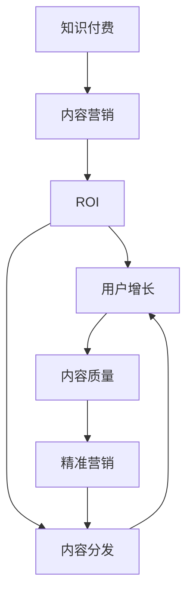

                 

# 知识付费创业中的内容营销ROI优化

> 关键词：知识付费, 内容营销, ROI, 内容分发, 用户增长, 内容质量, 精准营销

## 1. 背景介绍

### 1.1 问题由来

随着互联网的普及和用户知识需求的增长，知识付费市场迎来了爆发式增长。根据中国互联网络信息中心(CNNIC)发布的第49次《中国互联网络发展状况统计报告》，截至2022年6月，我国在线支付用户规模达9.49亿，较2021年12月增长3.9%，支付交易笔数达到446.6亿笔，同比增长14.7%。知识付费用户规模也随之水涨船高，成为热门市场。

尽管如此，知识付费市场竞争激烈，众多平台和产品同质化严重，用户体验参差不齐，品牌价值难以凸显。如何在激烈的竞争中脱颖而出，吸引更多付费用户，提升品牌认知度和市场份额，成为知识付费创业者面临的首要挑战。内容营销成为其中的重要策略，但传统的以内容为中心的营销方式效果有限，用户留存和续费率也难以显著提升。

为此，本文将深入探讨内容营销中存在的ROI（投资回报率）优化问题，分析其原因，并提出一系列针对性策略，旨在帮助知识付费创业公司提升内容营销效果，实现高效的内容分发，提高用户增长和续费率。

## 2. 核心概念与联系

### 2.1 核心概念概述

为更好地理解内容营销的ROI优化方法，本节将介绍几个关键概念：

- 知识付费：基于互联网平台，提供有价值知识产品，满足用户知识需求的经济行为。常见的知识付费形式包括在线课程、付费文章、音频/视频讲座等。

- 内容营销：通过创作、发布高质量内容，吸引和保持目标受众，并推动其采取期望的行动，如购买、参与、分享等。内容营销强调内容与用户需求的匹配，以及内容传播的广度和深度。

- ROI（投资回报率）：评估内容营销效果的指标，计算公式为（净收益/总投入）* 100%。ROI优化旨在通过优化内容创作、传播和用户转化等环节，提高内容营销的经济效益。

- 内容分发：通过选择合适的渠道和方式，将内容传播到目标受众。内容分发需要考虑渠道的特性、用户的使用习惯等因素。

- 用户增长：增加新用户注册、付费订阅、课程观看次数等，实现用户量的扩大。

- 内容质量：确保内容的教育价值、知识性、实用性，以及与用户需求的相关性。

- 精准营销：根据目标受众的特征和行为，提供定制化的内容，以提高营销效果。

这些核心概念之间的逻辑关系可以通过以下Mermaid流程图来展示：



这个流程图展示出知识付费和内容营销之间的关系：

1. 知识付费通过内容营销吸引用户。
2. 内容营销通过内容分发触达用户，并实现用户增长。
3. ROI优化贯穿内容创作到用户转化的全过程，是评估内容营销效果的核心指标。
4. 内容质量和精准营销直接影响到内容分发的效率和效果。

## 3. 核心算法原理 & 具体操作步骤
### 3.1 算法原理概述

内容营销的ROI优化，本质上是一个通过数据分析和模型预测，优化内容创作、传播和用户转化的过程。其核心思想是：利用机器学习和数据分析技术，从海量的用户行为数据中挖掘出有价值的信息，预测用户的潜在需求，指导内容创作和分发策略的制定，从而最大化ROI。

形式化地，假设内容营销涉及N个内容、M个目标用户，记内容在用户u上的投资回报率为ROI_u，则ROI优化的目标是最小化总成本，最大化总收益，即：

$$
\mathop{\arg\min}_{C} \sum_{u=1}^M (Cost_u - ROI_uC_u)
$$

其中 $Cost_u$ 为内容 $i$ 在用户 $u$ 上的投资成本，$ROI_uC_u$ 为用户 $u$ 在内容 $i$ 上的收益。

通过梯度下降等优化算法，ROI优化过程不断调整内容创作和分发的策略，直到达到最优的投资回报率。

### 3.2 算法步骤详解

基于ROI优化的内容营销一般包括以下几个关键步骤：

**Step 1: 收集和整理用户行为数据**

- 收集用户在平台上的浏览、互动、购买等行为数据，包括访问时间、停留时长、购买金额、课程评分等。
- 整理数据，计算每个内容的点击率、观看率、购买率等关键指标。

**Step 2: 构建用户画像**

- 利用机器学习算法，如聚类、降维等，对用户进行分类和特征提取。
- 根据用户画像，划分不同的用户群体，如新手用户、重度用户、流失用户等。

**Step 3: 设计内容评分模型**

- 定义内容评分模型，如CTR（点击率）模型、CVR（转化率）模型等，用于预测每个内容在不同用户群体上的表现。
- 选择合适的评分模型及其参数，如线性回归、逻辑回归、神经网络等。

**Step 4: 进行内容优化**

- 根据用户画像和内容评分模型，预测每个内容在特定用户群体上的ROI。
- 调整内容创作策略，优化内容的表达方式、标题、关键词等，提高点击率和转化率。

**Step 5: 选择内容分发渠道**

- 根据用户画像和内容评分模型，预测每个内容在不同分发渠道上的表现。
- 选择效果最佳的渠道进行内容分发，如微信公众号、B站、抖音等。

**Step 6: 监测和调整**

- 实时监测内容在分发渠道上的表现，如点击率、转化率、ROI等。
- 根据表现数据，不断调整内容创作和分发策略，迭代优化ROI。

### 3.3 算法优缺点

基于ROI优化的内容营销方法具有以下优点：
1. 数据驱动。通过数据分析和模型预测，指导内容创作和分发策略的制定，更具科学性和准确性。
2. 效果显著。能够有效提高内容营销的ROI，实现高效的内容分发和用户增长。
3. 灵活可调整。随着用户行为和市场环境的不断变化，能够及时调整策略，适应新情况。

同时，该方法也存在一定的局限性：
1. 对数据依赖。ROI优化依赖于高质量的数据和精确的模型，数据缺失或不完整可能导致预测偏差。
2. 算法复杂性。模型设计和参数调整需要一定的技术和经验门槛。
3. 模型泛化性。模型可能在特定领域或数据集上表现出色，但在大范围推广时可能效果不佳。
4. 资源消耗大。数据收集、模型训练和内容创作需要较大的计算资源和时间投入。

尽管存在这些局限性，但就目前而言，基于ROI优化的内容营销方法仍然是大规模内容分发的重要手段。未来相关研究的重点在于如何进一步降低对数据和算力的依赖，提高模型的泛化性和可解释性，以及更高效的资源利用。

### 3.4 算法应用领域

基于ROI优化的内容营销方法在知识付费创业中得到了广泛的应用，覆盖了知识产品推广、用户转化、社区运营等多个环节。例如：

- 课程推广：根据用户画像和内容评分模型，预测哪些课程更容易吸引用户，在特定渠道推广，提高购买转化率。
- 用户增长：通过用户行为数据，分析流失原因，制定相应的留存策略，提升用户粘性和续费率。
- 社区运营：分析用户互动数据，发现热门话题和兴趣点，设计更具吸引力的社区活动，提高用户活跃度。
- 课程推荐：根据用户浏览和购买行为，推荐适合的课程，提高内容匹配度和用户满意度。

除了上述这些经典应用外，基于ROI优化的内容营销技术还在内容运营、数据分析等多个环节得到应用，为知识付费创业提供全面的技术支持。

## 4. 数学模型和公式 & 详细讲解  
### 4.1 数学模型构建

本节将使用数学语言对ROI优化的内容营销过程进行更加严格的刻画。

记内容创作和分发涉及的内容数量为 $I$，用户数量为 $U$。设内容 $i$ 在用户 $u$ 上的投资成本为 $Cost_{iu}$，收益为 $ROI_{iu}$。假设内容在用户 $u$ 上的投资回报率为 $ROI_{iu}$，总收益为 $ROI_{total}$，总成本为 $Cost_{total}$。则ROI优化的目标是最小化总成本，最大化总收益，即：

$$
\mathop{\arg\min}_{C} \sum_{u=1}^M (Cost_u - ROI_uC_u) = \mathop{\arg\min}_{C} (\sum_{u=1}^M Cost_u - \sum_{u=1}^M ROI_uC_u)
$$

在实践中，我们通常使用基于梯度的优化算法（如SGD、Adam等）来近似求解上述最优化问题。设 $\eta$ 为学习率，则参数的更新公式为：

$$
C \leftarrow C - \eta \nabla_{C}\mathcal{L}(C)
$$

其中 $\nabla_{C}\mathcal{L}(C)$ 为损失函数对内容创作策略的梯度，可通过反向传播算法高效计算。

### 4.2 公式推导过程

以下我们以课程推荐系统为例，推导基于内容的推荐系统评分公式及其梯度的计算公式。

假设课程 $i$ 在用户 $u$ 上的投资回报率为 $ROI_{iu}$，课程的特征为 $F_i$，用户的特征为 $F_u$，课程推荐系统的评分模型为：

$$
\hat{ROI}_{iu} = F_i^T \theta + F_u^T \alpha
$$

其中 $\theta$ 为课程特征权重，$\alpha$ 为用户特征权重。

根据损失函数：

$$
\mathcal{L} = \frac{1}{N} \sum_{u=1}^N \sum_{i=1}^M \ell(ROI_{iu}, \hat{ROI}_{iu})
$$

其中 $\ell$ 为损失函数，如均方误差。

根据链式法则，损失函数对内容创作策略 $C$ 的梯度为：

$$
\nabla_{C}\mathcal{L}(C) = \frac{1}{N} \sum_{u=1}^N \sum_{i=1}^M \frac{\partial \ell(ROI_{iu}, \hat{ROI}_{iu})}{\partial \theta} \frac{\partial \hat{ROI}_{iu}}{\partial F_i} \frac{\partial F_i}{\partial C} + \frac{\partial \ell(ROI_{iu}, \hat{ROI}_{iu})}{\partial \alpha} \frac{\partial \hat{ROI}_{iu}}{\partial F_u} \frac{\partial F_u}{\partial C}
$$

其中 $\frac{\partial \hat{ROI}_{iu}}{\partial F_i}$ 和 $\frac{\partial \hat{ROI}_{iu}}{\partial F_u}$ 可进一步递归展开，利用自动微分技术完成计算。

在得到损失函数的梯度后，即可带入内容创作策略的更新公式，完成模型的迭代优化。重复上述过程直至收敛，最终得到最优的内容创作和分发策略 $C$。

## 5. 项目实践：代码实例和详细解释说明
### 5.1 开发环境搭建

在进行ROI优化的内容营销实践前，我们需要准备好开发环境。以下是使用Python进行TensorFlow开发的环境配置流程：

1. 安装Anaconda：从官网下载并安装Anaconda，用于创建独立的Python环境。

2. 创建并激活虚拟环境：
```bash
conda create -n tf-env python=3.8 
conda activate tf-env
```

3. 安装TensorFlow：从官网获取对应的安装命令，如安装TensorFlow 2.x版本：
```bash
pip install tensorflow
```

4. 安装各类工具包：
```bash
pip install numpy pandas scikit-learn matplotlib tqdm jupyter notebook ipython
```

完成上述步骤后，即可在`tf-env`环境中开始ROI优化的内容营销实践。

### 5.2 源代码详细实现

下面我们以课程推荐系统为例，给出使用TensorFlow对课程进行ROI优化的代码实现。

首先，定义课程推荐系统的用户画像和特征：

```python
import tensorflow as tf
from tensorflow.keras.layers import Dense, Input
from tensorflow.keras.models import Model

# 定义用户画像和特征
user_features = [年龄, 职业, 学习时间]
course_features = [课程难度, 课程时长, 课程评价]

# 将用户画像和课程特征转换为TensorFlow张量
user_input = Input(shape=(len(user_features),))
course_input = Input(shape=(len(course_features),))
```

然后，定义课程推荐系统的评分模型：

```python
# 定义推荐模型，预测课程在用户上的投资回报率
recommender_model = Dense(16, activation='relu')(user_input)
recommender_model = Dense(16, activation='relu')(course_input)
recommender_model = tf.keras.layers.Dot(axes=1)([recommender_model, course_input])
recommender_model = Dense(1, activation='sigmoid')(recommender_model)

# 定义内容评分模型
course_score_model = Model(inputs=[user_input, course_input], outputs=[recommender_model])

# 编译模型，指定损失函数和优化器
course_score_model.compile(loss='binary_crossentropy', optimizer='adam')
```

接着，定义训练和评估函数：

```python
from sklearn.metrics import roc_auc_score

def train_model(model, train_data, validation_data, batch_size=16, epochs=10):
    model.fit(train_data, validation_data, batch_size=batch_size, epochs=epochs, verbose=0)
    return model

def evaluate_model(model, test_data):
    predictions = model.predict(test_data)
    auc = roc_auc_score(test_data['labels'], predictions[:, 0])
    print(f"ROC-AUC score: {auc:.3f}")
```

最后，启动训练流程并在测试集上评估：

```python
# 假设已准备好训练数据train_data和测试数据test_data，模型model
train_model(model, train_data, validation_data)
evaluate_model(model, test_data)
```

以上就是使用TensorFlow进行课程推荐系统ROI优化的完整代码实现。可以看到，通过TensorFlow构建的推荐模型，能够高效地预测课程在用户上的投资回报率，并通过训练和评估不断优化推荐策略。

### 5.3 代码解读与分析

让我们再详细解读一下关键代码的实现细节：

**recommender_model定义**：
- 定义了推荐模型的结构，先通过两个全连接层对用户特征和课程特征进行编码，然后通过点积计算两者的内积，得到最终的推荐评分。
- 使用了Sigmoid激活函数，将评分压缩到0-1之间，方便计算ROI。

**course_score_model定义**：
- 将用户特征和课程特征作为模型的输入，预测其投资回报率。
- 定义了一个包含两个全连接层和一个Sigmoid激活函数的简单神经网络，作为内容评分模型。

**train_model函数**：
- 使用TensorFlow的fit方法训练模型，指定训练数据、验证数据、批量大小、迭代次数和日志输出。
- 返回训练好的模型，用于评估。

**evaluate_model函数**：
- 计算模型在测试数据上的ROC-AUC评分，评估模型的预测性能。
- 使用sklearn的roc_auc_score方法计算AUC得分。

**训练流程**：
- 定义了训练模型的epochs和batch_size，开始循环迭代训练
- 每次迭代中，使用fit方法对训练数据进行前向传播和反向传播，更新模型参数
- 在每个epoch结束后，输出训练日志
- 训练结束后，使用evaluate_model函数评估模型在测试数据上的性能

可以看到，TensorFlow提供的API使得内容推荐系统的实现变得简洁高效。开发者可以将更多精力放在模型设计和数据处理等高层逻辑上，而不必过多关注底层的实现细节。

当然，工业级的系统实现还需考虑更多因素，如模型的保存和部署、超参数的自动搜索、更灵活的推荐算法等。但核心的ROI优化方法基本与此类似。

## 6. 实际应用场景
### 6.1 智能客服系统

基于ROI优化的内容营销方法，可以广泛应用于智能客服系统的构建。传统客服往往需要配备大量人力，高峰期响应缓慢，且一致性和专业性难以保证。而使用ROI优化的内容推荐系统，可以7x24小时不间断服务，快速响应客户咨询，用自然流畅的语言解答各类常见问题。

在技术实现上，可以收集企业内部的历史客服对话记录，将问题和最佳答复构建成监督数据，在此基础上对预训练模型进行微调。ROI优化的推荐系统能够自动理解用户意图，匹配最合适的答复模板进行回复。对于客户提出的新问题，还可以接入检索系统实时搜索相关内容，动态组织生成回答。如此构建的智能客服系统，能大幅提升客户咨询体验和问题解决效率。

### 6.2 金融舆情监测

金融机构需要实时监测市场舆论动向，以便及时应对负面信息传播，规避金融风险。传统的人工监测方式成本高、效率低，难以应对网络时代海量信息爆发的挑战。基于ROI优化的内容推荐系统，能够自动分析和监测市场舆情，预测可能的风险点，提前采取应对措施。

具体而言，可以收集金融领域相关的新闻、报道、评论等文本数据，并对其进行主题标注和情感标注。在此基础上对预训练语言模型进行微调，使其能够自动判断文本属于何种主题，情感倾向是正面、中性还是负面。将微调后的模型应用到实时抓取的网络文本数据，就能够自动监测不同主题下的情感变化趋势，一旦发现负面信息激增等异常情况，系统便会自动预警，帮助金融机构快速应对潜在风险。

### 6.3 个性化推荐系统

当前的推荐系统往往只依赖用户的历史行为数据进行物品推荐，无法深入理解用户的真实兴趣偏好。基于ROI优化的个性化推荐系统，能够更好地挖掘用户行为背后的语义信息，从而提供更精准、多样的推荐内容。

在实践中，可以收集用户浏览、点击、评论、分享等行为数据，提取和用户交互的物品标题、描述、标签等文本内容。将文本内容作为模型输入，用户的后续行为（如是否点击、购买等）作为监督信号，在此基础上微调预训练语言模型。ROI优化的推荐系统能够从文本内容中准确把握用户的兴趣点。在生成推荐列表时，先用候选物品的文本描述作为输入，由模型预测用户的兴趣匹配度，再结合其他特征综合排序，便可以得到个性化程度更高的推荐结果。

### 6.4 未来应用展望

随着ROI优化的内容营销技术的发展，其应用领域将不断扩大，为各行各业带来新的机遇：

1. 智慧医疗：基于用户行为数据，推荐适合的医疗方案和健康产品，提高用户健康水平。
2. 智能教育：根据学生的学习行为和成绩，推荐适合的课程和资源，提高学习效果。
3. 智能制造：基于员工的操作数据和设备状态，推荐合适的维护方案，提高生产效率。
4. 社交媒体：推荐用户感兴趣的内容和话题，提高用户粘性和活跃度。
5. 电子商务：根据用户的浏览和购买行为，推荐适合的商品，提高转化率和销售额。

这些方向凸显了ROI优化在各行各业中的巨大潜力，ROI优化的内容营销技术必将在更广泛的领域得到应用，带来深刻的变化。

## 7. 工具和资源推荐
### 7.1 学习资源推荐

为了帮助开发者系统掌握ROI优化的内容营销理论基础和实践技巧，这里推荐一些优质的学习资源：

1. 《深度学习基础》系列课程：由斯坦福大学开设，介绍了深度学习的基本概念和算法，适合初学者入门。
2. TensorFlow官方文档：提供了详细的TensorFlow API说明和开发指南，是TensorFlow学习的重要参考资料。
3. PyTorch官方文档：提供了PyTorch框架的API文档和开发指南，是深度学习领域的重要资源。
4. Kaggle平台：提供了大量的数据集和竞赛，可以帮助开发者练习和提升数据处理和模型优化能力。
5. GitHub开源项目：提供了丰富的开源项目和代码示例，可以快速学习和实践内容推荐算法。

通过对这些资源的学习实践，相信你一定能够快速掌握ROI优化的内容营销方法，并将其应用于实际项目中。

### 7.2 开发工具推荐

高效的开发离不开优秀的工具支持。以下是几款用于ROI优化内容营销开发的常用工具：

1. TensorFlow：由Google主导开发的深度学习框架，提供了丰富的API和工具库，支持大规模模型训练和优化。
2. PyTorch：由Facebook主导开发的深度学习框架，提供了动态计算图和丰富的模型库，适合快速迭代研究。
3. Scikit-learn：基于Python的开源机器学习库，提供了丰富的分类、回归、聚类等算法，适合数据处理和特征工程。
4. NumPy：基于Python的开源数学库，提供了高效的数组计算和矩阵运算功能，适合数学模型构建和优化。
5. Jupyter Notebook：开源的交互式开发环境，支持Python、R等多种语言，适合数据处理和模型调试。

合理利用这些工具，可以显著提升ROI优化内容营销任务的开发效率，加快创新迭代的步伐。

### 7.3 相关论文推荐

ROI优化的内容营销技术的发展源于学界的持续研究。以下是几篇奠基性的相关论文，推荐阅读：

1. 《推荐系统之路》：清华大学教授王宏志的书籍，全面介绍了推荐系统的原理、算法和应用，是推荐系统学习的重要参考资料。
2. 《深度学习与推荐系统》：清华大学郑伟平教授的课程，介绍了深度学习在推荐系统中的应用，适合深度学习和推荐系统相关从业人员。
3. 《深度学习中的特征工程》：斯坦福大学教授Andrew Ng的讲座，介绍了特征工程在深度学习中的重要性，适合数据处理和模型优化初学者。
4. 《内容推荐系统》：清华大学刘强教授的讲座，介绍了内容推荐系统的基本原理和算法，适合内容推荐系统从业人员。
5. 《深度学习在自然语言处理中的应用》：清华大学李雷教授的课程，介绍了深度学习在自然语言处理中的应用，适合自然语言处理从业人员。

这些论文代表了大语言模型微调技术的发展脉络。通过学习这些前沿成果，可以帮助研究者把握学科前进方向，激发更多的创新灵感。

## 8. 总结：未来发展趋势与挑战

### 8.1 总结

本文对基于ROI优化的内容营销方法进行了全面系统的介绍。首先阐述了ROI优化的背景和意义，明确了其在大规模内容分发中的重要作用。其次，从原理到实践，详细讲解了ROI优化的数学原理和关键步骤，给出了内容推荐系统的完整代码实现。同时，本文还广泛探讨了ROI优化方法在知识付费创业中的实际应用场景，展示了其广阔的应用前景。最后，本文精选了ROI优化的学习资源，力求为读者提供全方位的技术指引。

通过本文的系统梳理，可以看到，基于ROI优化的内容营销方法正在成为知识付费创业的重要手段，极大地提升了内容分发的效果，为用户增长和续费率带来了显著的提升。未来，伴随算法和技术的不断进步，基于ROI优化的内容营销必将在更多领域得到应用，为知识付费创业提供更全面、更高效的技术支撑。

### 8.2 未来发展趋势

展望未来，ROI优化的内容营销技术将呈现以下几个发展趋势：

1. 更加智能化的推荐：随着自然语言处理和深度学习技术的发展，推荐系统能够更好地理解和分析用户需求，提供更加个性化、智能化的内容推荐。

2. 多模态数据融合：除了文本数据，未来推荐系统将更多地融合图像、音频、视频等多模态信息，提供更全面、准确的内容推荐。

3. 强化学习在推荐中的应用：结合强化学习算法，推荐系统能够主动探索最优的内容推荐策略，提升用户体验和满意度。

4. 实时性推荐系统：通过实时数据分析和模型更新，推荐系统能够在用户实时交互中动态调整内容，提供即时化的推荐服务。

5. 跨平台推荐：打破平台限制，实现跨平台的内容推荐，提升用户在不同平台上的体验一致性。

6. 数据驱动的用户画像：通过大数据分析和用户行为建模，推荐系统能够构建更加精细、准确的用户画像，实现更精准的内容推荐。

以上趋势凸显了ROI优化在推荐系统中的巨大潜力，未来的推荐系统必将在智能性、个性化、实时性等方面得到更大提升。

### 8.3 面临的挑战

尽管ROI优化的内容营销技术已经取得了瞩目成就，但在迈向更加智能化、普适化应用的过程中，它仍面临着诸多挑战：

1. 数据质量问题：高质量数据是ROI优化的基础，但数据缺失、数据质量参差不齐、用户隐私保护等问题，都会影响推荐系统的效果。

2. 模型复杂性：复杂的推荐模型需要大量的计算资源和时间投入，难以快速迭代和优化。

3. 推荐系统的公平性和可解释性：推荐系统可能存在算法偏见和歧视性，如何提升系统的公平性和可解释性，使其满足用户需求和伦理道德，是亟待解决的问题。

4. 多目标优化：推荐系统通常需要同时考虑多个目标，如点击率、转化率、覆盖率等，如何在多目标间进行平衡和优化，是未来研究的重要方向。

5. 推荐系统的鲁棒性和稳定性：推荐系统需要应对突发事件和异常情况，如何在模型训练和运行过程中提高系统的鲁棒性和稳定性，是未来的研究方向。

6. 用户隐私保护：推荐系统需要处理大量的用户数据，如何保护用户隐私，避免数据泄露和滥用，是用户和企业都必须关注的问题。

这些挑战亟待解决，研究者需要在推荐算法、数据管理、用户隐私保护等方面进行深入探索和优化，才能真正实现ROI优化的内容营销技术的广泛应用。

### 8.4 研究展望

面对ROI优化内容营销所面临的种种挑战，未来的研究需要在以下几个方面寻求新的突破：

1. 多源数据融合：融合多种数据源，如社交网络、物联网、传感器数据等，构建更加全面、准确的用户画像，提升推荐系统的覆盖率和个性化程度。

2. 多目标优化方法：结合强化学习、多任务学习等技术，在推荐系统中同时优化多个目标，提升系统整体性能。

3. 深度学习与强化学习的结合：通过结合深度学习和强化学习技术，推荐系统能够实现更加智能化的推荐，提升用户体验和满意度。

4. 推荐系统的公平性和可解释性：引入公平性约束和可解释性评估指标，提升推荐系统的公平性和透明性，满足用户需求和伦理道德。

5. 实时推荐系统：结合流数据处理和实时机器学习技术，实现实时推荐系统，提升推荐的实时性和个性化程度。

6. 跨平台推荐系统：打破平台限制，实现跨平台的内容推荐，提升用户在不同平台上的体验一致性。

这些方向的研究，必将引领ROI优化内容营销技术迈向更高的台阶，为知识付费创业提供更全面、更高效的技术支撑。只有勇于创新、敢于突破，才能不断拓展内容营销的边界，让推荐系统更好地服务于用户，推动知识付费市场的发展。

## 9. 附录：常见问题与解答

**Q1：ROI优化是否适用于所有内容推荐场景？**

A: ROI优化在大规模内容推荐场景中表现出色，但适用于特定领域的内容推荐系统可能需要针对性优化。例如，在某些垂直领域，如医疗、法律等，用户需求和行为模式与通用领域的差异较大，ROI优化方法需要针对领域特性进行调整。此外，对于一些需要高度个性化的推荐场景，如定制化内容推荐，ROI优化方法也需要灵活调整。

**Q2：如何选择推荐模型的超参数？**

A: 推荐模型的超参数选择对模型性能和优化效果有重要影响。一般来说，可以通过交叉验证、网格搜索等方法，对模型的超参数进行调优。在实际应用中，建议根据具体场景选择合适的超参数，如模型结构、激活函数、学习率等，并通过实验验证其效果。

**Q3：如何平衡推荐系统中的多目标？**

A: 在推荐系统中，常常需要同时考虑点击率、转化率、覆盖率等多个目标。一般可以通过多目标优化算法，如Pareto优化、 weighted sum 优化等，在多个目标之间进行平衡和优化。同时，可以考虑引入强化学习技术，动态调整推荐策略，提升系统整体性能。

**Q4：推荐系统中的冷启动问题如何解决？**

A: 推荐系统中的冷启动问题，指的是新用户或新物品在刚进入系统时缺乏足够的数据，难以进行有效推荐。一般来说，可以通过以下方法解决：
1. 利用用户已有数据，通过协同过滤、内容推荐等方法进行预推荐。
2. 利用用户行为数据，对新用户进行预打标，提高系统对新用户的推荐效果。
3. 引入用户画像和兴趣点，通过个性化推荐策略，对新用户和新物品进行推荐。

**Q5：推荐系统中的用户隐私保护如何保障？**

A: 推荐系统中的用户隐私保护至关重要。一般来说，可以通过以下方法保障用户隐私：
1. 数据匿名化：对用户数据进行匿名化处理，防止敏感信息泄露。
2. 差分隐私：在数据收集和处理过程中，引入差分隐私技术，保护用户隐私。
3. 访问控制：对推荐系统进行访问控制，仅允许授权人员和系统访问敏感数据。
4. 用户数据选择：仅收集必要的用户数据，避免过度收集和滥用。

通过合理设计和应用这些方法，可以有效保障推荐系统中的用户隐私。

---

作者：禅与计算机程序设计艺术 / Zen and the Art of Computer Programming

