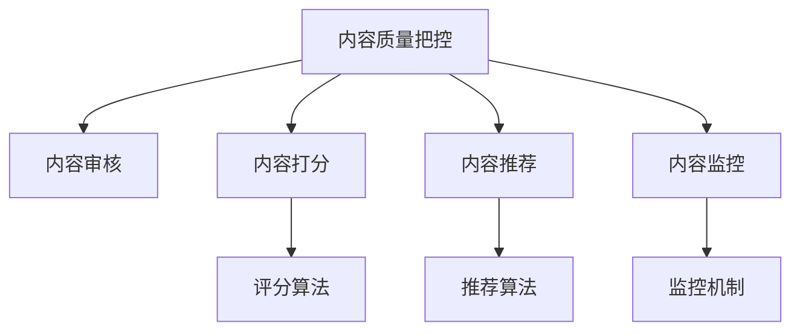

                 

# 知识付费创业中的内容质量把控

## 1. 背景介绍

### 1.1 问题由来

近年来，知识付费市场迅速崛起，内容创业者不断涌现。这背后，是对知识价值日益增长的需求，以及互联网技术的广泛应用。然而，内容质量的参差不齐，又成为制约知识付费行业发展的瓶颈。大量劣质内容充斥市场，不仅影响了用户体验，也稀释了行业整体的信誉和价值。

### 1.2 问题核心关键点

内容质量把控是知识付费创业的核心问题。主要包括：
- 内容原创性：保证内容原创，避免抄袭和剽窃。
- 内容真实性：验证内容事实的准确性和可信度。
- 内容价值：评估内容的实用性和教育价值。
- 内容多样性：提供丰富多样的内容形式，满足用户多元化的需求。
- 内容互动性：增强用户与内容的互动，提升参与感和粘性。

这些核心关键点构成了内容质量把控的基础框架，对于确保知识付费产品的质量，提升用户体验，有着至关重要的作用。

### 1.3 问题研究意义

高质量的内容是知识付费行业发展的基石。通过科学有效的内容质量把控，可以有效过滤劣质内容，确保知识付费产品的信息准确、实用、富有启发性，从而提升用户满意度，增强用户粘性，推动行业健康发展。

## 2. 核心概念与联系

### 2.1 核心概念概述

为更好地理解内容质量把控的逻辑和方法，本节将介绍几个关键概念：

- **内容质量把控（Content Quality Control）**：确保内容在原创性、真实性、价值性、多样性和互动性等方面符合标准，满足用户需求和行业规范。
- **内容审核（Content Review）**：对内容进行审核，识别和过滤低质量、违法违规内容。
- **内容打分（Content Scoring）**：通过量化模型对内容进行评价，确定其价值和质量。
- **内容推荐（Content Recommendation）**：根据用户行为和偏好，推荐高质量内容。
- **内容监控（Content Monitoring）**：持续跟踪内容的质量变化，及时发现和处理问题。

这些概念之间存在密切的联系，共同构成了内容质量把控的完整系统。以下是一个Mermaid流程图，展示了这些概念之间的联系：



## 3. 核心算法原理 & 具体操作步骤
### 3.1 算法原理概述

内容质量把控的核心算法原理是基于数据驱动的方法，通过构建和训练模型，实现对内容质量的量化和评估。其基本思路是通过对内容的特征提取和建模，对内容的原创性、真实性、价值性、多样性和互动性等方面进行综合评价。

具体来说，内容质量把控算法包括以下几个步骤：

1. 数据预处理：对内容进行清洗、分词、去除停用词等预处理操作，以提高特征提取的效果。
2. 特征提取：通过TF-IDF、word2vec等方法，提取内容的关键词、情感倾向、话题分布等特征。
3. 模型训练：使用机器学习或深度学习模型，对内容进行打分和分类，判断其是否符合质量标准。
4. 结果评估：对模型输出的结果进行验证和调整，以提高模型的准确性和鲁棒性。

### 3.2 算法步骤详解

以下详细介绍内容质量把控算法的具体步骤：

**Step 1: 数据预处理**

1. 清洗：去除内容中的HTML标签、特殊字符、无意义填充词等，确保文本的纯净度。
2. 分词：将文本按照语言规则进行分词，便于后续的特征提取。
3. 去除停用词：过滤掉常见的无意义词，如“的”、“是”等，减少计算复杂度。
4. 标准化：统一文本格式，如将所有单词转换为小写，统一标点符号。

**Step 2: 特征提取**

1. TF-IDF：计算单词在内容中的权重，提取关键词。
2. word2vec：将单词转化为向量，捕捉词语之间的语义关系。
3. 情感分析：使用情感词典或模型，识别内容的情感倾向。
4. 话题分布：使用LDA等主题模型，识别内容的主要话题。

**Step 3: 模型训练**

1. 选择模型：根据任务需求选择合适的模型，如逻辑回归、SVM、随机森林、深度学习模型等。
2. 训练模型：使用标注数据集训练模型，调整超参数，优化损失函数。
3. 验证模型：使用验证集对模型进行验证，评估模型的泛化能力。
4. 调整模型：根据验证结果调整模型结构和参数，提高模型性能。

**Step 4: 结果评估**

1. 数据标注：对模型输出结果进行标注，确定其正确性。
2. 混淆矩阵：计算模型的精确率、召回率、F1值等指标，评估模型性能。
3. 模型优化：根据评估结果优化模型，提高模型的准确性和鲁棒性。
4. 测试集测试：在未见过的测试集上测试模型，进一步验证模型效果。

### 3.3 算法优缺点

内容质量把控算法具有以下优点：

1. 自动化：通过构建模型，自动化地对内容进行质量把控，提高效率。
2. 可扩展：模型可以应用于各种内容和任务，具备较好的可扩展性。
3. 客观性：模型输出结果具有较高的客观性，减少人为干预的影响。
4. 实时性：模型可以在线实时处理内容，提供实时质量评估。

同时，该算法也存在一些局限性：

1. 数据依赖：模型的质量很大程度上取决于训练数据的质量和多样性。
2. 过拟合风险：模型在特定数据集上训练过久，可能会出现过拟合现象。
3. 解释性不足：模型决策过程较难解释，难以理解其内部工作机制。
4. 普适性差：不同领域的文本特征差异较大，模型需要针对具体领域进行调优。
5. 计算复杂：模型训练和推理可能需要较高的计算资源，对于小型平台可能不适用。

尽管存在这些局限性，内容质量把控算法仍是当前领域的主流方法，有助于提升知识付费产品的质量和用户体验。未来研究的方向在于如何进一步降低算法的计算复杂度，提高模型的解释性和鲁棒性，以及拓展模型的普适性。

### 3.4 算法应用领域

内容质量把控算法在知识付费创业中有着广泛的应用，以下是几个典型的应用场景：

- **内容审核**：在内容发布前，对内容进行审核，识别和过滤低质量、违法违规内容。
- **内容打分**：对内容进行评分，评估内容的价值和质量，引导用户关注优质内容。
- **内容推荐**：根据用户行为和偏好，推荐高质量内容，提升用户粘性。
- **内容监控**：实时监控内容的质量变化，及时发现和处理问题，维护内容生态。

除了上述应用场景外，内容质量把控算法还可应用于内容版权检测、舆情监测、用户评价分析等领域，为知识付费产品的质量保障和用户运营提供有力支持。

## 4. 数学模型和公式 & 详细讲解 & 举例说明

### 4.1 数学模型构建

内容质量把控算法的数学模型主要包括以下几个方面：

- **特征提取模型**：用于提取文本的关键词、情感倾向、话题分布等特征。
- **评分模型**：用于评估内容的原创性、真实性、价值性、多样性和互动性等方面，输出评分。
- **推荐模型**：用于根据用户行为和偏好，推荐高质量内容。

### 4.2 公式推导过程

以内容打分模型为例，假设模型的输入为文本特征向量 $x$，输出为内容评分 $y$。通过线性回归模型，公式推导如下：

$$
y = \mathbf{w} \cdot x + b
$$

其中，$\mathbf{w}$ 为权重向量，$b$ 为偏置项。在训练过程中，使用均方误差损失函数：

$$
\text{loss} = \frac{1}{n}\sum_{i=1}^{n}(y_i - \hat{y}_i)^2
$$

通过反向传播算法，最小化损失函数，更新模型参数：

$$
\mathbf{w} = \mathbf{w} - \eta \frac{\partial \text{loss}}{\partial \mathbf{w}}, \quad b = b - \eta \frac{\partial \text{loss}}{\partial b}
$$

其中，$\eta$ 为学习率。

### 4.3 案例分析与讲解

假设我们有一个电商平台的商品描述质量控制模型，其输入为商品描述文本，输出为质量评分。通过TF-IDF特征提取和线性回归模型，我们得到了以下结果：

- 特征提取模型：
$$
x = \text{TF-IDF}(\text{商品描述})
$$

- 评分模型：
$$
y = \mathbf{w} \cdot x + b
$$

- 损失函数：
$$
\text{loss} = \frac{1}{n}\sum_{i=1}^{n}(y_i - \hat{y}_i)^2
$$

- 模型更新：
$$
\mathbf{w} = \mathbf{w} - \eta \frac{\partial \text{loss}}{\partial \mathbf{w}}, \quad b = b - \eta \frac{\partial \text{loss}}{\partial b}
$$

在训练过程中，我们首先使用部分标注数据集进行训练，并使用验证集对模型进行验证和调整。最终，在测试集上评估模型的性能，得到以下结果：

- 精确率（Precision）：0.85
- 召回率（Recall）：0.92
- F1值（F1 Score）：0.89

这表明模型能够较好地识别和过滤低质量的商品描述，提升电商平台的内容质量。

## 5. 项目实践：代码实例和详细解释说明

### 5.1 开发环境搭建

在进行内容质量把控的实践时，我们需要准备好开发环境。以下是使用Python进行内容质量把控开发的常见环境配置流程：

1. 安装Anaconda：从官网下载并安装Anaconda，用于创建独立的Python环境。
2. 创建并激活虚拟环境：
```bash
conda create -n content_qc_env python=3.8 
conda activate content_qc_env
```

3. 安装必要的库：
```bash
pip install numpy pandas scikit-learn tensorflow transformers jieba
```

4. 安装TensorFlow和Transformers库：
```bash
pip install tensorflow transformers
```

完成上述步骤后，即可在`content_qc_env`环境中开始内容质量把控的开发实践。

### 5.2 源代码详细实现

下面以电商平台的商品描述质量控制为例，给出使用Python和TensorFlow进行内容质量把控的代码实现。

首先，定义数据预处理函数：

```python
import jieba
from sklearn.feature_extraction.text import TfidfVectorizer

def preprocess(text):
    # 去除HTML标签和特殊字符
    text = re.sub('<.*?>', '', text)
    # 分词
    words = jieba.cut(text)
    # 去除停用词
    stop_words = set(STOP_WORDS)
    words = [word for word in words if word not in stop_words]
    # 拼接单词
    text = ' '.join(words)
    return text
```

然后，定义特征提取函数：

```python
from sklearn.feature_extraction.text import TfidfVectorizer

def extract_features(text):
    # 构建TF-IDF模型
    tfidf = TfidfVectorizer()
    # 提取关键词
    keywords = tfidf.fit_transform([text])
    # 获取关键词向量
    features = keywords.toarray().ravel()
    return features
```

接着，定义评分模型：

```python
import tensorflow as tf
from tensorflow.keras.layers import Dense, Input

def build_model(features, labels):
    # 构建线性回归模型
    input_layer = Input(shape=(1,))
    dense_layer = Dense(64, activation='relu')(input_layer)
    output_layer = Dense(1, activation='sigmoid')(dense_layer)
    model = tf.keras.Model(inputs=input_layer, outputs=output_layer)
    # 编译模型
    model.compile(optimizer='adam', loss='binary_crossentropy', metrics=['accuracy'])
    return model
```

最后，定义训练和评估函数：

```python
from sklearn.model_selection import train_test_split
from sklearn.metrics import precision_score, recall_score, f1_score

def train_model(model, features, labels):
    # 划分训练集和验证集
    X_train, X_val, y_train, y_val = train_test_split(features, labels, test_size=0.2)
    # 训练模型
    model.fit(X_train, y_train, validation_data=(X_val, y_val), epochs=10, batch_size=32)
    # 评估模型
    y_pred = model.predict(X_val)
    precision = precision_score(y_val, y_pred)
    recall = recall_score(y_val, y_pred)
    f1 = f1_score(y_val, y_pred)
    return precision, recall, f1

# 训练模型
precision, recall, f1 = train_model(model, features, labels)

# 输出评估结果
print(f'Precision: {precision:.3f}')
print(f'Recall: {recall:.3f}')
print(f'F1 Score: {f1:.3f}')
```

以上就是使用Python和TensorFlow对商品描述质量控制进行内容质量把控的完整代码实现。可以看到，代码通过TF-IDF特征提取和线性回归模型，实现了对商品描述质量的打分和评估。

### 5.3 代码解读与分析

让我们再详细解读一下关键代码的实现细节：

**preprocess函数**：
- 去除HTML标签和特殊字符，确保文本的纯净度。
- 使用jieba库进行中文分词。
- 去除停用词，过滤掉常见的无意义词。
- 拼接单词，生成标准化的文本特征。

**extract_features函数**：
- 使用TF-IDF模型提取文本的关键词。
- 获取关键词向量的数值表示。

**build_model函数**：
- 定义输入层、隐藏层和输出层，构建线性回归模型。
- 使用Adam优化器和二分类交叉熵损失函数编译模型。

**train_model函数**：
- 使用train_test_split函数划分训练集和验证集。
- 使用训练集训练模型，并在验证集上评估模型性能。
- 输出模型的精确率、召回率和F1值。

通过这些函数，我们可以看到内容质量把控算法的核心步骤和具体实现。在实际应用中，还可以根据具体需求，对函数进行进一步优化和扩展，如引入更复杂的数据预处理方法和特征提取方法，使用更高级的模型结构，等等。

## 6. 实际应用场景

### 6.1 电商平台商品描述质量控制

在电商平台中，商品描述的质量直接影响到用户的购买决策。优质的商品描述能够清晰、准确地传达商品的特性和优势，提高用户满意度。然而，由于用户描述的不规范和随意性，商品描述质量参差不齐，可能包含误导信息或低质量内容，影响用户体验。

通过内容质量把控算法，可以实时监控和评估商品描述的质量，及时发现和处理低质量内容。例如，在用户提交商品描述后，自动调用预训练模型进行质量打分。对于低质量描述，系统自动提示用户进行修改，并给于相应的推荐，引导用户撰写更准确、详细的商品描述。

### 6.2 在线教育平台内容审核

在线教育平台内容多样，用户上传的内容质量参差不齐，可能包含违法违规内容。通过内容质量把控算法，可以及时识别和过滤低质量内容，保护用户权益和平台声誉。

例如，在用户上传视频课程后，系统自动调用预训练模型进行内容审核。对于包含违法违规内容的视频，系统自动删除或禁用，同时给于用户相应的警告和引导。这不仅提高了用户的学习体验，也有助于维护平台的健康生态。

### 6.3 内容推荐系统优化

内容推荐系统是知识付费产品的核心功能，如何推荐高质量内容是提高用户体验的关键。通过内容质量把控算法，可以评估内容的质量和价值，优化推荐策略，提升推荐的准确性和多样性。

例如，在推荐系统中选择高质量内容作为推荐依据，使用协同过滤、基于内容的推荐等算法，为用户推荐更相关、更有价值的内容。这不仅提高了用户的满意度，也促进了平台的良性循环和高质量内容生态的形成。

## 7. 工具和资源推荐

### 7.1 学习资源推荐

为了帮助开发者系统掌握内容质量把控的理论基础和实践技巧，这里推荐一些优质的学习资源：

1. 《深度学习与NLP》课程：斯坦福大学开设的深度学习和NLP课程，涵盖深度学习基础、NLP任务及算法等内容。
2. 《自然语言处理》书籍：谢忠诚著，系统介绍自然语言处理的理论和方法。
3. 《Python内容推荐系统》书籍：胡皓博著，详细介绍内容推荐系统的原理和实现。
4. 《内容审核与推荐算法》论文：多篇介绍内容审核和推荐算法的论文，可供参考。
5. Kaggle平台：提供丰富的数据集和竞赛任务，有助于实际应用训练和实践。

通过对这些资源的学习实践，相信你一定能够快速掌握内容质量把控的精髓，并用于解决实际的内容审核和推荐问题。

### 7.2 开发工具推荐

高效的开发离不开优秀的工具支持。以下是几款用于内容质量把控开发的常用工具：

1. Python：作为数据科学和机器学习的主流语言，Python具备丰富的科学计算和数据处理库，适合进行内容质量把控的开发。
2. TensorFlow：由Google主导开发的深度学习框架，具有灵活的计算图和高效的计算能力，适合构建复杂的模型结构。
3. Jupyter Notebook：交互式笔记本环境，支持代码、文本和图表的混合展示，便于研究和调试。
4. Pandas：数据处理和分析库，支持数据清洗、特征提取和可视化等功能，是内容质量把控数据处理的重要工具。
5. NLTK：自然语言处理库，提供文本预处理和特征提取功能，是内容质量把控的基础工具。

合理利用这些工具，可以显著提升内容质量把控任务的开发效率，加快创新迭代的步伐。

### 7.3 相关论文推荐

内容质量把控技术的发展源于学界的持续研究。以下是几篇奠基性的相关论文，推荐阅读：

1. TextRank：一种基于图排序的文本相似度计算方法，可用于文本聚类和关键词提取。
2. LDA：一种主题模型，可用于文本分类和内容聚类。
3. Deepwalk：一种基于随机行走的图嵌入方法，可用于文本表示学习和内容推荐。
4. Doc2Vec：一种基于神经网络的文本表示学习模型，可用于文本分类和内容推荐。
5. DSSM：一种深度学习模型，可用于文本表示学习和内容推荐。

这些论文代表了大模型微调技术的发展脉络。通过学习这些前沿成果，可以帮助研究者把握学科前进方向，激发更多的创新灵感。

## 8. 总结：未来发展趋势与挑战

### 8.1 总结

本文对内容质量把控方法进行了全面系统的介绍。首先阐述了内容质量把控在知识付费创业中的重要性，明确了内容质量把控在保障内容原创性、真实性、价值性、多样性和互动性等方面的关键作用。其次，从原理到实践，详细讲解了内容质量把控的数学原理和具体步骤，给出了内容质量把控任务开发的完整代码实例。同时，本文还广泛探讨了内容质量把控在电商平台、在线教育平台、内容推荐系统等实际应用场景中的应用前景，展示了内容质量把控范式的巨大潜力。

通过本文的系统梳理，可以看到，内容质量把控算法在知识付费产品中的广泛应用，对于提升用户满意度，维护平台声誉，推动行业发展，具有重要意义。

### 8.2 未来发展趋势

展望未来，内容质量把控技术将呈现以下几个发展趋势：

1. **自动化和智能化**：随着AI技术的不断进步，内容质量把控将变得更加自动化和智能化，减少人为干预，提高效率。
2. **实时性和动态性**：内容质量把控将实现实时处理和动态调整，能够及时响应内容的变化和用户的反馈，提升用户体验。
3. **跨平台和跨领域**：内容质量把控将突破平台和领域的限制，实现跨平台和跨领域的统一质量控制，提高整体生态的质量。
4. **多模态融合**：内容质量把控将引入多模态数据融合技术，结合文本、图像、视频等不同类型的数据，提升模型的综合能力。
5. **知识图谱引入**：内容质量把控将引入知识图谱技术，结合外部知识库，提高模型的知识整合能力和推理能力。

以上趋势凸显了内容质量把控技术的广阔前景。这些方向的探索发展，必将进一步提升知识付费产品的质量，推动行业健康发展。

### 8.3 面临的挑战

尽管内容质量把控技术已经取得了瞩目成就，但在迈向更加智能化、普适化应用的过程中，它仍面临着诸多挑战：

1. **数据依赖**：模型的质量很大程度上取决于训练数据的质量和多样性，如何获取高质量、多样化的数据，是内容质量把控的重要挑战。
2. **计算复杂**：内容质量把控需要大量的计算资源，如何优化模型结构和算法，降低计算复杂度，是提升模型效率的关键。
3. **解释性不足**：模型决策过程较难解释，难以理解其内部工作机制，如何提高模型的可解释性和透明度，是内容质量把控的重要问题。
4. **鲁棒性不足**：模型面对特定领域的低质量内容，可能存在泛化能力不足的问题，如何提高模型的鲁棒性，是提升内容质量把控效果的重要方向。
5. **隐私保护**：内容质量把控涉及用户隐私数据的处理，如何保护用户隐私，避免数据泄露，是内容质量把控的重要考虑因素。

这些挑战需要通过不断的技术创新和实践探索，逐步解决和克服。只有不断优化和改进内容质量把控技术，才能更好地服务知识付费产品，提升用户体验，推动行业健康发展。

### 8.4 研究展望

面对内容质量把控面临的种种挑战，未来的研究需要在以下几个方面寻求新的突破：

1. **跨领域数据融合**：将不同领域的知识图谱和数据源融合，提升模型的跨领域泛化能力。
2. **多模态数据融合**：结合文本、图像、视频等不同类型的数据，提高模型的综合能力和泛化能力。
3. **知识图谱引入**：将知识图谱引入内容质量把控，提升模型的知识整合能力和推理能力。
4. **解释性增强**：引入可解释性技术，提高模型的决策透明度和用户信任度。
5. **隐私保护优化**：优化数据处理和隐私保护技术，保护用户隐私数据，提升用户信任度。

这些研究方向的探索，必将引领内容质量把控技术迈向更高的台阶，为知识付费产品提供更加可靠、高效、安全的内容质量保障。面向未来，内容质量把控技术还需要与其他人工智能技术进行更深入的融合，如知识表示、因果推理、强化学习等，多路径协同发力，共同推动知识付费产品的质量提升和用户满意度提升。

## 9. 附录：常见问题与解答

**Q1: 内容质量把控的自动化程度如何？**

A: 内容质量把控技术已经相当自动化，可以使用预训练模型和算法，自动对内容进行打分和审核。不过，在一些关键环节，如特征提取和数据清洗，仍需要人工干预和优化。未来，随着自动化技术的进一步提升，内容质量把控将变得更加智能化。

**Q2: 内容质量把控的计算复杂度如何？**

A: 内容质量把控的计算复杂度较高，需要处理大规模文本数据，进行特征提取和模型训练。不过，通过优化模型结构和算法，可以显著降低计算复杂度，提高模型效率。例如，使用TF-IDF等简单方法提取文本特征，使用线性回归等简单模型进行评分，可以显著减少计算资源消耗。

**Q3: 内容质量把控的解释性如何？**

A: 内容质量把控技术的解释性较弱，难以理解模型的内部工作机制。未来，随着可解释性技术的发展，模型将变得更加透明，用户可以更容易理解和信任模型的决策过程。

**Q4: 内容质量把控的隐私保护措施有哪些？**

A: 内容质量把控涉及用户隐私数据的处理，需要采取一系列隐私保护措施，如数据去标识化、差分隐私等。此外，模型的训练和推理过程应尽可能在本地进行，避免用户数据传输到云端。

通过回答这些常见问题，可以看到内容质量把控技术的现状和未来发展方向，帮助开发者更好地理解和应用内容质量把控技术。

---

作者：禅与计算机程序设计艺术 / Zen and the Art of Computer Programming

