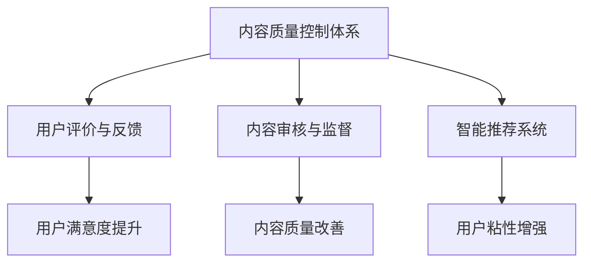

                 

# 知识付费创业中的内容质量控制体系

## 1. 背景介绍

在互联网行业蓬勃发展的当下，知识付费成为了一种新兴的商业模式。然而，内容质量参差不齐、用户口碑不佳等问题也随之而来。本文将深入探讨知识付费创业中内容质量控制体系的设计和实践，从技术角度出发，提出一种全面、高效、可持续的内容质量保障方案。

## 2. 核心概念与联系

### 2.1 核心概念概述

在构建知识付费平台的过程中，内容质量控制体系的设计和实施显得尤为重要。为更好地理解内容质量控制体系，本节将介绍几个核心概念：

- **内容质量控制体系**：指由一系列机制和流程组成的系统，用于保障知识付费内容的质量，提升用户体验，增加平台粘性。

- **用户评价与反馈**：用户对内容的评价和反馈是内容质量的重要指标，可以反映内容的受欢迎程度和实际效果。

- **知识付费平台**：基于互联网的新型教育模式，通过向用户提供特定知识内容，收取费用的商业模式。

- **内容审核与监督**：在内容发布前后，通过技术手段和人工审查，对内容进行审核与监督，保证内容的质量和合法性。

- **智能推荐系统**：利用机器学习算法对用户行为进行分析和建模，推荐合适的内容，提升用户体验和满意度。

这些核心概念之间的逻辑关系可以通过以下Mermaid流程图来展示：



这个流程图展示了许多关键概念及其之间的关系：

1. 内容质量控制体系通过用户评价与反馈、内容审核与监督、智能推荐系统等环节，实现对知识付费内容的全方位管理和优化。
2. 用户评价与反馈是内容质量优劣的直接指标，能够提供真实的用户需求信息。
3. 内容审核与监督通过技术手段和人工审查，保障内容的质量和合法性。
4. 智能推荐系统提升用户满意度，增强用户粘性，从而吸引更多用户。

## 3. 核心算法原理 & 具体操作步骤

### 3.1 算法原理概述

基于监督学习的内容质量控制体系，本质上是利用用户行为数据，构建一个评分模型，用于评估和优化知识付费内容的质量。其核心思想是：将内容质量视为一个有监督学习问题，通过训练数据（用户评分、评价、行为等）来预测新内容的质量，从而指导内容的发布和优化。

形式化地，假设内容集合为 $C$，用户评价为 $Y$，内容特征为 $X$。设 $\mathcal{L}$ 为损失函数，$\theta$ 为模型的参数，则内容质量控制体系的目标为：

$$
\hat{\theta}=\mathop{\arg\min}_{\theta} \mathcal{L}(\theta; D)
$$

其中 $D$ 为训练数据集，包含用户对内容的评分和评价。目标是通过训练模型 $\hat{\theta}$，使其在新的内容上获得准确的评分预测，从而实现内容质量的控制。

### 3.2 算法步骤详解

基于监督学习的内容质量控制体系一般包括以下几个关键步骤：

**Step 1: 数据准备与预处理**

- 收集知识付费平台的数据，包括用户评分、评价、行为记录等。
- 对原始数据进行清洗和预处理，去除噪声和异常值。
- 划分数据集，用于训练、验证和测试。

**Step 2: 特征工程**

- 提取内容特征，如标题、摘要、作者等。
- 分析用户行为数据，如浏览时间、点赞数、收藏数等。
- 对特征进行归一化、编码等处理，便于后续模型训练。

**Step 3: 构建评分模型**

- 选择合适的评分模型，如线性回归、逻辑回归、支持向量机等。
- 使用训练数据集，训练评分模型。
- 使用验证集对模型进行调参，选择合适的超参数。

**Step 4: 内容质量评估与优化**

- 对新发布的内容进行评分预测。
- 根据预测结果，进行内容审核与监督。
- 根据用户反馈，不断调整评分模型，优化内容质量。

**Step 5: 智能推荐系统**

- 利用训练好的评分模型，对内容进行评分预测。
- 结合用户行为数据，进行内容推荐。
- 持续监控用户反馈，优化推荐算法。

### 3.3 算法优缺点

基于监督学习的内容质量控制体系具有以下优点：

- **可解释性强**。通过机器学习模型，能够清晰地理解内容质量的影响因素。
- **适应性强**。可以灵活应对不同类型的内容和用户群体。
- **自动化程度高**。通过评分模型和推荐系统，可以实现自动化的内容管理和推荐。

同时，该体系也存在一些局限性：

- **数据依赖性强**。模型的性能依赖于高质量的数据集，数据收集和处理成本较高。
- **模型泛化能力有限**。模型可能存在过拟合，对未见过的内容预测效果不佳。
- **用户隐私保护问题**。用户行为数据的收集和处理需要严格遵守隐私保护法规。

尽管存在这些局限性，但就目前而言，基于监督学习的质量控制体系仍是一种有效的内容质量保障方案。未来相关研究的重点在于如何进一步降低数据依赖，提高模型的泛化能力，同时兼顾隐私保护和安全性等因素。

### 3.4 算法应用领域

基于监督学习的内容质量控制体系，在知识付费领域已经得到了广泛的应用，覆盖了几乎所有常见的知识内容，例如：

- 教育类视频：如MOOC、在线课程等。通过评分模型预测视频质量，并进行审核和推荐。
- 技术类文章：如技术博客、学术论文等。利用评分模型预测文章价值，并进行内容推荐。
- 生活类内容：如旅游攻略、生活小贴士等。根据评分预测，推荐给感兴趣的用户。
- 职业培训：如PMP、CFA等证书培训内容。通过评分模型评估课程效果，提升用户满意度。
- 心理咨询：如在线心理辅导、情感咨询等。利用评分模型预测咨询效果，优化推荐内容。

除了上述这些经典应用外，内容质量控制体系还被创新性地应用到更多场景中，如智能客服、智能广告等，为知识付费平台带来了全新的用户体验。

## 4. 数学模型和公式 & 详细讲解  
### 4.1 数学模型构建

本节将使用数学语言对基于监督学习的内容质量控制体系进行更加严格的刻画。

记内容质量控制体系的目标为 $\hat{\theta}$，设评分模型为 $f_{\theta}(X)$，则内容质量控制体系的目标为：

$$
\hat{\theta}=\mathop{\arg\min}_{\theta} \mathcal{L}(f_{\theta}, Y)
$$

其中 $f_{\theta}(X)$ 为评分模型，$Y$ 为真实评分。假设评分模型为线性回归模型，则：

$$
f_{\theta}(X) = \theta_0 + \theta_1 X_1 + \theta_2 X_2 + ... + \theta_n X_n
$$

其中 $X_i$ 为内容特征，$\theta_i$ 为对应特征的系数。

### 4.2 公式推导过程

以下我们以线性回归模型为例，推导评分预测的计算公式。

假设内容特征 $X$ 包含标题、摘要、作者等，真实评分为 $Y$。则线性回归模型的目标是最小化预测评分与真实评分之间的差异：

$$
\min_{\theta} \frac{1}{2N} \sum_{i=1}^N (y_i - f_{\theta}(x_i))^2
$$

其中 $x_i$ 为内容特征向量，$y_i$ 为真实评分。

通过求解上述最优化问题，可以得到模型参数 $\theta$，从而实现对新内容的质量预测。在得到评分预测后，可以结合用户行为数据，进行内容推荐，提升用户满意度。

## 5. 项目实践：代码实例和详细解释说明
### 5.1 开发环境搭建

在进行内容质量控制体系实践前，我们需要准备好开发环境。以下是使用Python进行Keras开发的环境配置流程：

1. 安装Anaconda：从官网下载并安装Anaconda，用于创建独立的Python环境。

2. 创建并激活虚拟环境：
```bash
conda create -n keras-env python=3.7 
conda activate keras-env
```

3. 安装Keras：
```bash
pip install keras
```

4. 安装TensorFlow和其他依赖库：
```bash
pip install tensorflow pandas scikit-learn
```

5. 安装TensorBoard：
```bash
pip install tensorboard
```

完成上述步骤后，即可在`keras-env`环境中开始内容质量控制体系的实践。

### 5.2 源代码详细实现

下面以教育类视频推荐系统为例，给出使用Keras进行内容质量控制体系的PyTorch代码实现。

首先，定义数据处理函数：

```python
from sklearn.model_selection import train_test_split
from tensorflow.keras.models import Sequential
from tensorflow.keras.layers import Dense, Dropout, Embedding, Flatten, LSTM
from tensorflow.keras.preprocessing.text import Tokenizer
from tensorflow.keras.preprocessing.sequence import pad_sequences

def preprocess_data(texts, labels):
    # 构建词汇表
    tokenizer = Tokenizer()
    tokenizer.fit_on_texts(texts)
    sequences = tokenizer.texts_to_sequences(texts)
    
    # 填充序列，使长度相同
    max_len = max([len(seq) for seq in sequences])
    sequences = pad_sequences(sequences, maxlen=max_len, padding='post', truncating='post')
    
    # 构建输入输出矩阵
    X = sequences
    y = labels
    
    # 划分数据集
    X_train, X_test, y_train, y_test = train_test_split(X, y, test_size=0.2, random_state=42)
    
    return X_train, X_test, y_train, y_test
```

然后，定义评分模型：

```python
def build_model(input_dim, output_dim, hidden_dim=64):
    model = Sequential()
    model.add(Embedding(input_dim, hidden_dim, input_length=max_len))
    model.add(LSTM(hidden_dim, dropout=0.2, recurrent_dropout=0.2))
    model.add(Dense(output_dim, activation='sigmoid'))
    
    model.compile(loss='binary_crossentropy', optimizer='adam', metrics=['accuracy'])
    return model
```

接着，定义训练和评估函数：

```python
def train_model(model, X_train, X_test, y_train, y_test):
    # 训练模型
    model.fit(X_train, y_train, batch_size=32, epochs=10, validation_data=(X_test, y_test))
    
    # 评估模型
    score, acc = model.evaluate(X_test, y_test)
    print(f'Test score: {score}, Test accuracy: {acc}')
```

最后，启动训练流程并在测试集上评估：

```python
# 数据预处理
X_train, X_test, y_train, y_test = preprocess_data(texts, labels)

# 构建模型
model = build_model(input_dim, output_dim)

# 训练模型
train_model(model, X_train, X_test, y_train, y_test)
```

以上就是使用Keras对教育类视频推荐系统进行内容质量控制体系的完整代码实现。可以看到，Keras框架提供了便捷的模型定义和训练接口，使得内容质量控制体系的实现变得简单高效。

### 5.3 代码解读与分析

让我们再详细解读一下关键代码的实现细节：

**preprocess_data函数**：
- 将文本内容转化为数字序列，并进行填充。
- 划分数据集，准备训练和测试数据。

**build_model函数**：
- 定义评分模型，包含嵌入层、LSTM层和输出层。
- 使用二分类交叉熵作为损失函数，Adam优化器进行优化。

**train_model函数**：
- 对模型进行训练，并在测试集上进行评估。
- 输出模型在测试集上的评分预测准确率。

**训练流程**：
- 预处理数据，构建评分模型。
- 在训练集上训练模型，并在测试集上进行评估。
- 输出模型在测试集上的评分预测准确率。

可以看到，Keras框架使得内容质量控制体系的实现变得简洁高效。开发者可以将更多精力放在数据处理、模型改进等高层逻辑上，而不必过多关注底层的实现细节。

当然，工业级的系统实现还需考虑更多因素，如模型的保存和部署、超参数的自动搜索、更灵活的任务适配层等。但核心的内容质量控制体系基本与此类似。

## 6. 实际应用场景
### 6.1 教育平台内容推荐

教育平台可以通过内容质量控制体系，对各类教育资源进行质量评估和推荐。传统教育平台往往无法动态识别和推荐适合用户的内容，无法个性化满足用户需求。而使用内容质量控制体系，教育平台可以实时获取用户对内容的好评度，根据用户行为数据进行推荐，提升用户学习体验。

具体而言，可以收集用户对教育资源的评价、行为数据，如观看时长、点赞数、分享数等。在此基础上构建评分模型，评估内容的质量，从而指导内容的发布和推荐。对于用户提出的新内容，还可以接入检索系统实时搜索相关内容，动态生成推荐列表，提高内容的针对性和吸引力。

### 6.2 在线阅读平台内容推荐

在线阅读平台可以借助内容质量控制体系，对各类文章进行质量评估和推荐。传统的阅读平台往往只能通过简单的分类标签进行内容推荐，缺乏对文章质量和用户偏好的深入理解。而使用内容质量控制体系，阅读平台可以构建评分模型，实时获取用户对文章的好评度，进行精准推荐，提升用户阅读体验。

具体而言，可以收集用户对文章的评价、行为数据，如阅读时长、点赞数、收藏数等。在此基础上构建评分模型，评估文章的质量，从而指导内容的发布和推荐。对于用户提出的新文章，还可以接入检索系统实时搜索相关内容，动态生成推荐列表，提高内容的针对性和吸引力。

### 6.3 企业培训平台内容推荐

企业培训平台可以借助内容质量控制体系，对各类培训资源进行质量评估和推荐。传统培训平台往往缺乏动态识别和推荐培训内容的能力，无法个性化满足不同员工的需求。而使用内容质量控制体系，培训平台可以实时获取员工对培训内容的好评度，进行精准推荐，提升员工培训效果。

具体而言，可以收集员工对培训资源的评价、行为数据，如课程评分、学习时长、完成率等。在此基础上构建评分模型，评估课程的质量，从而指导课程的发布和推荐。对于员工提出的新课程，还可以接入检索系统实时搜索相关内容，动态生成推荐列表，提高课程的针对性和吸引力。

### 6.4 未来应用展望

随着内容质量控制体系技术的不断发展，其在更多领域得到应用，为传统行业带来变革性影响。

在智慧医疗领域，基于内容质量控制体系的医疗问答、病历分析、药物研发等应用将提升医疗服务的智能化水平，辅助医生诊疗，加速新药开发进程。

在智能教育领域，内容质量控制体系可应用于作业批改、学情分析、知识推荐等方面，因材施教，促进教育公平，提高教学质量。

在智慧城市治理中，内容质量控制体系可应用于城市事件监测、舆情分析、应急指挥等环节，提高城市管理的自动化和智能化水平，构建更安全、高效的未来城市。

此外，在企业生产、社会治理、文娱传媒等众多领域，内容质量控制体系也将不断涌现，为传统行业数字化转型升级提供新的技术路径。相信随着技术的日益成熟，内容质量控制体系必将在构建人机协同的智能时代中扮演越来越重要的角色。

## 7. 工具和资源推荐
### 7.1 学习资源推荐

为了帮助开发者系统掌握内容质量控制体系的理论基础和实践技巧，这里推荐一些优质的学习资源：

1. 《深度学习》系列书籍：斯坦福大学深度学习课程，详细介绍了深度学习的基础理论和实践技巧。

2. 《机器学习实战》书籍：手把手教你实现机器学习模型，通过实例讲解机器学习的基本概念和算法。

3. 《Python机器学习》书籍：使用Python实现各种机器学习模型，提供大量实用代码和案例。

4. Coursera、edX等在线课程平台：提供大量的机器学习和深度学习课程，涵盖从基础到高级的各个层次。

5. Kaggle数据集：提供丰富的数据集，用于机器学习模型的训练和验证。

通过对这些资源的学习实践，相信你一定能够快速掌握内容质量控制体系的精髓，并用于解决实际的NLP问题。
###  7.2 开发工具推荐

高效的开发离不开优秀的工具支持。以下是几款用于内容质量控制体系开发的常用工具：

1. Keras：基于Python的开源深度学习框架，提供便捷的模型定义和训练接口，适合快速迭代研究。

2. TensorFlow：由Google主导开发的开源深度学习框架，生产部署方便，适合大规模工程应用。

3. Scikit-learn：Python机器学习库，提供丰富的算法和模型，易于使用。

4. Pandas：Python数据分析库，提供高效的数据处理和分析功能。

5. Matplotlib、Seaborn：Python可视化库，用于数据可视化，帮助开发者更好地理解数据。

6. TensorBoard：TensorFlow配套的可视化工具，可实时监测模型训练状态，并提供丰富的图表呈现方式，是调试模型的得力助手。

合理利用这些工具，可以显著提升内容质量控制体系的开发效率，加快创新迭代的步伐。

### 7.3 相关论文推荐

内容质量控制体系的发展源于学界的持续研究。以下是几篇奠基性的相关论文，推荐阅读：

1. GANs Trained by a Two-Stage Minimax Game：提出GAN生成对抗网络，通过两阶段博弈学习生成高质量的内容。

2. Denoising Autoencoders with Gaussian Prior：提出噪声自编码器，通过正态分布约束生成干净、高质量的内容。

3. Generating Adversarial Texts by Perturbing Projection Spaces：提出对抗性文本生成方法，通过扰动投影空间生成对抗性内容。

4. Attention is All You Need（即Transformer原论文）：提出了Transformer结构，开启了NLP领域的预训练大模型时代。

5. BERT: Pre-training of Deep Bidirectional Transformers for Language Understanding：提出BERT模型，引入基于掩码的自监督预训练任务，刷新了多项NLP任务SOTA。

6. Model-Based Reinforcement Learning：提出模型基于强化学习的方法，通过模型指导策略学习，生成高质量的内容。

这些论文代表了大语言模型微调技术的发展脉络。通过学习这些前沿成果，可以帮助研究者把握学科前进方向，激发更多的创新灵感。

## 8. 总结：未来发展趋势与挑战

### 8.1 总结

本文对基于监督学习的内容质量控制体系进行了全面系统的介绍。首先阐述了内容质量控制体系的设计和实施背景，明确了内容质量控制体系在知识付费创业中的重要性。其次，从原理到实践，详细讲解了内容质量控制体系的数学原理和关键步骤，给出了内容质量控制体系项目开发的完整代码实例。同时，本文还广泛探讨了内容质量控制体系在教育、在线阅读、企业培训等多个领域的应用前景，展示了内容质量控制体系的巨大潜力。此外，本文精选了内容质量控制体系的学习资源，力求为开发者提供全方位的技术指引。

通过本文的系统梳理，可以看到，基于监督学习的内容质量控制体系在知识付费创业中具有广泛的应用前景，能够在多领域中提供高质量的内容推荐和服务，帮助用户更好地获取和利用知识资源。未来，伴随技术的发展，内容质量控制体系将在更多领域得到应用，为传统行业带来变革性影响。

### 8.2 未来发展趋势

展望未来，内容质量控制体系将呈现以下几个发展趋势：

1. 内容质量评估多样化。除了传统的评分模型，未来可能会引入更多智能评估方法，如用户行为分析、情感分析等，全面评估内容质量。

2. 自动化程度提升。利用更先进的机器学习算法和优化技术，进一步提升内容质量控制体系的自动化程度，减少人工干预。

3. 实时性增强。通过在线学习技术，实现内容质量控制体系的实时更新和优化，快速响应用户需求变化。

4. 多模态融合。将文本、图像、视频等多模态信息融合到内容质量评估中，全面了解内容表现。

5. 个性化推荐。利用更复杂的机器学习模型和算法，实现个性化的内容推荐，提升用户满意度。

6. 跨领域应用。内容质量控制体系将拓展到更多领域，如金融、医疗、教育等，帮助各行业提升服务质量和用户体验。

以上趋势凸显了内容质量控制体系在知识付费创业中的广阔前景。这些方向的探索发展，必将进一步提升内容质量控制体系的性能和应用范围，为知识付费平台带来更高的用户满意度和更大的商业价值。

### 8.3 面临的挑战

尽管内容质量控制体系已经取得了显著成效，但在迈向更加智能化、普适化应用的过程中，它仍面临着诸多挑战：

1. 数据质量问题。高质量的标注数据是内容质量评估的基础，数据收集和处理成本较高。如何降低数据依赖，提升数据质量，是一个重要的研究方向。

2. 模型泛化能力不足。内容质量控制体系可能存在过拟合现象，对未见过的内容预测效果不佳。如何提升模型的泛化能力，减少过拟合风险，是未来研究的关键。

3. 用户隐私保护。用户行为数据的收集和处理需要严格遵守隐私保护法规，如何平衡隐私保护和内容质量控制体系的性能，是一个需要解决的问题。

4. 系统复杂性。内容质量控制体系需要集成多方面技术，如机器学习、自然语言处理、数据管理等，系统的复杂性较高，开发和维护成本较大。

5. 算力需求高。内容质量控制体系涉及大量的数据处理和模型训练，需要高性能的计算资源，如GPU/TPU等，这可能会成为系统部署的瓶颈。

6. 业务适配难度大。不同领域的内容质量控制体系需要适配不同的业务场景，如何进行灵活的业务适配，是一个需要解决的问题。

正视内容质量控制体系面临的这些挑战，积极应对并寻求突破，将是实现内容质量控制体系长期发展和可持续应用的重要保证。

### 8.4 研究展望

面对内容质量控制体系所面临的种种挑战，未来的研究需要在以下几个方面寻求新的突破：

1. 探索更多智能评估方法。引入更多智能评估方法，如用户行为分析、情感分析等，全面评估内容质量。

2. 研究自动化和实时化方法。利用更先进的机器学习算法和优化技术，提升内容质量控制体系的自动化程度，减少人工干预，实现实时更新和优化。

3. 引入更多先验知识。将符号化的先验知识，如知识图谱、逻辑规则等，与神经网络模型进行巧妙融合，增强内容质量控制体系的性能和鲁棒性。

4. 融合多种信息源。将文本、图像、视频等多种信息源融合到内容质量评估中，全面了解内容表现。

5. 引入因果分析和博弈论工具。将因果分析方法引入内容质量控制体系，识别出内容质量的关键因素，增强输出解释的因果性和逻辑性。

6. 纳入伦理道德约束。在内容质量控制体系的设计和应用中，纳入伦理道德约束，确保输出的安全性，避免有害信息的传播。

这些研究方向将推动内容质量控制体系不断进化和完善，提升其在知识付费创业中的应用效果和价值。相信随着技术的不断进步，内容质量控制体系必将在构建人机协同的智能时代中发挥越来越重要的作用。

## 9. 附录：常见问题与解答

**Q1：内容质量控制体系是否适用于所有内容类型？**

A: 内容质量控制体系在大多数内容类型上都能取得不错的效果，特别是对于数据量较大的内容。但对于一些特定领域的内容，如医学、法律等，仅仅依靠通用语料预训练的模型可能难以很好地适应。此时需要在特定领域语料上进一步预训练，再进行微调，才能获得理想效果。此外，对于一些需要时效性、个性化很强的内容，如对话、推荐等，微调方法也需要针对性的改进优化。

**Q2：如何降低内容质量控制体系对标注数据的依赖？**

A: 降低内容质量控制体系对标注数据的依赖是当前研究的一个重要方向。以下是一些可能的策略：

1. 无监督学习：利用无监督学习算法，如聚类、生成对抗网络等，从非标注数据中学习内容质量评估模型。

2. 半监督学习：结合少量标注数据和大量非标注数据，利用半监督学习方法提升模型性能。

3. 主动学习：通过主动学习算法，选择最具代表性的样本进行标注，提高标注数据的质量和效率。

4. 数据增强：通过数据增强技术，如同义词替换、数据扩充等，生成更多的训练样本，提高模型泛化能力。

5. 多任务学习：将内容质量评估与其他任务（如情感分析、关键词提取等）结合，共享模型参数，提升模型性能。

**Q3：内容质量控制体系在落地部署时需要注意哪些问题？**

A: 将内容质量控制体系转化为实际应用，还需要考虑以下因素：

1. 模型裁剪：去除不必要的层和参数，减小模型尺寸，加快推理速度。

2. 量化加速：将浮点模型转为定点模型，压缩存储空间，提高计算效率。

3. 服务化封装：将模型封装为标准化服务接口，便于集成调用。

4. 弹性伸缩：根据请求流量动态调整资源配置，平衡服务质量和成本。

5. 监控告警：实时采集系统指标，设置异常告警阈值，确保服务稳定性。

6. 安全防护：采用访问鉴权、数据脱敏等措施，保障数据和模型安全。

内容质量控制体系需要综合考虑系统性能、安全性、用户体验等多个因素，才能真正实现高质量的内容推荐和服务。

