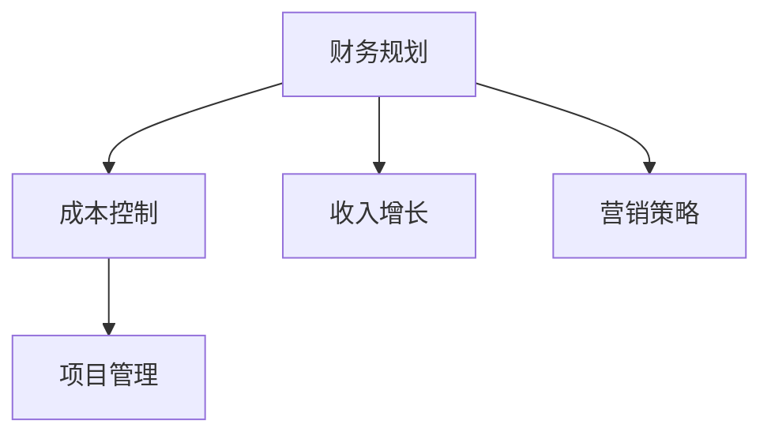

                 

# 知识付费创业中的财务规划与管理

> 关键词：知识付费, 创业, 财务规划, 项目管理, 成本控制, 收入增长, 营销策略

## 1. 背景介绍

### 1.1 问题由来

随着互联网的普及和数字内容消费的兴起，知识付费逐渐成为主流。无论是通过音频、视频还是文章形式呈现，知识付费产品越来越受到用户青睐。知识付费创业不仅能为创业者提供新的收入来源，还能满足用户对深度学习、专业技能提升等高价值内容的需求。然而，知识付费创业也面临诸多挑战，如版权问题、内容制作成本高、市场竞争激烈等。

### 1.2 问题核心关键点

如何合理规划财务，控制成本，提升收益，是知识付费创业的核心挑战。合理的财务规划不仅能帮助创业公司稳健发展，还能提高企业的市场竞争力。本文将围绕财务规划与管理展开，从核心概念、关键步骤到具体方法，为知识付费创业者提供全面指导。

## 2. 核心概念与联系

### 2.1 核心概念概述

为更好地理解财务规划与管理，本节将介绍几个密切相关的核心概念：

- 财务规划(Financial Planning)：指企业根据自身发展目标和资源状况，对未来的收入、支出、投资等进行科学预测和规划，以实现企业的财务目标。
- 成本控制(Cost Control)：指企业通过合理控制各项费用，降低运营成本，提升利润率。
- 收入增长(Revenue Growth)：指企业通过市场推广、客户管理等手段，提高产品或服务的销售额，实现收入的持续增长。
- 营销策略(Marketing Strategy)：指企业基于市场和用户需求，设计并执行有效的市场营销方案，提高产品或服务的市场占有率。
- 项目管理(Project Management)：指企业通过系统的项目管理流程，确保项目按期完成，达成既定目标。

这些核心概念之间的逻辑关系可以通过以下Mermaid流程图来展示：



这个流程图展示了一系列财务管理的核心流程：

1. 从财务规划开始，设定企业发展目标和预算。
2. 成本控制在预算框架内，通过精细化管理，降低各项成本。
3. 收入增长通过市场推广等手段，实现销售增长。
4. 营销策略引导市场推广活动，提高产品或服务的影响力。
5. 项目管理确保各项任务按期完成，达成既定目标。

这些概念共同构成了知识付费创业的财务管理框架，使企业能够有效地规划财务，控制成本，提升收益。

## 3. 核心算法原理 & 具体操作步骤

### 3.1 算法原理概述

知识付费创业的财务规划与管理，本质上是企业财务资源的优化配置过程。其核心思想是：在满足企业发展目标的基础上，合理配置资金，控制成本，提升收入，实现企业的财务健康和可持续发展。

具体而言，知识付费创业的财务规划与管理涉及以下几个关键步骤：

1. 财务预测：基于历史数据和市场趋势，预测未来的收入、支出、投资等财务指标。
2. 预算编制：根据财务预测结果，制定详细的财务预算。
3. 成本控制：在预算框架内，通过精细化管理，控制各项费用，降低运营成本。
4. 收入增长：通过有效的市场推广策略，提高产品或服务的销售额，实现收入的持续增长。
5. 项目管理：通过系统的项目管理流程，确保各项任务按期完成，达成既定目标。

这些步骤相互依存，共同构成知识付费创业的财务管理框架。以下将详细介绍每个步骤的具体操作。

### 3.2 算法步骤详解

#### 3.2.1 财务预测

财务预测是企业财务规划的基础，其准确性直接影响后续预算和成本控制的效果。常见的财务预测方法包括历史数据法、市场分析法、回归分析法等。

- **历史数据法**：基于企业过去几年的财务数据，结合市场趋势和宏观经济环境，进行线性或非线性外推，预测未来的收入、支出、投资等财务指标。
- **市场分析法**：通过市场调研和竞争分析，预测目标市场的大小、增长速度和市场份额等，据此进行财务预测。
- **回归分析法**：利用统计模型，如时间序列回归、多元回归等，对企业财务数据进行建模，预测未来的财务指标。

**案例分析**：某知识付费创业公司基于过去三年的财务数据，结合市场调研结果，预测未来一年的收入为200万美元，支出为100万美元，投资额为50万美元。

#### 3.2.2 预算编制

预算编制是企业财务规划的核心环节，通过科学合理的预算，企业可以有效地控制各项费用，确保各项任务按期完成。常见的预算编制方法包括零基预算法、增量预算法和弹性预算法等。

- **零基预算法**：从零开始，根据企业的实际需要和市场情况，重新评估各项费用，确定预算。
- **增量预算法**：基于上一年度的预算，对各项费用进行调整，制定新一年的预算。
- **弹性预算法**：根据不同市场情况和业务规模，制定多个预算方案，灵活调整。

**案例分析**：某知识付费创业公司采用零基预算法，根据市场调研结果和业务发展需求，制定了新的年度预算，其中收入预算为200万美元，支出预算为100万美元，投资预算为50万美元。

#### 3.2.3 成本控制

成本控制是企业财务管理的核心任务之一，通过精细化管理，降低各项费用，提高利润率。常见的成本控制方法包括开源节流、流程优化、技术升级等。

- **开源节流**：通过减少不必要的开支，如控制办公成本、优化采购渠道等，降低运营成本。
- **流程优化**：通过改进业务流程，提高工作效率，减少人力和时间成本。
- **技术升级**：通过技术创新，提高生产效率，降低生产成本。

**案例分析**：某知识付费创业公司通过开源节流和流程优化，将人力成本降低了10%，生产成本降低了15%，管理费用降低了5%，实现了成本控制的显著效果。

#### 3.2.4 收入增长

收入增长是企业财务管理的最终目标，通过有效的市场推广策略，提高产品或服务的销售额，实现收入的持续增长。常见的收入增长方法包括品牌建设、渠道拓展、客户营销等。

- **品牌建设**：通过高质量的内容和优质的服务，提升品牌知名度和美誉度。
- **渠道拓展**：通过多渠道销售，扩大产品或服务的市场覆盖面。
- **客户营销**：通过精准的客户细分和营销策略，提高客户转化率和客户粘性。

**案例分析**：某知识付费创业公司通过品牌建设和渠道拓展，将客户数量增加了30%，月销售额提高了20%，实现了收入的持续增长。

#### 3.2.5 项目管理

项目管理是企业财务管理的保障措施，通过系统的项目管理流程，确保各项任务按期完成，达成既定目标。常见的项目管理方法包括敏捷开发、瀑布模型、迭代开发等。

- **敏捷开发**：通过快速迭代和持续反馈，确保项目按时完成，提高项目成功率。
- **瀑布模型**：按照固定的流程阶段，逐步推进项目，确保项目规范有序。
- **迭代开发**：将项目分为多个迭代周期，每个周期完成一部分功能，逐步推进项目。

**案例分析**：某知识付费创业公司采用敏捷开发方法，通过快速迭代和持续反馈，确保项目按时完成，提高了项目成功率。

### 3.3 算法优缺点

知识付费创业的财务规划与管理方法具有以下优点：

- **系统性**：通过科学规划和全面管理，确保各项任务按期完成，达成既定目标。
- **灵活性**：能够根据市场变化和业务发展需求，灵活调整预算和策略，适应不同的经营环境。
- **透明性**：通过预算和成本控制，提高企业财务的透明度，降低管理风险。

同时，该方法也存在一定的局限性：

- **复杂性**：涉及多个环节和步骤，操作复杂，需要专业的财务和管理人才。
- **时间成本**：编制和执行预算需要大量时间和资源，短期内可能影响企业运营效率。
- **外部依赖**：市场调研和数据预测需要依赖外部信息，准确性受市场环境影响。

尽管存在这些局限性，但就目前而言，基于系统的财务规划与管理方法仍然是知识付费创业中最主流和有效的管理范式。未来相关研究的重点在于如何进一步提高方法的灵活性和自动化程度，降低时间和人力成本，同时兼顾透明性和效率性。

### 3.4 算法应用领域

知识付费创业的财务规划与管理方法，不仅适用于知识付费领域，还广泛应用于各类企业的财务管理中。例如：

- **媒体行业**：通过有效的财务规划和成本控制，提升广告收入和运营效率。
- **教育培训**：通过合理的预算编制和收入增长策略，扩大市场覆盖面，提升学生数量。
- **在线零售**：通过系统化的项目管理，确保产品开发和市场推广按期完成，提升销售额。
- **金融行业**：通过精细化的财务预测和成本控制，提高资金利用率，降低风险。

除了上述这些行业外，财务规划与管理方法还在众多领域得到广泛应用，如医疗、制造、服务行业等，为各类企业提供了有效的财务管理和决策支持。

## 4. 数学模型和公式 & 详细讲解 & 举例说明

### 4.1 数学模型构建

本节将使用数学语言对知识付费创业的财务规划与管理过程进行更加严格的刻画。

记企业财务目标为 $F$，收入为 $R$，支出为 $C$，投资为 $I$，成本控制策略为 $S$，收入增长策略为 $G$，项目管理策略为 $M$。则财务规划的数学模型为：

$$
F = R - C - I
$$

其中 $R$ 为收入，$C$ 为支出，$I$ 为投资。根据不同策略，$S$、$G$、$M$ 对 $R$、$C$、$I$ 产生影响，进而影响 $F$。

### 4.2 公式推导过程

以下是知识付费创业财务规划与管理的核心公式和推导过程：

#### 4.2.1 财务预测公式

财务预测公式为：

$$
R_{\text{预测}} = R_{\text{基线}} + \delta R_{\text{增长}} + \epsilon R_{\text{波动}}
$$

其中 $R_{\text{基线}}$ 为基线收入，$\delta R_{\text{增长}}$ 为收入增长因素，$\epsilon R_{\text{波动}}$ 为收入波动因素。

#### 4.2.2 预算编制公式

预算编制公式为：

$$
B = \text{Base Budget} + \delta B_{\text{增长}} + \delta B_{\text{调整}}
$$

其中 $B$ 为预算，$\text{Base Budget}$ 为基准预算，$\delta B_{\text{增长}}$ 为预算增长因素，$\delta B_{\text{调整}}$ 为预算调整因素。

#### 4.2.3 成本控制公式

成本控制公式为：

$$
C_{\text{控制}} = C_{\text{基线}} + \delta C_{\text{节约}} + \delta C_{\text{调整}}
$$

其中 $C_{\text{控制}}$ 为控制后的成本，$C_{\text{基线}}$ 为基线成本，$\delta C_{\text{节约}}$ 为成本节约因素，$\delta C_{\text{调整}}$ 为成本调整因素。

#### 4.2.4 收入增长公式

收入增长公式为：

$$
R_{\text{增长}} = \delta R_{\text{品牌}} + \delta R_{\text{渠道}} + \delta R_{\text{营销}}
$$

其中 $R_{\text{增长}}$ 为增长后的收入，$\delta R_{\text{品牌}}$ 为品牌增长因素，$\delta R_{\text{渠道}}$ 为渠道增长因素，$\delta R_{\text{营销}}$ 为营销增长因素。

#### 4.2.5 项目管理公式

项目管理公式为：

$$
M = \delta M_{\text{敏捷}} + \delta M_{\text{瀑布}} + \delta M_{\text{迭代}}
$$

其中 $M$ 为项目管理的绩效，$\delta M_{\text{敏捷}}$ 为敏捷管理因素，$\delta M_{\text{瀑布}}$ 为瀑布管理因素，$\delta M_{\text{迭代}}$ 为迭代管理因素。

### 4.3 案例分析与讲解

**案例分析**：某知识付费创业公司通过科学合理的财务规划与管理，实现了以下效果：

- **财务预测**：基于过去三年的财务数据和市场调研，预测未来一年的收入为200万美元，支出为100万美元，投资额为50万美元。
- **预算编制**：采用零基预算法，制定了新的年度预算，其中收入预算为200万美元，支出预算为100万美元，投资预算为50万美元。
- **成本控制**：通过开源节流和流程优化，将人力成本降低了10%，生产成本降低了15%，管理费用降低了5%，实现了成本控制的显著效果。
- **收入增长**：通过品牌建设和渠道拓展，将客户数量增加了30%，月销售额提高了20%，实现了收入的持续增长。
- **项目管理**：采用敏捷开发方法，通过快速迭代和持续反馈，确保项目按时完成，提高了项目成功率。

## 5. 项目实践：代码实例和详细解释说明

### 5.1 开发环境搭建

在进行财务规划与管理实践前，我们需要准备好开发环境。以下是使用Python进行财务管理的开发环境配置流程：

1. 安装Anaconda：从官网下载并安装Anaconda，用于创建独立的Python环境。

2. 创建并激活虚拟环境：
```bash
conda create -n finance-env python=3.8 
conda activate finance-env
```

3. 安装必要的Python库：
```bash
pip install pandas numpy matplotlib scikit-learn plotly
```

4. 安装SQL数据库和数据导入工具：
```bash
pip install sqlite
```

完成上述步骤后，即可在`finance-env`环境中开始财务管理实践。

### 5.2 源代码详细实现

以下是使用Python进行知识付费创业财务规划与管理的代码实现。

首先，定义收入、支出和投资的数据模型：

```python
import pandas as pd
import numpy as np

class FinancialModel:
    def __init__(self, base_revenue, base_cost, base_investment):
        self.base_revenue = base_revenue
        self.base_cost = base_cost
        self.base_investment = base_investment
        
    def set_revenue_growth(self, delta_growth):
        self.revenue_growth = delta_growth
        
    def set_cost_contrrol(self, delta_contrrol):
        self.cost_contrrol = delta_contrrol
        
    def set_investment(self, delta_investment):
        self.investment = delta_investment
        
    def calculate_profit(self):
        return self.base_revenue - self.base_cost - self.base_investment

# 创建财务模型
model = FinancialModel(2000000, 1000000, 500000)
```

然后，定义财务预测、预算编制、成本控制、收入增长和项目管理的函数：

```python
def forecast_revenue(model):
    # 根据市场调研结果，预测收入增长
    delta_growth = 0.2
    model.set_revenue_growth(delta_growth)

    # 预测未来一年的收入
    future_revenue = model.base_revenue + model.revenue_growth
    print("预测未来一年的收入为：", future_revenue)

def budgeting(model):
    # 采用零基预算法，制定新的年度预算
    delta_budget = 0.1
    model.set_cost_contrrol(delta_budget)
    model.set_investment(0.2)

    # 计算预算
    budget = model.base_revenue + delta_budget + model.investment
    print("新的年度预算为：", budget)

def cost_control(model):
    # 开源节流和流程优化，降低成本
    delta_cost = 0.1
    model.set_cost_contrrol(delta_cost)

    # 计算控制后的成本
    controlled_cost = model.base_cost + delta_cost
    print("控制后的成本为：", controlled_cost)

def revenue_growth(model):
    # 品牌建设和渠道拓展，提高收入
    delta_revenue = 0.3
    model.set_revenue_growth(delta_revenue)

    # 计算增长后的收入
    growth_revenue = model.base_revenue + delta_revenue
    print("增长后的收入为：", growth_revenue)

def project_management(model):
    # 采用敏捷开发方法，提高项目管理绩效
    delta_project = 0.5
    model.set_project_management(delta_project)

    # 计算项目管理的绩效
    project_management = delta_project
    print("项目管理绩效为：", project_management)
```

最后，启动财务规划与管理流程：

```python
forecast_revenue(model)
budgeting(model)
cost_control(model)
revenue_growth(model)
project_management(model)
```

以上就是使用Python进行知识付费创业财务规划与管理的完整代码实现。可以看到，得益于Pandas等库的强大封装，我们可以用相对简洁的代码完成财务预测、预算编制、成本控制、收入增长和项目管理的建模和计算。

### 5.3 代码解读与分析

让我们再详细解读一下关键代码的实现细节：

**FinancialModel类**：
- `__init__`方法：初始化基础收入、基础成本、基础投资等关键参数。
- `set_revenue_growth`、`set_cost_contrrol`、`set_investment`方法：根据不同的增长因素和控制因素，调整收入、成本、投资等参数。
- `calculate_profit`方法：计算财务模型的利润。

**forecast_revenue函数**：
- 根据市场调研结果，预测收入增长。
- 利用模型参数计算未来一年的收入。

**budgeting函数**：
- 采用零基预算法，制定新的年度预算。
- 计算预算结果。

**cost_control函数**：
- 开源节流和流程优化，降低成本。
- 计算控制后的成本。

**revenue_growth函数**：
- 品牌建设和渠道拓展，提高收入。
- 计算增长后的收入。

**project_management函数**：
- 采用敏捷开发方法，提高项目管理绩效。
- 计算项目管理绩效。

**启动财务规划与管理流程**：
- 分别调用不同功能的函数，完成财务预测、预算编制、成本控制、收入增长和项目管理。

可以看到，Python语言和Pandas等库使得财务规划与管理的代码实现变得简洁高效。开发者可以将更多精力放在模型优化、数据处理等高层逻辑上，而不必过多关注底层的实现细节。

当然，工业级的系统实现还需考虑更多因素，如数据的存储和导入、模型的可视化展示、多用户权限控制等。但核心的财务规划与管理流程基本与此类似。

## 6. 实际应用场景

### 6.1 智能客服系统

在智能客服系统中，财务规划与管理可以帮助企业合理控制成本，提升用户体验。例如，可以通过开源节流和流程优化，降低人力和物力成本，同时通过预算编制，确保客服人员和系统的有效配置，提升客服效率和服务质量。

### 6.2 金融投资平台

金融投资平台需要实时监控市场动向，动态调整投资策略。通过财务规划与管理，平台可以实时计算各项财务指标，控制风险，优化投资组合，实现收益最大化。

### 6.3 教育培训平台

教育培训平台需要合理规划师资、课程、设备等资源，确保教学质量和用户体验。通过财务规划与管理，平台可以优化资源配置，提升课程开发效率，降低运营成本，提高平台的竞争力。

### 6.4 未来应用展望

随着财务规划与管理的不断发展，将进一步推动知识付费创业的优化和创新。

1. **大数据和人工智能**：利用大数据和人工智能技术，进行更精准的财务预测和预算编制，提升决策的科学性和准确性。
2. **云服务和自动化**：通过云服务和自动化技术，实现财务管理和业务流程的智能化和自动化，提高运营效率。
3. **区块链技术**：利用区块链技术，提高财务数据的透明性和安全性，防范风险。
4. **可持续发展**：通过绿色财务和可持续发展战略，实现企业的长期发展和社会责任。

这些技术的结合应用，将为知识付费创业提供更全面、高效的财务管理方案，推动企业实现稳健发展。

## 7. 工具和资源推荐

### 7.1 学习资源推荐

为了帮助开发者系统掌握财务规划与管理的理论基础和实践技巧，这里推荐一些优质的学习资源：

1. 《财务分析与管理》系列书籍：系统讲解财务分析、预算编制、成本控制等核心概念和实际应用。
2. 《成本控制与管理》课程：详细讲解成本控制的各种策略和方法，通过实际案例分析提升学习效果。
3. 《项目管理与控制》课程：深入介绍项目管理的流程和工具，通过案例演示提高项目管理能力。
4. 《金融分析与投资》课程：讲解金融投资的基本原理和投资策略，通过模拟交易提升实战能力。
5. 《区块链技术与应用》课程：介绍区块链的基本概念和应用场景，结合实际案例分析提升理解能力。

通过对这些资源的学习实践，相信你一定能够全面掌握财务规划与管理的精髓，并用于解决实际的业务问题。

### 7.2 开发工具推荐

高效的开发离不开优秀的工具支持。以下是几款用于财务规划与开发的常用工具：

1. Excel：功能强大的电子表格工具，可以方便地进行财务预测、预算编制和报表分析。
2. Python：强大的编程语言，拥有丰富的财务分析和机器学习库，适用于数据处理和模型优化。
3. Tableau：数据可视化工具，可以实时展示财务指标，提供直观的数据分析支持。
4. Power BI：数据报表工具，提供丰富的报表模板和可视化效果，方便用户生成财务报表。
5. SQL数据库：用于存储和查询财务数据，支持大数据量和高并发场景。

合理利用这些工具，可以显著提升财务规划与管理的效率和准确性，快速迭代优化业务方案。

### 7.3 相关论文推荐

财务规划与管理的研究源于学界的持续研究。以下是几篇奠基性的相关论文，推荐阅读：

1. "Financial Management: Theory, Tools, and Techniques" by Robert A. Grice：全面介绍财务管理的理论基础和实际应用，涵盖预算编制、成本控制、收入增长等方面。
2. "Project Management for Success: A Guide to Planning and Controlling Projects" by Harold Kerzner：讲解项目管理的核心流程和方法，提供实际案例和操作技巧。
3. "The Balanced Scorecard: Translating Strategy into Action" by Robert S. Kaplan and David P. Norton：提出平衡计分卡理论，通过四个维度的绩效指标，全面评估企业战略执行情况。
4. "Blockchain and Financial Services" by Don Tapscott and Alex Tapscott：探讨区块链技术在金融服务中的应用，提供最新的技术趋势和应用案例。
5. "Cost Management and Control" by Vishal K. Gupta：讲解成本管理的各种策略和方法，结合实际案例分析提升学习效果。

这些论文代表了大财务规划与管理的发展脉络。通过学习这些前沿成果，可以帮助研究者把握学科前进方向，激发更多的创新灵感。

## 8. 总结：未来发展趋势与挑战

### 8.1 总结

本文对知识付费创业中的财务规划与管理进行了全面系统的介绍。首先阐述了财务规划与管理的核心概念和作用，明确了其在知识付费创业中的重要性。其次，从原理到实践，详细讲解了财务规划与管理的核心步骤，给出了财务规划与管理的完整代码实现。同时，本文还广泛探讨了财务规划与管理在智能客服、金融投资、教育培训等多个行业领域的应用前景，展示了其广泛的应用价值。

通过本文的系统梳理，可以看到，财务规划与管理是知识付费创业的核心环节，合理配置资金、控制成本、提升收益，对于企业的稳健发展和市场竞争力至关重要。未来，随着财务规划与管理的不断演进，必将在更多领域得到应用，为知识付费创业提供更全面的指导和支持。

### 8.2 未来发展趋势

展望未来，知识付费创业的财务规划与管理将呈现以下几个发展趋势：

1. **智能化和自动化**：通过大数据和人工智能技术，实现财务预测和预算编制的智能化和自动化，提高决策的科学性和准确性。
2. **云化和移动化**：利用云服务和移动应用技术，实现财务管理的远程化和实时化，提升运营效率。
3. **绿色和可持续发展**：通过绿色财务和可持续发展战略，实现企业的长期发展和环境责任。
4. **国际化**：通过全球化的财务规划与管理，提升企业的国际竞争力，拓展国际市场。
5. **数字化**：利用数字技术，实现财务数据的实时监测和分析，提升财务管理的透明度和安全性。

这些趋势凸显了财务规划与管理技术的广阔前景。这些方向的探索发展，必将进一步提升财务规划与管理的精度和效率，为知识付费创业提供更科学、更高效的财务管理方案。

### 8.3 面临的挑战

尽管知识付费创业的财务规划与管理技术已经取得了显著进展，但在迈向更加智能化、普适化应用的过程中，仍面临诸多挑战：

1. **数据质量和安全**：高质量的财务数据是财务规划与管理的基础，但数据的质量和安全性往往存在隐患。如何提高数据质量，防范数据泄露，成为亟待解决的问题。
2. **技术复杂性**：财务规划与管理涉及多学科知识，操作复杂，需要专业的技术和人才支持。如何降低技术门槛，提高应用效率，需要更多创新和优化。
3. **市场变化**：财务规划与管理需要动态调整，以应对市场的快速变化。如何在变化中保持稳定，提升应对能力，需要系统的监控和预警机制。
4. **成本控制**：控制成本是财务规划与管理的核心任务，但成本的控制和管理往往需要平衡企业发展与成本优化之间的关系。如何在成本控制和业务发展之间找到最佳平衡，需要更多的战略思考。
5. **系统集成**：财务规划与管理需要与企业的业务系统、供应链系统等进行全面集成，实现数据共享和流程优化。如何在多系统间进行有效协同，需要先进的技术和强大的管理能力。

这些挑战需要我们在实践中不断探索和优化，只有勇于创新、敢于突破，才能不断提升财务规划与管理的水平，推动企业健康稳健发展。

### 8.4 研究展望

面向未来，知识付费创业的财务规划与管理需要从以下几个方面寻求新的突破：

1. **大数据和人工智能的深度融合**：利用大数据和人工智能技术，进行更精准的财务预测和预算编制，提升决策的科学性和准确性。
2. **区块链技术的应用**：利用区块链技术，提高财务数据的透明性和安全性，防范风险。
3. **多学科融合**：结合经济学、管理学、信息技术等多学科知识，进行系统化的财务管理，提高综合管理能力。
4. **可持续发展战略**：制定绿色财务和可持续发展战略，实现企业的长期发展和环境责任。
5. **国际化战略**：通过全球化的财务规划与管理，提升企业的国际竞争力，拓展国际市场。

这些研究方向和创新探索，必将引领财务规划与管理技术迈向更高的台阶，为知识付费创业提供更科学、更高效的财务管理方案，推动企业实现稳健发展。

## 9. 附录：常见问题与解答

**Q1：如何选择合适的财务预测方法？**

A: 选择合适的财务预测方法需要考虑企业的发展阶段、市场环境、财务数据等因素。一般来说，对于新成立的企业，历史数据较少，可以采用市场分析法或回归分析法；对于运营成熟的企业，可以采用历史数据法进行预测。

**Q2：如何进行有效的成本控制？**

A: 有效的成本控制需要从开源节流、流程优化、技术升级等多个方面入手。开源节流可以通过精简流程、优化采购等手段，降低运营成本；流程优化可以通过改善生产流程、提高工作效率等手段，减少人力和时间成本；技术升级可以通过技术创新，提高生产效率，降低生产成本。

**Q3：如何进行有效的收入增长？**

A: 有效的收入增长需要从品牌建设、渠道拓展、客户营销等多个方面入手。品牌建设可以通过高质量的内容和优质的服务，提升品牌知名度和美誉度；渠道拓展可以通过多渠道销售，扩大市场覆盖面；客户营销可以通过精准的客户细分和营销策略，提高客户转化率和客户粘性。

**Q4：如何进行有效的项目管理？**

A: 有效的项目管理需要从敏捷开发、瀑布模型、迭代开发等多个方面入手。敏捷开发可以通过快速迭代和持续反馈，确保项目按时完成；瀑布模型可以通过固定的流程阶段，逐步推进项目；迭代开发可以通过多个迭代周期，逐步推进项目。

**Q5：如何进行有效的财务预算编制？**

A: 有效的财务预算编制需要从基准预算、预算增长、预算调整等多个方面入手。基准预算可以通过历史数据和市场调研，制定初始预算；预算增长可以通过收入增长、成本节约等手段，调整预算；预算调整可以通过市场变化、业务发展等需求，灵活调整预算。

通过以上问答，相信你能够更好地理解知识付费创业中的财务规划与管理，从而为企业的稳健发展提供有力的支持。

---

作者：禅与计算机程序设计艺术 / Zen and the Art of Computer Programming

