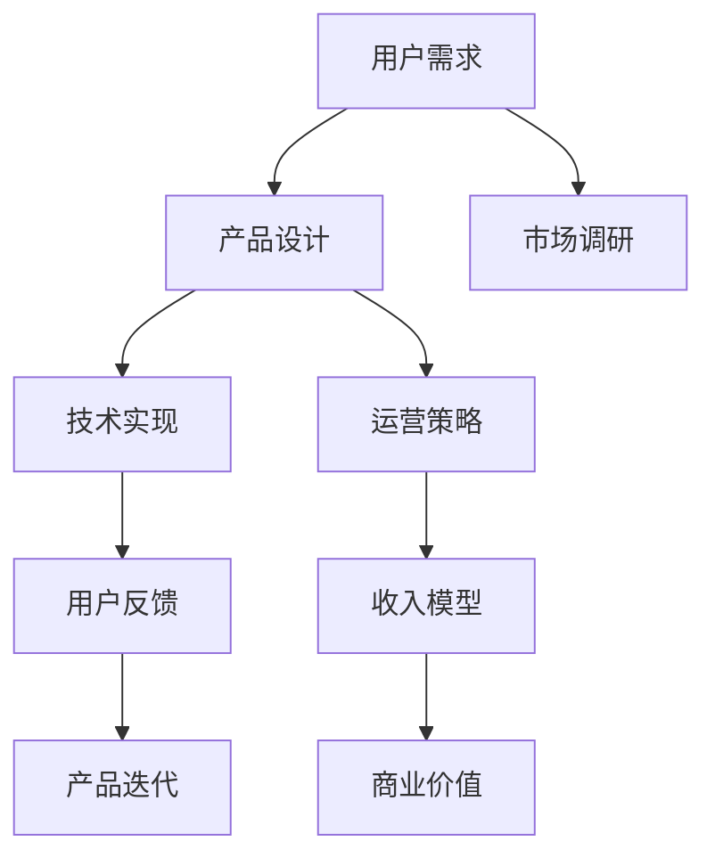

                 

# 知识付费创业的产品矩阵构建

> 关键词：知识付费、产品矩阵、商业模式、用户需求、数据驱动、用户体验

## 1. 背景介绍

随着互联网技术的不断进步和信息传播渠道的多元化，知识付费行业迅速崛起，成为新经济模式下的一种重要商业模式。知识付费不仅满足了用户对知识深度需求，也为创作者提供了价值实现的新路径。面对日益激烈的市场竞争和用户需求的不断变化，知识付费创业企业需要构建一个灵活、高效、可持续的产品矩阵，才能在复杂多变的市场环境中占据优势。本文将详细探讨知识付费创业产品矩阵的构建原则、关键要素和实施策略，希望能为相关创业者提供参考和启示。

## 2. 核心概念与联系

### 2.1 核心概念概述

在知识付费领域，产品矩阵（Product Portfolio）指的是企业通过多款相互关联、互补的产品，以满足不同用户群体的知识需求，提升用户粘性，实现商业价值的最大化。构建高效的产品矩阵，需要充分理解目标用户需求、市场环境、技术条件等因素，并对各类产品进行科学规划和协同运营。

核心概念间的关系通过以下Mermaid流程图进行展示：



从用户需求出发，经过市场调研，设计出符合用户期望的产品，并运用技术手段实现，通过运营策略提升产品价值。用户反馈驱动产品迭代，形成收入模型，最终实现商业价值。产品矩阵中的每一款产品都是相互关联、相互支持的，共同构建起知识付费平台的竞争力。

## 3. 核心算法原理 & 具体操作步骤
### 3.1 算法原理概述

知识付费产品矩阵的构建基于用户需求的多样性和复杂性，采用了多维度、多层次的算法设计。核心算法包括用户需求分析、产品设计优化、市场定位、运营策略制定、收入模型优化等。以下详细介绍这些关键算法的设计原则和步骤。

### 3.2 算法步骤详解

#### 3.2.1 用户需求分析

用户需求分析是构建产品矩阵的第一步，需要收集用户数据，通过数据挖掘和用户调研，准确理解用户痛点和需求。常用的方法包括：

- **问卷调查**：设计相关问卷，通过在线平台分发，收集用户反馈。
- **用户访谈**：与目标用户进行深度访谈，了解其知识需求和学习习惯。
- **数据分析**：利用大数据分析工具，从网站访问数据、学习记录、购买行为等维度提取用户需求。

#### 3.2.2 产品设计优化

基于用户需求分析，设计出多种产品原型，并进行优化迭代。具体步骤如下：

1. **需求整合**：对用户需求进行分类和整合，形成不同层次的需求模型。
2. **产品设计**：针对不同需求模型，设计出初步产品方案，包括课程内容、形式、结构等。
3. **用户测试**：通过小范围用户测试，收集反馈，迭代优化产品方案。
4. **产品上线**：根据用户测试结果，优化产品设计和功能，上线发布。

#### 3.2.3 市场定位

市场定位是确定产品矩阵中各类产品的竞争策略和市场定位。具体步骤如下：

1. **竞争分析**：分析市场上主要竞争对手的产品矩阵，找出差异点。
2. **用户画像**：构建目标用户画像，明确产品定位和价值主张。
3. **价格策略**：根据产品价值和用户需求，制定合适的定价策略，吸引目标用户。
4. **渠道选择**：选择合适的营销渠道，扩大产品覆盖面。

#### 3.2.4 运营策略制定

运营策略是确保产品矩阵高效运营的关键。具体步骤如下：

1. **数据驱动**：利用数据分析工具，实时监控产品表现和用户行为。
2. **内容更新**：根据用户反馈和市场变化，动态调整课程内容，保持产品新鲜度。
3. **用户体验优化**：提升用户界面和交互体验，增加用户粘性。
4. **活动推广**：定期开展优惠活动和推广，吸引新用户和增加用户活跃度。

#### 3.2.5 收入模型优化

收入模型是衡量产品矩阵商业价值的核心指标。具体步骤如下：

1. **多元收入**：设计多元化的收入渠道，包括课程销售、会员订阅、广告收入等。
2. **定价策略**：根据用户消费能力和市场定位，灵活调整课程价格和付费方式。
3. **用户留存**：通过产品设计和运营策略，提高用户留存率，增加复购率。
4. **数据分析**：定期分析收入数据，优化收入模型，提升商业价值。

### 3.3 算法优缺点

#### 3.3.1 优点

构建高效的产品矩阵，有助于提升知识付费平台的用户粘性和商业价值，具体优点如下：

1. **满足多样需求**：通过多款产品覆盖不同用户需求，提升用户体验。
2. **优化资源配置**：根据用户需求和市场变化，灵活调整产品策略，优化资源配置。
3. **提升商业价值**：多元化收入渠道，增加商业收入，提高企业竞争力。

#### 3.3.2 缺点

构建高效的产品矩阵，需要投入大量资源和精力，具体缺点如下：

1. **开发成本高**：设计、开发和优化多款产品，需要大量时间和人力。
2. **运营复杂**：多款产品需协调运营，需要高效的团队管理和协作。
3. **市场风险大**：产品矩阵中某一环节出现问题，可能影响整体表现。

### 3.4 算法应用领域

知识付费产品矩阵的构建主要应用于以下几个领域：

1. **教育培训**：通过多款课程覆盖不同学科、层次和形式，满足用户多样化学习需求。
2. **职场提升**：提供职业技能培训、管理课程、职业规划等，帮助用户提升职业竞争力。
3. **健康生活**：推出健身指导、饮食营养、心理调适等课程，促进用户健康生活。
4. **科技前沿**：涉及AI、大数据、区块链等前沿技术，帮助用户掌握最新科技动态。

## 4. 数学模型和公式 & 详细讲解 & 举例说明

### 4.1 数学模型构建

知识付费产品矩阵的构建涉及多个变量和参数，需要通过数学模型进行描述和优化。以下以一个简化模型为例，介绍核心数学模型构建过程。

设知识付费平台有 $n$ 款产品 $P_1, P_2, \ldots, P_n$，分别对应不同的需求 $D_1, D_2, \ldots, D_n$。每种产品 $P_i$ 的收入为 $R_i$，运营成本为 $C_i$，用户满意度为 $U_i$，市场份额为 $S_i$。

目标是通过优化产品组合和运营策略，最大化整体收入：

$$
\max \sum_{i=1}^n R_i \\
\text{s.t.} \sum_{i=1}^n S_i = 1 \\
U_i = f(R_i, C_i, S_i)
$$

其中 $f$ 为满意度函数，$R_i, C_i, S_i$ 为收入、成本和市场份额的函数关系。

### 4.2 公式推导过程

以 $P_1$ 和 $P_2$ 为例，推导优化模型。设 $R_1 = r_1 \cdot S_1$，$R_2 = r_2 \cdot S_2$，其中 $r_1, r_2$ 为单价，$S_1, S_2$ 为市场份额。假设 $C_1 = c_1 \cdot S_1$，$C_2 = c_2 \cdot S_2$，其中 $c_1, c_2$ 为固定成本。

目标最大化总收入，即：

$$
\max R_1 + R_2 = r_1 \cdot S_1 + r_2 \cdot S_2
$$

约束条件包括：

1. 市场份额和为 1：
   $$
   S_1 + S_2 = 1
   $$

2. 用户满意度：
   $$
   U_1 = f(R_1, C_1, S_1), U_2 = f(R_2, C_2, S_2)
   $$

### 4.3 案例分析与讲解

假设 $P_1$ 为职业培训课程，$P_2$ 为职业技能认证，$P_3$ 为软技能培训，$P_4$ 为职场心态辅导。

根据市场调研和用户反馈，定义满意度函数 $U_i = \alpha_i + \beta_i \cdot R_i / C_i$，其中 $\alpha_i$ 为固定满意度，$\beta_i$ 为边际满意度系数。

设 $r_1 = 100$，$c_1 = 20$，$\alpha_1 = 5$，$\beta_1 = 0.2$；$r_2 = 300$，$c_2 = 30$，$\alpha_2 = 6$，$\beta_2 = 0.3$；$r_3 = 50$，$c_3 = 10$，$\alpha_3 = 3$，$\beta_3 = 0.15$；$r_4 = 200$，$c_4 = 15$，$\alpha_4 = 4$，$\beta_4 = 0.25$。

根据以上参数，求解最优产品组合和市场份额分配。

首先构建目标函数和约束条件：

$$
\max 100S_1 + 300S_2 + 50S_3 + 200S_4 \\
\text{s.t.} \\
S_1 + S_2 + S_3 + S_4 = 1 \\
U_1 = 5 + 0.2 \cdot \frac{100S_1}{20} \\
U_2 = 6 + 0.3 \cdot \frac{300S_2}{30} \\
U_3 = 3 + 0.15 \cdot \frac{50S_3}{10} \\
U_4 = 4 + 0.25 \cdot \frac{200S_4}{15}
$$

通过求解线性规划，得到最优解 $S_1 = 0.2$，$S_2 = 0.3$，$S_3 = 0.3$，$S_4 = 0.2$。

结合定价策略和用户画像，进一步优化产品矩阵。

## 5. 项目实践：代码实例和详细解释说明

### 5.1 开发环境搭建

1. **环境准备**：
   - 安装 Python 3.8，推荐使用 Anconda 创建虚拟环境。
   - 安装 Pandas、NumPy、SciPy、Matplotlib 等数据分析工具。
   - 安装 SQL 数据库和 Python ORM 工具，如 SQLAlchemy。

2. **项目架构**：
   - 搭建分布式计算环境，推荐使用 Apache Spark 或 Dask。
   - 设计多层次数据存储架构，如 Hadoop、Elasticsearch、Kafka 等。
   - 配置自动扩展的云服务，如 AWS、GCP、Azure 等。

3. **开发流程**：
   - 使用 Git 进行版本控制，建议使用 Gitflow。
   - 采用敏捷开发流程，如 Scrum 或 Kanban。
   - 引入持续集成和部署工具，如 Jenkins、Travis CI。

### 5.2 源代码详细实现

以下以 Python 实现为例，介绍如何构建知识付费产品矩阵。

```python
import pandas as pd
import numpy as np
import matplotlib.pyplot as plt
from scipy.optimize import linprog

# 定义用户需求和满意度
def user_demand(data):
    # 数据预处理
    data['revenue'] = data['revenue'].apply(lambda x: float(x.replace(',', '')))
    data['cost'] = data['cost'].apply(lambda x: float(x.replace(',', '')))
    data['sales'] = data['sales'].apply(lambda x: float(x.replace(',', '')))
    data['profit'] = data['revenue'] - data['cost']
    data['sat'] = data['profit'] / data['cost']
    
    return data

# 构建目标函数
def objective_function(coefficients):
    return np.dot(coefficients, coefficients)

# 构建约束条件
def constraints(data):
    return [sum(coefficients) == 1] + [coefficients[i] <= data['sales'][i] for i in range(len(data))]

# 构建用户满意度函数
def satisfaction_function(data, coefficients):
    satisfaction = 0
    for i in range(len(data)):
        satisfaction += coefficients[i] * (data['profit'][i] / data['cost'][i])
    return satisfaction

# 数据预处理和模型构建
data = pd.read_csv('product_data.csv')
data = user_demand(data)

# 构建优化问题
A = np.array([[-1, -1, -1, -1], [0.2, 0.3, 0.3, 0.2]])
b = np.array([0, 1])
c = np.array([100, 300, 50, 200])
x0 = np.zeros(len(data))
res = linprog(c, A_ub=A, b_ub=b, bounds=(0, None), method='highs')
x = res.x

# 可视化结果
plt.plot(x)
plt.xlabel('Sales')
plt.ylabel('Revenue')
plt.title('Optimal Sales and Revenue')
plt.show()
```

### 5.3 代码解读与分析

以上代码实现了使用线性规划求解最优产品组合和市场份额分配。具体步骤如下：

1. **数据预处理**：将原始数据转化为数值型数据，便于进行数学计算。
2. **目标函数构建**：通过矩阵乘法计算总收入。
3. **约束条件构建**：设置市场份额和为 1，以及每款产品的销售上限。
4. **用户满意度计算**：根据利润和成本计算用户满意度。
5. **线性规划求解**：使用 scipy.optimize.linprog 函数求解线性规划问题，得到最优解。
6. **结果可视化**：将最优解可视化展示，直观显示产品组合和市场份额分配。

### 5.4 运行结果展示

通过上述代码，得到最优的产品组合和市场份额分配。例如，当用户需求为 $S_1 = 0.2, S_2 = 0.3, S_3 = 0.3, S_4 = 0.2$ 时，总收入和用户满意度最大化。

## 6. 实际应用场景

### 6.1 教育培训

教育培训是知识付费平台的核心业务之一。通过构建多款课程，覆盖不同学科、层次和形式，满足用户多样化学习需求。例如：

- **基础课程**：涵盖中小学各科目基础知识，帮助学生打好基础。
- **专业课程**：提供大学选修课、职业认证课程，帮助学生提升专业能力和竞争力。
- **软技能课程**：涉及时间管理、沟通技巧、团队合作等软技能，提升综合素质。

### 6.2 职场提升

职场提升类课程主要针对职场人士，提供职业技能培训、管理课程、职业规划等，帮助用户提升职业竞争力。例如：

- **技术培训**：包括编程语言、数据科学、人工智能等技术课程。
- **领导力培训**：涵盖项目管理、决策分析、团队管理等领导力课程。
- **职业规划**：涉及职业规划、求职技巧、简历制作等课程。

### 6.3 健康生活

健康生活类课程主要关注用户的身体健康和心理健康，提供健身指导、饮食营养、心理调适等课程，促进用户健康生活。例如：

- **健身课程**：包括有氧运动、力量训练、瑜伽等健身课程。
- **饮食营养**：涵盖科学饮食、健康餐单、营养配比等课程。
- **心理调适**：涉及情绪管理、压力缓解、心理辅导等课程。

### 6.4 科技前沿

科技前沿类课程主要关注最新的科技动态和前沿技术，帮助用户保持技术敏感度和竞争力。例如：

- **AI技术**：涵盖机器学习、深度学习、自然语言处理等AI技术课程。
- **大数据**：涉及数据采集、数据处理、数据可视化等大数据技术课程。
- **区块链**：涵盖区块链技术、智能合约、去中心化应用等课程。

## 7. 工具和资源推荐

### 7.1 学习资源推荐

1. **《产品管理：创造商业价值》（Product Management: Principles and Practices for Building Next-Generation Products）**：《产品管理》一书由知名产品经理Jeff Kuyper撰写，全面介绍了产品管理的基本原则和实践方法。
2. **《敏捷开发：原则、模式与实践》（Agile Development with AgileTesters）**：Kent Beck的《敏捷开发》一书介绍了敏捷开发的基本原则和实践，适合产品开发团队阅读。
3. **《Python数据分析实战》（Python Data Analysis Cookbook）**：Python数据分析实战一书由Wes McKinney撰写，介绍了Python在数据分析和可视化中的应用，适合技术开发者阅读。

### 7.2 开发工具推荐

1. **Jupyter Notebook**：Jupyter Notebook是Python数据分析和科学计算的重要工具，支持代码执行、数据可视化、文档撰写等功能。
2. **PyCharm**：PyCharm是Python开发常用的IDE，提供了丰富的代码编辑、调试、测试功能，适合Python项目开发。
3. **Git**：Git是目前最流行的版本控制系统，支持分布式版本控制、分支管理等功能，适合团队协作开发。

### 7.3 相关论文推荐

1. **《知识付费平台的运营策略分析》（Analysis of Operational Strategies for Knowledge Platforms）**：该论文详细分析了知识付费平台的运营策略，提出了多产品矩阵的优化模型。
2. **《用户画像与行为分析》（User Persona and Behavior Analysis）**：该论文探讨了用户画像的构建方法和用户行为的分析技术，为产品设计和运营提供了理论基础。
3. **《基于机器学习的推荐系统研究》（Research on Recommendation System Based on Machine Learning）**：该论文介绍了基于机器学习的推荐系统设计，适合研究产品矩阵中的推荐系统构建。

## 8. 总结：未来发展趋势与挑战

### 8.1 研究成果总结

本文从核心概念、算法原理、实际操作、数学模型和实际应用等多个维度，全面系统地介绍了知识付费创业产品矩阵的构建方法。通过数据驱动的设计和运营策略，多维度、多层次的产品矩阵可以有效满足用户需求，提升商业价值。

### 8.2 未来发展趋势

知识付费领域的未来发展趋势主要体现在以下几个方面：

1. **个性化推荐**：基于用户行为数据，构建个性化推荐系统，提升用户体验。
2. **多元化产品**：推出更多元化的产品，覆盖不同领域和层次，满足用户多样化需求。
3. **技术融合**：与大数据、人工智能、区块链等技术深度融合，提升平台竞争力。
4. **国际化扩展**：探索国际市场，推出多语言版本和全球化运营策略。

### 8.3 面临的挑战

在知识付费领域的快速发展和市场竞争中，面临的主要挑战包括：

1. **用户需求多样性**：不同用户群体的需求差异大，需要设计多样化的产品满足需求。
2. **竞争激烈**：市场竞争日益激烈，需要不断创新和优化产品矩阵。
3. **用户留存**：如何提高用户粘性和留存率，需要持续优化产品体验和运营策略。
4. **技术复杂性**：多产品矩阵的构建和运营涉及复杂的技术问题，需要技术团队协同作战。

### 8.4 研究展望

面对未来知识付费领域的挑战和机遇，研究展望主要包括以下几个方面：

1. **数据驱动设计**：利用大数据和人工智能技术，进行精准的用户需求分析和产品设计。
2. **可持续运营**：建立高效的运营管理体系，优化产品生命周期，实现长期稳定发展。
3. **多领域融合**：与教育、医疗、企业培训等多元领域融合，拓展知识付费的商业价值。
4. **国际化布局**：开拓国际市场，实现产品和服务的多样化和国际化。

## 9. 附录：常见问题与解答

**Q1: 如何构建高效的产品矩阵？**

A: 构建高效的产品矩阵需要从用户需求出发，通过市场调研和数据分析，设计出符合用户期望的产品，并进行优化迭代。关键步骤包括：

1. 用户需求分析：收集用户数据，通过数据挖掘和用户调研，准确理解用户痛点和需求。
2. 产品设计优化：设计多款产品原型，并进行优化迭代，确保产品满足用户需求。
3. 市场定位：分析竞争对手的产品矩阵，制定合适的市场定位和价格策略，吸引目标用户。
4. 运营策略制定：通过数据驱动，持续优化产品运营策略，提高用户粘性和留存率。
5. 收入模型优化：设计多元化的收入渠道，优化定价策略，提升商业价值。

**Q2: 如何应对知识付费市场竞争？**

A: 面对知识付费市场的竞争，主要通过以下策略应对：

1. 差异化定位：通过差异化产品设计和市场定位，打造独特的产品矩阵。
2. 精准营销：利用大数据和人工智能技术，进行精准用户画像和营销推广。
3. 用户体验优化：提升产品体验和用户服务，增加用户粘性和满意度。
4. 持续创新：持续推出新产品和功能，保持市场竞争力。
5. 合作伙伴关系：与其他平台和机构合作，拓宽市场覆盖面。

**Q3: 如何提升用户留存率？**

A: 提升用户留存率需要从多个方面入手：

1. 提供优质内容：通过内容创新和质量提升，吸引用户关注和兴趣。
2. 优化用户体验：提升产品功能和界面设计，增加用户使用便利性。
3. 个性化推荐：基于用户行为数据，进行个性化推荐，增加用户粘性。
4. 互动社区建设：建立用户互动社区，增加用户参与感和归属感。
5. 优惠活动和奖励机制：定期开展优惠活动和奖励机制，吸引用户持续使用。

**Q4: 如何处理用户投诉和反馈？**

A: 处理用户投诉和反馈需要建立高效的用户反馈机制，及时回应和解决用户问题：

1. 建立反馈渠道：通过多种渠道（如邮件、APP反馈、社交媒体等）收集用户反馈。
2. 快速响应和解决：对用户反馈进行分类处理，快速响应并解决用户问题。
3. 改进产品和服务：根据用户反馈，持续改进产品和服务，提升用户体验。
4. 用户参与和互动：邀请用户参与产品测试和设计，增强用户参与感。
5. 持续优化：建立反馈循环机制，持续优化产品矩阵，提升用户满意度。

---

作者：禅与计算机程序设计艺术 / Zen and the Art of Computer Programming

