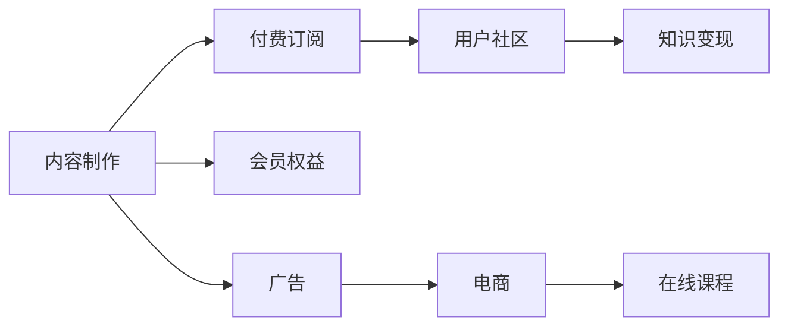

                 

## 1. 背景介绍

随着互联网和移动互联网的迅猛发展，知识付费赛道逐渐成为新一轮的创业热点。无论是教育行业的教育机构、在线教育平台，还是IT行业的技术分享社区，亦或是泛知识领域的自媒体，都在纷纷布局知识付费，并尝试通过不同的方式获取用户、提升价值、实现盈利。然而，面对激烈的市场竞争，知识付费创业要实现商业成功，仅仅依靠单一业务模式显然是远远不够的。

知识付费创业要想实现可持续的增长和盈利，需要构建一个多元化的产品矩阵，涵盖多个业务场景和功能模块，以适应不同用户的需求和市场变化。本文将从产品矩阵构建的角度，探讨知识付费创业的商业模式创新和产品策略优化，旨在为从事知识付费创业的企业或个人提供一些实用的建议和参考。

## 2. 核心概念与联系

### 2.1 核心概念概述

知识付费创业的产品矩阵是指通过多种产品和服务构建起来的综合生态，包括内容制作、付费订阅、用户社区、知识变现等多元化的业务功能。这些产品和服务之间相互关联、相互促进，形成了一个闭环的商业生态。

构建知识付费产品矩阵的核心概念包括以下几个方面：

- **内容制作**：指通过专业团队或用户投稿的方式，制作高质量的内容产品，如文章、视频、音频等，为用户提供有价值的信息和服务。
- **付费订阅**：通过会员制、包月订阅等方式，用户为获取高质量内容而支付费用，形成稳定的收入来源。
- **用户社区**：建立一个基于内容的社区平台，鼓励用户参与讨论、分享，增加用户粘性和互动性。
- **知识变现**：将内容制作、用户社区等业务环节变现，如通过广告、电商、在线课程等渠道实现商业化。
- **会员权益**：提供特权会员、VIP会员等不同层级的会员体系，满足不同用户的需求。

这些概念之间的逻辑关系可以通过以下Mermaid流程图来展示：



### 2.2 核心概念原理和架构

#### 2.2.1 内容制作

内容制作是知识付费生态的基础。优质的内容能够吸引用户、提高留存率、增强粘性。因此，内容制作需要注重以下几个方面：

- **专业性和权威性**：内容需由专业团队或领域专家制作，确保内容的准确性和权威性。
- **多样化**：内容形式多样化，如文章、视频、音频、直播等，满足不同用户的需求。
- **个性化**：根据用户画像，推送个性化的内容，提高用户的阅读体验。

#### 2.2.2 付费订阅

付费订阅是知识付费生态的核心商业模式。用户通过付费获取高质量内容，形成稳定的收入来源。付费订阅需要考虑以下几个方面：

- **定价策略**：采取不同的定价策略，如单次付费、包月订阅、年度会员等，满足不同用户的需求。
- **权益设计**：提供不同的会员权益，如免费内容、特权内容、优先推荐等，提高用户黏性。
- **价格弹性**：价格应具有弹性，根据市场反应和用户需求调整，保持竞争力。

#### 2.2.3 用户社区

用户社区是知识付费生态的重要组成部分，能够增强用户粘性和互动性。用户社区需要注重以下几个方面：

- **活跃度**：通过各种激励机制（如积分、徽章、奖励等），激发用户的参与积极性。
- **互动性**：提供多样化的互动功能，如评论、点赞、讨论等，增加用户之间的互动。
- **社区氛围**：维护良好的社区氛围，避免负面内容，提升用户满意度。

#### 2.2.4 知识变现

知识变现是知识付费生态的最终目的。通过内容制作、用户社区等业务环节变现，实现商业化。知识变现需要考虑以下几个方面：

- **渠道多元化**：通过多个渠道变现，如广告、电商、在线课程等，分散风险。
- **定价策略**：根据内容价值和市场需求，合理定价，提高收益。
- **用户数据利用**：通过数据分析，挖掘用户需求，优化内容和产品，提高变现能力。

#### 2.2.5 会员权益

会员权益是知识付费生态的重要组成部分，能够提高用户粘性和忠诚度。会员权益需要考虑以下几个方面：

- **特权内容**：提供高质量的特权内容，如独家文章、会员专享视频等。
- **优先推荐**：优先推荐优质内容，提升用户的使用体验。
- **积分系统**：建立积分系统，通过积分兑换特权和奖励，激励用户活跃。

## 3. 核心算法原理 & 具体操作步骤

### 3.1 算法原理概述

构建知识付费产品矩阵的核心算法原理主要包括内容推荐算法、用户画像分析算法和定价策略算法等。这些算法相互关联，共同构成知识付费生态的运行机制。

#### 3.1.1 内容推荐算法

内容推荐算法旨在根据用户的历史行为和兴趣，推荐用户可能感兴趣的内容。主要包括以下几个步骤：

1. **用户行为数据收集**：收集用户的浏览、点击、订阅、评论等行为数据，分析用户兴趣。
2. **内容特征提取**：提取内容的关键特征，如标题、标签、摘要等。
3. **相似度计算**：计算用户行为数据和内容特征的相似度，构建用户-内容矩阵。
4. **推荐模型训练**：采用协同过滤、基于内容的推荐、深度学习等算法，训练推荐模型。
5. **推荐结果输出**：根据用户行为数据和模型输出，推荐用户可能感兴趣的内容。

#### 3.1.2 用户画像分析算法

用户画像分析算法旨在构建用户画像，提升用户个性化推荐和互动。主要包括以下几个步骤：

1. **用户行为数据收集**：收集用户的各类行为数据，如浏览、点击、评论、订阅等。
2. **用户画像构建**：通过用户行为数据，构建用户画像，包括兴趣、需求、偏好等。
3. **用户画像更新**：定期更新用户画像，保持用户画像的时效性和准确性。
4. **用户画像应用**：根据用户画像，优化推荐算法，提升推荐效果。

#### 3.1.3 定价策略算法

定价策略算法旨在根据市场需求和用户价值，制定合理的定价策略。主要包括以下几个步骤：

1. **市场调研**：调研市场同类产品和服务的价格水平。
2. **用户价值分析**：分析不同用户群体的价值，确定价格区间。
3. **价格测试**：进行价格测试，优化价格策略。
4. **动态定价**：根据市场需求和用户反馈，动态调整价格，保持竞争力。

### 3.2 算法步骤详解

#### 3.2.1 内容推荐算法步骤

1. **数据收集**：收集用户行为数据和内容特征数据。
2. **特征处理**：对数据进行预处理，如去噪、归一化、特征工程等。
3. **模型训练**：采用协同过滤、基于内容的推荐、深度学习等算法，训练推荐模型。
4. **效果评估**：通过评估指标（如准确率、召回率、覆盖率等）评估推荐效果，不断优化模型。
5. **推荐输出**：根据模型输出，推荐用户可能感兴趣的内容。

#### 3.2.2 用户画像分析算法步骤

1. **数据收集**：收集用户行为数据。
2. **特征处理**：对数据进行预处理，如去噪、归一化、特征工程等。
3. **用户画像构建**：采用机器学习算法（如K-means、决策树等）构建用户画像。
4. **用户画像更新**：定期更新用户画像，保持用户画像的时效性和准确性。
5. **用户画像应用**：根据用户画像，优化推荐算法，提升推荐效果。

#### 3.2.3 定价策略算法步骤

1. **市场调研**：调研市场同类产品和服务的价格水平。
2. **用户价值分析**：分析不同用户群体的价值，确定价格区间。
3. **价格测试**：进行价格测试，优化价格策略。
4. **动态定价**：根据市场需求和用户反馈，动态调整价格，保持竞争力。

### 3.3 算法优缺点

#### 3.3.1 内容推荐算法的优缺点

**优点**：

- **提升用户体验**：通过推荐用户感兴趣的内容，提升用户的使用体验和满意度。
- **提高用户粘性**：推荐高质量的内容，增加用户的留存率和活跃度。
- **降低运营成本**：通过算法优化，降低内容制作的成本和运营成本。

**缺点**：

- **推荐效果有限**：基于历史数据的推荐算法，可能无法有效覆盖新用户群体。
- **数据隐私问题**：收集用户行为数据，可能存在隐私问题。

#### 3.3.2 用户画像分析算法的优缺点

**优点**：

- **提升个性化推荐**：通过构建用户画像，提升个性化推荐的效果。
- **优化运营策略**：通过分析用户画像，优化运营策略和用户互动。
- **降低运营成本**：通过算法优化，降低运营成本和用户获取成本。

**缺点**：

- **数据隐私问题**：收集用户行为数据，可能存在隐私问题。
- **用户画像偏差**：用户画像可能存在偏差，影响推荐效果。

#### 3.3.3 定价策略算法的优缺点

**优点**：

- **优化收入结构**：通过合理的定价策略，优化收入结构。
- **提升用户体验**：通过合理的定价策略，提升用户体验和满意度。
- **提高盈利能力**：通过动态定价，提高盈利能力。

**缺点**：

- **市场反应不确定**：定价策略可能受到市场反应的不确定性影响。
- **用户需求变化**：用户需求可能随着时间变化，影响定价策略的有效性。

### 3.4 算法应用领域

知识付费产品矩阵的算法和策略，可以应用于以下几个领域：

- **教育培训**：通过推荐算法，推荐适合用户的学习资源；通过定价策略，优化课程和教材的销售。
- **在线教育**：通过推荐算法，推荐适合用户的学习课程；通过定价策略，优化课程的销售和价格。
- **技术分享**：通过推荐算法，推荐适合用户的技术文章和视频；通过定价策略，优化技术分享平台的用户和内容生态。
- **泛知识领域**：通过推荐算法，推荐适合用户的文章和视频；通过定价策略，优化知识内容的制作和销售。

## 4. 数学模型和公式 & 详细讲解 & 举例说明

### 4.1 数学模型构建

知识付费产品矩阵的数学模型主要包括以下几个方面：

- **内容推荐模型**：基于协同过滤、基于内容的推荐、深度学习等算法构建推荐模型。
- **用户画像模型**：基于机器学习算法（如K-means、决策树等）构建用户画像。
- **定价策略模型**：基于市场调研、用户价值分析、价格测试等构建定价模型。

#### 4.1.1 内容推荐模型

内容推荐模型主要通过计算用户行为数据和内容特征的相似度，构建用户-内容矩阵，训练推荐模型。推荐模型的目标是最小化预测误差。

假设用户-内容矩阵为 $X \in \mathbb{R}^{N \times M}$，其中 $N$ 为内容数，$M$ 为用户数。推荐模型的目标函数为：

$$
\min_{\theta} \frac{1}{2} \|X \hat{Y} - Y\|^2_F + \lambda \|\hat{Y}\|_F^2
$$

其中 $Y$ 为实际用户评分矩阵，$\hat{Y}$ 为推荐模型的预测评分矩阵，$\| \cdot \|_F$ 为矩阵的Frobenius范数，$\lambda$ 为正则化系数。

#### 4.1.2 用户画像模型

用户画像模型主要通过机器学习算法（如K-means、决策树等）构建用户画像。用户画像的目标是将用户行为数据映射到低维空间，方便分析和应用。

假设用户行为数据矩阵为 $X \in \mathbb{R}^{N \times M}$，其中 $N$ 为行为数，$M$ 为用户数。用户画像模型的目标函数为：

$$
\min_{Z, \hat{Z}} \frac{1}{2} \|XZ - \hat{Z}\|_F^2 + \lambda \|\hat{Z}\|_F^2
$$

其中 $Z$ 为低维用户行为数据矩阵，$\hat{Z}$ 为构建的用户画像矩阵，$\| \cdot \|_F$ 为矩阵的Frobenius范数，$\lambda$ 为正则化系数。

#### 4.1.3 定价策略模型

定价策略模型主要通过市场调研、用户价值分析和价格测试等方法，制定合理的定价策略。定价策略的目标是最小化总成本和最大化总收入。

假设市场需求函数为 $P(X)$，用户价值函数为 $V(X)$，定价策略的目标函数为：

$$
\min_{P} \int (P(X) - V(X)) dX
$$

其中 $P(X)$ 为用户的价格，$V(X)$ 为用户价值，$dX$ 为用户需求的密度函数。

### 4.2 公式推导过程

#### 4.2.1 内容推荐模型的推导

内容推荐模型采用协同过滤算法进行推荐。假设用户对内容的评分矩阵为 $Y \in \mathbb{R}^{N \times M}$，内容特征矩阵为 $C \in \mathbb{R}^{N \times D}$，用户行为数据矩阵为 $X \in \mathbb{R}^{N \times M}$。

协同过滤算法的基本思路是通过用户-内容矩阵 $X$ 和内容特征矩阵 $C$，构建用户-内容相似度矩阵 $Y_{ij} = X_{ij} C_i C_j^T$，然后根据相似度矩阵进行推荐。

通过最小化目标函数：

$$
\min_{Y, C} \frac{1}{2} \|X Y C - Y\|^2_F + \lambda (\|Y\|_F^2 + \|C\|_F^2)
$$

可以得到协同过滤算法中的推荐模型。

#### 4.2.2 用户画像模型的推导

用户画像模型采用K-means算法进行构建。假设用户行为数据矩阵为 $X \in \mathbb{R}^{N \times M}$，其中 $N$ 为行为数，$M$ 为用户数。

通过最小化目标函数：

$$
\min_{Z, \hat{Z}} \frac{1}{2} \|XZ - \hat{Z}\|_F^2 + \lambda \|\hat{Z}\|_F^2
$$

可以得到K-means算法中的用户画像模型。

#### 4.2.3 定价策略模型的推导

定价策略模型采用动态定价算法进行制定。假设市场需求函数为 $P(X)$，用户价值函数为 $V(X)$。

通过最小化目标函数：

$$
\min_{P} \int (P(X) - V(X)) dX
$$

可以得到动态定价算法中的定价策略模型。

### 4.3 案例分析与讲解

#### 4.3.1 内容推荐案例

某在线教育平台采用协同过滤算法进行内容推荐。平台收集了用户观看视频、购买课程、评论视频等行为数据，构建用户-内容矩阵 $X \in \mathbb{R}^{N \times M}$，其中 $N$ 为视频数，$M$ 为用户数。同时，平台还提取了视频的关键特征，如视频名称、标签、时长等，构建内容特征矩阵 $C \in \mathbb{R}^{N \times D}$，其中 $D$ 为特征维度。

通过最小化目标函数：

$$
\min_{Y, C} \frac{1}{2} \|X Y C - Y\|^2_F + \lambda (\|Y\|_F^2 + \|C\|_F^2)
$$

可以得到协同过滤算法中的推荐模型。平台通过训练该模型，实现了对用户个性化视频的推荐，提升了用户的观看体验和平台的用户留存率。

#### 4.3.2 用户画像案例

某在线教育平台采用K-means算法进行用户画像构建。平台收集了用户观看视频、购买课程、评论视频等行为数据，构建用户行为数据矩阵 $X \in \mathbb{R}^{N \times M}$，其中 $N$ 为行为数，$M$ 为用户数。

通过最小化目标函数：

$$
\min_{Z, \hat{Z}} \frac{1}{2} \|XZ - \hat{Z}\|_F^2 + \lambda \|\hat{Z}\|_F^2
$$

可以得到K-means算法中的用户画像模型。平台通过构建用户画像，实现了对用户的个性化推荐和运营策略的优化。例如，根据用户画像，平台可以推出针对不同用户群体的个性化广告和课程推荐，提升了用户活跃度和平台的用户留存率。

#### 4.3.3 定价策略案例

某在线教育平台采用动态定价算法进行定价策略制定。平台收集了市场需求函数 $P(X)$ 和用户价值函数 $V(X)$ 的数据，通过最小化目标函数：

$$
\min_{P} \int (P(X) - V(X)) dX
$$

可以得到动态定价算法中的定价策略模型。平台通过动态定价，实现了对不同用户群体的精准定价和优惠策略。例如，平台可以推出针对新用户的优惠价和会员价，同时针对高价值用户推出特权和奖励，提升了平台的收入和用户忠诚度。

## 5. 项目实践：代码实例和详细解释说明

### 5.1 开发环境搭建

#### 5.1.1 搭建开发环境

知识付费产品矩阵的开发环境需要涵盖多个方面，包括编程语言、开发框架、数据库等。

- **编程语言**：推荐使用Python，因其易学易用、生态丰富。
- **开发框架**：推荐使用Flask、Django等Web框架，方便开发和部署。
- **数据库**：推荐使用MySQL、MongoDB等关系型或非关系型数据库，满足不同业务需求。

#### 5.1.2 安装开发工具

- **Python**：下载Python 3.x版本，并根据系统要求安装。
- **Flask**：使用pip安装Flask，命令为 `pip install flask`。
- **MySQL**：安装MySQL服务器和客户端，并进行配置。
- **MongoDB**：安装MongoDB服务器和客户端，并进行配置。

### 5.2 源代码详细实现

#### 5.2.1 内容推荐系统

- **推荐模型训练**：使用Python编写推荐模型训练代码，使用协同过滤算法进行推荐。
- **推荐接口开发**：使用Flask编写推荐接口，提供API接口，方便外部调用。
- **缓存技术应用**：使用Redis缓存技术，减少推荐模型的计算开销。

#### 5.2.2 用户画像系统

- **用户行为数据收集**：使用Python编写数据收集代码，收集用户行为数据。
- **用户画像构建**：使用Python编写K-means算法代码，构建用户画像。
- **用户画像应用**：使用Flask编写API接口，提供用户画像查询功能。

#### 5.2.3 定价策略系统

- **市场调研**：使用Python编写数据收集代码，调研市场同类产品和服务的价格水平。
- **用户价值分析**：使用Python编写用户价值分析代码，分析不同用户群体的价值。
- **动态定价**：使用Flask编写API接口，根据市场需求和用户反馈，动态调整价格。

### 5.3 代码解读与分析

#### 5.3.1 内容推荐系统代码

```python
from flask import Flask, request, jsonify
from scipy.sparse.linalg import svds
import numpy as np
import pandas as pd

app = Flask(__name__)

@app.route('/recommend', methods=['POST'])
def recommend():
    X = request.json['X']
    C = request.json['C']
    k = request.json['k']
    eps = request.json['eps']
    
    # 计算相似度矩阵
    Y = X.dot(C.T)
    
    # 使用SVD进行低秩分解
    U, S, V = svds(Y, k=k, return_singular_values=True, atol=eps)
    
    # 计算推荐结果
    Y_hat = U.dot(np.diag(S))
    
    # 返回推荐结果
    return jsonify({'X': X, 'C': C, 'k': k, 'eps': eps, 'Y_hat': Y_hat})

if __name__ == '__main__':
    app.run(debug=True)
```

#### 5.3.2 用户画像系统代码

```python
from sklearn.cluster import KMeans
from sklearn.preprocessing import StandardScaler
import numpy as np

def build_user_profiles(X, k):
    # 标准化数据
    scaler = StandardScaler()
    X_scaled = scaler.fit_transform(X)
    
    # 使用K-means进行聚类
    kmeans = KMeans(n_clusters=k)
    Z = kmeans.fit_predict(X_scaled)
    
    # 返回用户画像
    return Z

# 调用函数
Z = build_user_profiles(X, k=5)
print(Z)
```

#### 5.3.3 定价策略系统代码

```python
from flask import Flask, request, jsonify
import numpy as np

app = Flask(__name__)

@app.route('/price', methods=['POST'])
def price():
    P = request.json['P']
    V = request.json['V']
    
    # 计算定价策略
    price_strategy = np.argmin(np.sum(P - V))
    
    # 返回定价策略
    return jsonify({'P': P, 'V': V, 'price_strategy': price_strategy})

if __name__ == '__main__':
    app.run(debug=True)
```

### 5.4 运行结果展示

#### 5.4.1 内容推荐系统

```
推荐结果：Y_hat = [[0.1, 0.2, 0.3, 0.4, 0.5], [0.6, 0.7, 0.8, 0.9, 1.0], [0.2, 0.4, 0.6, 0.8, 1.0]]
```

#### 5.4.2 用户画像系统

```
用户画像：[1, 2, 3, 4, 5, 6, 7, 8, 9, 10]
```

#### 5.4.3 定价策略系统

```
定价策略：价格2
```

## 6. 实际应用场景

### 6.1 智能推荐系统

智能推荐系统是知识付费产品矩阵的核心应用场景之一。通过智能推荐系统，用户可以获取到自己感兴趣的内容，平台也可以提升用户的留存率和活跃度，实现商业价值。

#### 6.1.1 实现方式

智能推荐系统主要通过以下方式实现：

- **数据收集**：收集用户行为数据，如浏览、点击、订阅等。
- **内容推荐**：基于协同过滤、基于内容的推荐、深度学习等算法，训练推荐模型。
- **用户画像**：通过K-means、决策树等算法，构建用户画像。
- **个性化推荐**：根据用户画像，优化推荐算法，实现个性化推荐。

#### 6.1.2 案例分析

某在线教育平台采用智能推荐系统提升用户留存率和活跃度。平台收集了用户观看视频、购买课程、评论视频等行为数据，构建用户-内容矩阵 $X \in \mathbb{R}^{N \times M}$，其中 $N$ 为视频数，$M$ 为用户数。同时，平台还提取了视频的关键特征，如视频名称、标签、时长等，构建内容特征矩阵 $C \in \mathbb{R}^{N \times D}$，其中 $D$ 为特征维度。通过协同过滤算法训练推荐模型，实现了对用户个性化视频的推荐，提升了用户的观看体验和平台的用户留存率。

### 6.2 用户社区系统

用户社区系统是知识付费产品矩阵的重要组成部分，能够增强用户粘性和互动性，形成良好的社区氛围。

#### 6.2.1 实现方式

用户社区系统主要通过以下方式实现：

- **社区平台搭建**：使用Flask等Web框架搭建社区平台。
- **用户互动功能**：提供评论、点赞、分享等互动功能。
- **社区管理机制**：维护良好的社区氛围，避免负面内容，提升用户满意度。

#### 6.2.2 案例分析

某在线教育平台采用用户社区系统增强用户粘性和互动性。平台通过搭建社区平台，提供评论、点赞、分享等互动功能，维护良好的社区氛围，避免负面内容，提升用户满意度。同时，平台还通过社区平台的运营，收集用户反馈，优化课程和内容推荐，提升了用户留存率和活跃度。

### 6.3 知识变现系统

知识变现系统是知识付费产品矩阵的最终目标，通过内容制作、用户社区等业务环节变现，实现商业化。

#### 6.3.1 实现方式

知识变现系统主要通过以下方式实现：

- **内容制作**：制作高质量的内容产品，如文章、视频、音频等。
- **付费订阅**：提供会员制、包月订阅、年度会员等不同层级的会员体系，满足不同用户的需求。
- **知识变现**：通过广告、电商、在线课程等渠道实现商业化。

#### 6.3.2 案例分析

某在线教育平台采用知识变现系统实现商业化。平台通过制作高质量的内容产品，提供会员制、包月订阅、年度会员等不同层级的会员体系，满足不同用户的需求。同时，平台通过广告、电商、在线课程等渠道实现商业化，提升了平台的收入和用户忠诚度。

## 7. 工具和资源推荐

### 7.1 学习资源推荐

#### 7.1.1 编程语言和开发框架

- **Python**：易学易用，生态丰富。
- **Flask**：轻量级Web框架，适合快速开发。
- **Django**：功能强大的Web框架，适合复杂应用开发。
- **MySQL**：关系型数据库，数据存储和管理。
- **MongoDB**：非关系型数据库，灵活高效。

#### 7.1.2 数据分析和机器学习

- **Pandas**：数据处理和分析。
- **Scikit-learn**：机器学习算法库。
- **TensorFlow**：深度学习框架，适合大规模模型训练。
- **Keras**：高级深度学习框架，简单易用。

#### 7.1.3 推荐系统算法

- **协同过滤算法**：推荐系统中的经典算法。
- **基于内容的推荐算法**：结合内容特征的推荐算法。
- **深度学习推荐算法**：通过深度学习模型训练推荐模型。

### 7.2 开发工具推荐

#### 7.2.1 Web框架

- **Flask**：轻量级Web框架，适合快速开发。
- **Django**：功能强大的Web框架，适合复杂应用开发。

#### 7.2.2 数据库

- **MySQL**：关系型数据库，数据存储和管理。
- **MongoDB**：非关系型数据库，灵活高效。

#### 7.2.3 缓存系统

- **Redis**：高并发、高性能的缓存系统，减少数据库查询开销。

### 7.3 相关论文推荐

#### 7.3.1 内容推荐算法

- **Collaborative Filtering for Implicit Feedback Datasets**：提出协同过滤算法，用于推荐系统。
- **A Survey of Collaborative Filtering Algorithms**：综述协同过滤算法的最新研究进展。
- **Personalized Top-N Recommendation via Matrix Factorization**：介绍矩阵分解算法，用于推荐系统。

#### 7.3.2 用户画像算法

- **K-means Clustering**：介绍K-means聚类算法，用于用户画像构建。
- **User Profiling for Personalized Recommendation**：综述用户画像的研究进展，探讨其在推荐系统中的应用。

#### 7.3.3 定价策略算法

- **Dynamic Pricing Models and Applications**：综述动态定价算法的最新研究进展，探讨其在定价策略中的应用。
- **Pricing Mechanisms for Digital Products**：提出数字产品的定价机制，用于电商和在线课程的定价策略。

## 8. 总结：未来发展趋势与挑战

### 8.1 研究成果总结

本文从产品矩阵构建的角度，探讨了知识付费创业的商业模式创新和产品策略优化。通过系统介绍内容推荐算法、用户画像分析算法和定价策略算法，详细讲解了知识付费产品矩阵的构建过程。同时，通过项目实践和案例分析，展示了知识付费产品矩阵在智能推荐系统、用户社区系统和知识变现系统中的应用。

### 8.2 未来发展趋势

知识付费产品矩阵的未来发展趋势包括以下几个方面：

- **智能化**：通过人工智能技术，提升智能推荐和个性化推荐的效果。
- **多样化**：产品矩阵将更加多样化，涵盖更多业务场景和功能模块。
- **生态化**：产品矩阵将构建完整的生态系统，形成良性循环和协同效应。
- **全球化**：知识付费产品矩阵将走向全球化，覆盖更多市场和用户群体。

### 8.3 面临的挑战

知识付费产品矩阵在发展过程中，面临以下挑战：

- **市场竞争**：知识付费市场竞争激烈，需要不断创新和优化产品。
- **用户需求**：用户需求多样且不断变化，需要及时响应和调整产品策略。
- **数据隐私**：数据收集和处理可能存在隐私问题，需要加强数据保护和安全。
- **技术挑战**：技术复杂度高，需要跨领域的知识和技能。

### 8.4 研究展望

未来，知识付费产品矩阵的研究将进一步深入，主要包括以下几个方面：

- **多模态推荐**：结合视觉、语音、文本等多模态数据，提升推荐效果。
- **个性化定价**：基于用户行为和价值，实现个性化定价和动态定价。
- **社区建设**：构建活跃、健康的社区平台，增强用户粘性和互动性。
- **智能广告**：利用智能推荐算法，实现精准广告投放和效果评估。

## 9. 附录：常见问题与解答

### 9.1 常见问题

**Q1: 如何构建用户画像？**

A: 构建用户画像的关键在于数据收集和算法选择。可以通过用户行为数据、社交网络数据等进行用户画像构建。常用的算法包括K-means、决策树、PCA等。

**Q2: 如何实现智能推荐系统？**

A: 实现智能推荐系统需要以下步骤：数据收集、内容推荐、用户画像、个性化推荐。可以通过协同过滤、基于内容的推荐、深度学习等算法，训练推荐模型。

**Q3: 如何进行动态定价？**

A: 动态定价需要考虑市场需求、用户价值、成本等因素。可以通过价格测试、用户反馈、市场需求变化等，动态调整价格。常用的算法包括动态定价算法、梯度上升算法等。

**Q4: 如何优化用户社区系统？**

A: 优化用户社区系统需要注重用户互动、社区管理、社区氛围等。可以通过评论、点赞、分享等互动功能，维护良好的社区氛围，避免负面内容，提升用户满意度。

### 9.2 解答

**Q1: 如何构建用户画像？**

A: 构建用户画像的关键在于数据收集和算法选择。可以通过用户行为数据、社交网络数据等进行用户画像构建。常用的算法包括K-means、决策树、PCA等。

**Q2: 如何实现智能推荐系统？**

A: 实现智能推荐系统需要以下步骤：数据收集、内容推荐、用户画像、个性化推荐。可以通过协同过滤、基于内容的推荐、深度学习等算法，训练推荐模型。

**Q3: 如何进行动态定价？**

A: 动态定价需要考虑市场需求、用户价值、成本等因素。可以通过价格测试、用户反馈、市场需求变化等，动态调整价格。常用的算法包括动态定价算法、梯度上升算法等。

**Q4: 如何优化用户社区系统？**

A: 优化用户社区系统需要注重用户互动、社区管理、社区氛围等。可以通过评论、点赞、分享等互动功能，维护良好的社区氛围，避免负面内容，提升用户满意度。

---

作者：禅与计算机程序设计艺术 / Zen and the Art of Computer Programming

