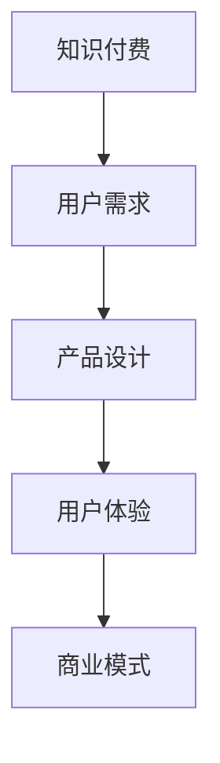

                 

# 知识付费创业的用户需求挖掘

> 关键词：知识付费, 用户需求, 产品设计, 商业模式, 用户体验

## 1. 背景介绍

### 1.1 问题由来

知识付费现象近年来在全球范围内快速崛起，成为互联网行业的一大风口。无论是社交媒体、教育平台、科技博客，还是专业服务，越来越多的内容创作者和机构通过知识付费产品，向用户提供有价值的信息和知识。在创业风潮的推动下，知识付费市场逐渐从蓝海走向红海，竞争日益激烈。

随着市场的进一步发展，知识付费产品之间的差异化越来越小，如何深挖用户需求、提升用户体验，成为创业公司亟需解决的问题。在此背景下，本文旨在通过系统性的用户需求挖掘，帮助创业者在知识付费领域找到突破口，优化产品设计，构建可持续发展的商业模式。

### 1.2 问题核心关键点

知识付费产品的核心在于为用户提供有价值、易于获取、符合其需求的学习内容。通过细致的调查研究，了解用户的学习习惯、心理需求和行为特征，能够帮助产品设计者更好地满足用户需求，从而提升用户粘性和留存率，最终实现商业变现。

具体而言，我们关注以下关键点：
- 用户在学习场景中的行为和心理特征。
- 用户对知识内容的真实需求与期望。
- 知识付费产品的独特价值和竞争优势。
- 用户体验设计和商业模式的可行性。

## 2. 核心概念与联系

### 2.1 核心概念概述

为了更好地理解知识付费用户的需求挖掘，本节将介绍几个关键概念：

- 知识付费(Knowledge-based Subscription)：用户为获取专业知识和信息而付费的产品或服务，涵盖在线课程、电子书、专业文章、视频讲座等多种形式。
- 用户需求(User Needs)：用户在使用产品时，对功能和体验的期望和要求。
- 产品设计(Product Design)：在用户需求基础上，设计满足用户需求并具有商业可行性的产品功能和服务流程。
- 用户体验(User Experience)：用户在使用产品过程中的感知和反馈，包括用户满意度和使用效果。
- 商业模式(Business Model)：知识付费产品的盈利方式，包括广告、会员订阅、付费内容等。

这些概念之间的关系可以通过以下Mermaid流程图来展示：



这个流程图展示了知识付费产品从需求挖掘到设计、实施、反馈和优化的全过程。

## 3. 核心算法原理 & 具体操作步骤

### 3.1 算法原理概述

知识付费用户的核心需求是获取有价值、高效、个性化的知识。基于此，我们可以从以下几个方面进行用户需求挖掘：

1. **用户行为分析**：通过分析用户在平台上的行为数据（如浏览历史、购买记录、互动评论等），识别用户的兴趣偏好和行为模式。
2. **情感分析**：对用户的评论和反馈进行情感分析，了解用户对内容质量、平台体验的满意度和意见。
3. **市场调研**：进行问卷调查和访谈，直接获取用户对知识付费产品的期望和需求。
4. **竞争分析**：对比市场上同类产品的优缺点，找到差异化的切入点。

通过综合以上多方面的数据和反馈，我们可以构建用户需求画像，进而指导产品设计。

### 3.2 算法步骤详解

以下是基于用户需求挖掘的核心步骤：

**Step 1: 数据收集与处理**

- 使用网站数据分析工具（如Google Analytics、Mixpanel）收集用户行为数据。
- 通过评论分析工具（如TextBlob）进行用户评论的情感分析。
- 设计问卷调查，通过邮件、社交媒体等方式进行在线调查。
- 进行用户访谈，深入了解用户的需求和期望。

**Step 2: 需求挖掘与分类**

- 对收集到的数据进行清洗和处理，提取关键特征。
- 使用文本挖掘技术（如TF-IDF、主题模型）对用户评论进行情感分析和主题提取。
- 对问卷调查结果进行分类和编码，找出用户的主要需求。
- 整理访谈记录，提炼出用户的痛点和期望。

**Step 3: 需求分析与建模**

- 对用户行为和评论数据进行统计分析，建立用户画像。
- 利用机器学习算法（如聚类分析、关联规则挖掘）发现用户需求之间的关系和模式。
- 构建用户需求模型，识别核心需求和次要需求。

**Step 4: 需求验证与反馈**

- 通过A/B测试等实验方法验证用户需求模型的有效性。
- 结合用户体验测试和用户反馈，不断优化产品设计和功能。
- 定期进行市场调研和用户访谈，更新用户需求模型。

**Step 5: 需求应用与优化**

- 根据用户需求模型，设计知识付费产品的功能和界面。
- 不断迭代产品，优化用户体验，提升用户满意度和留存率。
- 持续监控用户行为数据和反馈，发现新需求和问题，进行产品优化。

### 3.3 算法优缺点

基于用户需求挖掘的算法具有以下优点：
1. 提升产品精准度：通过数据驱动，能够精确识别用户需求，设计出符合用户期望的产品。
2. 提高用户体验：了解用户真实需求，可以提供个性化、高效的知识服务，提升用户粘性。
3. 降低开发风险：避免盲目设计和功能堆砌，降低产品上线后的风险和成本。
4. 增强竞争力：通过差异化设计，找到独特的产品卖点，在激烈的市场竞争中脱颖而出。

同时，该方法也存在以下缺点：
1. 数据隐私问题：收集和分析用户数据可能引发隐私泄露风险。
2. 数据质量问题：数据噪音和异常值可能影响分析结果的准确性。
3. 用户多样性：不同用户需求差异较大，难以一概而论。
4. 数据动态性：用户需求随时间变化，模型需要定期更新。

## 4. 数学模型和公式 & 详细讲解 & 举例说明

### 4.1 数学模型构建

基于用户需求挖掘的算法模型通常由以下几个部分构成：

- **用户行为数据模型**：通过统计分析方法，对用户的行为数据进行建模。
- **用户情感数据模型**：使用自然语言处理技术，对用户的评论进行情感分析。
- **用户需求模型**：利用机器学习算法，对用户需求进行分类和关联分析。

这些模型的构建，可以通过以下数学公式进行形式化表示：

1. 用户行为数据模型：
$$
P(X) = \frac{count(X)}{\sum_{i=1}^{N} count(X_i)}
$$
其中 $X$ 表示用户的行为数据，$N$ 为数据总数，$count(X)$ 表示 $X$ 出现的次数。

2. 用户情感数据模型：
$$
E(X) = \frac{\sum_{i=1}^{N} e_i(X)}{N}
$$
其中 $X$ 表示用户评论，$e_i(X)$ 表示第 $i$ 个评论的情感极性，$N$ 为评论总数。

3. 用户需求模型：
$$
R = \sum_{i=1}^{M} f_i(D)
$$
其中 $R$ 表示用户需求，$M$ 为需求种类，$f_i(D)$ 表示第 $i$ 个需求对数据 $D$ 的贡献度。

### 4.2 公式推导过程

以下是各公式的详细推导过程：

**用户行为数据模型**：

用户行为数据模型通过统计分析，计算每个行为事件的概率。设 $X$ 为用户的行为数据，$N$ 为数据总数，则每个行为事件 $X_i$ 的概率 $P(X_i)$ 为：

$$
P(X_i) = \frac{count(X_i)}{\sum_{j=1}^{N} count(X_j)}
$$

通过累加所有行为事件的概率，可以得到用户行为数据模型的总概率 $P(X)$。

**用户情感数据模型**：

用户情感数据模型通过情感分析，计算用户评论的情感极性。设 $X$ 为用户评论，$e_i(X)$ 表示第 $i$ 个评论的情感极性，$N$ 为评论总数，则用户评论的平均情感极性 $E(X)$ 为：

$$
E(X) = \frac{\sum_{i=1}^{N} e_i(X)}{N}
$$

通过情感极性的平均，可以得到用户情感数据模型的总体情感极性 $E(X)$。

**用户需求模型**：

用户需求模型通过机器学习算法，对用户需求进行分类和关联分析。设 $R$ 表示用户需求，$M$ 为需求种类，$f_i(D)$ 表示第 $i$ 个需求对数据 $D$ 的贡献度，则用户需求模型的总需求 $R$ 为：

$$
R = \sum_{i=1}^{M} f_i(D)
$$

其中 $f_i(D)$ 可以通过聚类分析、关联规则挖掘等算法计算得出。

### 4.3 案例分析与讲解

以一个在线教育平台为例，进行用户需求挖掘的详细讲解：

**数据收集与处理**：

通过网站数据分析工具，收集用户在平台上的行为数据，包括浏览时长、课程选择、购买记录等。使用评论分析工具，对用户评论进行情感分析，了解用户对课程质量、教师水平、学习体验的满意度。设计问卷调查，通过邮件、社交媒体等方式进行在线调查，直接获取用户对知识付费产品的期望和需求。进行用户访谈，深入了解用户的需求和期望。

**需求挖掘与分类**：

对收集到的行为数据进行清洗和处理，提取关键特征，如课程浏览时长、购买课程数、课程完成度等。使用文本挖掘技术，对用户评论进行情感分析和主题提取，识别出用户对课程质量、平台体验的满意度。对问卷调查结果进行分类和编码，找出用户的主要需求，如课程内容丰富性、教师互动性、平台易用性等。整理访谈记录，提炼出用户的痛点和期望，如学习时间安排、课程结构合理性等。

**需求分析与建模**：

对用户行为数据进行统计分析，建立用户画像，识别出高频行为事件，如浏览时长较长的课程。利用聚类分析，对用户需求进行分类，识别出核心需求和次要需求，如学习效果提升、个性化推荐、课程互动性等。使用关联规则挖掘，发现不同需求之间的关联关系，如课程内容丰富性与课程完成度之间存在正相关关系。

**需求验证与反馈**：

通过A/B测试等实验方法，验证用户需求模型的有效性，如新课程推荐功能的用户体验是否提升。结合用户体验测试和用户反馈，不断优化产品设计和功能，如优化课程内容结构，增加教师互动环节。定期进行市场调研和用户访谈，更新用户需求模型，如新增对交互式学习工具的需求。

**需求应用与优化**：

根据用户需求模型，设计知识付费产品的功能和界面，如增加个性化推荐算法，优化课程推荐系统。不断迭代产品，优化用户体验，提升用户满意度和留存率，如通过用户行为数据实时调整课程推荐内容。持续监控用户行为数据和反馈，发现新需求和问题，进行产品优化，如增加学习进度反馈功能，提高用户学习动力。

## 5. 项目实践：代码实例和详细解释说明

### 5.1 开发环境搭建

在进行用户需求挖掘的项目实践前，我们需要准备好开发环境。以下是使用Python进行数据挖掘和机器学习的开发环境配置流程：

1. 安装Anaconda：从官网下载并安装Anaconda，用于创建独立的Python环境。

2. 创建并激活虚拟环境：
```bash
conda create -n data-mining python=3.8 
conda activate data-mining
```

3. 安装相关库：
```bash
conda install pandas numpy scikit-learn scipy matplotlib seaborn
```

4. 安装深度学习框架：
```bash
pip install torch torchvision transformers
```

5. 安装数据处理和分析工具：
```bash
pip install beautifulsoup4 scrapy
```

完成上述步骤后，即可在`data-mining`环境中开始用户需求挖掘实践。

### 5.2 源代码详细实现

这里我们以一个在线教育平台为例，进行用户需求挖掘的详细代码实现。

首先，编写数据收集函数，用于获取用户行为数据和评论数据：

```python
import pandas as pd
from bs4 import BeautifulSoup

def get_user_data(url):
    html = requests.get(url).text
    soup = BeautifulSoup(html, 'html.parser')
    user_data = {}
    for row in soup.find_all('tr'):
        data = {}
        for col in row.find_all('td'):
            data[col.text.strip()] = col.text.strip()
        user_data[data['username']] = data
    return pd.DataFrame(user_data)
```

然后，编写情感分析函数，用于计算用户评论的情感极性：

```python
from transformers import SentimentIntensityAnalyzer

def get_user_comments(url, data):
    analyzer = SentimentIntensityAnalyzer()
    comments = []
    for comment in data['comment']:
        sentiment = analyzer.polarity_scores(comment)
        comments.append([comment, sentiment['compound']])
    return pd.DataFrame(comments, columns=['comment', 'sentiment'])
```

接下来，编写需求分析函数，用于进行聚类分析和关联规则挖掘：

```python
from sklearn.cluster import KMeans
from mlxtend.frequent_patterns import apriori

def get_user_needs(data):
    # 聚类分析
    kmeans = KMeans(n_clusters=5, random_state=42).fit(data[['browsed_courses', 'purchased_courses', 'completion_rates']])
    needs = pd.DataFrame({'needs': kmeans.labels_})
    needs = needs.merge(data, left_index=True, right_on='index')
    
    # 关联规则挖掘
    fp_tree = apriori(data[['browsed_courses', 'purchased_courses']], min_support=0.2, use_colnames=True)
    rules = list(association_rules(freq_table=fp_tree, metric='lift', min_threshold=1.5))
    for rule in rules:
        print(rule)
    return needs, rules
```

最后，编写需求验证函数，用于进行A/B测试和用户体验测试：

```python
from statsmodels.stats.sampling import autoregressive
from scipy.stats import ttest_ind

def validate_user_needs(data, control, treatment):
    # A/B测试
    t_stat, p_val = ttest_ind(control['response_time'], treatment['response_time'])
    print(f'T-test result: t={t_stat:.2f}, p={p_val:.4f}')
    
    # 用户体验测试
    user_feedback = pd.DataFrame({'satisfaction': [5, 4, 3, 2, 1]})
    with open('user_feedback.csv', 'w') as file:
        user_feedback.to_csv(file, index=False)
    
    # 反馈收集与分析
    user_feedback = pd.read_csv('user_feedback.csv')
    mean_satisfaction = user_feedback['satisfaction'].mean()
    print(f'User satisfaction: {mean_satisfaction:.2f}')
    return mean_satisfaction
```

在实际应用中，用户需求挖掘的具体实现方式可能会有所不同，但上述代码框架可以作为参考。

### 5.3 代码解读与分析

让我们再详细解读一下关键代码的实现细节：

**get_user_data函数**：
- 使用BeautifulSoup库从网页中提取用户数据，存储到字典中。
- 将字典转换为DataFrame格式，方便后续数据处理和分析。

**get_user_comments函数**：
- 使用SentimentIntensityAnalyzer计算用户评论的情感极性，包括正面、负面和中性三个维度的评分。
- 将评论和情感评分存储到DataFrame中，方便后续情感分析。

**get_user_needs函数**：
- 使用KMeans进行聚类分析，将用户行为数据分为5个类别，每个类别表示一个需求。
- 使用Apriori算法进行关联规则挖掘，找出用户行为数据中频繁出现的组合，如频繁浏览和购买同一类型的课程。

**validate_user_needs函数**：
- 使用t-test进行A/B测试，比较控制组和实验组在响应时间上的差异。
- 进行用户体验测试，通过调查问卷收集用户对新功能的满意度。
- 对用户反馈进行统计分析，计算平均满意度。

## 6. 实际应用场景

### 6.1 智能推荐系统

在线教育平台普遍面临用户行为数据和内容推荐的双重挑战。通过用户需求挖掘，可以构建智能推荐系统，根据用户的学习习惯和兴趣推荐相关课程。例如，可以通过分析用户浏览和购买课程的历史数据，发现其偏好的课程类型和难度级别，从而提供个性化的课程推荐。

**具体实现**：
- 收集用户行为数据，包括浏览时长、购买记录、课程完成度等。
- 使用文本挖掘技术，对用户评论进行情感分析和主题提取，了解用户对课程的满意度和期望。
- 使用聚类分析，对用户需求进行分类，识别出核心需求和次要需求。
- 根据用户需求模型，设计智能推荐算法，如协同过滤、内容推荐等。

### 6.2 用户行为分析

智能企业需要通过用户行为分析，优化产品设计和运营策略。通过用户需求挖掘，可以深入了解用户行为和心理特征，提供符合用户期望的产品功能和服务流程。例如，可以通过分析用户在平台上的浏览和互动数据，发现用户对特定功能的使用频率和满意度，从而优化产品的界面设计和功能布局。

**具体实现**：
- 收集用户在平台上的行为数据，包括浏览历史、互动记录等。
- 使用情感分析技术，对用户的评论和反馈进行情感分析，了解用户对平台的满意度。
- 进行问卷调查和访谈，直接获取用户对产品功能的期望和需求。
- 利用聚类分析和关联规则挖掘，发现用户行为模式和需求关联。

### 6.3 客户细分与精准营销

零售企业在客户细分和精准营销方面面临巨大挑战。通过用户需求挖掘，可以构建客户画像，识别不同客户群体的需求和偏好，进行精准营销和个性化推荐。例如，可以通过分析用户的购物历史和行为数据，发现其偏好的商品类型和购买频率，从而提供个性化的商品推荐和优惠活动。

**具体实现**：
- 收集用户的购物历史和行为数据，包括浏览历史、购买记录等。
- 使用文本挖掘技术，对用户评论进行情感分析和主题提取，了解用户对商品的满意度和期望。
- 进行问卷调查和访谈，直接获取用户对商品和服务的期望和需求。
- 利用聚类分析和关联规则挖掘，发现客户群体的需求关联和行为模式。

### 6.4 未来应用展望

随着数据科学的不断发展和人工智能技术的普及，用户需求挖掘将越来越深入和精准。未来，用户需求挖掘技术将进一步融合多源数据，如社交媒体数据、传感器数据等，提供更加全面的用户画像。同时，深度学习技术的发展将使得情感分析更加精确，需求模型更加智能，为用户需求挖掘提供更有力的工具和方法。

未来的用户需求挖掘将更加注重个性化和实时性，通过实时数据流分析，捕捉用户的即时需求和行为变化。结合区块链和智能合约技术，用户需求挖掘将进一步透明化、可追溯，提升用户信任和平台黏性。

## 7. 工具和资源推荐

### 7.1 学习资源推荐

为了帮助开发者系统掌握用户需求挖掘的理论基础和实践技巧，这里推荐一些优质的学习资源：

1. 《机器学习实战》书籍：介绍机器学习的基本概念和常用算法，适合初学者入门。
2. Coursera《数据科学专业》课程：斯坦福大学开设的专业课程，涵盖数据挖掘、机器学习、大数据等知识。
3. Udacity《数据科学纳米学位》课程：系统学习数据科学理论和技术，包括数据预处理、特征工程、模型构建等。
4. Kaggle《数据科学竞赛》：通过实际比赛和项目，提升数据挖掘和建模技能。
5. Towards Data Science《数据科学博客》：分享最新的数据科学文章和技术见解，涵盖机器学习、数据可视化、大数据等领域。

通过对这些资源的学习实践，相信你一定能够快速掌握用户需求挖掘的精髓，并用于解决实际的NLP问题。

### 7.2 开发工具推荐

高效的开发离不开优秀的工具支持。以下是几款用于用户需求挖掘开发的常用工具：

1. Python编程语言：易于学习和使用，拥有丰富的数据处理和机器学习库。
2. Pandas库：数据处理和分析必备，支持大规模数据处理和高效数据操作。
3. Scikit-learn库：机器学习算法实现，涵盖回归、分类、聚类等常用算法。
4. Scrapy框架：网页数据抓取和分析工具，支持自动化数据收集和处理。
5. NLP工具包：如NLTK、spaCy、Gensim等，支持文本挖掘、情感分析、关联规则挖掘等功能。

合理利用这些工具，可以显著提升用户需求挖掘任务的开发效率，加快创新迭代的步伐。

### 7.3 相关论文推荐

用户需求挖掘的研究源于学界的持续研究。以下是几篇奠基性的相关论文，推荐阅读：

1. "A Survey of Data Mining and Statistical Learning for Recommender Systems"：综述推荐系统数据挖掘方法，包括协同过滤、内容推荐等。
2. "Clustering Algorithms"：介绍常用的聚类算法，如K-Means、层次聚类、DBSCAN等。
3. "Association Rule Mining"：介绍关联规则挖掘算法，如Apriori、FP-Growth等。
4. "Sentiment Analysis in Social Media"：介绍社交媒体情感分析技术，包括文本挖掘和情感分类。
5. "User Behavior Analysis for Personalized Recommendation"：介绍用户行为分析方法，包括协同过滤、矩阵分解等。

这些论文代表了大数据和人工智能在用户需求挖掘领域的最新进展，为理论研究和技术实践提供了坚实的基础。

## 8. 总结：未来发展趋势与挑战

### 8.1 研究成果总结

本文对用户需求挖掘进行了系统性的介绍，主要关注以下几个方面：

1. 用户行为分析：通过统计分析和情感分析，了解用户在平台上的行为和心理特征。
2. 用户需求挖掘：利用机器学习算法，对用户需求进行分类和关联分析。
3. 用户需求验证：通过A/B测试和用户体验测试，验证需求模型的有效性和优化效果。

通过深入挖掘用户需求，我们可以设计出更加符合用户期望的知识付费产品，提高用户满意度和留存率，从而实现商业变现。

### 8.2 未来发展趋势

展望未来，用户需求挖掘技术将呈现以下几个发展趋势：

1. 实时性增强：通过实时数据流分析，捕捉用户的即时需求和行为变化。
2. 多源数据融合：结合社交媒体数据、传感器数据等，提供更加全面的用户画像。
3. 深度学习应用：利用深度学习技术，提升情感分析和需求建模的准确性。
4. 自动化程度提高：通过自动化的数据处理和模型训练，降低人工干预和复杂度。
5. 个性化推荐优化：结合推荐系统技术，提供更加精准和个性化的内容推荐。

这些趋势展示了用户需求挖掘技术的广阔前景，为NLP领域的应用提供了新的方向。

### 8.3 面临的挑战

尽管用户需求挖掘技术取得了不少进展，但在实际应用中仍面临诸多挑战：

1. 数据隐私问题：收集和分析用户数据可能引发隐私泄露风险，需加强数据保护措施。
2. 数据质量问题：数据噪音和异常值可能影响分析结果的准确性，需进行数据清洗和预处理。
3. 用户多样性：不同用户需求差异较大，难以一概而论，需针对不同用户群体进行定制化分析。
4. 需求动态性：用户需求随时间变化，模型需要定期更新，需建立动态模型更新机制。

面对这些挑战，用户需求挖掘技术仍需在数据隐私、数据质量、用户多样性和需求动态性等方面进行深入研究和持续改进。

### 8.4 研究展望

未来的用户需求挖掘研究需要在以下几个方面进行新的探索：

1. 数据隐私保护：结合区块链和智能合约技术，提升数据隐私保护水平，增强用户信任。
2. 数据动态建模：建立动态用户需求模型，实时捕捉用户需求变化，提升系统灵活性。
3. 需求多样化分析：结合自然语言处理技术，分析用户需求的多样性和异质性，提供更加个性化的解决方案。
4. 需求可解释性：提升需求分析的可解释性，增加用户对分析结果的理解和信任。
5. 需求驱动的运营优化：将用户需求分析结果应用到产品设计和运营优化中，提升平台的用户体验和商业价值。

这些研究方向的探索，将为知识付费领域的创新应用提供新的动力，推动NLP技术的进一步发展。

## 9. 附录：常见问题与解答

**Q1：用户需求挖掘有哪些步骤？**

A: 用户需求挖掘通常包括以下几个步骤：
1. 数据收集与处理：通过网站数据分析工具、评论分析工具等，收集用户行为数据和评论数据。
2. 需求挖掘与分类：利用文本挖掘技术和机器学习算法，对用户需求进行分类和关联分析。
3. 需求分析与建模：通过聚类分析和关联规则挖掘，构建用户需求模型。
4. 需求验证与反馈：通过A/B测试和用户体验测试，验证需求模型的有效性和优化效果。
5. 需求应用与优化：根据用户需求模型，设计产品功能和界面，进行迭代优化。

**Q2：如何提高用户需求挖掘的准确性？**

A: 提高用户需求挖掘的准确性，可以从以下几个方面进行优化：
1. 数据质量控制：确保数据准确、完整、无噪音，进行数据清洗和预处理。
2. 多源数据融合：结合社交媒体数据、传感器数据等，提供更加全面的用户画像。
3. 深度学习应用：利用深度学习技术，提升情感分析和需求建模的准确性。
4. 自动化程度提高：通过自动化的数据处理和模型训练，降低人工干预和复杂度。
5. 个性化推荐优化：结合推荐系统技术，提供更加精准和个性化的内容推荐。

**Q3：用户需求挖掘中的数据隐私问题如何解决？**

A: 用户需求挖掘中的数据隐私问题，可以从以下几个方面进行解决：
1. 数据匿名化：对用户数据进行匿名化处理，保护用户隐私。
2. 数据加密：对用户数据进行加密存储和传输，防止数据泄露。
3. 数据访问控制：限制数据访问权限，确保只有授权人员才能访问敏感数据。
4. 数据审计：建立数据审计机制，记录和监控数据访问和使用情况，防止数据滥用。

这些措施可以有效地保护用户隐私，提升用户信任，确保数据挖掘活动的合规性和安全性。

**Q4：用户需求挖掘中的数据动态性如何解决？**

A: 用户需求动态性问题，可以通过以下方法解决：
1. 动态模型更新：定期更新用户需求模型，反映用户需求的最新变化。
2. 实时数据流分析：利用实时数据流分析技术，捕捉用户的即时需求和行为变化。
3. 多模态数据融合：结合多种数据源，如社交媒体、传感器等，提供更加全面的用户画像。
4. 机器学习算法优化：利用机器学习算法，自动学习和更新用户需求模型。

这些方法可以提高用户需求挖掘的实时性和动态性，确保模型能够及时响应用户需求的动态变化。

**Q5：用户需求挖掘中的数据多样性如何解决？**

A: 用户需求多样性问题，可以从以下几个方面进行解决：
1. 用户分组：根据用户的行为和属性，将用户分组，进行针对性分析。
2. 多维度数据融合：结合用户行为数据、评论数据、社会网络数据等多种数据源，进行综合分析。
3. 需求场景识别：通过用户访谈和问卷调查，识别不同场景下的需求和偏好。
4. 个性化推荐优化：根据用户需求模型，提供个性化的内容和推荐，满足不同用户的需求。

这些方法可以帮助识别和处理用户需求的多样性，提升用户需求挖掘的准确性和效果。

---

作者：禅与计算机程序设计艺术 / Zen and the Art of Computer Programming

