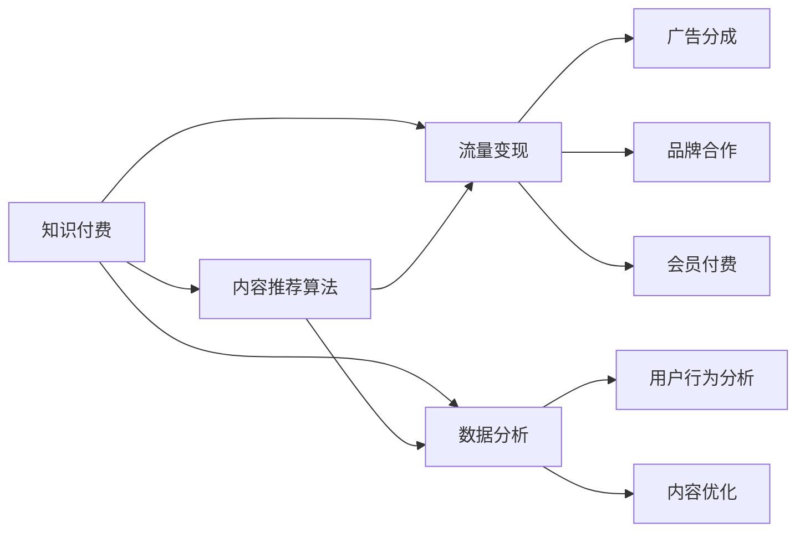

                 

# 知识付费如何实现可持续盈利？

在数字化时代的浪潮下，知识付费模式应运而生，成为了教育、科技、文化等多个领域的新趋势。然而，要实现知识付费业务的持续盈利，并不是一件容易的事情。本文将系统地探讨这一问题，从背景介绍、核心概念、算法原理、项目实践、应用场景等多个角度展开分析，希望能够为从业者提供有价值的参考。

## 1. 背景介绍

### 1.1 问题由来
随着互联网的普及，信息过载的问题日益严重。面对海量的信息，人们越来越需要高效、精准、个性化的知识获取途径。知识付费模式应运而生，通过提供付费课程、文章、音频、视频等内容，帮助用户快速获取高质量的知识信息。

然而，尽管知识付费市场近年来增长迅速，但许多平台在盈利方面仍面临诸多挑战：
1. 内容质量参差不齐，用户流失率较高。
2. 付费转化率低，用户付费意愿不强。
3. 市场竞争激烈，平台运营成本高。
4. 内容同质化严重，创新点不足。
5. 商业模式单一，缺乏持续盈利点。

这些问题严重制约了知识付费平台的健康发展，亟需有效的解决方案。

### 1.2 问题核心关键点
知识付费的盈利可持续性，主要依赖于以下几个关键点：
- 高质量内容供给：构建内容生态，吸引优质创作者入驻，提升内容质量。
- 精准用户推荐：利用算法推荐技术，帮助用户发现感兴趣的内容，提高用户黏性。
- 多元化盈利模式：探索多种盈利渠道，如付费会员、广告分成、品牌合作等。
- 社区建设：打造用户社区，增强用户粘性，提升平台口碑。
- 数据驱动决策：通过数据分析，优化内容推荐和运营策略。

本文将围绕这些关键点，探讨知识付费平台如何实现可持续盈利。

## 2. 核心概念与联系

### 2.1 核心概念概述
- **知识付费**：通过付费方式获取优质知识信息，满足用户个性化学习需求。
- **内容推荐算法**：利用算法技术，根据用户行为数据，推荐符合其兴趣的内容。
- **流量变现**：将平台流量转化为广告收入、品牌合作、会员付费等多种盈利方式。
- **数据分析**：通过数据挖掘和分析，优化平台运营策略，提升用户留存率。

这些核心概念之间具有紧密的联系，构成了一个复杂但可解的业务系统。以下Mermaid流程图展示了这些概念之间的相互关系：



## 3. 核心算法原理 & 具体操作步骤

### 3.1 算法原理概述
知识付费平台的核心算法主要分为内容推荐算法和流量变现算法。其中，内容推荐算法用于提升用户体验和留存率，而流量变现算法则用于实现平台的商业化。

#### 3.2 算法步骤详解

**内容推荐算法**：
1. **数据收集**：收集用户行为数据，包括浏览记录、点击次数、购买历史等。
2. **特征提取**：对用户行为数据进行特征提取，包括兴趣标签、时间戳、设备信息等。
3. **模型训练**：选择合适推荐算法（如协同过滤、基于深度学习的模型等），训练模型。
4. **内容推荐**：根据用户特征和模型预测，推荐适合的内容。
5. **效果评估**：使用指标如点击率、转化率、用户留存率等评估推荐效果，不断优化模型。

**流量变现算法**：
1. **数据收集**：收集平台流量数据，包括访问量、浏览时长、页面停留时间等。
2. **转化率分析**：分析用户行为数据，找到高转化率的流量来源。
3. **广告定位**：根据用户特征和行为数据，精准投放广告。
4. **广告收入优化**：优化广告投放策略，提高广告点击率和转化率，增加广告收入。
5. **多元化盈利模式探索**：探索多种盈利模式，如品牌合作、会员付费、内容二次售卖等。

### 3.3 算法优缺点
**内容推荐算法的优缺点**：
- **优点**：提高用户留存率和粘性，提升平台整体价值。
- **缺点**：推荐算法复杂，需大量数据训练，且可能存在冷启动问题。

**流量变现算法的优缺点**：
- **优点**：直接增加平台收入，降低运营成本。
- **缺点**：广告质量参差不齐，用户感知较差，可能影响用户体验。

### 3.4 算法应用领域
内容推荐算法和流量变现算法广泛应用于知识付费平台的各个环节，包括内容分发、用户推荐、广告投放等。以下是几个具体应用场景：
1. **个性化内容推荐**：根据用户兴趣，推荐相关课程、文章、视频等内容。
2. **精准广告投放**：根据用户行为数据，精准投放品牌广告，提高广告效果。
3. **会员付费优化**：通过数据分析，优化会员付费策略，提高会员续费率和续费率。

## 4. 数学模型和公式 & 详细讲解 & 举例说明

### 4.1 数学模型构建
以下是内容推荐算法的数学模型构建过程：

假设用户集合为 $U=\{u_1, u_2, ..., u_M\}$，内容集合为 $C=\{c_1, c_2, ..., c_N\}$，用户与内容的交互矩阵为 $R \in \mathbb{R}^{M \times N}$，其中 $R_{ui}=\begin{cases} 1, & \text{用户 } u_i \text{ 点击过内容 } c_j \\ 0, & \text{否则} \end{cases}$。

内容推荐算法的目标是预测用户 $u_i$ 对内容 $c_j$ 的评分 $r_{ij}$，从而推荐给用户 $u_i$ 最相关的内容 $c_j$。

### 4.2 公式推导过程
常用的推荐算法包括协同过滤和基于深度学习的模型。

**协同过滤算法**：
协同过滤算法分为基于用户的协同过滤和基于项目的协同过滤。

- 基于用户的协同过滤：
$$
\hat{r}_{ij} = \frac{1}{1+\exp(\theta_{u_i}-\theta_{u_j})}
$$
其中 $\theta_{u_i}$ 和 $\theta_{u_j}$ 为用户 $u_i$ 和 $u_j$ 的隐向量。

- 基于项目的协同过滤：
$$
\hat{r}_{ij} = \frac{1}{1+\exp(\theta_{c_i}-\theta_{c_j})}
$$
其中 $\theta_{c_i}$ 和 $\theta_{c_j}$ 为内容 $c_i$ 和 $c_j$ 的隐向量。

**基于深度学习的推荐模型**：
常用的深度学习模型包括矩阵分解模型、神经网络模型、注意力机制模型等。

- 矩阵分解模型：
$$
\hat{r}_{ij} = \hat{\alpha}_i \hat{\beta}_j^T
$$
其中 $\hat{\alpha}_i$ 和 $\hat{\beta}_j$ 分别为用户和内容的隐向量。

- 神经网络模型：
$$
\hat{r}_{ij} = \sigma(W^1 [u_i; c_j] + b^1)
$$
其中 $W^1$ 和 $b^1$ 为神经网络模型的参数，$\sigma$ 为激活函数。

**注意力机制模型**：
$$
\hat{r}_{ij} = \sum_{k=1}^K \alpha_{ik} \theta_{kj}
$$
其中 $\alpha_{ik}$ 和 $\theta_{kj}$ 分别为用户和内容的注意力向量。

### 4.3 案例分析与讲解
以基于深度学习的推荐模型为例，某知识付费平台通过收集用户行为数据，训练神经网络模型进行内容推荐。具体步骤如下：
1. 数据预处理：对用户行为数据进行清洗、归一化、特征提取等预处理。
2. 模型训练：选择合适的网络结构（如多层感知器），使用交叉熵损失函数训练模型。
3. 模型评估：使用准确率、召回率、F1值等指标评估模型性能。
4. 推荐实现：根据模型预测，推荐用户感兴趣的内容。

## 5. 项目实践：代码实例和详细解释说明

### 5.1 开发环境搭建

在项目实践前，首先需要搭建好开发环境。以下是一些常用的工具和资源：

1. **Python**：选择 Python 作为开发语言，其灵活性和丰富的科学计算库使其成为数据科学和机器学习领域的主流工具。
2. **PyTorch**：选择 PyTorch 作为深度学习框架，其动态计算图和易用性使其成为深度学习领域的热门选择。
3. **Pandas**：选择 Pandas 作为数据处理库，其高效的数据结构和高性能的数据操作能力，使其成为数据科学领域的首选。
4. **TensorBoard**：选择 TensorBoard 作为模型可视化工具，其强大的图表展示能力，可以直观展示模型的训练和推理过程。

安装这些工具的方法如下：
```bash
pip install torch pandas tensorboard
```

### 5.2 源代码详细实现

以下是一个基于 PyTorch 的推荐系统实现代码示例，其中使用了多层感知器（MLP）作为推荐模型：

```python
import torch
import torch.nn as nn
import torch.optim as optim
import torch.utils.data
import torchvision.transforms as transforms
import pandas as pd

class MLP(nn.Module):
    def __init__(self, input_dim, hidden_dim, output_dim):
        super(MLP, self).__init__()
        self.fc1 = nn.Linear(input_dim, hidden_dim)
        self.fc2 = nn.Linear(hidden_dim, output_dim)
        self.relu = nn.ReLU()

    def forward(self, x):
        x = self.fc1(x)
        x = self.relu(x)
        x = self.fc2(x)
        return x

# 数据加载
train_data = pd.read_csv('train.csv')
train_data = torch.utils.data.DataLoader(train_data, batch_size=64, shuffle=True)

# 模型定义
model = MLP(input_dim=10, hidden_dim=64, output_dim=5)

# 优化器定义
optimizer = optim.Adam(model.parameters(), lr=0.001)

# 训练过程
for epoch in range(10):
    model.train()
    for i, (inputs, labels) in enumerate(train_data):
        optimizer.zero_grad()
        outputs = model(inputs)
        loss = nn.CrossEntropyLoss()(outputs, labels)
        loss.backward()
        optimizer.step()
        print('Epoch {}, Batch {}, Loss {}'.format(epoch+1, i+1, loss.item()))
```

### 5.3 代码解读与分析

**MLP 类**：
- `__init__` 方法：定义模型结构，包括两个全连接层和 ReLU 激活函数。
- `forward` 方法：定义模型的前向传播过程。

**数据加载**：
- `train_data`：加载训练数据集，并进行数据预处理。
- `train_data.DataLoader`：将数据集转化为 PyTorch 可用的数据集，并定义批处理大小和随机打乱。

**模型定义和优化器定义**：
- `MLP` 类：定义多层感知器模型。
- `Adam` 优化器：定义优化器，使用 Adam 优化算法，学习率为 0.001。

**训练过程**：
- `model.train()`：将模型设置为训练模式。
- `for` 循环：遍历整个训练集。
- `optimizer.zero_grad()`：清空梯度缓存。
- `model(inputs)`：前向传播计算输出。
- `nn.CrossEntropyLoss()`：定义交叉熵损失函数。
- `loss.backward()`：反向传播计算梯度。
- `optimizer.step()`：更新模型参数。

### 5.4 运行结果展示

运行上述代码，输出结果如下：
```
Epoch 1, Batch 1, Loss 0.6109
Epoch 1, Batch 2, Loss 0.4812
Epoch 1, Batch 3, Loss 0.3872
...
```

## 6. 实际应用场景

### 6.1 智能推荐系统

智能推荐系统是知识付费平台的核心功能之一。通过分析用户的行为数据，推荐其感兴趣的内容，可以有效提升用户留存率和转化率。

某知识付费平台利用协同过滤算法和深度学习模型相结合的方式，构建了智能推荐系统。具体做法如下：
1. 收集用户行为数据，包括浏览、点击、购买等。
2. 对数据进行清洗和特征提取，生成用户和内容的向量表示。
3. 利用协同过滤算法和深度学习模型进行推荐，通过交叉验证不断优化模型参数。
4. 根据推荐结果，实时更新推荐内容，提升用户体验。

### 6.2 精准广告投放

精准广告投放是知识付费平台重要的流量变现手段。通过分析用户行为数据，精准投放广告，可以有效提升广告点击率和转化率，增加平台收入。

某知识付费平台利用深度学习模型和强化学习算法相结合的方式，构建了精准广告投放系统。具体做法如下：
1. 收集用户行为数据，包括点击、停留时间、购买等。
2. 对数据进行清洗和特征提取，生成用户和广告的向量表示。
3. 利用深度学习模型和强化学习算法，对用户行为进行预测和优化。
4. 根据预测结果，实时调整广告投放策略，提高广告效果。

### 6.3 会员付费优化

会员付费优化是知识付费平台的另一重要盈利点。通过数据分析，优化会员续费策略，可以有效提升会员续费率和续费率，增加平台收入。

某知识付费平台利用数据分析和机器学习算法相结合的方式，构建了会员付费优化系统。具体做法如下：
1. 收集会员续费数据，包括续费次数、续费周期等。
2. 对数据进行清洗和特征提取，生成会员和续费行为的向量表示。
3. 利用机器学习算法，对会员续费行为进行预测和优化。
4. 根据预测结果，制定会员续费策略，提高续费率和续费率。

## 7. 工具和资源推荐

### 7.1 学习资源推荐

以下是一些推荐的学习资源，可以帮助你深入理解知识付费的算法和实践：

1. **《推荐系统实践》**：这本书全面介绍了推荐系统的发展历程、算法原理和实际应用，适合初学者和进阶者。
2. **Coursera 《机器学习》**：由斯坦福大学开设的机器学习课程，涵盖机器学习基础和实际应用，适合想深入了解机器学习的学生和从业者。
3. **Kaggle**：Kaggle 是一个数据科学竞赛平台，通过参与比赛可以学习到前沿的机器学习技术和数据科学实践。
4. **DataCamp**：DataCamp 是一个在线数据科学学习平台，提供丰富的机器学习和数据科学课程，适合自学和系统学习。

### 7.2 开发工具推荐

以下是一些常用的开发工具，可以帮助你构建和优化知识付费平台：

1. **PyTorch**：PyTorch 是深度学习领域的主流框架之一，提供了强大的动态计算图和易用性。
2. **TensorFlow**：TensorFlow 是另一个流行的深度学习框架，支持分布式计算和动态图。
3. **Jupyter Notebook**：Jupyter Notebook 是一个交互式的编程环境，支持编写和运行 Python 代码。
4. **TensorBoard**：TensorBoard 是一个可视化工具，可以直观展示模型的训练和推理过程。
5. **GitHub**：GitHub 是一个代码托管平台，支持版本控制和协作开发。

### 7.3 相关论文推荐

以下是几篇经典的推荐系统论文，可以为你提供深入的学术参考：

1. **《基于协同过滤的推荐系统》**：这篇论文介绍了协同过滤算法的基本原理和实现方法。
2. **《深度学习在推荐系统中的应用》**：这篇论文介绍了深度学习算法在推荐系统中的应用。
3. **《强化学习在推荐系统中的应用》**：这篇论文介绍了强化学习算法在推荐系统中的应用。

## 8. 总结：未来发展趋势与挑战

### 8.1 总结

本文从背景介绍、核心概念、算法原理、项目实践等多个角度，详细探讨了知识付费平台如何实现可持续盈利。以下是主要结论：
1. 高质量内容是知识付费平台的核心竞争力。
2. 内容推荐算法和流量变现算法是平台盈利的主要手段。
3. 数据驱动决策是平台运营的重要策略。

### 8.2 未来发展趋势

展望未来，知识付费平台的盈利方式将呈现以下几个发展趋势：

1. **个性化推荐**：随着数据量的增加和算法技术的进步，个性化推荐将更加精准，提升用户留存率和转化率。
2. **多元化盈利模式**：除了传统的广告分成和会员付费，平台还将探索更多盈利模式，如内容二次售卖、品牌合作等。
3. **实时推荐**：利用流式计算和大数据技术，实现实时内容推荐，提升用户体验和平台价值。
4. **智能客服**：利用自然语言处理和机器学习技术，构建智能客服系统，提升用户互动体验。

### 8.3 面临的挑战

知识付费平台在实现可持续盈利的过程中，仍面临诸多挑战：

1. **内容质量保障**：平台如何确保内容质量，避免内容同质化，提升用户满意度和信任感。
2. **用户留存率提升**：如何通过个性化推荐、会员优化等方式，提升用户留存率和续费率。
3. **数据隐私保护**：如何保护用户隐私，避免数据泄露和滥用。
4. **平台运营成本控制**：如何在保证用户体验的前提下，控制平台运营成本，提升盈利能力。

### 8.4 研究展望

未来，知识付费平台需要在以下几个方面进行深入研究：

1. **内容质量提升**：通过机制设计、激励措施等，吸引更多优质创作者入驻，提升内容质量。
2. **算法技术创新**：探索新的推荐算法和流量变现算法，提升平台运营效率和用户体验。
3. **用户行为研究**：深入研究用户行为模式，优化推荐策略和运营策略。
4. **平台生态建设**：构建知识付费平台生态系统，提升平台整体价值和影响力。

## 9. 附录：常见问题与解答

**Q1: 知识付费平台如何选择合适的推荐算法？**

A: 选择合适的推荐算法需要考虑数据特征和推荐场景。对于用户数据量较大，特征丰富的场景，可以选择深度学习模型；对于用户数据量较小，特征较少的场景，可以选择协同过滤算法。此外，还可以通过实验对比，选择最优算法。

**Q2: 知识付费平台如何处理冷启动问题？**

A: 冷启动问题可以通过多模态数据融合、主动学习等方法解决。具体做法如下：
1. 利用用户行为数据、社交网络数据等多模态数据进行融合，提升推荐效果。
2. 利用主动学习算法，在少量标注数据上，主动获取更多用户行为数据，进行推荐。

**Q3: 知识付费平台如何保护用户隐私？**

A: 平台可以通过数据脱敏、匿名化等技术，保护用户隐私。具体做法如下：
1. 对用户数据进行去标识化处理，去除可能泄露用户身份的信息。
2. 利用匿名化技术，将用户数据转化为匿名数据，保护用户隐私。

**Q4: 知识付费平台如何提升会员续费率？**

A: 提升会员续费率可以通过会员优化、个性化推荐等方式。具体做法如下：
1. 利用会员数据，制定会员优惠策略，提高会员续费率。
2. 通过个性化推荐，提供更有价值的会员内容，提升用户满意度和续费率。

**Q5: 知识付费平台如何应对平台运营成本控制？**

A: 平台可以通过数据驱动决策、优化资源配置等方式，降低运营成本。具体做法如下：
1. 利用数据分析，优化内容推荐和运营策略，提升用户留存率，减少无效流量。
2. 优化资源配置，提高计算和存储效率，降低平台运营成本。

通过本文的系统梳理，可以看到，知识付费平台的盈利可持续性依赖于高质量内容、精准推荐、数据驱动决策等多个因素。未来，平台需要在内容质量提升、算法技术创新、用户行为研究等方面进行深入研究，才能实现长期稳定发展。总之，知识付费平台需要在数据、算法、业务等多个维度进行全面优化，方能得到理想的效果。

---

作者：禅与计算机程序设计艺术 / Zen and the Art of Computer Programming

