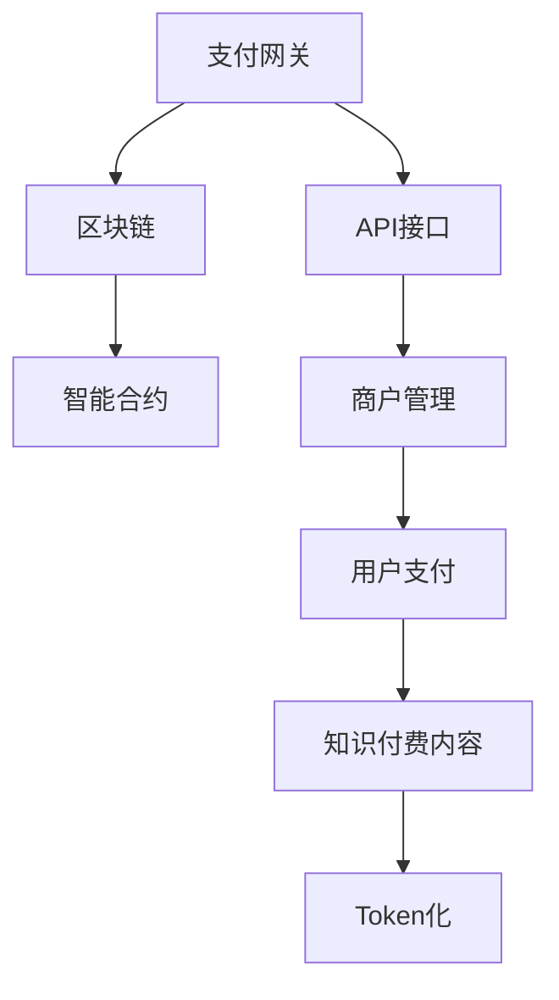

                 

# 知识付费如何实现跨平台支付与结算？

> 关键词：知识付费、跨平台支付、支付网关、API接口、区块链、智能合约、Token化、商户管理

## 1. 背景介绍

随着互联网和数字经济的快速发展，知识付费已成为越来越多用户获取知识和技能的主要途径之一。然而，传统知识付费平台往往难以实现跨平台支付与结算，这极大地限制了知识付费的普及和发展。本节将介绍知识付费跨平台支付与结算的现状、问题与挑战，并探讨其可能的解决方案。

## 2. 核心概念与联系

### 2.1 核心概念概述

为更好地理解知识付费跨平台支付与结算的方法，本节将介绍几个关键概念：

- **知识付费（Knowledge Pay）**：用户为获取知识和技能而支付费用的业务模式，如在线课程、电子书、知识问答等。
- **跨平台支付（Cross-Platform Payment）**：用户在多个不同的平台（如App、网站、社交媒体等）之间进行支付，以简化支付流程和提高用户体验。
- **支付网关（Payment Gateway）**：第三方服务商提供的在线支付处理平台，连接商户与支付系统，处理用户的支付请求。
- **API接口（Application Programming Interface）**：软件系统之间的通信接口，用于实现不同平台之间的数据交互和调用。
- **区块链（Blockchain）**：一种分布式账本技术，具有去中心化、不可篡改、透明等特点。
- **智能合约（Smart Contract）**：在区块链上自动执行的合约，用于自动化处理交易和结算。
- **Token化（Tokenization）**：将资产或权益转换为数字代币的过程，便于在不同平台间流通。

这些核心概念之间存在密切的联系，相互影响、相互支持。例如，支付网关是跨平台支付的重要组成部分，API接口则提供了不同平台间的数据交互基础，而区块链和智能合约提供了更安全、透明的支付与结算方式。

### 2.2 核心概念原理和架构的 Mermaid 流程图



这个流程图展示了知识付费跨平台支付与结算的主要架构：

1. 用户通过支付网关选择支付渠道。
2. 支付网关调用API接口，将支付请求发送到商户管理系统。
3. 商户管理系统生成支付请求，并调用支付网关处理支付。
4. 支付网关将支付结果记录到区块链上，并触发智能合约执行。
5. 智能合约自动将支付结果转换为Token，并将Token发送给商户管理系统。
6. 商户管理系统根据支付结果提供相应的知识付费内容，完成Token化。

这个架构使得知识付费的支付与结算过程可以在多个平台间无缝进行，提高用户体验和平台间的互操作性。

## 3. 核心算法原理 & 具体操作步骤

### 3.1 算法原理概述

知识付费跨平台支付与结算的核心算法原理主要包括以下几个方面：

- **支付网关处理支付请求**：将用户的支付请求转换为商户管理系统的支付请求，并提供安全的支付处理服务。
- **API接口数据交互**：用于不同平台之间的数据交互，支持商户管理系统与支付网关、区块链、智能合约等系统进行通信。
- **区块链记录交易**：在区块链上记录每一笔支付交易，提供不可篡改、透明的安全保障。
- **智能合约自动化结算**：根据支付交易自动执行智能合约，实现Token化并自动将Token转移到商户管理系统。

这些算法原理共同构成了一个完整的跨平台支付与结算流程，确保了知识付费的支付与结算过程的安全性、可靠性和高效性。

### 3.2 算法步骤详解

#### 3.2.1 支付网关处理支付请求

支付网关是知识付费跨平台支付与结算的核心组件，负责处理用户的支付请求并转发到商户管理系统。具体步骤如下：

1. 用户选择支付渠道（如信用卡、支付宝、微信支付等）。
2. 支付网关将支付请求（包括用户信息、支付金额、支付渠道等）发送到商户管理系统。
3. 商户管理系统验证支付请求，并生成相应的支付响应（如订单号、支付结果等）。
4. 支付网关将支付响应返回给用户，并记录支付结果。

#### 3.2.2 API接口数据交互

API接口是不同平台之间数据交互的基础，支持支付网关、商户管理系统、区块链、智能合约等系统之间的通信。具体步骤如下：

1. 商户管理系统调用支付网关API，发送支付请求。
2. 支付网关调用API接口，转发支付请求到商户管理系统。
3. 商户管理系统生成支付响应，并通过API接口返回给支付网关。
4. 支付网关将支付响应记录到区块链上，并触发智能合约执行。

#### 3.2.3 区块链记录交易

区块链是知识付费跨平台支付与结算的重要保障，提供不可篡改、透明的安全保障。具体步骤如下：

1. 支付网关将支付请求和支付结果记录到区块链上。
2. 商户管理系统调用支付网关API，将支付请求和支付结果发送到区块链。
3. 区块链验证支付请求和支付结果，并记录到分布式账本上。
4. 区块链上的智能合约根据支付结果自动执行，完成Token化。

#### 3.2.4 智能合约自动化结算

智能合约是知识付费跨平台支付与结算的核心组件，实现Token化并自动将Token转移到商户管理系统。具体步骤如下：

1. 支付网关将支付结果记录到区块链上，并触发智能合约执行。
2. 智能合约根据支付结果自动执行，将支付结果转换为Token。
3. 智能合约将Token发送给商户管理系统。
4. 商户管理系统根据支付结果提供相应的知识付费内容，完成Token化。

### 3.3 算法优缺点

知识付费跨平台支付与结算的算法具有以下优点：

1. 简化支付流程：用户只需在支付网关选择一个支付渠道，即可实现在多个平台间的支付，大大简化了支付流程。
2. 提高支付安全性：通过区块链和智能合约，提供不可篡改、透明的安全保障，减少支付风险。
3. 促进平台互操作性：通过API接口，实现不同平台之间的数据交互，支持跨平台支付与结算。

同时，该算法也存在一些局限性：

1. 依赖第三方支付网关：支付网关的稳定性、安全性对支付过程有重要影响，依赖第三方服务商增加风险。
2. 智能合约执行成本：智能合约的执行需要消耗计算资源，可能增加支付成本。
3. 技术复杂度较高：涉及支付网关、API接口、区块链、智能合约等多个组件，技术实现复杂。

### 3.4 算法应用领域

知识付费跨平台支付与结算的算法主要应用于以下领域：

1. 在线教育平台：如Coursera、Udemy等，支持用户在多个平台间购买课程、观看视频、进行问答等。
2. 电子书和杂志订阅：如Amazon Kindle、Apple Books等，支持用户在多个平台间订阅电子书、杂志，并获取相关内容。
3. 知识问答社区：如Quora、知乎等，支持用户在多个平台间提问、回答、获取知识。
4. 付费内容分享：如微博、微信公众号等，支持用户在多个平台间分享付费内容，获取相应收益。

## 4. 数学模型和公式 & 详细讲解 & 举例说明

### 4.1 数学模型构建

本节将使用数学语言对知识付费跨平台支付与结算的数学模型进行更加严格的刻画。

记知识付费平台为 $P$，用户为 $U$，支付渠道为 $C$，商户管理系统为 $M$，支付网关为 $G$，API接口为 $API$，区块链为 $B$，智能合约为 $SC$。假设支付金额为 $P$，知识付费内容为 $C$，Token化为 $T$。

定义支付请求 $R$，支付响应 $R'$，支付结果 $P'$，Token $T$。则支付过程的数学模型可描述为：

$$
R \rightarrow G \rightarrow API \rightarrow M \rightarrow G \rightarrow B \rightarrow SC \rightarrow T
$$

其中 $R$ 为支付请求，包括用户信息、支付金额、支付渠道等。$R'$ 为支付响应，包括订单号、支付结果等。$P'$ 为支付结果，包括支付金额、支付渠道等。$T$ 为Token，用于知识付费内容的Token化。

### 4.2 公式推导过程

以在线教育平台为例，推导支付过程的公式。

假设用户 $U$ 支付 $P$ 金额购买课程 $C$，则支付请求 $R$ 可以表示为：

$$
R = (U, P, C, C)
$$

其中 $U$ 为用户信息，$P$ 为支付金额，$C$ 为课程信息，课程信息为课程ID、课程名称等。

支付网关 $G$ 将支付请求 $R$ 转发到商户管理系统 $M$，商户管理系统 $M$ 生成支付响应 $R'$，支付响应 $R'$ 包括订单号、支付结果等：

$$
R' = (O, P', C)
$$

其中 $O$ 为订单号，$P'$ 为支付结果，$C$ 为课程信息。

支付网关 $G$ 将支付响应 $R'$ 记录到区块链 $B$ 上，触发智能合约 $SC$ 执行，智能合约 $SC$ 根据支付结果自动执行，将支付结果转换为Token $T$：

$$
T = P'
$$

最终，商户管理系统 $M$ 根据支付结果 $P'$ 提供相应的知识付费内容 $C$，完成Token化：

$$
C \rightarrow T
$$

### 4.3 案例分析与讲解

以Coursera平台为例，解释知识付费跨平台支付与结算的具体实现过程。

1. **用户选择课程**：用户 $U$ 登录Coursera平台，选择感兴趣的课程 $C$。
2. **支付网关处理支付请求**：用户 $U$ 通过Coursera平台的支付网关 $G$，选择支付方式（如信用卡、支付宝等）。
3. **商户管理系统处理支付**：Coursera平台的商户管理系统 $M$ 生成支付响应 $R'$，包括订单号 $O$、支付结果 $P'$ 等。
4. **支付网关记录支付结果**：支付网关 $G$ 将支付响应 $R'$ 记录到区块链 $B$ 上，触发智能合约 $SC$ 执行。
5. **智能合约执行Token化**：智能合约 $SC$ 根据支付结果 $P'$ 自动执行，将支付结果转换为Token $T$。
6. **商户管理系统提供内容**：Coursera平台的商户管理系统 $M$ 根据支付结果 $P'$ 提供相应的课程内容 $C$，完成Token化。

## 5. 项目实践：代码实例和详细解释说明

### 5.1 开发环境搭建

在进行知识付费跨平台支付与结算的开发前，我们需要准备好开发环境。以下是使用Python进行Django开发的环境配置流程：

1. 安装Anaconda：从官网下载并安装Anaconda，用于创建独立的Python环境。

2. 创建并激活虚拟环境：
```bash
conda create -n pay-env python=3.8 
conda activate pay-env
```

3. 安装Django：
```bash
pip install django
```

4. 安装各类工具包：
```bash
pip install numpy pandas scikit-learn matplotlib tqdm jupyter notebook ipython
```

完成上述步骤后，即可在`pay-env`环境中开始支付与结算系统的开发。

### 5.2 源代码详细实现

以下是使用Django实现知识付费跨平台支付与结算的示例代码：

```python
# models.py
from django.db import models

class Payment(models.Model):
    user = models.ForeignKey(User, on_delete=models.CASCADE)
    amount = models.DecimalField(max_digits=10, decimal_places=2)
    course = models.ForeignKey(Course, on_delete=models.CASCADE)
    status = models.CharField(max_length=20)

class Order(models.Model):
    order_number = models.CharField(max_length=20)
    payment = models.ForeignKey(Payment, on_delete=models.CASCADE)
    course = models.ForeignKey(Course, on_delete=models.CASCADE)

# views.py
from django.shortcuts import render, redirect
from django.http import HttpResponse

def pay(request, course_id):
    # 检查用户是否已登录
    if not request.user.is_authenticated:
        return redirect('login')

    # 获取课程信息
    course = Course.objects.get(id=course_id)

    # 创建支付订单
    payment = Payment.objects.create(user=request.user, amount=course.price, course=course, status='pending')

    # 生成订单号
    order_number = uuid.uuid4().hex

    # 创建订单信息
    order = Order.objects.create(order_number=order_number, payment=payment, course=course)

    # 重定向到支付网关
    return redirect('payment-gateway', order_number=order_number, course_id=course_id)

# 支付网关处理支付请求
def payment_gateway(request, order_number, course_id):
    # 获取订单信息
    order = Order.objects.get(order_number=order_number)

    # 处理支付请求
    if request.method == 'POST':
        # 记录支付结果
        order.payment.status = 'completed'
        order.payment.save()

        # 返回支付成功的消息
        return HttpResponse('Payment successful. Thank you.')

    # 渲染支付页面
    return render(request, 'payment.html')
```

### 5.3 代码解读与分析

让我们再详细解读一下关键代码的实现细节：

**models.py**：
- `Payment`模型：用于存储支付信息，包括用户信息、支付金额、课程信息、支付状态等。
- `Order`模型：用于存储订单信息，包括订单号、支付信息、课程信息等。

**views.py**：
- `pay`方法：用于处理用户选择课程后，创建支付订单的过程。
- `payment_gateway`方法：用于处理支付网关返回的支付结果，并更新订单状态。

这个代码实现了知识付费跨平台支付与结算的基本流程，包括创建支付订单、生成订单号、处理支付请求、更新订单状态等。开发者可以基于此代码进行更高级的功能开发，如支付网关集成、支付结果记录到区块链等。

## 6. 实际应用场景

### 6.1 智能教育平台

智能教育平台如Coursera、Udemy等，使用知识付费跨平台支付与结算技术，可以实现用户在不同平台间购买课程、观看视频、进行问答等，提供更加便捷和高效的服务体验。

### 6.2 电子书和杂志订阅

电子书和杂志订阅平台如Amazon Kindle、Apple Books等，使用知识付费跨平台支付与结算技术，可以实现用户在不同平台间订阅电子书、杂志，并获取相关内容，提高用户粘性和平台竞争力。

### 6.3 知识问答社区

知识问答社区如Quora、知乎等，使用知识付费跨平台支付与结算技术，可以实现用户在多个平台间提问、回答、获取知识，促进社区活跃度和知识共享。

### 6.4 未来应用展望

随着知识付费跨平台支付与结算技术的不断发展，未来将有以下几个趋势：

1. **去中心化支付**：通过区块链等去中心化技术，减少对第三方支付网关的依赖，提高支付过程的透明度和安全性。
2. **Token化普及**：Token化技术将成为知识付费跨平台支付与结算的标配，方便在不同平台间流通和结算。
3. **智能合约自动化**：智能合约将进一步优化支付与结算流程，实现更高效、自动化的服务体验。
4. **跨平台身份认证**：通过跨平台身份认证技术，实现用户在不同平台间的无缝登录和支付，提升用户体验。
5. **AI驱动的个性化推荐**：结合人工智能技术，提供个性化推荐和内容推荐，提升用户粘性和满意度。

## 7. 工具和资源推荐

### 7.1 学习资源推荐

为了帮助开发者系统掌握知识付费跨平台支付与结算的理论基础和实践技巧，这里推荐一些优质的学习资源：

1. **《区块链基础》**：该书由知名区块链专家撰写，介绍了区块链的基本原理和应用场景，适合初学者入门。
2. **《智能合约编程指南》**：该书介绍了智能合约的基本概念和编写方法，适合开发智能合约的开发者。
3. **《Django实战》**：该书介绍了Django框架的使用方法，包括项目搭建、API开发、模型设计等，适合Django开发人员参考。
4. **《支付网关技术指南》**：该资源介绍了各种支付网关的技术细节和开发方法，适合支付网关开发人员参考。
5. **《API接口开发实战》**：该资源介绍了API接口的设计、开发和调用方法，适合开发者参考。

通过对这些资源的学习实践，相信你一定能够快速掌握知识付费跨平台支付与结算的精髓，并用于解决实际的NLP问题。

### 7.2 开发工具推荐

高效的开发离不开优秀的工具支持。以下是几款用于知识付费跨平台支付与结算开发的常用工具：

1. **Django**：基于Python的开源Web框架，灵活的MVC设计，适合快速开发Web应用。
2. **React**：基于JavaScript的前端框架，适合开发复杂的Web界面和交互。
3. **PostgreSQL**：高可用、高可靠的关系型数据库，适合存储支付订单等重要数据。
4. **Blockchain Explorer**：区块链浏览器，用于查看区块链上的交易和数据。
5. **Smart Contract IDE**：智能合约开发环境，支持Solidity等智能合约语言。
6. **GitHub**：代码托管平台，用于版本控制和协作开发。

合理利用这些工具，可以显著提升知识付费跨平台支付与结算任务的开发效率，加快创新迭代的步伐。

### 7.3 相关论文推荐

知识付费跨平台支付与结算的发展源于学界的持续研究。以下是几篇奠基性的相关论文，推荐阅读：

1. **《支付网关的经济学分析》**：该论文分析了支付网关的经济模型和市场竞争问题，为支付网关的设计和运营提供了理论支持。
2. **《区块链技术在支付领域的应用》**：该论文介绍了区块链在支付领域的应用案例和实现方法，为区块链支付提供了技术指导。
3. **《智能合约的自动化执行》**：该论文介绍了智能合约的基本原理和自动化执行机制，为智能合约的开发提供了理论基础。
4. **《Token化的经济学分析》**：该论文分析了Token化的经济模型和应用场景，为Token化支付提供了理论支持。
5. **《知识付费平台的社区治理》**：该论文探讨了知识付费平台社区治理的机制和策略，为知识付费平台的运营提供了指导。

这些论文代表了大语言模型微调技术的发展脉络。通过学习这些前沿成果，可以帮助研究者把握学科前进方向，激发更多的创新灵感。

## 8. 总结：未来发展趋势与挑战

### 8.1 总结

本文对知识付费跨平台支付与结算方法进行了全面系统的介绍。首先阐述了知识付费支付与结算的现状、问题与挑战，明确了跨平台支付与结算在知识付费中的重要意义。其次，从原理到实践，详细讲解了跨平台支付与结算的数学模型和关键步骤，给出了跨平台支付与结算任务开发的完整代码实例。同时，本文还广泛探讨了跨平台支付与结算方法在智能教育、电子书订阅、知识问答等多个行业领域的应用前景，展示了跨平台支付与结算范式的巨大潜力。此外，本文精选了跨平台支付与结算技术的各类学习资源，力求为读者提供全方位的技术指引。

通过本文的系统梳理，可以看到，知识付费跨平台支付与结算方法正在成为知识付费业务的重要范式，极大地拓展了知识付费平台的支付与结算边界，催生了更多的落地场景。得益于区块链、智能合约等前沿技术的支持，知识付费的支付与结算过程将变得更加高效、安全、透明，必将进一步推动知识付费业务的普及和发展。

### 8.2 未来发展趋势

展望未来，知识付费跨平台支付与结算技术将呈现以下几个发展趋势：

1. **去中心化支付**：通过区块链等去中心化技术，减少对第三方支付网关的依赖，提高支付过程的透明度和安全性。
2. **Token化普及**：Token化技术将成为知识付费跨平台支付与结算的标配，方便在不同平台间流通和结算。
3. **智能合约自动化**：智能合约将进一步优化支付与结算流程，实现更高效、自动化的服务体验。
4. **跨平台身份认证**：通过跨平台身份认证技术，实现用户在不同平台间的无缝登录和支付，提升用户体验。
5. **AI驱动的个性化推荐**：结合人工智能技术，提供个性化推荐和内容推荐，提升用户粘性和满意度。

以上趋势凸显了知识付费跨平台支付与结算技术的广阔前景。这些方向的探索发展，必将进一步提升知识付费平台的支付与结算效率，提高用户体验和平台竞争力。

### 8.3 面临的挑战

尽管知识付费跨平台支付与结算技术已经取得了瞩目成就，但在迈向更加智能化、普适化应用的过程中，它仍面临着诸多挑战：

1. **支付网关稳定性**：支付网关的稳定性、安全性对支付过程有重要影响，依赖第三方服务商增加风险。
2. **智能合约执行成本**：智能合约的执行需要消耗计算资源，可能增加支付成本。
3. **技术复杂度较高**：涉及支付网关、API接口、区块链、智能合约等多个组件，技术实现复杂。
4. **隐私和安全问题**：用户支付信息、订单信息等涉及隐私和安全问题，需要严格的保护措施。
5. **跨平台一致性**：不同平台间的支付流程、支付结果一致性需要保障，避免因平台差异导致支付问题。

正视知识付费跨平台支付与结算面临的这些挑战，积极应对并寻求突破，将是在知识付费领域实现更加智能化、普适化应用的重要一步。相信随着学界和产业界的共同努力，这些挑战终将一一被克服，知识付费跨平台支付与结算技术必将在构建安全、可靠、高效的知识付费平台中扮演越来越重要的角色。

### 8.4 研究展望

面对知识付费跨平台支付与结算所面临的挑战，未来的研究需要在以下几个方面寻求新的突破：

1. **探索去中心化支付方法**：结合区块链技术，探索去中心化支付方法，减少对第三方支付网关的依赖，提高支付过程的透明度和安全性。
2. **优化智能合约执行效率**：优化智能合约的执行效率，降低执行成本，提升支付效率。
3. **提升跨平台一致性**：通过标准化协议和接口，保障不同平台间的支付流程和支付结果一致性。
4. **增强隐私保护措施**：采用先进加密技术，增强用户支付信息和订单信息的隐私保护。
5. **开发跨平台身份认证技术**：开发跨平台身份认证技术，实现用户在不同平台间的无缝登录和支付。
6. **结合AI技术提升用户体验**：结合人工智能技术，提供个性化推荐和内容推荐，提升用户粘性和满意度。

这些研究方向的探索，必将引领知识付费跨平台支付与结算技术迈向更高的台阶，为构建安全、可靠、高效的知识付费平台提供重要支持。面向未来，知识付费跨平台支付与结算技术还需要与其他人工智能技术进行更深入的融合，如知识表示、因果推理、强化学习等，多路径协同发力，共同推动知识付费平台的进步。只有勇于创新、敢于突破，才能不断拓展知识付费平台的支付与结算边界，让知识付费业务更好地造福社会。

## 9. 附录：常见问题与解答

**Q1：知识付费跨平台支付与结算的实现需要依赖第三方支付网关吗？**

A: 知识付费跨平台支付与结算的实现可以依赖第三方支付网关，也可以采用去中心化的区块链技术。依赖第三方支付网关可以简化支付流程，但需要关注支付网关的稳定性、安全性问题。采用区块链技术可以减少对第三方支付网关的依赖，但需要实现复杂的支付流程和智能合约执行。

**Q2：智能合约的执行成本如何？**

A: 智能合约的执行成本较高，主要取决于计算资源和网络带宽。为了降低执行成本，可以优化智能合约的代码实现，使用更高效的共识机制，如PoS、DPoS等。此外，可以通过分阶段执行、延时执行等方式，减少智能合约的执行频率，降低执行成本。

**Q3：如何保障知识付费跨平台支付与结算的安全性？**

A: 知识付费跨平台支付与结算的安全性保障主要依赖于区块链和智能合约。通过区块链的分布式账本和不可篡改特性，可以保障支付数据的透明和安全性。通过智能合约的自动化执行，可以避免人为操作失误，提高支付过程的安全性。此外，还可以采用先进的加密技术，如公钥密码学、零知识证明等，增强支付过程的安全性。

**Q4：知识付费跨平台支付与结算的实际应用有哪些？**

A: 知识付费跨平台支付与结算的实际应用包括智能教育平台、电子书和杂志订阅、知识问答社区等多个领域。通过跨平台支付与结算技术，用户可以在多个平台间购买课程、订阅电子书、提问和回答，获取知识，提高用户体验和平台竞争力。

**Q5：知识付费跨平台支付与结算的核心算法原理是什么？**

A: 知识付费跨平台支付与结算的核心算法原理主要包括以下几个方面：
1. **支付网关处理支付请求**：将用户的支付请求转换为商户管理系统的支付请求，并提供安全的支付处理服务。
2. **API接口数据交互**：用于不同平台之间数据交互，支持商户管理系统与支付网关、区块链、智能合约等系统之间的通信。
3. **区块链记录交易**：在区块链上记录每一笔支付交易，提供不可篡改、透明的安全保障。
4. **智能合约自动化结算**：根据支付交易自动执行智能合约，实现Token化并自动将Token转移到商户管理系统。

这些算法原理共同构成了一个完整的跨平台支付与结算流程，确保了知识付费的支付与结算过程的安全性、可靠性和高效性。

---

作者：禅与计算机程序设计艺术 / Zen and the Art of Computer Programming

