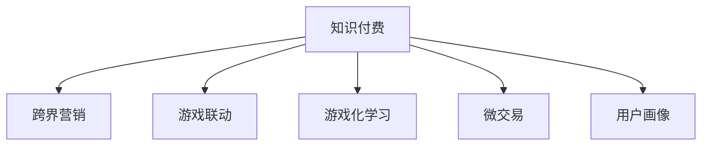

                 

# 知识付费如何实现跨界营销与游戏联动？

## 1. 背景介绍

### 1.1 问题由来
随着知识付费和在线教育市场的发展，如何扩大市场规模、提升用户黏性，成为内容提供商和平台亟需解决的难题。与此同时，近年来游戏行业在数字内容领域的活跃度不断提升，用户对游戏内容的多样化、个性化需求愈发强烈。为了满足市场多元化的需求，游戏与知识付费的融合，成为一种趋势和可能。

### 1.2 问题核心关键点
知识付费与游戏联动的核心在于：
- **融合渠道**：如何将知识付费内容与游戏化互动结合起来，提高用户的学习效率和参与度。
- **用户画像**：如何通过游戏联动提升用户画像，实现精准营销。
- **收益模式**：如何在知识付费和游戏中设计合理的收益模式，实现商业共赢。
- **技术和内容创新**：利用新技术、新内容形式，提高用户体验和平台价值。

## 2. 核心概念与联系

### 2.1 核心概念概述

为更好地理解知识付费与游戏联动的实现机制，本节将介绍几个密切相关的核心概念：

- **知识付费**：通过在线平台付费获取各类教育、咨询、工具、知识等信息的商业模式。
- **跨界营销**：不同领域的企业通过跨界合作，实现资源互补、用户共享、市场拓展的目的。
- **游戏联动**：利用游戏的互动性、趣味性等特点，将知识付费内容嵌入游戏场景中，提升用户体验和内容传播。
- **游戏化学习**：通过游戏机制和元素，使学习过程变得更加有趣、有挑战性。
- **微交易**：游戏内的小额付费模式，用户通过购买虚拟道具、装备等进行互动和进步。
- **用户画像**：基于用户行为数据构建的用户特征模型，用于个性化推荐和精准营销。

这些核心概念之间的逻辑关系可以通过以下Mermaid流程图来展示：



这个流程图展示出知识付费内容通过跨界营销和游戏联动，结合游戏化学习和微交易机制，借助用户画像进行精准营销的全过程。

## 3. 核心算法原理 & 具体操作步骤
### 3.1 算法原理概述

知识付费与游戏联动的核心在于利用游戏元素和机制，提升知识内容的吸引力和用户体验。具体来说，就是将知识内容嵌入游戏中，用户通过完成游戏任务、获得虚拟奖励等方式，学习新知识或解锁内容，从而实现知识传播和商业变现。

这一过程包含以下几个步骤：
1. **内容选择与定制**：选择适合嵌入游戏的知识内容，设计互动性强的游戏机制和任务。
2. **游戏嵌入**：将知识内容以游戏任务、关卡、积分、奖励等形式嵌入游戏中。
3. **用户激励**：通过虚拟奖励、勋章、排名等激励机制，激发用户的学习动力和参与感。
4. **数据分析**：收集用户行为数据，分析学习效果和参与度，调整游戏机制和内容。

### 3.2 算法步骤详解

**Step 1: 内容选择与定制**
- 选择适合嵌入游戏的知识内容。通常选择具有实用价值、趣味性强的学科或技能，如编程、外语、心理学等。
- 设计互动性强的游戏机制。如解谜、角色扮演、竞速等，确保用户在游戏过程中主动探索知识。

**Step 2: 游戏嵌入**
- 将知识内容以游戏任务、关卡、积分、奖励等形式嵌入游戏中。如通过完成编程任务获得编程技能，通过解谜游戏解锁心理学知识等。
- 开发适合知识内容的游戏界面和互动逻辑，确保用户体验。

**Step 3: 用户激励**
- 通过虚拟奖励、勋章、排名等激励机制，激发用户的学习动力和参与感。如解锁新课程、获得成就徽章等。
- 设置合理的积分和奖励体系，确保用户有足够的动力参与互动。

**Step 4: 数据分析**
- 收集用户行为数据，如任务完成率、积分获得量、学习时长等。
- 分析用户的学习效果和参与度，评估游戏机制和内容的有效性。
- 根据分析结果调整游戏机制和内容，提升用户体验和学习效果。

### 3.3 算法优缺点

知识付费与游戏联动的优点在于：
1. **提升用户体验**：通过游戏机制和元素，提升知识内容的吸引力和趣味性，使用户更愿意参与互动和反馈。
2. **提高用户黏性**：游戏联动能够持续激发用户的学习兴趣和参与感，增加用户黏性和活跃度。
3. **扩大市场规模**：跨界营销和微交易机制，有助于吸引新用户和扩大市场规模。

同时，该方法也存在一些局限性：
1. **开发成本高**：设计和开发适合知识内容的游戏机制和界面，需要投入大量资源和时间。
2. **内容与游戏匹配难度大**：不是所有知识内容都适合嵌入游戏中，需要精心设计。
3. **收益模式复杂**：如何平衡知识传播和商业变现，设计合理的微交易和广告模式，需要持续探索。
4. **用户需求多变**：用户对知识和游戏的需求不断变化，需要持续更新和迭代游戏内容。

尽管存在这些局限性，但就目前而言，知识付费与游戏联动的模式已在一些平台和项目中取得初步成功，展示了其巨大的潜力。

### 3.4 算法应用领域

知识付费与游戏联动在多个领域已展现出广泛的应用前景：

- **教育培训**：利用游戏元素提升编程、外语、心理学等学科的学习兴趣，如Khan Academy等平台。
- **技能培训**：通过游戏化方式提升职业技能培训效果，如SimCity等平台。
- **企业培训**：将企业内部培训内容嵌入游戏中，提升员工参与度和培训效果。
- **心理健康**：利用游戏化方式缓解心理压力，提升心理健康水平。
- **健康管理**：通过游戏化的运动和饮食指导，提升用户健康管理意识和效果。
- **旅游导览**：结合地理知识和文化背景，提供有趣的旅游体验。

除了这些传统领域，知识付费与游戏联动还有诸多创新应用场景，如智能家居、虚拟现实、文化传承等，为不同领域带来全新的用户体验和价值。

## 4. 数学模型和公式 & 详细讲解  
### 4.1 数学模型构建

本节将使用数学语言对知识付费与游戏联动的数学模型进行描述。

假设知识内容为 $K$，游戏任务为 $G$，用户为 $U$，知识付费平台为 $P$。知识付费与游戏联动过程可以用以下模型描述：

1. **知识嵌入模型**：将知识内容 $K$ 嵌入游戏任务 $G$，得到嵌入后的知识内容 $K^G$。
2. **用户激励模型**：设计用户激励机制 $M$，用户完成游戏任务获得激励 $I$。
3. **数据分析模型**：收集用户行为数据 $D$，分析学习效果和参与度 $E$。

形式化地，知识嵌入模型的数学表达式为：

$$
K^G = \mathcal{E}(K,G)
$$

用户激励模型的数学表达式为：

$$
I = \mathcal{M}(G)
$$

数据分析模型的数学表达式为：

$$
E = \mathcal{A}(D)
$$

其中 $\mathcal{E}$、$\mathcal{M}$、$\mathcal{A}$ 分别为知识嵌入、用户激励和数据分析函数。

### 4.2 公式推导过程

以下以一个简单的游戏化学习系统为例，推导知识嵌入和用户激励的数学模型。

**知识嵌入模型**：
- 假设知识内容 $K$ 为编程语言 $C$，游戏任务 $G$ 为编写程序代码。
- 知识嵌入函数 $\mathcal{E}$ 将编程语言 $C$ 嵌入到编写代码任务中，生成嵌入后的知识内容 $K^G$。

知识嵌入的具体实现可以是将编程任务设计为编写指定功能的代码，用户编写代码获得编程语言的知识点。

**用户激励模型**：
- 用户完成编写代码任务，获得编程语言知识点。
- 设计成就徽章 $A$ 作为用户激励，激励机制 $M$ 将完成编程任务与成就徽章 $A$ 关联。

激励机制的具体实现可以是，用户编写代码达到一定水平，获得成就徽章 $A$，激励用户继续学习编程知识。

### 4.3 案例分析与讲解

以Coursera平台为例，分析其知识付费与游戏联动的实践。

Coursera通过与游戏公司Unity的合作，将编程课程内容嵌入Unity游戏《CodeCombat》中。用户在游戏中通过编写代码，完成编程任务，获得编程语言的知识点。完成特定任务后，系统还会发放成就徽章和虚拟金币作为奖励。

用户激励方面，系统设计了成就徽章和虚拟金币的激励机制。用户完成编程任务后，可以获得徽章和金币奖励，金币可在平台内进行虚拟消费，购买更多课程和内容。

数据分析方面，Coursera通过收集用户的行为数据，分析学习效果和参与度，发现游戏化学习能够显著提升用户的课程完成率和满意度。系统根据分析结果，调整游戏任务和激励机制，进一步优化学习效果。

## 5. 项目实践：代码实例和详细解释说明
### 5.1 开发环境搭建

在进行知识付费与游戏联动项目开发前，我们需要准备好开发环境。以下是使用Python进行Flask开发的环境配置流程：

1. 安装Anaconda：从官网下载并安装Anaconda，用于创建独立的Python环境。

2. 创建并激活虚拟环境：
```bash
conda create -n game-learning python=3.8 
conda activate game-learning
```

3. 安装Flask：
```bash
pip install flask
```

4. 安装需要的Python库：
```bash
pip install numpy pandas matplotlib scipy scikit-learn nltk
```

完成上述步骤后，即可在`game-learning`环境中开始项目开发。

### 5.2 源代码详细实现

下面我们以一个简单的知识付费与游戏联动系统为例，给出使用Flask进行项目开发的PyTorch代码实现。

首先，定义游戏任务的API接口：

```python
from flask import Flask, request, jsonify

app = Flask(__name__)

@app.route('/task', methods=['POST'])
def task():
    data = request.json
    task_id = data['task_id']
    user_id = data['user_id']
    knowledge = data['knowledge']
    
    # 调用知识嵌入函数，生成嵌入后的知识内容
    embedded_knowledge = embed_knowledge(task_id, knowledge)
    
    # 调用用户激励函数，发放成就徽章和虚拟金币
    award = award_user(user_id, task_id, embedded_knowledge)
    
    return jsonify({'award': award})

@app.route('/learn', methods=['POST'])
def learn():
    data = request.json
    user_id = data['user_id']
    task_id = data['task_id']
    
    # 调用学习效果分析函数，评估学习效果
    effect = analyze_learning(user_id, task_id)
    
    return jsonify({'effect': effect})
```

然后，定义知识嵌入和用户激励的函数：

```python
from torch import nn, optim
import torch.nn.functional as F

class EmbeddingModel(nn.Module):
    def __init__(self):
        super(EmbeddingModel, self).__init__()
        self.embedding = nn.Embedding(knowledge_size, embedding_size)
        self.fc = nn.Linear(embedding_size, task_size)
    
    def forward(self, x):
        x = self.embedding(x)
        x = F.relu(x)
        x = self.fc(x)
        return x

embed_knowledge = EmbeddingModel()

def award_user(user_id, task_id, knowledge):
    # 调用激励机制函数，发放成就徽章和虚拟金币
    # 实现细节略，根据具体需求进行设计
    
    return award
```

最后，启动Flask服务器：

```python
if __name__ == '__main__':
    app.run(debug=True)
```

以上是一个简化的知识付费与游戏联动系统的代码实现。可以看到，通过Flask框架和PyTorch模型，我们能够快速实现知识嵌入和用户激励的功能。

### 5.3 代码解读与分析

让我们再详细解读一下关键代码的实现细节：

**Flask API接口**：
- `/task`接口：接收用户提交的任务ID、用户ID和知识点，调用知识嵌入函数生成嵌入后的知识点，并调用用户激励函数发放成就徽章和虚拟金币。
- `/learn`接口：接收用户提交的用户ID和任务ID，调用学习效果分析函数评估学习效果。

**知识嵌入模型**：
- `EmbeddingModel`类：定义了一个简单的神经网络模型，包括嵌入层和全连接层。输入为知识点的编码，输出为嵌入后的知识点。
- `embed_knowledge`函数：将知识点输入嵌入模型，生成嵌入后的知识点。

**用户激励机制**：
- `award_user`函数：根据用户完成任务的情况，调用激励机制函数发放成就徽章和虚拟金币。具体实现细节依赖于具体应用场景和需求，如需要在系统中集成Unity游戏，需要调用Unity API实现成就徽章的生成和发放。

以上代码实现仅是一个基础框架，实际应用中还需要考虑更多的细节和优化，如数据的存储和管理、系统的负载均衡、性能优化等。

## 6. 实际应用场景
### 6.1 教育培训

知识付费与游戏联动在教育培训领域具有广泛的应用前景。通过将知识内容嵌入游戏中，学生可以更主动地学习和探索知识，提高学习效果。

具体而言，可以在编程、外语、数学等学科中嵌入游戏任务，让学生通过编写代码、解谜等方式掌握知识点。游戏任务的完成情况和成就徽章，可以激励学生继续学习。

### 6.2 企业培训

企业培训中，将知识内容嵌入游戏中，可以提升员工的学习兴趣和参与度。通过设计有趣的互动任务，员工可以更有效地掌握新技能。

例如，通过编写代码任务、模拟业务场景等方式，将企业内部培训内容嵌入游戏中，员工在完成任务的过程中学习新知识，并获得成就徽章和虚拟金币作为奖励。

### 6.3 心理健康

心理健康应用中，知识付费与游戏联动可以提升心理健康水平的诊断和干预效果。通过设计有趣的心理测试游戏，帮助用户了解心理健康状态，并提供心理辅导建议。

例如，设计心理测试游戏，用户在完成测试任务后，获得心理健康评估报告和心理咨询建议，激励用户继续参与心理健康学习。

### 6.4 健康管理

健康管理应用中，知识付费与游戏联动可以提高用户健康管理的意识和效果。通过设计有趣的运动和饮食指导游戏，用户可以更积极地参与健康管理。

例如，设计运动指导游戏，用户在完成运动任务后，获得健康报告和运动建议，激励用户继续参与健康管理。

### 6.5 旅游导览

旅游导览应用中，知识付费与游戏联动可以提升用户对目的地的了解和体验。通过设计有趣的文化背景和地理知识游戏，用户可以更全面地了解目的地，并规划旅游路线。

例如，设计地理知识游戏，用户在完成地理任务后，获得目的地的文化背景和旅游建议，激励用户继续参与旅游学习。

### 6.6 未来应用展望

随着知识付费与游戏联动技术的不断发展，未来在游戏和教育、心理健康、健康管理、旅游导览等多个领域，将有更多创新应用场景。

在智慧城市治理中，知识付费与游戏联动可以用于城市事件监测、舆情分析、应急指挥等环节，提高城市管理的自动化和智能化水平。

在金融领域，知识付费与游戏联动可以用于金融教育、风险管理等场景，提升用户对金融知识的理解和应用能力。

在军事领域，知识付费与游戏联动可以用于军事训练、情报分析等场景，提升军事人员的综合素质和能力。

## 7. 工具和资源推荐
### 7.1 学习资源推荐

为了帮助开发者系统掌握知识付费与游戏联动的理论基础和实践技巧，这里推荐一些优质的学习资源：

1. 《游戏化学习设计与实践》系列博文：由游戏化学习专家撰写，深入浅出地介绍了游戏化学习的原理、方法和案例。

2. 《知识付费与游戏联动的商业化探索》课程：由知识付费和游戏行业的知名专家授课，讲解知识付费和游戏的融合模式及其商业化路径。

3. 《知识付费与游戏联动的技术实现》书籍：结合Python、Flask、PyTorch等技术栈，介绍知识付费与游戏联动的技术实现和实践案例。

4. Coursera、Udacity等在线教育平台的知识付费与游戏联动课程，通过实战项目，手把手教你如何设计与实施知识付费与游戏联动的项目。

5. Unity、Unreal Engine等游戏引擎的官方文档和开发者社区，提供丰富的游戏开发资源和工具支持。

通过对这些资源的学习实践，相信你一定能够快速掌握知识付费与游戏联动的精髓，并用于解决实际的NLP问题。
###  7.2 开发工具推荐

高效的开发离不开优秀的工具支持。以下是几款用于知识付费与游戏联动开发的常用工具：

1. Python：作为通用编程语言，Python具有简单易学、丰富的科学计算库，适合快速迭代研究。

2. Flask：轻量级的Web框架，适合快速搭建API接口，支持多种数据库和缓存机制，适合知识付费与游戏联动应用的开发。

3. Unity：知名的游戏引擎，支持跨平台开发，提供丰富的游戏开发工具和资源，适合嵌入式游戏和知识付费应用的开发。

4. Unreal Engine：强大的游戏引擎，支持高清图形渲染和复杂游戏逻辑的实现，适合高需求的游戏开发。

5. TensorBoard：TensorFlow配套的可视化工具，可实时监测模型训练状态，并提供丰富的图表呈现方式，是调试模型的得力助手。

6. Weights & Biases：模型训练的实验跟踪工具，可以记录和可视化模型训练过程中的各项指标，方便对比和调优。

合理利用这些工具，可以显著提升知识付费与游戏联动任务的开发效率，加快创新迭代的步伐。

### 7.3 相关论文推荐

知识付费与游戏联动的研究源于学界的持续探索。以下是几篇奠基性的相关论文，推荐阅读：

1. 《Game-Based Learning: Principles and Evaluations》：系统介绍了游戏化学习的原理和评价指标，为知识付费与游戏联动提供了理论基础。

2. 《Knowledge-Infused Game Design for Education》：探讨了如何将知识内容融入游戏设计中，提升学习效果和用户体验。

3. 《Gamification in e-Learning》：研究了游戏化学习在在线教育中的应用，提出了多种游戏机制和激励方式。

4. 《The Impact of Gamification on E-Learning Engagement》：通过实验研究，探讨了游戏化学习对在线教育参与度的影响。

5. 《Implementing Gamification in E-Learning: A Case Study》：提供了一个知识付费与游戏联动的实际案例，展示了游戏化学习的具体实现。

这些论文代表了大语言模型微调技术的发展脉络。通过学习这些前沿成果，可以帮助研究者把握学科前进方向，激发更多的创新灵感。

## 8. 总结：未来发展趋势与挑战
### 8.1 总结

本文对知识付费与游戏联动的实现机制进行了全面系统的介绍。首先阐述了知识付费与游戏联动的研究背景和意义，明确了知识付费内容与游戏化互动结合的独特价值。其次，从原理到实践，详细讲解了知识付费与游戏联动的数学模型和关键步骤，给出了知识付费与游戏联动项目开发的完整代码实例。同时，本文还广泛探讨了知识付费与游戏联动的应用前景，展示了知识付费与游戏联动的巨大潜力。最后，本文精选了知识付费与游戏联动的各类学习资源，力求为读者提供全方位的技术指引。

通过本文的系统梳理，可以看到，知识付费与游戏联动的模式正在成为知识传播和教育培训的重要手段，极大地提升了用户的学习效率和参与感。未来，伴随知识付费和游戏行业的持续发展，知识付费与游戏联动的应用场景将更加广泛，成为知识传播和教育培训的新趋势。

### 8.2 未来发展趋势

展望未来，知识付费与游戏联动的技术将呈现以下几个发展趋势：

1. **技术融合加速**：知识付费与游戏联动的技术将不断与AR/VR、物联网等新技术融合，带来更丰富、更沉浸的学习体验。

2. **跨平台发展**：知识付费与游戏联动将不再局限于特定的平台和设备，通过跨平台技术，实现知识传播和学习的无缝连接。

3. **社区化建设**：知识付费与游戏联动将形成线上线下结合的社区，用户通过互动交流，进一步提升学习效果和社区黏性。

4. **个性化定制**：通过大数据和机器学习技术，知识付费与游戏联动将实现高度个性化的定制，满足不同用户的需求。

5. **生态系统建设**：知识付费与游戏联动将构建完整的生态系统，包含内容创作者、技术提供商、平台运营商等各方参与者，形成共赢局面。

以上趋势凸显了知识付费与游戏联动的广阔前景。这些方向的探索发展，必将进一步提升知识付费与游戏联动的用户体验和应用范围，为教育培训、心理健康、健康管理等领域带来新的变革。

### 8.3 面临的挑战

尽管知识付费与游戏联动的技术已经取得了瞩目成就，但在迈向更加智能化、普适化应用的过程中，它仍面临着诸多挑战：

1. **技术门槛高**：知识付费与游戏联动的开发需要综合运用多种技术，如游戏设计、大数据分析、机器学习等，技术门槛较高。
2. **内容与游戏匹配难度大**：不是所有知识内容都适合嵌入游戏中，需要精心设计。
3. **收益模式复杂**：如何平衡知识传播和商业变现，设计合理的微交易和广告模式，需要持续探索。
4. **用户需求多变**：用户对知识和游戏的需求不断变化，需要持续更新和迭代游戏内容。
5. **数据安全问题**：用户数据隐私和安全问题需要严格处理，避免数据泄露和滥用。
6. **技术适配问题**：不同平台和设备的技术适配问题需要解决，确保用户在不同环境下都能流畅使用。

尽管存在这些挑战，但就目前而言，知识付费与游戏联动的模式已在一些平台和项目中取得初步成功，展示了其巨大的潜力。未来，随着技术的不断进步和市场的成熟，知识付费与游戏联动必将进一步拓展应用场景，为知识传播和教育培训带来新的突破。

### 8.4 研究展望

面对知识付费与游戏联动的挑战，未来的研究需要在以下几个方面寻求新的突破：

1. **新技术的应用**：探索AR/VR、物联网等新技术在知识付费与游戏联动中的应用，提升用户体验和学习效果。
2. **新内容形式的开发**：开发更多有趣、互动性强的新内容形式，丰富知识传播和学习的内涵。
3. **新收益模式的探索**：设计更加灵活、多样化的收益模式，平衡知识传播和商业变现。
4. **新平台和设备的支持**：支持多种平台和设备，实现跨平台、跨设备的学习和互动。
5. **新交互机制的设计**：设计更加自然、高效的交互机制，提升用户参与度和满意度。
6. **新算法和模型的开发**：开发更高效、更智能的算法和模型，提升知识付费与游戏联动的效果和性能。

这些研究方向的探索，必将引领知识付费与游戏联动的技术走向更高的台阶，为知识传播和教育培训带来新的突破。面向未来，知识付费与游戏联动需要多方面协同发力，共同推动知识传播和教育培训的发展，为社会进步和人类发展贡献力量。

## 9. 附录：常见问题与解答
**Q1：知识付费与游戏联动是否适用于所有NLP任务？**

A: 知识付费与游戏联动在大多数NLP任务上都能取得不错的效果，特别是对于数据量较小的任务。但对于一些特定领域的任务，如医学、法律等，仅仅依靠通用语料预训练的模型可能难以很好地适应。此时需要在特定领域语料上进一步预训练，再进行微调，才能获得理想效果。此外，对于一些需要时效性、个性化很强的任务，如对话、推荐等，微调方法也需要针对性的改进优化。

**Q2：微交易过程中如何防止欺诈？**

A: 防止欺诈是微交易过程中需要重点考虑的问题。可以采用以下几种策略：
1. **交易限额**：设定每日或每笔交易限额，防止用户短时间内大量购买虚拟道具。
2. **行为监控**：监控用户的行为模式，发现异常购买行为及时警告或封禁。
3. **信用体系**：建立用户信用体系，根据用户历史行为评分，限制高风险用户的行为。
4. **反欺诈检测**：使用机器学习模型检测欺诈行为，及时发现并处理。

这些策略可以有效降低欺诈风险，保障游戏联动的正常运营。

**Q3：如何评估知识付费与游戏联动的学习效果？**

A: 评估知识付费与游戏联动的学习效果需要综合考虑多个指标：
1. **任务完成率**：衡量用户完成任务的数量和质量。
2. **学习时长**：衡量用户学习的时间长度和深度。
3. **成就徽章数量**：衡量用户获得的成就徽章数量和等级。
4. **学习满意度**：通过用户调查、反馈等方式，衡量用户对知识内容的满意度和评价。
5. **学习效果测试**：通过测试题目或实践项目，评估用户对知识内容的掌握程度。

这些指标可以综合反映用户的学习效果和参与度，帮助优化游戏设计和激励机制。

**Q4：如何提升知识付费与游戏联动的市场覆盖率？**

A: 提升知识付费与游戏联动的市场覆盖率需要多方面的努力：
1. **多渠道推广**：通过社交媒体、搜索引擎、合作渠道等多种方式推广知识付费与游戏联动产品。
2. **精准营销**：利用大数据和机器学习技术，精准定位目标用户，提高市场推广的效果。
3. **合作伙伴关系**：与教育机构、企业培训、心理健康等领域合作，拓展市场应用场景。
4. **用户反馈**：通过用户反馈和建议，不断优化产品设计和用户体验。
5. **品牌建设**：通过品牌建设，提升产品的知名度和美誉度，吸引更多用户。

这些策略可以帮助提升知识付费与游戏联动的市场覆盖率，扩大应用范围。

**Q5：知识付费与游戏联动的未来趋势是什么？**

A: 知识付费与游戏联动的未来趋势主要包括以下几个方向：
1. **跨界融合**：与虚拟现实、物联网等新技术深度融合，提升用户体验和学习效果。
2. **个性化定制**：利用大数据和机器学习技术，实现高度个性化的学习内容和激励机制。
3. **生态系统建设**：构建完整的生态系统，包含内容创作者、技术提供商、平台运营商等各方参与者，形成共赢局面。
4. **新内容形式开发**：开发更多有趣、互动性强的新内容形式，丰富知识传播和学习的内涵。
5. **新收益模式探索**：设计更加灵活、多样化的收益模式，平衡知识传播和商业变现。
6. **新技术应用**：探索AR/VR、物联网等新技术在知识付费与游戏联动中的应用。

这些趋势将进一步提升知识付费与游戏联动的应用范围和用户体验，为知识传播和教育培训带来新的变革。

---
作者：禅与计算机程序设计艺术 / Zen and the Art of Computer Programming

