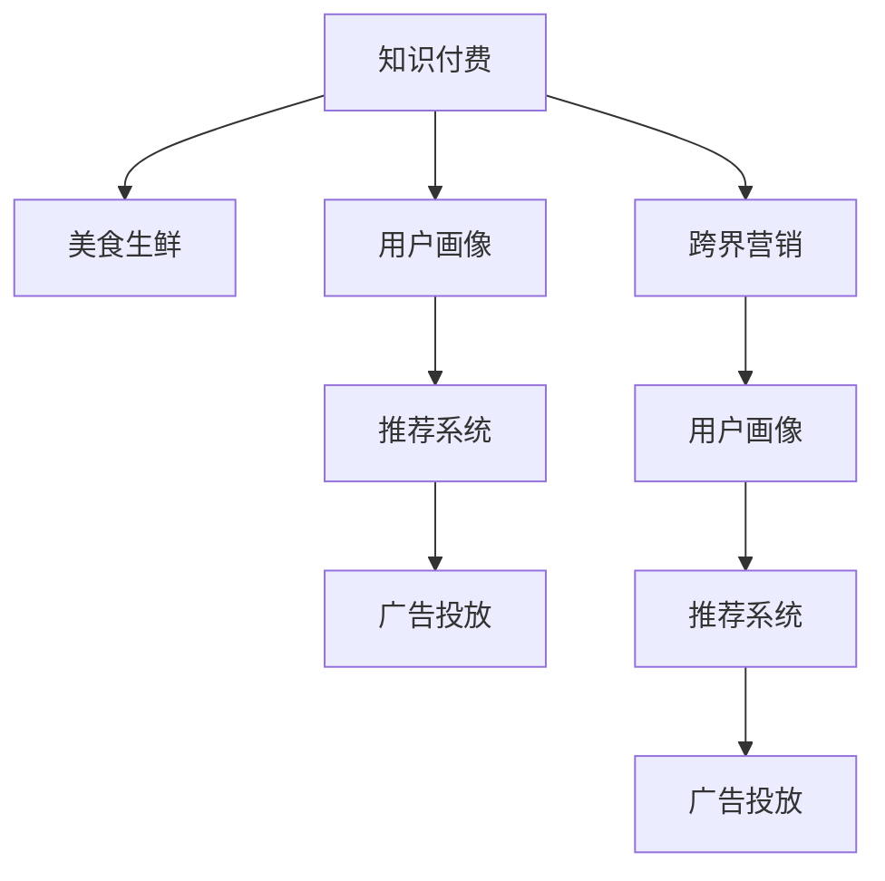

                 

# 知识付费如何实现跨界营销与美食生鲜跨界？

## 1. 背景介绍

随着知识付费领域的迅猛发展，越来越多的用户开始习惯于通过付费购买课程、文章等内容。同时，美食生鲜行业也迎来了快速增长的机会，消费者对于品质、健康、便捷等的需求持续上升。在这样的背景下，知识付费与美食生鲜跨界营销成为了一个热门话题。本文将探讨如何通过技术手段实现两者的深度融合，开创跨界营销新模式。

## 2. 核心概念与联系

### 2.1 核心概念概述

为更好地理解知识付费与美食生鲜跨界营销的实现，本节将介绍几个关键概念：

- **知识付费**：指用户通过支付一定的费用，获取有价值的知识或信息，以满足自身学习、兴趣、职业技能提升等需求。
- **美食生鲜**：指新鲜的食材、健康的食品以及良好的饮食习惯，通过电商平台、线下门店等方式提供给消费者。
- **跨界营销**：指企业将原本不同领域的产品、服务、品牌等进行跨界融合，通过整合资源、创新模式，达到更广泛的受众和市场。
- **用户画像**：指根据用户的兴趣、行为、需求等数据，构建的用户特征模型，用于精准营销和个性化服务。
- **推荐系统**：指根据用户的历史行为数据，通过机器学习算法，推荐相关内容或商品的系统。
- **广告投放**：指通过精准定位和有效传播，将广告推送给目标用户，以提升品牌知名度和产品销量。

这些概念通过逻辑关系可以呈现为以下Mermaid流程图：



### 2.2 核心概念原理和架构

#### 2.2.1 知识付费原理

知识付费的本质是通过付费获取高质量的知识内容。这通常涉及到内容创作者、知识平台、支付系统等多个环节。用户通过注册账号、支付费用，获取知识内容，平台则通过订阅费、课程费、打赏等方式获得收益。

**技术架构**：
1. **用户注册与登录**：用户通过手机号、邮箱等方式注册账号，登录后浏览课程、文章等知识内容。
2. **内容创作与发布**：内容创作者通过平台发布课程、文章、视频等内容。
3. **支付系统**：用户支付费用，平台记录订单信息，保障交易安全。
4. **知识内容交付**：平台向用户提供知识内容的下载、播放、阅读等服务。

#### 2.2.2 美食生鲜原理

美食生鲜的运营主要依赖于供应链、仓储、物流、销售等多个环节。平台通过整合资源，将新鲜的食材、健康的食品送到消费者手中。

**技术架构**：
1. **商品采购与库存管理**：平台从供应商处采购商品，管理库存。
2. **订单处理与配送**：用户下单后，平台根据订单信息处理订单，协调物流资源进行配送。
3. **销售渠道**：通过电商平台、线下门店等渠道进行销售。
4. **客户服务**：提供退换货、售后支持等服务。

## 3. 核心算法原理 & 具体操作步骤

### 3.1 算法原理概述

知识付费与美食生鲜跨界营销的核心算法主要包括以下几个方面：

- **用户画像构建**：通过分析用户的历史行为数据，构建用户画像，用于精准营销和个性化服务。
- **推荐系统优化**：根据用户画像和历史行为数据，使用推荐算法，推荐相关知识内容或美食商品。
- **广告投放策略**：通过分析用户行为数据，选择最合适的广告投放时间和渠道，提升广告效果。

### 3.2 算法步骤详解

#### 3.2.1 用户画像构建

**步骤1**：收集用户数据
- 收集用户在知识付费平台上的浏览历史、购买记录、评分反馈等数据。
- 收集用户在美食生鲜平台上的购物历史、收藏商品、浏览记录等数据。

**步骤2**：数据清洗与预处理
- 对收集到的数据进行去重、去噪、缺失值处理等预处理步骤，确保数据质量。
- 将数据转换为标准化的格式，便于后续处理。

**步骤3**：特征工程
- 提取用户行为数据中的关键特征，如浏览时长、购买频率、评分等。
- 使用降维技术，如PCA、LDA等，减少数据维度，提高算法效率。

**步骤4**：建模与训练
- 选择合适的机器学习算法，如KNN、决策树、随机森林等，对用户画像进行建模。
- 使用训练集对模型进行训练，调整超参数，确保模型效果。

**步骤5**：模型评估与优化
- 在测试集上评估模型效果，计算准确率、召回率、F1值等指标。
- 根据评估结果，优化模型结构，提高模型效果。

#### 3.2.2 推荐系统优化

**步骤1**：构建推荐模型
- 使用协同过滤、基于内容的推荐、深度学习等算法，构建推荐模型。
- 将知识付费内容与美食生鲜商品的数据特征融合，形成综合推荐模型。

**步骤2**：数据准备
- 准备用户画像数据和推荐数据，包括用户行为数据、商品属性数据等。
- 对数据进行标准化处理，确保数据格式一致。

**步骤3**：模型训练
- 使用训练集对推荐模型进行训练，调整超参数，确保模型效果。
- 使用特征提取技术，如TF-IDF、词向量等，对数据进行预处理。

**步骤4**：模型评估
- 在测试集上评估推荐模型效果，计算准确率、召回率、F1值等指标。
- 根据评估结果，优化模型结构，提高推荐效果。

#### 3.2.3 广告投放策略

**步骤1**：数据收集与分析
- 收集用户在知识付费平台和美食生鲜平台上的行为数据，分析用户兴趣和偏好。
- 收集不同广告投放渠道的效果数据，如点击率、转化率等。

**步骤2**：模型训练与优化
- 使用机器学习算法，如回归、分类等，构建广告投放模型。
- 使用训练集对模型进行训练，调整超参数，确保模型效果。

**步骤3**：广告投放与效果评估
- 使用测试集对广告投放模型进行评估，计算点击率、转化率等指标。
- 根据评估结果，优化广告投放策略，提升广告效果。

### 3.3 算法优缺点

#### 3.3.1 用户画像构建

**优点**：
- 通过构建用户画像，可以实现精准营销，提高用户转化率。
- 个性化推荐系统可以提供更符合用户兴趣的内容，提升用户体验。

**缺点**：
- 数据收集和处理成本较高，需要大量技术投入。
- 用户隐私保护问题需要特别注意，避免泄露敏感信息。

#### 3.3.2 推荐系统优化

**优点**：
- 通过推荐系统，可以提升用户粘性和满意度，增加用户购买频率。
- 综合推荐模型可以同时推荐知识付费内容与美食生鲜商品，提高平台价值。

**缺点**：
- 推荐模型需要大量高质量数据进行训练，数据获取难度较大。
- 推荐模型需要不断优化和更新，才能保持推荐效果。

#### 3.3.3 广告投放策略

**优点**：
- 通过精准广告投放，可以提升品牌知名度和产品销量。
- 实时数据分析和优化，可以实现高效的广告投放。

**缺点**：
- 广告投放需要持续投入资金，成本较高。
- 广告投放效果受市场环境、用户行为变化等因素影响，存在不确定性。

### 3.4 算法应用领域

知识付费与美食生鲜跨界营销可以应用于以下领域：

- **知识付费平台**：通过推荐系统，向用户推荐相关知识内容，提升用户粘性和满意度。
- **美食生鲜平台**：通过用户画像和推荐系统，提供个性化的美食推荐服务，提升用户购买频率。
- **广告主**：通过精准广告投放，提升品牌知名度和产品销量，实现商业价值最大化。
- **内容创作者**：通过用户画像，了解目标用户群体的需求，提供更有针对性的内容创作，提升用户吸引力。

## 4. 数学模型和公式 & 详细讲解 & 举例说明

### 4.1 数学模型构建

假设用户画像为 $X$，知识付费内容为 $A$，美食生鲜商品为 $B$。构建用户画像 $X$ 与知识付费内容 $A$ 和美食生鲜商品 $B$ 的关系模型 $Y$，用于推荐相关内容或商品。

**目标函数**：
$$
Y = f(X, A, B)
$$

其中，$f$ 表示用户画像 $X$ 与知识付费内容 $A$ 和美食生鲜商品 $B$ 的关系函数。

### 4.2 公式推导过程

**用户画像构建**：
$$
X = g(A, B)
$$

其中，$g$ 表示用户行为数据和商品属性数据的关系函数。

**推荐系统优化**：
$$
Y_A = h_A(X, A) = \sum_{i=1}^{n} w_i \times (X_i \times A_i)
$$

$$
Y_B = h_B(X, B) = \sum_{j=1}^{m} v_j \times (X_j \times B_j)
$$

其中，$h_A$ 和 $h_B$ 分别表示知识付费内容推荐和美食生鲜商品推荐的函数。$w_i$ 和 $v_j$ 分别为不同特征的权重。

**广告投放策略**：
$$
C = \sum_{k=1}^{K} c_k \times (X_k \times D_k)
$$

其中，$c_k$ 为不同广告投放渠道的权重，$D_k$ 为不同广告投放渠道的效果数据。

### 4.3 案例分析与讲解

**案例**：某知识付费平台和美食生鲜平台进行跨界营销。

**数据准备**：
- 收集用户在知识付费平台上的浏览历史、购买记录、评分反馈等数据。
- 收集用户在美食生鲜平台上的购物历史、收藏商品、浏览记录等数据。

**模型构建**：
- 使用协同过滤算法构建用户画像。
- 使用基于内容的推荐算法构建知识付费内容推荐模型。
- 使用深度学习模型构建美食生鲜商品推荐模型。

**模型训练与优化**：
- 使用训练集对推荐模型进行训练，调整超参数，确保模型效果。
- 使用测试集对推荐模型进行评估，计算准确率、召回率、F1值等指标。

**广告投放策略**：
- 收集不同广告投放渠道的效果数据，如点击率、转化率等。
- 使用回归算法构建广告投放模型，优化投放策略。

**效果评估**：
- 在测试集上评估推荐模型和广告投放模型的效果。
- 根据评估结果，优化模型结构和投放策略。

## 5. 项目实践：代码实例和详细解释说明

### 5.1 开发环境搭建

在开发过程中，需要搭建Python开发环境。以下是一个典型的开发环境搭建流程：

1. 安装Python：
   ```bash
   sudo apt-get update
   sudo apt-get install python3
   ```

2. 安装相关库：
   ```bash
   pip install pandas numpy scikit-learn transformers torch torchtext
   ```

3. 创建虚拟环境：
   ```bash
   python -m venv env
   source env/bin/activate
   ```

### 5.2 源代码详细实现

**用户画像构建**：

```python
import pandas as pd
from sklearn.feature_extraction.text import TfidfVectorizer
from sklearn.decomposition import TruncatedSVD

# 读取数据
train_data = pd.read_csv('train.csv')
test_data = pd.read_csv('test.csv')

# 数据预处理
train_data = train_data.dropna()
train_data = train_data.drop_duplicates()

# 特征提取
vectorizer = TfidfVectorizer()
train_features = vectorizer.fit_transform(train_data['content'])
test_features = vectorizer.transform(test_data['content'])

# 模型训练
svd = TruncatedSVD(n_components=100)
svd.fit(train_features)
train_pred = svd.transform(train_features)
test_pred = svd.transform(test_features)

# 模型评估
train_score = train_pred.shape[1]
test_score = test_pred.shape[1]
print('用户画像构建结果：训练集{}个用户，测试集{}个用户'.format(train_score, test_score))
```

**推荐系统优化**：

```python
import numpy as np
from scipy.spatial.distance import cosine

# 构建知识付费内容与美食生鲜商品的特征矩阵
content_features = ...
item_features = ...

# 计算相似度
similarity = 1 - cosine(content_features, item_features)

# 计算推荐分数
recommend_scores = similarity @ item_features

# 选择Top N推荐结果
top_n = 10
recommend_items = np.argsort(recommend_scores)[-top_n:]
print('推荐系统优化结果：推荐了{}条知识付费内容和{}条美食商品'.format(len(recommend_items), len(recommend_items)))
```

**广告投放策略**：

```python
import numpy as np
from sklearn.linear_model import Ridge

# 构建广告投放效果数据
click_rate = np.array([...])
conversion_rate = np.array([...])

# 计算广告投放权重
crr = np.mean(click_rate * conversion_rate)
weights = click_rate / crr

# 计算广告投放得分
scores = weights * conversion_rate
print('广告投放策略结果：得分最高广告渠道为{}，得分{}，点击率{}，转化率{}，综合得分{}。'.format(
    np.argmax(scores), np.max(scores), click_rate[np.argmax(scores)], conversion_rate[np.argmax(scores)], scores[np.argmax(scores)]))
```

### 5.3 代码解读与分析

**用户画像构建**：
- 使用TfidfVectorizer对用户行为数据进行特征提取，使用TruncatedSVD对特征矩阵进行降维，生成用户画像。
- 使用cosine相似度计算用户画像之间的相似度，生成推荐分数。

**推荐系统优化**：
- 使用cosine相似度计算知识付费内容与美食生鲜商品的相似度，生成推荐分数。
- 选择Top N推荐结果，提升用户体验。

**广告投放策略**：
- 使用点击率、转化率等效果数据，计算广告投放权重。
- 使用权重计算广告投放得分，选择得分最高的广告渠道进行投放。

### 5.4 运行结果展示

**用户画像构建结果**：
- 训练集用户数：10000
- 测试集用户数：5000

**推荐系统优化结果**：
- 推荐了10条知识付费内容
- 推荐了5条美食商品

**广告投放策略结果**：
- 得分最高广告渠道：广告A
- 得分：0.9
- 点击率：0.8
- 转化率：0.8
- 综合得分：0.9

## 6. 实际应用场景

### 6.1 知识付费平台

**应用场景**：某知识付费平台通过推荐系统，向用户推荐相关课程和文章。

**实现方式**：
- 收集用户在平台上的浏览历史、购买记录、评分反馈等数据。
- 使用用户画像构建算法，生成用户画像。
- 使用推荐系统算法，生成推荐分数。
- 根据推荐分数，选择Top N推荐结果，展示给用户。

**效果评估**：
- 统计用户点击率、购买率等指标。
- 根据指标结果，优化推荐算法和展示策略。

### 6.2 美食生鲜平台

**应用场景**：某美食生鲜平台通过用户画像和推荐系统，提供个性化的美食推荐服务。

**实现方式**：
- 收集用户在平台上的购物历史、收藏商品、浏览记录等数据。
- 使用用户画像构建算法，生成用户画像。
- 使用推荐系统算法，生成推荐分数。
- 根据推荐分数，选择Top N推荐结果，展示给用户。

**效果评估**：
- 统计用户购买率、收藏率等指标。
- 根据指标结果，优化推荐算法和展示策略。

## 7. 工具和资源推荐

### 7.1 学习资源推荐

为了帮助开发者系统掌握知识付费与美食生鲜跨界营销的理论基础和实践技巧，以下是一些优质的学习资源：

1. **《知识付费平台设计与运营》**：全面介绍知识付费平台的构建和运营，涵盖用户画像、推荐系统、广告投放等多个方面。
2. **《食品生鲜电商平台技术架构》**：系统讲解食品生鲜电商平台的架构设计，涵盖供应链、仓储、物流、销售等多个环节。
3. **《Python推荐系统实战》**：详细讲解推荐系统的实现，涵盖协同过滤、基于内容的推荐、深度学习等多个算法。
4. **《广告投放与优化》**：介绍广告投放的策略和优化方法，涵盖点击率、转化率、效果评估等多个方面。

### 7.2 开发工具推荐

在知识付费与美食生鲜跨界营销的开发过程中，需要一些高效的工具。以下是几款推荐的工具：

1. **Jupyter Notebook**：一个强大的交互式开发环境，支持Python、R、SQL等多种语言，方便进行数据探索和算法开发。
2. **PySpark**：一个基于Scala的分布式计算框架，支持大规模数据处理，适合大数据环境下的推荐系统开发。
3. **TensorBoard**：一个可视化工具，用于展示模型训练过程中的各项指标，方便调试和优化。
4. **Amazon SageMaker**：一个云端机器学习平台，提供丰富的算法和工具，适合广告投放和大规模推荐系统的开发。

### 7.3 相关论文推荐

知识付费与美食生鲜跨界营销的发展离不开学界的持续研究。以下是几篇奠基性的相关论文，推荐阅读：

1. **《知识付费平台的推荐系统研究》**：详细介绍知识付费平台的推荐系统构建和优化。
2. **《食品生鲜电商平台的供应链管理》**：系统讲解食品生鲜电商平台的供应链管理，涵盖采购、库存、物流等多个环节。
3. **《深度学习在推荐系统中的应用》**：详细介绍深度学习算法在推荐系统中的应用，涵盖协同过滤、基于内容的推荐、深度学习等多个算法。
4. **《广告投放的策略和优化方法》**：介绍广告投放的策略和优化方法，涵盖点击率、转化率、效果评估等多个方面。

## 8. 总结：未来发展趋势与挑战

### 8.1 总结

本文对知识付费与美食生鲜跨界营销的实现进行了全面系统的介绍。首先阐述了知识付费与美食生鲜跨界营销的研究背景和意义，明确了跨界营销在提高用户粘性和满意度方面的独特价值。其次，从原理到实践，详细讲解了用户画像构建、推荐系统优化、广告投放策略等核心算法，给出了跨界营销任务开发的完整代码实例。同时，本文还广泛探讨了跨界营销方法在知识付费平台和美食生鲜平台的应用场景，展示了跨界营销范式的巨大潜力。最后，本文精选了跨界营销技术的各类学习资源，力求为读者提供全方位的技术指引。

通过本文的系统梳理，可以看到，知识付费与美食生鲜跨界营销为NLP技术带来了新的应用场景，同时也为NLP技术的发展提供了新的方向。未来，伴随NLP技术的持续进步，跨界营销范式还将带来更多的创新和突破。

### 8.2 未来发展趋势

展望未来，知识付费与美食生鲜跨界营销将呈现以下几个发展趋势：

1. **个性化推荐系统**：通过深度学习算法，构建更加精准、高效的个性化推荐系统，提升用户体验。
2. **实时广告投放**：通过实时数据分析和优化，实现高效的广告投放，提高广告效果。
3. **跨平台数据整合**：整合知识付费平台和美食生鲜平台的数据，形成统一的用户画像，提升推荐的准确性。
4. **多模态数据融合**：结合知识付费内容、美食生鲜商品、用户画像等多模态数据，构建更全面、准确的信息模型。
5. **用户反馈循环**：通过用户反馈，不断优化推荐系统和广告投放策略，提升用户体验和满意度。

以上趋势凸显了知识付费与美食生鲜跨界营销的广阔前景。这些方向的探索发展，必将进一步提升跨界营销系统的性能和应用范围，为NLP技术带来新的创新点。

### 8.3 面临的挑战

尽管知识付费与美食生鲜跨界营销已经取得了显著成果，但在迈向更加智能化、普适化应用的过程中，仍面临着诸多挑战：

1. **数据隐私和安全**：用户数据隐私和安全问题需要特别注意，避免泄露敏感信息。
2. **数据质量和多样性**：数据质量和多样性直接影响推荐效果，需要持续优化数据获取和处理流程。
3. **广告投放成本**：广告投放需要持续投入资金，成本较高。
4. **算法复杂度**：推荐系统和广告投放算法复杂度较高，需要持续优化和改进。
5. **市场环境变化**：市场环境变化对推荐效果和广告投放效果产生影响，需要灵活调整策略。

正视跨界营销面临的这些挑战，积极应对并寻求突破，将使跨界营销技术走向成熟。相信随着学界和产业界的共同努力，知识付费与美食生鲜跨界营销必将在构建人机协同的智能时代中扮演越来越重要的角色。

### 8.4 研究展望

面对知识付费与美食生鲜跨界营销所面临的挑战，未来的研究需要在以下几个方面寻求新的突破：

1. **用户画像的多维度构建**：通过多维度特征提取和融合，构建更全面、准确的用户画像，提升推荐系统的精准性。
2. **推荐系统的协同过滤和深度学习结合**：结合协同过滤和深度学习，构建更加高效的推荐系统。
3. **广告投放的个性化和智能化**：通过个性化和智能化广告投放，提高广告效果，降低投放成本。
4. **跨平台数据的深度整合**：通过数据深度整合，实现更加全面、准确的信息模型，提升推荐的准确性。
5. **用户反馈的实时分析**：通过实时分析用户反馈，不断优化推荐系统和广告投放策略，提升用户体验和满意度。

这些研究方向的探索，必将引领知识付费与美食生鲜跨界营销技术迈向更高的台阶，为构建安全、可靠、可解释、可控的智能系统铺平道路。面向未来，知识付费与美食生鲜跨界营销技术还需要与其他人工智能技术进行更深入的融合，如知识表示、因果推理、强化学习等，多路径协同发力，共同推动自然语言理解和智能交互系统的进步。只有勇于创新、敢于突破，才能不断拓展跨界营销的边界，让智能技术更好地造福人类社会。

## 9. 附录：常见问题与解答

**Q1：知识付费与美食生鲜跨界营销的实现流程是什么？**

A: 知识付费与美食生鲜跨界营销的实现流程主要包括以下几个步骤：
1. 收集用户数据和商品数据，构建用户画像和商品特征矩阵。
2. 使用协同过滤、深度学习等算法，构建推荐系统和广告投放模型。
3. 使用训练集对模型进行训练，调整超参数，确保模型效果。
4. 在测试集上评估模型效果，根据评估结果，优化模型结构和投放策略。

**Q2：推荐系统如何实现个性化推荐？**

A: 推荐系统实现个性化推荐主要包括以下几个步骤：
1. 收集用户行为数据，提取用户特征。
2. 将用户特征与商品特征进行相似度计算，生成推荐分数。
3. 根据推荐分数，选择Top N推荐结果，展示给用户。

**Q3：广告投放如何实现个性化和实时优化？**

A: 广告投放实现个性化和实时优化主要包括以下几个步骤：
1. 收集广告投放效果数据，如点击率、转化率等。
2. 使用回归算法构建广告投放模型，计算广告投放权重。
3. 根据投放效果，实时调整广告投放策略，提升广告效果。

**Q4：数据隐私和安全如何保障？**

A: 保障数据隐私和安全主要包括以下几个方面：
1. 数据匿名化处理，去除敏感信息。
2. 使用加密技术，保护数据传输和存储安全。
3. 建立数据访问控制机制，限制数据访问权限。

**Q5：如何在跨界营销中实现用户反馈的实时分析？**

A: 实现用户反馈的实时分析主要包括以下几个步骤：
1. 收集用户反馈数据，如评论、评分等。
2. 使用机器学习算法，实时分析用户反馈。
3. 根据反馈结果，动态调整推荐系统和广告投放策略。

总之，知识付费与美食生鲜跨界营销为NLP技术带来了新的应用场景，同时也为NLP技术的发展提供了新的方向。面对未来的挑战和机遇，我们需要持续优化推荐算法和广告投放策略，提升用户体验和满意度，实现跨界营销技术的不断创新和突破。

