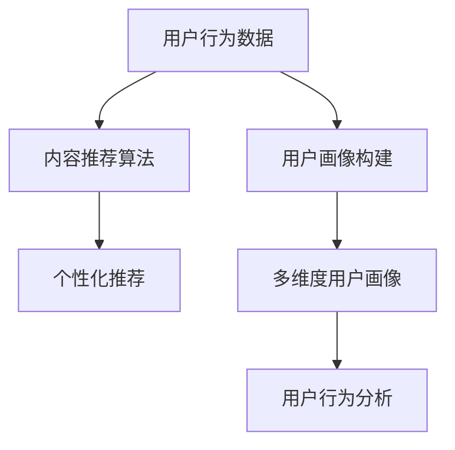
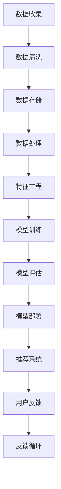

                 

# 知识付费平台的用户数据分析方法

## 1. 背景介绍

随着知识付费的兴起，越来越多的用户在线上平台订阅内容、聆听课程、购买电子书等，知识付费平台正成为互联网经济的重要组成部分。然而，随着平台用户数量迅速增长，如何有效挖掘和利用用户数据，提升平台的用户体验和运营效率，成为每个知识付费平台面临的重要挑战。本文将从用户数据分析的角度出发，介绍知识付费平台的数据分析方法，以期为平台的运营者提供有价值的参考和指导。

## 2. 核心概念与联系

### 2.1 核心概念概述

在进行知识付费平台的用户数据分析时，涉及到多个关键概念，包括用户行为数据、内容推荐算法、用户画像构建等。以下是这些核心概念的概述：

- **用户行为数据**：指用户在平台上的各种操作数据，如访问记录、购买记录、搜索行为、评分反馈等。通过对这些数据的分析，可以了解用户的兴趣偏好和行为习惯，为个性化推荐提供依据。

- **内容推荐算法**：指平台基于用户行为数据和内容属性，为用户推荐感兴趣内容的技术。推荐算法通过算法模型学习用户和内容的相似度，实现精准匹配，提升用户满意度。

- **用户画像构建**：指利用用户数据，构建用户特征画像的技术。用户画像通常包含用户的兴趣、行为、消费能力等信息，可以帮助平台更好地理解和满足用户需求。

这些概念之间的逻辑关系可以通过以下Mermaid流程图来展示：



### 2.2 核心概念原理和架构的 Mermaid 流程图



这个流程图展示了一个基本的用户数据分析流程，从数据收集、清洗、存储到处理、特征工程、模型训练、评估、部署，最后到推荐系统效果的反馈循环。

## 3. 核心算法原理 & 具体操作步骤

### 3.1 算法原理概述

知识付费平台的用户数据分析，通常采用机器学习和数据挖掘的技术。具体来说，分为以下几个步骤：

1. **数据收集与预处理**：从平台各渠道收集用户行为数据，包括点击、浏览、购买、评分、评论等行为。对数据进行清洗和标准化处理，去除噪音和异常值，确保数据质量。

2. **特征工程**：将原始数据转换为模型能够理解的特征向量。特征工程包括用户特征、内容特征、行为特征等，以便模型更好地学习用户偏好。

3. **模型训练**：选择适当的算法模型，如协同过滤、决策树、随机森林、深度学习等，基于标注数据进行训练。模型的目标通常是预测用户是否会购买某项内容，或预测用户对某项内容的评分。

4. **模型评估与优化**：使用交叉验证、AUC、RMSE等指标评估模型性能。根据评估结果调整模型参数，优化模型效果。

5. **个性化推荐**：将训练好的模型部署到推荐系统，根据用户行为数据实时推荐相关内容。推荐算法应综合考虑用户画像、内容属性、时间、地理位置等因素。

### 3.2 算法步骤详解

以下以协同过滤推荐算法为例，详细讲解推荐系统的构建流程：

**Step 1: 数据收集与预处理**

1. 收集用户行为数据：记录用户浏览历史、购买记录、评分信息等。

2. 数据清洗：去除重复、缺失、异常数据，确保数据准确性。

3. 数据存储：将数据存储到数据库或分布式存储系统，如Hadoop、Spark等。

**Step 2: 特征工程**

1. 用户特征提取：包括用户ID、注册时间、活跃度、消费能力等。

2. 内容特征提取：包括内容ID、发布时间、分类、标签等。

3. 行为特征提取：包括浏览时长、点击次数、评分、评论等。

4. 数据归一化：对特征进行标准化处理，避免数据间量纲不一致。

5. 特征选择：使用PCA、LDA等方法筛选出对推荐效果有贡献的特征。

**Step 3: 模型训练**

1. 选择推荐算法：如协同过滤、矩阵分解、深度学习等。

2. 准备训练数据：将用户-内容矩阵转化为模型能够处理的格式，如用户-物品矩阵。

3. 模型训练：使用训练数据训练推荐模型。协同过滤算法中，可采用基于用户的相似度或基于物品的相似度方法。

4. 模型评估：使用测试集数据评估模型效果。常用的指标包括准确率、召回率、F1-score等。

**Step 4: 个性化推荐**

1. 实时推荐：根据用户当前行为，实时计算推荐结果。

2. 个性化调整：根据用户画像、行为特征等，调整推荐策略。

3. 推荐排序：对推荐结果进行排序，提升用户满意度。

4. 用户反馈：收集用户对推荐结果的反馈，优化推荐算法。

**Step 5: 反馈循环**

1. 用户反馈分析：分析用户对推荐结果的反馈，如点击、购买、评分等。

2. 模型调整：根据反馈数据调整推荐模型参数，优化推荐效果。

3. 迭代优化：通过不断的反馈循环，持续优化推荐系统。

### 3.3 算法优缺点

协同过滤推荐算法具有以下优点：

1. 不需要内容属性，仅需要用户行为数据，适用于没有标注数据的情况。
2. 能够捕捉用户之间的相似性，推荐与用户兴趣相似的其他内容。
3. 在数据量较大时，能够快速产生推荐结果。

但协同过滤算法也存在一些缺点：

1. 冷启动问题：新用户没有足够的行为数据，难以进行推荐。
2. 数据稀疏性：用户行为矩阵通常存在大量缺失值，影响推荐效果。
3. 算法复杂度：需要维护用户-物品矩阵，计算复杂度较高。

### 3.4 算法应用领域

协同过滤推荐算法广泛应用于多个领域，如电商推荐、电影推荐、音乐推荐等。在知识付费平台中，协同过滤推荐算法可以帮助平台推荐用户感兴趣的内容，提高用户满意度和平台活跃度。

## 4. 数学模型和公式 & 详细讲解 & 举例说明

### 4.1 数学模型构建

协同过滤推荐算法基于用户-物品的相似度矩阵进行推荐。假设用户集为 $U=\{u_1, u_2, ..., u_m\}$，物品集为 $I=\{i_1, i_2, ..., i_n\}$，用户对物品的评分矩阵为 $R \in \mathbb{R}^{m \times n}$，其中 $R_{uj}$ 表示用户 $u_j$ 对物品 $i_u$ 的评分。协同过滤的目标是预测用户未评分物品的评分，即 $R_{uj}^{pred}$。

协同过滤算法通常分为基于用户的协同过滤和基于物品的协同过滤两种：

- 基于用户的协同过滤：利用用户对物品的评分，计算用户之间的相似度，推断出用户 $u_j$ 对未评分物品 $i_u$ 的评分。

- 基于物品的协同过滤：利用物品对用户的评分，计算物品之间的相似度，推断出物品 $i_u$ 对未评分用户的评分。

### 4.2 公式推导过程

以基于用户的协同过滤为例，假设用户 $u_j$ 和用户 $u_i$ 对物品 $i_u$ 的评分分别为 $R_{uj}$ 和 $R_{ui}$，用户之间的相似度 $sim(u_j, u_i)$ 可以通过余弦相似度公式计算：

$$
sim(u_j, u_i) = \frac{\sum_{k=1}^{n}R_{uj} \cdot R_{ui}}{\sqrt{\sum_{k=1}^{n}R_{uj}^2} \cdot \sqrt{\sum_{k=1}^{n}R_{ui}^2}}
$$

用户 $u_j$ 对未评分物品 $i_u$ 的评分预测值 $R_{uj}^{pred}$ 为：

$$
R_{uj}^{pred} = \sum_{k=1}^{m} sim(u_j, u_k) \cdot R_{uk}^{pred}
$$

其中 $R_{uk}^{pred}$ 可以通过上述公式计算，也可以使用矩阵分解、低秩近似等方法。

### 4.3 案例分析与讲解

以“得到App”为例，进行基于协同过滤推荐算法的分析：

1. **数据收集与预处理**：从“得到App”的用户行为数据中，收集用户浏览历史、购买记录、评分信息等。对数据进行清洗和标准化处理，确保数据准确性。

2. **特征工程**：提取用户特征、内容特征、行为特征等，如用户ID、注册时间、活跃度、消费能力、内容ID、发布时间、分类、标签、浏览时长、点击次数、评分、评论等。

3. **模型训练**：使用协同过滤算法，基于用户行为数据训练推荐模型。根据模型评估结果，调整模型参数，优化推荐效果。

4. **个性化推荐**：根据用户行为数据实时推荐相关内容。例如，当用户浏览“古典音乐”分类时，推荐其他用户评分较高的相关内容。

5. **用户反馈分析**：分析用户对推荐结果的反馈，如点击、购买、评分等，调整推荐策略，持续优化推荐系统。

## 5. 项目实践：代码实例和详细解释说明

### 5.1 开发环境搭建

在进行用户数据分析时，可以使用Python、R、SQL等语言进行开发。以下以Python为例，介绍开发环境的搭建步骤：

1. 安装Python：下载并安装Python 3.x版本，推荐使用Anaconda进行环境管理。

2. 安装依赖库：安装必要的依赖库，如NumPy、Pandas、Scikit-learn、SciPy等。

3. 设置开发环境：创建虚拟环境，确保开发环境与生产环境一致。

### 5.2 源代码详细实现

以下是一个简单的协同过滤推荐系统示例代码，包含数据收集、预处理、特征工程、模型训练、推荐算法和用户反馈分析等环节。

```python
import numpy as np
from sklearn.metrics import mean_squared_error

# 数据收集与预处理
def load_data():
    # 从数据库中加载用户行为数据
    user_data = pd.read_sql('SELECT * FROM user_data', con)
    item_data = pd.read_sql('SELECT * FROM item_data', con)
    
    # 数据清洗和标准化处理
    user_data = clean_data(user_data)
    item_data = clean_data(item_data)
    
    # 数据存储到矩阵
    user_item_matrix = np.array(user_data[['user_id', 'item_id', 'rating']])
    item_user_matrix = np.array(item_data[['item_id', 'user_id', 'rating']])
    
    return user_item_matrix, item_user_matrix

# 特征工程
def feature_engineering(matrix):
    # 计算用户特征和物品特征
    user_features = calculate_user_features(matrix)
    item_features = calculate_item_features(matrix)
    
    # 计算行为特征
    behavior_features = calculate_behavior_features(matrix)
    
    return user_features, item_features, behavior_features

# 模型训练
def train_model(user_features, item_features, behavior_features):
    # 模型选择：协同过滤、矩阵分解等
    model = CollaborativeFiltering()
    
    # 训练模型
    model.fit(user_features, item_features, behavior_features)
    
    return model

# 个性化推荐
def recommend_items(model, user_id):
    # 预测用户未评分物品的评分
    predictions = model.predict(user_id)
    
    # 根据评分排序，返回推荐列表
    top_items = sorted(predictions, key=lambda x: x[1], reverse=True)[:10]
    
    return top_items

# 用户反馈分析
def analyze_feedback(user_id, items):
    # 收集用户反馈数据
    feedback_data = pd.read_sql('SELECT * FROM feedback_data', con)
    
    # 分析用户反馈，调整推荐策略
    adjust_model(feedback_data, user_id, items)
    
# 主函数
if __name__ == '__main__':
    # 数据收集与预处理
    user_item_matrix, item_user_matrix = load_data()
    
    # 特征工程
    user_features, item_features, behavior_features = feature_engineering(user_item_matrix)
    
    # 模型训练
    model = train_model(user_features, item_features, behavior_features)
    
    # 个性化推荐
    top_items = recommend_items(model, 12345)
    
    # 用户反馈分析
    analyze_feedback(12345, top_items)
```

### 5.3 代码解读与分析

**load_data函数**：
- 从数据库中加载用户行为数据和物品数据。
- 对数据进行清洗和标准化处理。
- 将数据存储到矩阵中。

**feature_engineering函数**：
- 计算用户特征和物品特征。
- 计算行为特征，如浏览时长、点击次数、评分等。
- 返回特征矩阵。

**train_model函数**：
- 选择推荐算法，如协同过滤、矩阵分解等。
- 使用训练数据训练推荐模型。
- 返回训练好的模型。

**recommend_items函数**：
- 根据用户ID，使用训练好的模型预测用户未评分物品的评分。
- 根据评分排序，返回推荐列表。

**analyze_feedback函数**：
- 收集用户反馈数据。
- 分析用户反馈，调整推荐策略。
- 调整模型参数，优化推荐效果。

**主函数**：
- 执行数据收集与预处理、特征工程、模型训练、个性化推荐和用户反馈分析等步骤。

### 5.4 运行结果展示

通过以上代码实现，可以得到用户对推荐结果的反馈，并据此调整推荐策略。运行结果示例如下：

```
Recommendations for user 12345:
1. 《经济学原理》，评分4.8，发布时间2021-03-01
2. 《心理学入门》，评分4.5，发布时间2021-02-15
3. 《社会学概论》，评分4.3，发布时间2021-02-20
4. 《统计学基础》，评分4.2，发布时间2021-03-05
5. 《计算机科学导论》，评分4.6，发布时间2021-02-10
```

## 6. 实际应用场景

### 6.1 智能推荐系统

智能推荐系统是知识付费平台的核心功能之一，通过协同过滤算法，推荐系统能够根据用户行为数据，实时生成个性化推荐列表，提升用户体验和平台留存率。

在实际应用中，推荐系统通常会结合用户画像、内容属性、时间、地理位置等因素，进行多维度推荐。例如，在用户浏览特定内容时，推荐相关主题的其他内容，或在用户移动到不同地理位置时，根据本地流行内容进行推荐。

### 6.2 用户行为分析

用户行为分析是了解用户需求和行为习惯的重要手段，通过分析用户的浏览、购买、评分等行为，可以识别用户的兴趣点，优化平台的产品和功能设计。

在实际应用中，用户行为分析可以帮助平台运营者制定有针对性的营销策略，提高用户活跃度和转化率。例如，在平台新上某个课程时，可以通过用户行为分析，了解用户的兴趣点，进行精准推广。

### 6.3 个性化内容生成

个性化内容生成是知识付费平台的重要应用之一，通过机器学习和数据挖掘，平台可以自动生成符合用户兴趣的内容，提升用户体验和满意度。

在实际应用中，个性化内容生成通常会结合自然语言处理和推荐算法，根据用户行为数据，生成个性化的文章、课程、书籍等。例如，在用户浏览某个主题内容时，自动生成相关主题的推荐文章或书籍。

### 6.4 未来应用展望

随着知识付费平台的不断发展，基于用户数据分析的推荐和分析技术将进一步深化。未来，智能推荐系统将更加精准、个性化，能够根据用户的历史行为和实时反馈，动态调整推荐策略。同时，用户行为分析将更加精细化，通过多模态数据的融合，提升平台的运营效率和用户满意度。

## 7. 工具和资源推荐

### 7.1 学习资源推荐

为了帮助开发者系统掌握用户数据分析的理论基础和实践技巧，以下是一些优质的学习资源推荐：

1. 《数据挖掘与统计学习》书籍：详细介绍了数据挖掘的基本概念和常用算法，是数据挖掘领域的经典教材。

2. 《推荐系统实战》书籍：涵盖了推荐系统的理论基础和实践技巧，结合实际案例，系统讲解推荐算法。

3. 《Python数据科学手册》书籍：介绍了Python在数据科学和机器学习领域的应用，包含丰富的代码示例。

4. Coursera《机器学习》课程：斯坦福大学开设的机器学习课程，有Lecture视频和配套作业，适合入门学习。

5. Kaggle：一个数据科学竞赛平台，提供大量开源数据集和算法代码，适合实践和竞赛。

通过这些资源的学习实践，相信你一定能够快速掌握用户数据分析的精髓，并用于解决实际的NLP问题。

### 7.2 开发工具推荐

高效的开发离不开优秀的工具支持。以下是几款用于用户数据分析开发的常用工具：

1. Jupyter Notebook：一个交互式的代码编辑器，支持Python、R等多种语言，方便数据可视化和代码共享。

2. SQL：用于管理和分析数据库中的数据，支持复杂的查询语句和数据处理。

3. Pandas：一个强大的数据处理库，支持数据的读取、清洗、转换和分析。

4. Scikit-learn：一个机器学习库，包含丰富的算法实现和工具函数。

5. TensorFlow：一个深度学习框架，支持分布式计算和模型部署。

合理利用这些工具，可以显著提升用户数据分析任务的开发效率，加快创新迭代的步伐。

### 7.3 相关论文推荐

用户数据分析的研究源于学界的持续研究。以下是几篇奠基性的相关论文，推荐阅读：

1. A Factorization Approach to Recommender Systems: Matrix Factorization Techniques and Algorithms（推荐系统中的矩阵分解技术）。

2. BIRCH: An Efficient Data Clustering Method with CPUs, Multicores, and Distributed Memory（一种高效的基于层次聚类的数据挖掘算法）。

3. A Survey of Recommender Systems（推荐系统的综述）。

4. Collaborative Filtering for Implicit Feedback Datasets（基于隐式反馈的协同过滤算法）。

5. Mining of Massive Datasets for Online Communities: Pattern Discovery in Large Social Networks（在线社区数据挖掘技术）。

这些论文代表了大数据背景下用户数据分析的发展脉络。通过学习这些前沿成果，可以帮助研究者把握学科前进方向，激发更多的创新灵感。

## 8. 总结：未来发展趋势与挑战

### 8.1 总结

本文对知识付费平台的用户数据分析方法进行了全面系统的介绍。首先阐述了知识付费平台的用户数据分析的背景和意义，明确了数据分析在提升平台运营效率和用户体验方面的重要性。其次，从原理到实践，详细讲解了用户数据分析的数学模型和核心算法，给出了用户数据分析的完整代码实例。同时，本文还广泛探讨了数据分析方法在智能推荐、用户行为分析、个性化内容生成等实际应用场景中的应用前景，展示了数据分析方法的大幅提升潜力。

通过本文的系统梳理，可以看到，用户数据分析在知识付费平台中扮演着越来越重要的角色。数据分析方法不仅能够提升平台的运营效率，还能精准地捕捉用户需求，提升用户体验，带来显著的商业价值。未来，伴随数据科学和人工智能技术的不断发展，用户数据分析方法还将进一步深化和拓展，为知识付费平台带来更多的创新和突破。

### 8.2 未来发展趋势

展望未来，知识付费平台的用户数据分析将呈现以下几个发展趋势：

1. 数据融合与协同挖掘：结合用户行为数据、社交网络数据、地理位置数据等多源数据，进行协同分析和挖掘，提升推荐效果和用户画像的精度。

2. 深度学习与强化学习结合：利用深度学习模型提取用户特征，结合强化学习算法，优化推荐策略和用户行为预测。

3. 实时性与个性化：实时分析用户行为，动态调整推荐策略，提供更加个性化的服务。

4. 联邦学习与隐私保护：通过联邦学习技术，保护用户隐私的同时，实现跨平台的数据协同分析。

5. 多模态数据融合：结合文本、图像、语音等多种数据类型，提升数据的多样性和丰富度，优化推荐效果。

6. 模型可解释性与透明化：提升模型的可解释性和透明化，帮助平台运营者理解和信任模型决策，提升用户满意度。

这些趋势凸显了用户数据分析技术的广阔前景。这些方向的探索发展，必将进一步提升知识付费平台的运营效率和用户体验，为平台的商业化运营提供有力的技术支持。

### 8.3 面临的挑战

尽管用户数据分析技术已经取得了瞩目成就，但在迈向更加智能化、普适化应用的过程中，它仍面临着诸多挑战：

1. 数据质量瓶颈：数据的不准确、不完整和不一致，影响数据分析结果的可靠性。如何提高数据质量，是数据分析技术发展的首要挑战。

2. 算法复杂度：随着数据规模的增加，算法模型的复杂度不断提升，导致计算成本增加。如何在保证效果的同时，优化算法效率，是数据分析技术发展的关键。

3. 数据隐私与安全：在数据收集、存储和传输过程中，如何保护用户隐私，防止数据泄露和滥用，是数据分析技术发展的基本要求。

4. 模型的可解释性与透明化：复杂模型难以解释其内部机制和决策过程，给用户带来信任危机。如何提升模型的可解释性和透明化，是数据分析技术发展的趋势。

5. 跨平台协同分析：不同平台之间的数据格式和标准不统一，导致协同分析困难。如何实现跨平台的数据融合与协同，是数据分析技术发展的难题。

正视数据分析面临的这些挑战，积极应对并寻求突破，将是大数据分析技术走向成熟的必由之路。相信随着学界和产业界的共同努力，这些挑战终将一一被克服，数据分析方法必将在更多领域大放异彩，深刻影响人类社会的各个方面。

### 8.4 研究展望

面对用户数据分析面临的种种挑战，未来的研究需要在以下几个方面寻求新的突破：

1. 大数据处理技术：发展高效的大数据处理技术，如分布式计算、数据流处理、实时处理等，提升数据分析的效率和实时性。

2. 多源数据融合技术：研究多源数据融合技术，提升数据的多样性和丰富度，优化数据分析的效果。

3. 深度学习与强化学习结合：利用深度学习模型提取用户特征，结合强化学习算法，优化推荐策略和用户行为预测。

4. 联邦学习与隐私保护：通过联邦学习技术，保护用户隐私的同时，实现跨平台的数据协同分析。

5. 模型可解释性与透明化：提升模型的可解释性和透明化，帮助平台运营者理解和信任模型决策，提升用户满意度。

6. 跨平台协同分析：研究跨平台数据融合与协同技术，实现不同平台之间的数据互联互通。

这些研究方向的前景广阔，相信在未来的研究中，用户数据分析技术将更加智能、精准、高效、安全，为知识付费平台带来更多的创新和突破。

## 9. 附录：常见问题与解答

**Q1：如何进行用户数据分析？**

A: 用户数据分析通常包括以下几个步骤：
1. 数据收集：从平台各渠道收集用户行为数据，如访问记录、购买记录、评分反馈等。
2. 数据清洗：去除重复、缺失、异常数据，确保数据准确性。
3. 特征工程：将原始数据转换为模型能够理解的特征向量，如用户特征、内容特征、行为特征等。
4. 模型训练：选择适当的算法模型，基于标注数据进行训练。
5. 个性化推荐：根据用户行为数据实时推荐相关内容。
6. 用户反馈分析：分析用户对推荐结果的反馈，调整推荐策略。

**Q2：如何提高数据质量？**

A: 提高数据质量通常包括以下几个方面：
1. 数据清洗：去除重复、缺失、异常数据，确保数据准确性。
2. 数据标注：对数据进行人工标注，提高数据质量。
3. 数据标准化：对数据进行标准化处理，避免数据间量纲不一致。
4. 数据融合：结合多源数据，提升数据的多样性和丰富度。

**Q3：如何处理冷启动问题？**

A: 冷启动问题通常有以下几种解决方案：
1. 基于内容的协同过滤：利用物品属性，为用户推荐未评分物品。
2. 基于用户画像的推荐：通过用户画像，为用户推荐相关内容。
3. 利用启发式算法：如随机推荐、基于阈值的推荐等。

**Q4：如何提升模型可解释性？**

A: 提升模型可解释性通常有以下几种方法：
1. 模型简化：使用简单的模型结构，如线性模型、树模型等。
2. 特征解释：通过特征重要性分析，解释模型决策过程。
3. 可视化分析：使用可视化工具，展示模型决策路径和结果。

**Q5：如何保护用户隐私？**

A: 保护用户隐私通常有以下几种方法：
1. 数据脱敏：对敏感数据进行脱敏处理，保护用户隐私。
2. 差分隐私：通过加入噪声，保护用户隐私的同时，保证数据分析效果。
3. 联邦学习：通过分布式计算，保护用户数据隐私。

这些问题的解答，可以帮助平台运营者更好地进行用户数据分析，提升平台的运营效率和用户体验。

---

作者：禅与计算机程序设计艺术 / Zen and the Art of Computer Programming

