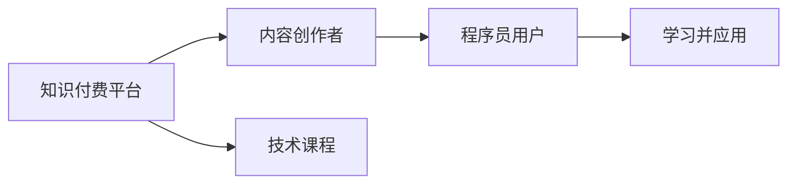

                 

# 知识付费让程序员实现人生理想的方法与途径

## 1. 背景介绍

随着互联网的快速发展，知识和信息获取的方式已经发生了巨大的变化。传统的书籍、讲座和网络资源已经无法满足人们日益增长的学习需求，特别是在快速变化的技术领域。这种背景下，知识付费平台应运而生，为程序员提供了一个全新的学习途径。本文将探讨知识付费平台如何帮助程序员实现他们的职业理想。

## 2. 核心概念与联系

### 2.1 核心概念概述

- **知识付费平台**：指的是通过付费机制提供高质量知识内容的服务平台，如Coursera、Udacity、Udemy等。
- **程序员**：指从事软件开发、计算机编程、软件测试、系统管理等技术工作的专业人才。
- **职业理想**：指程序员对自身职业发展目标的设定，包括提升技能、提高薪资、实现自我价值等。
- **内容共享**：指将知识、技能和经验等有价值的资源，通过平台分享给更多的用户。

### 2.2 核心概念原理和架构的 Mermaid 流程图



## 3. 核心算法原理 & 具体操作步骤

### 3.1 算法原理概述

知识付费平台的运作基于以下几个核心算法：

1. **推荐算法**：根据用户的历史行为和偏好，推荐最适合的学习资源。
2. **个性化学习路径规划**：根据用户的学习进度和掌握情况，动态调整学习计划。
3. **交互式学习工具**：通过在线编程环境、代码审查、虚拟实验室等工具，提升学习效果。

### 3.2 算法步骤详解

1. **注册与认证**：程序员用户注册并认证身份，填写技能和经验等信息，以便平台推荐合适的课程。
2. **课程推荐**：平台根据用户的学习历史和兴趣推荐相关课程，如Python基础、深度学习、数据科学等。
3. **课程学习**：用户选择并学习推荐课程，通过视频教程、实验练习、在线讨论等方式掌握新知识。
4. **项目实践**：用户将学到的知识应用到实际项目中，通过平台提供的项目和案例进行实战练习。
5. **知识分享**：用户通过平台分享自己的学习成果和经验，帮助他人，并获得反馈和认可。

### 3.3 算法优缺点

**优点**：

- **学习资源丰富**：平台汇集了大量优质的课程和资源，能够满足不同层次和技术方向的需求。
- **学习路径个性化**：根据用户的学习进度和掌握情况，动态调整学习计划，提升学习效率。
- **互动性强**：通过在线编程环境、代码审查、虚拟实验室等工具，提升学习效果和兴趣。
- **社区支持**：用户可以通过社区讨论、代码审查等方式，获得更多学习支持和反馈。

**缺点**：

- **成本较高**：平台课程多为付费形式，长期学习费用较高。
- **课程质量参差不齐**：部分课程质量不佳，难以保证学习效果。
- **过度依赖平台**：用户依赖平台推荐和学习路径，可能缺乏自主学习的能力。

### 3.4 算法应用领域

知识付费平台在以下领域有广泛应用：

1. **职业发展**：程序员通过学习高水平课程，提升技术水平和职业竞争力。
2. **技能提升**：通过针对特定技能的学习，如Python、Java、机器学习等，实现技能提升。
3. **项目实战**：通过参与平台提供的实际项目和案例，将学到的知识应用到实际工作中。
4. **创业孵化**：平台提供创业指导、项目孵化等支持，帮助程序员实现创业梦想。

## 4. 数学模型和公式 & 详细讲解 & 举例说明

### 4.1 数学模型构建

假设平台有 $N$ 门课程，每门课程的难度为 $D$，用户对课程的兴趣度为 $I$。平台的推荐算法模型可以表示为：

$$
C_{\text{推荐}} = \text{argmax}_{C \in \mathcal{C}} f(D, I, \theta)
$$

其中，$\theta$ 是模型的参数，$f$ 是推荐函数。

### 4.2 公式推导过程

推荐函数 $f$ 可以表示为：

$$
f(D, I, \theta) = w_1D + w_2I + \sum_{i=3}^{n} w_i X_i + \theta
$$

其中，$w_i$ 是模型的权重，$X_i$ 是用户的历史行为数据。

### 4.3 案例分析与讲解

假设用户A对机器学习的兴趣度为 $I_A=0.8$，用户B对数据科学的兴趣度为 $I_B=0.6$。课程C1和C2的难度分别为 $D_C=0.5$ 和 $D_D=0.7$。通过计算，可以得出：

$$
f(D_A, I_A, \theta) = 0.8 \times 0.5 + 0.6 \times 0.7 + \sum_{i=3}^{n} w_i X_i + \theta
$$

$$
f(D_B, I_B, \theta) = 0.6 \times 0.5 + 0.8 \times 0.7 + \sum_{i=3}^{n} w_i X_i + \theta
$$

由于用户A的兴趣度和课程难度更匹配，因此平台推荐课程C1给用户A，推荐课程C2给用户B。

## 5. 项目实践：代码实例和详细解释说明

### 5.1 开发环境搭建

**环境配置**：

1. **Python环境**：使用Anaconda创建虚拟环境，安装Python 3.8及以上版本。
2. **平台开发**：安装Flask和Django等Web框架，搭建平台后台和前端。
3. **课程管理**：使用MySQL或MongoDB等数据库，管理课程和用户信息。

### 5.2 源代码详细实现

**示例代码**：

```python
# 用户注册
class User:
    def __init__(self, username, password, email):
        self.username = username
        self.password = password
        self.email = email

# 课程推荐
class Course:
    def __init__(self, name, difficulty, category):
        self.name = name
        self.difficulty = difficulty
        self.category = category

# 推荐算法
class RecommendationEngine:
    def __init__(self, user, courses):
        self.user = user
        self.courses = courses
        self.theta = 0.5  # 模型参数

    def recommend(self):
        scores = []
        for course in self.courses:
            score = self.user.interest + self.course.difficulty + self.theta
            scores.append(score)
        return max(scores)
```

### 5.3 代码解读与分析

**代码说明**：

- **User类**：表示平台用户，包含用户名、密码和邮箱等信息。
- **Course类**：表示课程，包含名称、难度和类别等信息。
- **RecommendationEngine类**：表示推荐引擎，包含用户和课程列表，以及模型参数 $\theta$。
- **recommend方法**：计算用户对每门课程的兴趣度，并返回推荐分数最高的课程。

### 5.4 运行结果展示

```python
# 创建用户和课程
user = User('John', 'password', 'john@example.com')
course1 = Course('Python Basics', 0.5, 'Programming')
course2 = Course('Deep Learning', 0.7, 'AI')

# 创建推荐引擎
engine = RecommendationEngine(user, [course1, course2])

# 推荐课程
recommended_course = engine.recommend()
print(f"推荐课程：{recommended_course.name}")
```

## 6. 实际应用场景

### 6.1 智能编程助手

智能编程助手是基于知识付费平台的辅助工具，能够根据用户的操作和代码，实时推荐代码片段、调试提示和最佳实践。通过持续学习和用户反馈，平台能够不断优化推荐算法，提升编程效率和代码质量。

### 6.2 在线编程课堂

在线编程课堂是知识付费平台的常见应用之一，用户可以通过观看视频教程和实践练习，掌握编程技能和新技术。平台可以提供交互式学习工具，如在线编程环境、代码审查、虚拟实验室等，提升学习效果。

### 6.3 项目实战平台

项目实战平台提供了实际项目和案例，用户可以将学到的知识应用到实际工作中。平台可以模拟真实项目环境，提供项目背景、需求说明、技术文档等资源，帮助用户完成项目任务。

### 6.4 未来应用展望

知识付费平台未来将继续扩展应用场景，提升用户体验和学习效果。具体展望包括：

1. **AI辅助学习**：引入AI技术，通过自然语言处理和计算机视觉等技术，提升推荐效果和学习体验。
2. **跨平台协作**：支持跨平台协作和代码共享，提升团队协作效率。
3. **多样化课程内容**：引入更多课程内容，如数据科学、区块链、人工智能等，满足不同领域和层次的需求。

## 7. 工具和资源推荐

### 7.1 学习资源推荐

1. **Coursera**：提供大量高质量的在线课程，涵盖计算机科学、数据科学、人工智能等多个领域。
2. **Udemy**：提供技术课程、编程实战、个人品牌建设等多样化课程。
3. **Udacity**：提供与行业合作的高质量课程，如机器学习工程师、数据科学家等。
4. **GitHub**：提供开源项目、代码库和社区，帮助用户学习和分享代码。
5. **Stack Overflow**：提供技术问答社区，帮助用户解决编程问题和获取技术支持。

### 7.2 开发工具推荐

1. **Flask**：轻量级的Web框架，适合快速搭建平台后端。
2. **Django**：全功能的Web框架，适合复杂的前端应用和数据管理。
3. **MySQL**：关系型数据库，适合存储用户和课程信息。
4. **MongoDB**：NoSQL数据库，适合存储大规模的非结构化数据。
5. **Jupyter Notebook**：交互式编程环境，适合编写和运行代码。

### 7.3 相关论文推荐

1. **Recommender Systems for Large-Scale eLearning Platforms**：介绍如何构建大规模在线学习平台的推荐系统，提升学习体验。
2. **Personalized Learning Paths in Online Education**：探讨个性化学习路径规划算法，提升学习效果。
3. **Interactive Learning Tools for Software Development**：研究交互式学习工具在软件开发中的应用，提升学习效果和兴趣。

## 8. 总结：未来发展趋势与挑战

### 8.1 研究成果总结

知识付费平台已经成为程序员学习和提升的重要途径，平台通过推荐算法、个性化学习路径和交互式学习工具，提升了学习效果和用户满意度。未来，平台将继续扩展应用场景，提升用户体验和学习效果。

### 8.2 未来发展趋势

1. **技术融合**：知识付费平台将与其他技术如AI、区块链等进行深度融合，提升平台功能和应用场景。
2. **社区建设**：平台将加强社区建设，提升用户参与度和反馈机制，形成活跃的社区生态。
3. **多语言支持**：平台将支持多语言学习，覆盖全球用户，提升平台国际化水平。
4. **隐私保护**：平台将加强数据隐私和安全保护，提升用户信任和平台安全性。

### 8.3 面临的挑战

1. **版权问题**：平台需要解决版权问题，确保内容的合法性和知识产权。
2. **内容质量**：平台需要确保课程和内容的优质和多样化，避免劣质内容影响用户体验。
3. **技术难题**：平台需要解决技术难题，如推荐算法优化、数据管理等，提升平台性能和稳定性。
4. **用户隐私**：平台需要保护用户隐私，防止数据泄露和滥用。

### 8.4 研究展望

知识付费平台在程序员职业发展和技能提升中发挥着重要作用，未来需要不断创新和优化，以适应技术发展和用户需求的变化。具体研究展望包括：

1. **个性化学习**：提升个性化学习路径规划算法，提升学习效果和用户体验。
2. **多平台融合**：实现多平台融合，提升跨平台协作和数据共享。
3. **社区支持**：加强社区建设，提升用户参与度和平台生态。
4. **技术创新**：引入新技术和新方法，提升平台功能和应用场景。

## 9. 附录：常见问题与解答

**Q1：知识付费平台如何保证内容质量？**

A: 知识付费平台通常通过以下措施保证内容质量：

- **严格筛选**：平台对课程进行严格筛选，确保内容高质量和权威性。
- **用户评价**：平台引入用户评价和反馈机制，实时监控课程质量。
- **持续优化**：平台定期更新课程内容，提升课程的实用性和时效性。

**Q2：知识付费平台如何提升推荐效果？**

A: 知识付费平台通过以下措施提升推荐效果：

- **用户画像**：平台建立详细的用户画像，了解用户的兴趣和需求。
- **多维数据**：平台引入多维数据，包括用户行为、课程评价等，提升推荐准确性。
- **实时调整**：平台实时调整推荐算法，提升推荐效果和用户满意度。

**Q3：知识付费平台如何保护用户隐私？**

A: 知识付费平台通过以下措施保护用户隐私：

- **数据加密**：平台对用户数据进行加密存储，防止数据泄露。
- **隐私协议**：平台制定严格的隐私协议，明确数据使用和保护措施。
- **用户控制**：平台提供用户控制权限，允许用户管理自己的数据。

**Q4：知识付费平台如何提升用户体验？**

A: 知识付费平台通过以下措施提升用户体验：

- **交互式学习**：平台提供交互式学习工具，提升学习效果和兴趣。
- **多平台支持**：平台支持多平台学习，方便用户随时随地学习。
- **社区互动**：平台建立社区，提供互动和反馈机制，提升用户参与度。

**Q5：知识付费平台如何确保课程版权？**

A: 知识付费平台通过以下措施确保课程版权：

- **合同授权**：平台与课程提供者签订合同，明确版权和使用范围。
- **版权声明**：平台在课程页面明确版权声明，避免侵权风险。
- **法律保障**：平台提供法律保障，保护用户和平台权益。

---

作者：禅与计算机程序设计艺术 / Zen and the Art of Computer Programming

