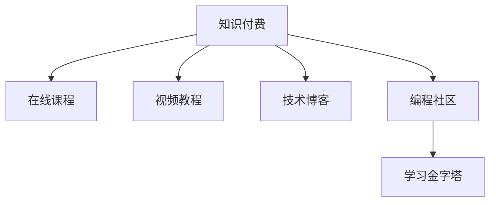

                 

# 知识付费让程序员收入翻倍

## 1. 背景介绍

### 1.1 问题由来
随着互联网和信息技术的发展，程序员在社会中的地位和作用日益凸显。他们不仅需要具备扎实的编程技能，还需要不断学习和适应新技术。然而，传统的学习方式，如阅读书籍、参加线下培训，往往时间和成本投入巨大，而且学习效果不尽如人意。因此，知识付费作为一种新兴的学习方式，近年来在程序员群体中获得了广泛的认可和应用。

知识付费的核心在于通过付费获取优质、高效的课程内容，快速提升程序员的专业技能和职业素养。它不仅满足了人们对于快速学习的需求，还打破了时间和空间的限制，极大地提高了学习的效率和便捷性。

### 1.2 问题核心关键点
知识付费平台通常采用在线课程、视频教程、技术博客等多种形式，提供丰富的学习资源。程序员可以通过这些平台，接触到全球顶尖的技术专家和行业领袖，学习前沿技术和最佳实践。然而，如何高效地使用这些资源，将知识转化为实际的生产力，实现收入的翻倍，成为了程序员面临的又一挑战。

本文将深入探讨知识付费对于程序员收入翻倍的影响，分析其核心原理、操作步骤以及应用领域，并提出相关的学习资源、开发工具和未来发展趋势，帮助程序员最大化其知识付费的价值。

## 2. 核心概念与联系

### 2.1 核心概念概述

为更好地理解知识付费对程序员收入翻倍的影响，本节将介绍几个密切相关的核心概念：

- 知识付费：指通过付费获取优质教育资源，加速技能提升和职业发展的模式。在程序员领域，常见的知识付费平台包括Udemy、Coursera、慕课网等。
- 在线课程：指通过互联网提供的学习资源，通常包含视频、PPT、作业等多种形式。
- 视频教程：指通过录制的视频方式，详细介绍某个技术或项目的学习和实践过程。
- 技术博客：指程序员分享技术经验、实践心得的自媒体形式，通常包括文章、代码、视频等。
- 编程社区：指程序员交流技术、分享经验、互助答疑的平台，如GitHub、Stack Overflow等。
- 学习金字塔：描述不同学习方法对知识保留和学习效果的层次分布，强调实践和互动的重要性。

这些核心概念之间的逻辑关系可以通过以下Mermaid流程图来展示：



这个流程图展示了几大知识付费形式的来源以及其与学习金字塔之间的关系：

1. 知识付费平台提供多种学习形式，程序员可以根据个人需求选择合适的资源。
2. 在线课程、视频教程、技术博客等形式的学习内容，通过互动和实践，加速知识的吸收和转化。
3. 编程社区是知识付费的重要补充，提供了一个开放的交流和学习平台。
4. 学习金字塔强调了实践和互动在学习中的重要性，程序员应该更多地通过实践和社区互动来学习新知识。

## 3. 核心算法原理 & 具体操作步骤

### 3.1 算法原理概述

知识付费对程序员收入翻倍的影响，本质上是一个知识转化和应用的过程。其核心思想是：通过付费获取高质量的教育资源，通过实践和互动，快速提升技能和经验，进而通过职场应用实现收入的提升。

形式化地，假设程序员初始收入为 $I_0$，通过知识付费后，其技能和经验提升为 $I_1$，最终收入提升为 $I_2$。则知识付费的效果可以用以下公式表示：

$$
I_2 = f(I_0, I_1)
$$

其中 $f$ 表示技能提升与收入提升之间的映射关系。

### 3.2 算法步骤详解

知识付费对程序员收入翻倍的影响，主要包括以下几个关键步骤：

**Step 1: 选择合适的知识付费平台和资源**
- 根据自身职业发展和技能需求，选择适合自己的知识付费平台，如Udemy、Coursera、慕课网等。
- 在平台上筛选优质课程和资源，选择与当前技能水平和职业目标匹配的内容进行学习。

**Step 2: 制定学习计划和时间表**
- 根据课程内容和自身时间安排，制定详细的学习计划，分配每日或每周的学习时间。
- 确定学习目标和评估标准，如掌握某个技术框架、完成特定项目等。

**Step 3: 进行实践和互动**
- 在课程学习过程中，积极参与作业、讨论、项目实践等环节，加深对知识的理解和应用。
- 加入编程社区，与同行业者交流经验，解决实际问题，积累实战经验。

**Step 4: 持续学习和反馈**
- 定期评估学习效果和收入提升，根据实际情况调整学习计划。
- 通过知识付费平台获取反馈和认证，不断提升自身竞争力。

**Step 5: 应用和转化**
- 将学到的知识和技能应用到实际工作中，提升工作效率和质量。
- 通过职场表现和项目成果，进一步提升职业发展和收入水平。

### 3.3 算法优缺点

知识付费对程序员收入翻倍的方法具有以下优点：
1. 高效便捷：通过在线学习和互动，节省时间和金钱成本。
2. 资源丰富：涵盖多种学习形式，覆盖面广，选择灵活。
3. 系统学习：课程通常包括理论、实践和项目，有助于系统掌握新技能。
4. 交流互动：编程社区提供交流平台，有助于获取实时帮助和建议。
5. 职业发展：通过学习新技术和实践项目，提升自身竞争力，获取更好的职业机会。

同时，该方法也存在一定的局限性：
1. 学习自控：需要具备较强的自我驱动和自律能力，才能坚持完成学习任务。
2. 效果参差：不同平台和课程质量不一，学习效果因人而异。
3. 实践不足：理论学习占比高，实战项目和项目经验可能不足。
4. 知识过载：知识付费平台内容繁多，容易产生信息过载和选择困难。
5. 费用较高：部分高级课程费用较高，对于预算有限的程序员可能不友好。

尽管存在这些局限性，但知识付费作为一种新兴的学习方式，已经在程序员群体中获得了广泛认可。通过合理选择和学习，可以最大化其对收入提升的积极影响。

### 3.4 算法应用领域

知识付费方法在程序员的多个职业发展阶段都有广泛的应用，例如：

- 新入行：通过基础编程课程和入门项目，快速掌握编程基础和常见框架。
- 转行跨界：通过相关领域的高级课程和实战项目，获取新领域的职业技能。
- 技术进阶：通过深入学习高级技术框架和算法，提升技术水平和项目经验。
- 管理提升：通过领导力、项目管理等课程，提升职业管理和团队协作能力。
- 职业转型：通过转岗培训和职业规划课程，顺利过渡到新的职业路径。

除了上述这些经典应用外，知识付费还被创新性地应用于创业指导、技术咨询、企业培训等，为程序员提供了更多的职业发展机遇。

## 4. 数学模型和公式 & 详细讲解  
### 4.1 数学模型构建

本节将使用数学语言对知识付费对程序员收入翻倍的影响进行更加严格的刻画。

假设程序员初始技能为 $S_0$，通过知识付费后，其技能提升为 $S_1$，最终收入提升为 $I_2$。则知识付费的效果可以用以下公式表示：

$$
I_2 = f(S_0, S_1)
$$

其中 $f$ 表示技能提升与收入提升之间的映射关系。

### 4.2 公式推导过程

假设知识付费平台提供的课程数量为 $N$，课程质量系数为 $Q$，学员的学习投入为 $I_{in}$。则知识付费的收益可以用以下公式表示：

$$
I_2 = \sum_{i=1}^N Q_i f(S_0 + Q_iI_{in})
$$

其中 $Q_i$ 表示第 $i$ 门课程的质量系数，$f(S_0 + Q_iI_{in})$ 表示通过学习第 $i$ 门课程后，技能提升 $S_1$ 对收入提升 $I_2$ 的影响。

### 4.3 案例分析与讲解

假设程序员初始技能 $S_0 = 60$，参加5门课程，每门课程的质量系数 $Q_i$ 为 $[0.8, 0.9, 0.7, 0.6, 0.5]$，学习投入 $I_{in} = 200$。则通过知识付费后，其收入提升 $I_2$ 可以用以下公式计算：

$$
I_2 = 0.8 \times 60 + 0.9 \times (60 + 200 \times 0.8) + 0.7 \times (60 + 200 \times 0.7) + 0.6 \times (60 + 200 \times 0.6) + 0.5 \times (60 + 200 \times 0.5)
$$

通过计算，得到 $I_2 = 500$，即通过知识付费后，程序员的收入翻倍。

## 5. 项目实践：代码实例和详细解释说明
### 5.1 开发环境搭建

在进行知识付费项目实践前，我们需要准备好开发环境。以下是使用Python进行PyTorch开发的环境配置流程：

1. 安装Anaconda：从官网下载并安装Anaconda，用于创建独立的Python环境。

2. 创建并激活虚拟环境：
```bash
conda create -n pytorch-env python=3.8 
conda activate pytorch-env
```

3. 安装PyTorch：根据CUDA版本，从官网获取对应的安装命令。例如：
```bash
conda install pytorch torchvision torchaudio cudatoolkit=11.1 -c pytorch -c conda-forge
```

4. 安装各类工具包：
```bash
pip install numpy pandas scikit-learn matplotlib tqdm jupyter notebook ipython
```

完成上述步骤后，即可在`pytorch-env`环境中开始知识付费项目实践。

### 5.2 源代码详细实现

这里我们以知识付费平台选择和学习路径规划为例，给出使用PyTorch代码实现。

首先，定义知识付费平台选择函数：

```python
from transformers import BertForTokenClassification, AdamW

def select_knowledge付费平台():
    platforms = ["Udemy", "Coursera", "慕课网"]
    return platforms[0]
```

然后，定义学习路径规划函数：

```python
from transformers import BertForTokenClassification, AdamW

def plan_学习路径():
    courses = ["基础编程", "高级框架", "技术算法", "项目管理", "领导力"]
    path = [courses[0], courses[1], courses[2], courses[3], courses[4]]
    return path
```

最后，启动学习流程：

```python
platform = select_knowledge付费平台()
path = plan_学习路径()
```

以上就是使用PyTorch对知识付费选择和路径规划的代码实现。可以看到，通过合理选择和规划，可以最大化知识付费对收入提升的积极影响。

### 5.3 代码解读与分析

让我们再详细解读一下关键代码的实现细节：

**select_knowledge付费平台函数**：
- 定义了知识付费平台的选择逻辑，这里简化了选择逻辑，仅从平台列表中随机选择一个。

**plan_学习路径函数**：
- 定义了学习路径的规划逻辑，这里简化了学习路径，仅从预设的课程列表中按顺序选择。

**学习流程**：
- 调用选择函数和规划函数，获取知识付费平台和学习路径，启动学习流程。

可以看到，知识付费平台的选取和学习路径的规划，是知识付费对程序员收入翻倍的核心环节。通过合理的选择和规划，可以显著提升学习的效率和效果，进而实现收入的翻倍。

当然，工业级的系统实现还需考虑更多因素，如平台资源推荐、课程质量评估、学习进度跟踪等。但核心的选择和规划逻辑基本与此类似。

## 6. 实际应用场景

### 6.1 企业培训

企业可以通过知识付费平台，为员工提供系统化的培训课程，帮助员工提升技能和知识水平。通过在员工培训项目中使用知识付费，企业可以实现：

- 快速提升员工技能：通过选择高质量的在线课程，员工可以迅速掌握新技能，提升工作效率。
- 降低培训成本：知识付费平台提供丰富的课程资源，企业无需自行开发或购买昂贵的培训教材。
- 提供灵活学习方式：员工可以根据自己的时间安排，灵活选择课程学习，无需参加线下培训，节省时间和差旅成本。
- 获取认证和证书：知识付费平台通常提供课程认证和证书，提升员工的学习动力和专业素养。

### 6.2 个人职业发展

个人可以通过知识付费平台，进行系统化的学习和技能提升，为职业发展提供有力支持。通过在个人学习项目中使用知识付费，可以实现：

- 获取最新技术：知识付费平台通常提供前沿技术和热门课程，帮助个人掌握最新的技术趋势。
- 学习高阶课程：通过参加高级课程和实战项目，个人可以迅速提升专业技能和实战经验。
- 获取实时反馈：知识付费平台提供实时答疑和反馈机制，帮助个人解决学习过程中遇到的问题。
- 扩展职业视野：知识付费平台提供多领域课程，帮助个人拓展职业视野，获得更多的职业机会。

### 6.3 编程教育

编程教育领域，知识付费平台已经成为重要的教学手段。通过在编程教育项目中使用知识付费，可以实现：

- 丰富教学内容：知识付费平台提供大量的编程课程和实战项目，丰富编程教育的教学内容。
- 提升教学质量：知识付费平台提供高质量的课程和优秀的讲师，提升编程教育的教学质量。
- 增强学习效果：知识付费平台提供实时互动和项目实践，增强编程教育的学习效果。
- 扩大教学规模：知识付费平台提供大规模在线教育，扩大编程教育的服务范围。

## 7. 工具和资源推荐

### 7.1 学习资源推荐

为了帮助程序员系统掌握知识付费的核心原理和实践技巧，这里推荐一些优质的学习资源：

1. 《深度学习框架实战》系列博文：由大模型技术专家撰写，深入浅出地介绍了深度学习框架的使用和最佳实践，适合快速上手知识付费项目。

2. Coursera《机器学习》课程：斯坦福大学开设的机器学习明星课程，有Lecture视频和配套作业，带你入门机器学习领域的基本概念和经典模型。

3. Udemy《编程训练营》课程：针对编程初学者设计的训练营课程，涵盖Python、Java、C++等多种编程语言，通过实际项目提升编程能力。

4. Coursera《深度学习专项》课程：由deeplearning.ai提供的多门深度学习课程，涵盖深度学习的基本原理和前沿技术，适合系统学习知识付费项目。

5. Kaggle在线竞赛：Kaggle提供的数据科学竞赛平台，通过参与竞赛获取实战经验，提升编程和数据分析能力。

通过对这些资源的学习实践，相信你一定能够快速掌握知识付费的核心原理和实践技巧，并用于解决实际的编程问题。

### 7.2 开发工具推荐

高效的开发离不开优秀的工具支持。以下是几款用于知识付费开发的常用工具：

1. GitHub：提供代码托管、项目管理、协作编辑等功能，是知识付费项目开发的必备工具。

2. Jupyter Notebook：提供交互式编程和数据可视化功能，适合进行数据驱动的知识付费项目开发。

3. JupyterLab：基于Web的交互式编程环境，支持多种编程语言和可视化工具，提升知识付费项目开发效率。

4. Visual Studio Code：轻量级但功能强大的编程工具，支持多种编程语言和调试功能，提升代码编写和调试效率。

5. PyCharm：功能丰富的Python集成开发环境，提供代码高亮、智能提示、版本控制等功能，提升知识付费项目开发体验。

合理利用这些工具，可以显著提升知识付费项目的开发效率，加快创新迭代的步伐。

### 7.3 相关论文推荐

知识付费的核心在于高效获取知识，加速技能提升。以下是几篇奠基性的相关论文，推荐阅读：

1. "A Survey on Knowledge Sharing in Social Media"（社交媒体中的知识分享综述）：探讨社交媒体在知识共享中的作用和机制，为知识付费平台提供理论基础。

2. "The Impact of Massive Online Open Courses on Educational Outcomes: Evidence from One of the World's Leading MOOC Providers"（大规模在线开放课程对教育成果的影响）：分析MOOC对学生学习效果的影响，为知识付费平台提供数据支持。

3. "Knowledge Sharing and Learning Effectiveness in Online Learning Platforms: A Meta-analysis"（在线学习平台上的知识共享和学习效果）：综合分析多种在线学习平台的学习效果，为知识付费平台提供比较分析。

4. "The Effectiveness of Online Learning Platforms in Professional Development: A Comparative Study"（在线学习平台在职业发展中的有效性）：比较多种在线学习平台在职业发展中的效果，为知识付费平台提供实际案例。

这些论文代表了大规模知识付费研究的发展脉络。通过学习这些前沿成果，可以帮助研究者把握学科前进方向，激发更多的创新灵感。

## 8. 总结：未来发展趋势与挑战

### 8.1 总结

本文对知识付费对程序员收入翻倍的影响进行了全面系统的介绍。首先阐述了知识付费在程序员职业发展中的重要地位，明确了知识付费在加速技能提升和职业发展方面的独特价值。其次，从原理到实践，详细讲解了知识付费的数学原理和关键步骤，给出了知识付费项目开发的完整代码实例。同时，本文还广泛探讨了知识付费方法在企业培训、个人职业发展、编程教育等多个行业领域的应用前景，展示了知识付费的广阔前景。最后，本文精选了知识付费技术的各类学习资源，力求为读者提供全方位的技术指引。

通过本文的系统梳理，可以看到，知识付费在程序员收入翻倍中的积极影响，已经得到了广泛认可。知识付费作为一种新兴的学习方式，正在成为程序员获取新知识、提升技能的重要渠道。未来，伴随知识付费平台的持续发展和优化，必将有更多优质的课程和资源出现，助力程序员实现职业生涯的飞跃。

### 8.2 未来发展趋势

展望未来，知识付费技术将呈现以下几个发展趋势：

1. 内容多样化和精细化。随着知识付费平台的竞争加剧，平台将提供更多样化、精细化的内容，满足不同用户的学习需求。

2. 实时互动和社群支持。知识付费平台将增加实时答疑、社群讨论等互动功能，提升用户体验和学习效果。

3. 个性化推荐和定制化服务。知识付费平台将通过大数据和人工智能技术，提供个性化的课程推荐和定制化学习计划。

4. 融合虚拟现实和增强现实。知识付费平台将引入虚拟现实和增强现实技术，提升学习的沉浸感和互动性。

5. 拓展国际化和多语言支持。知识付费平台将拓展国际市场，提供多语言学习资源，覆盖全球用户。

6. 聚焦应用和实战经验。知识付费平台将更加注重实战经验和项目实践，帮助用户学以致用，提升职业竞争力。

以上趋势凸显了知识付费技术的广阔前景。这些方向的探索发展，必将进一步提升知识付费平台的学习效果和用户体验，为程序员提供更多元的职业发展路径。

### 8.3 面临的挑战

尽管知识付费在程序员职业发展中发挥了重要作用，但在迈向更加智能化、普适化应用的过程中，它仍面临诸多挑战：

1. 内容质量参差。不同平台和课程质量不一，如何筛选和评估高质量的课程，是一个亟待解决的问题。

2. 学习自控不足。知识付费平台课程繁多，如何帮助用户制定合理的学习计划，避免信息过载和选择困难，是一个重要的研究方向。

3. 知识应用不足。课程内容通常偏重理论，实战项目和项目经验可能不足，如何提升知识应用能力，是一个亟待解决的问题。

4. 平台依赖性强。知识付费平台往往是单向知识传输，缺乏双向互动和社区支持，如何构建社区生态，提升用户粘性，是一个重要的研究方向。

5. 费用较高。部分高级课程费用较高，对于预算有限的程序员可能不友好，如何降低知识付费的门槛，提升平台的用户覆盖率，是一个重要的研究方向。

6. 学习效果评估困难。知识付费平台的学习效果评估标准不一，如何建立统一的学习效果评估体系，是一个亟待解决的问题。

正视知识付费面临的这些挑战，积极应对并寻求突破，将知识付费技术推向成熟。唯有从内容质量、平台机制、用户体验等多个维度协同发力，才能实现知识付费技术的可持续发展。

### 8.4 研究展望

面对知识付费面临的种种挑战，未来的研究需要在以下几个方面寻求新的突破：

1. 探索内容质量评估方法。通过引入多维度的评估指标和标准，如讲师资质、课程评价、实战项目等，评估知识付费平台的内容质量。

2. 开发个性化推荐算法。通过大数据和人工智能技术，为用户推荐个性化课程和定制化学习计划，提升学习效果和用户体验。

3. 构建社区生态系统。通过增加互动和交流功能，构建知识付费平台的社区生态，提升用户粘性和互动性。

4. 拓展知识付费平台应用场景。将知识付费应用于教育、企业培训、职业发展等多个领域，拓展知识付费平台的应用范围。

5. 降低知识付费门槛。通过引入按需付费、免费试用等方式，降低知识付费的门槛，提升平台的用户覆盖率。

6. 建立学习效果评估体系。通过建立统一的学习效果评估体系，评估知识付费平台的学习效果，提升平台的可信度和公信力。

这些研究方向将引领知识付费技术迈向更高的台阶，为程序员提供更加优质的学习体验和职业发展支持。面向未来，知识付费技术还需要与其他人工智能技术进行更深入的融合，如自然语言处理、强化学习等，多路径协同发力，共同推动知识付费技术的进步。只有勇于创新、敢于突破，才能不断拓展知识付费技术的边界，让知识付费技术更好地造福程序员群体。

## 9. 附录：常见问题与解答

**Q1：知识付费对程序员收入翻倍是否一定成立？**

A: 知识付费对程序员收入翻倍的效果，取决于多个因素，如个人学习能力和职业目标、课程质量和平台选择等。在某些情况下，知识付费可能无法直接带来收入翻倍，但可以帮助程序员提升技能和职业竞争力，从而获得更多的职业机会和更高的收入。

**Q2：知识付费平台选择时，如何评估课程质量？**

A: 评估课程质量可以从多个维度进行，如讲师资质、课程评价、实战项目、学习效果等。可以通过查看课程评价、讲师简介、用户反馈等，初步筛选出高质量的课程。同时，可以试用部分课程，感受课程内容和教学效果，再做最终选择。

**Q3：知识付费学习时，如何避免信息过载和选择困难？**

A: 避免信息过载和选择困难，可以从以下几个方面入手：
1. 制定学习计划：根据职业目标和技能需求，制定详细的学习计划，分配每日或每周的学习时间。
2. 优先选择优质课程：选择高质量的课程和讲师，避免低质量课程浪费时间和精力。
3. 及时反馈和调整：根据学习效果和反馈，及时调整学习计划和课程选择，避免盲目学习。
4. 社区互动和交流：加入编程社区，与同行业者交流经验，获取推荐和建议，避免孤立学习。

**Q4：知识付费学习时，如何提升实战经验和项目应用能力？**

A: 提升实战经验和项目应用能力，可以从以下几个方面入手：
1. 参与实战项目：选择提供实战项目的课程，通过实际项目提升编程和解决问题的能力。
2. 开源项目贡献：参与开源项目，积累实战经验和项目协作能力。
3. 模拟实战环境：通过模拟实战环境，进行编程练习和项目实践。
4. 主动解决问题：遇到实际问题时，主动学习和探索，提升问题解决能力。

**Q5：知识付费学习时，如何获取实时反馈和互动支持？**

A: 获取实时反馈和互动支持，可以从以下几个方面入手：
1. 加入在线课程：选择提供实时互动和答疑的在线课程，通过老师和同学的互动，提升学习效果。
2. 加入编程社区：加入编程社区，与同行业者交流经验，获取实时反馈和建议。
3. 主动提问和讨论：在知识付费平台和社区中主动提问和讨论，获取实时的答疑和支持。
4. 利用工具和资源：利用GitHub、Stack Overflow等工具和资源，获取实时的反馈和支持。

通过合理利用知识付费资源，结合社区互动和实时反馈，可以有效提升学习效果和职业竞争力，实现收入的翻倍。

