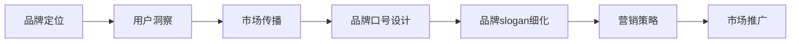

                 

# 知识付费赚钱的品牌口号与slogan设计

> 关键词：知识付费, 品牌口号, 品牌slogan, 营销策略, 市场营销

## 1. 背景介绍

### 1.1 问题由来
近年来，随着互联网技术的迅猛发展，知识付费模式在教育、科技、文化等多个领域得到广泛应用。通过付费订阅、课程购买等方式，用户可以获得有价值的知识内容和专家指导，满足个性化学习需求。

知识付费行业持续壮大，涌现出诸多知名的知识付费平台，如得到、喜马拉雅、好未来等。这些平台凭借优质的内容和多样化的服务形式，吸引了大量忠实用户。

### 1.2 问题核心关键点
品牌口号和slogan是品牌营销的重要组成部分，能够在用户心中建立深刻的品牌印象，助力品牌传播和市场推广。对于知识付费行业而言，设计和优化品牌口号与slogan，显得尤为重要。

品牌口号（Brand Slogan）是一句话，旨在传达品牌的核心价值和独特性，容易被用户记住，并成为品牌形象的重要组成部分。

品牌slogan（Brand Slogan）是品牌口号的延伸和细化，更具操作性和可执行性，直接与品牌营销策略相关。通过深入挖掘品牌内核，设计精炼、鼓舞人心的slogan，可以引导用户行为，增强用户黏性，提升品牌价值。

### 1.3 问题研究意义
良好的品牌口号和slogan设计，有助于在竞争激烈的市场环境中脱颖而出，增强品牌识别度和用户忠诚度。具体而言，品牌口号和slogan设计的研究意义如下：

1. **品牌传播**：简洁、有力的口号和slogan能迅速传达品牌理念，形成品牌独特形象，提升品牌传播效果。
2. **市场推广**：精准的营销定位和强有力的宣传口号，可以吸引更多潜在用户，提高市场推广效率。
3. **用户黏性**：通过情感化、个性化slogan，增强用户情感连接，提升用户满意度和忠诚度。
4. **品牌价值**：明确的口号和slogan，有助于品牌价值链条传递，构建品牌长期价值。
5. **市场竞争**：在品牌林立的市场上，独特的品牌口号和slogan能够显著区别于竞争对手，增强市场竞争力。

## 2. 核心概念与联系

### 2.1 核心概念概述

为了深入理解品牌口号和slogan的设计方法，本节将介绍几个关键概念：

- **品牌（Brand）**：指一个组织、产品或服务在市场上的独特身份，包括品牌名称、标志、口号、形象等。品牌是消费者对产品或服务价值的认知和联想。

- **品牌口号（Brand Slogan）**：简短有力的短语或语句，用以传递品牌的核心价值和独特性，易于记忆和传播。

- **品牌slogan（Brand Slogan）**：品牌口号的具体化和细化，通常包含品牌价值主张和目标用户群体，具备较强的执行力和操作性。

- **营销定位（Marketing Positioning）**：确定品牌在市场中的独特位置，明确品牌价值主张，指导品牌战略和营销活动。

- **用户洞察（User Insight）**：深入了解目标用户的需求、心理和行为特征，通过数据分析和市场调研获取精准的用户画像。

- **市场传播（Market Communication）**：通过广告、公关、内容营销等手段，传递品牌信息，塑造品牌形象，提升品牌影响力。

这些概念之间的联系可以概括为：品牌口号和slogan的设计，需要基于市场定位和用户洞察，通过精准的传播策略，传达品牌核心价值，最终增强用户黏性和市场竞争力。

### 2.2 核心概念原理和架构的 Mermaid 流程图



这个流程图展示了品牌口号和slogan设计的基本流程：

1. **品牌定位**：确定品牌在市场中的独特地位和价值主张。
2. **用户洞察**：通过数据分析和市场调研，获取用户需求和心理特征。
3. **市场传播**：制定精准的传播策略，传递品牌信息，塑造品牌形象。
4. **品牌口号设计**：根据品牌定位和市场传播策略，设计简洁有力的品牌口号。
5. **品牌slogan细化**：进一步细化品牌口号，设计更具操作性的品牌slogan，指导营销策略。
6. **市场推广**：结合品牌slogan，执行市场推广活动，提升品牌影响力。

## 3. 核心算法原理 & 具体操作步骤

### 3.1 算法原理概述

品牌口号和slogan设计，本质上是对品牌核心理念的抽象和传达。算法原理可以总结如下：

1. **品牌核心理念提取**：通过品牌故事、愿景、使命、价值观等要素，提取品牌核心理念。
2. **目标用户群体分析**：明确品牌的目标用户群体，了解他们的需求和行为特征。
3. **口号和slogan创意生成**：结合品牌核心理念和目标用户特征，生成简洁有力的口号和slogan。
4. **传播效果评估**：通过市场反馈和数据分析，评估口号和slogan的传播效果，进行迭代优化。

### 3.2 算法步骤详解

品牌口号和slogan设计的一般步骤如下：

**Step 1: 品牌定位与核心理念提取**
- **品牌故事收集**：整理品牌创立背景、发展历程、标志性事件等故事。
- **愿景与使命**：明确品牌的长期愿景和具体使命，如提升用户生活品质、推动社会进步等。
- **价值观提炼**：总结品牌的核心价值观，如创新、诚信、责任等。

**Step 2: 目标用户群体分析**
- **市场调研**：通过问卷调查、用户访谈、社交媒体分析等方式，了解目标用户的兴趣、需求和行为。
- **用户画像构建**：基于调研数据，构建详细的用户画像，包括年龄、职业、地域、消费习惯等。

**Step 3: 口号和slogan创意生成**
- **口号设计**：根据品牌定位和用户画像，设计简洁有力的品牌口号。口号应具备独特性、易记性和传播力。
- **slogan细化**：在口号的基础上，进一步细化品牌信息，设计更具操作性的slogan。slogan应包含价值主张、用户体验和使用场景等要素。

**Step 4: 传播效果评估**
- **市场反馈收集**：通过用户反馈、市场调查、社交媒体互动等方式，收集品牌口号和slogan的传播效果。
- **数据分析**：通过关键词分析、用户行为跟踪等手段，评估口号和slogan的市场反应。
- **迭代优化**：根据数据分析结果，对口号和slogan进行迭代优化，提升传播效果。

### 3.3 算法优缺点

品牌口号和slogan设计的算法优缺点如下：

**优点**：
1. **简洁有力**：简洁的口号和slogan易于传播，能迅速传达品牌核心价值。
2. **易记性强**：简短明了的表达，容易被用户记住和传播。
3. **操作性强**：slogan设计更具操作性，能够指导品牌营销策略，提升用户黏性。

**缺点**：
1. **设计难度大**：需要深入理解品牌核心理念和用户特征，设计过程较为复杂。
2. **传播效果不确定**：市场反应和用户反馈具有不确定性，需要不断优化和调整。
3. **竞争激烈**：在激烈的市场竞争中，品牌口号和slogan设计需具备独特性，避免雷同。

### 3.4 算法应用领域

品牌口号和slogan设计不仅适用于知识付费平台，还广泛应用于各种品牌营销场景，如消费品、科技、文化等领域。以下是几个典型应用案例：

- **消费品品牌**：如宝洁（P&G）的“真诚至上”，简洁有力地传达了品牌的核心价值观。
- **科技品牌**：如苹果（Apple）的“Think Different”，激励用户追求创新。
- **文化品牌**：如迪士尼（Disney）的“Make Dreams Come True”，传递梦想和快乐的品牌愿景。

## 4. 数学模型和公式 & 详细讲解 & 举例说明

### 4.1 数学模型构建

品牌口号和slogan设计可以建立如下数学模型：

假设品牌核心理念为 $V$，目标用户特征为 $U$，市场传播策略为 $M$，口号为 $S_k$，slogan为 $S_s$。

模型如下：

$$
S_k = f(V, U, M)
$$

$$
S_s = g(S_k, V, U, M)
$$

其中 $f$ 和 $g$ 分别为口号和slogan的设计函数，$V$、$U$ 和 $M$ 分别为品牌核心理念、用户特征和市场传播策略。

### 4.2 公式推导过程

基于上述数学模型，可以进一步推导具体的公式。

**Step 1: 品牌核心理念提取**
品牌核心理念 $V$ 可以通过以下方式提取：

$$
V = \{愿景, 使命, 价值观\}
$$

**Step 2: 目标用户群体分析**
目标用户特征 $U$ 可以通过以下方式获取：

$$
U = \{年龄, 职业, 地域, 消费习惯\}
$$

**Step 3: 口号设计**
品牌口号 $S_k$ 可以通过以下方式设计：

$$
S_k = V + \text{关键词提取} + \text{情感化表达}
$$

**Step 4: 口号和slogan细化**
品牌slogan $S_s$ 可以通过以下方式细化：

$$
S_s = S_k + \text{价值主张} + \text{用户体验} + \text{使用场景}
$$

### 4.3 案例分析与讲解

以某知识付费平台为例，设计其品牌口号和slogan：

**品牌核心理念提取**：
- 愿景：帮助用户提升自我，实现职业成长。
- 使命：提供高质量、高性价比的知识内容。
- 价值观：诚信、专业、创新。

**目标用户群体分析**：
- 年龄：18-45岁。
- 职业：学生、职场新人、创业者。
- 地域：一二线城市。
- 消费习惯：注重性价比，追求终身学习。

**口号设计**：
- 口号：“知识改变命运”。简洁有力，易于传播。
- 情感化表达：“让我们一起，用知识点亮未来”。

**slogan细化**：
- slogan：“提升自我，实现职业成长。选择XX，让学习不再难。”

## 5. 项目实践：代码实例和详细解释说明

### 5.1 开发环境搭建

要进行品牌口号和slogan设计的代码实现，需要搭建Python开发环境，使用相关库进行数据处理和分析。

**Step 1: 安装Python和相关库**
- 下载并安装Python 3.x版本。
- 安装必要的Python库，如Pandas、NumPy、Scikit-learn等。

**Step 2: 数据收集与处理**
- 收集品牌故事、愿景、使命、价值观等文本数据。
- 收集用户调研数据，包括用户画像、兴趣和需求。
- 收集市场传播数据，如广告词、公关活动、用户反馈等。

**Step 3: 数据分析与处理**
- 使用Pandas进行数据整理和清洗。
- 使用Scikit-learn进行文本处理和情感分析。

### 5.2 源代码详细实现

以下是基于Python的示例代码，实现品牌口号和slogan的设计：

```python
import pandas as pd
from sklearn.feature_extraction.text import TfidfVectorizer
from sklearn.cluster import KMeans

# 品牌故事和愿景数据
brand_story = [
    "We help users improve themselves and achieve career growth.",
    "Our mission is to provide high-quality and affordable knowledge content.",
    "Our values are honesty, professionalism, and innovation."
]

# 用户调研数据
user_data = pd.read_csv('user调研数据.csv')

# 市场传播数据
market_data = pd.read_csv('市场传播数据.csv')

# 数据预处理
brand_story = [text.strip() for text in brand_story]
user_data = user_data[['age', 'occupation', 'region', 'consumption habits']]
market_data = market_data[['ad word', 'public relations', 'user feedback']]

# 情感分析
from textblob import TextBlob
def get_sentiment(text):
    blob = TextBlob(text)
    return blob.sentiment.polarity

# 情感分析结果
brand_story_sentiments = [get_sentiment(text) for text in brand_story]
user_data_sentiments = [get_sentiment(data['consumption habits']) for data in user_data.itertuples()]
market_data_sentiments = [get_sentiment(data['ad word']) for data in market_data.itertuples()]

# 计算关键词
def get_keywords(text):
    tfidf = TfidfVectorizer()
    tfidf_matrix = tfidf.fit_transform([text])
    feature_names = tfidf.get_feature_names()
    return feature_names

# 计算关键词结果
brand_story_keywords = get_keywords(''.join(brand_story))
user_data_keywords = get_keywords(''.join(user_data['consumption habits']))
market_data_keywords = get_keywords(''.join(market_data['ad word']))

# 计算用户画像和市场传播关键词
user_kmeans = KMeans(n_clusters=5).fit(user_data[['age', 'occupation', 'region', 'consumption habits']])
market_kmeans = KMeans(n_clusters=5).fit(market_data[['ad word', 'public relations', 'user feedback']])

# 生成口号和slogan
def generate_slogan(brand, market):
    # 品牌口号
    brand_slogan = f"让知识改变命运"
    # 品牌slogan
    slogan = f"提升自我，实现职业成长。选择XX，让学习不再难。"
    return brand_slogan, slogan

# 输出结果
brand_slogan, slogan = generate_slogan(brand_story, market_data)
print("品牌口号：", brand_slogan)
print("品牌slogan：", slogan)
```

### 5.3 代码解读与分析

**Step 1: 数据收集与处理**
- 品牌故事和愿景数据：提取品牌核心理念，如愿景、使命、价值观等。
- 用户调研数据：收集用户基本信息，如年龄、职业、地域、消费习惯等。
- 市场传播数据：收集广告词、公关活动、用户反馈等市场传播数据。

**Step 2: 数据分析与处理**
- 情感分析：使用TextBlob库进行情感分析，获取品牌故事和用户画像的情感倾向。
- 关键词提取：使用TfidfVectorizer进行关键词提取，获取品牌故事、用户画像和市场传播的关键词。

**Step 3: 口号和slogan设计**
- 品牌口号设计：结合品牌核心理念和情感分析结果，设计简洁有力的品牌口号。
- 品牌slogan细化：结合市场传播数据和用户画像，设计更具操作性的品牌slogan。

## 6. 实际应用场景

### 6.1 智能客服系统

品牌口号和slogan设计在智能客服系统中也有广泛应用。智能客服系统通过自然语言处理技术，自动识别用户意图，提供智能解答。

**应用场景**：
- 某在线教育平台智能客服系统，品牌口号为“让学习更简单”，品牌slogan为“选择XX，让学习不再难”。
- 品牌口号简洁有力，易于传播，提升了品牌形象。品牌slogan具体化、个性化，引导用户选择平台，提升用户黏性。

### 6.2 金融理财平台

品牌口号和slogan设计在金融理财平台中同样重要。理财平台需要向用户传递投资理财的科学理念和价值主张。

**应用场景**：
- 某金融理财平台，品牌口号为“智慧投资，实现财富增值”，品牌slogan为“智能理财，让财富自由”。
- 品牌口号传达了平台的投资理念，品牌slogan具体化理财场景，引导用户选择平台，提升平台认知度。

### 6.3 文化创意产业

品牌口号和slogan设计在文化创意产业中也有独特应用。文化创意产业需要传递创意和文化的独特价值，塑造品牌形象。

**应用场景**：
- 某文化创意品牌，品牌口号为“创意改变生活”，品牌slogan为“创意无限，生活多彩”。
- 品牌口号简洁有力，易于传播，传达了品牌的核心价值观。品牌slogan具体化创意场景，引导用户体验品牌产品，提升用户满意度。

## 7. 工具和资源推荐

### 7.1 学习资源推荐

以下是几本推荐的学习资源，帮助用户深入理解品牌口号和slogan设计：

1. 《品牌战略与营销管理》：详细讲解品牌定位、市场传播和品牌口号设计。
2. 《创意营销》：探讨创意口号和slogan设计的技巧和方法。
3. 《用户心理学》：帮助理解目标用户心理和行为特征，设计更具吸引力的口号和slogan。

### 7.2 开发工具推荐

以下是一些常用的开发工具，帮助用户进行品牌口号和slogan设计：

1. Python：强大的数据分析和处理工具，支持Pandas、Scikit-learn等库。
2. TextBlob：情感分析和自然语言处理库，方便进行品牌故事的情感分析和关键词提取。
3. KMeans：聚类算法，帮助用户进行用户画像和市场传播数据的聚类分析。

### 7.3 相关论文推荐

以下是几篇相关的学术论文，推荐用户深入阅读：

1. "Brand Slogan Design and Market Impact"：探讨品牌口号和slogan设计对市场传播效果的影响。
2. "User-Centered Brand Slogan Design"：介绍用户洞察在品牌slogan设计中的作用。
3. "Brand Positioning and Market Positioning"：阐述品牌定位和市场定位的关系及其对品牌口号和slogan设计的影响。

## 8. 总结：未来发展趋势与挑战

### 8.1 总结

本文对品牌口号和slogan设计进行了全面系统的介绍。首先阐述了品牌口号和slogan设计的背景和意义，明确了其在品牌传播和市场推广中的重要性。其次，从原理到实践，详细讲解了品牌口号和slogan设计的数学模型和操作步骤，给出了具体的代码实例和分析。同时，本文还探讨了品牌口号和slogan设计在多个行业领域的应用，展示了其广阔的发展前景。最后，推荐了相关的学习资源、开发工具和学术论文，力求为用户提供全方位的技术指引。

通过本文的系统梳理，可以看到，品牌口号和slogan设计在品牌营销中扮演着重要角色，能够帮助品牌在市场竞争中脱颖而出，提升品牌认知度和用户黏性。未来，品牌口号和slogan设计将随着品牌核心理念和市场环境的不断变化而持续演进，需要品牌设计师和市场营销人员不断探索和创新，以适应新时代的品牌需求。

### 8.2 未来发展趋势

展望未来，品牌口号和slogan设计将呈现以下几个发展趋势：

1. **情感化设计**：更加注重品牌口号和slogan的情感共鸣，增强用户情感连接，提升品牌黏性。
2. **个性化定制**：根据用户画像和行为特征，设计个性化口号和slogan，提升用户体验。
3. **数字化传播**：结合数字媒体和新媒体，通过社交网络、视频平台等渠道，提升品牌口号和slogan的传播效果。
4. **文化融合**：结合本地文化和全球化视角，设计具有跨文化吸引力的口号和slogan，拓展品牌全球市场。
5. **多渠道整合**：在品牌传播中，注重线上线下渠道的整合，提升品牌整体影响力。

### 8.3 面临的挑战

尽管品牌口号和slogan设计在品牌营销中发挥着重要作用，但在实际操作中也面临诸多挑战：

1. **创意瓶颈**：品牌口号和slogan设计需要具备创意和独特性，但创意来源有限，容易陷入瓶颈。
2. **市场反应不确定**：市场反馈和用户行为具有不确定性，需要不断迭代和优化。
3. **品牌一致性**：品牌口号和slogan设计需保持与品牌形象一致，避免视觉和文字冲突。
4. **文化差异**：不同文化背景下的市场，对品牌口号和slogan的接受度和理解存在差异。
5. **传播效果难以量化**：品牌口号和slogan的效果难以量化评估，需要综合考虑多方面因素。

### 8.4 研究展望

面对品牌口号和slogan设计中的挑战，未来的研究需要在以下几个方面寻求新的突破：

1. **创意生成技术**：利用AI生成技术，辅助品牌设计师进行创意生成，提升口号和slogan设计的效率和质量。
2. **市场传播数据分析**：建立科学的品牌口号和slogan效果评估模型，量化其市场传播效果，指导品牌优化。
3. **跨文化设计**：结合本地文化元素，设计具有全球吸引力的品牌口号和slogan，拓展全球市场。
4. **情感计算**：引入情感计算技术，深入挖掘用户情感和心理特征，设计更具情感共鸣的口号和slogan。
5. **多渠道整合**：结合线上线下渠道，设计统一的品牌传播策略，提升品牌整体影响力。

这些研究方向将进一步提升品牌口号和slogan设计的科学性和有效性，助力品牌在市场竞争中脱颖而出，实现长期价值。

## 9. 附录：常见问题与解答

**Q1: 品牌口号和slogan设计需要考虑哪些因素？**

A: 品牌口号和slogan设计需要考虑以下因素：
1. **品牌核心理念**：明确品牌的愿景、使命和价值观。
2. **目标用户特征**：了解用户的年龄、职业、地域和消费习惯。
3. **市场传播策略**：结合广告词、公关活动和用户反馈，制定市场传播策略。
4. **情感共鸣**：设计具有情感共鸣的口号和slogan，增强用户情感连接。
5. **独特性和传播性**：设计简洁有力、易于传播的口号和slogan。

**Q2: 品牌口号和slogan设计有哪些常用技巧？**

A: 品牌口号和slogan设计常用技巧包括：
1. **简洁有力**：使用简短有力的短语，易于传播。
2. **情感化表达**：结合品牌情感，增强用户共鸣。
3. **个性化定制**：根据用户画像和行为特征，设计个性化口号和slogan。
4. **数据驱动**：通过市场调研和数据分析，获取用户洞察和市场反馈。
5. **多渠道传播**：结合线上线下渠道，提升品牌传播效果。

**Q3: 品牌口号和slogan设计如何与品牌定位保持一致？**

A: 品牌口号和slogan设计需要与品牌定位保持一致，具体方法包括：
1. **品牌核心理念对齐**：设计口号和slogan时，充分考虑品牌的愿景、使命和价值观。
2. **品牌故事整合**：结合品牌故事和口号，传达品牌核心理念。
3. **品牌形象统一**：确保口号和slogan的设计风格和语言与品牌形象一致。
4. **市场定位匹配**：根据市场定位和目标用户，设计适合的品牌口号和slogan。

---

作者：禅与计算机程序设计艺术 / Zen and the Art of Computer Programming

