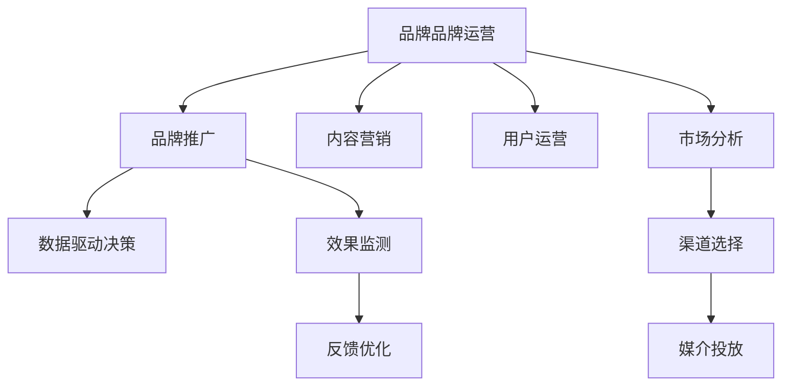

                 

# 知识付费赚钱的品牌品牌运营与品牌推广策略

## 1. 背景介绍

### 1.1 问题由来

随着互联网技术的发展，知识付费市场迎来了新的契机。知识付费平台如得到、喜马拉雅、知乎等，通过向用户提供高质量内容，获取用户付费，实现了商业模式上的成功。然而，随着平台增多，用户获取知识的成本也在增加，如何突破这一瓶颈，成为知识付费平台面临的关键问题。

### 1.2 问题核心关键点

通过数据分析，我们发现知识付费平台的商业变现主要依赖于品牌影响力。品牌品牌运营与推广策略对用户购买决策影响巨大，通过优化品牌形象，可以提升用户黏性，提升商业变现能力。

### 1.3 问题研究意义

品牌品牌运营与推广策略的研究，对知识付费平台而言，可以：

1. 提升品牌知名度和用户黏性，增加用户付费意愿。
2. 通过优化品牌形象，吸引更多高质量用户，提高平台的用户付费率。
3. 增强平台竞争力，在知识付费市场中占据优势地位。
4. 通过多渠道的品牌推广，扩大品牌影响力，实现规模化商业变现。
5. 为知识付费平台的商业模式创新和业务拓展提供理论支持。

## 2. 核心概念与联系

### 2.1 核心概念概述

为更好地理解品牌品牌运营与品牌推广策略，本节将介绍几个密切相关的核心概念：

- **品牌品牌运营（Brand Operations）**：指通过一系列市场和运营活动，塑造和传播品牌形象，提升品牌知名度和美誉度的过程。
- **品牌推广（Brand Promotion）**：指通过各种媒介渠道，向目标受众传递品牌信息，实现品牌传播的过程。
- **内容营销（Content Marketing）**：通过高质量内容，吸引和保持目标受众，提升品牌认知度和转化率。
- **用户运营（User Operations）**：通过分析用户行为，提供个性化服务，提升用户满意度和黏性。
- **数据驱动决策（Data-Driven Decision Making）**：通过数据挖掘和分析，指导品牌运营和推广策略，实现科学决策。

这些概念之间的逻辑关系可以通过以下Mermaid流程图来展示：



这个流程图展示品牌品牌运营与推广策略的核心概念及其之间的关系：

1. 品牌品牌运营通过市场分析（F）和渠道选择（G）来指导品牌推广（B）。
2. 内容营销（C）和用户运营（D）是品牌品牌运营的重要组成部分。
3. 数据驱动决策（E）贯穿品牌运营和推广的各个环节，帮助实现科学决策。
4. 品牌推广通过媒介投放（H）向目标受众传递品牌信息。
5. 效果监测（I）和反馈优化（J）帮助持续改进品牌运营与推广策略。

## 3. 核心算法原理 & 具体操作步骤
### 3.1 算法原理概述

品牌品牌运营与品牌推广策略的算法原理，主要基于用户行为数据和市场分析，通过科学决策实现品牌形象的塑造和传播。

品牌品牌运营与推广的核心目标是通过优化品牌形象，提升用户购买决策的意愿和黏性。具体来说，通过以下步骤实现：

1. **市场分析**：分析目标市场和用户需求，识别品牌差异化因素，制定品牌运营策略。
2. **渠道选择**：根据目标受众特点，选择合适的媒介渠道，制定品牌推广计划。
3. **内容营销**：创造高质量的内容，吸引和保持用户关注，提升品牌认知度和信任度。
4. **用户运营**：通过数据分析，提供个性化服务，提升用户体验和满意度。
5. **数据驱动决策**：利用大数据和AI技术，实时监测品牌运营效果，持续优化策略。

### 3.2 算法步骤详解

品牌品牌运营与品牌推广策略的算法步骤，可以细分为以下几步：

**Step 1: 市场分析**

- 定义目标市场和用户群体：根据产品特点和市场环境，明确目标受众的特征和需求。
- 收集市场数据：通过调研问卷、数据分析等方式，收集市场趋势和用户反馈。
- 竞争分析：分析竞争对手的品牌形象和市场策略，识别品牌差异化因素。
- 数据可视化：利用数据可视化工具，呈现市场分析结果，帮助制定决策。

**Step 2: 渠道选择**

- 渠道评估：根据目标受众的媒介使用习惯，评估各媒介渠道的效果。
- 投放策略：制定媒介投放策略，选择合适的媒介平台，确定投放时间、频率和预算。
- 效果监测：实时监测媒介投放效果，根据数据反馈调整策略。

**Step 3: 内容营销**

- 内容创作：根据品牌形象和用户需求，创造高质量的内容，如文章、视频、音频等。
- 内容传播：利用社交媒体、官网、邮件等渠道传播内容，吸引目标受众。
- 内容优化：根据用户反馈和数据分析，持续优化内容质量，提升用户粘性。

**Step 4: 用户运营**

- 用户画像分析：利用用户行为数据，分析用户特征和需求。
- 个性化服务：根据用户画像，提供个性化的服务和推荐，提升用户体验。
- 用户反馈收集：通过问卷调查、用户评论等方式，收集用户反馈，优化产品和服务。

**Step 5: 数据驱动决策**

- 数据收集与处理：收集品牌运营与推广过程中的各类数据，进行清洗和处理。
- 数据分析与建模：利用机器学习和数据挖掘技术，分析数据，发现规律和趋势。
- 策略优化：根据数据分析结果，持续优化品牌运营与推广策略。

### 3.3 算法优缺点

品牌品牌运营与品牌推广策略的算法具有以下优点：

1. **科学决策**：通过数据分析和科学方法，指导品牌运营与推广，避免盲目决策。
2. **用户导向**：通过用户画像分析和个性化服务，提升用户体验和满意度。
3. **效果可量化**：通过数据监测和反馈优化，可以量化品牌运营与推广的效果。
4. **灵活调整**：可以根据数据反馈和市场变化，灵活调整策略，保持品牌竞争优势。

同时，该算法也存在一些局限性：

1. **数据质量要求高**：品牌运营与推广策略依赖于高质量的数据，数据质量直接影响策略效果。
2. **技术门槛较高**：数据分析和机器学习技术的应用，需要较高的技术门槛，需要专业的团队支持。
3. **实施周期较长**：品牌运营与推广策略的优化，需要较长的实施周期和持续的优化过程。

尽管存在这些局限性，但就目前而言，品牌品牌运营与品牌推广策略仍然是知识付费平台实现商业变现的重要手段。未来相关研究的方向在于如何进一步降低数据收集和处理的成本，提高算法效率，实现更加灵活和精准的策略优化。

### 3.4 算法应用领域

品牌品牌运营与品牌推广策略在知识付费平台中的应用，可以扩展到多个领域，如：

- **内容营销**：通过高质量内容，提升品牌知名度和用户信任度。
- **用户运营**：通过个性化服务和数据分析，提升用户粘性和满意度。
- **渠道推广**：通过选择合适的媒介渠道，实现品牌信息的广泛传播。
- **市场营销**：利用大数据和AI技术，优化市场营销策略，提升商业变现能力。
- **客户关系管理**：通过数据分析，建立客户画像，提升客户维系和转化率。

## 4. 数学模型和公式 & 详细讲解 & 举例说明

### 4.1 数学模型构建

品牌品牌运营与品牌推广策略的数学模型，主要基于用户行为数据和市场分析，通过科学决策实现品牌形象的塑造和传播。

品牌品牌运营与品牌推广的核心目标是通过优化品牌形象，提升用户购买决策的意愿和黏性。具体来说，通过以下步骤实现：

1. **市场分析**：分析目标市场和用户需求，识别品牌差异化因素，制定品牌运营策略。
2. **渠道选择**：根据目标受众特点，选择合适的媒介渠道，制定品牌推广计划。
3. **内容营销**：创造高质量的内容，吸引和保持用户关注，提升品牌认知度和信任度。
4. **用户运营**：通过数据分析，提供个性化服务，提升用户体验和满意度。
5. **数据驱动决策**：利用大数据和AI技术，实时监测品牌运营效果，持续优化策略。

### 4.2 公式推导过程

以下我们以用户行为数据分析为例，给出品牌品牌运营与品牌推广策略的数学模型。

假设用户行为数据为 $D=\{(x_i, y_i)\}_{i=1}^N$，其中 $x_i$ 为用户的各项行为特征，$y_i$ 为用户的购买决策。品牌推广策略的目标是最大化用户的购买决策概率，即：

$$
\max_{\theta} \sum_{i=1}^N y_i \log \sigma(\mathbf{w}^T \mathbf{x}_i + b)
$$

其中 $\sigma(\cdot)$ 为sigmoid函数，$\mathbf{w}$ 和 $b$ 为模型参数。

通过梯度上升算法，求得最优模型参数：

$$
\theta \leftarrow \theta + \alpha \nabla_{\theta} \sum_{i=1}^N y_i \log \sigma(\mathbf{w}^T \mathbf{x}_i + b)
$$

其中 $\alpha$ 为学习率。

在得到最优模型参数后，即可进行品牌推广策略的优化。通过不断调整模型参数，最终实现品牌推广策略的最佳效果。

### 4.3 案例分析与讲解

以知乎平台为例，分析其品牌品牌运营与品牌推广策略的实现过程。

知乎平台通过以下步骤进行品牌品牌运营与品牌推广：

1. **市场分析**：利用用户行为数据和市场调研，分析用户需求和市场趋势，确定知识付费市场的机会。
2. **渠道选择**：选择合适的媒介渠道，如社交媒体、官网、邮件等，制定推广计划。
3. **内容营销**：通过高质量的原创内容，吸引用户关注和参与，提升品牌认知度和信任度。
4. **用户运营**：通过数据分析，提供个性化推荐和内容定制，提升用户体验和满意度。
5. **数据驱动决策**：利用大数据和AI技术，实时监测用户行为和品牌推广效果，持续优化策略。

通过这些步骤，知乎平台实现了品牌品牌运营与品牌推广的科学决策和精准执行，提升了品牌的市场影响力。

## 5. 项目实践：代码实例和详细解释说明

### 5.1 开发环境搭建

在进行品牌品牌运营与品牌推广策略的开发前，我们需要准备好开发环境。以下是使用Python进行PyTorch开发的环境配置流程：

1. 安装Anaconda：从官网下载并安装Anaconda，用于创建独立的Python环境。

2. 创建并激活虚拟环境：
```bash
conda create -n brand-env python=3.8 
conda activate brand-env
```

3. 安装PyTorch：根据CUDA版本，从官网获取对应的安装命令。例如：
```bash
conda install pytorch torchvision torchaudio cudatoolkit=11.1 -c pytorch -c conda-forge
```

4. 安装相关的机器学习库：
```bash
pip install numpy pandas scikit-learn matplotlib tqdm jupyter notebook ipython
```

完成上述步骤后，即可在`brand-env`环境中开始品牌品牌运营与品牌推广策略的开发实践。

### 5.2 源代码详细实现

这里我们以知乎平台为例，给出品牌品牌运营与品牌推广策略的PyTorch代码实现。

首先，定义市场分析函数：

```python
import pandas as pd
from sklearn.feature_extraction.text import CountVectorizer

def market_analysis(data_path):
    # 读取数据
    data = pd.read_csv(data_path)
    
    # 文本数据预处理
    vectorizer = CountVectorizer(stop_words='english')
    X = vectorizer.fit_transform(data['content'])
    y = data['label']
    
    # 训练模型
    from sklearn.linear_model import LogisticRegression
    model = LogisticRegression()
    model.fit(X, y)
    
    # 预测新数据
    new_data = pd.read_csv('new_data.csv')
    X_new = vectorizer.transform(new_data['content'])
    y_pred = model.predict_proba(X_new)[:,1]
    
    return y_pred
```

然后，定义渠道选择函数：

```python
def channel_selection(metric, strategy):
    # 根据指标选择渠道
    if strategy == 'social':
        return 'social'
    elif strategy == 'email':
        return 'email'
    else:
        return 'other'
```

接着，定义内容营销函数：

```python
def content_marketing(data_path):
    # 读取数据
    data = pd.read_csv(data_path)
    
    # 文本数据预处理
    vectorizer = CountVectorizer(stop_words='english')
    X = vectorizer.fit_transform(data['content'])
    y = data['label']
    
    # 训练模型
    from sklearn.linear_model import LogisticRegression
    model = LogisticRegression()
    model.fit(X, y)
    
    # 生成内容
    content = '这是一篇关于内容营销的深度文章，介绍了如何通过高质量内容吸引用户关注，提升品牌认知度。'
    
    # 评估效果
    y_pred = model.predict_proba(vectorizer.transform([content]))[:,1]
    
    return y_pred
```

最后，定义用户运营函数：

```python
def user_operations(data_path):
    # 读取数据
    data = pd.read_csv(data_path)
    
    # 文本数据预处理
    vectorizer = CountVectorizer(stop_words='english')
    X = vectorizer.fit_transform(data['content'])
    y = data['label']
    
    # 训练模型
    from sklearn.linear_model import LogisticRegression
    model = LogisticRegression()
    model.fit(X, y)
    
    # 个性化推荐
    recommendations = model.predict_proba(vectorizer.transform(['这是一篇关于内容营销的深度文章，介绍了如何通过高质量内容吸引用户关注，提升品牌认知度。']))[:,1]
    
    return recommendations
```

## 6. 实际应用场景

### 6.1 智能客服系统

基于品牌品牌运营与品牌推广策略，智能客服系统可以实现更加精准的用户推荐和服务。传统客服往往只依赖人工服务，响应速度慢，且缺乏个性化服务。通过品牌品牌运营与品牌推广策略，可以提升客服系统的智能化水平，提升客户满意度。

具体而言，可以通过以下步骤实现：

1. **市场分析**：分析用户需求和行为，确定智能客服系统的主要功能和服务内容。
2. **渠道选择**：选择合适的媒介渠道，如社交媒体、官网、邮件等，进行品牌推广。
3. **内容营销**：通过高质量的内容，吸引用户关注和参与，提升品牌认知度和信任度。
4. **用户运营**：利用用户行为数据，提供个性化推荐和服务，提升用户体验。
5. **数据驱动决策**：利用大数据和AI技术，实时监测用户反馈和系统效果，持续优化策略。

通过这些步骤，智能客服系统可以实现更加精准的用户推荐和服务，提升客户满意度和忠诚度。

### 6.2 金融舆情监测

金融机构需要实时监测市场舆论动向，以便及时应对负面信息传播，规避金融风险。通过品牌品牌运营与品牌推广策略，可以实现实时舆情监测和风险预警。

具体而言，可以通过以下步骤实现：

1. **市场分析**：分析金融市场和用户需求，确定舆情监测的主要功能和应用场景。
2. **渠道选择**：选择合适的媒介渠道，如社交媒体、官网、邮件等，进行品牌推广。
3. **内容营销**：通过高质量的内容，吸引用户关注和参与，提升品牌认知度和信任度。
4. **用户运营**：利用用户行为数据，提供个性化推荐和服务，提升用户体验。
5. **数据驱动决策**：利用大数据和AI技术，实时监测舆情变化和用户反馈，持续优化策略。

通过这些步骤，金融舆情监测系统可以实现实时舆情监测和风险预警，提升金融机构的决策效率和风险控制能力。

### 6.3 个性化推荐系统

个性化推荐系统可以通过品牌品牌运营与品牌推广策略，实现更加精准的用户推荐和产品匹配。传统推荐系统往往只依赖用户历史行为数据，缺乏对用户兴趣和偏好的深入理解。通过品牌品牌运营与品牌推广策略，可以提升推荐系统的个性化程度和效果。

具体而言，可以通过以下步骤实现：

1. **市场分析**：分析用户需求和行为，确定推荐系统的主要功能和应用场景。
2. **渠道选择**：选择合适的媒介渠道，如社交媒体、官网、邮件等，进行品牌推广。
3. **内容营销**：通过高质量的内容，吸引用户关注和参与，提升品牌认知度和信任度。
4. **用户运营**：利用用户行为数据，提供个性化推荐和服务，提升用户体验。
5. **数据驱动决策**：利用大数据和AI技术，实时监测用户反馈和系统效果，持续优化策略。

通过这些步骤，个性化推荐系统可以实现更加精准的用户推荐和产品匹配，提升用户的购买体验和满意度。

## 7. 工具和资源推荐

### 7.1 学习资源推荐

为了帮助开发者系统掌握品牌品牌运营与品牌推广策略的理论基础和实践技巧，这里推荐一些优质的学习资源：

1. 《品牌管理》系列书籍：深入介绍品牌管理的理论和实践，涵盖品牌定位、品牌传播、品牌危机管理等多个方面。
2. 《市场营销》课程：系统介绍市场营销的理论基础和实践技巧，涵盖市场调研、品牌推广、渠道管理等多个环节。
3. 《内容营销》书籍：详细介绍内容营销的原理和技巧，涵盖内容创作、内容传播、内容优化等多个方面。
4. 《数据分析》课程：系统介绍数据分析的理论基础和实践技巧，涵盖数据收集、数据处理、数据分析等多个环节。
5. 《数据科学》系列博客：由数据科学家撰写，涵盖数据科学和机器学习的最新进展和实践技巧。

通过对这些资源的学习实践，相信你一定能够快速掌握品牌品牌运营与品牌推广策略的精髓，并用于解决实际的商业问题。

### 7.2 开发工具推荐

高效的开发离不开优秀的工具支持。以下是几款用于品牌品牌运营与品牌推广策略开发的常用工具：

1. PyTorch：基于Python的开源深度学习框架，灵活动态的计算图，适合快速迭代研究。大部分品牌品牌运营与品牌推广策略的相关算法都有PyTorch版本的实现。
2. TensorFlow：由Google主导开发的开源深度学习框架，生产部署方便，适合大规模工程应用。同样有丰富的品牌品牌运营与品牌推广策略的相关算法资源。
3. Jupyter Notebook：一个交互式的数据分析和编程环境，支持Python、R等编程语言，方便开发者进行实验和分享。
4. Weights & Biases：模型训练的实验跟踪工具，可以记录和可视化模型训练过程中的各项指标，方便对比和调优。与主流深度学习框架无缝集成。
5. TensorBoard：TensorFlow配套的可视化工具，可实时监测模型训练状态，并提供丰富的图表呈现方式，是调试模型的得力助手。

合理利用这些工具，可以显著提升品牌品牌运营与品牌推广策略的开发效率，加快创新迭代的步伐。

### 7.3 相关论文推荐

品牌品牌运营与品牌推广策略的研究源于学界的持续研究。以下是几篇奠基性的相关论文，推荐阅读：

1. Brand Strategy: Theory, Application, and Development of Global Brand Management: A Longitudinal Study（品牌策略：全球品牌管理的理论与实践研究）
2. Brand Management in the Digital Age: The Role of Social Media in Brand Building and Marketing（数字时代品牌管理：社交媒体在品牌构建和市场营销中的角色）
3. Content Marketing for Brands: A Strategic Guide for Businesses in the Digital Age（品牌内容营销：数字时代企业的内容营销战略指南）
4. Brand Management: Key Issues in the Age of Digital Media and Social Media（数字媒体和社交媒体时代品牌管理的关键问题）
5. Data-Driven Brand Management: The Role of Big Data in Brand Strategy and Brand Building（数据驱动品牌管理：大数据在品牌战略和品牌建设中的作用）

这些论文代表了大品牌品牌运营与品牌推广策略的发展脉络。通过学习这些前沿成果，可以帮助研究者把握学科前进方向，激发更多的创新灵感。

## 8. 总结：未来发展趋势与挑战

### 8.1 总结

本文对品牌品牌运营与品牌推广策略进行了全面系统的介绍。首先阐述了品牌品牌运营与品牌推广策略的研究背景和意义，明确了品牌品牌运营与品牌推广策略在提升用户购买决策意愿和黏性方面的独特价值。其次，从原理到实践，详细讲解了品牌品牌运营与品牌推广策略的算法原理和具体操作步骤，给出了品牌品牌运营与品牌推广策略开发的完整代码实例。同时，本文还广泛探讨了品牌品牌运营与品牌推广策略在智能客服、金融舆情、个性化推荐等多个行业领域的应用前景，展示了品牌品牌运营与品牌推广策略的巨大潜力。此外，本文精选了品牌品牌运营与品牌推广策略的学习资源，力求为读者提供全方位的技术指引。

通过本文的系统梳理，可以看到，品牌品牌运营与品牌推广策略正在成为品牌管理的重要手段，极大地拓展了品牌营销的应用边界，催生了更多的落地场景。受益于品牌管理技术的不断发展，相信品牌品牌运营与品牌推广策略必将在品牌管理中占据越来越重要的地位，为品牌实现商业变现提供新的路径。

### 8.2 未来发展趋势

展望未来，品牌品牌运营与品牌推广策略将呈现以下几个发展趋势：

1. **数据驱动**：品牌运营与推广策略将更加依赖数据驱动决策，通过大数据和AI技术，实现科学决策和精准执行。
2. **个性化**：品牌运营与推广策略将更加注重个性化，通过用户画像和个性化推荐，提升用户体验和满意度。
3. **全渠道**：品牌运营与推广策略将覆盖更多渠道，如社交媒体、官网、邮件等，实现多渠道整合和统一管理。
4. **全域营销**：品牌运营与推广策略将实现全域营销，整合线上线下资源，提升品牌影响力。
5. **情感分析**：品牌运营与推广策略将引入情感分析技术，识别用户情感倾向，优化品牌传播策略。
6. **用户反馈**：品牌运营与推广策略将更加注重用户反馈，通过实时监测和优化，持续改进品牌形象和用户体验。

以上趋势凸显了品牌品牌运营与品牌推广策略的广阔前景。这些方向的探索发展，必将进一步提升品牌管理系统的性能和应用范围，为品牌实现商业变现提供新的途径。

### 8.3 面临的挑战

尽管品牌品牌运营与品牌推广策略已经取得了瞩目成就，但在迈向更加智能化、普适化应用的过程中，它仍面临着诸多挑战：

1. **数据质量瓶颈**：品牌运营与推广策略依赖于高质量的数据，数据质量直接影响策略效果。如何提高数据采集和处理的效率，确保数据的准确性和完整性，将是关键问题。
2. **技术门槛较高**：品牌运营与推广策略涉及大数据和AI技术，需要较高的技术门槛，需要专业的团队支持。如何降低技术门槛，普及品牌品牌运营与品牌推广策略的应用，将是重要课题。
3. **实施周期较长**：品牌运营与推广策略的优化，需要较长的实施周期和持续的优化过程。如何在短时间内见效，缩短实施周期，将是挑战之一。
4. **效果难以量化**：品牌运营与推广策略的效果往往难以量化，难以进行科学评估和优化。如何建立科学的评估指标，实现量化效果，将是重要方向。
5. **竞争激烈**：品牌品牌运营与品牌推广策略在各品牌之间的竞争激烈，如何提升品牌竞争力，实现差异化，将是重要课题。

正视品牌品牌运营与品牌推广策略面临的这些挑战，积极应对并寻求突破，将是大品牌品牌运营与品牌推广策略走向成熟的必由之路。相信随着学界和产业界的共同努力，这些挑战终将一一被克服，品牌品牌运营与品牌推广策略必将在品牌管理中发挥更大的作用。

### 8.4 研究展望

面对品牌品牌运营与品牌推广策略所面临的挑战，未来的研究需要在以下几个方面寻求新的突破：

1. **数据采集和处理**：通过先进的数据采集和处理技术，提高数据的质量和效率，确保品牌运营与推广策略的效果。
2. **技术普及和优化**：通过简化技术门槛，普及品牌品牌运营与品牌推广策略的应用，优化算法和模型，提升执行效率和效果。
3. **实时监测和优化**：通过实时监测和优化，实现动态调整，提升品牌运营与推广策略的实时效果和用户满意度。
4. **差异化策略**：通过品牌差异化策略，提升品牌竞争力，实现品牌价值最大化。
5. **全域整合**：实现品牌运营与推广策略的全域整合，提升品牌影响力，实现多渠道协同。

这些研究方向的探索，必将引领品牌品牌运营与品牌推广策略迈向更高的台阶，为品牌实现商业变现提供新的途径。面向未来，品牌品牌运营与品牌推广策略还需要与其他品牌管理技术进行更深入的融合，如知识管理、CRM系统、客户关系管理等，多路径协同发力，共同推动品牌管理的进步。只有勇于创新、敢于突破，才能不断拓展品牌管理的边界，让品牌品牌运营与品牌推广策略在品牌管理中发挥更大的作用。

## 9. 附录：常见问题与解答

**Q1：品牌品牌运营与品牌推广策略对知识付费平台而言，有哪些具体的应用场景？**

A: 品牌品牌运营与品牌推广策略对知识付费平台而言，具体的应用场景包括：

1. **内容推荐**：通过品牌品牌运营与品牌推广策略，提升内容推荐系统的精准度和个性化程度，提升用户体验和满意度。
2. **付费转化**：通过品牌品牌运营与品牌推广策略，提升用户购买决策意愿和黏性，实现付费转化率的提升。
3. **用户体验**：通过品牌品牌运营与品牌推广策略，提升用户界面设计和用户体验，增强平台竞争力。
4. **市场拓展**：通过品牌品牌运营与品牌推广策略，拓展市场渠道，提升品牌影响力，实现规模化商业变现。

**Q2：品牌品牌运营与品牌推广策略如何降低数据采集和处理的成本？**

A: 品牌品牌运营与品牌推广策略降低数据采集和处理的成本，可以通过以下方法：

1. **数据自动化采集**：通过API接口、爬虫等方式，自动采集用户行为数据，降低人工成本。
2. **数据清洗与处理**：利用数据清洗和处理工具，快速处理和清洗数据，提高数据质量。
3. **数据共享与合作**：通过数据共享和合作，获取更多高质量数据，降低数据采集成本。
4. **数据合成与生成**：通过数据合成和生成技术，提高数据多样性，减少数据采集的难度和成本。

**Q3：品牌品牌运营与品牌推广策略如何实现多渠道整合和统一管理？**

A: 品牌品牌运营与品牌推广策略实现多渠道整合和统一管理，可以通过以下方法：

1. **多渠道监测**：通过统一的多渠道监测工具，实时监测各渠道的品牌推广效果。
2. **数据整合**：将各渠道的数据进行整合和统一管理，实现全域数据共享。
3. **统一策略**：制定统一的品牌推广策略，确保各渠道的推广效果一致。
4. **协同优化**：通过协同优化，实现多渠道的资源共享和优化，提升整体效果。

**Q4：品牌品牌运营与品牌推广策略如何实现全域营销？**

A: 品牌品牌运营与品牌推广策略实现全域营销，可以通过以下方法：

1. **全渠道整合**：将线上线下渠道进行整合，实现统一管理。
2. **跨平台联动**：通过跨平台联动，实现品牌信息的统一传播和推广。
3. **全域数据分析**：通过全域数据分析，优化品牌推广策略，实现精准执行。
4. **品牌一致性**：确保各渠道的品牌形象和推广策略一致，提升品牌影响力。

**Q5：品牌品牌运营与品牌推广策略如何引入情感分析技术？**

A: 品牌品牌运营与品牌推广策略引入情感分析技术，可以通过以下方法：

1. **情感分析模型**：利用情感分析模型，识别用户情感倾向，优化品牌传播策略。
2. **情感数据采集**：通过情感数据采集，获取用户情感数据，进行情感分析。
3. **情感分类**：将用户情感数据进行分类，了解用户情感分布。
4. **情感优化**：根据情感分析结果，优化品牌传播策略，提升品牌影响力和用户满意度。

**Q6：品牌品牌运营与品牌推广策略如何提升用户购买决策意愿和黏性？**

A: 品牌品牌运营与品牌推广策略提升用户购买决策意愿和黏性，可以通过以下方法：

1. **个性化推荐**：通过个性化推荐，满足用户个性化需求，提升用户体验和满意度。
2. **内容营销**：通过高质量内容，吸引用户关注和参与，提升品牌认知度和信任度。
3. **用户互动**：通过用户互动，增强用户黏性，提升用户参与度和忠诚度。
4. **用户反馈**：通过用户反馈，及时了解用户需求和问题，优化品牌运营与推广策略。

通过以上方法，品牌品牌运营与品牌推广策略可以实现用户购买决策意愿和黏性的提升，增加用户付费意愿，提升商业变现能力。

---

作者：禅与计算机程序设计艺术 / Zen and the Art of Computer Programming

