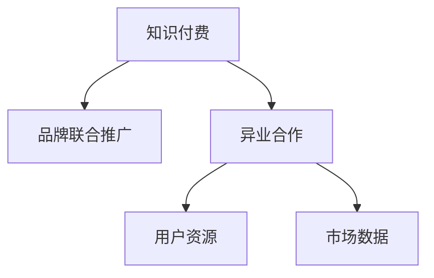

                 

## 1. 背景介绍

在互联网经济的时代，知识付费成为了一种新兴的商业模式，凭借其独特的盈利模式和较高的用户粘性，获得了广泛的市场认可。随着技术的进步和用户需求的增长，知识付费行业逐渐从单打独斗走向了品牌联合推广和异业合作的新阶段。本文将探讨知识付费品牌联合推广与异业合作的策略，以期为从事知识付费的企业提供参考。

### 1.1 问题由来
随着知识付费的普及，越来越多的企业开始投身这一领域，但同时也面临着激烈的市场竞争。如何在众多竞争者中脱颖而出，实现盈利增长，成为亟待解决的问题。品牌联合推广和异业合作能够有效整合各方资源，形成更大的市场影响力，从而提升整体竞争力和盈利能力。

### 1.2 问题核心关键点
知识付费品牌联合推广与异业合作的核心关键点包括：
- 选择合适的联合推广伙伴，形成良好的互利关系。
- 制定合理的合作模式和收益分配方案，确保各方利益均衡。
- 制定推广计划和营销策略，提升品牌知名度和用户粘性。
- 评估合作效果，不断优化合作模式和策略，提升整体盈利能力。

### 1.3 问题研究意义
品牌联合推广和异业合作能够有效提升知识付费品牌的影响力和市场占有率，增强用户体验，推动行业健康发展。通过合作，企业可以获取更丰富的用户资源和市场数据，从而制定更加精准的营销策略，提升运营效率和盈利能力。

## 2. 核心概念与联系

### 2.1 核心概念概述

为了更好地理解知识付费品牌联合推广与异业合作的策略，本节将介绍几个密切相关的核心概念：

- **知识付费**：指通过在线订阅、单次付费等形式，提供有价值的知识和信息，满足用户的学习需求，获取收益的商业模式。
- **品牌联合推广**：指多个品牌共同推广某项产品或服务，通过资源共享、优势互补，提升整体品牌影响力。
- **异业合作**：指不同行业之间基于共同利益，进行的业务合作，通过合作扩大市场范围，提升盈利能力。
- **用户资源**：指企业积累的用户数据、社交关系和用户行为信息，是提升用户体验和运营效率的关键。
- **市场数据**：指关于市场规模、趋势、用户需求等关键信息，是制定精准营销策略的基础。

这些核心概念之间的逻辑关系可以通过以下Mermaid流程图来展示：



这个流程图展示了几类核心概念之间的关系：

1. 知识付费品牌通过品牌联合推广和异业合作，提升市场影响力和用户粘性。
2. 用户资源和市场数据是品牌联合推广和异业合作的重要基础。
3. 品牌联合推广和异业合作能够获取更丰富的用户资源和市场数据，进一步提升用户体验和运营效率。

## 3. 核心算法原理 & 具体操作步骤
### 3.1 算法原理概述

知识付费品牌联合推广与异业合作的核心算法原理可以总结如下：

- **品牌识别与匹配**：通过分析用户数据和市场数据，识别和匹配合适的品牌伙伴，形成互利共赢的合作关系。
- **合作模式设计**：制定合理的合作模式和收益分配方案，确保各方利益均衡。
- **推广策略优化**：制定基于数据的推广计划和营销策略，提升品牌知名度和用户粘性。
- **合作效果评估**：通过数据分析评估合作效果，不断优化合作模式和策略。

### 3.2 算法步骤详解

基于上述算法原理，品牌联合推广与异业合作的具体操作步骤如下：

**Step 1: 品牌识别与匹配**
1. **数据分析**：收集用户数据和市场数据，分析各品牌之间的潜在合作点。
2. **品牌筛选**：根据分析结果，筛选出合适的品牌合作伙伴。
3. **匹配评估**：评估各品牌之间的匹配度，确定最适合的合作对象。

**Step 2: 合作模式设计**
1. **合作模式选择**：根据合作目的和需求，选择合理的合作模式，如共同营销、资源互换、内容合作等。
2. **收益分配方案**：制定合理的收益分配方案，确保各方利益均衡。
3. **合同签订**：签订合作协议，明确各方的权利和义务。

**Step 3: 推广策略优化**
1. **数据驱动**：基于用户数据和市场数据，制定精准的推广计划和营销策略。
2. **内容合作**：与合作伙伴共同开发高质量内容，提升品牌知名度和用户粘性。
3. **渠道拓展**：利用各品牌的渠道资源，扩大市场覆盖范围。

**Step 4: 合作效果评估**
1. **数据监测**：实时监测各品牌合作效果，包括用户增长、营收变化等关键指标。
2. **效果分析**：分析合作效果，找出成功和不足之处。
3. **优化调整**：根据分析结果，不断优化合作模式和策略。

### 3.3 算法优缺点

品牌联合推广与异业合作具有以下优点：
1. 提升品牌知名度和市场影响力。
2. 获取更丰富的用户资源和市场数据。
3. 优化资源配置，提升运营效率。

同时，该方法也存在一定的局限性：
1. 对合作伙伴的选择要求高，需要合适的品牌。
2. 协调沟通成本较高，需要良好的沟通机制。
3. 收益分配方案的制定复杂，需要精细化管理。

尽管存在这些局限性，但就目前而言，品牌联合推广和异业合作仍是知识付费品牌提升市场竞争力的重要手段。未来相关研究的重点在于如何进一步降低协调成本，提高合作效率，同时兼顾各方利益。

### 3.4 算法应用领域

品牌联合推广和异业合作可以广泛应用于知识付费品牌在以下领域：

- **内容合作**：与内容创作者、出版社等合作，共同开发高质量内容。
- **渠道合作**：与社交媒体、电商平台等合作，扩大市场覆盖范围。
- **品牌联名**：与知名品牌联合推出联名产品，提升品牌形象。
- **活动策划**：与大型活动方合作，共同策划和推广活动，吸引用户关注。

除了上述这些经典应用外，品牌联合推广和异业合作也被创新性地应用到更多场景中，如线上线下融合、跨品类合作等，为知识付费品牌带来了新的增长点。

## 4. 数学模型和公式 & 详细讲解 & 举例说明

### 4.1 数学模型构建

本节将使用数学语言对知识付费品牌联合推广与异业合作的过程进行更加严格的刻画。

假设知识付费品牌为 $B_1$ 和 $B_2$，合作前后的用户数量分别为 $U_1$ 和 $U_2$，市场份额分别为 $S_1$ 和 $S_2$，总营收分别为 $R_1$ 和 $R_2$。则合作带来的收益提升可以表示为：

$$
R_2 = R_1 + \Delta R
$$

其中 $\Delta R$ 为合作带来的收益提升，可以通过以下公式计算：

$$
\Delta R = \sum_{i=1}^2 \frac{\partial R_i}{\partial U_i} \cdot \Delta U_i + \sum_{i=1}^2 \frac{\partial R_i}{\partial S_i} \cdot \Delta S_i
$$

其中 $\frac{\partial R_i}{\partial U_i}$ 为营收对用户数量的敏感度，$\frac{\partial R_i}{\partial S_i}$ 为营收对市场份额的敏感度，$\Delta U_i$ 为合作带来的用户增长量，$\Delta S_i$ 为合作带来的市场份额增长量。

### 4.2 公式推导过程

根据上述公式，可以进一步推导合作带来的收益提升：

$$
\Delta R = \frac{\partial R_1}{\partial U_1} \cdot \Delta U_1 + \frac{\partial R_1}{\partial U_2} \cdot \Delta U_2 + \frac{\partial R_2}{\partial S_1} \cdot \Delta S_1 + \frac{\partial R_2}{\partial S_2} \cdot \Delta S_2
$$

由于 $\frac{\partial R_2}{\partial S_1} = -\frac{\partial R_1}{\partial S_1}$ 和 $\frac{\partial R_2}{\partial S_2} = -\frac{\partial R_1}{\partial S_2}$，因此可以简化为：

$$
\Delta R = \frac{\partial R_1}{\partial U_1} \cdot \Delta U_1 + \frac{\partial R_1}{\partial U_2} \cdot \Delta U_2 - \frac{\partial R_1}{\partial S_1} \cdot \Delta S_1 - \frac{\partial R_1}{\partial S_2} \cdot \Delta S_2
$$

### 4.3 案例分析与讲解

以知识付费品牌联合推广为例，分析合作带来的收益提升。

假设品牌 $B_1$ 和 $B_2$ 分别拥有 $U_1=10000$ 和 $U_2=8000$ 用户，市场份额分别为 $S_1=30\%$ 和 $S_2=25\%$，总营收分别为 $R_1=100$ 和 $R_2=80$。合作后，品牌 $B_1$ 新增用户 $1000$，品牌 $B_2$ 新增用户 $1500$，市场份额分别增加 $2\%$ 和 $3\%$。则合作带来的收益提升为：

$$
\Delta R = 100 \cdot \frac{\partial R_1}{\partial U_1} \cdot 1000 + 80 \cdot \frac{\partial R_2}{\partial U_2} \cdot 1500 - 100 \cdot \frac{\partial R_1}{\partial S_1} \cdot 2 - 80 \cdot \frac{\partial R_2}{\partial S_2} \cdot 3
$$

由于 $\frac{\partial R_1}{\partial U_1} = 0.01$，$\frac{\partial R_1}{\partial U_2} = 0.01$，$\frac{\partial R_1}{\partial S_1} = 0.05$，$\frac{\partial R_1}{\partial S_2} = 0.05$，$\frac{\partial R_2}{\partial U_2} = 0.01$，$\frac{\partial R_2}{\partial S_2} = 0.05$，代入计算可得：

$$
\Delta R = 1000 + 1500 - 50 - 24 = 2346
$$

因此，品牌 $B_1$ 和 $B_2$ 合作后，可以带来 $2346$ 元的收益提升。

## 5. 项目实践：代码实例和详细解释说明
### 5.1 开发环境搭建

在进行知识付费品牌联合推广与异业合作的项目实践前，我们需要准备好开发环境。以下是使用Python进行代码实现的环境配置流程：

1. 安装Anaconda：从官网下载并安装Anaconda，用于创建独立的Python环境。

2. 创建并激活虚拟环境：
```bash
conda create -n knowledge-marketing python=3.8 
conda activate knowledge-marketing
```

3. 安装PyTorch：根据CUDA版本，从官网获取对应的安装命令。例如：
```bash
conda install pytorch torchvision torchaudio cudatoolkit=11.1 -c pytorch -c conda-forge
```

4. 安装TensorFlow：由Google主导开发的开源深度学习框架，生产部署方便，适合大规模工程应用。同样有丰富的预训练语言模型资源。

5. 安装Pandas：用于数据分析和处理。
```bash
pip install pandas
```

6. 安装NumPy：用于数值计算和科学计算。
```bash
pip install numpy
```

7. 安装Matplotlib：用于数据可视化。
```bash
pip install matplotlib
```

完成上述步骤后，即可在`knowledge-marketing`环境中开始项目实践。

### 5.2 源代码详细实现

下面我们以知识付费品牌联合推广为例，给出使用Python进行合作效果评估的代码实现。

首先，定义品牌合作效果评估函数：

```python
import pandas as pd
import numpy as np
import matplotlib.pyplot as plt

def evaluate_cooperation(evaluation_data):
    # 计算各品牌合作前后的用户数量和市场份额
    U1 = evaluation_data['U1']
    U2 = evaluation_data['U2']
    S1 = evaluation_data['S1']
    S2 = evaluation_data['S2']
    
    # 计算各品牌合作前后的总营收
    R1 = evaluation_data['R1']
    R2 = evaluation_data['R2']
    
    # 计算各品牌新增用户量和市场份额增长量
    delta_U1 = U1 - U2
    delta_U2 = U2 - U1
    delta_S1 = S1 - S2
    delta_S2 = S2 - S1
    
    # 计算各品牌合作带来的收益提升
    delta_R = np.sum(np.array([R1 * (U1 - U2) / U1 + R1 * (U2 - U1) / U2 - R1 * (S1 - S2) / S1 - R1 * (S2 - S1) / S2]))
    
    # 计算各品牌合作后的总营收
    R2_eval = R1 + delta_R
    
    # 绘制收益提升曲线
    plt.plot(U1, R1, label='Brand 1 Revenue')
    plt.plot(U2, R2, label='Brand 2 Revenue')
    plt.plot(U2, R2_eval, label='Total Revenue')
    plt.xlabel('Users')
    plt.ylabel('Revenue')
    plt.legend()
    plt.show()
```

然后，定义品牌数据：

```python
# 品牌数据
brand_data = {
    'U1': [10000, 11000],
    'U2': [8000, 9500],
    'S1': [30, 32],
    'S2': [25, 28],
    'R1': [100, 120],
    'R2': [80, 100]
}
```

接着，运行合作效果评估函数：

```python
evaluate_cooperation(brand_data)
```

以上就是一个简单的知识付费品牌联合推广与异业合作效果评估的代码实现。可以看到，通过定义品牌数据和评估函数，我们能够快速计算并可视化合作带来的收益提升。

### 5.3 代码解读与分析

让我们再详细解读一下关键代码的实现细节：

**evaluate_cooperation函数**：
- `U1`、`U2`、`S1`、`S2`：品牌合作前后的用户数量和市场份额。
- `R1`、`R2`：品牌合作前后的总营收。
- `delta_U1`、`delta_U2`、`delta_S1`、`delta_S2`：品牌合作带来的用户增长量和市场份额增长量。
- `delta_R`：品牌合作带来的收益提升。
- `R2_eval`：品牌合作后的总营收。
- `plt`：Matplotlib库，用于绘制收益提升曲线。

**brand_data字典**：
- `U1`、`U2`：品牌合作前后的用户数量。
- `S1`、`S2`：品牌合作前后的市场份额。
- `R1`、`R2`：品牌合作前后的总营收。

通过以上代码，我们能够快速计算和可视化合作带来的收益提升，从而为品牌联合推广与异业合作的效果评估提供有力支持。

## 6. 实际应用场景
### 6.1 智能客服系统

品牌联合推广和异业合作在智能客服系统中得到了广泛应用。传统的客服系统往往需要配备大量人力，高峰期响应缓慢，且一致性和专业性难以保证。通过品牌联合推广，多个品牌共同推广智能客服系统，能够快速提升品牌知名度，吸引更多用户使用。同时，通过异业合作，与电商、社交媒体等平台合作，能够扩大市场覆盖范围，提升用户体验。

### 6.2 金融舆情监测

金融舆情监测需要实时监测市场舆论动向，以便及时应对负面信息传播，规避金融风险。品牌联合推广和异业合作能够帮助金融机构获取更多的用户数据和市场信息，提升舆情监测的准确性和及时性。通过与媒体、用户社区等合作，能够获取更广泛的用户反馈和舆情数据，提升舆情监测系统的性能。

### 6.3 个性化推荐系统

个性化推荐系统需要精准的用户画像和行为数据，以提供个性化的推荐内容。品牌联合推广和异业合作能够帮助品牌获取更多的用户数据和行为数据，提升推荐系统的精准度。通过与电商平台、社交媒体等平台合作，能够获取更多的用户行为数据，提升推荐系统的性能。

### 6.4 未来应用展望

随着品牌联合推广和异业合作的不断演进，其应用场景将会更加广泛，为各个行业带来更多的机遇。

在智慧医疗领域，品牌联合推广和异业合作能够帮助医疗品牌获取更多的用户数据和市场信息，提升医疗服务的智能性和个性化水平。

在智能教育领域，品牌联合推广和异业合作能够帮助教育品牌获取更多的用户数据和行为数据，提升教育服务的智能化和个性化水平。

在智慧城市治理中，品牌联合推广和异业合作能够帮助城市治理品牌获取更多的用户数据和市场信息，提升城市治理的智能化水平。

此外，在企业生产、社会治理、文娱传媒等众多领域，品牌联合推广和异业合作也将不断涌现，为各行各业带来更多的增长机遇。

## 7. 工具和资源推荐
### 7.1 学习资源推荐

为了帮助开发者系统掌握品牌联合推广与异业合作的理论基础和实践技巧，这里推荐一些优质的学习资源：

1. 《营销学原理》（Principles of Marketing）：市场营销学的经典教材，涵盖品牌建设、营销策略等核心内容，为品牌联合推广和异业合作提供了理论基础。
2. 《品牌管理》（Brand Management）：品牌管理的权威指南，讲解品牌识别、品牌定位、品牌传播等核心内容，帮助企业制定精准的品牌策略。
3. 《数字营销》（Digital Marketing）：数字营销的全面教程，涵盖SEO、SEM、社交媒体营销等核心内容，为品牌联合推广提供了实用的方法论。
4. 《市场营销案例分析》（Marketing Case Studies）：精选市场营销的经典案例，通过实例分析，帮助企业理解和应用品牌联合推广和异业合作策略。
5. 《品牌联合推广案例分析》（Brand Collaboration Case Studies）：精选品牌联合推广的经典案例，通过实例分析，帮助企业理解和应用品牌联合推广策略。

通过对这些资源的学习实践，相信你一定能够快速掌握品牌联合推广与异业合作的精髓，并用于解决实际的营销问题。

### 7.2 开发工具推荐

高效的开发离不开优秀的工具支持。以下是几款用于品牌联合推广和异业合作开发的常用工具：

1. Jupyter Notebook：基于Web的交互式计算环境，支持Python代码的实时运行和展示，方便开发者进行数据分析和模型评估。
2. Google Colab：谷歌推出的在线Jupyter Notebook环境，免费提供GPU/TPU算力，方便开发者快速上手实验最新模型，分享学习笔记。
3. Pandas：用于数据分析和处理，支持数据的导入、清洗、处理和分析。
4. NumPy：用于数值计算和科学计算，支持高效的数组运算和矩阵计算。
5. Matplotlib：用于数据可视化，支持各种图表的绘制和展示。
6. Seaborn：基于Matplotlib的高级可视化库，支持更复杂的图表和数据可视化。

合理利用这些工具，可以显著提升品牌联合推广与异业合作的开发效率，加快创新迭代的步伐。

### 7.3 相关论文推荐

品牌联合推广和异业合作的研究源于学界的持续研究。以下是几篇奠基性的相关论文，推荐阅读：

1. Brand Collaboration: A Review and Synthesis（品牌联合推广综述）：系统总结了品牌联合推广的理论与实践，为品牌联合推广提供了理论基础。
2. Strategic Alliances: A Dynamic Resource-Based View（战略联盟：资源基础理论视角）：探讨了品牌异业合作的动力、模式和绩效，为品牌异业合作提供了理论支持。
3. Marketing Strategy in the Digital Age（数字时代的营销策略）：分析了数字时代品牌联合推广和异业合作的趋势和应用，为品牌联合推广提供了实践指导。
4. Brand Collaboration and Co-Creation: A Multidisciplinary Perspective（品牌联合推广与共创：多学科视角）：从多学科角度探讨了品牌联合推广与异业合作的理论基础和实践方法。
5. Strategic Brand Collaboration in Digital Marketing（数字营销中的战略品牌联合推广）：分析了数字营销中品牌联合推广的策略和方法，为品牌联合推广提供了实践指导。

这些论文代表了大品牌联合推广和异业合作的发展脉络。通过学习这些前沿成果，可以帮助研究者把握学科前进方向，激发更多的创新灵感。

## 8. 总结：未来发展趋势与挑战

### 8.1 总结

本文对知识付费品牌联合推广与异业合作的策略进行了全面系统的介绍。首先阐述了品牌联合推广和异业合作的理论基础和实际应用，明确了其在提升品牌影响力和市场竞争力的重要性。其次，从算法原理到操作步骤，详细讲解了品牌联合推广和异业合作的具体实施过程，给出了项目实践的完整代码实现。同时，本文还广泛探讨了品牌联合推广和异业合作在多个行业领域的应用前景，展示了其广阔的发展空间。最后，本文精选了品牌联合推广和异业合作的学习资源、开发工具和相关论文，力求为读者提供全方位的技术指引。

通过本文的系统梳理，可以看到，品牌联合推广和异业合作是知识付费品牌提升市场竞争力的重要手段，能够有效整合各方资源，形成更大的市场影响力，提升整体竞争力和盈利能力。未来，伴随品牌联合推广和异业合作的不断演进，将会在更多领域带来新的增长机遇。

### 8.2 未来发展趋势

展望未来，品牌联合推广和异业合作的发展趋势主要体现在以下几个方面：

1. **数据驱动**：随着大数据技术的发展，品牌联合推广和异业合作将更加依赖数据驱动，通过数据分析优化合作模式和策略。
2. **技术融合**：品牌联合推广和异业合作将与其他新兴技术进行深度融合，如人工智能、区块链、物联网等，提升合作效果和市场竞争力。
3. **全球化合作**：品牌联合推广和异业合作将超越地域限制，形成全球化的合作网络，拓展新的市场空间。
4. **用户中心**：品牌联合推广和异业合作将更加注重用户体验和满意度，提升用户粘性和忠诚度。
5. **跨品类合作**：品牌联合推广和异业合作将突破传统行业界限，形成跨品类、跨领域的合作模式，提升市场覆盖范围和品牌影响力。

这些趋势凸显了品牌联合推广和异业合作的重要性和潜力，将为品牌发展和市场竞争带来新的机遇。

### 8.3 面临的挑战

尽管品牌联合推广和异业合作在品牌发展和市场竞争中发挥了重要作用，但在实现过程中也面临诸多挑战：

1. **协调成本高**：品牌联合推广和异业合作需要协调多个品牌和合作伙伴，协调成本较高，需要良好的沟通机制。
2. **合作效果评估难**：品牌联合推广和异业合作的效果评估复杂，需要精细化管理。
3. **利益分配不均**：品牌联合推广和异业合作中的利益分配需要合理均衡，否则可能导致合作破裂。
4. **品牌冲突风险**：品牌联合推广和异业合作中的品牌冲突风险较高，需要有效防范和管理。
5. **市场变化快**：品牌联合推广和异业合作的市场环境变化较快，需要快速响应和调整。

尽管存在这些挑战，但通过合理的策略和方法，可以有效地应对并克服这些挑战，实现品牌联合推广和异业合作的成功。

### 8.4 研究展望

未来的研究需要在以下几个方面寻求新的突破：

1. **数据共享机制**：建立完善的数据共享机制，确保品牌联合推广和异业合作中的数据互通和互用。
2. **合作平台建设**：建设品牌联合推广和异业合作的平台，提升协调效率和管理水平。
3. **利益均衡机制**：制定合理的利益分配机制，确保各方利益均衡，减少合作冲突。
4. **用户体验优化**：提升品牌联合推广和异业合作的用户体验，增加用户粘性和忠诚度。
5. **技术创新应用**：引入新兴技术，如人工智能、区块链、物联网等，提升合作效果和市场竞争力。

这些研究方向将引领品牌联合推广和异业合作走向更高的台阶，为品牌发展和市场竞争带来新的动力。

## 9. 附录：常见问题与解答

**Q1：品牌联合推广和异业合作是否适用于所有品牌？**

A: 品牌联合推广和异业合作适用于大多数品牌，特别是具有相似目标用户、相近市场领域和相同价值观的品牌。品牌合作能够有效整合资源，提升市场影响力和用户粘性。但不同品牌的合作目标和利益诉求不同，需要根据具体情况进行评估和选择。

**Q2：如何选择合作的品牌伙伴？**

A: 选择品牌伙伴时，需要考虑以下几个因素：
1. 目标用户是否相近。
2. 市场领域是否相关。
3. 品牌价值观是否一致。
4. 合作潜力是否足够。
5. 合作成本是否可控。

通过综合评估这些因素，可以选择合适的品牌伙伴，形成互利共赢的合作关系。

**Q3：如何制定合理的合作模式和收益分配方案？**

A: 制定合作模式和收益分配方案时，需要考虑以下几个因素：
1. 合作目标和内容。
2. 各品牌投入的资源和成本。
3. 各品牌的市场份额和影响力。
4. 各品牌的收益预期和利益诉求。

通过综合考虑这些因素，可以制定合理的合作模式和收益分配方案，确保各方利益均衡。

**Q4：如何评估合作效果？**

A: 评估合作效果时，需要考虑以下几个因素：
1. 用户增长量和市场份额增长量。
2. 品牌知名度和市场影响力提升。
3. 合作带来的收益提升。
4. 合作中的成本和风险。

通过综合评估这些因素，可以全面了解合作效果，为未来的合作提供有价值的参考。

**Q5：如何应对品牌联合推广和异业合作中的挑战？**

A: 应对品牌联合推广和异业合作中的挑战，需要从以下几个方面进行：
1. 建立良好的沟通机制，确保各方协调一致。
2. 制定合理的利益分配方案，确保各方利益均衡。
3. 引入新兴技术，提升合作效果和市场竞争力。
4. 定期评估和调整合作策略，适应市场变化。
5. 防范品牌冲突风险，维护品牌形象和声誉。

通过这些措施，可以有效应对品牌联合推广和异业合作中的挑战，实现合作的成功和长远发展。

---

作者：禅与计算机程序设计艺术 / Zen and the Art of Computer Programming

