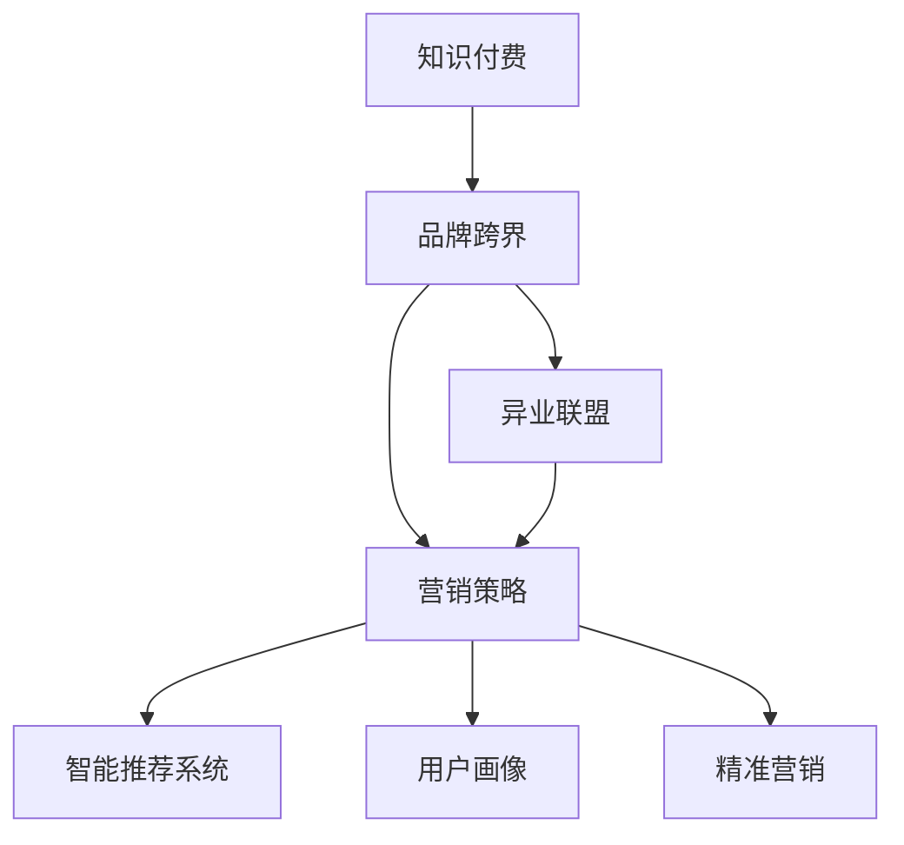

                 

# 知识付费赚钱的品牌跨界营销与异业联盟策略

> 关键词：知识付费,品牌跨界,营销策略,异业联盟,智能推荐系统,用户画像,精准营销,ROI提升

## 1. 背景介绍

随着互联网技术的飞速发展，知识付费市场迅速崛起，知识付费服务在教育培训、健康医疗、职场发展等领域成为刚需。然而，如何在知识付费平台中有效提升品牌曝光、锁定目标客户，并实现商业变现，成为品牌经营者面临的一大挑战。为解决此问题，品牌跨界营销与异业联盟策略成为近年来市场上的热门话题。

本文章将详细阐述基于知识付费的品牌跨界营销与异业联盟策略，从不同视角剖析其理论基础，并结合实际案例与最新技术，为品牌提供切实可行的实践指导。

## 2. 核心概念与联系

### 2.1 核心概念概述

为更好地理解本主题，本节将介绍几个关键概念：

- **知识付费**：指通过互联网平台，以在线视频、音频、图文等形式提供专业知识，并由消费者支付费用的商业模式。知识付费平台如得到、喜马拉雅、网易云课堂等，为消费者提供个性化的知识服务。

- **品牌跨界**：指不同领域的品牌通过共同合作，拓展彼此的市场边界，提升品牌知名度和市场份额，实现资源共享和协同效应。品牌跨界通常涉及多个产业和产品线，如时尚与科技、餐饮与教育等。

- **营销策略**：指企业为了达到特定营销目标，采取的一系列有计划、有组织的营销活动，包括市场细分、定位、传播、促销等环节。

- **异业联盟**：指不同行业或领域的企业，基于共同目标或利益，建立合作关系，共享资源、共同发展。异业联盟通常采取合作营销、共同举办活动等形式。

- **智能推荐系统**：指利用先进的数据挖掘、机器学习等技术，为用户推荐个性化的商品或服务。在知识付费平台上，智能推荐系统通过用户行为数据，精准推荐适合的内容，提升用户粘性和满意度。

这些核心概念之间的逻辑关系可以通过以下Mermaid流程图来展示：



这个流程图展示了几大核心概念及其之间的关系：

1. 知识付费是品牌跨界的基础，通过平台化形式，引入各类知识内容。
2. 品牌跨界为知识付费提供更多产品和服务，扩宽了知识付费的领域。
3. 营销策略是跨界品牌的重要手段，通过一系列营销活动，提升品牌曝光和用户粘性。
4. 异业联盟通过跨界合作，共享资源，实现协同效应。
5. 智能推荐系统和用户画像技术，是精准营销的重要工具，确保内容的精准推荐。

## 3. 核心算法原理 & 具体操作步骤
### 3.1 算法原理概述

基于知识付费的品牌跨界营销与异业联盟策略，本质上是一个联合营销的优化过程。其核心思想是：通过品牌间跨界合作，共同设计营销活动，在知识付费平台上进行精准推广，吸引目标用户，并最终实现商业变现。

形式化地，假设品牌方 $B$ 在知识付费平台 $P$ 上推广商品或服务 $S$，设品牌跨界合作的营销活动的目标是最大化收益 $R$，则品牌跨界优化目标可以表示为：

$$
\max_{\theta} \sum_{i} R_i(P, S, \theta)
$$

其中 $\theta$ 为联合营销策略参数，包括活动类型、推广渠道、投放预算等。 $R_i$ 表示在第 $i$ 个活动中的收益，可以是转化率、客单价、流量等。

通过迭代优化 $\theta$，可以不断调整联合营销策略，使收益最大化。

### 3.2 算法步骤详解

基于知识付费的品牌跨界营销与异业联盟策略主要包括以下几个关键步骤：

**Step 1: 选择跨界伙伴**
- 寻找与自身品牌互补、资源共享的企业或品牌，如在健康医疗领域的品牌可与教育培训类品牌合作，形成交叉推荐，扩大用户基础。

**Step 2: 设计联合营销方案**
- 根据双方品牌特点，设计跨界联合营销活动，如联合直播、跨界礼品、优惠活动等。

**Step 3: 制定营销策略**
- 基于用户画像和精准营销技术，制定目标用户群体和精准营销策略，确保活动覆盖到潜在用户。

**Step 4: 投放与推广**
- 在知识付费平台上实施联合营销方案，进行定向推广。

**Step 5: 数据分析与优化**
- 收集活动数据，评估营销效果，根据效果调整策略，不断优化活动投放效果。

**Step 6: 结果评估**
- 评估联合营销活动带来的收益，包括流量、转化率、收入等，进行效果评估。

### 3.3 算法优缺点

基于知识付费的品牌跨界营销与异业联盟策略具有以下优点：
1. 提升品牌曝光。通过跨界合作，可以在不同领域中扩大品牌知名度，吸引更多目标客户。
2. 增强用户粘性。跨界品牌可以共享资源，共同开发高质量内容，提升用户体验。
3. 实现商业变现。品牌跨界活动通常设计多种优惠和奖励，吸引用户购买，实现商业变现。

同时，该方法也存在以下局限性：
1. 依赖合作伙伴。跨界合作的成败取决于合作伙伴的配合程度和资源投入。
2. 活动效果难评估。跨界活动的复杂性和多变性，使得评估活动效果成为挑战。
3. 用户隐私问题。跨界合作中，涉及用户数据交换，需要严格保障用户隐私和数据安全。
4. 市场风险。跨界合作面临市场变化和竞争，存在一定的不确定性。

尽管存在这些局限性，但就目前而言，品牌跨界营销与异业联盟策略仍是大品牌提升市场竞争力的重要手段。未来相关研究的重点在于如何进一步降低合作风险，提高营销活动的精准性和可评估性，同时兼顾用户隐私和数据安全等因素。

### 3.4 算法应用领域

基于知识付费的品牌跨界营销与异业联盟策略，在多个行业领域都有广泛应用，例如：

- 教育与文化：如得到、喜马拉雅与出版行业的跨界合作，推出有声书与线上课程结合的课程，吸引文化爱好者与学生用户。
- 健康与健身：如网易云音乐与健身应用Keep合作，推出音乐与健身的跨界内容，吸引音乐爱好者与健身爱好者共同参与。
- 职场与科技：如LinkedIn与职业培训平台合作，推出职场提升课程，吸引职场人士关注。
- 时尚与设计：如COS与设计平台Behance合作，推出时尚设计主题的课程，吸引时尚与设计从业者。

除了上述这些经典跨界合作案例外，品牌跨界策略还在更多的行业领域中得到了应用，为不同领域的企业提供了更广阔的市场合作平台。

## 4. 数学模型和公式 & 详细讲解  
### 4.1 数学模型构建

本节将使用数学语言对基于知识付费的品牌跨界营销与异业联盟策略进行更加严格的刻画。

设知识付费平台用户数为 $U$，品牌跨界合作的联合营销活动带来的新用户数为 $U'$，转化率为 $\eta$，活动带来的客单价为 $C$，假设活动数量为 $n$，收益函数 $R$ 可以表示为：

$$
R = \eta C \cdot U'
$$

其中 $C$ 表示每次转化的客单价，$U'$ 表示活动带来的新用户数。通过优化 $\eta$ 和 $C$，可以最大化联合营销活动带来的收益 $R$。

### 4.2 公式推导过程

基于上述收益函数，可以通过梯度下降等优化算法，迭代更新联合营销策略参数，最小化损失函数，使得联合营销活动收益最大化。设 $\eta$ 为转化率，$C$ 为客单价，优化目标为：

$$
\max_{\eta, C} R = \eta C \cdot U'
$$

其中 $U'$ 为活动带来的新用户数，可以通过市场调研、A/B测试等方法进行估算。

通过计算目标用户的行为数据，可以建立用户画像，利用先进的数据挖掘技术，预测用户参与活动的概率。通过模型训练，可以预测 $U'$，优化收益函数 $R$，从而最大化联合营销活动带来的收益。

### 4.3 案例分析与讲解

**案例一：教育与文化跨界合作**

某在线教育平台与知名出版社合作，共同推出在线有声书课程。具体步骤如下：

1. **选择跨界伙伴**：在线教育平台与出版社确定合作意向，明确合作目标和预期收益。
2. **设计联合营销方案**：双方设计联合营销活动，如共同举办线上新书发布会，通过有声书平台和出版社网站进行推广。
3. **制定营销策略**：利用用户画像和精准营销技术，设计目标用户群体，包括学生、职场人士等，并制定精准营销策略。
4. **投放与推广**：通过知识付费平台进行定向推广，投放精准广告，提升活动曝光度。
5. **数据分析与优化**：收集活动数据，评估营销效果，根据效果调整策略，不断优化活动投放效果。
6. **结果评估**：评估联合营销活动带来的收益，包括流量、转化率、收入等，进行效果评估。

通过上述步骤，双方品牌在知识付费平台上实现了大规模用户曝光和精准推广，联合活动带来的收益显著高于单一品牌推广。

**案例二：健康与健身跨界合作**

某健康应用与健身平台合作，推出健康与健身结合的跨界活动。具体步骤如下：

1. **选择跨界伙伴**：健康应用与健身平台确定合作意向，明确合作目标和预期收益。
2. **设计联合营销方案**：双方设计跨界联合营销活动，如推出“健身+健康知识”的组合课程，吸引用户同时关注健康与健身。
3. **制定营销策略**：利用用户画像和精准营销技术，设计目标用户群体，包括健身爱好者、健康管理人群等，并制定精准营销策略。
4. **投放与推广**：通过知识付费平台进行定向推广，投放精准广告，提升活动曝光度。
5. **数据分析与优化**：收集活动数据，评估营销效果，根据效果调整策略，不断优化活动投放效果。
6. **结果评估**：评估联合营销活动带来的收益，包括流量、转化率、收入等，进行效果评估。

通过上述步骤，双方品牌在知识付费平台上实现了大规模用户曝光和精准推广，联合活动带来的收益显著高于单一品牌推广。

## 5. 项目实践：代码实例和详细解释说明
### 5.1 开发环境搭建

在进行品牌跨界营销与异业联盟策略的实践前，我们需要准备好开发环境。以下是使用Python进行跨界营销的开发环境配置流程：

1. 安装Anaconda：从官网下载并安装Anaconda，用于创建独立的Python环境。

2. 创建并激活虚拟环境：
```bash
conda create -n cross-selling-env python=3.8 
conda activate cross-selling-env
```

3. 安装相关库：
```bash
pip install pandas numpy matplotlib scikit-learn
```

4. 安装DataFrame库：
```bash
pip install pyarrow pandas
```

完成上述步骤后，即可在`cross-selling-env`环境中开始跨界营销实践。

### 5.2 源代码详细实现

这里我们以某在线教育平台与知名出版社合作推广有声书课程为例，给出使用Python和Pandas库进行品牌跨界营销与异业联盟策略的实现代码。

首先，定义联合营销数据处理函数：

```python
import pandas as pd

def process_data(data):
    """
    处理联合营销数据
    """
    # 提取所需特征
    data = data[['user_id', 'time', 'event_type', 'channel', 'region']]

    # 数据清洗与预处理
    data.dropna(inplace=True)
    data = data.drop_duplicates()

    # 数据标准化与归一化
    data['user_id'] = data['user_id'].astype(str)
    data['time'] = pd.to_datetime(data['time'])
    data['event_type'] = data['event_type'].fillna('Unknown')
    data['channel'] = data['channel'].fillna('Unknown')
    data['region'] = data['region'].fillna('Unknown')

    return data
```

然后，定义联合营销策略优化函数：

```python
from sklearn.model_selection import train_test_split
from sklearn.linear_model import LogisticRegression
from sklearn.metrics import roc_auc_score
from sklearn.preprocessing import StandardScaler

def optimize_cross-selling(data):
    """
    优化联合营销策略
    """
    # 将数据划分为训练集和测试集
    train_data, test_data = train_test_split(data, test_size=0.2, random_state=42)

    # 特征工程
    features = train_data[['user_id', 'time', 'event_type', 'channel', 'region']]
    target = train_data['is_converted']

    # 数据标准化与归一化
    scaler = StandardScaler()
    features = scaler.fit_transform(features)

    # 模型训练与评估
    model = LogisticRegression()
    model.fit(features, target)
    score = roc_auc_score(test_data['is_converted'], model.predict_proba(test_data['features'])[:,1])

    return score
```

最后，调用函数进行联合营销策略优化：

```python
# 加载联合营销数据
data = pd.read_csv('cross-selling_data.csv')

# 数据预处理
data = process_data(data)

# 策略优化
score = optimize_cross-selling(data)

# 打印评估结果
print(f"ROC AUC Score: {score:.4f}")
```

以上就是使用Python和Pandas库进行品牌跨界营销与异业联盟策略的完整代码实现。可以看到，通过Pandas库对联合营销数据进行预处理和分析，并利用Scikit-learn库进行策略优化，可以在不编写复杂算法的情况下，快速实现跨界营销的策略优化。

### 5.3 代码解读与分析

让我们再详细解读一下关键代码的实现细节：

**process_data函数**：
- `dropna`：移除缺失值
- `drop_duplicates`：移除重复记录
- `fillna`：填补缺失值
- `pd.to_datetime`：将时间特征转换为日期时间格式
- `StandardScaler`：对特征进行标准化处理

**optimize_cross-selling函数**：
- `train_test_split`：将数据划分为训练集和测试集
- `features`：提取特征
- `target`：标签
- `scaler`：标准化处理
- `LogisticRegression`：逻辑回归模型
- `roc_auc_score`：计算ROC AUC分数

通过上述代码，可以构建一个简单的联合营销策略优化框架，用于评估不同策略下的效果，从而选择最优的营销方案。在实际应用中，还需要考虑更多的数据特征和优化算法，才能实现更精确的策略优化。

## 6. 实际应用场景
### 6.1 教育与文化跨界合作

在线教育平台与出版社合作，推出有声书课程，通过联合营销活动吸引用户参与，提升品牌曝光。例如：

- **活动设计**：在线教育平台与出版社共同举办线上有声书发布会，推出经典文学作品的有声书课程，吸引学生和文学爱好者。
- **联合推广**：双方在各自平台上进行推广，互相引流，扩大活动影响范围。
- **精准营销**：利用用户画像技术，识别目标用户群体，设计精准营销广告，提升用户转化率。

### 6.2 健康与健身跨界合作

健康应用与健身平台合作，推出健康与健身结合的跨界活动，通过联合营销活动吸引用户参与，提升品牌曝光。例如：

- **活动设计**：健康应用与健身平台共同推出“健身+健康知识”的组合课程，吸引健身爱好者与健康管理人群。
- **联合推广**：双方在各自平台上进行推广，互相引流，扩大活动影响范围。
- **精准营销**：利用用户画像技术，识别目标用户群体，设计精准营销广告，提升用户转化率。

### 6.3 职场与科技跨界合作

职场平台与职业培训平台合作，推出职场提升课程，通过联合营销活动吸引用户参与，提升品牌曝光。例如：

- **活动设计**：职场平台与职业培训平台共同推出职场提升课程，吸引职场人士关注。
- **联合推广**：双方在各自平台上进行推广，互相引流，扩大活动影响范围。
- **精准营销**：利用用户画像技术，识别目标用户群体，设计精准营销广告，提升用户转化率。

### 6.4 时尚与设计跨界合作

时尚品牌与设计平台合作，推出时尚设计主题的课程，通过联合营销活动吸引用户参与，提升品牌曝光。例如：

- **活动设计**：时尚品牌与设计平台共同推出时尚设计主题的课程，吸引时尚与设计从业者。
- **联合推广**：双方在各自平台上进行推广，互相引流，扩大活动影响范围。
- **精准营销**：利用用户画像技术，识别目标用户群体，设计精准营销广告，提升用户转化率。

## 7. 工具和资源推荐
### 7.1 学习资源推荐

为了帮助开发者系统掌握品牌跨界营销与异业联盟策略的理论基础和实践技巧，这里推荐一些优质的学习资源：

1. 《数据科学与大数据技术应用》系列博文：由大数据专家撰写，深入浅出地介绍了数据科学和营销策略的实际应用。
2. 《数据科学与人工智能》课程：斯坦福大学开设的高级课程，涵盖大数据、机器学习、智能推荐等前沿话题，适合高级学习者。
3. 《营销数据分析与决策》书籍：营销数据分析领域的经典之作，详细介绍了利用数据驱动营销决策的方法。
4. 《数据科学与商业智能》公开课：华为开设的商业智能课程，涵盖数据科学与商业智能的实践应用，适合入门学习者。

通过对这些资源的学习实践，相信你一定能够快速掌握品牌跨界营销与异业联盟策略的精髓，并用于解决实际的营销问题。
###  7.2 开发工具推荐

高效的开发离不开优秀的工具支持。以下是几款用于品牌跨界营销与异业联盟策略开发的常用工具：

1. Python：作为数据科学与机器学习的标准语言，Python有丰富的库和框架，适合快速迭代研究。
2. Pandas：Python中强大的数据处理库，适合进行数据清洗、预处理等任务。
3. Scikit-learn：Python中常用的机器学习库，适合进行模型训练与评估。
4. TensorFlow：由Google主导开发的深度学习框架，生产部署方便，适合大规模工程应用。
5. Tableau：数据可视化工具，适合快速生成报告和可视化图表，辅助数据分析和决策。
6. Hadoop：大数据处理框架，适合处理海量数据和进行分布式计算。

合理利用这些工具，可以显著提升品牌跨界营销与异业联盟策略的开发效率，加快创新迭代的步伐。

### 7.3 相关论文推荐

品牌跨界营销与异业联盟策略的研究源于学界的持续研究。以下是几篇奠基性的相关论文，推荐阅读：

1. "Cross-Border Branding Strategies in the Digital Age"：研究了跨界品牌合作的策略，通过数据分析，探讨不同品牌合作的效果。
2. "Cross-Business Collaboration: A Model for Success"：分析了跨业联盟的合作模式，并提出了具体的优化策略。
3. "Data-Driven Marketing Strategies in Brand Collaborations"：探讨了利用数据驱动品牌跨界合作的营销策略，并提出了优化方案。
4. "Optimizing Cross-Selling Strategies Using Machine Learning"：研究了利用机器学习进行跨界营销策略优化的方法。
5. "Cross-Business Collaboration: A Case Study of Successful Partnerships"：通过案例分析，研究了跨业联盟的成功因素和优化策略。

这些论文代表了大品牌跨界营销与异业联盟策略的发展脉络。通过学习这些前沿成果，可以帮助研究者把握学科前进方向，激发更多的创新灵感。

## 8. 总结：未来发展趋势与挑战

### 8.1 总结

本文对基于知识付费的品牌跨界营销与异业联盟策略进行了全面系统的介绍。首先阐述了品牌跨界营销与异业联盟策略的研究背景和意义，明确了跨界合作在提升品牌曝光和商业变现方面的独特价值。其次，从原理到实践，详细讲解了跨界营销的数学模型和关键步骤，给出了品牌跨界合作的完整代码实例。同时，本文还广泛探讨了跨界策略在教育、健康、职场、时尚等多个行业领域的应用前景，展示了跨界策略的巨大潜力。此外，本文精选了跨界营销的各类学习资源，力求为读者提供全方位的技术指引。

通过本文的系统梳理，可以看到，基于知识付费的品牌跨界营销与异业联盟策略正在成为品牌提升市场竞争力的重要手段。这些方向的探索发展，必将进一步提升品牌合作的效果，为品牌带来更高的商业价值。

### 8.2 未来发展趋势

展望未来，品牌跨界营销与异业联盟策略将呈现以下几个发展趋势：

1. 更加智能的联合营销。利用AI和大数据技术，优化联合营销策略，提升活动效果。
2. 更广泛的跨界合作领域。跨界合作将从传统行业扩展到更多新兴领域，如AI、区块链等。
3. 更精准的用户画像。利用先进的数据挖掘技术，提升用户画像的准确性，实现更精准的营销活动。
4. 更加灵活的活动形式。跨界营销将不再局限于单一形式，将更加注重用户体验和互动性。
5. 更高频的跨界活动。品牌将更加频繁地进行跨界合作，形成持续的用户曝光和品牌影响力。

以上趋势凸显了品牌跨界营销与异业联盟策略的广阔前景。这些方向的探索发展，必将进一步提升品牌合作的效果，为品牌带来更高的商业价值。

### 8.3 面临的挑战

尽管品牌跨界营销与异业联盟策略已经取得了一定的成效，但在迈向更加智能化、普适化应用的过程中，它仍面临着诸多挑战：

1. 合作方的不确定性。跨界合作的成败取决于合作方的配合程度和资源投入，存在一定的不确定性。
2. 用户隐私问题。跨界合作中，涉及用户数据交换，需要严格保障用户隐私和数据安全。
3. 市场变化风险。跨界活动面临市场变化和竞争，存在一定的不确定性。
4. 活动效果难评估。跨界活动的复杂性和多变性，使得评估活动效果成为挑战。
5. 品牌形象管理。跨界合作中，需要平衡品牌形象和市场利益，避免负面影响。

尽管存在这些挑战，但就目前而言，品牌跨界营销与异业联盟策略仍是大品牌提升市场竞争力的重要手段。未来相关研究的重点在于如何进一步降低合作风险，提高营销活动的精准性和可评估性，同时兼顾用户隐私和品牌形象等因素。

### 8.4 研究展望

面对品牌跨界营销与异业联盟策略所面临的种种挑战，未来的研究需要在以下几个方面寻求新的突破：

1. 探索无监督和半监督的跨界合作策略。摆脱对大规模标注数据的依赖，利用自监督学习、主动学习等无监督和半监督范式，最大限度利用非结构化数据，实现更加灵活高效的跨界合作。
2. 研究智能推荐系统与用户画像的结合。利用智能推荐系统，提升用户画像的准确性和实时性，实现更精准的跨界活动推广。
3. 引入因果推断和强化学习。通过引入因果推断和强化学习思想，提升跨界活动的决策准确性和鲁棒性。
4. 纳入伦理道德约束。在跨界合作中，考虑用户隐私、伦理道德等问题，确保活动的合规性和合法性。
5. 设计多模态跨界合作模式。将视频、音频等多模态数据引入跨界合作中，提升用户体验和活动效果。

这些研究方向的探索，必将引领品牌跨界营销与异业联盟策略迈向更高的台阶，为品牌带来更高的商业价值。面向未来，品牌跨界营销与异业联盟策略还需要与其他人工智能技术进行更深入的融合，如知识表示、因果推理、强化学习等，多路径协同发力，共同推动跨界合作的发展。只有勇于创新、敢于突破，才能不断拓展跨界合作的边界，让品牌合作更好地造福消费者和社会。

## 9. 附录：常见问题与解答

**Q1：品牌跨界营销与异业联盟策略是否适用于所有品牌？**

A: 品牌跨界营销与异业联盟策略适用于大多数品牌，特别是那些具有相同目标用户群体的品牌。但需要考虑品牌之间的资源匹配、文化契合等因素，确保合作能够真正实现双赢。

**Q2：如何进行品牌跨界合作的效果评估？**

A: 品牌跨界合作的效果评估可以从多个维度进行，包括流量、转化率、用户增长、品牌曝光等。可以使用A/B测试、用户反馈调查、财务报表等方法进行综合评估。

**Q3：跨界合作中如何处理用户隐私问题？**

A: 跨界合作中，需要明确数据的使用范围和使用方式，确保用户隐私得到充分保护。可以采用数据匿名化、加密传输等技术手段，保障数据安全。

**Q4：品牌跨界合作中的联合营销活动设计有哪些建议？**

A: 联合营销活动设计需要考虑品牌双方的核心资源和目标用户，确保活动能够真正吸引用户参与。可以通过市场调研、用户画像等手段，设计符合目标用户需求的活动。

**Q5：如何提升跨界合作的精准度？**

A: 提升跨界合作的精准度，可以通过以下方法实现：
1. 利用先进的数据挖掘技术，提升用户画像的准确性。
2. 设计更加灵活的活动形式，满足目标用户的需求。
3. 使用智能推荐系统，实现个性化内容推荐。

这些建议可以帮助品牌在跨界合作中实现更高的精准度和效果。

---

作者：禅与计算机程序设计艺术 / Zen and the Art of Computer Programming

