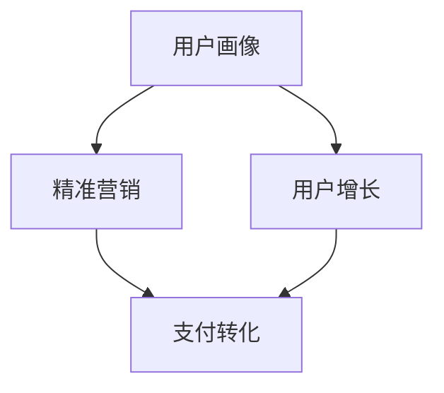

                 

# 知识付费赚钱的用户画像与精准营销策略

> 关键词：知识付费,用户画像,精准营销,用户增长,推荐系统,支付转化

## 1. 背景介绍

### 1.1 问题由来
随着知识经济时代的到来，知识付费逐渐成为用户获取知识、提升技能的主要方式。知识付费平台如得到、知乎live、慕课网等也如雨后春笋般涌现。根据艾瑞咨询的数据，2020年我国知识付费市场规模达到358.7亿元，预计2025年将达到1,082亿元，年复合增长率高达33.4%。

然而，尽管知识付费市场增长迅猛，但各平台的实际盈利情况却不容乐观。许多平台用户付费转化率低，用户留存率差，甚至出现了付费用户流失的现象。为解决这些问题，平台必须深入理解用户画像，并采取精准的营销策略，提高用户增长和付费转化率。

### 1.2 问题核心关键点
- **用户画像**：全面、深入地理解目标用户特征，涵盖性别、年龄、职业、消费能力、兴趣偏好、购买动机等。
- **精准营销**：根据用户画像设计有针对性的推广策略，通过个性化推荐和精准投放，提升用户转化率。
- **用户增长**：通过优化产品体验和营销策略，吸引新用户，提升现有用户留存率，持续提升用户总量。
- **支付转化**：通过优化页面、促单策略，提升用户从免费试听到付费购买的转化率。

## 2. 核心概念与联系

### 2.1 核心概念概述

为更好地理解知识付费领域的用户画像与精准营销，本节将介绍几个密切相关的核心概念：

- **用户画像**：通过分析用户数据，构建用户特征模型，从而全面描述用户属性和行为特征。
- **精准营销**：根据用户画像设计有针对性的推广策略，实现用户精准触达和高效转化。
- **用户增长**：通过多渠道推广、用户细分、个性化推荐等方式，持续提升用户数量和留存率。
- **支付转化**：通过优化购买路径、促单策略、用户体验等方式，提升用户从免费试听到付费购买的转化率。

这些核心概念之间的逻辑关系可以通过以下Mermaid流程图来展示：



这个流程图展示了大语言模型的核心概念及其之间的关系：

1. 用户画像构建提供精准营销的依据。
2. 精准营销策略提升支付转化率。
3. 用户增长带动整体用户数量和留存率提升。
4. 支付转化率提升，带来平台收入的增加。

这些概念共同构成了知识付费领域的用户增长和盈利逻辑，使得平台能够通过精准营销策略，持续吸引用户并提升转化率。

## 3. 核心算法原理 & 具体操作步骤
### 3.1 算法原理概述

精准营销的核心是构建用户画像，并基于画像设计有针对性的推广策略。其核心思想是：通过分析用户的历史行为数据，挖掘用户兴趣、行为模式，构建用户画像。基于画像进行个性化推荐和精准投放，最大化提升用户的转化率和平台收入。

形式化地，假设平台拥有用户 $U=\{u_1, u_2, ..., u_N\}$，每个用户的历史行为数据为 $D=\{(x_i, y_i)\}_{i=1}^N$，其中 $x_i$ 为行为特征，如浏览时长、点击次数、课程评分等，$y_i$ 为行为标签，如付费行为、试听行为等。精准营销的目标是找到最佳的推广策略 $\pi$，使得用户转化率最大化。

即求解：

$$
\pi^* = \mathop{\arg\min}_{\pi} \mathcal{L}(\pi)
$$

其中 $\mathcal{L}$ 为损失函数，用于衡量推广策略 $\pi$ 带来的转化率提升。常用的优化算法包括梯度下降、遗传算法、强化学习等。

### 3.2 算法步骤详解

基于用户画像的精准营销一般包括以下几个关键步骤：

**Step 1: 数据采集与预处理**
- 收集用户行为数据，包括浏览行为、购买行为、反馈数据等。
- 对数据进行清洗和特征工程，去除噪音和缺失值，提取有意义的特征。

**Step 2: 用户画像构建**
- 利用机器学习算法（如聚类、关联规则等）对用户数据进行建模，形成用户画像。
- 通过多维度的用户画像，全面刻画用户特征，涵盖兴趣偏好、消费能力、购买动机等。

**Step 3: 营销策略设计**
- 根据用户画像设计个性化推荐策略，如基于内容的推荐、基于用户的推荐等。
- 设计精准投放策略，选择合适的推广渠道和时机。

**Step 4: 策略执行与优化**
- 根据设计好的策略，进行推广投放，监测转化效果。
- 实时调整推广策略，优化投放效果。

**Step 5: 效果评估与反馈**
- 对推广效果进行评估，对比推广前后的用户转化率变化。
- 收集用户反馈，分析推广效果和用户接受度，进一步优化推广策略。

### 3.3 算法优缺点

精准营销的算法具有以下优点：
1. 能够实现有针对性的推广，提升用户转化率。
2. 利用用户历史行为数据，提高推广的精准度。
3. 可以动态调整策略，持续优化推广效果。

同时，该算法也存在一定的局限性：
1. 对数据质量和数量有较高要求，数据采集和处理成本较高。
2. 模型可能存在过拟合风险，推广策略的泛化能力不足。
3. 需要频繁更新用户画像，对计算资源和时间资源有一定要求。
4. 用户隐私问题敏感，推广策略设计需要遵守法律法规。

尽管存在这些局限性，但就目前而言，精准营销仍然是大规模知识付费平台用户增长的重要手段。未来相关研究的重点在于如何进一步降低数据采集和处理成本，提高模型泛化能力，同时兼顾用户隐私和法律法规等因素。

### 3.4 算法应用领域

精准营销方法在知识付费平台的用户增长和盈利中得到了广泛的应用，覆盖了几乎所有关键环节，例如：

- **用户获取**：通过精准投放，吸引新用户注册和下载应用。
- **用户留存**：利用个性化推荐和促单策略，提升用户粘性，延长用户活跃周期。
- **用户转化**：通过优化购买路径和促单策略，提高用户付费转化率。
- **用户流失召回**：针对流失用户设计有针对性的召回策略，降低流失率。
- **多渠道推广**：利用多渠道数据，进行综合分析和决策，优化推广效果。

除了上述这些经典应用外，精准营销还被创新性地应用到更多场景中，如实时竞价、品牌推广、用户细分等，为知识付费平台的长期发展提供新的动力。

## 4. 数学模型和公式 & 详细讲解 & 举例说明

### 4.1 数学模型构建

本节将使用数学语言对精准营销算法进行更加严格的刻画。

记用户 $u_i$ 的历史行为数据为 $D=\{(x_1,y_1),(x_2,y_2),...(x_n,y_n)\}$，其中 $x_k=(x_k^1,x_k^2,...,x_k^m)$ 为行为特征，$y_k$ 为行为标签。定义用户画像 $P_u$ 为：

$$
P_u = \{\mu_k = \frac{1}{n}\sum_{k=1}^n x_k^j\}
$$

其中 $\mu_k$ 为用户 $u_i$ 在特征 $j$ 上的平均行为。

### 4.2 公式推导过程

假设用户画像 $P_u$ 与付费行为 $y_i$ 之间的关系为：

$$
y_i = \phi(P_u)
$$

其中 $\phi$ 为概率模型，表示用户画像 $P_u$ 转化为付费行为 $y_i$ 的概率。

定义推广策略 $\pi$ 为：

$$
\pi = \{p_{ch} = \{\phi_k\}_{k=1}^m, p_{pr} = \{\phi_k'\}_{k=1}^m\}
$$

其中 $p_{ch}$ 为内容推荐概率，$p_{pr}$ 为促单概率。

推广策略的目标是最大化付费转化率，即：

$$
\max_{\pi} \sum_{i=1}^N y_i
$$

推广策略的损失函数 $\mathcal{L}(\pi)$ 为：

$$
\mathcal{L}(\pi) = -\sum_{i=1}^N \log \phi_i
$$

基于上述定义，推广策略的优化目标为：

$$
\pi^* = \mathop{\arg\min}_{\pi} \mathcal{L}(\pi)
$$

### 4.3 案例分析与讲解

**案例1: 基于内容推荐的推广策略**

假设用户 $u_i$ 对某课程的评分 $x_1$ 为4.5分，浏览时长 $x_2$ 为2分钟。根据评分和浏览时长等行为特征，预测该用户转化为付费行为的概率为 $p_i$。

通过历史数据构建用户画像 $P_u$，发现 $P_u$ 在评分 $x_1$ 和浏览时长 $x_2$ 上，转化为付费行为的概率分别为 $p_{x1}=0.3$ 和 $p_{x2}=0.2$。则用户 $u_i$ 转化为付费行为的概率为：

$$
p_i = \phi(P_u) = p_{x1} \cdot p_{x2} = 0.3 \times 0.2 = 0.06
$$

基于上述分析，可以设计个性化推荐策略，向用户推荐评分较高的课程，并通过促单策略提升转化率。

**案例2: 基于用户分群的推广策略**

假设平台将用户分成三类：高价值用户、中价值用户、低价值用户。根据历史数据，高价值用户转化为付费行为的概率为 $p_h=0.4$，中价值用户为 $p_m=0.2$，低价值用户为 $p_l=0.1$。推广策略可以设计为：

1. 对高价值用户，采用高预算、高频次的推广策略。
2. 对中价值用户，采用中预算、中等频次的推广策略。
3. 对低价值用户，采用低预算、低频次的推广策略。

通过用户分群和定制化推广策略，平台可以有效提升高价值用户的转化率，同时控制广告预算，避免资源浪费。

## 5. 项目实践：代码实例和详细解释说明
### 5.1 开发环境搭建

在进行精准营销实践前，我们需要准备好开发环境。以下是使用Python进行Scikit-learn开发的环境配置流程：

1. 安装Anaconda：从官网下载并安装Anaconda，用于创建独立的Python环境。

2. 创建并激活虚拟环境：
```bash
conda create -n recommendation-env python=3.8 
conda activate recommendation-env
```

3. 安装Scikit-learn：
```bash
conda install scikit-learn
```

4. 安装各类工具包：
```bash
pip install numpy pandas scikit-learn matplotlib tqdm jupyter notebook ipython
```

完成上述步骤后，即可在`recommendation-env`环境中开始精准营销实践。

### 5.2 源代码详细实现

下面以用户分群和个性化推荐为例，给出使用Scikit-learn对用户行为数据进行建模和微调的PyTorch代码实现。

首先，定义数据处理函数：

```python
import pandas as pd
from sklearn.preprocessing import LabelEncoder, MinMaxScaler

def preprocess_data(data):
    # 数据清洗和特征工程
    data = data.dropna()
    # 对行为标签进行one-hot编码
    data['is_paid'] = data['is_paid'].astype(int)
    data = pd.get_dummies(data, columns=['is_paid'])
    # 特征缩放
    data = MinMaxScaler().fit_transform(data[['x1', 'x2', 'x3']])
    return data
```

然后，定义用户画像模型和推荐策略：

```python
from sklearn.cluster import KMeans
from sklearn.decomposition import PCA

# 定义K-Means聚类模型
def build_kmeans_model(data, num_clusters):
    model = KMeans(n_clusters=num_clusters, random_state=42)
    model.fit(data)
    return model

# 定义PCA降维模型
def build_pca_model(data, dim):
    model = PCA(n_components=dim)
    model.fit(data)
    return model

# 定义个性化推荐策略
def recommend_course(user, model, course_scores):
    user_scores = model.transform(user)
    recommendations = course_scores.dot(user_scores) / course_scores.sum(axis=0)
    return recommendations
```

最后，启动推荐流程并在测试集上评估：

```python
# 加载用户行为数据
data = pd.read_csv('user_behavior.csv')

# 数据预处理
data = preprocess_data(data)

# 构建用户画像模型
kmeans_model = build_kmeans_model(data, num_clusters=3)
pca_model = build_pca_model(data, dim=2)

# 加载课程评分数据
course_scores = pd.read_csv('course_scores.csv')

# 推荐用户课程
recommendations = []
for user in test_users:
    user_scores = kmeans_model.transform(user)
    recommendations.append(recommend_course(user_scores, course_scores))

# 输出推荐结果
print('推荐结果：', recommendations)
```

以上就是使用Scikit-learn对用户行为数据进行建模和微调的完整代码实现。可以看到，通过简单的代码实现，我们就可以对用户行为数据进行聚类、降维等处理，构建用户画像，并设计个性化推荐策略。

### 5.3 代码解读与分析

让我们再详细解读一下关键代码的实现细节：

**preprocess_data函数**：
- 对数据进行清洗，去除缺失值和异常值。
- 对行为标签进行one-hot编码，方便模型处理。
- 对特征进行缩放，确保不同特征在模型中的影响一致。

**build_kmeans_model函数**：
- 定义K-Means聚类模型，对用户数据进行聚类，构建用户画像。
- 参数 `num_clusters` 指定聚类数目，可根据实际需求调整。

**build_pca_model函数**：
- 定义PCA降维模型，对用户数据进行降维，简化特征空间。
- 参数 `dim` 指定降维后的特征维度，可根据实际需求调整。

**recommend_course函数**：
- 定义个性化推荐策略，计算用户与课程之间的相似度，选择相似度最高的课程进行推荐。

**推荐流程**：
- 加载用户行为数据，进行预处理。
- 构建K-Means和PCA模型，构建用户画像。
- 加载课程评分数据，进行推荐计算。
- 输出推荐结果。

可以看到，通过Python和Scikit-learn等工具，我们能够快速构建用户画像和推荐策略，实现精准营销的自动化和科学化。然而，在工业级的系统实现中，还需要考虑更多因素，如用户隐私保护、模型评估、多模型融合等，以确保推荐结果的可靠性和准确性。

## 6. 实际应用场景
### 6.1 智能客服系统

基于精准营销的智能客服系统，可以广泛应用于各类企业的客服部门。传统客服往往需要配备大量人力，高峰期响应缓慢，且服务质量难以保证。而使用精准营销构建的智能客服系统，可以7x24小时不间断服务，快速响应客户咨询，提高客户满意度。

在技术实现上，可以通过分析用户行为数据，构建用户画像，设计有针对性的推荐策略，为用户提供个性化的服务。对于客户提出的新问题，系统可以自动推荐相关的FAQ和解决方案，减少客服人员的工作量，提升服务效率。

### 6.2 在线教育平台

在线教育平台通过精准营销可以提升用户增长和留存率，同时提高付费转化率。例如，慕课网可以通过用户画像分析，设计个性化课程推荐和促单策略，吸引用户注册和付费。对于已经注册的用户，可以定期推送个性化的学习路径和优惠活动，提升用户粘性和复购率。

此外，平台还可以通过精准营销对高价值用户进行精准投放，提升平台收入。例如，可以通过数据分析发现，某种课程的用户流失率较高，从而针对性推送相关课程，减少用户流失。

### 6.3 电子商务平台

电子商务平台利用精准营销可以提升用户转化率和复购率，从而增加平台收入。例如，淘宝可以通过分析用户浏览和购买行为，构建用户画像，设计个性化商品推荐和促单策略。对于新用户，可以设计有吸引力的促销活动，吸引用户注册和购买。

对于已经注册的用户，可以通过分析用户行为，设计个性化的商品推荐，提升用户粘性和复购率。例如，针对喜欢运动的用户，可以推荐相关运动装备和运动课程，提升用户满意度和忠诚度。

### 6.4 未来应用展望

随着精准营销方法的不断发展，基于用户画像和个性化推荐的推广策略将广泛应用于更多领域，为传统行业带来变革性影响。

在智慧医疗领域，基于精准营销的医疗问答、病历分析、药物品种推荐等应用将提升医疗服务的智能化水平，辅助医生诊疗，加速新药开发进程。

在智能教育领域，微调技术可应用于作业批改、学情分析、知识推荐等方面，因材施教，促进教育公平，提高教学质量。

在智慧城市治理中，精准营销技术可应用于城市事件监测、舆情分析、应急指挥等环节，提高城市管理的自动化和智能化水平，构建更安全、高效的未来城市。

此外，在企业生产、社会治理、文娱传媒等众多领域，精准营销技术也将不断涌现，为传统行业带来新的技术路径。相信随着技术的日益成熟，精准营销方法将成为知识付费领域的重要范式，推动人工智能技术在垂直行业的规模化落地。

## 7. 工具和资源推荐
### 7.1 学习资源推荐

为了帮助开发者系统掌握精准营销的理论基础和实践技巧，这里推荐一些优质的学习资源：

1. 《推荐系统：原理与实现》系列博文：由推荐系统领域专家撰写，深入浅出地介绍了推荐系统的工作原理和常用算法。

2. 斯坦福大学《Recommender Systems》课程：斯坦福大学开设的推荐系统明星课程，涵盖了推荐系统从原理到应用的各个环节，适合初学者和进阶开发者。

3. 《推荐系统实战》书籍：推荐系统领域的经典书籍，全面介绍了推荐系统的算法和应用案例，适用于实战开发。

4. 推荐系统论文精读：推荐系统领域的权威论文合集，涵盖多种推荐算法，提供深入的理论学习资源。

5. Kaggle推荐系统竞赛：Kaggle平台上的推荐系统竞赛，通过实际项目训练，提升推荐系统开发能力。

通过对这些资源的学习实践，相信你一定能够快速掌握精准营销的精髓，并用于解决实际的推荐系统问题。

### 7.2 开发工具推荐

高效的开发离不开优秀的工具支持。以下是几款用于精准营销开发的常用工具：

1. Python：功能强大、灵活的编程语言，广泛用于推荐系统开发。

2. Scikit-learn：开源的机器学习库，提供丰富的算法和工具，支持快速原型开发和模型评估。

3. TensorFlow：Google主导的深度学习框架，支持大规模推荐系统开发和模型优化。

4. Weights & Biases：模型训练的实验跟踪工具，可以记录和可视化模型训练过程中的各项指标，方便对比和调优。

5. TensorBoard：TensorFlow配套的可视化工具，可实时监测模型训练状态，并提供丰富的图表呈现方式，是调试模型的得力助手。

6. Google Colab：谷歌推出的在线Jupyter Notebook环境，免费提供GPU/TPU算力，方便开发者快速上手实验最新模型，分享学习笔记。

合理利用这些工具，可以显著提升精准营销任务的开发效率，加快创新迭代的步伐。

### 7.3 相关论文推荐

精准营销技术的发展源于学界的持续研究。以下是几篇奠基性的相关论文，推荐阅读：

1. Adaptive Computation of Factor Analysis：提出PCA算法，解决了高维数据降维问题。

2. Fast K-Means：提出K-Means算法，解决了大规模数据聚类问题。

3. Recommender Systems Handbook：推荐系统领域的权威手册，全面介绍了推荐系统的算法和应用。

4. Recommender Systems in the Information Age：介绍了推荐系统从早期到现代的发展历程，提供了丰富的实际应用案例。

5. Context-Aware Recommendation Systems：介绍了上下文推荐系统的设计思路，提供了多种上下文推荐算法。

这些论文代表了大语言模型微调技术的发展脉络。通过学习这些前沿成果，可以帮助研究者把握学科前进方向，激发更多的创新灵感。

## 8. 总结：未来发展趋势与挑战
### 8.1 总结

本文对精准营销方法进行了全面系统的介绍。首先阐述了精准营销在大规模知识付费平台用户增长和盈利中的重要地位，明确了精准营销在提高用户增长和付费转化率方面的独特价值。其次，从原理到实践，详细讲解了精准营销的数学原理和关键步骤，给出了精准营销任务开发的完整代码实例。同时，本文还广泛探讨了精准营销方法在智能客服、在线教育、电子商务等多个行业领域的应用前景，展示了精准营销方法的巨大潜力。此外，本文精选了精准营销技术的各类学习资源，力求为读者提供全方位的技术指引。

通过本文的系统梳理，可以看到，精准营销方法在大规模知识付费平台用户增长和盈利中具有重要意义。这些方向的探索发展，必将进一步提升平台的收入和用户数量，为知识付费市场的持续健康发展提供动力。

### 8.2 未来发展趋势

展望未来，精准营销技术将呈现以下几个发展趋势：

1. 用户画像多样化。用户画像将从单一的行为特征描述，向多维度的兴趣和偏好分析转变。通过社交网络、位置信息、设备信息等多维数据，构建更加全面、丰富的用户画像。

2. 推荐策略动态化。推荐策略将从静态的规则和模型，向动态的推荐算法和机器学习模型转变。通过实时数据分析，动态调整推荐策略，提升推荐效果。

3. 多模态推荐兴起。推荐系统将从传统的文本和图形推荐，向多模态数据融合推荐转变。通过视觉、听觉、位置等多种信息，提升推荐系统的综合能力。

4. 推荐算法协同化。推荐算法将从单一的协同过滤和内容推荐，向多算法协同推荐转变。通过融合多种算法，提升推荐系统的鲁棒性和多样化。

5. 推荐系统本地化。推荐系统将从全球统一的推荐策略，向本地化的推荐策略转变。根据不同地域、文化、语言等特征，设计差异化的推荐策略，提升用户体验。

这些趋势凸显了精准营销技术的发展方向，为推荐系统的深入应用提供了新的思路。

### 8.3 面临的挑战

尽管精准营销方法已经取得了显著成效，但在迈向更加智能化、普适化应用的过程中，它仍面临着诸多挑战：

1. 数据隐私问题。用户隐私保护是精准营销的重要挑战。如何在保证用户隐私的前提下，收集和分析数据，是推荐系统的重要课题。

2. 模型泛化能力不足。现有的推荐系统往往依赖特定领域的静态数据，对于新场景和用户的适应性较弱。如何提升模型的泛化能力，提高推荐系统的通用性，将是一大难题。

3. 推荐系统的冷启动问题。对于新用户和冷启动用户，推荐系统往往难以提供准确的推荐。如何通过用户行为数据和新用户标签，快速提升推荐效果，将是一大挑战。

4. 推荐系统的实时性问题。现有的推荐系统往往存在延迟，难以实时响应用户需求。如何通过缓存、异步计算等技术，提升推荐系统的实时性，将是一大挑战。

5. 推荐系统的鲁棒性问题。推荐系统在面对异常数据和恶意攻击时，容易受到干扰。如何通过异常检测、数据清洗等技术，提升推荐系统的鲁棒性，将是一大挑战。

6. 推荐系统的公平性问题。推荐系统在面对数据偏差和模型偏见时，容易出现推荐偏差。如何通过公平性优化和反偏见算法，提升推荐系统的公平性，将是一大挑战。

7. 推荐系统的安全性问题。推荐系统在面对数据泄露和恶意攻击时，容易受到威胁。如何通过安全机制和隐私保护技术，提升推荐系统的安全性，将是一大挑战。

这些挑战凸显了精准营销技术的发展瓶颈，亟需更多的创新突破。相信随着技术研究的不断深入和实际应用的不断积累，这些问题终将逐一得到解决，精准营销方法必将在知识付费领域发挥更大的作用。

### 8.4 研究展望

面对精准营销面临的种种挑战，未来的研究需要在以下几个方面寻求新的突破：

1. 探索无监督和半监督推荐方法。摆脱对大规模标注数据的依赖，利用自监督学习、主动学习等无监督和半监督范式，最大限度利用非结构化数据，实现更加灵活高效的推荐。

2. 研究个性化推荐算法。开发更加个性化和多样化的推荐算法，如基于模型的协同过滤、基于内容的推荐、混合推荐等，提升推荐系统的覆盖率和效果。

3. 引入更多先验知识。将符号化的先验知识，如知识图谱、逻辑规则等，与推荐系统进行巧妙融合，引导推荐过程学习更准确、合理的推荐结果。

4. 结合因果分析和博弈论工具。将因果分析方法引入推荐系统，识别出推荐结果的关键特征，增强推荐结果的因果性和逻辑性。借助博弈论工具刻画人机交互过程，主动探索并规避推荐系统的脆弱点，提高系统稳定性。

5. 纳入伦理道德约束。在推荐系统目标中引入伦理导向的评估指标，过滤和惩罚有偏见、有害的推荐结果，确保推荐系统符合人类价值观和伦理道德。

这些研究方向将引领精准营销技术迈向更高的台阶，为推荐系统带来新的突破和创新。面向未来，精准营销技术还需要与其他人工智能技术进行更深入的融合，如知识表示、因果推理、强化学习等，多路径协同发力，共同推动推荐系统的进步。只有勇于创新、敢于突破，才能不断拓展推荐系统的边界，让智能技术更好地造福人类社会。

## 9. 附录：常见问题与解答

**Q1：如何构建高质量的用户画像？**

A: 构建高质量的用户画像需要多维度数据的支持，包括用户行为数据、社交网络数据、设备信息等。具体步骤包括：

1. 数据采集：通过日志、问卷、社交平台等渠道，收集用户数据。
2. 数据清洗：去除噪音、异常值和缺失值，确保数据质量。
3. 特征提取：对数据进行特征工程，提取有意义的特征。
4. 数据建模：利用聚类、关联规则等算法，构建用户画像。
5. 画像验证：通过实际应用验证用户画像的效果，优化模型参数。

高质量的用户画像能够全面刻画用户特征，为推荐系统提供强有力的支持。

**Q2：精准营销对数据质量有什么要求？**

A: 精准营销对数据质量要求较高，主要体现在以下几个方面：

1. 数据完整性：数据需要全面覆盖用户行为，包括浏览行为、购买行为、评分行为等。
2. 数据准确性：数据需要准确反映用户真实行为，避免数据错误和偏差。
3. 数据一致性：不同数据源的数据格式和单位需要一致，方便数据整合和分析。
4. 数据及时性：数据需要实时更新，确保推荐系统能够及时响应用户需求。
5. 数据安全性：数据需要保护用户隐私，确保数据安全可靠。

高质量的数据是精准营销的基础，数据质量直接影响推荐系统的性能和效果。

**Q3：如何优化推荐系统的冷启动问题？**

A: 推荐系统的冷启动问题可以通过以下方法解决：

1. 用户画像构建：通过已有用户数据，构建用户画像，引导新用户快速融入推荐系统。
2. 相似用户推荐：根据已有用户数据，找到与新用户相似的用户，推荐相似用户喜欢的物品。
3. 物品标签推荐：利用物品的标签信息，推荐与新用户兴趣相关的物品。
4. 物品属性推荐：根据物品的属性信息，推荐符合新用户偏好的物品。
5. 多模态融合：利用多模态数据，提升推荐系统的综合能力，快速提升推荐效果。

通过以上方法，可以有效解决推荐系统的冷启动问题，提升新用户的推荐效果。

**Q4：推荐系统如何应对异常数据和恶意攻击？**

A: 推荐系统应对异常数据和恶意攻击的方法包括：

1. 异常检测：通过数据清洗和预处理，检测和去除异常数据。
2. 数据过滤：根据用户行为和用户画像，过滤恶意攻击和垃圾数据。
3. 模型训练：通过模型训练，增强推荐系统的鲁棒性，减少异常数据的影响。
4. 安全机制：通过加密、认证等技术，保护用户数据和推荐系统安全。

通过以上方法，可以有效应对异常数据和恶意攻击，提升推荐系统的鲁棒性和安全性。

**Q5：如何提升推荐系统的公平性？**

A: 提升推荐系统的公平性可以通过以下方法实现：

1. 数据公平性：通过数据采集和预处理，确保数据公平性，避免数据偏见。
2. 算法公平性：利用公平性优化算法，减少推荐结果的偏见。
3. 推荐多样化：通过多样化推荐，减少单一推荐的偏见。
4. 用户反馈：通过用户反馈和满意度调查，优化推荐系统，提高推荐结果的公平性。

通过以上方法，可以有效提升推荐系统的公平性，减少推荐偏差，提高用户体验。

---

作者：禅与计算机程序设计艺术 / Zen and the Art of Computer Programming

