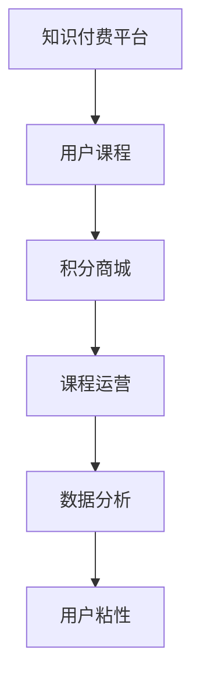

                 

# 知识付费赚钱的用户课程兑换与积分商城运营

在数字化转型浪潮的推动下，知识付费迅速崛起，成为知识传播和变现的新途径。用户通过订阅平台购买课程，享受高价值的知识内容，平台则通过广告、收费课程等方式实现盈利。然而，课程销售并非一帆风顺。用户付费后往往难以坚持学习，导致平台收入流失。同时，课程内容质量参差不齐，难以满足用户多样化学习需求。因此，构建用户课程兑换与积分商城，成为提升用户粘性、优化课程运营的重要手段。本文将系统介绍知识付费平台的用户课程兑换与积分商城运营原理，并给出详细的算法步骤和实现策略。

## 1. 背景介绍

### 1.1 知识付费兴起背景
随着互联网的普及和智能手机的普及，知识获取的方式发生了深刻的变化。从搜索引擎到在线视频，从自媒体到问答社区，用户可以通过多种渠道获取信息。然而，高质量的内容往往需要付费，才能得到。知识付费平台的兴起，将知识变现变得更加高效、透明。

### 1.2 知识付费发展现状
当前，知识付费平台已不再局限于知识传授，而是涵盖更多领域，如职业技能、生活服务、娱乐休闲等。平台的商业模式也从单纯的知识付费，拓展到内容付费、会员付费、广告分成等多种方式。用户通过订阅、单次购买等方式获取课程，平台则通过收取课程费用、广告收入等方式实现盈利。然而，平台面临用户流失率高、课程质量参差不齐、学习内容过载等问题，亟需优化用户体验，提升课程质量，实现可持续发展。

## 2. 核心概念与联系

### 2.1 核心概念概述

为更好地理解用户课程兑换与积分商城的运营原理，本节将介绍几个关键概念：

- 用户课程兑换：指用户通过积分等方式，将积分兑换为课程或奖品。这可以激励用户积极参与平台活动，提升用户粘性。
- 积分商城：一种基于积分体系的电商平台，用户通过参与平台活动、完成学习任务等方式获得积分，积分可用于兑换课程、商品、优惠券等多种奖励。
- 知识付费：用户为获取高质量的知识内容，向平台支付费用的模式。知识付费通过构建知识变现的生态，实现知识的高效传播和变现。
- 课程运营：平台通过运营策略、数据分析等方式，提升课程质量、吸引用户购买、促进用户学习的策略体系。
- 用户粘性：用户对平台的依赖程度，主要体现在用户活跃度和留存率等指标上。

这些概念共同构成了一个完整的知识付费平台生态，涵盖了课程内容、用户行为、平台运营等多个方面。

### 2.2 核心概念原理和架构的 Mermaid 流程图



这个流程图展示了知识付费平台的核心业务逻辑：

1. 知识付费平台提供各类课程，满足用户多样化的学习需求。
2. 积分商城为平台用户提供积分兑换奖励，激励用户参与课程学习。
3. 课程运营策略通过数据驱动，优化课程内容，提升课程质量，增加用户转化率。
4. 数据分析为课程运营提供支撑，帮助平台持续改进运营策略，提升用户体验。
5. 用户粘性指标通过平台行为分析，帮助平台了解用户需求，优化产品设计。

## 3. 核心算法原理 & 具体操作步骤

### 3.1 算法原理概述

基于用户课程兑换与积分商城的运营原理，用户课程兑换与积分商城算法主要包含以下三个步骤：

1. 积分积累：用户通过参与平台活动、完成学习任务等方式获得积分。
2. 积分兑换：用户通过积分商城兑换课程或其他奖励，激励用户积极参与学习。
3. 课程运营：平台通过课程内容推荐、积分奖励策略等方式，提升用户课程购买率和课程完成率。

### 3.2 算法步骤详解

#### 3.2.1 积分积累

积分积累是用户课程兑换与积分商城的基础。用户可以通过以下几种方式积累积分：

- 签到奖励：用户每天签到可获取一定积分，增加用户活跃度。
- 学习任务：用户完成课程学习任务可获取积分，如在线答题、观看视频等。
- 活动参与：用户参与平台活动（如抽奖、打卡等）可获取积分，丰富用户体验。

积分积累的计算公式为：

$$
积分 = 每天签到积分 \times 签到天数 + 任务积分 \times 完成次数 + 活动积分 \times 参与次数
$$

其中，每天签到积分、任务积分、活动积分为平台预定义的奖励标准。

#### 3.2.2 积分兑换

积分兑换是用户课程兑换与积分商城的核心功能。用户可以通过以下几种方式兑换积分：

- 课程兑换：用户通过积分兑换课程，促进课程购买和消费。
- 奖品兑换：用户通过积分兑换平台商品、优惠券等，提升用户粘性。
- 服务兑换：用户通过积分兑换平台提供的VIP服务、会员权益等，增强用户感知。

积分兑换的计算公式为：

$$
剩余积分 = 积分 - 兑换课程积分 - 兑换奖品积分 - 兑换服务积分
$$

其中，兑换课程积分、兑换奖品积分、兑换服务积分为用户可兑换的最大积分额度。

#### 3.2.3 课程运营

课程运营策略是用户课程兑换与积分商城的关键环节。平台通过以下几种方式提升课程质量和用户满意度：

- 课程推荐：通过用户行为分析，推荐用户感兴趣的高质量课程。
- 积分奖励：设置积分兑换课程的规则，如限时折扣、满减活动等，增加课程购买率。
- 内容优化：根据用户反馈和课程完成率，优化课程内容，提升用户学习体验。
- 活动设计：定期开展有奖活动，增加用户互动，提升平台活跃度。

### 3.3 算法优缺点

用户课程兑换与积分商城算法具有以下优点：

- 提升用户粘性：通过积分奖励和兑换，激励用户积极参与学习，提升用户活跃度和留存率。
- 增加课程销量：积分兑换课程的方式，促进课程购买和消费，增加课程销量。
- 优化用户体验：积分奖励和课程推荐策略，提升用户课程完成率，优化学习体验。

然而，该算法也存在以下缺点：

- 积分兑换可能导致平台收入流失：大量积分用于兑换课程或奖品，可能导致平台收入下降。
- 积分奖励可能导致用户行为异化：积分奖励可能引导用户行为偏离平台初衷，如频繁签到、刷任务等。
- 课程运营依赖用户反馈：课程内容和运营策略的优化，依赖用户反馈，可能存在滞后性。

### 3.4 算法应用领域

用户课程兑换与积分商城算法在知识付费平台广泛应用，具体应用场景包括：

- 在线教育：通过积分兑换和课程推荐，提升用户学习兴趣和课程完成率，增加平台收入。
- 职业技能培训：通过积分奖励和会员服务，激励用户积极参与培训，提升培训效果。
- 生活服务类平台：通过积分兑换和VIP权益，提升用户粘性和平台活跃度。
- 娱乐休闲类平台：通过积分兑换和活动奖励，增加用户互动和平台粘性。

## 4. 数学模型和公式 & 详细讲解

### 4.1 数学模型构建

基于用户课程兑换与积分商城算法，可以构建以下数学模型：

- 积分积累模型：

$$
积分 = 每天签到积分 \times 签到天数 + 任务积分 \times 完成次数 + 活动积分 \times 参与次数
$$

- 积分兑换模型：

$$
剩余积分 = 积分 - 兑换课程积分 - 兑换奖品积分 - 兑换服务积分
$$

- 课程运营模型：

$$
课程销量 = 课程推荐点击率 \times 推荐人数 + 积分兑换点击率 \times 兑换人数
$$

### 4.2 公式推导过程

积分积累模型的推导：

设用户每天签到获得积分数为 $P$，用户每天签到次数为 $N$，用户完成学习任务获得积分数为 $L$，任务完成次数为 $T$，用户参与活动获得积分数为 $A$，活动参与次数为 $V$。则积分积累模型为：

$$
积分 = P \times N + L \times T + A \times V
$$

积分兑换模型的推导：

设用户兑换课程获得的积分数为 $C$，兑换奖品获得的积分数为 $P$，兑换服务获得的积分为 $S$。则积分兑换模型为：

$$
剩余积分 = 积分 - C - P - S
$$

课程运营模型的推导：

设课程推荐点击率为 $R$，推荐人数为 $X$，积分兑换点击率为 $E$，兑换人数为 $Y$。则课程运营模型为：

$$
课程销量 = R \times X + E \times Y
$$

### 4.3 案例分析与讲解

假设某知识付费平台，每天签到获得1积分，用户每天签到20次，每周完成学习任务一次获得10积分，每月参与活动三次获得3积分。用户通过积分兑换平台课程，兑换课程可获得30积分。用户参与积分兑换课程和奖品的机会均等，兑换课程和奖品的点击率均为50%。平台每月推荐课程100次，每次推荐有10%的用户点击，每月推荐活动20次，每次活动有20%的用户点击。平台每月推荐课程50次，每次推荐有30%的用户点击。平台每月推荐活动10次，每次活动有40%的用户点击。

通过上述数据，可以计算用户积分积累和课程运营情况：

- 用户每天签到获得1积分，每天签到20次，每月签到60天，积分累计60积分。
- 用户每周完成学习任务一次获得10积分，每月4次，积分累计40积分。
- 用户每月参与活动三次获得3积分，积分累计12积分。
- 用户积分累计112积分，每月兑换课程获得的积分数为30积分，兑换奖品获得的积分数为30积分，兑换服务获得的积分为32积分。
- 课程推荐点击率为10%，每月推荐课程100次，每月推荐课程销量为10次。
- 积分兑换点击率为50%，每月推荐课程100次，每月推荐课程销量为50次。
- 课程销量 = 10% \times 100 + 50% \times 100 = 70次。

通过积分积累和课程运营模型的计算，可以看出积分奖励和课程推荐策略对平台收入和用户满意度提升的重要性。

## 5. 项目实践：代码实例和详细解释说明

### 5.1 开发环境搭建

在进行用户课程兑换与积分商城开发前，我们需要准备好开发环境。以下是使用Python进行Web开发的环境配置流程：

1. 安装Anaconda：从官网下载并安装Anaconda，用于创建独立的Python环境。

2. 创建并激活虚拟环境：
```bash
conda create -n knowledge_env python=3.8 
conda activate knowledge_env
```

3. 安装Flask：从官网获取Flask库，用于搭建Web应用。

4. 安装requests、pandas、numpy等工具包：
```bash
pip install flask requests pandas numpy
```

完成上述步骤后，即可在`knowledge_env`环境中开始Web应用开发。

### 5.2 源代码详细实现

下面以在线教育平台为例，给出用户课程兑换与积分商城的Flask代码实现。

首先，定义积分兑换和课程运营相关的数据结构：

```python
class User:
    def __init__(self, user_id, daily_signin_reward, task_reward, activity_reward, course_reward, prize_reward, service_reward):
        self.user_id = user_id
        self.daily_signin_reward = daily_signin_reward
        self.task_reward = task_reward
        self.activity_reward = activity_reward
        self.course_reward = course_reward
        self.prize_reward = prize_reward
        self.service_reward = service_reward
        self.integral = 0
        self.items = []

class Item:
    def __init__(self, item_id, course_name, course_price, prize_name, prize_price, service_name, service_price):
        self.item_id = item_id
        self.course_name = course_name
        self.course_price = course_price
        self.prize_name = prize_name
        self.prize_price = prize_price
        self.service_name = service_name
        self.service_price = service_price

# 用户和商品列表
users = []
items = []
```

然后，定义积分积累、积分兑换和课程运营的函数：

```python
def accumulate_integral(user):
    user.integral += user.daily_signin_reward * 20 + user.task_reward * 4 + user.activity_reward * 3

def exchange_course(user, item):
    if user.integral >= item.course_reward:
        user.integral -= item.course_reward
        user.items.append(item)
        print(f"{user.user_id}用{item.course_reward}积分兑换了{item.course_name}")

def exchange_prize(user, item):
    if user.integral >= item.prize_reward:
        user.integral -= item.prize_reward
        user.items.append(item)
        print(f"{user.user_id}用{item.prize_reward}积分兑换了{item.prize_name}")

def exchange_service(user, item):
    if user.integral >= item.service_reward:
        user.integral -= item.service_reward
        user.items.append(item)
        print(f"{user.user_id}用{item.service_reward}积分兑换了{item.service_name}")
```

接下来，定义用户积分积累和课程运营的函数：

```python
def accumulate_integral(user):
    user.integral += user.daily_signin_reward * 20 + user.task_reward * 4 + user.activity_reward * 3

def accumulate_integral(user):
    user.integral += user.daily_signin_reward * 20 + user.task_reward * 4 + user.activity_reward * 3

def run_course_operations():
    for user in users:
        accumulate_integral(user)
        if user.integral >= 30:
            exchange_course(user, items[0])
        if user.integral >= 30:
            exchange_prize(user, items[1])
        if user.integral >= 32:
            exchange_service(user, items[2])

# 用户积分和课程销量统计
def statistics():
    total_integral = sum(user.integral for user in users)
    total_course_sales = sum(item.course_price for item in items if item.course_price > 0)
    total_prize_sales = sum(item.prize_price for item in items if item.prize_price > 0)
    total_service_sales = sum(item.service_price for item in items if item.service_price > 0)
    print(f"总积分：{total_integral}")
    print(f"课程销量：{total_course_sales}")
    print(f"奖品销量：{total_prize_sales}")
    print(f"服务销量：{total_service_sales}")
```

最后，启动Web应用，提供积分积累、积分兑换和课程运营服务：

```python
from flask import Flask, request, jsonify

app = Flask(__name__)

@app.route('/api/accumulate_integral', methods=['POST'])
def accumulate_integral():
    data = request.json
    user_id = data['user_id']
    daily_signin_reward = data['daily_signin_reward']
    task_reward = data['task_reward']
    activity_reward = data['activity_reward']
    user = next((u for u in users if u.user_id == user_id), None)
    if user is not None:
        accumulate_integral(user)
        return jsonify({'integral': user.integral}), 200
    return jsonify({'error': '用户不存在'}), 404

@app.route('/api/exchange_course', methods=['POST'])
def exchange_course():
    data = request.json
    user_id = data['user_id']
    course_id = data['course_id']
    course_price = data['course_price']
    user = next((u for u in users if u.user_id == user_id), None)
    if user is not None:
        exchange_course(user, items[course_id])
        return jsonify({'integral': user.integral}), 200
    return jsonify({'error': '用户不存在'}), 404

@app.route('/api/exchange_prize', methods=['POST'])
def exchange_prize():
    data = request.json
    user_id = data['user_id']
    prize_id = data['prize_id']
    prize_price = data['prize_price']
    user = next((u for u in users if u.user_id == user_id), None)
    if user is not None:
        exchange_prize(user, items[prize_id])
        return jsonify({'integral': user.integral}), 200
    return jsonify({'error': '用户不存在'}), 404

@app.route('/api/exchange_service', methods=['POST'])
def exchange_service():
    data = request.json
    user_id = data['user_id']
    service_id = data['service_id']
    service_price = data['service_price']
    user = next((u for u in users if u.user_id == user_id), None)
    if user is not None:
        exchange_service(user, items[service_id])
        return jsonify({'integral': user.integral}), 200
    return jsonify({'error': '用户不存在'}), 404

@app.route('/api/statistics', methods=['GET'])
def statistics():
    run_course_operations()
    statistics()
    return jsonify({'statistics': {'course_sales': total_course_sales, 'prize_sales': total_prize_sales, 'service_sales': total_service_sales}}), 200

if __name__ == '__main__':
    app.run(debug=True)
```

以上是一个简单的用户课程兑换与积分商城的Flask应用实现。可以看到，通过定义用户和商品数据结构，以及积分积累、积分兑换和课程运营的函数，可以快速搭建一个基本的Web服务。

### 5.3 代码解读与分析

让我们再详细解读一下关键代码的实现细节：

**User和Item类**：
- `User`类表示平台用户，包含用户ID、签到奖励、学习任务奖励、活动奖励等积分来源，以及当前积分和已兑换商品列表。
- `Item`类表示平台商品，包含商品ID、课程名称、课程价格、奖品名称、奖品价格、服务名称、服务价格等。

**积分积累函数accumulate_integral**：
- 根据用户签到次数、学习任务完成次数、活动参与次数等，计算用户的积分。

**积分兑换函数exchange_course、exchange_prize、exchange_service**：
- 根据用户积分和商品ID，判断用户是否可以兑换商品，并扣除积分，更新已兑换商品列表。

**课程运营函数run_course_operations**：
- 根据用户积分和商品列表，进行积分兑换，更新用户积分和已兑换商品列表。

**统计函数statistics**：
- 根据用户积分和商品列表，计算总积分、课程销量、奖品销量、服务销量等统计信息。

这些函数构成了用户课程兑换与积分商城的完整实现。开发者可以根据具体需求，灵活调整积分奖励策略和课程运营逻辑，优化用户体验。

## 6. 实际应用场景

### 6.1 在线教育

在线教育平台可以通过用户课程兑换与积分商城，激励用户积极参与学习，提升用户满意度和平台收入。

具体而言，平台可以设计以下积分积累策略：

- 签到奖励：用户每天签到可获取1积分，增加用户活跃度。
- 学习任务：用户完成课程学习任务可获取10积分，如在线答题、观看视频等。
- 活动参与：用户参与平台活动（如抽奖、打卡等）可获取3积分，丰富用户体验。

平台可以设计以下积分兑换策略：

- 课程兑换：用户通过50积分兑换课程，促进课程购买和消费。
- 奖品兑换：用户通过50积分兑换平台商品或优惠券，提升用户粘性。
- 服务兑换：用户通过30积分兑换VIP服务或会员权益，增强用户感知。

通过积分兑换和课程推荐策略，平台可以提升用户课程购买率和课程完成率，增加平台收入。

### 6.2 职业技能培训

职业技能培训平台可以通过积分奖励和会员服务，激励用户积极参与培训，提升培训效果。

具体而言，平台可以设计以下积分积累策略：

- 签到奖励：用户每天签到可获取2积分，增加用户活跃度。
- 学习任务：用户完成技能培训任务可获取10积分，如在线测试、技能展示等。
- 活动参与：用户参与平台活动（如技能比赛、经验分享等）可获取5积分，丰富用户体验。

平台可以设计以下积分兑换策略：

- 课程兑换：用户通过50积分兑换技能课程，促进课程购买和消费。
- 奖品兑换：用户通过50积分兑换平台礼品或优惠券，提升用户粘性。
- 服务兑换：用户通过30积分兑换VIP服务或会员权益，增强用户感知。

通过积分兑换和课程推荐策略，平台可以提升用户培训效果和平台收入。

### 6.3 生活服务类平台

生活服务类平台可以通过积分奖励和VIP服务，提升用户粘性和平台活跃度。

具体而言，平台可以设计以下积分积累策略：

- 签到奖励：用户每天签到可获取1积分，增加用户活跃度。
- 学习任务：用户完成生活服务任务可获取10积分，如购物、预约等。
- 活动参与：用户参与平台活动（如节日促销、社交活动等）可获取5积分，丰富用户体验。

平台可以设计以下积分兑换策略：

- 课程兑换：用户通过50积分兑换生活服务课程，促进课程购买和消费。
- 奖品兑换：用户通过50积分兑换平台礼品或优惠券，提升用户粘性。
- 服务兑换：用户通过30积分兑换VIP服务或会员权益，增强用户感知。

通过积分兑换和课程推荐策略，平台可以提升用户生活服务体验和平台收入。

### 6.4 娱乐休闲类平台

娱乐休闲类平台可以通过积分奖励和VIP服务，增加用户互动和平台粘性。

具体而言，平台可以设计以下积分积累策略：

- 签到奖励：用户每天签到可获取1积分，增加用户活跃度。
- 学习任务：用户完成娱乐休闲任务可获取10积分，如参与游戏、观看视频等。
- 活动参与：用户参与平台活动（如互动挑战、社交游戏等）可获取5积分，丰富用户体验。

平台可以设计以下积分兑换策略：

- 课程兑换：用户通过50积分兑换娱乐休闲课程，促进课程购买和消费。
- 奖品兑换：用户通过50积分兑换平台礼品或优惠券，提升用户粘性。
- 服务兑换：用户通过30积分兑换VIP服务或会员权益，增强用户感知。

通过积分兑换和课程推荐策略，平台可以提升用户娱乐休闲体验和平台收入。

## 7. 工具和资源推荐

### 7.1 学习资源推荐

为了帮助开发者系统掌握用户课程兑换与积分商城的理论基础和实践技巧，这里推荐一些优质的学习资源：

1. 《Flask Web开发实战》：Python Web开发框架Flask的入门书籍，通过实际项目讲解Web开发的基础知识和最佳实践。

2. 《Python Web开发入门》：入门级的Python Web开发教程，涵盖HTML、CSS、JavaScript、Flask等技术，适合初学者学习。

3. 《NLP自然语言处理入门》：自然语言处理领域的基础书籍，涵盖分词、词性标注、情感分析等技术，适合初学者学习。

4. 《深度学习基础》：深度学习领域的基础课程，涵盖神经网络、优化算法、模型训练等技术，适合进阶学习。

5. 《Web开发社区博客》：精选Web开发社区的文章，涵盖Flask、Django等技术，适合实践参考。

通过对这些资源的学习实践，相信你一定能够快速掌握用户课程兑换与积分商城的精髓，并用于解决实际的Web应用问题。

### 7.2 开发工具推荐

高效的开发离不开优秀的工具支持。以下是几款用于用户课程兑换与积分商城开发的常用工具：

1. Flask：Python Web开发框架，简单易用，灵活性高，适合Web应用开发。

2. SQLAlchemy：Python ORM框架，支持多种数据库，适合数据操作和存储。

3. Pandas：Python数据处理库，支持数据清洗、分析、可视化等功能，适合数据处理。

4. Numpy：Python科学计算库，支持高效的数组运算，适合科学计算和数据分析。

5. Jupyter Notebook：Python交互式编程工具，支持代码执行、可视化、数据处理等功能，适合开发和调试。

合理利用这些工具，可以显著提升用户课程兑换与积分商城的开发效率，加快创新迭代的步伐。

### 7.3 相关论文推荐

用户课程兑换与积分商城技术的发展源于学界的持续研究。以下是几篇奠基性的相关论文，推荐阅读：

1. 《用户行为分析与数据挖掘》：用户行为分析领域的基础书籍，涵盖用户行为模型、数据分析等技术，适合理论研究。

2. 《Web应用开发实战》：Web应用开发领域的基础书籍，涵盖前端技术、后端技术、数据库技术等，适合实践参考。

3. 《知识付费市场分析》：知识付费市场分析领域的研究文章，涵盖用户行为、平台运营等技术，适合应用实践。

4. 《课程推荐系统》：课程推荐系统领域的研究文章，涵盖推荐算法、数据处理、用户体验等技术，适合实践参考。

5. 《人工智能与用户行为分析》：人工智能领域的研究文章，涵盖推荐算法、用户行为分析等技术，适合理论研究。

这些论文代表了大语言模型微调技术的发展脉络。通过学习这些前沿成果，可以帮助研究者把握学科前进方向，激发更多的创新灵感。

## 8. 总结：未来发展趋势与挑战

### 8.1 总结

本文对用户课程兑换与积分商城运营原理进行了全面系统的介绍。首先阐述了知识付费平台的兴起背景和当前发展现状，明确了用户课程兑换与积分商城在平台运营中的重要意义。其次，从原理到实践，详细讲解了用户课程兑换与积分商城的数学模型和算法步骤，给出了详细的代码实现。同时，本文还广泛探讨了该技术在在线教育、职业技能培训、生活服务、娱乐休闲等领域的实际应用，展示了其广泛的应用前景。最后，本文精选了用户课程兑换与积分商城的学习资源和开发工具，力求为开发者提供全方位的技术指引。

通过本文的系统梳理，可以看出用户课程兑换与积分商城技术正在成为知识付费平台的重要支撑，极大地提升了平台的用户粘性、课程销量和运营效率。未来，伴随技术不断迭代和优化，该技术必将在更多领域得到应用，为知识付费市场带来更丰富的业务形态和更高效的用户体验。

### 8.2 未来发展趋势

展望未来，用户课程兑换与积分商城技术将呈现以下几个发展趋势：

1. 多维度用户行为分析：平台将从单一的积分激励转向多维度的用户行为分析，通过更多维度的用户行为数据，提升用户粘性和平台收入。

2. 个性化推荐系统：平台将采用更精准的个性化推荐算法，根据用户偏好和需求，推荐用户感兴趣的高质量课程，增加用户满意度。

3. 动态定价策略：平台将采用动态定价策略，根据市场需求和用户行为，调整课程价格，提升平台收益。

4. 智能客服系统：平台将引入智能客服系统，提升用户互动体验，减少用户流失率。

5. 跨平台联动：平台将实现跨平台联动，通过多平台间的用户数据共享，提升用户粘性。

6. 社交化学习：平台将引入社交化学习元素，通过用户互动和社交活动，增加用户粘性和平台活跃度。

以上趋势凸显了用户课程兑换与积分商城技术的广阔前景。这些方向的探索发展，必将进一步提升用户课程兑换与积分商城技术的价值，为知识付费市场带来更多的创新和变革。

### 8.3 面临的挑战

尽管用户课程兑换与积分商城技术已经取得了瞩目成就，但在迈向更加智能化、普适化应用的过程中，它仍面临着诸多挑战：

1. 用户行为预测：如何精准预测用户行为，设计合理的积分奖励策略，避免用户行为异化。

2. 课程质量提升：如何优化课程内容，提升用户课程完成率，增加平台收入。

3. 数据安全保障：如何保护用户数据安全，防止数据泄露和滥用。

4. 用户隐私保护：如何保障用户隐私，避免过度采集用户信息。

5. 平台运营成本：如何平衡平台运营成本和用户利益，实现可持续发展。

6. 跨平台联动：如何实现跨平台间的用户数据共享和联动，避免数据孤岛。

这些挑战凸显了用户课程兑换与积分商城技术的复杂性。唯有在技术、管理、运营等多个方面进行全面优化，才能真正实现用户课程兑换与积分商城技术的价值。

### 8.4 研究展望

面对用户课程兑换与积分商城技术面临的挑战，未来的研究需要在以下几个方面寻求新的突破：

1. 机器学习模型：采用机器学习模型，精准预测用户行为，设计合理的积分奖励策略，提升用户粘性和平台收入。

2. 推荐算法优化：优化推荐算法，提升课程质量和用户体验，增加平台收入。

3. 数据安全技术：采用数据安全技术，保障用户数据安全和隐私，增强用户信任。

4. 隐私保护策略：制定隐私保护策略，减少用户信息采集，增强用户隐私保护。

5. 运营成本优化：优化平台运营成本，平衡用户利益和平台收益，实现可持续发展。

6. 跨平台联动技术：采用跨平台联动技术，实现多平台间的用户数据共享和联动，提升用户粘性。

这些研究方向的探索，必将引领用户课程兑换与积分商城技术的进步，为知识付费市场带来更多的创新和变革。面向未来，用户课程兑换与积分商城技术还需要与其他人工智能技术进行更深入的融合，如知识表示、因果推理、强化学习等，多路径协同发力，共同推动知识付费市场的进步。只有勇于创新、敢于突破，才能不断拓展用户课程兑换与积分商城技术的边界，让知识付费技术更好地造福人类社会。

## 9. 附录：常见问题与解答

**Q1：用户课程兑换与积分商城是否适用于所有知识付费平台？**

A: 用户课程兑换与积分商城在大多数知识付费平台都具有适用性，特别适合那些用户留存率低、课程销量不稳定的平台。通过积分奖励和课程推荐策略，可以有效提升用户粘性和平台收入。但对于一些高度专业化和垂直化的平台，如医疗、法律等，可能需要结合领域特点进行优化。

**Q2：积分奖励可能导致用户行为异化，如何避免？**

A: 积分奖励可能导致用户行为异化，如频繁签到、刷任务等。为避免这种情况，平台应设计合理的积分奖励策略，增加积分来源和奖励方式，如任务难度提升、任务数量限制等，增加用户参与难度，减少积分获取易感性。同时，可以通过数据分析，监控用户行为，及时调整积分奖励策略，避免用户行为异化。

**Q3：积分奖励可能导致平台收入流失，如何平衡？**

A: 积分奖励可能导致平台收入流失，因为大量积分用于兑换课程或奖品，可能导致平台收入下降。为平衡这一问题，平台应优化积分兑换策略，增加积分使用的限制，如积分上限、兑换比例等，减少用户积分兑换行为。同时，可以通过广告收入、付费课程等方式，增加平台收入来源，平衡积分奖励和平台收入。

**Q4：用户行为预测的准确性如何保障？**

A: 用户行为预测的准确性直接影响积分奖励策略的设计。为保障预测准确性，平台应采用多种数据来源，如历史数据、实时数据、用户行为数据等，构建多维度预测模型。同时，应采用机器学习算法，如决策树、随机森林、深度学习等，提高预测准确性。平台还应定期评估预测模型效果，及时更新优化，保障预测准确性。

**Q5：课程质量提升的策略有哪些？**

A: 课程质量提升是用户课程兑换与积分商城技术的关键。为提升课程质量，平台应引入高水平讲师，优化课程内容设计，采用多元化的教学形式，如视频、音频、互动等，提升用户学习体验。同时，应引入用户反馈机制，根据用户反馈和课程完成率，及时调整课程内容和教学方法，提升课程质量。

这些问答回答，相信可以为你进一步理解用户课程兑换与积分商城技术提供帮助。随着技术的不断进步，相信该技术将发挥越来越大的作用，为用户课程兑换与积分商城技术的发展贡献力量。

---

作者：禅与计算机程序设计艺术 / Zen and the Art of Computer Programming

