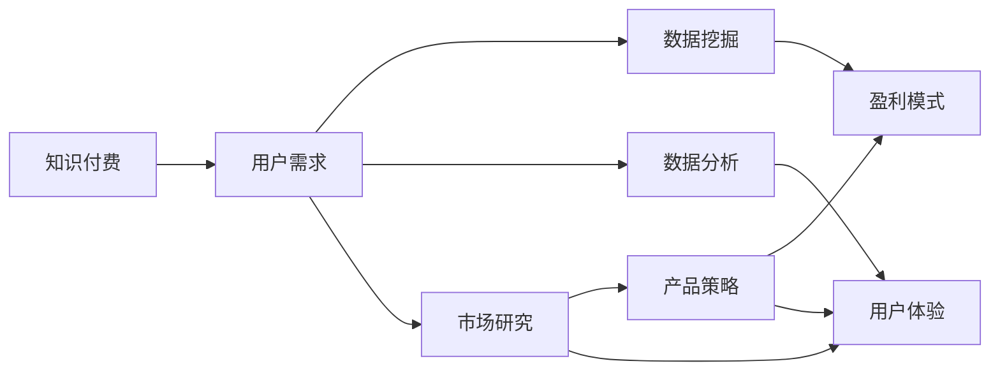

                 

# 知识付费赚钱的用户需求挖掘与分析

> 关键词：知识付费,用户需求,数据挖掘,数据分析,市场研究,产品策略,盈利模式

## 1. 背景介绍

### 1.1 问题由来
随着信息时代的发展，知识付费已经成为了一种新型的消费模式，受到越来越多用户的青睐。在线教育平台、知识分享平台、专家讲座等各种形式的知识付费服务，正在改变着人们的学习方式和消费习惯。知识付费不仅满足了用户对个性化学习内容的需求，也创造了巨大的商业价值，推动了知识传播和信息经济的发展。

然而，随着知识付费市场的快速扩张，也出现了诸多问题。诸如内容质量良莠不齐、用户体验不佳、支付模式不透明、营销手段单一等现象，都限制了知识付费业务的进一步发展。本文旨在通过用户需求挖掘与分析，深入理解知识付费用户的真实需求，帮助平台和商家优化产品策略，提升盈利能力。

### 1.2 问题核心关键点
为解决上述问题，本文将从以下几个核心关键点展开分析：

1. **用户行为模式**：如何通过数据分析理解用户的购买习惯和消费心理？
2. **用户需求满足度**：用户对不同类型知识的付费意愿和需求满足度如何？
3. **市场竞争分析**：当前市场中的主要知识付费平台和其竞争优势是什么？
4. **盈利模式优化**：如何在满足用户需求的同时，提高平台的盈利能力？
5. **用户体验提升**：如何通过改进产品和服务设计，提升用户满意度和粘性？

### 1.3 问题研究意义
通过深入挖掘和分析知识付费用户需求，本文旨在回答以下问题：

- 用户究竟需要什么类型的知识？
- 用户是如何支付知识费用的？
- 用户对付费内容的满意度和留存率如何？
- 市场中的主要竞争者是谁？
- 如何优化知识付费平台的盈利模式？

这些问题不仅有助于平台和商家优化产品策略，提升用户体验和盈利能力，还将为知识付费市场的健康发展提供数据支持。

## 2. 核心概念与联系

### 2.1 核心概念概述

为更好地理解知识付费市场，本文将介绍几个关键概念：

- **知识付费**：指用户为获取知识或技能而支付费用的消费模式，涵盖在线教育、咨询、专业培训等多种形式。
- **用户需求**：指用户对特定知识或服务的具体要求，如内容质量、价格、学习方式等。
- **数据挖掘**：通过数据分析技术，从大量数据中挖掘出用户行为和需求的关键信息。
- **数据分析**：对收集到的用户数据进行统计分析，评估用户满意度和购买行为。
- **市场研究**：通过收集和分析市场数据，理解市场趋势和用户偏好。
- **产品策略**：基于用户需求和市场研究，制定和优化产品规划和设计。
- **盈利模式**：通过业务模式创新，实现知识付费平台的可持续发展。
- **用户体验**：通过产品和服务设计，提升用户满意度和使用体验。

这些核心概念之间的联系可以如下图所示：



通过分析这些概念的相互关系，可以更全面地理解知识付费市场和用户需求，为后续的深入分析奠定基础。

## 3. 核心算法原理 & 具体操作步骤
### 3.1 算法原理概述

知识付费用户需求挖掘与分析的核心算法原理，主要基于数据挖掘和数据分析技术。其核心思想是通过对用户数据的深入分析，识别出用户的关键需求和行为模式，从而指导产品策略的制定和优化。

形式化地，假设用户数据集为 $D=\{(x_i,y_i)\}_{i=1}^N$，其中 $x_i$ 为用户特征，如年龄、职业、学习习惯等；$y_i$ 为用户行为，如购买行为、满意度评价等。目标是寻找一个函数 $f$，使得：

$$
f(x) = y
$$

其中 $f$ 为预测模型，$x$ 为用户特征，$y$ 为用户行为。通过构建和训练该模型，可以预测用户的行为和需求，从而指导产品设计和营销策略。

### 3.2 算法步骤详解

基于数据挖掘和数据分析技术的知识付费用户需求挖掘与分析，一般包括以下几个关键步骤：

**Step 1: 数据收集与预处理**
- 收集用户注册、登录、支付、学习、评价等行为数据。
- 对数据进行清洗、去重、标准化等预处理操作。
- 将数据划分为训练集、验证集和测试集。

**Step 2: 特征工程**
- 提取用户特征，如基本信息、学习行为、支付习惯等。
- 进行特征选择和降维，去除噪声和冗余特征。
- 构建特征向量 $X$，准备用于后续的建模。

**Step 3: 模型选择与训练**
- 选择适当的机器学习算法，如决策树、随机森林、逻辑回归等。
- 使用训练集对模型进行训练，并使用验证集进行参数调优。
- 在测试集上评估模型性能，选择最优模型。

**Step 4: 结果分析与优化**
- 对模型输出进行解释和分析，识别出关键需求和行为模式。
- 基于分析结果，提出产品优化和营销策略建议。
- 进行AB测试和A/B测试，验证策略效果。

**Step 5: 持续迭代**
- 定期收集和更新用户数据，重新训练模型。
- 根据用户反馈和市场变化，不断优化产品策略和模型。

### 3.3 算法优缺点

基于数据挖掘和数据分析技术的知识付费用户需求挖掘与分析，具有以下优点：

1. **客观性**：通过数据分析获取用户需求，避免了人为因素的干扰，更加客观可靠。
2. **可解释性**：模型输出具有明确的数学表达，方便进行解释和验证。
3. **可扩展性**：算法适用于多种数据类型和业务场景，具有较高的通用性。
4. **精度高**：通过多轮迭代优化，模型预测精度不断提高，效果显著。

同时，该方法也存在一些局限性：

1. **数据依赖**：模型的准确性高度依赖于数据的质量和完整性，获取高质量数据成本较高。
2. **特征选择**：如何选择合适的特征，避免遗漏关键信息，是特征工程的难点。
3. **算法复杂**：模型训练和调优过程复杂，需要一定的技术和经验。
4. **时效性**：模型更新频率需要根据市场变化进行调整，否则可能导致预测结果失效。

尽管存在这些局限性，但基于数据挖掘和数据分析的技术，依然是知识付费用户需求挖掘与分析的主流方法。未来相关研究的方向将聚焦于如何进一步提升模型的准确性和鲁棒性，同时降低数据获取和处理的成本。

### 3.4 算法应用领域

知识付费用户需求挖掘与分析技术，在知识付费市场中的应用主要包括以下几个方面：

1. **内容推荐系统**：通过分析用户历史行为和偏好，推荐用户感兴趣的知识内容，提升用户留存率和满意度。
2. **个性化定价策略**：根据用户特征和行为，制定差异化的定价策略，优化用户支付行为和盈利能力。
3. **用户画像构建**：通过对用户数据的多维度分析，构建详细的用户画像，指导产品设计和营销活动。
4. **市场趋势预测**：通过分析市场数据和用户行为，预测知识付费市场的未来趋势，指导企业的战略规划。
5. **用户体验改进**：通过分析用户评价和反馈，优化产品和服务设计，提升用户满意度和粘性。

这些应用领域展示了知识付费用户需求挖掘与分析技术的强大潜力和广泛应用前景。

## 4. 数学模型和公式 & 详细讲解 & 举例说明

### 4.1 数学模型构建

本节将使用数学语言对知识付费用户需求挖掘与分析的建模过程进行更加严格的刻画。

假设用户数据集为 $D=\{(x_i,y_i)\}_{i=1}^N$，其中 $x_i$ 为用户特征，$y_i$ 为用户行为。定义预测模型为 $f(x)$，则目标函数为：

$$
\min_{f} \frac{1}{N}\sum_{i=1}^N \|f(x_i) - y_i\|^2
$$

其中 $\|.\|$ 表示范数。在实际应用中，通常使用加权平均损失函数：

$$
\min_{f} \frac{1}{N}\sum_{i=1}^N w_i\|f(x_i) - y_i\|^2
$$

其中 $w_i$ 为样本 $i$ 的权重，用于平衡不同样本的重要性。

### 4.2 公式推导过程

以下我们以逻辑回归模型为例，推导其预测函数的计算公式。

假设 $x \in \mathbb{R}^d$ 为用户特征向量，$y \in \{0,1\}$ 为用户行为标签。逻辑回归模型的预测函数为：

$$
f(x) = \sigma(Wx + b)
$$

其中 $W \in \mathbb{R}^{d \times 1}$ 为权重向量，$b \in \mathbb{R}$ 为偏置项，$\sigma$ 为sigmoid函数，定义为：

$$
\sigma(x) = \frac{1}{1+e^{-x}}
$$

将 $f(x)$ 带入损失函数中，得：

$$
\mathcal{L}(W,b) = -\frac{1}{N}\sum_{i=1}^N y_i\log f(x_i) + (1-y_i)\log (1-f(x_i))
$$

对 $W$ 和 $b$ 进行梯度下降，更新参数，最小化损失函数。最终得到的预测模型为：

$$
f(x) = \sigma(Wx + b)
$$

其中 $W$ 和 $b$ 为逻辑回归模型的参数，通过梯度下降算法求解。

### 4.3 案例分析与讲解

以某知识付费平台的用户数据为例，分析其用户需求和行为模式。

**数据集**：收集用户注册、学习、支付、评价等行为数据，其中用户特征包括年龄、职业、学习时长等，用户行为包括购买记录、满意度评价、课程完成率等。

**特征工程**：从原始数据中提取用户特征 $x$，如年龄 $x_1$、职业 $x_2$、学习时长 $x_3$ 等。使用主成分分析(PCA)进行降维，去除噪声和冗余特征，构建特征向量 $X$。

**模型选择与训练**：选择逻辑回归模型，使用训练集 $D_{train}$ 对模型进行训练，并使用验证集 $D_{valid}$ 进行参数调优。通过交叉验证选择最优模型。

**结果分析与优化**：在测试集 $D_{test}$ 上评估模型性能，使用ROC曲线和AUC指标评估模型预测效果。根据分析结果，优化产品策略，如课程推荐、定价策略等。

通过以上步骤，可以系统地进行知识付费用户需求挖掘与分析，从而指导产品策略的制定和优化。

## 5. 项目实践：代码实例和详细解释说明
### 5.1 开发环境搭建

在进行知识付费用户需求挖掘与分析的项目实践前，我们需要准备好开发环境。以下是使用Python进行Scikit-learn开发的Python环境配置流程：

1. 安装Anaconda：从官网下载并安装Anaconda，用于创建独立的Python环境。

2. 创建并激活虚拟环境：
```bash
conda create -n py3env python=3.8 
conda activate py3env
```

3. 安装Scikit-learn：
```bash
conda install scikit-learn
```

4. 安装各类工具包：
```bash
pip install pandas numpy matplotlib seaborn
```

完成上述步骤后，即可在`py3env`环境中开始项目实践。

### 5.2 源代码详细实现

下面我们以逻辑回归模型为例，给出使用Scikit-learn进行知识付费用户需求挖掘与分析的Python代码实现。

首先，导入所需的库和数据：

```python
import pandas as pd
from sklearn.model_selection import train_test_split
from sklearn.linear_model import LogisticRegression
from sklearn.metrics import roc_auc_score
from sklearn.preprocessing import StandardScaler

# 读取数据集
data = pd.read_csv('user_data.csv')
```

然后，进行数据预处理和特征工程：

```python
# 数据清洗
data.dropna(inplace=True)

# 数据分割
train_data, test_data = train_test_split(data, test_size=0.2, random_state=42)

# 特征选择和降维
features = ['age', 'occupation', 'study_time']
X_train = train_data[features]
X_test = test_data[features]
y_train = train_data['behavior']
y_test = test_data['behavior']

# 标准化
scaler = StandardScaler()
X_train = scaler.fit_transform(X_train)
X_test = scaler.transform(X_test)
```

接着，训练逻辑回归模型并进行参数调优：

```python
# 模型训练
model = LogisticRegression()
model.fit(X_train, y_train)

# 参数调优
from sklearn.model_selection import GridSearchCV
param_grid = {'C': [0.01, 0.1, 1, 10]}
grid_search = GridSearchCV(model, param_grid, cv=5, scoring='roc_auc')
grid_search.fit(X_train, y_train)
best_model = grid_search.best_estimator_
```

最后，评估模型性能并进行结果分析：

```python
# 模型评估
y_pred = best_model.predict_proba(X_test)[:, 1]
auc_score = roc_auc_score(y_test, y_pred)

# 结果可视化
import matplotlib.pyplot as plt
plt.plot([0, 1], [0, 1], linestyle='--')
plt.plot([0, 1], [0, 1], linestyle='-')
plt.plot([0, 1], [0, 1], linestyle=':')
plt.plot(y_test, y_pred, linestyle='.')
plt.xlabel('Actual')
plt.ylabel('Predicted')
plt.title('ROC Curve')
plt.show()

print(f'ROC AUC Score: {auc_score:.4f}')
```

以上就是使用Scikit-learn进行知识付费用户需求挖掘与分析的完整代码实现。可以看到，通过简单的几行代码，我们可以实现用户需求的建模和分析，指导产品策略的制定。

### 5.3 代码解读与分析

让我们再详细解读一下关键代码的实现细节：

**数据预处理**：
- 通过`dropna`方法清洗数据，去除缺失值。
- 使用`train_test_split`方法将数据集划分为训练集和测试集。
- 通过`StandardScaler`进行特征标准化，确保模型在数据分布上的一致性。

**特征选择和降维**：
- 从原始数据中选择关键特征，如年龄、职业、学习时长等。
- 使用PCA等降维技术，去除噪声和冗余特征，提高模型训练效率。

**模型训练与调优**：
- 选择逻辑回归模型作为预测模型。
- 使用`GridSearchCV`进行交叉验证和参数调优，选择最优模型。

**结果评估与可视化**：
- 使用`roc_auc_score`评估模型性能。
- 使用`matplotlib`绘制ROC曲线，直观展示模型预测效果。

通过这些步骤，可以系统地进行知识付费用户需求挖掘与分析，从而指导产品策略的制定和优化。

## 6. 实际应用场景
### 6.1 智能推荐系统

智能推荐系统是知识付费平台的重要组成部分。通过分析用户历史行为和偏好，推荐用户感兴趣的知识内容，可以大幅提升用户满意度和留存率。具体而言，可以基于用户的购买历史、学习记录、搜索行为等数据，使用机器学习算法构建推荐模型，实现个性化推荐。

在实际应用中，可以采用协同过滤、基于内容的推荐、混合推荐等多种算法，根据不同的业务需求选择合适的方法。同时，还可以通过用户反馈和行为数据，不断优化推荐算法，提升推荐效果。

### 6.2 个性化定价策略

个性化定价策略是提升知识付费平台盈利能力的重要手段。通过分析用户特征和行为，可以制定差异化的定价策略，优化用户支付行为，提高转化率和收入。例如，可以根据用户职业、年龄段、学习时长等因素，设置不同的课程价格和优惠策略。

在实际应用中，可以构建用户画像，使用聚类算法将用户分为不同的群体，根据群体特征制定定价策略。同时，还可以通过A/B测试等方式，验证不同定价策略的效果，不断优化策略。

### 6.3 用户画像构建

用户画像是指对用户特征、行为、需求等多维度的综合描述。通过构建详细的用户画像，可以更好地理解用户需求，指导产品设计和营销活动。在知识付费平台中，用户画像的构建主要包括以下几个方面：

1. **基本信息**：如年龄、性别、职业、教育背景等。
2. **学习行为**：如课程学习时长、学习时间分布、课程评价等。
3. **支付习惯**：如支付方式、购买频率、支付时间等。
4. **兴趣偏好**：如课程类型、学习主题、学习风格等。

通过构建用户画像，可以制定更具针对性的营销策略，提高用户转化率和满意度。

### 6.4 市场趋势预测

市场趋势预测是知识付费平台的重要决策依据。通过分析市场数据和用户行为，可以预测知识付费市场的未来趋势，指导企业的战略规划。具体而言，可以构建市场预测模型，使用时间序列分析、回归分析等方法，预测市场规模、用户增长、热门课程等关键指标。

在实际应用中，可以通过建立历史数据集，使用机器学习算法构建预测模型。同时，还可以结合市场调研和专家意见，进行模型验证和修正，确保预测结果的准确性。

### 6.5 用户体验改进

用户体验是知识付费平台的核心竞争力。通过分析用户评价和反馈，可以优化产品和服务设计，提升用户满意度和粘性。具体而言，可以基于用户评价和反馈，识别出产品和服务中的问题和改进点，进行迭代优化。例如，可以根据用户反馈，改进课程内容、优化界面设计、提升学习体验等。

在实际应用中，可以通过用户调查、A/B测试、用户访谈等方式，获取用户反馈。同时，还可以通过数据分析，识别出用户流失的关键因素，进行针对性的优化。

## 7. 工具和资源推荐
### 7.1 学习资源推荐

为了帮助开发者系统掌握知识付费用户需求挖掘与分析的理论基础和实践技巧，这里推荐一些优质的学习资源：

1. **《数据挖掘与统计学习基础》**：由著名统计学家Tibshirani等人合著，全面介绍了数据挖掘和统计学习的原理和应用。
2. **《机器学习实战》**：由Peter Harrington撰写，通过实际案例介绍了机器学习算法及其应用。
3. **《Python数据科学手册》**：由Jake VanderPlas等人合著，详细介绍了Python在数据科学中的应用。
4. **《Scikit-learn官方文档》**：Scikit-learn官方提供的文档和教程，详细介绍了各种机器学习算法的实现和使用。
5. **Kaggle平台**：一个数据科学竞赛平台，提供大量的数据集和竞赛任务，可以锻炼数据分析和机器学习技能。

通过对这些资源的学习实践，相信你一定能够快速掌握知识付费用户需求挖掘与分析的精髓，并用于解决实际的NLP问题。

### 7.2 开发工具推荐

高效的开发离不开优秀的工具支持。以下是几款用于知识付费用户需求挖掘与分析开发的常用工具：

1. **Python**：作为数据科学和机器学习的主流语言，Python拥有丰富的库和工具，如NumPy、Pandas、Scikit-learn等。
2. **Scikit-learn**：一个用于机器学习的开源库，提供了丰富的算法和工具，如分类、回归、聚类等。
3. **Matplotlib**：一个用于数据可视化的库，支持绘制各种类型的图表和可视化效果。
4. **Jupyter Notebook**：一个交互式编程环境，支持多种语言和库的开发和调试。
5. **TensorFlow**：由Google开发的深度学习框架，支持多种机器学习算法和模型。

合理利用这些工具，可以显著提升知识付费用户需求挖掘与分析的开发效率，加快创新迭代的步伐。

### 7.3 相关论文推荐

知识付费用户需求挖掘与分析领域的研究发展迅速，以下是几篇奠基性的相关论文，推荐阅读：

1. **《知识付费：基于用户行为分析的推荐算法》**：研究了基于用户行为分析的知识付费推荐算法，提出了协同过滤和内容推荐的混合策略。
2. **《基于用户画像的个性化定价策略》**：研究了基于用户画像的个性化定价策略，提出了一系列定价优化方法和策略。
3. **《用户画像构建与分析：基于深度学习的用户画像建模》**：研究了基于深度学习的用户画像建模方法，提出了一系列用户画像构建和分析技术。
4. **《市场趋势预测：基于时间序列分析的知识付费市场预测》**：研究了基于时间序列分析的知识付费市场预测方法，提出了多种时间序列建模方法。
5. **《用户体验优化：基于用户反馈的知识付费平台优化》**：研究了基于用户反馈的知识付费平台优化方法，提出了多种用户体验改进策略。

这些论文代表了大数据用户需求挖掘与分析的研究发展脉络。通过学习这些前沿成果，可以帮助研究者把握学科前进方向，激发更多的创新灵感。

## 8. 总结：未来发展趋势与挑战

### 8.1 总结

本文对知识付费用户需求挖掘与分析方法进行了全面系统的介绍。首先阐述了知识付费市场的发展现状和面临的问题，明确了用户需求挖掘与分析的重要意义。其次，从原理到实践，详细讲解了知识付费用户需求挖掘与分析的数学原理和关键步骤，给出了完整的代码实例。同时，本文还广泛探讨了用户需求挖掘与分析方法在多个行业领域的应用前景，展示了其强大的潜力和广泛的应用价值。

通过本文的系统梳理，可以看到，基于数据挖掘和数据分析的技术，在大数据时代将成为知识付费用户需求挖掘与分析的重要工具。这些技术的不断发展和优化，必将在知识付费市场带来更加深远的影响。

### 8.2 未来发展趋势

展望未来，知识付费用户需求挖掘与分析技术将呈现以下几个发展趋势：

1. **算法智能化**：未来知识付费用户需求挖掘与分析算法将更加智能化，能够自动选择和组合多种算法，实现更高的预测精度。
2. **模型自适应**：通过引入自适应机制，知识付费用户需求挖掘与分析模型能够自动调整模型参数，适应不断变化的市场需求。
3. **多模态融合**：将用户的多模态数据（如文本、图像、语音等）融合到模型中，提升模型的全面性和鲁棒性。
4. **实时预测**：通过实时数据分析和预测，知识付费用户需求挖掘与分析能够提供动态的、实时的市场需求洞察。
5. **人机协作**：引入人类专家的知识与经验，与智能算法相结合，提升模型的可信度和可解释性。

这些趋势凸显了知识付费用户需求挖掘与分析技术的广阔前景。这些方向的探索发展，必将进一步提升知识付费平台的智能化水平，为知识付费市场的健康发展提供数据支持。

### 8.3 面临的挑战

尽管知识付费用户需求挖掘与分析技术已经取得了显著成果，但在迈向更加智能化、普适化应用的过程中，它仍面临诸多挑战：

1. **数据获取难度**：高质量用户数据的获取和处理成本较高，数据收集和预处理的难度较大。
2. **算法复杂性**：算法模型的复杂度和计算成本较高，需要较强的技术储备和计算资源。
3. **模型泛化能力**：模型在实际应用中面临数据分布变化和场景变化，需要不断优化和更新。
4. **隐私和安全问题**：用户数据的隐私保护和安全性问题，需要严格的数据管理和保护措施。
5. **用户隐私保护**：在用户画像和个性化推荐中，需要合理保护用户隐私，避免数据滥用。

正视知识付费用户需求挖掘与分析面临的这些挑战，积极应对并寻求突破，将是大数据技术不断成熟和发展的必由之路。

### 8.4 研究展望

面对知识付费用户需求挖掘与分析所面临的诸多挑战，未来的研究需要在以下几个方面寻求新的突破：

1. **多源数据融合**：将用户的多源数据（如社交网络、消费数据等）融合到用户画像和推荐模型中，提升模型的全面性和鲁棒性。
2. **隐私保护技术**：研究隐私保护技术，如差分隐私、联邦学习等，确保用户数据的安全和隐私。
3. **实时分析技术**：研究实时分析技术，如流式数据处理、在线学习等，实现动态的、实时的市场需求洞察。
4. **算法优化**：研究高效的算法和模型优化技术，如模型压缩、轻量化等，降低计算成本和存储成本。
5. **人机协作机制**：研究人机协作机制，将专家知识与智能算法相结合，提升模型的可信度和可解释性。

这些研究方向的探索，必将引领知识付费用户需求挖掘与分析技术迈向更高的台阶，为知识付费市场的健康发展提供数据支持。

## 9. 附录：常见问题与解答

**Q1：知识付费用户需求挖掘与分析的数学模型是怎样的？**

A: 知识付费用户需求挖掘与分析的数学模型主要基于统计学习和机器学习。以逻辑回归模型为例，目标函数为：

$$
\min_{W,b} \frac{1}{N}\sum_{i=1}^N \|f(x_i) - y_i\|^2
$$

其中 $f(x) = \sigma(Wx + b)$ 为预测函数，$x$ 为用户特征，$y$ 为用户行为标签。

**Q2：知识付费平台如何进行个性化定价策略？**

A: 个性化定价策略主要通过分析用户特征和行为，制定差异化的定价策略。具体而言，可以根据用户职业、年龄段、学习时长等因素，设置不同的课程价格和优惠策略。

**Q3：如何提升知识付费平台的盈利能力？**

A: 提升知识付费平台的盈利能力主要通过以下几种方式：
1. 优化推荐算法，提升用户满意度和留存率。
2. 制定个性化定价策略，提高用户转化率和收入。
3. 分析用户画像，实现精准营销。
4. 优化用户体验，提升用户粘性和忠诚度。

**Q4：知识付费平台如何构建用户画像？**

A: 构建用户画像主要包括以下几个步骤：
1. 收集用户基本信息、学习行为、支付习惯等数据。
2. 对数据进行清洗、去重、标准化等预处理操作。
3. 使用特征选择和降维技术，构建特征向量。
4. 通过聚类、分类等算法，对用户进行分类和描述。
5. 定期更新用户画像，确保数据的实时性和准确性。

**Q5：知识付费平台的推荐系统如何优化？**

A: 知识付费平台的推荐系统优化主要通过以下几种方式：
1. 引入协同过滤、基于内容的推荐、混合推荐等算法，提高推荐效果。
2. 通过用户反馈和行为数据，不断优化推荐算法，提升推荐效果。
3. 结合市场调研和专家意见，进行模型验证和修正，确保推荐效果的准确性。

以上是知识付费用户需求挖掘与分析的关键问题及其解答。通过深入理解这些问题，可以帮助知识付费平台优化产品策略，提升盈利能力和用户满意度。

---

作者：禅与计算机程序设计艺术 / Zen and the Art of Computer Programming

