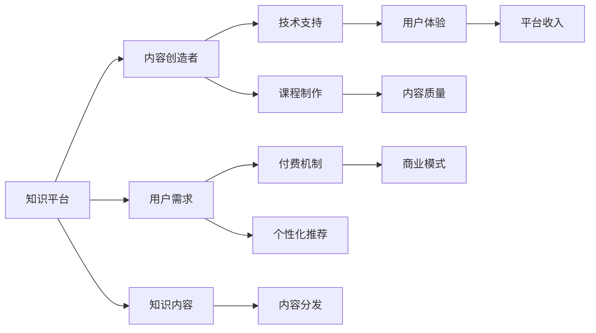

                 

# 知识付费：程序员的创业加速器

## 1. 背景介绍

随着互联网和数字经济的飞速发展，程序员这一职业逐渐从传统的技术岗位转变为创业者和企业家的主要来源之一。然而，成功转型的程序员往往面临着资源限制、经验不足、市场竞争力弱等问题。知识付费作为一种新兴的商业模式，正逐渐成为程序员创业的重要加速器。

### 1.1 知识付费概述

知识付费是指通过在线课程、专栏、电子书、付费咨询等方式，为用户提供系统化、深度化的专业知识服务，满足其对于技术学习、行业动态、职业规划等方面的需求。这种模式不仅帮助用户获取所需信息，还在一定程度上培养了其学习习惯，增强了其市场竞争力。

### 1.2 知识付费的历史和现状

知识付费的兴起，源于互联网内容消费方式的变迁。从免费论坛、博客等公共内容平台，逐步转向了付费订阅、打赏等商业变现模式。特别是自2014年以后，随着优质内容供给的增多和用户对深度学习需求的增加，知识付费市场进入快速发展期。根据艾瑞咨询的数据，2021年中国知识付费市场规模已达425.7亿元，预计到2023年将突破600亿元。

### 1.3 知识付费对程序员的吸引力

对于程序员而言，知识付费主要具有以下几方面的吸引力：

1. **时间成本低**：相比于传统的技术学习路径（如报班、自学），知识付费可以节省大量的时间成本，使程序员能更高效地掌握新技能。
2. **资源集中**：知识付费平台往往汇聚了行业内的顶尖专家和学者，提供系统的课程和专业的指导，帮助程序员站在更高的起点上学习。
3. **深度定制**：知识付费平台能根据用户的个性化需求，提供定制化的学习方案，满足不同层级、不同领域的职业需求。
4. **成本可控**：知识付费通常按课程或订阅时间收费，相对于昂贵的线下培训和长期自学，成本更为可控。

## 2. 核心概念与联系

### 2.1 核心概念概述

知识付费本质上是通过商业化的知识服务，满足用户对专业知识的需求。其主要涉及以下几个核心概念：

- **知识平台**：如得到、喜马拉雅、Coursera等，为用户提供知识内容，并收取费用。
- **内容创造者**：如吴军、李笑来、张一鸣等，通过制作高质量内容，获得用户付费。
- **用户需求**：如技术学习、职业发展、兴趣培养等，推动知识付费市场的繁荣。
- **技术支持**：如自然语言处理、推荐算法、社交网络等，为知识平台提供技术支持，提升用户体验和内容分发效率。

### 2.2 核心概念联系

这些核心概念通过互联网技术有机连接，形成了一个良性互动的知识生态系统。用户通过付费获取知识，创造者通过提供高质量内容获利，而技术支持则帮助平台实现内容精准分发和用户体验优化。这其中，程序员作为知识付费的重要需求来源，通过学习新知识、掌握新技术，提升自身竞争力，实现创业梦想。

通过以下Mermaid流程图，可以更直观地理解知识付费生态系统的工作流程：



## 3. 核心算法原理 & 具体操作步骤

### 3.1 算法原理概述

知识付费平台的核心算法主要包括个性化推荐、内容推荐、定价模型等，这些算法通过复杂的数据处理和机器学习技术，提升用户体验和平台收益。

- **个性化推荐**：利用协同过滤、基于内容的推荐、深度学习推荐等算法，根据用户的历史行为数据和兴趣标签，推荐最相关的内容。
- **内容推荐**：通过文本分析、图像识别、视频分析等技术，提取内容特征，利用聚类算法、神经网络等技术，提升推荐准确率。
- **定价模型**：根据课程时长、难度、内容质量等因素，动态调整课程价格，实现成本控制和收益最大化。

### 3.2 算法步骤详解

以下是知识付费平台的主要算法步骤：

**Step 1: 数据收集与预处理**

- 收集用户行为数据（如点击、购买、评分等），提取内容特征（如标题、摘要、标签等），并清洗异常数据。
- 使用特征工程技术，将原始数据转换为模型可接受的输入格式。

**Step 2: 模型训练与优化**

- 基于用户行为数据和内容特征，训练推荐算法（如协同过滤、深度学习等）。
- 使用交叉验证、网格搜索等技术，调整模型参数，提升模型准确率。
- 利用A/B测试等方法，评估推荐效果，进行模型迭代优化。

**Step 3: 用户行为预测与推荐**

- 利用训练好的推荐模型，对用户行为进行预测，推荐最相关的内容。
- 根据用户反馈数据，实时更新推荐模型，提升推荐效果。

**Step 4: 定价策略优化**

- 分析用户购买行为，建立定价模型，优化课程价格。
- 利用用户留存率、复购率等指标，调整定价策略，提升平台收益。

### 3.3 算法优缺点

知识付费平台的算法具有以下优点：

- **精准推荐**：通过复杂的数据分析和机器学习技术，提供高度个性化的推荐服务，提升用户粘性。
- **高效运营**：自动化数据处理和模型训练，降低人力成本，提升运营效率。
- **市场竞争**：通过算法优化，提升内容分发效率，增强市场竞争力。

同时，也存在一些局限性：

- **数据隐私**：大量用户行为数据的收集和处理，可能侵犯用户隐私。
- **内容质量**：如果内容质量不高，可能导致用户流失。
- **模型偏见**：模型训练可能引入数据偏见，导致推荐不公。
- **动态变化**：用户需求和市场环境变化快速，模型需要频繁调整和优化。

### 3.4 算法应用领域

知识付费平台的核心算法广泛应用于以下几个领域：

- **教育培训**：提供系统化、深度的教育课程，帮助用户快速掌握新技能。
- **职业发展**：提供行业动态、职业规划、简历指导等内容，帮助用户实现职业转型。
- **兴趣培养**：提供各类兴趣类内容，丰富用户生活，提升幸福指数。
- **商业咨询**：提供行业分析、商业策略、财务管理等内容，帮助企业决策。

## 4. 数学模型和公式 & 详细讲解

### 4.1 数学模型构建

知识付费平台的推荐算法主要基于协同过滤、基于内容的推荐、深度学习推荐等技术。这里以协同过滤算法为例，构建推荐模型。

**协同过滤算法**：
- **用户-物品评分矩阵**：$R_{ij}$
- **用户聚类**：$U_k$
- **物品聚类**：$I_k$

### 4.2 公式推导过程

协同过滤算法的推荐公式如下：

$$
\hat{R}_{ui} = \frac{\sum_{i=1}^N \sum_{j=1}^M R_{uj} \cdot R_{vi}}{\sqrt{\sum_{i=1}^N R_{ui}^2} \cdot \sqrt{\sum_{j=1}^M R_{vj}^2}}
$$

其中，$\hat{R}_{ui}$ 为对用户 $u$ 推荐物品 $i$ 的评分，$R_{uj}$ 和 $R_{vi}$ 分别为用户 $u$ 和物品 $i$ 与用户 $v$ 的评分，$N$ 和 $M$ 分别为用户和物品的数量。

### 4.3 案例分析与讲解

假设有一个用户 $u_1$，已经对三个物品 $i_1$、$i_2$、$i_3$ 评分，分别为3、4、2。现在需要为 $u_1$ 推荐一个新的物品 $i_4$，已知 $i_4$ 的评分与 $i_1$、$i_2$、$i_3$ 分别为4、5、3。

根据协同过滤算法，$u_1$ 对 $i_4$ 的预测评分 $\hat{R}_{u1i4}$ 可以计算为：

$$
\hat{R}_{u1i4} = \frac{4 \cdot 5 + 3 \cdot 5}{\sqrt{3^2 + 4^2} \cdot \sqrt{5^2 + 3^2}} = \frac{50}{\sqrt{25 + 16} \cdot \sqrt{25 + 9}} = \frac{50}{\sqrt{41} \cdot \sqrt{34}} \approx 2.7
$$

因此，$u_1$ 对 $i_4$ 的预测评分为2.7，可作为推荐依据。

## 5. 项目实践：代码实例和详细解释说明

### 5.1 开发环境搭建

知识付费平台的开发需要搭建一个完整的后端系统，以支持用户注册、登录、课程购买、内容推荐等功能。以下是开发环境的搭建步骤：

1. 安装Docker和Docker Compose，用于容器化开发和测试。
2. 安装MySQL和Redis，用于数据库和缓存。
3. 安装Nginx，用于负载均衡和反向代理。
4. 安装Gunicorn和Supervisor，用于Python应用的进程管理和负载均衡。
5. 安装Kubernetes和Prometheus，用于应用容器的编排和监控。

### 5.2 源代码详细实现

以下是一个基于Python和Flask框架的知识付费平台的代码实现：

```python
from flask import Flask, request, jsonify
from pymysql import connect
from redis import Redis

app = Flask(__name__)

# 连接MySQL数据库
db = connect(host='localhost', user='root', password='password', db='test')
cursor = db.cursor()

# 连接Redis缓存
redis = Redis(host='localhost', port=6379, db=0)

# 商品数据
products = {
    1: {
        'name': 'Python基础',
        'description': 'Python语言基础课程',
        'price': 199,
        'creator': '张三'
    },
    2: {
        'name': '机器学习',
        'description': '机器学习算法和应用',
        'price': 299,
        'creator': '李四'
    }
}

@app.route('/get_product', methods=['GET'])
def get_product():
    product_id = request.args.get('product_id')
    if product_id in products:
        product = products[product_id]
        return jsonify(product)
    else:
        return jsonify({'error': 'product not found'}), 404

@app.route('/purchase', methods=['POST'])
def purchase():
    product_id = request.json['product_id']
    username = request.json['username']
    if product_id in products:
        # 查询用户是否已购买该课程
        cursor.execute('SELECT * FROM orders WHERE user_id=%s AND product_id=%s', (username, product_id))
        result = cursor.fetchone()
        if result:
            return jsonify({'error': 'already purchased'})
        else:
            # 扣除用户余额
            cursor.execute('UPDATE users SET balance=balance-199 WHERE username=%s', (username,))
            # 插入订单记录
            cursor.execute('INSERT INTO orders (user_id, product_id) VALUES (%s, %s)', (username, product_id))
            return jsonify({'message': 'purchase successful'})
    else:
        return jsonify({'error': 'product not found'}), 404

@app.route('/recommend', methods=['GET'])
def recommend():
    user_id = request.args.get('user_id')
    # 查询用户已购买商品
    cursor.execute('SELECT product_id FROM orders WHERE user_id=%s', (user_id,))
    purchased_products = [row[0] for row in cursor.fetchall()]
    # 查询所有商品
    cursor.execute('SELECT * FROM products')
    all_products = cursor.fetchall()
    # 计算评分矩阵
    rating_matrix = {}
    for product in all_products:
        product_id = product[0]
        name = product[1]
        price = product[2]
        creator = product[3]
        rating_matrix[product_id] = {'name': name, 'price': price, 'creator': creator}
        for order in purchased_products:
            rating_matrix[product_id]['rating'] = rating_matrix[product_id].get('rating', 0) + 1
    # 计算评分平均值
    for product_id in rating_matrix:
        rating_matrix[product_id]['rating'] /= rating_matrix[product_id]['rating']
    # 对评分矩阵进行排序
    sorted_products = sorted(rating_matrix.items(), key=lambda x: x[1]['rating'], reverse=True)
    # 获取推荐产品
    recommended_products = [product[0] for product in sorted_products]
    # 将推荐产品存储到Redis缓存中
    redis.set(user_id, recommended_products)
    return jsonify({'recommendations': recommended_products})

if __name__ == '__main__':
    app.run(host='0.0.0.0', port=5000)
```

### 5.3 代码解读与分析

上述代码实现了一个简单的知识付费平台，包括以下功能：

1. **商品信息查询**：通过GET请求，查询指定商品的详细信息。
2. **课程购买**：通过POST请求，扣除用户余额，插入订单记录，实现课程购买功能。
3. **商品推荐**：通过GET请求，根据用户已购买商品，推荐新的商品。

代码中使用了Flask框架和MySQL数据库，实现了基本的业务逻辑。其中，商品信息存储在MySQL数据库中，通过查询和插入操作，实现课程购买和推荐功能。商品推荐算法使用了简单的评分矩阵计算，根据用户已购买商品，推荐评分较高的商品。

## 6. 实际应用场景

### 6.1 教育培训

知识付费在教育培训领域有着广泛的应用，主要体现在以下几个方面：

1. **在线课程**：提供系统化的技术课程，帮助学生快速掌握新知识。
2. **技能培训**：提供职业培训、编程技能培训等，帮助用户提升职业技能。
3. **学术研究**：提供科研论文、实验指导等，帮助学术研究人员开展研究工作。

### 6.2 职业发展

知识付费平台在职业发展领域的作用主要体现在：

1. **职业规划**：提供职业规划、简历指导、面试技巧等内容，帮助用户实现职业转型。
2. **技能提升**：提供行业动态、技术前沿等内容，帮助用户提升职业竞争力。
3. **网络建设**：提供社交网络、专家咨询等内容，帮助用户拓展人脉，提升职业网络。

### 6.3 兴趣培养

知识付费平台在兴趣培养领域的作用主要体现在：

1. **兴趣爱好**：提供各类兴趣类内容，如音乐、绘画、摄影等，丰富用户生活，提升幸福感。
2. **生活技能**：提供生活技能、健康管理等内容，帮助用户提升生活质量。
3. **文化素养**：提供文学、艺术、历史等内容，提升用户文化素养。

### 6.4 商业咨询

知识付费平台在商业咨询领域的作用主要体现在：

1. **市场分析**：提供行业分析、市场趋势等内容，帮助企业做出科学决策。
2. **财务管理**：提供财务分析、投资策略等内容，帮助企业提升财务管理能力。
3. **法律咨询**：提供法律条款、商业纠纷等内容，帮助企业规避法律风险。

## 7. 工具和资源推荐

### 7.1 学习资源推荐

为了帮助开发者掌握知识付费的开发技术，以下是一些优质的学习资源：

1. **Coursera官方课程**：提供系统化的课程设计、在线学习、实战演练，涵盖多种编程语言和商业技术。
2. **Udemy课程**：提供实用性强的课程内容，涵盖技术栈、商业分析、项目管理等多个领域。
3. **慕课网（imooc.com）**：提供全面的课程资源，涵盖前端开发、后端开发、移动开发等多个方向。
4. **DataCamp**：提供数据科学和编程课程，帮助用户掌握数据分析、机器学习等技术。
5. **Kaggle**：提供数据科学竞赛、项目实战、社区交流，提升用户的数据分析和算法能力。

### 7.2 开发工具推荐

以下是一些常用的开发工具，助力知识付费平台的开发：

1. **Jupyter Notebook**：提供交互式编程环境，支持多种语言和工具，便于开发者进行代码调试和数据可视化。
2. **GitHub**：提供代码托管、版本控制、协作开发等功能，便于开发者进行团队协作。
3. **Docker**：提供容器化部署、环境隔离、版本管理等功能，便于开发者进行跨平台开发和部署。
4. **Kubernetes**：提供容器编排、负载均衡、自动扩展等功能，便于开发者进行应用部署和管理。
5. **Prometheus**：提供应用监控、告警通知、数据可视化等功能，便于开发者进行系统监控和问题定位。

### 7.3 相关论文推荐

以下是一些关于知识付费和推荐系统的经典论文，推荐阅读：

1. **《推荐系统实践》**：作者马德克·卡帕伊（Matei Zaharia），系统介绍了推荐系统的构建、优化和评估方法，提供了丰富的实际案例。
2. **《协同过滤算法》**：作者卡雷尔·伦茨（Carel Linters），详细介绍了协同过滤算法的原理、优缺点和应用场景。
3. **《深度学习推荐系统》**：作者李鸣（Li Mings），介绍了深度学习在推荐系统中的应用，提供了多种深度学习推荐算法。
4. **《个性化推荐系统》**：作者杨杨（Yang Yang），介绍了个性化推荐系统的设计、优化和评估方法，提供了多个实际项目案例。

## 8. 总结：未来发展趋势与挑战

### 8.1 研究成果总结

知识付费平台作为程序员创业的重要加速器，通过提供个性化推荐、系统化学习、深度内容等服务，帮助程序员快速掌握新技能，提升竞争力。未来，知识付费平台将在教育培训、职业发展、兴趣培养等多个领域发挥更大作用，成为程序员创业的重要工具。

### 8.2 未来发展趋势

知识付费平台的未来发展趋势主要体现在以下几个方面：

1. **内容多样化**：知识付费平台将提供更多元、更丰富的内容形式，如视频课程、音频课程、直播互动等，满足用户多样化的学习需求。
2. **技术创新**：知识付费平台将引入更多先进的技术手段，如自然语言处理、计算机视觉、增强现实等，提升用户体验和内容质量。
3. **社区化建设**：知识付费平台将建立更多专业社群，提供交流互动平台，增强用户粘性和社区活力。
4. **全球化扩展**：知识付费平台将向全球扩展，覆盖更多国家和地区，提供跨文化、跨语言的内容服务。

### 8.3 面临的挑战

知识付费平台在发展过程中也面临一些挑战：

1. **内容质量**：如何保证内容的准确性和权威性，避免误导用户，是一个重要的挑战。
2. **版权问题**：知识付费平台需处理好内容的版权问题，避免侵权风险，确保平台合法运营。
3. **技术难度**：知识付费平台的技术实现复杂，需要整合多种技术手段，保证系统的稳定性和可靠性。
4. **市场竞争**：知识付费市场竞争激烈，如何在竞争中保持优势，需要不断创新和优化。

### 8.4 研究展望

未来的研究需要在以下几个方面进行探索：

1. **知识图谱的构建和应用**：构建领域知识图谱，提供更全面的知识服务，提升用户学习效果。
2. **跨媒体推荐算法**：引入跨媒体推荐算法，提供视频、音频等多媒体内容的推荐服务。
3. **智能交互系统**：构建智能交互系统，提供语音识别、图像识别、自然语言处理等技术支持，提升用户体验。
4. **个性化推荐算法的优化**：优化推荐算法，提高推荐准确率和用户满意度。
5. **用户行为分析**：通过用户行为分析，提供更加个性化的推荐服务，提升用户粘性和满意度。

## 9. 附录：常见问题与解答

**Q1: 知识付费平台的推荐算法有哪些？**

A: 知识付费平台的推荐算法主要包括以下几种：

1. **协同过滤算法**：通过分析用户行为数据，推荐相似用户感兴趣的内容。
2. **基于内容的推荐算法**：通过提取内容特征，匹配用户兴趣，推荐相关内容。
3. **深度学习推荐算法**：利用深度神经网络，提取用户行为和内容特征，进行精准推荐。
4. **混合推荐算法**：结合多种推荐算法，取长补短，提升推荐效果。

**Q2: 知识付费平台如何保证内容质量？**

A: 知识付费平台通过以下几个措施保证内容质量：

1. **专业审核**：平台会邀请行业专家对课程内容进行审核，确保内容的专业性和准确性。
2. **用户评价**：平台提供用户评价机制，通过用户反馈优化课程内容。
3. **动态调整**：平台会根据用户反馈和市场需求，动态调整课程内容，提升用户满意度。
4. **数据监控**：平台通过数据分析和监控，及时发现并修正内容问题，确保内容质量。

**Q3: 知识付费平台的定价策略有哪些？**

A: 知识付费平台的定价策略主要包括以下几种：

1. **按课程收费**：根据课程时长和难度，设置固定价格，便于用户理解。
2. **按订阅收费**：用户可以按月或按年订阅，享受折扣和免费资源，提升用户粘性。
3. **按内容收费**：根据课程内容的重要性和深度，设置不同价格，满足用户需求。
4. **按需求收费**：根据用户需求和市场变化，动态调整课程价格，实现收益最大化。

**Q4: 知识付费平台如何提升用户粘性？**

A: 知识付费平台通过以下几个措施提升用户粘性：

1. **个性化推荐**：通过复杂的数据分析和机器学习技术，提供高度个性化的推荐服务，提升用户粘性。
2. **互动交流**：提供社区、论坛、在线答疑等互动功能，增强用户参与感。
3. **用户激励**：提供积分、勋章、优惠券等激励机制，鼓励用户积极参与和学习。
4. **课程更新**：定期更新课程内容，提供最新知识和技术，满足用户学习需求。

---

作者：禅与计算机程序设计艺术 / Zen and the Art of Computer Programming

