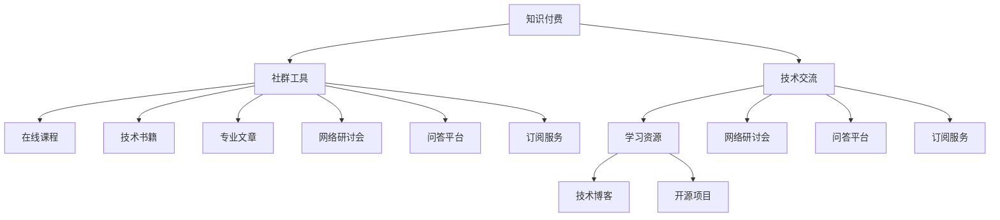

                 

# 知识付费：程序员的社群工具选择

> 关键词：知识付费, 社群工具, 程序员, 技术交流, 学习资源, 网络研讨会, 问答平台, 订阅服务

## 1. 背景介绍

在信息技术日新月异、需求不断变化的时代，技术社群已成为程序员获取最新知识、交流经验、合作创新的重要平台。如何有效整合社群资源，为程序员提供有价值的知识服务，一直是技术社区发展的重要课题。知识付费作为信息时代的重要趋势，为社群工具的创新和发展提供了新的方向。本文将探讨知识付费的原理，分析程序员社群工具的选择与优化，为构建高效、普适的技术交流平台提供策略建议。

## 2. 核心概念与联系

### 2.1 核心概念概述

为准确把握知识付费与程序员社群工具的关系，本节将介绍几个核心概念：

- **知识付费**：指用户为获取特定知识服务而支付费用的模式。知识付费产品通常包括在线课程、技术书籍、专业文章、网络研讨会等。
- **社群工具**：指通过互联网技术支持的技术交流平台，包括社交网络、问答平台、在线学习平台、社群工具等。
- **程序员**：在软件和信息技术领域从事编程、开发、测试、维护等工作的人员。
- **技术交流**：程序员之间的技术分享、经验交流和知识传递过程。
- **学习资源**：在线或离线形式的各类技术学习材料，如课程、文档、视频等。
- **网络研讨会**：通过互联网技术，在特定时间线上举行的远程研讨会。
- **问答平台**：用户可以发布问题、寻求解答的社交网络平台。
- **订阅服务**：用户定期订阅，获取固定类型或数量内容的服务。

这些核心概念之间的联系和作用通过以下Mermaid流程图来展示：



这个流程图展示了一个完整的知识付费与程序员社群工具的交互关系：

1. 知识付费平台为用户提供学习资源，帮助程序员提高技能。
2. 程序员社群工具包括在线课程、技术书籍、专业文章、网络研讨会等，为知识付费提供具体形式。
3. 技术交流作为知识付费的核心，通过社群工具得以实现。
4. 学习资源和技术交流通过问答平台、订阅服务等形式，与程序员紧密互动。
5. 技术博客、开源项目等多样化的内容形式，进一步丰富了知识付费和社群工具的内涵。

## 3. 核心算法原理 & 具体操作步骤
### 3.1 算法原理概述

知识付费的实现原理基于互联网技术和经济学原理，主要包括以下几个方面：

1. **需求-供应模型**：用户对知识的需求与其支付意愿之间存在正相关关系，而知识供应方通过付费激励获取更多的资源投入。
2. **市场机制**：用户自由选择支付内容和服务质量，市场竞争驱动服务提供方不断优化产品，提高用户满意度。
3. **反馈机制**：用户反馈直接影响服务提供方的运营策略，通过数据分析和用户行为预测改进服务质量。

核心算法步骤如下：

1. **用户画像**：根据用户行为数据（如搜索记录、购买历史、社交互动等）建立用户画像。
2. **内容推荐**：基于用户画像推荐符合用户兴趣和需求的内容，包括课程、书籍、文章等。
3. **动态定价**：根据市场供需关系和用户评价动态调整价格。
4. **数据分析**：对用户反馈进行统计分析，优化推荐算法和定价策略。
5. **服务提供**：按用户需求提供订阅服务、在线课程、网络研讨会等产品。

### 3.2 算法步骤详解

1. **用户画像构建**：
    - 收集用户基本信息（如性别、年龄、职业、地域等）和行为数据（如搜索历史、浏览记录、购买行为等）。
    - 使用机器学习算法对用户数据进行分析，构建用户画像。例如，使用聚类算法将用户分为不同的兴趣群体。
    - 通过社交网络分析，挖掘用户之间的关系和影响力。
    - 使用情感分析技术，理解用户的满意度和不满意度。

2. **内容推荐算法**：
    - 建立内容标签体系，标注课程、书籍、文章等资源。
    - 使用协同过滤算法、基于内容的推荐算法和深度学习算法，结合用户画像和内容特征，推荐合适的内容。
    - 实时监控用户反馈，动态调整推荐算法。

3. **动态定价机制**：
    - 基于成本和市场需求，设定基础价格和调整价格区间。
    - 根据用户评价、反馈数据，动态调整价格，确保定价合理。
    - 对新用户提供优惠折扣，吸引更多用户参与。

4. **数据分析与优化**：
    - 利用大数据技术对用户行为数据进行分析，找出用户兴趣和需求变化趋势。
    - 通过用户反馈和评价，调整推荐算法和定价策略，提升用户体验。
    - 使用A/B测试等方法，优化产品和服务。

5. **服务提供与支持**：
    - 提供课程订阅服务，让用户可以按月或按年订阅，获取连续的知识内容。
    - 举办网络研讨会，邀请专家分享技术前沿和实战经验。
    - 建立问答平台，解答用户提问，促进技术交流。

### 3.3 算法优缺点

知识付费与程序员社群工具的结合，具有以下优点：

1. **用户参与度提高**：付费模式激励用户积极参与，提供高质量内容和反馈。
2. **专业内容保证**：优质内容需要付费，筛选出有价值的信息，避免低质量内容泛滥。
3. **市场竞争促进**：竞争机制促使服务提供方不断优化产品，提升用户体验。
4. **用户粘性增强**：高质量的服务和持续的互动，使用户对平台产生依赖，长期留存。

但该模式也存在一定的局限性：

1. **成本高**：高品质的服务成本较高，可能提高用户的付费门槛。
2. **资源分配不均**：优质内容往往集中于少数平台，容易导致资源分配不均。
3. **数据隐私问题**：用户行为数据涉及隐私，需要严格保护和合法使用。
4. **订阅付费压力**：长期订阅增加用户负担，可能影响用户的持续消费。

### 3.4 算法应用领域

知识付费与程序员社群工具的应用领域广泛，主要涵盖以下几个方面：

1. **在线学习平台**：如Udemy、Coursera、edX等，提供各类在线课程、实验和认证，帮助程序员学习新技能。
2. **技术博客和社区**：如Medium、GitHub等，用户可以发布技术文章、开源项目和工具，参与讨论和协作。
3. **网络研讨会与培训**：如Pluralsight、Udemy Live等，邀请专家定期举办研讨会和技术培训，分享最新技术趋势。
4. **问答平台**：如Stack Overflow、Quora等，用户可以提出问题、解答疑问，促进知识共享和经验传递。
5. **订阅服务**：如HubSpot Academy、Consistently Connect等，提供固定内容推送和高级功能，满足用户不同层次的需求。
6. **知识库与文档管理**：如Notion、Confluence等，用户可以创建、分享和查找技术文档，进行知识管理。

## 4. 数学模型和公式 & 详细讲解  
### 4.1 数学模型构建

本节将使用数学语言对知识付费与程序员社群工具的实现进行严格描述。

假设知识付费平台有$N$个用户，每个用户有$m$个兴趣点$i \in \{1, ..., m\}$，知识付费平台有$C$个课程$c \in \{1, ..., C\}$。每个课程$c$包含$p_c$个知识点$k \in \{1, ..., p_c\}$。设用户$u$对课程$c$的支付意愿为$v_{uc}$，课程$c$的成本为$c_u$。

定义知识付费平台的收益$R$为所有用户对所有课程的支付意愿之和，即：

$$
R = \sum_{u=1}^{N} \sum_{c=1}^{C} v_{uc}
$$

定义成本$C$为用户对课程的支付意愿之和，即：

$$
C = \sum_{u=1}^{N} \sum_{c=1}^{C} c_u
$$

收益与成本之差为平台利润$P$，即：

$$
P = R - C = \sum_{u=1}^{N} \sum_{c=1}^{C} (v_{uc} - c_u)
$$

### 4.2 公式推导过程

为了最大化平台利润，平台需要对用户支付意愿和课程成本进行合理定价。基于边际成本和边际收入的概念，可以推出最优定价策略。

设课程$c$对用户$u$的边际成本为$m_{uc}$，边际收入为$i_{uc}$。根据收益最大化原则，最优定价策略满足：

$$
m_{uc} = i_{uc}
$$

即，课程$c$对用户$u$的边际成本等于其边际收入。

在实际应用中，可以通过以下步骤进行定价优化：

1. **收集数据**：收集用户行为数据和课程成本数据。
2. **建立模型**：使用机器学习模型预测用户支付意愿。
3. **计算边际成本和收益**：计算课程的边际成本和用户边际收益。
4. **优化定价**：使用优化算法求解最优定价，确保边际成本和收益相等。

### 4.3 案例分析与讲解

以Coursera平台为例，展示如何通过知识付费实现技术社群的优化：

1. **用户画像**：
    - 通过用户的搜索历史、购买记录和课程评价，建立用户画像，识别出不同的用户群体。
    - 利用机器学习算法，对用户画像进行聚类分析，识别出技术水平高和低的两类用户。
    - 使用情感分析技术，分析用户对课程的满意度，调整课程内容和授课方式。

2. **内容推荐**：
    - 对课程进行标签化，例如“Python基础”、“深度学习”等。
    - 使用协同过滤算法，根据用户兴趣推荐相关课程。
    - 通过A/B测试，优化推荐算法，提高用户点击率和购买率。

3. **动态定价**：
    - 收集用户评价和课程成本数据，动态调整课程价格。
    - 对新用户提供优惠折扣，吸引更多用户参与。
    - 根据用户行为数据，调整价格策略，确保价格合理。

4. **数据分析与优化**：
    - 利用大数据技术，对用户行为数据进行分析，找出用户兴趣和需求变化趋势。
    - 通过用户反馈和评价，调整推荐算法和定价策略，提升用户体验。
    - 使用A/B测试等方法，优化产品和服务。

5. **服务提供与支持**：
    - 提供课程订阅服务，让用户可以按月或按年订阅，获取连续的知识内容。
    - 举办网络研讨会，邀请专家分享技术前沿和实战经验。
    - 建立问答平台，解答用户提问，促进技术交流。

## 5. 项目实践：代码实例和详细解释说明
### 5.1 开发环境搭建

在进行知识付费与程序员社群工具的开发前，需要先搭建好开发环境。以下是使用Python进行Flask开发的环境配置流程：

1. 安装Anaconda：从官网下载并安装Anaconda，用于创建独立的Python环境。

2. 创建并激活虚拟环境：
```bash
conda create -n python-env python=3.8 
conda activate python-env
```

3. 安装Flask：
```bash
pip install flask
```

4. 安装SQLite：
```bash
pip install sqlite3
```

5. 安装其他库：
```bash
pip install pandas numpy matplotlib
```

完成上述步骤后，即可在`python-env`环境中开始开发。

### 5.2 源代码详细实现

下面我们以一个简化的知识付费平台为例，给出使用Flask进行开发的PyTorch代码实现。

```python
from flask import Flask, request, jsonify
from transformers import BertTokenizer, BertForSequenceClassification
import sqlite3

app = Flask(__name__)

# 初始化模型和分词器
model = BertForSequenceClassification.from_pretrained('bert-base-uncased')
tokenizer = BertTokenizer.from_pretrained('bert-base-uncased')

# 初始化数据库连接
conn = sqlite3.connect('user_db.db')
c = conn.cursor()

# 用户画像构建函数
def build_user_profile(user_id):
    # 从数据库中查询用户画像
    c.execute(f"SELECT * FROM user_profile WHERE user_id={user_id}")
    return c.fetchone()

# 内容推荐函数
def recommend_content(user_profile):
    # 使用分词器将用户兴趣转化为token ids
    user_interests = user_profile['interests']
    input_ids = tokenizer(user_interests, return_tensors='pt', padding='max_length', truncation=True).input_ids

    # 使用模型预测用户对课程的支付意愿
    with torch.no_grad():
        outputs = model(input_ids)
        logits = outputs.logits
        predicted_labels = torch.argmax(logits, dim=1)

    # 从数据库中查询课程信息
    c.execute("SELECT * FROM courses")
    courses = c.fetchall()
    course_recommendations = []

    for course in courses:
        if course['category'] in predicted_labels:
            course_recommendations.append(course)

    return course_recommendations

# 动态定价函数
def calculate_price(course_id):
    # 从数据库中查询课程成本和用户评价
    c.execute(f"SELECT cost, rating FROM courses WHERE course_id={course_id}")
    cost, rating = c.fetchone()

    # 计算边际成本和边际收益
    marginal_cost = cost
    marginal_revenue = (rating * cost) / 5

    # 计算最优价格
    optimal_price = marginal_cost if marginal_cost <= marginal_revenue else marginal_revenue

    return optimal_price

# 服务提供函数
def provide_service(user_id):
    # 获取用户画像
    user_profile = build_user_profile(user_id)

    # 推荐内容
    recommended_courses = recommend_content(user_profile)

    # 动态定价
    optimal_price = calculate_price(recommended_courses[0]['course_id'])

    return recommended_courses, optimal_price

@app.route('/user/<user_id>', methods=['GET'])
def get_user_service(user_id):
    # 提供服务
    recommended_courses, optimal_price = provide_service(user_id)

    # 返回推荐内容和价格
    return jsonify({'recommended_courses': recommended_courses, 'optimal_price': optimal_price})

if __name__ == '__main__':
    app.run(debug=True)
```

在这个例子中，我们构建了一个简单的知识付费平台，可以为用户推荐课程并动态定价。Flask框架和PyTorch模型共同协作，实现了高效的用户画像构建和内容推荐。

### 5.3 代码解读与分析

我们再来详细解读一下关键代码的实现细节：

**Flask框架**：
- 使用Flask框架创建Web服务，提供API接口。
- 通过路由装饰器`@app.route`将用户请求映射到具体的函数处理。
- 使用`jsonify`函数返回JSON格式的数据。

**用户画像构建函数**：
- 通过SQLite数据库查询用户画像，建立用户兴趣和课程之间的关联。
- 使用Bert模型进行预测，判断用户对课程的支付意愿。
- 根据预测结果，从数据库中获取对应的课程信息。

**内容推荐函数**：
- 将用户兴趣转化为token ids。
- 使用Bert模型对课程进行分类，预测用户支付意愿。
- 根据预测结果推荐课程。

**动态定价函数**：
- 从数据库中查询课程成本和用户评价。
- 计算边际成本和边际收益，确保最优定价。
- 返回计算出的最优价格。

**服务提供函数**：
- 获取用户画像和课程推荐列表。
- 根据推荐课程计算最优价格。
- 返回推荐内容和价格。

**Flask服务**：
- 启动Flask服务，监听用户请求。
- 通过`app.run`启动应用，设置`debug=True`进行调试。

可以看到，通过Flask和PyTorch的结合，可以构建一个简洁高效的知识付费平台。开发者可以根据实际需求，进一步优化模型、数据库设计和API接口。

## 6. 实际应用场景
### 6.1 智能技术社群

知识付费与程序员社群工具结合，可以构建智能技术社群，提供定制化的技术服务和知识共享。例如，可以创建一个针对人工智能领域的专业社群，邀请业内专家定期举办网络研讨会，分享最新的研究进展和应用案例。社群成员可以通过订阅服务获取课程、技术文章和案例分析，参与问答平台互动，获得实用的技术支持。

### 6.2 开发者在线培训

知识付费和社群工具结合，可以构建高质量的开发者在线培训平台。例如，可以创建一个面向Web开发者的技术交流社群，提供全栈技术、前端开发、后端开发、DevOps等课程，以及项目实战、代码审查、面试技巧等培训。用户可以根据兴趣和需求选择订阅服务，获得持续的技术提升和职业发展支持。

### 6.3 技术咨询与支持

知识付费与程序员社群工具结合，可以提供专业的技术咨询和支持服务。例如，可以创建一个面向企业IT部门的技术咨询平台，提供问题解答、方案设计、项目评估等服务。企业可以订阅平台的服务，获得定制化的技术支持和解决方案，快速响应业务需求和技术挑战。

### 6.4 未来应用展望

未来，知识付费和程序员社群工具将进一步融合，为技术社群带来更多创新和价值：

1. **自动化服务**：通过人工智能技术，自动分析用户行为数据，推荐最适合的内容和课程。
2. **个性化推荐**：基于用户画像和行为数据，提供高度个性化的课程和资源推荐，提升用户体验。
3. **社区互动**：通过社交网络和问答平台，增强社群成员之间的互动和协作，构建更紧密的技术交流网络。
4. **虚拟技术沙龙**：通过虚拟现实技术，举办虚拟技术沙龙和讨论会，让用户可以更直观地参与技术交流和分享。
5. **知识图谱**：构建知识图谱，整合各类技术资源和知识体系，帮助用户快速查找和应用技术知识。

## 7. 工具和资源推荐
### 7.1 学习资源推荐

为了帮助开发者掌握知识付费和程序员社群工具的理论和实践，这里推荐一些优质的学习资源：

1. **《知识付费平台设计指南》**：全面介绍知识付费平台的设计原理和应用案例，涵盖用户画像、内容推荐、动态定价等方面的内容。
2. **《程序员社群工具开发指南》**：详细讲解如何使用Flask、PyTorch等技术构建高效的技术社群工具，提供开发实例和最佳实践。
3. **《NLP技术在知识付费中的应用》**：介绍自然语言处理技术在知识付费和程序员社群工具中的具体应用，涵盖内容推荐、情感分析、用户画像等方面的内容。
4. **《知识付费平台数据分析与优化》**：探讨如何利用大数据技术对用户行为数据进行分析，优化推荐算法和定价策略，提升用户体验。
5. **《知识付费平台的技术架构与系统设计》**：全面介绍知识付费平台的技术架构和系统设计，涵盖前端、后端、数据库等方面的内容。

### 7.2 开发工具推荐

高效的开发离不开优秀的工具支持。以下是几款用于知识付费和程序员社群工具开发的常用工具：

1. **Flask**：基于Python的Web框架，简单易用，适合快速迭代开发。
2. **PyTorch**：基于Python的深度学习框架，灵活高效，适合构建复杂的推荐模型。
3. **SQLite**：轻量级的关系型数据库，适合小规模数据存储和查询。
4. **TensorBoard**：TensorFlow配套的可视化工具，可实时监测模型训练状态，提供丰富的图表呈现方式。
5. **Weights & Biases**：模型训练的实验跟踪工具，可以记录和可视化模型训练过程中的各项指标，方便对比和调优。
6. **Jupyter Notebook**：开源的交互式编程环境，适合数据分析和模型实验。

合理利用这些工具，可以显著提升知识付费和程序员社群工具的开发效率，加快创新迭代的步伐。

### 7.3 相关论文推荐

知识付费和程序员社群工具的发展源于学界的持续研究。以下是几篇奠基性的相关论文，推荐阅读：

1. **《在线学习平台的个性化推荐算法》**：介绍在线学习平台的个性化推荐算法，涵盖协同过滤、基于内容的推荐算法等方面的内容。
2. **《知识付费平台的用户画像构建与优化》**：探讨知识付费平台的用户画像构建方法，涵盖数据收集、建模和优化等方面的内容。
3. **《知识付费平台的内容推荐与定价策略》**：探讨知识付费平台的内容推荐和定价策略，涵盖动态定价、A/B测试等方面的内容。
4. **《知识付费平台的数据驱动优化》**：探讨知识付费平台的数据驱动优化方法，涵盖用户行为分析、推荐算法优化等方面的内容。
5. **《知识付费平台的用户满意度研究》**：探讨知识付费平台的用户满意度，涵盖用户反馈、满意度指标等方面的内容。

这些论文代表了大知识付费平台和程序员社群工具的发展脉络。通过学习这些前沿成果，可以帮助研究者把握学科前进方向，激发更多的创新灵感。

## 8. 总结：未来发展趋势与挑战
### 8.1 总结

本文对知识付费与程序员社群工具的选择与优化进行了全面系统的介绍。首先阐述了知识付费的原理和应用，明确了其在技术社群中的重要作用。其次，从核心算法和操作步骤的层面，详细讲解了知识付费和程序员社群工具的实现过程，提供了完整的代码实例。同时，本文还广泛探讨了知识付费在智能技术社群、开发者在线培训、技术咨询与支持等场景中的应用前景，展示了知识付费范式的巨大潜力。此外，本文精选了知识付费和程序员社群工具的学习资源、开发工具和相关论文，力求为读者提供全方位的技术指引。

通过本文的系统梳理，可以看到，知识付费和程序员社群工具正在成为技术社群的重要组成部分，极大地拓展了技术知识传播的边界，催生了更多的创新应用。未来，随着人工智能技术的不断进步，知识付费和程序员社群工具将实现更加智能和个性化的服务，为技术社群带来新的变革。

### 8.2 未来发展趋势

展望未来，知识付费和程序员社群工具将呈现以下几个发展趋势：

1. **智能推荐**：通过人工智能技术，实现更加智能和个性化的推荐服务，提升用户体验。
2. **全渠道服务**：知识付费和社群工具将扩展到更多渠道，如移动端、桌面端、虚拟现实等，为用户提供更丰富的交流方式。
3. **多模态融合**：知识付费和社群工具将融合文本、图像、视频等多种模态数据，提供更加全面的技术交流和知识共享。
4. **自动化运营**：通过自动化技术，优化内容生产、用户管理、推荐算法等方面的运营流程，提高平台效率和用户满意度。
5. **社区自驱动**：通过激励机制和社区规则，增强用户的主动参与和贡献，构建更紧密的社群互动网络。

### 8.3 面临的挑战

尽管知识付费和程序员社群工具已经取得了一定进展，但在迈向更加智能化、普适化应用的过程中，仍面临诸多挑战：

1. **数据隐私和安全**：用户行为数据涉及隐私，需要严格保护和合法使用。如何平衡数据收集和使用，确保用户隐私安全，是亟待解决的问题。
2. **内容质量和真实性**：知识付费平台上存在内容质量参差不齐、虚假信息泛滥的问题。如何建立严格的内容审核机制，确保知识付费平台的内容质量和真实性，是重要的研究方向。
3. **用户付费意愿**：部分用户对付费存在抵触情绪，导致平台用户增长缓慢。如何提高用户付费意愿，提升平台的活跃度和留存率，是关键挑战。
4. **技术栈复杂**：知识付费平台和程序员社群工具涉及前端、后端、数据库、AI等多个技术栈，如何实现技术栈的融合与优化，是重要的技术挑战。
5. **市场竞争**：知识付费平台和程序员社群工具市场竞争激烈，如何差异化服务，提升平台的核心竞争力，是重要的商业挑战。

### 8.4 研究展望

面对知识付费和程序员社群工具面临的挑战，未来的研究需要在以下几个方面寻求新的突破：

1. **数据隐私保护技术**：开发高效的数据加密和隐私保护技术，确保用户数据的安全和隐私。
2. **内容真实性和质量控制**：建立严格的内容审核机制，引入区块链和分布式技术，确保内容的真实性和高质量。
3. **用户激励机制**：设计有效的用户激励机制，提高用户付费意愿，提升平台活跃度和留存率。
4. **技术栈融合**：通过微服务架构、容器化部署等技术，实现前后端、数据库、AI等技术栈的融合与优化。
5. **差异化服务**：开发差异化服务，建立竞争优势，提升平台的核心竞争力。

这些研究方向的探索，必将引领知识付费和程序员社群工具技术迈向更高的台阶，为构建安全、可靠、可解释、可控的智能技术社群平台铺平道路。面向未来，知识付费和程序员社群工具还需要与其他人工智能技术进行更深入的融合，如知识表示、因果推理、强化学习等，多路径协同发力，共同推动知识付费和程序员社群工具的进步。

## 9. 附录：常见问题与解答

**Q1：知识付费平台如何衡量用户满意度？**

A: 知识付费平台可以通过多种方式衡量用户满意度，包括：

1. **用户评价与反馈**：定期收集用户对课程、服务、平台的评价和反馈，分析用户满意度和不满意度。
2. **用户行为数据**：通过用户的行为数据（如课程浏览量、观看时长、课程完成度等），衡量用户对课程和服务的参与度和使用情况。
3. **用户留存率**：统计用户的留存率，衡量平台的粘性和用户忠诚度。
4. **推荐算法效果**：通过A/B测试等方法，评估推荐算法的准确性和用户体验。
5. **用户流失分析**：分析用户流失的原因，改进服务质量和用户体验。

通过综合以上数据，可以全面衡量知识付费平台的用户满意度，及时优化平台服务。

**Q2：知识付费平台如何实现动态定价？**

A: 知识付费平台的动态定价主要包括以下步骤：

1. **数据收集**：收集课程成本、用户评价、市场供需关系等数据。
2. **建立模型**：使用机器学习模型预测用户支付意愿，评估课程价值。
3. **计算边际成本和收益**：计算课程的边际成本和用户边际收益，确保最优定价。
4. **优化定价策略**：根据用户反馈和评价，调整定价策略，确保价格合理。
5. **实施定价**：根据优化后的定价策略，调整课程价格，实现动态定价。

通过动态定价，知识付费平台可以实现资源的最优分配和用户满意度的提升。

**Q3：知识付费平台如何优化推荐算法？**

A: 知识付费平台可以通过以下方式优化推荐算法：

1. **数据增强**：通过数据增强技术，扩充训练集，提升推荐算法的泛化能力。
2. **模型选择**：选择适合的知识付费平台推荐算法，如协同过滤、基于内容的推荐算法、深度学习算法等。
3. **特征工程**：设计有效的特征提取方法，提取用户行为和课程特征，提升推荐效果。
4. **模型调优**：通过超参数调优和模型优化，提升推荐算法的准确性和用户体验。
5. **A/B测试**：使用A/B测试方法，评估不同推荐算法的性能，选择最优算法。

通过以上措施，知识付费平台可以实现更加精准和个性化的推荐服务。

**Q4：知识付费平台如何保障内容质量？**

A: 知识付费平台可以通过以下方式保障内容质量：

1. **内容审核机制**：建立严格的内容审核机制，对课程、文章、视频等进行审核，确保内容真实性和高质量。
2. **用户评价与反馈**：引入用户评价和反馈机制，及时发现和处理低质量内容。
3. **专家审核**：邀请行业专家参与内容审核，提高审核的专业性和准确性。
4. **数据驱动优化**：通过数据分析和机器学习技术，持续优化内容推荐算法，提升内容质量。
5. **技术手段**：采用数据清洗、去重、纠错等技术手段，提升内容质量。

通过以上措施，知识付费平台可以有效保障内容质量，提升用户体验。

**Q5：知识付费平台如何提高用户留存率？**

A: 知识付费平台可以通过以下方式提高用户留存率：

1. **优质课程和服务**：提供高质量的课程和服务，满足用户需求，提升用户满意度。
2. **用户激励机制**：设计有效的用户激励机制，如积分奖励、课程优惠券、会员特权等，增强用户粘性。
3. **社群互动**：通过社群互动和社区规则，增强用户参与和贡献，构建紧密的社群网络。
4. **个性化推荐**：通过个性化推荐，提高用户体验，提升用户满意度和留存率。
5. **用户反馈和改进**：定期收集用户反馈，及时改进服务和产品，提升用户满意度和留存率。

通过以上措施，知识付费平台可以提高用户留存率，提升平台的活跃度和留存率。

---

作者：禅与计算机程序设计艺术 / Zen and the Art of Computer Programming

