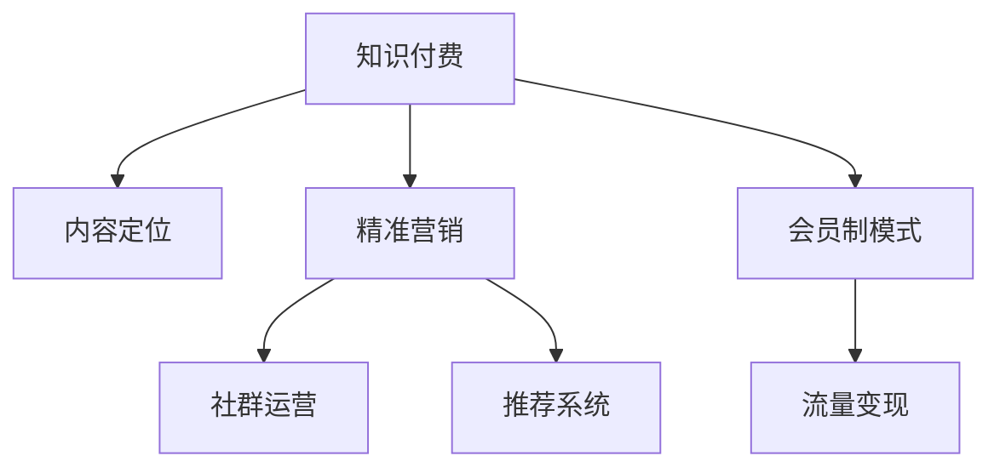

                 

# 知识付费：程序员的社群精准营销

> 关键词：知识付费,程序员,社群营销,精准营销,技术博客,博客运营,流量变现,用户增长,社交网络,内容分析,社交推荐,会员制模式,订阅经济

## 1. 背景介绍

### 1.1 问题由来
随着互联网技术的迅猛发展，内容生产和消费模式也在悄然发生改变。知识付费平台应运而生，通过提供优质内容，吸引广大用户订阅，进而实现商业变现。在互联网行业中，程序员作为高技术含量、高专业性的群体，一直是知识付费市场的重要目标用户。

然而，知识付费内容创作和精准营销面临着诸多挑战。首先，程序员通常缺乏内容创作的动机和资源，难以产出高质量、高频率的原创内容。其次，程序员群体分布广泛，地域分散，单一的内容发布渠道无法有效覆盖到全体用户。最后，程序员对于付费内容的价值预期不明确，存在较高的价格敏感性。

针对这些挑战，本文将深入探讨基于程序员社群的知识付费精准营销策略，帮助内容创作者优化内容策略，提高订阅率，实现流量变现。

### 1.2 问题核心关键点
基于程序员社群的知识付费精准营销的核心在于以下几个关键点：

- **内容定位精准**：定位程序员群体常见的技术难题、项目需求，提供实用性强的解决方案。
- **社群运营深度**：通过构建程序员社群，增强用户粘性，提高互动频率。
- **推荐系统精准**：利用推荐算法，将优质内容精准推荐给感兴趣的用户。
- **会员制模式成功**：采用订阅经济，实现稳定且高质量的内容产出，减少对单一广告收入的依赖。
- **流量变现高效**：通过多样化的流量变现方式，如广告、会员、课程等，提高平台收入。

这些核心关键点将共同构建起程序员社群精准营销的策略框架，为内容创作者和平台运营者提供系统的指导。

## 2. 核心概念与联系

### 2.1 核心概念概述

为更好地理解基于程序员社群的知识付费精准营销方法，本节将介绍几个密切相关的核心概念：

- **知识付费**：指用户为获取特定知识和信息，而支付费用的互联网服务模式。
- **程序员社群**：指围绕编程技术、项目开发等主题，通过社交网络、论坛、博客等平台形成的在线社区。
- **精准营销**：指通过数据分析、算法推荐等方式，精准定位用户需求，提升营销效果。
- **内容定位**：指根据目标用户的需求和兴趣，设计和发布有针对性的内容。
- **社群运营**：指通过激励机制、活动策划等手段，提升用户参与度和粘性。
- **推荐系统**：指通过用户行为分析，推荐最适合用户兴趣和需求的内容。
- **会员制模式**：指用户通过定期支付费用，获取优质内容、特权服务等内容服务模式。
- **流量变现**：指通过多样化的流量渠道，将用户流量转换为商业收益。

这些核心概念之间的逻辑关系可以通过以下Mermaid流程图来展示：



这个流程图展示了这个生态系统的核心组件及其之间的关系：

1. 知识付费是整个生态的起点，通过提供优质内容吸引用户订阅。
2. 内容定位是精准营销的基础，确保内容与目标用户需求匹配。
3. 精准营销通过算法推荐，提升内容曝光和用户转化率。
4. 社群运营增强用户粘性，促进内容互动和口碑传播。
5. 推荐系统进一步优化内容推荐，提升用户满意度。
6. 会员制模式通过收费机制，保障内容质量和产出稳定性。
7. 流量变现通过多种渠道实现商业化，增强平台盈利能力。

这些概念共同构成了程序员社群精准营销的策略框架，助力内容创作者和平台实现内容变现的商业闭环。

## 3. 核心算法原理 & 具体操作步骤
### 3.1 算法原理概述

基于程序员社群的知识付费精准营销，本质上是一个用户需求匹配和内容推荐的过程。其核心思想是：通过分析程序员社群的用户行为数据，识别出用户的兴趣点和需求，将最匹配的内容推荐给目标用户，从而实现高效的流量变现。

形式化地，假设程序员社群的每个用户 $u_i$ 都有其对应的兴趣点向量 $\mathbf{p}_i$，内容 $c_j$ 有其对应的特征向量 $\mathbf{q}_j$，则推荐系统的作用是最大化用户与内容的匹配度，即：

$$
\max_{\mathbf{p},\mathbf{q}} \mathbf{p}^T \mathbf{q}
$$

其中 $\mathbf{p}^T \mathbf{q}$ 表示兴趣点向量和特征向量的点积，表示用户与内容的匹配程度。

为了实现这一目标，推荐系统通常使用矩阵分解或协同过滤等技术，将用户和内容映射到低维空间，从而快速计算出用户与内容的匹配度。同时，为了提高推荐精度，推荐系统还结合了用户的评分数据、时间戳等信息，进行动态调整和优化。

### 3.2 算法步骤详解

基于程序员社群的知识付费精准营销一般包括以下几个关键步骤：

**Step 1: 数据收集与处理**
- 收集程序员社群的用户行为数据，包括阅读文章、评论互动、关注作者等行为。
- 收集程序员社群的内容数据，包括文章标题、摘要、标签等信息。
- 对数据进行清洗、归一化、特征提取等预处理，形成可分析的矩阵形式。

**Step 2: 模型训练与优化**
- 选择适合的推荐算法模型，如协同过滤、矩阵分解、深度学习等。
- 使用用户行为数据和内容特征数据进行模型训练，优化模型参数。
- 引入正则化、交叉验证等技术，防止模型过拟合。

**Step 3: 推荐算法应用**
- 实时获取用户的行为数据，并输入推荐系统。
- 使用训练好的模型计算用户与内容的匹配度。
- 根据匹配度排序，生成推荐内容列表，返回给用户。

**Step 4: 效果评估与反馈**
- 统计推荐系统的效果指标，如点击率、转化率等。
- 根据反馈数据调整推荐模型参数，不断优化推荐效果。
- 分析用户行为数据，识别用户偏好变化，及时更新推荐内容。

### 3.3 算法优缺点

基于程序员社群的知识付费精准营销方法具有以下优点：
1. 提升内容曝光率：通过算法推荐，将优质内容精准推送给目标用户，提高内容的点击率和阅读量。
2. 提高用户转化率：精准匹配用户需求，减少用户流失，提升订阅和购买率。
3. 减少内容制作成本：利用社群互动数据，指导内容创作方向，避免无效内容的产出。
4. 增强社群粘性：通过推荐系统，引导用户深入参与社群讨论，增强用户粘性和社区归属感。

同时，该方法也存在一些局限性：
1. 数据依赖性高：推荐效果依赖于社群用户行为数据的丰富性和准确性。
2. 冷启动问题：新用户没有足够行为数据，推荐系统难以快速提供准确推荐。
3. 用户隐私问题：用户的兴趣点数据可能涉及隐私，需要妥善处理和保护。
4. 模型复杂度高：复杂推荐算法可能导致较高的计算复杂度和存储需求。

尽管存在这些局限性，但就目前而言，基于程序员社群的知识付费精准营销方法仍然是大模型应用的重要范式。未来相关研究的重点在于如何进一步降低对标注数据的依赖，提高推荐系统的透明度和可解释性，同时兼顾用户隐私和模型复杂性。

### 3.4 算法应用领域

基于程序员社群的知识付费精准营销方法在程序员知识付费平台上已得到了广泛的应用，涵盖了如下领域：

- **技术博客运营**：通过推荐优质技术文章，提升博客访问量和订阅率。
- **博客会员制**：采用订阅模式，定期推送深度内容，提供专属权益。
- **技术交流社群**：构建技术交流平台，吸引技术爱好者参与讨论，增强用户粘性。
- **产品推广**：通过精准推荐，提升程序员对相关产品的认知和购买意愿。
- **技术培训**：利用推荐系统，将技术课程精准推送给有需求的用户。
- **职业发展**：推荐与用户职业发展相关的学习资料，提升用户竞争力。

除了上述这些经典应用外，知识付费精准营销技术还被创新性地应用于更多场景中，如项目协作、开源社区、创业指导等，为程序员的社区生态带来了更多的价值。

## 4. 数学模型和公式 & 详细讲解  
### 4.1 数学模型构建

本节将使用数学语言对基于程序员社群的知识付费精准营销方法进行更加严格的刻画。

假设程序员社群中每个用户 $u_i$ 有其对应的兴趣点向量 $\mathbf{p}_i$，内容 $c_j$ 有其对应的特征向量 $\mathbf{q}_j$。则推荐系统可以表示为一个矩阵 $\mathbf{P}$ 与矩阵 $\mathbf{Q}$ 的乘积，即：

$$
\mathbf{R} = \mathbf{P} \times \mathbf{Q}
$$

其中 $\mathbf{R}$ 表示用户与内容的匹配度矩阵， $\mathbf{P}$ 表示用户兴趣矩阵， $\mathbf{Q}$ 表示内容特征矩阵。

推荐系统的目标是最小化用户与内容匹配的误差，即：

$$
\min_{\mathbf{P},\mathbf{Q}} \| \mathbf{R} - \mathbf{R}_{\text{train}} \|^2
$$

其中 $\mathbf{R}_{\text{train}}$ 表示训练集上的匹配度矩阵。

为求解上述优化问题，通常使用矩阵分解或协同过滤等方法，将 $\mathbf{P}$ 和 $\mathbf{Q}$ 分解为较低的维度的用户兴趣矩阵和内容特征矩阵。例如，使用奇异值分解(SVD)进行分解：

$$
\mathbf{P} \approx \mathbf{U} \mathbf{\Sigma} \mathbf{V}^T, \quad \mathbf{Q} \approx \mathbf{U}^{\prime} \mathbf{\Sigma}^{\prime} \mathbf{V}^{\prime T}
$$

其中 $\mathbf{U}$ 和 $\mathbf{U}^{\prime}$ 为用户的低维特征矩阵， $\mathbf{V}$ 和 $\mathbf{V}^{\prime}$ 为内容的低维特征矩阵， $\mathbf{\Sigma}$ 和 $\mathbf{\Sigma}^{\prime}$ 为奇异值矩阵。

### 4.2 公式推导过程

以下我们以协同过滤推荐算法为例，推导推荐系统用户与内容匹配度的计算公式。

假设协同过滤算法使用的是基于用户的模型，则推荐系统计算用户 $u_i$ 对内容 $c_j$ 的匹配度为：

$$
r_{i,j} = \sum_k p_{i,k} q_{k,j}
$$

其中 $p_{i,k}$ 表示用户 $i$ 对用户 $k$ 的兴趣评分，$q_{k,j}$ 表示用户 $k$ 对内容 $j$ 的评分。则推荐系统的推荐列表可以表示为：

$$
\text{rank}_j = \sum_k r_{i,j} \cdot q_{k,j}
$$

即根据用户对内容的评分，计算内容对用户的匹配度，再根据匹配度排序，生成推荐列表。

### 4.3 案例分析与讲解

**案例一：技术博客运营**

某程序员社区的知识付费平台，通过收集程序员阅读文章的记录，利用协同过滤算法计算用户对每个文章的页面浏览时间、点赞数等行为特征，再结合文章标签、摘要等特征，为用户推荐最相关的文章。

具体来说，对于每个文章 $c_j$，先计算其与所有用户 $u_i$ 的匹配度：

$$
r_{i,j} = \sum_k p_{i,k} q_{k,j}
$$

其中 $p_{i,k}$ 为第 $i$ 个用户在阅读第 $k$ 篇文章时的评分（如浏览时间、点赞数等），$q_{k,j}$ 为第 $k$ 篇文章的标签、摘要等特征向量。

然后，根据匹配度排序，生成推荐列表：

$$
\text{rank}_j = \sum_k r_{i,j} \cdot q_{k,j}
$$

最后，将排名靠前的文章推荐给用户。

**案例二：博客会员制**

某程序员社区的知识付费平台，采用订阅模式，每月向会员推送深度技术文章和专属内容。推荐系统通过分析会员的阅读记录、评论互动、收藏文章等行为数据，为用户定制个性化的推荐内容。

具体来说，对于每个会员 $u_i$，先计算其对每个文章 $c_j$ 的匹配度：

$$
r_{i,j} = \sum_k p_{i,k} q_{k,j}
$$

其中 $p_{i,k}$ 为会员 $i$ 在阅读第 $k$ 篇文章时的评分（如阅读时长、点赞数、评论数等），$q_{k,j}$ 为文章 $k$ 的标签、摘要等特征向量。

然后，根据匹配度排序，生成推荐列表：

$$
\text{rank}_j = \sum_k r_{i,j} \cdot q_{k,j}
$$

最后，将排名靠前的文章推荐给会员，并提供订阅特权，如文章优先访问、专属社群等。

通过以上两个案例可以看出，基于程序员社群的知识付费精准营销方法可以广泛应用于技术博客运营和博客会员制等场景，通过算法推荐实现流量变现。

## 5. 项目实践：代码实例和详细解释说明
### 5.1 开发环境搭建

在进行知识付费精准营销实践前，我们需要准备好开发环境。以下是使用Python进行TensorFlow开发的环境配置流程：

1. 安装Anaconda：从官网下载并安装Anaconda，用于创建独立的Python环境。

2. 创建并激活虚拟环境：
```bash
conda create -n tf-env python=3.8 
conda activate tf-env
```

3. 安装TensorFlow：根据CUDA版本，从官网获取对应的安装命令。例如：
```bash
conda install tensorflow -c conda-forge -c pypi
```

4. 安装各类工具包：
```bash
pip install numpy pandas scikit-learn matplotlib tqdm jupyter notebook ipython
```

完成上述步骤后，即可在`tf-env`环境中开始精准营销实践。

### 5.2 源代码详细实现

下面我们以技术博客运营为例，给出使用TensorFlow进行协同过滤推荐算法的PyTorch代码实现。

首先，定义协同过滤算法的用户-物品评分矩阵：

```python
import tensorflow as tf
from tensorflow.keras.layers import Embedding, Dot, Dense, Input, Flatten

# 定义用户和物品的特征向量的维度和特征数
num_users = 1000
num_items = 1000
embedding_dim = 16

# 定义用户和物品的特征向量
user_embeddings = tf.keras.Sequential([
    Input(shape=(num_items,), dtype='int32', name='user_embeddings'),
    Embedding(num_users, embedding_dim, input_length=num_items, name='user_embeddings_embedding'),
    Flatten(name='user_embeddings_flatten')
])

item_embeddings = tf.keras.Sequential([
    Input(shape=(num_items,), dtype='int32', name='item_embeddings'),
    Embedding(num_items, embedding_dim, input_length=num_items, name='item_embeddings_embedding'),
    Flatten(name='item_embeddings_flatten')
])

dot = Dot(axes=-1, normalize=True, name='dot')([user_embeddings, item_embeddings])

# 定义评分矩阵
r_matrix = tf.keras.Sequential([
    Dot(axes=-1, normalize=True, name='r_matrix_dot'),
    Dense(1, activation='sigmoid', name='r_matrix_dense')
])
```

然后，定义推荐系统的前向传播函数：

```python
# 定义推荐系统的输入层和输出层
user_input = Input(shape=(num_items,), dtype='int32', name='user_input')
item_input = Input(shape=(num_items,), dtype='int32', name='item_input')

# 通过用户和物品的特征向量，计算匹配度矩阵
dot_product = Dot(axes=-1, normalize=True, name='dot_product')([user_embeddings(user_input), item_embeddings(item_input)])
rating = Dense(1, activation='sigmoid', name='rating')(dot_product)

# 获取推荐列表
predicted_ratings = rating
```

接着，定义推荐模型的损失函数和优化器：

```python
# 定义损失函数
loss = tf.keras.losses.BinaryCrossentropy()

# 定义优化器
optimizer = tf.keras.optimizers.Adam(lr=0.001)
```

最后，启动模型训练和推荐：

```python
# 训练模型
model.compile(optimizer=optimizer, loss=loss)
model.fit([user_input, item_input], user_input, epochs=10, batch_size=64)

# 获取推荐列表
predicted_ratings = model.predict([user_input, item_input])
```

以上就是使用TensorFlow进行协同过滤推荐算法的完整代码实现。可以看到，TensorFlow提供了强大的深度学习模型构建能力，可以方便地实现协同过滤推荐系统。

### 5.3 代码解读与分析

让我们再详细解读一下关键代码的实现细节：

**协同过滤算法**：
- `user_embeddings` 和 `item_embeddings`：定义用户和物品的特征向量，通过Embedding层将ID序列转化为低维向量表示。
- `dot`：计算用户和物品的匹配度，通过PointWise Dot Product进行矩阵乘法。
- `r_matrix`：通过全连接层计算评分矩阵，输出预测评分。

**推荐系统的前向传播**：
- `user_input` 和 `item_input`：定义用户和物品的输入，用于计算匹配度。
- `dot_product`：计算用户和物品的匹配度，通过Dot进行矩阵乘法。
- `rating`：通过全连接层计算评分，输出预测评分。

**损失函数和优化器**：
- `loss`：定义损失函数为二元交叉熵，用于衡量模型预测评分与真实评分之间的差异。
- `optimizer`：定义优化器为Adam，调整模型参数以最小化损失函数。

通过以上代码实现，可以构建起一个简单的协同过滤推荐系统，用于技术博客运营场景。开发者可以通过调整模型参数和训练数据，进一步优化推荐效果。

## 6. 实际应用场景
### 6.1 程序员社群精准营销

程序员社群的知识付费精准营销可以应用于以下场景：

- **技术博客运营**：通过推荐优质技术文章，提升博客访问量和订阅率。
- **博客会员制**：采用订阅模式，定期推送深度内容，提供专属权益。
- **技术交流社群**：构建技术交流平台，吸引技术爱好者参与讨论，增强用户粘性。
- **产品推广**：通过精准推荐，提升程序员对相关产品的认知和购买意愿。
- **技术培训**：利用推荐系统，将技术课程精准推送给有需求的用户。
- **职业发展**：推荐与用户职业发展相关的学习资料，提升用户竞争力。

### 6.2 未来应用展望

随着知识付费精准营销技术的不断演进，基于程序员社群的知识付费将呈现以下几个发展趋势：

1. **技术博客运营**：通过推荐系统，精准匹配程序员的技术需求，提升博客访问量和订阅率。
2. **博客会员制**：采用订阅模式，提供深度内容和服务，提升用户满意度和忠诚度。
3. **技术交流社群**：通过算法推荐，引导程序员深入参与社群讨论，增强社区粘性和互动性。
4. **产品推广**：通过推荐系统，精准推送相关产品信息，提升产品认知和销售转化率。
5. **技术培训**：利用推荐系统，将技术课程精准推送给有需求的用户，提升学习效果。
6. **职业发展**：推荐与用户职业发展相关的学习资料，提升用户竞争力，助力职业成长。

这些趋势凸显了知识付费精准营销技术的广阔前景。这些方向的探索发展，必将进一步提升程序员社群的知识付费服务质量，为程序员提供更加丰富、高效、个性化的学习和发展平台。

## 7. 工具和资源推荐
### 7.1 学习资源推荐

为了帮助开发者系统掌握知识付费精准营销的理论基础和实践技巧，这里推荐一些优质的学习资源：

1. **《推荐系统实践》书籍**：详细介绍推荐系统的原理、算法和应用，提供大量实例和代码实现。
2. **Kaggle竞赛**：参加Kaggle上的推荐系统竞赛，通过实战提升推荐系统设计和优化能力。
3. **Coursera《推荐系统》课程**：斯坦福大学的推荐系统课程，系统讲解推荐系统的理论基础和最新进展。
4. **Tutorial  Recommender Systems with Tensorflow**：TensorFlow官方推荐系统的教程，详细讲解推荐算法的实现和应用。
5. **Deep Learning for Recommender Systems**：深度学习在推荐系统中的应用，提供丰富的案例和实践代码。

通过对这些资源的学习实践，相信你一定能够快速掌握知识付费精准营销的精髓，并用于解决实际的NLP问题。
###  7.2 开发工具推荐

高效的开发离不开优秀的工具支持。以下是几款用于知识付费精准营销开发的常用工具：

1. **TensorFlow**：基于Python的深度学习框架，提供强大的模型构建和训练能力，适合推荐系统开发。
2. **PyTorch**：基于Python的深度学习框架，提供灵活的动态图和静态图功能，适合快速迭代研究。
3. **Spark**：大数据处理框架，支持大规模数据集的处理和分析，适合推荐系统的数据处理和分布式计算。
4. **AWS SageMaker**：亚马逊提供的云端机器学习平台，支持多种推荐系统算法和部署方式。
5. **Hadoop**：大数据处理框架，支持大规模数据的分布式存储和计算，适合推荐系统的数据处理和分布式训练。
6. **Flume**：数据收集工具，支持多源数据的收集和处理，适合推荐系统的数据采集。

合理利用这些工具，可以显著提升知识付费精准营销任务的开发效率，加快创新迭代的步伐。

### 7.3 相关论文推荐

知识付费精准营销技术的发展源于学界的持续研究。以下是几篇奠基性的相关论文，推荐阅读：

1. **《基于协同过滤的推荐系统》**：介绍协同过滤算法的原理和实现，经典推荐系统的算法之一。
2. **《深度学习在推荐系统中的应用》**：深入探讨深度学习在推荐系统中的各种应用，如神经协同过滤、矩阵分解等。
3. **《推荐系统的最新进展》**：综述推荐系统的最新研究进展，涵盖多方面推荐算法的理论和实践。
4. **《推荐系统的多目标优化》**：研究推荐系统中的多目标优化问题，提供多种推荐策略和算法。
5. **《推荐系统的用户行为分析》**：研究推荐系统中用户行为数据的建模和分析，优化推荐效果。

这些论文代表了大语言模型微调技术的发展脉络。通过学习这些前沿成果，可以帮助研究者把握学科前进方向，激发更多的创新灵感。

## 8. 总结：未来发展趋势与挑战
### 8.1 总结

本文对基于程序员社群的知识付费精准营销方法进行了全面系统的介绍。首先阐述了知识付费和精准营销的基本概念，明确了程序员社群精准营销的策略框架。其次，从原理到实践，详细讲解了协同过滤算法的数学原理和关键步骤，给出了推荐系统开发的完整代码实例。同时，本文还广泛探讨了精准营销在程序员社群中的应用场景，展示了其巨大的商业价值。

通过本文的系统梳理，可以看到，基于程序员社群的知识付费精准营销方法正在成为程序员社群运营的重要范式，极大地提升了内容创作和用户互动的效果。未来，随着知识付费精准营销技术的不断发展，程序员社群的知识付费服务将更加丰富、高效、个性化，为程序员的社区生态带来更多的价值。

### 8.2 未来发展趋势

展望未来，基于程序员社群的知识付费精准营销技术将呈现以下几个发展趋势：

1. **技术博客运营**：通过推荐系统，精准匹配程序员的技术需求，提升博客访问量和订阅率。
2. **博客会员制**：采用订阅模式，提供深度内容和服务，提升用户满意度和忠诚度。
3. **技术交流社群**：通过算法推荐，引导程序员深入参与社群讨论，增强社区粘性和互动性。
4. **产品推广**：通过推荐系统，精准推送相关产品信息，提升产品认知和销售转化率。
5. **技术培训**：利用推荐系统，将技术课程精准推送给有需求的用户，提升学习效果。
6. **职业发展**：推荐与用户职业发展相关的学习资料，提升用户竞争力，助力职业成长。

这些趋势凸显了知识付费精准营销技术的广阔前景。这些方向的探索发展，必将进一步提升程序员社群的知识付费服务质量，为程序员提供更加丰富、高效、个性化的学习和发展平台。

### 8.3 面临的挑战

尽管基于程序员社群的知识付费精准营销技术已经取得了瞩目成就，但在迈向更加智能化、普适化应用的过程中，它仍面临着诸多挑战：

1. **用户隐私问题**：用户的兴趣点数据可能涉及隐私，需要妥善处理和保护。
2. **数据稀疏性**：程序员社群的标注数据往往较少，难以构建高质量的推荐模型。
3. **推荐系统透明性**：推荐系统的决策过程通常缺乏可解释性，难以对其推理逻辑进行分析和调试。
4. **模型鲁棒性**：推荐模型面对域外数据时，泛化性能往往大打折扣。
5. **冷启动问题**：新用户没有足够行为数据，推荐系统难以快速提供准确推荐。

尽管存在这些挑战，但未来相关研究的重点在于如何进一步降低对标注数据的依赖，提高推荐系统的透明度和可解释性，同时兼顾用户隐私和模型复杂性。

### 8.4 研究展望

面向未来，基于程序员社群的知识付费精准营销技术需要在以下几个方面寻求新的突破：

1. **用户行为分析**：通过深度学习、自然语言处理等技术，更深入地分析程序员的行为数据，提取更丰富的用户特征。
2. **多模态推荐**：结合视觉、语音、文本等多种模态数据，提升推荐系统的覆盖范围和效果。
3. **跨平台协同**：在不同平台间实现数据和算法共享，提升推荐系统的全局优化能力。
4. **个性化推荐**：通过联合优化多目标函数，提升推荐系统的个性化推荐效果。
5. **冷启动策略**：引入用户画像、预训练模型等技术，解决新用户的推荐问题。
6. **安全与隐私保护**：在推荐系统中加入隐私保护和公平性机制，确保用户数据的安全和公平性。

这些研究方向的探索，必将引领知识付费精准营销技术迈向更高的台阶，为程序员社群的知识付费服务提供更强的技术保障。未来，知识付费精准营销技术将与AI技术进一步融合，为程序员社群带来更加丰富、高效、个性化的知识服务体验。

## 9. 附录：常见问题与解答

**Q1：如何提高知识付费平台的推荐系统效果？**

A: 提高知识付费平台的推荐系统效果可以从以下几个方面入手：
1. **数据收集与处理**：收集程序员社群的多种行为数据，如阅读文章、评论互动、收藏文章等，对数据进行清洗、归一化、特征提取等预处理。
2. **模型训练与优化**：选择合适的推荐算法模型，如协同过滤、矩阵分解、深度学习等，使用用户行为数据和内容特征数据进行模型训练，优化模型参数。引入正则化、交叉验证等技术，防止模型过拟合。
3. **推荐算法应用**：实时获取用户的行为数据，并输入推荐系统，使用训练好的模型计算用户与内容的匹配度。根据匹配度排序，生成推荐内容列表。
4. **效果评估与反馈**：统计推荐系统的效果指标，如点击率、转化率等，根据反馈数据调整推荐模型参数，不断优化推荐效果。

**Q2：推荐系统如何处理新用户推荐问题？**

A: 推荐系统处理新用户推荐问题通常有以下几种策略：
1. **内容推荐**：使用用户画像、预训练模型等技术，为新用户推荐与其兴趣相关的初步内容，逐步引导其产生行为数据。
2. **协同过滤**：使用基于用户的协同过滤算法，利用已有的用户行为数据和新用户行为特征，推荐与其兴趣相似的其他用户的内容。
3. **深度学习**：利用深度学习技术，对新用户行为数据进行建模，生成新的用户兴趣向量，再通过协同过滤推荐系统推荐内容。
4. **多模态推荐**：结合视觉、语音、文本等多种模态数据，提升推荐系统的覆盖范围和效果，为新用户提供更丰富的推荐内容。

**Q3：如何平衡推荐系统的效果和成本？**

A: 平衡推荐系统的效果和成本可以从以下几个方面入手：
1. **数据收集**：通过多渠道、多方法收集用户行为数据，丰富数据量。
2. **模型优化**：使用高效算法和硬件设备，优化推荐模型的计算复杂度和存储需求。
3. **资源调度**：根据系统负载动态调整资源配置，平衡系统效果和成本。
4. **效果评估**：通过A/B测试等手段，评估推荐系统的效果，优化推荐策略。
5. **用户反馈**：收集用户反馈，了解用户需求，不断优化推荐内容。

通过以上方法，可以在保证推荐系统效果的前提下，尽量降低开发和运营成本，提升平台的商业价值。

**Q4：推荐系统的可解释性如何提升？**

A: 提升推荐系统的可解释性可以从以下几个方面入手：
1. **特征工程**：选择合适的特征，提取用户行为数据的显著特征，减少噪声干扰。
2. **模型透明性**：使用可解释的推荐算法，如协同过滤、矩阵分解等，避免使用复杂的深度学习模型。
3. **可视化工具**：使用可视化工具，如TensorBoard、Tableau等，展示推荐系统的内部工作机制和决策逻辑。
4. **用户反馈机制**：通过用户反馈，了解推荐系统的错误和缺陷，不断优化推荐策略。

通过以上方法，可以提高推荐系统的可解释性，增强用户对推荐系统的信任感和满意度。

**Q5：如何处理推荐系统的冷启动问题？**

A: 处理推荐系统的冷启动问题可以从以下几个方面入手：
1. **内容推荐**：使用用户画像、预训练模型等技术，为新用户推荐与其兴趣相关的初步内容，逐步引导其产生行为数据。
2. **协同过滤**：使用基于用户的协同过滤算法，利用已有的用户行为数据和新用户行为特征，推荐与其兴趣相似的其他用户的内容。
3. **深度学习**：利用深度学习技术，对新用户行为数据进行建模，生成新的用户兴趣向量，再通过协同过滤推荐系统推荐内容。
4. **多模态推荐**：结合视觉、语音、文本等多种模态数据，提升推荐系统的覆盖范围和效果，为新用户提供更丰富的推荐内容。

通过以上方法，可以解决新用户的推荐问题，提高推荐系统的覆盖面和效果。

---

作者：禅与计算机程序设计艺术 / Zen and the Art of Computer Programming

