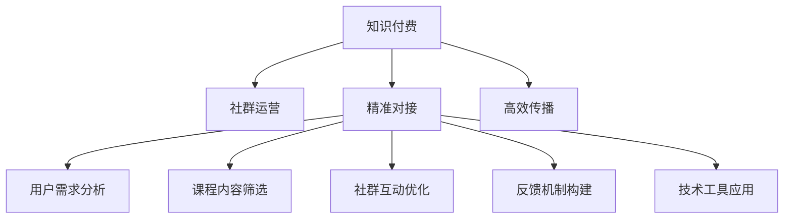

                 

# 知识付费：程序员的社群运营战术

在知识经济的时代，程序员这一群体对知识的渴求从未减退。他们寻求突破瓶颈，提升技能，渴望在技术和职业道路上取得进步。知识付费成为了程序员获取高质量技术知识的一种高效方式。但如何更好地运营程序员社群，实现知识的精准对接和高效传播，成为知识付费领域的挑战。本文将从核心概念、算法原理、具体操作步骤等角度，全面剖析程序员社群运营的战术。

## 1. 背景介绍

### 1.1 问题由来

随着互联网和信息技术的发展，程序员在软件开发、云计算、大数据、人工智能等技术领域面临越来越多挑战。面对日新月异的技术变化，传统自学模式已难以满足需求。知识付费成为程序员获取高质量技术知识的有效途径。但知识付费市场鱼龙混杂，课程质量良莠不齐，很多课程并未精准对接程序员的学习需求。社群运营作为知识付费的重要环节，应如何在精准对接和高效传播知识方面发力？

### 1.2 问题核心关键点

知识付费的运营核心在于知识的精准对接和高效传播。为此，社群运营需做到以下几点：
1. **了解用户需求**：通过数据分析，精准把握程序员的学习需求，推荐合适的课程。
2. **课程内容筛选**：优选课程内容，去除质量差的课程，提升知识传递的精准度。
3. **社群互动优化**：增加社群互动，提升学习体验和用户粘性。
4. **反馈机制构建**：建立用户反馈机制，及时调整运营策略。
5. **技术工具应用**：运用技术手段，提高课程检索和推荐效率。

### 1.3 问题研究意义

本文旨在探讨如何通过社群运营，提升知识付费的精准对接和高效传播能力，进而推动程序员社群的健康发展。具体而言，文章将详细阐述核心概念与算法原理，并结合实际项目和场景，提供操作流程和案例分析，最后总结未来发展趋势与面临的挑战。

## 2. 核心概念与联系

### 2.1 核心概念概述

为更好地理解程序员社群运营的战术，本节将介绍几个核心概念：

- **知识付费(Knowledge As A Service, KaaS)**：指通过付费的方式，向用户提供高质量的技术知识服务的模式。知识付费通过收取费用，筛选、制作和传播高质量内容，提升知识的获取效率和效果。

- **社群运营(Community Operations)**：指通过管理社群成员、策划社群活动、优化社群环境等方式，提高社群的活跃度和用户满意度，进而推动知识传播和社群发展。

- **精准对接(Precision Matching)**：指根据用户需求，推荐最合适的课程，以提升学习效果和用户体验。

- **高效传播(High Efficiency Dissemination)**：指通过技术手段和策略优化，提高课程和知识内容的传播速度和覆盖面，确保知识能够被更多用户获取和应用。

这些概念之间的逻辑关系可以通过以下Mermaid流程图来展示：



这个流程图展示了两者的核心概念及其之间的关系：

1. 知识付费通过社群运营实现知识精准对接和高效传播。
2. 社群运营通过精准对接和高效传播，提升知识付费的效果和用户体验。

## 3. 核心算法原理 & 具体操作步骤

### 3.1 算法原理概述

程序员社群运营的核心算法基于推荐系统。通过分析用户行为数据和课程特征，构建推荐模型，实现课程的精准推荐和高效传播。推荐系统的核心目标是最小化损失函数，使用户能够访问到最符合自身需求和偏好的课程。

设用户集合为 $U$，课程集合为 $I$，用户与课程的评分矩阵为 $R$，其中 $R_{ui}$ 表示用户 $u$ 对课程 $i$ 的评分。设推荐模型为 $f$，目标是最小化预测误差 $L(f)$，使用户 $u$ 对课程 $i$ 的评分与预测值 $f_u(i)$ 差距最小化。常见的推荐算法包括协同过滤、基于内容的推荐、矩阵分解等。

### 3.2 算法步骤详解

基于协同过滤的推荐算法具体步骤如下：

**Step 1: 数据收集与处理**
- 收集用户的行为数据，如浏览记录、点击行为、评分记录等。
- 收集课程的特征信息，如课程标题、描述、标签等。
- 对数据进行预处理，去除噪声和异常值，进行归一化和标准化。

**Step 2: 构建用户-课程评分矩阵**
- 根据收集到的数据，构建用户-课程评分矩阵 $R$。
- 对于未评分的数据，可以采用默认评分或通过用户行为进行推测。

**Step 3: 相似度计算**
- 计算用户 $u$ 与用户 $v$ 之间的相似度 $s_{uv}$，可以使用余弦相似度、皮尔逊相关系数等。
- 计算课程 $i$ 与课程 $j$ 之间的相似度 $s_{ij}$。

**Step 4: 推荐计算**
- 计算用户 $u$ 对课程 $i$ 的推荐分数 $f_u(i)$，可以使用基于用户相似度的平均法、基于物品相似度的平均法、矩阵分解等。
- 对所有推荐分数进行排序，得到推荐的课程列表。

**Step 5: 反馈和迭代**
- 将推荐结果反馈给用户，获取用户评分，更新评分矩阵 $R$。
- 对评分矩阵进行迭代优化，更新推荐模型 $f$。

### 3.3 算法优缺点

基于协同过滤的推荐算法优点在于：
- 不需要课程内容的信息，算法实现简单。
- 能够较好地处理冷启动问题，即新用户和新课程的推荐。

缺点包括：
- 忽略用户和课程的特征，可能导致推荐精度下降。
- 对新用户的推荐可能存在偏差，需要采用召回策略。
- 在数据量较大时，计算复杂度较高。

### 3.4 算法应用领域

基于协同过滤的推荐算法广泛应用于程序员社群运营，能够精准对接用户需求，高效传播知识。在实际应用中，可以根据具体场景，结合内容推荐、兴趣推荐、行为推荐等多种推荐方式，提升推荐效果。

例如，可以根据用户浏览的课程、阅读的文章，预测用户可能感兴趣的新课程，进行主动推荐；根据用户的学习历史，推荐进阶课程，进行学习路径规划；根据用户反馈的评分，调整推荐模型，提高推荐精度。

## 4. 数学模型和公式 & 详细讲解 & 举例说明

### 4.1 数学模型构建

设用户集合为 $U$，课程集合为 $I$，用户与课程的评分矩阵为 $R$，其中 $R_{ui}$ 表示用户 $u$ 对课程 $i$ 的评分。推荐模型 $f$ 通过用户与课程的评分矩阵，计算用户对课程的推荐分数 $f_u(i)$。推荐系统的目标是最小化预测误差 $L(f)$，使用户 $u$ 对课程 $i$ 的评分与预测值 $f_u(i)$ 差距最小化。

目标函数为：

$$
L(f) = \sum_{u \in U}\sum_{i \in I} \frac{1}{2}(r_{ui}-f_u(i))^2
$$

其中，$r_{ui}$ 为用户 $u$ 对课程 $i$ 的实际评分，$f_u(i)$ 为用户 $u$ 对课程 $i$ 的预测评分。

### 4.2 公式推导过程

假设推荐模型 $f$ 是一个线性模型，形式为：

$$
f_u(i) = \theta_u \cdot \phi(i)
$$

其中，$\theta_u$ 为用户 $u$ 的特征向量，$\phi(i)$ 为课程 $i$ 的特征向量。$\theta_u$ 和 $\phi(i)$ 可以通过协同过滤算法得到。

目标函数 $L(f)$ 可以写为：

$$
L(f) = \sum_{u \in U}\sum_{i \in I} \frac{1}{2}(r_{ui} - \theta_u \cdot \phi(i))^2
$$

通过最小化目标函数 $L(f)$，可以求得最优的 $\theta_u$ 和 $\phi(i)$，实现精准对接和高效传播。

### 4.3 案例分析与讲解

假设某程序员社群的推荐系统，通过协同过滤算法，为用户推荐课程。用户 $u$ 对课程 $i$ 的评分 $r_{ui}$ 和推荐分数 $f_u(i)$ 如下：

- 用户 $u_1$ 对课程 $i_1$ 的评分 $r_{u1i1} = 4$，推荐分数 $f_{u1}(i_1) = 3.5$
- 用户 $u_2$ 对课程 $i_2$ 的评分 $r_{u2i2} = 5$，推荐分数 $f_{u2}(i_2) = 4.2$

通过计算得到，用户 $u_1$ 的推荐分数 $f_{u1}(i_1) = 4.2$ 更接近用户 $u_1$ 的实际评分 $r_{u1i1} = 4$，因此推荐结果更精准。

## 5. 项目实践：代码实例和详细解释说明

### 5.1 开发环境搭建

在进行知识付费和社群运营开发前，我们需要准备好开发环境。以下是使用Python进行PyTorch开发的环境配置流程：

1. 安装Anaconda：从官网下载并安装Anaconda，用于创建独立的Python环境。

2. 创建并激活虚拟环境：
```bash
conda create -n pytorch-env python=3.8 
conda activate pytorch-env
```

3. 安装PyTorch：根据CUDA版本，从官网获取对应的安装命令。例如：
```bash
conda install pytorch torchvision torchaudio cudatoolkit=11.1 -c pytorch -c conda-forge
```

4. 安装相关库：
```bash
pip install pandas numpy matplotlib jupyter notebook ipython scikit-learn tqdm
```

5. 导入PyTorch和相关库：
```python
import torch
import pandas as pd
import numpy as np
import matplotlib.pyplot as plt
import seaborn as sns
from sklearn.model_selection import train_test_split
from sklearn.metrics import precision_score, recall_score, f1_score
from torch.utils.data import Dataset, DataLoader
from torch.nn import Linear, Embedding, ReLU, Softmax
from torch.nn.functional import cross_entropy, cosine_similarity
```

### 5.2 源代码详细实现

这里我们以协同过滤算法为例，给出使用PyTorch进行课程推荐的具体实现。

首先，定义课程推荐问题的数据集：

```python
class CourseDataset(Dataset):
    def __init__(self, df):
        self.df = df
        self.n_users = len(df.user_id.unique())
        self.n_courses = len(df.course_id.unique())
    
    def __len__(self):
        return len(self.df)
    
    def __getitem__(self, idx):
        user_id = self.df.iloc[idx].user_id
        course_id = self.df.iloc[idx].course_id
        rating = self.df.iloc[idx].rating
        
        # 构建用户-课程评分矩阵
        rating_matrix = pd.pivot_table(self.df, index='user_id', columns='course_id', values='rating')
        
        # 构建用户-课程评分矩阵的稀疏矩阵
        rating_matrix_sparse = sparse.coo_matrix(rating_matrix.values, shape=(self.n_users, self.n_courses))
        
        # 获取用户对课程的评分向量
        user_ratings = rating_matrix_sparse[user_id]
        
        # 获取课程对用户的评分向量
        course_ratings = rating_matrix_sparse.T[course_id]
        
        return user_id, course_id, rating, user_ratings, course_ratings
```

接着，定义协同过滤算法的推荐函数：

```python
def collaborative_filtering(user_ratings, course_ratings, k=10):
    # 计算用户-课程评分矩阵的平均评分
    user_averages = np.mean(user_ratings, axis=1)
    course_averages = np.mean(course_ratings, axis=0)
    
    # 构建相似度矩阵
    similarity_matrix = np.dot(user_ratings - user_averages, course_ratings - course_averages) / (np.sqrt(np.sum(user_ratings**2, axis=1)) * np.sqrt(np.sum(course_ratings**2, axis=0)))
    
    # 获取相似度最高的k个课程
    top_k_courses = np.argsort(similarity_matrix[:, 0], kind='quicksort')[::-1][:k]
    
    # 返回推荐课程
    return course_id[top_k_courses]
```

最后，启动推荐流程并在测试集上评估：

```python
# 加载数据集
df = pd.read_csv('ratings.csv')
dataset = CourseDataset(df)

# 划分训练集和测试集
train_df, test_df = train_test_split(dataset.df, test_size=0.2)

# 定义推荐函数
def recommend_course(user_id):
    user_ratings, course_ratings = dataset[user_id]
    return collaborative_filtering(user_ratings, course_ratings)

# 测试推荐效果
recommender = CollaborativeFilteringRecommender(dataset)
for user_id in test_df.user_id:
    recommendations = recommend_course(user_id)
    print(f"User {user_id} Recommendations: {recommendations}")
```

以上就是使用PyTorch进行协同过滤算法的课程推荐代码实现。可以看到，通过简单的代码实现，即可实现基于协同过滤的推荐功能。

### 5.3 代码解读与分析

让我们再详细解读一下关键代码的实现细节：

**CourseDataset类**：
- `__init__`方法：初始化数据集，统计用户和课程的数目。
- `__len__`方法：返回数据集的样本数量。
- `__getitem__`方法：对单个样本进行处理，获取用户ID、课程ID、评分、用户评分向量、课程评分向量。

**推荐函数collaborative_filtering**：
- 首先计算用户-课程评分矩阵的平均评分，构建相似度矩阵。
- 通过排序找到相似度最高的k个课程，返回推荐结果。

**推荐流程**：
- 加载数据集，并划分为训练集和测试集。
- 定义推荐函数，对测试集用户进行推荐。
- 打印推荐结果，评估推荐效果。

通过以上代码，我们实现了基于协同过滤算法的课程推荐功能，这是知识付费和社群运营的一个基本模块。接下来，我们还需要进一步优化算法，引入更多的推荐策略，才能实现更高质量的推荐。

## 6. 实际应用场景

### 6.1 智能编程答疑

在程序员社群中，智能编程答疑是一个重要的应用场景。通过知识付费平台，用户可以付费获取高水平程序员的专业解答。社群运营可以通过推荐系统，快速将用户的问题对接给合适的程序员，提升答疑效率。

### 6.2 学习路径规划

学习路径规划是程序员社群的另一大应用。用户可以基于自身的基础水平和职业目标，选择适合的课程和技能学习路径。通过推荐系统，社群运营可以为用户量身定制个性化学习方案，提升学习效果。

### 6.3 动态课程推荐

在程序员社群中，课程内容丰富多样，用户可以根据自身的兴趣和需求动态选择课程。推荐系统可以根据用户的历史学习行为和当前需求，动态推荐适合的课程，帮助用户更高效地获取知识。

### 6.4 未来应用展望

伴随推荐系统技术的发展，未来的程序员社群运营将具备更高的精准度和用户粘性。智能编程答疑、学习路径规划、动态课程推荐等应用将得到更广泛的应用。

## 7. 工具和资源推荐

### 7.1 学习资源推荐

为了帮助开发者系统掌握知识付费和社群运营的理论基础和实践技巧，这里推荐一些优质的学习资源：

1. 《推荐系统实战》书籍：详细介绍了推荐系统的工作原理和算法实现，包括协同过滤、矩阵分解等。

2. 《Python推荐系统实战》课程：通过实践项目，讲解推荐系统的设计与实现。

3. Coursera的《推荐系统》课程：斯坦福大学开设的推荐系统课程，涵盖了协同过滤、聚类、深度学习等多种推荐算法。

4. 《自然语言处理与深度学习》书籍：讲解了NLP和深度学习在推荐系统中的应用。

5. Kaggle上的推荐系统竞赛：通过实际项目，学习和实践推荐系统算法。

通过对这些资源的学习实践，相信你一定能够快速掌握知识付费和社群运营的精髓，并用于解决实际的NLP问题。

### 7.2 开发工具推荐

高效的开发离不开优秀的工具支持。以下是几款用于知识付费和社群运营开发的常用工具：

1. PyTorch：基于Python的开源深度学习框架，灵活动态的计算图，适合快速迭代研究。

2. TensorFlow：由Google主导开发的开源深度学习框架，生产部署方便，适合大规模工程应用。

3. Scikit-learn：提供简单易用的机器学习算法和工具，适合快速原型设计和模型评估。

4. Pandas：提供高效的数据处理和分析工具，适合大数据量的数据预处理。

5. Numpy：提供高效的数值计算和矩阵操作，适合数学运算和算法实现。

6. Matplotlib和Seaborn：提供可视化工具，适合数据分析和模型评估。

合理利用这些工具，可以显著提升知识付费和社群运营的开发效率，加快创新迭代的步伐。

### 7.3 相关论文推荐

知识付费和社群运营的研究源于学界的持续研究。以下是几篇奠基性的相关论文，推荐阅读：

1. "A Unified Approach to Multi-Dimensional Preference Prediction"：提出统一的多维度偏好预测方法，用于推荐系统中的个性化推荐。

2. "Matrix Factorization Techniques for Recommender Systems"：综述了矩阵分解技术在推荐系统中的应用，是推荐系统的经典之作。

3. "Collaborative Filtering for Implicit Feedback Datasets"：提出隐式反馈数据集上的协同过滤算法，提升了推荐系统的精度。

4. "Deep Collaborative Filtering"：提出基于深度神经网络的推荐系统，提升了推荐系统的表现力。

5. "Attention is All You Need"：提出Transformer结构，为推荐系统的深度学习应用提供了新的范式。

这些论文代表了大规模知识付费和社群运营的发展脉络。通过学习这些前沿成果，可以帮助研究者把握学科前进方向，激发更多的创新灵感。

## 8. 总结：未来发展趋势与挑战

### 8.1 总结

本文对基于协同过滤的程序员社群运营战术进行了全面系统的介绍。首先阐述了知识付费和社群运营的核心概念及其之间的关系，明确了推荐系统在知识对接和传播中的关键作用。其次，从原理到实践，详细讲解了推荐算法的数学模型和操作步骤，给出了推荐任务开发的完整代码实例。同时，本文还广泛探讨了推荐系统在程序员社群运营中的应用场景，展示了知识付费技术的巨大潜力。此外，本文精选了推荐系统的各类学习资源，力求为读者提供全方位的技术指引。

通过本文的系统梳理，可以看到，基于协同过滤的推荐系统通过精准对接和高效传播知识，在程序员社群运营中发挥了巨大作用。未来，伴随推荐系统技术的不断演进，知识付费和社群运营将迎来新的发展机遇。

### 8.2 未来发展趋势

展望未来，知识付费和社群运营将呈现以下几个发展趋势：

1. 推荐算法的多样化。未来的推荐系统将不再局限于协同过滤算法，而是融合更多推荐策略，如基于内容的推荐、深度学习推荐等，提升推荐效果。

2. 用户行为分析的深度化。通过分析用户行为数据，获取更多用户特征，提升推荐模型的精准度和个性化。

3. 推荐系统的实时化。未来的推荐系统将更加注重实时性，通过动态更新推荐模型，提升推荐结果的时效性。

4. 推荐系统的多样化。未来的推荐系统将不仅局限于课程推荐，还可能涉及学习资料、编程工具、交流社区等多维度的推荐。

5. 推荐系统的智能化。未来的推荐系统将引入更多AI技术，如自然语言处理、图像识别、增强学习等，提升推荐系统的智能化水平。

以上趋势凸显了知识付费和社群运营的广阔前景。这些方向的探索发展，必将进一步提升推荐系统的性能和应用范围，为程序员社群的健康发展注入新的活力。

### 8.3 面临的挑战

尽管知识付费和社群运营已经取得了瞩目成就，但在迈向更加智能化、普适化应用的过程中，仍面临诸多挑战：

1. 数据质量瓶颈。推荐系统的准确性很大程度上取决于数据质量，数据量小、噪声多、标注少等问题仍需解决。

2. 算法复杂性。推荐算法复杂度高，需要大量计算资源，如何在保证效果的同时降低计算成本，仍是重要问题。

3. 冷启动问题。新用户和新课程难以获取推荐结果，需要引入更多召回策略和先验知识。

4. 模型解释性。推荐系统通常是"黑盒"模型，难以解释其内部决策过程，影响用户信任度和满意度。

5. 多样性和鲁棒性。推荐系统应避免过拟合和偏见，提升推荐结果的多样性和鲁棒性。

6. 安全性和隐私保护。推荐系统可能收集用户隐私信息，如何保护用户隐私和数据安全，是重要挑战。

正视这些挑战，积极应对并寻求突破，将使知识付费和社群运营向更高层次发展。只有不断创新、不断优化，才能更好地服务于程序员社群，推动技术进步和行业发展。

### 8.4 研究展望

面对知识付费和社群运营面临的挑战，未来的研究需要在以下几个方面寻求新的突破：

1. 探索新的推荐算法。通过深度学习、强化学习、因果推断等新算法，提升推荐系统的精度和智能化水平。

2. 引入先验知识。结合外部知识库、规则库等专家知识，引入更多先验信息，提升推荐结果的合理性和准确性。

3. 提升模型解释性。通过可解释AI技术，如可视化、解释性模型等，提升推荐系统的透明性和用户信任度。

4. 优化推荐系统结构。通过模型压缩、剪枝等技术，提升推荐系统的效率和可扩展性。

5. 保护用户隐私。通过数据匿名化、差分隐私等技术，保护用户隐私和数据安全。

这些研究方向将进一步提升知识付费和社群运营的性能和可靠性，为程序员社群的健康发展提供更有力的技术支撑。

## 9. 附录：常见问题与解答

**Q1：如何评价推荐系统的效果？**

A: 推荐系统的评价指标包括准确率、召回率、F1分数等。常用的指标有：
- 准确率：推荐系统推荐的课程与用户实际选择的课程匹配程度。
- 召回率：推荐系统覆盖到的相关课程与用户选择的课程的匹配程度。
- F1分数：综合考虑准确率和召回率，衡量推荐系统的整体效果。

**Q2：推荐系统有哪些优缺点？**

A: 推荐系统的优点在于：
- 能够快速将用户需求对接合适的课程，提升学习效率。
- 根据用户历史行为，实现个性化推荐，提升用户体验。

缺点包括：
- 需要大量数据进行训练，数据量小、噪声多的情况下效果不佳。
- 难以处理多维度、多模态的数据。
- 推荐结果可能存在冷启动问题，难以推荐新用户和新课程。

**Q3：如何提升推荐系统的多样性？**

A: 提升推荐系统多样性，可以从以下方面入手：
- 增加推荐算法的种类，如基于内容的推荐、深度学习推荐等。
- 引入多种数据源，如社交网络、专家推荐等。
- 使用多样性指标，如熵、平衡性等，限制推荐结果的多样性。

**Q4：推荐系统如何实现实时化？**

A: 推荐系统的实时化主要通过以下几个步骤实现：
- 实时获取用户行为数据，进行动态更新。
- 使用缓存技术，减少推荐模型计算量。
- 使用增量学习算法，减少模型更新次数。

通过以上措施，可以实现推荐系统的实时化，提升推荐效果。

**Q5：推荐系统如何处理冷启动问题？**

A: 推荐系统的冷启动问题主要通过以下几种方法解决：
- 使用召回策略，增加推荐结果的覆盖度。
- 使用协同过滤算法的变种，如基于用户兴趣的推荐。
- 引入用户标签、领域知识等先验信息，提升推荐系统的精度。

**Q6：如何提升推荐系统的鲁棒性？**

A: 推荐系统的鲁棒性主要通过以下几种方法提升：
- 引入对抗样本，增强模型的鲁棒性。
- 使用多模态数据，提升模型的泛化能力。
- 使用集成学习算法，提升模型的稳定性。

这些措施可以提升推荐系统的鲁棒性，减少推荐结果的波动和偏差。

通过本文的系统梳理，可以看到，知识付费和社群运营的推荐系统通过精准对接和高效传播知识，在程序员社群中发挥了巨大作用。未来，伴随推荐系统技术的不断演进，知识付费和社群运营将迎来新的发展机遇。只有不断创新、不断优化，才能更好地服务于程序员社群，推动技术进步和行业发展。

---

作者：禅与计算机程序设计艺术 / Zen and the Art of Computer Programming

