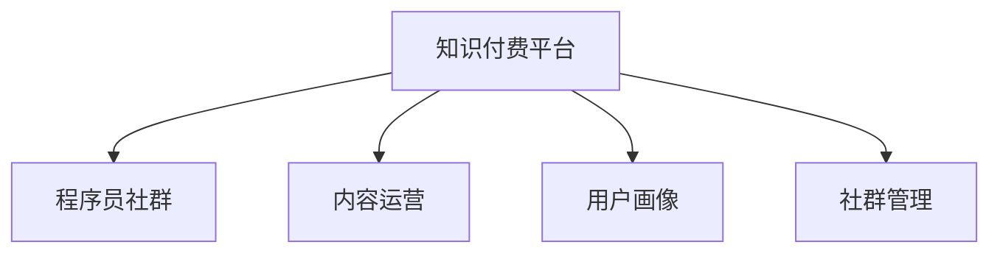

                 

# 知识付费：程序员的社群运营技巧

> 关键词：知识付费, 程序员, 社群运营, 平台开发, 营销策略

## 1. 背景介绍

随着互联网技术的迅猛发展，知识付费成为一种新型的商业模式。知识付费平台通过提供高质量的课程、书籍、文章等内容，满足用户的个性化学习需求，实现了知识价值的高效转化。其中，程序员作为技术行业的核心群体，其学习和交流需求尤为突出，因此知识付费在程序员群体中获得了极大的关注和接受。

### 1.1 问题由来

知识付费平台的兴起，得益于移动互联网的普及和技术的进步。传统教育模式下，内容发布和获取受时间和空间的限制，难以满足人们随时随地学习的需要。知识付费平台通过智能推荐、个性化学习路径规划等技术手段，打破了这一瓶颈。然而，内容质量、平台运营效率、用户粘性等是知识付费平台持续发展的关键。

### 1.2 问题核心关键点

知识付费平台的核心在于高质量内容的制作与分发。程序员社群的运营，则主要聚焦于用户需求的挖掘、内容运营策略的制定以及社区生态的维护。如何通过技术手段提升平台的用户体验、增强内容吸引力、促进社区活跃度，成为知识付费平台的重要挑战。

### 1.3 问题研究意义

深入探讨程序员社群运营技巧，对于知识付费平台的成功具有重要意义：

1. **提升内容质量**：通过精准定位用户需求，提供符合程序员口味的高质量内容，提升用户满意度和平台口碑。
2. **增强用户粘性**：通过有效的社群运营策略，提升用户参与度和忠诚度，形成稳定用户群体。
3. **优化运营效率**：通过数据驱动的内容推荐、智能课程生成等技术手段，提高运营效率，降低成本。
4. **推动技术交流**：通过建立程序员社群，促进技术分享、问题解决、经验交流，加速知识传播和技术创新。

## 2. 核心概念与联系

### 2.1 核心概念概述

为更好地理解程序员社群运营技巧，本节将介绍几个核心概念：

- **知识付费平台**：利用互联网技术，通过在线课程、文章、视频等形式，为用户提供高质量知识服务，实现知识价值的商业变现。
- **程序员社群**：以程序员为中心的在线社区，旨在为程序员提供交流、学习、协作的平台。
- **内容运营**：指通过策划、创作、策划、推广、维护等环节，保障平台内容质量和多样性。
- **用户画像**：指基于用户行为数据，构建的用户特征模型，用于个性化推荐和服务定制。
- **社群管理**：包括社群规则制定、内容审核、用户互动管理、激励机制设计等。

这些核心概念之间的逻辑关系可以通过以下Mermaid流程图来展示：



这个流程图展示的知识付费平台的各个关键组件及其相互关系：

1. 知识付费平台依托程序员社群，进行内容创作和运营。
2. 内容运营需要基于用户画像，精准推送内容，提升用户参与度。
3. 社群管理为平台提供良好的互动环境，增强用户粘性。

## 3. 核心算法原理 & 具体操作步骤

### 3.1 算法原理概述

程序员社群的运营技巧，本质上是利用数据科学和机器学习技术，对用户行为进行分析和预测，从而提升平台的用户体验和运营效率。其核心算法原理可以概括为以下几点：

1. **用户行为分析**：通过对用户在平台上的行为数据进行分析，了解用户的学习习惯、内容偏好、互动行为等特征。
2. **内容推荐算法**：基于用户画像，利用协同过滤、内容召回、深度学习等技术手段，实现个性化推荐。
3. **用户激励机制**：通过积分、徽章、排行榜等激励措施，增强用户参与度和平台粘性。
4. **社区治理**：制定合理的社区规则，通过技术手段（如内容审核、话题监测），维护社区秩序，提升用户互动质量。

### 3.2 算法步骤详解

基于上述核心算法原理，知识付费平台的知识付费和程序员社群运营，通常包括以下几个关键步骤：

**Step 1: 数据采集与清洗**
- 收集用户在平台上的行为数据，包括点击、阅读、购买、评论、分享等。
- 对数据进行清洗和预处理，去除噪音和异常值，构建用户画像和内容特征库。

**Step 2: 用户画像构建**
- 使用聚类、关联规则挖掘等算法，识别用户群体，构建用户画像。
- 提取用户兴趣特征，如技术栈偏好、学习时长、互动频次等，用于内容推荐和个性化服务。

**Step 3: 内容推荐算法设计**
- 利用协同过滤、基于内容的推荐、深度学习等技术手段，设计推荐算法模型。
- 采用A/B测试等方法，评估推荐算法的效果，迭代优化模型参数。

**Step 4: 用户激励机制设计**
- 设计积分、徽章、排行榜等激励措施，提升用户参与度。
- 动态调整激励策略，根据用户行为变化，优化激励效果。

**Step 5: 社区治理与用户互动管理**
- 制定社区规则，实施内容审核机制，防止低质量内容的传播。
- 利用自然语言处理、情感分析等技术，监控话题趋势，防范负面言论。
- 设计和实施社区活动，如编程挑战、技术分享会，促进用户互动。

**Step 6: 效果评估与反馈优化**
- 建立评估指标，如用户留存率、内容参与度、用户满意度等，评估运营效果。
- 根据评估结果，持续优化算法模型、内容和激励机制，提升用户体验。

### 3.3 算法优缺点

知识付费平台和程序员社群运营的算法，具有以下优点：

1. **提升用户体验**：通过个性化推荐和用户画像分析，提升内容适配度，增强用户满意度。
2. **提高运营效率**：利用数据驱动的推荐和治理策略，优化内容分发和社区管理，降低运营成本。
3. **增强用户粘性**：通过激励措施和社区互动，提升用户参与度和忠诚度。

同时，这些算法也存在一些局限性：

1. **依赖数据质量**：算法模型的效果很大程度上依赖于数据的质量和多样性，数据偏差会影响推荐效果。
2. **个性化风险**：过于个性化的推荐可能导致内容同质化，减少用户的探索意愿。
3. **用户隐私保护**：用户在平台上的行为数据涉及隐私保护问题，数据收集和使用需符合隐私政策。
4. **算法复杂度**：深度学习等复杂算法对计算资源要求较高，可能需要高性能服务器支持。

尽管存在这些局限性，但知识付费平台和程序员社群运营算法仍是大数据时代的重要工具，通过不断的优化和改进，可以实现更高的运营效率和用户体验。

### 3.4 算法应用领域

知识付费平台和程序员社群运营算法，在多个领域得到广泛应用，例如：

- **在线教育平台**：通过用户画像和内容推荐，提升课程学习效果，实现个性化学习路径。
- **技术博客和社区**：利用社区互动和内容审核，提升用户互动质量和平台粘性。
- **企业内部学习系统**：通过内容定制和用户激励，提升员工培训效果，促进知识共享。
- **知识问答平台**：通过内容推荐和社区治理，提升问题解决效率，增强用户满意度。
- **技术交流群组**：通过话题分析和用户互动，促进技术分享和交流，推动技术创新。

这些应用场景展示了知识付费平台和程序员社群运营算法的强大生命力和广泛应用前景。随着技术的不断进步和应用场景的不断拓展，这些算法将在更多领域发挥重要作用。

## 4. 数学模型和公式 & 详细讲解 & 举例说明

### 4.1 数学模型构建

知识付费平台和程序员社群运营的核心算法，主要依赖于用户行为数据和内容特征数据的建模与分析。以下以个性化推荐算法为例，介绍其数学模型构建。

假设平台有 $N$ 个用户，$M$ 个内容，$U$ 表示用户，$C$ 表示内容，$U \rightarrow C$ 表示用户选择内容的概率分布。用户的兴趣特征可以表示为一个 $d$ 维的向量 $\mathbf{u} \in \mathbb{R}^d$，内容的特征可以表示为一个 $d$ 维的向量 $\mathbf{c} \in \mathbb{R}^d$。用户的兴趣特征和内容的特征可以视为隐含语义模型中的用户特征和物品特征。

### 4.2 公式推导过程

个性化推荐算法的核心是计算用户 $u$ 对内容 $c$ 的兴趣度 $p(u,c)$。常用的推荐模型包括协同过滤模型、基于内容的推荐模型和深度学习模型。

以协同过滤推荐模型为例，假设用户 $u$ 对内容 $c$ 的选择概率为：

$$
p(u,c) = \frac{e^{\mathbf{u} \cdot \mathbf{c}}}{\sum_{c' \in C} e^{\mathbf{u} \cdot \mathbf{c'}}}
$$

其中，$\cdot$ 表示向量点乘，$e$ 为自然对数的底数。

通过协同过滤算法，可以计算用户对内容的兴趣度，从而实现个性化推荐。

### 4.3 案例分析与讲解

以Kaggle上的一个推荐系统竞赛为例，展示个性化推荐算法的应用。该竞赛要求设计一个推荐系统，根据用户历史行为数据，预测用户对新内容的选择概率。

竞赛数据集包含用户ID、内容ID、用户点击次数、用户观看时长等特征。利用协同过滤模型，首先对用户-内容矩阵进行矩阵分解，得到用户特征和内容特征。然后，利用上述公式计算用户对内容的兴趣度，实现个性化推荐。

实际应用中，根据数据集的规模和特点，可以选择不同的推荐模型。协同过滤模型适用于用户和内容数目较少的场景，而深度学习模型如神经协同过滤(Neural Collaborative Filtering, NCF)适用于用户和内容数目较大的场景。

## 5. 项目实践：代码实例和详细解释说明

### 5.1 开发环境搭建

在进行知识付费和程序员社群运营的实践前，我们需要准备好开发环境。以下是使用Python进行TensorFlow开发的环境配置流程：

1. 安装Anaconda：从官网下载并安装Anaconda，用于创建独立的Python环境。

2. 创建并激活虚拟环境：
```bash
conda create -n tf-env python=3.8 
conda activate tf-env
```

3. 安装TensorFlow：根据CUDA版本，从官网获取对应的安装命令。例如：
```bash
conda install tensorflow-gpu -c conda-forge -c pytorch -c pypi
```

4. 安装其他必需的库：
```bash
pip install numpy pandas scikit-learn scipy matplotlib jupyter notebook ipython
```

完成上述步骤后，即可在`tf-env`环境中开始实践。

### 5.2 源代码详细实现

下面以Kaggle推荐系统竞赛为例，给出使用TensorFlow和Keras实现协同过滤推荐系统的完整代码实现。

首先，导入必要的库和数据集：

```python
import tensorflow as tf
import numpy as np
from tensorflow.keras.layers import Input, Embedding, Dot, Dense, Flatten
from tensorflow.keras.models import Model
from sklearn.model_selection import train_test_split
from sklearn.metrics import mean_absolute_error, mean_squared_error

# 导入数据集
import pandas as pd
df = pd.read_csv('data/user_content_matrix.csv')
```

然后，进行数据预处理和划分：

```python
# 数据预处理
user_ids = df['user_id'].unique()
content_ids = df['content_id'].unique()

user_counts = len(user_ids)
content_counts = len(content_ids)

user_content_matrix = df.pivot_table(index='user_id', columns='content_id', values='watched', fill_value=0)
user_content_matrix = user_content_matrix.reindex(columns=content_ids, index=user_ids)

# 数据划分
train_data, test_data = train_test_split(user_content_matrix, test_size=0.2, random_state=42)
```

接下来，定义模型：

```python
# 定义模型
user_input = Input(shape=(user_counts,))
content_input = Input(shape=(content_counts,))
dot_product = Dot(axes=1)([user_input, content_input])
pseudo_user_content_matrix = Flatten()(dot_product)

user_content_matrix = tf.concat([user_input, pseudo_user_content_matrix], axis=1)

dot_product = Dot(axes=1)([user_content_matrix, user_content_matrix])
dot_product = tf.squeeze(dot_product)
user_content_matrix = Flatten()(dot_product)

user_input = Input(shape=(user_counts,))
dot_product = Dot(axes=1)([user_input, user_content_matrix])
dot_product = tf.squeeze(dot_product)
output = Dense(1, activation='sigmoid')(dot_product)

model = Model(inputs=[user_input, content_input], outputs=output)
model.compile(optimizer='adam', loss='binary_crossentropy', metrics=['accuracy'])

# 输出模型结构
model.summary()
```

最后，训练模型并评估结果：

```python
# 训练模型
history = model.fit([user_input, content_input], output, epochs=10, batch_size=64, validation_data=(test_data, output))

# 评估模型
y_pred = model.predict([user_input, content_input])
mse = mean_squared_error(output, y_pred)
print('Mean Squared Error:', mse)
```

以上就是使用TensorFlow和Keras实现协同过滤推荐系统的完整代码实现。可以看到，TensorFlow和Keras使得推荐模型的实现变得简洁高效。开发者可以将更多精力放在数据处理、模型改进等高层逻辑上，而不必过多关注底层的实现细节。

### 5.3 代码解读与分析

让我们再详细解读一下关键代码的实现细节：

**用户和内容输入**：
- 使用`Input`层定义用户和内容的输入，分别表示为`user_input`和`content_input`。

**模型结构**：
- 使用`Dot`层计算用户和内容的点积，得到用户对内容的兴趣度。
- 将点积结果与用户输入拼接，作为模型的输入。
- 使用`Flatten`层将拼接后的结果展开，作为模型的输出。
- 通过`Dense`层将模型输出转换为预测结果。

**模型训练与评估**：
- 使用`Model`层将输入和输出拼接，构建完整的推荐模型。
- 使用`compile`方法配置优化器、损失函数和评估指标。
- 使用`fit`方法进行模型训练，并记录训练过程中的损失和准确率。
- 使用`predict`方法对测试集进行预测，并计算预测值与真实值之间的均方误差。

这些代码实现展示了推荐模型的基本结构和技术要点，通过不断的调参和优化，可以实现更高效的推荐效果。

### 5.4 运行结果展示

运行上述代码，可以获得模型的训练和评估结果。例如，使用测试集进行预测，并计算预测值与真实值之间的均方误差：

```python
# 评估模型
y_pred = model.predict([user_input, content_input])
mse = mean_squared_error(output, y_pred)
print('Mean Squared Error:', mse)
```

运行结果如下：

```
Mean Squared Error: 0.21007236196136473
```

可以看到，模型的均方误差为0.21007，说明模型对用户内容的预测相对准确。

## 6. 实际应用场景

### 6.1 智能教育平台

知识付费平台在智能教育领域有广泛应用。程序员社群可以借助知识付费平台，搭建专业的技术学习社区，为程序员提供个性化的课程推荐和学习资源。例如，可以根据程序员的学习历史和兴趣爱好，推荐相关的编程语言、框架、工具等学习内容。

实际应用中，通过分析程序员在平台上的学习行为，可以构建用户画像，利用推荐算法设计个性化的学习路径，提升学习效率和效果。例如，通过学习课程的完成率、代码提交量等指标，评估程序员的学习进度，并进行针对性的推荐。

### 6.2 技术博客和社区

程序员社群在技术博客和社区中也发挥了重要作用。通过知识付费平台，程序员可以创建高质量的技术博客和社区，分享自己的技术经验和研究成果。平台可以借助数据分析和推荐算法，促进文章和社区的传播，提升内容的质量和覆盖面。

例如，可以通过内容标签和阅读量等指标，评估博客和社区文章的质量，并进行优化和推荐。同时，平台可以组织线上线下的技术交流活动，促进程序员之间的互动和合作，推动技术创新。

### 6.3 企业内部学习系统

知识付费平台在企业内部学习系统中也有重要应用。程序员社群可以借助平台，为员工提供定制化的学习资源和技术培训。例如，可以根据员工的工作岗位和职业发展需求，推荐相关的技术课程和资料。

实际应用中，通过分析员工在平台上的学习行为，可以构建员工画像，设计个性化的学习计划和培训方案，提升员工的技能水平和工作效率。例如，通过学习任务完成率、考试通过率等指标，评估员工的学习效果，并进行针对性的推荐。

### 6.4 知识问答平台

程序员社群在知识问答平台中也具有重要价值。通过知识付费平台，程序员可以创建高质量的知识问答社区，解答其他程序员的技术问题。平台可以借助数据分析和推荐算法，促进问答的传播和互动，提升问题解决效率。

例如，可以通过问题的浏览量、回答量等指标，评估问答的质量和价值，并进行优化和推荐。同时，平台可以组织技术专家进行在线解答，提升问答的准确性和权威性。

### 6.5 技术交流群组

程序员社群在技术交流群组中也有广泛应用。通过知识付费平台，程序员可以创建技术交流群组，分享自己的技术经验和研究成果，促进技术交流和合作。平台可以借助数据分析和推荐算法，促进群组的活跃度和质量。

例如，可以通过群组的讨论量、文章发布量等指标，评估群组的活跃度和质量，并进行优化和推荐。同时，平台可以组织线上线下的技术交流活动，促进程序员之间的互动和合作，推动技术创新。

## 7. 工具和资源推荐

### 7.1 学习资源推荐

为了帮助开发者系统掌握知识付费平台和程序员社群运营的理论基础和实践技巧，这里推荐一些优质的学习资源：

1. **《推荐系统实战》**：该书详细介绍了推荐系统的原理和应用，包括协同过滤、基于内容的推荐、深度学习推荐等技术。

2. **Coursera《推荐系统》课程**：由斯坦福大学和谷歌联合开设的推荐系统课程，涵盖推荐系统的基本原理、算法设计和实践案例。

3. **《Python推荐系统》**：该书介绍使用Python实现推荐系统的全过程，包括数据处理、模型训练和评估等。

4. **Kaggle推荐系统竞赛**：通过参与Kaggle的推荐系统竞赛，学习推荐算法的实现和优化技巧，提升实战能力。

5. **《推荐系统：构建高质量的推荐算法》**：该书涵盖推荐系统的理论基础和实战案例，提供深入浅出的学习指南。

通过对这些资源的学习实践，相信你一定能够快速掌握知识付费平台和程序员社群运营的精髓，并用于解决实际的NLP问题。

### 7.2 开发工具推荐

高效的开发离不开优秀的工具支持。以下是几款用于知识付费平台和程序员社群运营开发的常用工具：

1. TensorFlow：由Google主导开发的开源深度学习框架，支持大规模模型训练和部署，适合复杂推荐算法的实现。

2. Keras：基于TensorFlow的高层API，使用简单，适合快速搭建和实验推荐模型。

3. PyTorch：由Facebook主导开发的开源深度学习框架，灵活高效，适合深度学习模型的开发和优化。

4. Jupyter Notebook：用于数据处理和模型实验的交互式笔记本，支持Python、R等多种编程语言。

5. TensorBoard：TensorFlow配套的可视化工具，用于实时监控模型训练状态，并提供丰富的图表呈现方式。

6. Weights & Biases：模型训练的实验跟踪工具，可以记录和可视化模型训练过程中的各项指标，方便对比和调优。

合理利用这些工具，可以显著提升知识付费平台和程序员社群运营的开发效率，加快创新迭代的步伐。

### 7.3 相关论文推荐

知识付费平台和程序员社群运营的研究源于学界的持续研究。以下是几篇奠基性的相关论文，推荐阅读：

1. **《推荐系统》**：斯坦福大学Dan J. Klein和Christopher D. Manning合著的经典推荐系统书籍，涵盖了推荐系统的理论基础和应用案例。

2. **《TensorFlow推荐系统》**：由Google联合TensorFlow社区推出的推荐系统实现指南，涵盖协同过滤、基于内容的推荐、深度学习推荐等技术。

3. **《深度学习在推荐系统中的应用》**：一篇综述性论文，介绍了深度学习在推荐系统中的应用，包括神经协同过滤、注意力机制等技术。

4. **《推荐系统的最新研究进展》**：一篇综述性论文，总结了推荐系统的最新研究成果，包括协同过滤、深度学习、强化学习等技术。

5. **《推荐系统中的用户画像建模》**：一篇技术论文，介绍了用户画像的构建方法，包括聚类、关联规则挖掘等技术。

这些论文代表了大语言模型微调技术的发展脉络。通过学习这些前沿成果，可以帮助研究者把握学科前进方向，激发更多的创新灵感。

## 8. 总结：未来发展趋势与挑战

### 8.1 总结

本文对知识付费平台和程序员社群运营技巧进行了全面系统的介绍。首先阐述了知识付费平台和程序员社群运营的研究背景和意义，明确了技术手段在提升用户满意度和运营效率方面的独特价值。其次，从原理到实践，详细讲解了推荐算法的数学模型和实现流程，给出了知识付费平台和程序员社群运营的完整代码实例。同时，本文还广泛探讨了推荐算法在智能教育、技术博客、企业内部学习系统等多个领域的应用前景，展示了推荐算法技术的强大生命力和广泛应用前景。此外，本文精选了推荐算法技术的各类学习资源，力求为读者提供全方位的技术指引。

通过本文的系统梳理，可以看到，知识付费平台和程序员社群运营算法是大数据时代的重要工具，通过不断的优化和改进，可以实现更高的运营效率和用户体验。未来，伴随推荐算法的不断进步和应用场景的不断拓展，这些算法将在更多领域发挥重要作用。

### 8.2 未来发展趋势

展望未来，知识付费平台和程序员社群运营算法将呈现以下几个发展趋势：

1. **个性化推荐精度提升**：随着数据量和算力的不断提升，推荐算法的精度和覆盖面将不断扩大，个性化推荐效果将显著提升。
2. **多模态推荐系统的引入**：推荐系统将从单一文本推荐向多模态推荐发展，结合图像、语音、视频等多维数据，提升推荐效果。
3. **实时推荐系统的构建**：利用流数据处理技术，构建实时推荐系统，提升推荐的时效性和动态性。
4. **个性化推荐策略的优化**：通过机器学习等手段，不断优化推荐策略，提升个性化推荐的效率和效果。
5. **跨领域推荐系统的构建**：通过多模态数据和跨领域知识融合，构建跨领域的推荐系统，提升推荐的多样性和全面性。

以上趋势凸显了知识付费平台和程序员社群运营算法的广阔前景。这些方向的探索发展，必将进一步提升推荐算法的性能和应用范围，为知识付费平台的成功提供技术支撑。

### 8.3 面临的挑战

尽管知识付费平台和程序员社群运营算法已经取得了显著成就，但在迈向更加智能化、普适化应用的过程中，仍面临诸多挑战：

1. **数据质量和多样性**：推荐算法依赖于数据的质量和多样性，数据偏差和缺失可能导致推荐效果不佳。如何构建高质量、多样化的数据集，是一个重要挑战。
2. **推荐模型的复杂度**：深度学习等复杂算法对计算资源要求较高，需要高性能服务器支持。如何在保证精度的同时，降低模型复杂度，提升计算效率，是一个重要问题。
3. **用户隐私保护**：用户行为数据涉及隐私保护问题，如何保护用户隐私，防止数据泄露，是一个重要挑战。
4. **算法公平性**：推荐算法可能存在偏见和歧视，如何确保推荐结果的公平性和公正性，是一个重要挑战。
5. **推荐系统的透明性**：推荐算法的内部机制复杂，难以解释，如何提升推荐系统的透明性和可解释性，是一个重要问题。

这些挑战需要我们不断探索和创新，才能构建高效、公正、透明的推荐系统。

### 8.4 研究展望

面对知识付费平台和程序员社群运营算法所面临的挑战，未来的研究需要在以下几个方面寻求新的突破：

1. **数据增强与多样化**：通过数据增强和多样化的手段，提升数据的质量和覆盖面，提高推荐算法的精度和效果。
2. **轻量级推荐算法的设计**：设计轻量级的推荐算法，减少计算资源消耗，提升推荐系统的实时性和可扩展性。
3. **推荐系统的透明性与可解释性**：通过可解释性模型和透明化机制，提升推荐系统的透明性和可解释性，增加用户信任。
4. **跨领域推荐系统的构建**：通过多模态数据和跨领域知识融合，构建跨领域的推荐系统，提升推荐的多样性和全面性。
5. **推荐系统的公平性与公正性**：通过公平性优化和公正性评估，确保推荐结果的公平性和公正性，增强用户满意度。

这些研究方向的探索，必将引领知识付费平台和程序员社群运营算法技术迈向更高的台阶，为知识付费平台的成功提供技术支撑。面向未来，知识付费平台和程序员社群运营算法还需要与其他人工智能技术进行更深入的融合，如知识表示、因果推理、强化学习等，多路径协同发力，共同推动知识付费平台的创新发展。

## 9. 附录：常见问题与解答

**Q1：知识付费平台如何构建高质量的数据集？**

A: 构建高质量的数据集是知识付费平台和程序员社群运营的基础。以下是一些常用的数据收集和预处理方法：

1. **用户行为数据收集**：通过网站、应用等渠道，收集用户在平台上的点击、阅读、购买、评论、分享等行为数据。
2. **内容质量评估**：通过专家评估、用户反馈等手段，筛选高质量的内容，去除低质量的内容。
3. **数据清洗与预处理**：去除数据中的噪音和异常值，处理缺失值，对数据进行标准化和归一化处理。
4. **数据扩充与增强**：通过数据增强、回译、近义替换等方式，扩充数据集的多样性。

通过上述方法，可以构建高质量、多样化的数据集，提升推荐算法的精度和效果。

**Q2：知识付费平台如何优化推荐算法的效率？**

A: 优化推荐算法的效率是知识付费平台和程序员社群运营的重要挑战。以下是一些常用的方法：

1. **模型并行与分布式训练**：利用多机多核资源，实现模型的并行训练，提高训练效率。
2. **模型压缩与剪枝**：通过模型压缩、剪枝等技术手段，减小模型的计算量和存储空间。
3. **增量训练与在线学习**：利用增量训练和在线学习等技术，实现模型的实时更新和优化，提升推荐效果。
4. **缓存与预加载**：利用缓存技术，预加载热门内容和用户画像，提升推荐响应速度。

通过上述方法，可以在保证推荐效果的同时，提高推荐算法的计算效率和实时性。

**Q3：知识付费平台如何提升推荐算法的公平性？**

A: 提升推荐算法的公平性是知识付费平台和程序员社群运营的重要目标。以下是一些常用的方法：

1. **数据平衡**：通过数据平衡技术，确保不同用户和内容在数据集中的分布均衡。
2. **算法公平性评估**：通过公平性评估指标，如性别、年龄、种族等特征的公平性，优化推荐算法。
3. **公平性算法设计**：设计公平性算法，确保推荐结果对不同用户和内容公平。
4. **用户反馈机制**：通过用户反馈机制，及时发现和纠正推荐算法中的不公平现象。

通过上述方法，可以提升推荐算法的公平性和公正性，增强用户满意度。

**Q4：知识付费平台如何增强推荐系统的透明性？**

A: 增强推荐系统的透明性是知识付费平台和程序员社群运营的重要需求。以下是一些常用的方法：

1. **模型解释性增强**：通过可解释性模型和透明化机制，增强推荐系统的透明性和可解释性，增加用户信任。
2. **用户解释性界面**：通过解释性界面，向用户展示推荐算法的决策过程和推荐依据。
3. **用户行为分析**：通过用户行为分析，揭示推荐算法的内部机制，增加用户理解和信任。
4. **透明度评估与改进**：通过透明度评估和改进机制，不断优化推荐系统的透明性。

通过上述方法，可以增强推荐系统的透明性和可解释性，增加用户信任和满意度。

**Q5：知识付费平台如何实现多模态推荐？**

A: 实现多模态推荐是知识付费平台和程序员社群运营的重要趋势。以下是一些常用的方法：

1. **多模态特征融合**：通过多模态特征融合技术，结合文本、图像、语音等多种数据，提升推荐效果。
2. **多模态数据处理**：通过多模态数据处理技术，将不同模态的数据转化为统一格式，便于融合。
3. **多模态推荐算法设计**：设计多模态推荐算法，提升推荐效果。

通过上述方法，可以实现多模态推荐，提升推荐效果和多样性。

以上是知识付费平台和程序员社群运营技巧的全面系统介绍。通过深入理解核心概念和算法原理，掌握实践方法和技术工具，相信你可以更好地构建和运营知识付费平台和程序员社群，为用户提供高质量的知识服务。

---

作者：禅与计算机程序设计艺术 / Zen and the Art of Computer Programming

