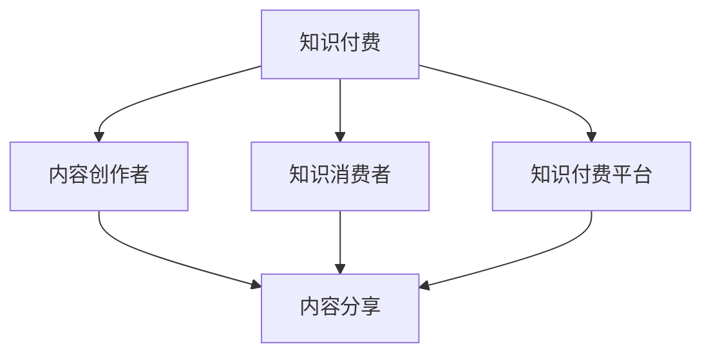

                 

# 知识付费：程序员的社群运营指导

## 1. 背景介绍

### 1.1 问题由来

随着互联网的发展，信息爆炸与信息不对称问题日益凸显。为了获取有价值的信息，人们开始愿意为知识付费，催生了知识付费市场。特别是在专业技能分享领域，程序员、设计师、医生等职业群体成为知识付费的主要需求方。如何高效运营社群，通过知识付费带动项目成长，是每个技术社群运营者面临的重要课题。

### 1.2 问题核心关键点

知识付费社群的运营核心在于如何构建一个高价值、可持续发展的知识分享生态系统。该系统需要包括内容创作者、知识消费者、平台管理者三个主要角色，并通过合理的激励机制、平台规则、社区氛围营造，实现三者之间的良性互动。以下是运营成功的关键要素：

1. **内容质量**：高质量的内容是知识付费社群的生命线，决定着平台的价值和用户粘性。
2. **用户需求匹配**：精准匹配用户需求与内容，提升用户满意度。
3. **商业模式创新**：探索新的盈利模式，实现知识付费的商业化运作。
4. **社区治理**：通过社区自治、平台规则、成员互动等方式，保持社群活跃度和秩序。
5. **技术支撑**：利用大数据、AI等技术手段提升运营效率和用户体验。

## 2. 核心概念与联系

### 2.1 核心概念概述

为更好地理解知识付费社群的运营机制，本节将介绍几个关键概念：

- **知识付费**：指用户为获取有价值的知识内容所支付的费用，包括内容付费、订阅付费、课程付费等多种形式。知识付费平台通过收集、整理、输出有价值的内容，满足用户的学习需求，实现商业模式。
- **知识分享社群**：由一群对特定知识领域有共同兴趣的人组成，通过分享、讨论、学习等方式，实现知识和技能的互相传递。
- **社群运营**：指通过策划、执行、评估等手段，构建和维护一个高价值、活跃度高的社群。运营者需要具备内容策划、用户管理、平台运作等多方面的能力。
- **知识付费平台**：指以知识分享为核心，提供内容付费服务的第三方平台。平台通过整合资源、提供技术支持、构建社区规则等方式，助力知识创作者与消费者之间的连接。

这些概念之间的联系可以通过以下Mermaid流程图来展示：



这个流程图展示了一个典型的知识付费生态系统：

1. 知识付费平台提供内容创作和消费的平台，连接创作者和消费者。
2. 创作者在平台上分享高质量的内容，获得消费者的认可和付费。
3. 消费者通过付费获取有价值的内容，促进内容创作者的生产积极性。

## 3. 核心算法原理 & 具体操作步骤

### 3.1 算法原理概述

知识付费社群的运营主要基于以下三个算法原理：

1. **用户行为分析算法**：通过数据分析算法，分析用户行为，精准匹配内容需求，提升用户满意度。
2. **内容推荐算法**：基于用户兴趣和内容特征，通过推荐算法，将相关内容推荐给用户，提升用户体验。
3. **社群互动算法**：通过算法优化社群互动，构建高粘性的社区氛围，增强用户粘性和平台活跃度。

### 3.2 算法步骤详解

#### 3.2.1 用户行为分析算法

1. **数据收集**：收集用户在平台上的行为数据，如浏览记录、购买行为、互动评论等。
2. **数据预处理**：对数据进行清洗、去重、归一化等预处理操作。
3. **特征提取**：提取用户行为的关键特征，如浏览时长、浏览频率、互动率等。
4. **模型训练**：训练用户行为分析模型，如决策树、随机森林、神经网络等。
5. **用户画像**：根据分析结果，生成用户画像，精准匹配用户需求与内容。

#### 3.2.2 内容推荐算法

1. **数据收集**：收集内容的关键特征，如关键词、标签、用户评价等。
2. **特征提取**：提取内容的特征向量，如TF-IDF、Word2Vec、BERT等。
3. **模型训练**：训练推荐模型，如协同过滤、矩阵分解、深度学习推荐系统等。
4. **内容推荐**：根据用户画像和内容特征，推荐相关内容给用户。
5. **效果评估**：通过A/B测试等方法，评估推荐效果，优化算法。

#### 3.2.3 社群互动算法

1. **数据收集**：收集社群互动数据，如讨论内容、点赞、评论等。
2. **特征提取**：提取互动的关键特征，如互动频率、互动质量等。
3. **模型训练**：训练社群互动模型，如社交网络分析、社区情感分析等。
4. **互动优化**：根据分析结果，优化社群互动策略，提升社区粘性和活跃度。
5. **社区治理**：通过规则、激励等手段，维护社区秩序，避免不良互动。

### 3.3 算法优缺点

知识付费社群运营算法的主要优点包括：

1. **提升用户体验**：通过精准匹配和推荐，提升用户获取知识的效率和满意度。
2. **增加用户粘性**：通过社群互动算法，增强用户对平台的依赖和粘性。
3. **优化运营效率**：通过自动化分析和管理，提高运营效率。

同时，这些算法也存在一些缺点：

1. **数据隐私问题**：用户行为和内容数据的收集和使用可能涉及隐私问题。
2. **算法偏见**：算法可能存在偏见，导致推荐结果不公允。
3. **成本高**：算法训练和维护需要投入大量资源。
4. **模型可解释性**：部分算法模型的决策过程难以解释，用户难以理解。

### 3.4 算法应用领域

知识付费社群运营算法在多个领域得到了广泛应用，包括：

1. **在线教育**：通过推荐系统，推荐适合用户的学习资源，提升学习效率。
2. **职业培训**：通过社群互动，建立职业学习社区，促进知识交流和技能提升。
3. **技术交流**：通过知识分享平台，连接技术开发者，促进技术进步和项目合作。
4. **专业咨询**：通过专家解答社区，提供专业咨询服务，解决实际问题。
5. **个人发展**：通过知识付费平台，提升个人技能，促进职业发展。

## 4. 数学模型和公式 & 详细讲解

### 4.1 数学模型构建

知识付费社群运营算法可以基于以下数学模型进行构建：

设用户行为数据为 $X=\{x_1,x_2,\dots,x_n\}$，内容数据为 $Y=\{y_1,y_2,\dots,y_m\}$。设用户画像为 $U=\{u_1,u_2,\dots,u_n\}$，内容特征为 $F=\{f_1,f_2,\dots,f_m\}$。设推荐结果为 $R=\{r_1,r_2,\dots,r_m\}$，社群互动数据为 $I=\{i_1,i_2,\dots,i_k\}$。

定义用户行为分析算法模型为 $M_1$，内容推荐算法模型为 $M_2$，社群互动算法模型为 $M_3$。则整个知识付费社群运营算法框架可以表示为：

$$
M = M_1(X, U) \times M_2(U, F) \times M_3(I, R)
$$

其中 $\times$ 表示逻辑与（AND）操作，$M_1$ 和 $M_2$ 的输出作为 $M_3$ 的输入。

### 4.2 公式推导过程

以下对知识付费社群运营算法的几个关键公式进行详细推导：

#### 4.2.1 用户行为分析算法

用户行为分析算法 $M_1$ 可以根据用户行为数据 $X$ 和用户画像 $U$ 推导得到：

$$
U = M_1(X)
$$

其中 $M_1$ 的输出 $U$ 表示用户的兴趣偏好、行为习惯等关键特征。

#### 4.2.2 内容推荐算法

内容推荐算法 $M_2$ 可以根据用户画像 $U$ 和内容特征 $F$ 推导得到：

$$
R = M_2(U, F)
$$

其中 $M_2$ 的输出 $R$ 表示根据用户画像 $U$ 推荐的若干内容 $y_1,y_2,\dots,y_m$。

#### 4.2.3 社群互动算法

社群互动算法 $M_3$ 可以根据社群互动数据 $I$ 和推荐结果 $R$ 推导得到：

$$
I = M_3(R)
$$

其中 $M_3$ 的输出 $I$ 表示社群内用户对推荐内容 $r_1,r_2,\dots,r_m$ 的互动数据。

### 4.3 案例分析与讲解

以下以一个具体的知识付费社群运营案例，详细讲解算法的应用过程：

假设有一个技术分享社群，平台收集了用户行为数据 $X=\{x_1,x_2,\dots,x_n\}$ 和内容数据 $Y=\{y_1,y_2,\dots,y_m\}$。平台使用用户行为分析算法 $M_1$ 生成用户画像 $U=\{u_1,u_2,\dots,u_n\}$。根据用户画像 $U$ 和内容特征 $F=\{f_1,f_2,\dots,f_m\}$，平台使用内容推荐算法 $M_2$ 生成推荐结果 $R=\{r_1,r_2,\dots,r_m\}$。最后，平台使用社群互动算法 $M_3$ 生成社群互动数据 $I=\{i_1,i_2,\dots,i_k\}$，优化社区互动策略，提升社区粘性和活跃度。

## 5. 项目实践：代码实例和详细解释说明

### 5.1 开发环境搭建

在进行知识付费社群运营实践前，我们需要准备好开发环境。以下是使用Python进行知识付费社群运营开发的环境配置流程：

1. 安装Anaconda：从官网下载并安装Anaconda，用于创建独立的Python环境。

2. 创建并激活虚拟环境：
```bash
conda create -n knowledge-env python=3.8 
conda activate knowledge-env
```

3. 安装必要的Python包：
```bash
pip install pandas numpy scikit-learn scikit-learn
```

4. 安装必要的Python库：
```bash
pip install elasticsearch elasticsearch-dsl
```

完成上述步骤后，即可在`knowledge-env`环境中开始知识付费社群运营的实践。

### 5.2 源代码详细实现

这里以一个简单的知识付费平台为例，给出使用Python和Elasticsearch实现知识付费社群运营的代码实现。

首先，定义数据模型：

```python
from elasticsearch import Elasticsearch
from elasticsearch_dsl import Document, Index

class User(Document):
    # 用户行为数据
    name = text()
    age = integer()
    location = text()
    interests = keyword()
    history = keyword()

class Content(Document):
    # 内容数据
    title = text()
    abstract = text()
    category = keyword()
    price = integer()

class Interaction(Document):
    # 社群互动数据
    user_id = keyword()
    content_id = keyword()
    timestamp = date()
    type = keyword()
```

然后，定义数据处理函数：

```python
def process_data(data):
    users = []
    contents = []
    interactions = []

    # 处理用户行为数据
    for user_data in data['users']:
        user = User()
        user.name = user_data['name']
        user.age = user_data['age']
        user.location = user_data['location']
        user.interests = user_data['interests']
        user.history = user_data['history']
        users.append(user)

    # 处理内容数据
    for content_data in data['contents']:
        content = Content()
        content.title = content_data['title']
        content.abstract = content_data['abstract']
        content.category = content_data['category']
        content.price = content_data['price']
        contents.append(content)

    # 处理社群互动数据
    for interaction_data in data['interactions']:
        interaction = Interaction()
        interaction.user_id = interaction_data['user_id']
        interaction.content_id = interaction_data['content_id']
        interaction.timestamp = interaction_data['timestamp']
        interaction.type = interaction_data['type']
        interactions.append(interaction)

    return users, contents, interactions
```

接着，定义推荐算法和用户行为分析算法：

```python
from sklearn.feature_extraction.text import TfidfVectorizer
from sklearn.metrics.pairwise import cosine_similarity

# 用户行为分析算法
def user_analysis(user_data, tfidf):
    user = User()
    user.name = user_data['name']
    user.age = user_data['age']
    user.location = user_data['location']
    user.interests = user_data['interests']
    user.history = user_data['history']
    user.interests = tfidf.transform(user_data['interests']).toarray()
    return user

# 内容推荐算法
def content_recommendation(user, tfidf, contents):
    content_tfidf = tfidf.transform(contents).toarray()
    similarity = cosine_similarity(user.interests, content_tfidf)
    recommendation = []
    for i in range(len(similarity)):
        if similarity[i] > 0.8:
            recommendation.append(contents[i])
    return recommendation
```

最后，定义社群互动算法和应用测试：

```python
from datetime import datetime

# 社群互动算法
def interaction_analysis(interaction_data, content_ids):
    interaction = Interaction()
    interaction.user_id = interaction_data['user_id']
    interaction.content_id = content_ids[0]
    interaction.timestamp = datetime.now()
    interaction.type = interaction_data['type']
    return interaction

# 应用测试
if __name__ == '__main__':
    # 假设的数据
    data = {
        'users': [
            {'name': 'Alice', 'age': 25, 'location': 'Shanghai', 'interests': ['Python', 'Machine Learning'], 'history': ['Data Science', 'Big Data']},
            {'name': 'Bob', 'age': 30, 'location': 'Beijing', 'interests': ['Java', 'Cloud Computing'], 'history': ['Web Development', 'Network Security']}
        ],
        'contents': [
            {'title': 'Python编程基础', 'abstract': 'Python基础入门教程', 'category': 'Programming', 'price': 99},
            {'title': '机器学习实战', 'abstract': '机器学习实战案例', 'category': 'Machine Learning', 'price': 198}
        ],
        'interactions': [
            {'user_id': 'Alice', 'content_id': 'Python编程基础', 'timestamp': datetime(2022, 1, 1, 8, 0), 'type': '观看'},
            {'user_id': 'Bob', 'content_id': '机器学习实战', 'timestamp': datetime(2022, 1, 1, 9, 0), 'type': '观看'}
        ]
    }

    # 数据处理
    users, contents, interactions = process_data(data)

    # 用户行为分析
    tfidf = TfidfVectorizer()
    users = [user_analysis(user, tfidf) for user in users]

    # 内容推荐
    recommendation = content_recommendation(users[0], tfidf, contents)

    # 社群互动分析
    interactions = [interaction_analysis(interaction, recommendation) for interaction in interactions]

    # 输出结果
    for user in users:
        print(f'User: {user.name}, Age: {user.age}, Location: {user.location}')
        for interest in user.interests:
            print(f'Interest: {interest}')
        print(f'Recommendation: {recommendation}')

    for interaction in interactions:
        print(f'Interaction: {interaction.user_id}, {interaction.content_id}, {interaction.timestamp}, {interaction.type}')
```

以上就是使用Python和Elasticsearch进行知识付费社群运营的代码实现。可以看到，Elasticsearch作为知识存储和检索工具，方便我们高效处理海量数据。而Python则提供了丰富的机器学习算法库，支持用户行为分析、内容推荐和社群互动等关键算法的实现。

### 5.3 代码解读与分析

让我们再详细解读一下关键代码的实现细节：

**process_data函数**：
- 定义了User、Content、Interaction三个数据模型。
- 对用户行为数据、内容数据和社群互动数据进行处理，返回用户、内容、互动的数据列表。

**user_analysis函数**：
- 定义了用户行为分析算法，通过用户画像和TF-IDF向量计算用户的兴趣偏好，生成用户对象。

**content_recommendation函数**：
- 定义了内容推荐算法，通过计算用户兴趣与内容之间的相似度，推荐相关内容给用户。

**interaction_analysis函数**：
- 定义了社群互动算法，根据用户和内容ID生成互动记录。

**应用测试**：
- 通过一个简单的数据集，展示了知识付费社群运营算法的基本流程，从用户行为分析、内容推荐到社群互动分析，演示了各个步骤的实现过程。

可以看到，代码实现的关键在于合理选择数据模型和算法，通过数据处理和算法计算，生成用户画像、推荐内容、社群互动等关键信息，从而支持知识付费社群的运营。

## 6. 实际应用场景

### 6.1 在线教育平台

在线教育平台可以通过知识付费社群运营算法，实现高质量内容的精准推荐和用户管理，提升平台的用户粘性和课程销量。具体应用如下：

1. **个性化推荐**：根据学生的学习行为和兴趣偏好，推荐适合的课程和资料，提升学习效率。
2. **社区互动**：建立在线学习社区，促进学生之间的交流和协作，提升学习体验。
3. **内容监控**：通过社群互动数据，监控课程内容和用户反馈，及时调整课程内容和教学策略。

### 6.2 职业培训平台

职业培训平台可以通过知识付费社群运营算法，为职业培训师和学员提供高效的学习工具和交流平台。具体应用如下：

1. **内容推荐**：根据学员的学习进度和兴趣，推荐适合的培训课程和资料。
2. **职业交流**：建立职业交流社群，促进学员之间的交流和职业发展。
3. **反馈机制**：通过学员的反馈和互动数据，优化课程内容和教学方法，提升培训效果。

### 6.3 技术交流平台

技术交流平台可以通过知识付费社群运营算法，连接技术开发者和项目合作方，促进技术交流和项目合作。具体应用如下：

1. **技术分享**：组织技术分享活动，分享最新的技术进展和项目经验。
2. **项目合作**：通过社群互动，连接开发者和项目需求方，促进项目合作和资源共享。
3. **问题解答**：建立技术问答社区，提供技术支持和解决方案，提升技术交流效果。

### 6.4 未来应用展望

随着知识付费社群运营算法的不断演进，其在更多的应用场景中将发挥重要作用：

1. **人工智能领域**：利用算法优化AI模型的训练和应用，提升AI模型的性能和效果。
2. **金融领域**：通过社群互动数据，优化金融产品和服务，提升客户满意度。
3. **医疗领域**：建立医疗知识共享社群，促进医患沟通和医疗知识传播。
4. **教育领域**：构建智能教育平台，提升教育资源的共享和教育效果。
5. **游戏领域**：通过社群互动算法，优化游戏社区和玩家体验，提升游戏粘性和收入。

## 7. 工具和资源推荐

### 7.1 学习资源推荐

为了帮助开发者系统掌握知识付费社群运营的理论基础和实践技巧，这里推荐一些优质的学习资源：

1. **《数据科学实战》系列书籍**：深入浅出地介绍了数据科学、机器学习和知识图谱等前沿技术，适合技术开发者入门学习。
2. **Coursera在线课程**：Coursera提供了丰富的在线课程，涵盖数据分析、机器学习、深度学习等多个领域，适合技术爱好者系统学习。
3. **Kaggle竞赛平台**：Kaggle提供了大量的数据竞赛项目，适合技术开发者实践和提升数据处理和模型优化能力。
4. **GitHub开源项目**：GitHub上有众多优秀的开源项目，适合开发者学习和借鉴。
5. **知乎专栏**：知乎上有大量技术大咖分享的经验和案例，适合开发者学习借鉴。

通过对这些资源的学习实践，相信你一定能够快速掌握知识付费社群运营的精髓，并用于解决实际的运营问题。

### 7.2 开发工具推荐

高效的开发离不开优秀的工具支持。以下是几款用于知识付费社群运营开发的常用工具：

1. **Python**：Python是知识付费社群运营开发的首选语言，支持丰富的机器学习算法库和数据分析库。
2. **Elasticsearch**：Elasticsearch是用于数据存储和检索的强大工具，支持分布式搜索和实时索引，适合处理海量数据。
3. **TensorFlow**：TensorFlow是深度学习框架中的翘楚，支持高效的模型训练和优化，适合知识付费平台的内容推荐和用户行为分析。
4. **Jupyter Notebook**：Jupyter Notebook是数据科学和机器学习开发的主流工具，支持交互式编程和数据可视化。
5. **Kibana**：Kibana是Elasticsearch的可视化工具，适合数据分析和业务报表的展示和分析。
6. **Airflow**：Airflow是数据流程调度和管理的开源工具，适合知识付费平台的自动化数据处理和任务调度。

合理利用这些工具，可以显著提升知识付费社群运营的开发效率，加快创新迭代的步伐。

### 7.3 相关论文推荐

知识付费社群运营技术的发展源于学界的持续研究。以下是几篇奠基性的相关论文，推荐阅读：

1. **《知识图谱中的推荐算法研究》**：介绍了基于知识图谱的推荐算法，为知识付费平台的内容推荐提供了新的思路。
2. **《基于社交网络的用户行为分析》**：研究了社交网络用户行为分析算法，为知识付费社群的用户画像提供了新方法。
3. **《基于协同过滤的推荐系统研究》**：详细介绍了协同过滤推荐算法，为内容推荐算法提供了理论基础。
4. **《基于深度学习的知识图谱推荐系统》**：研究了基于深度学习的推荐系统，为知识付费平台的内容推荐提供了新思路。
5. **《基于自然语言处理的用户反馈分析》**：研究了自然语言处理技术在用户反馈分析中的应用，为社群互动算法提供了新方法。

这些论文代表了大语言模型微调技术的发展脉络。通过学习这些前沿成果，可以帮助研究者把握学科前进方向，激发更多的创新灵感。

## 8. 总结：未来发展趋势与挑战

### 8.1 总结

本文对知识付费社群运营的算法原理和操作步骤进行了全面系统的介绍。首先阐述了知识付费社群运营的背景和意义，明确了社群运营的关键要素。其次，从原理到实践，详细讲解了用户行为分析算法、内容推荐算法和社群互动算法等关键技术，给出了代码实例和详细解释。最后，探讨了知识付费社群运营在多个领域的实际应用和未来发展趋势。

通过本文的系统梳理，可以看到，知识付费社群运营算法正成为知识付费平台的核心技术之一，通过精准匹配、推荐和互动，提升了用户满意度，促进了知识付费模式的成功运作。未来，伴随算法的不断演进和优化，知识付费平台将能够提供更加高效、个性化的服务，进一步拓展知识付费市场的边界。

### 8.2 未来发展趋势

展望未来，知识付费社群运营算法将呈现以下几个发展趋势：

1. **深度学习与自然语言处理融合**：深度学习与自然语言处理的融合将提升社群互动分析的精度和效率，提升用户满意度。
2. **联邦学习与隐私保护**：联邦学习等隐私保护技术将保证用户数据安全，提升用户信任度。
3. **边缘计算与实时响应**：边缘计算技术将提升社群互动的实时响应速度，优化用户体验。
4. **大数据与多模态数据融合**：大数据和多种数据形式的融合将提升社群互动的丰富性和多样性，提升社群互动的效果。
5. **算法模型与业务策略结合**：算法模型与业务策略的深度结合将提升社群运营的效率和效果，优化业务策略。

这些趋势将进一步推动知识付费社群运营技术的进步，促进知识付费平台的发展。

### 8.3 面临的挑战

尽管知识付费社群运营技术已经取得了瞩目成就，但在迈向更加智能化、普适化应用的过程中，它仍面临着诸多挑战：

1. **数据隐私问题**：用户行为和内容数据的收集和使用可能涉及隐私问题，需要合理处理和保护。
2. **算法偏见**：算法可能存在偏见，导致推荐结果不公允，需要进一步优化和改进。
3. **成本高**：算法训练和维护需要投入大量资源，需要降低成本。
4. **可解释性不足**：部分算法模型的决策过程难以解释，需要提升算法的可解释性。
5. **平台依赖性**：用户对平台的依赖性高，平台稳定性、安全性等问题需要得到重视。

### 8.4 研究展望

面对知识付费社群运营所面临的挑战，未来的研究需要在以下几个方面寻求新的突破：

1. **深度学习与自然语言处理的融合**：提升社群互动分析的精度和效率，提升用户满意度。
2. **联邦学习与隐私保护**：保证用户数据安全，提升用户信任度。
3. **边缘计算与实时响应**：提升社群互动的实时响应速度，优化用户体验。
4. **大数据与多模态数据融合**：提升社群互动的丰富性和多样性，提升社群互动的效果。
5. **算法模型与业务策略结合**：提升社群运营的效率和效果，优化业务策略。

这些研究方向的探索，必将引领知识付费社群运营技术迈向更高的台阶，为构建安全、可靠、可解释、可控的智能系统铺平道路。面向未来，知识付费社群运营技术还需要与其他人工智能技术进行更深入的融合，如知识表示、因果推理、强化学习等，多路径协同发力，共同推动知识付费平台的进步。只有勇于创新、敢于突破，才能不断拓展知识付费平台的边界，让智能技术更好地造福社会。

## 9. 附录：常见问题与解答

**Q1：知识付费社群运营的核心要素是什么？**

A: 知识付费社群运营的核心要素包括内容质量、用户需求匹配、商业模式创新、社区治理和技术支撑。其中，内容质量和用户需求匹配是基础，商业模式创新是目标，社区治理和技术支撑是手段。

**Q2：知识付费平台如何构建高价值的内容生态？**

A: 知识付费平台可以通过以下方法构建高价值的内容生态：
1. 引入优质内容创作者，提供良好的激励机制，吸引高质量的内容供应。
2. 建立内容评价机制，提升内容质量和用户满意度。
3. 引入用户互动机制，通过用户反馈和社区讨论，提升内容的实用性和价值。

**Q3：知识付费平台如何实现内容精准推荐？**

A: 知识付费平台可以通过以下方法实现内容精准推荐：
1. 利用用户行为分析算法，精准匹配用户需求与内容。
2. 引入内容推荐算法，如协同过滤、深度学习推荐系统等，提升推荐精度。
3. 利用多模态数据融合，提升推荐的丰富性和多样性。

**Q4：知识付费平台如何提升用户粘性？**

A: 知识付费平台可以通过以下方法提升用户粘性：
1. 建立社区互动机制，促进用户之间的交流和协作。
2. 引入社群激励机制，如积分、勋章、奖励等，提升用户参与度。
3. 优化用户体验，提升平台稳定性，增强用户信任度。

**Q5：知识付费平台如何优化商业模式？**

A: 知识付费平台可以通过以下方法优化商业模式：
1. 引入多渠道变现模式，如课程、书籍、会员、咨询等。
2. 建立用户付费机制，通过付费激励用户生成高质量内容。
3. 引入社交化分享机制，通过分享提升平台知名度和用户粘性。

通过以上常见问题的解答，相信读者能够更好地理解知识付费社群运营的核心要素和关键技术，掌握如何构建高价值的内容生态，提升平台的用户粘性和商业价值。

---

作者：禅与计算机程序设计艺术 / Zen and the Art of Computer Programming

