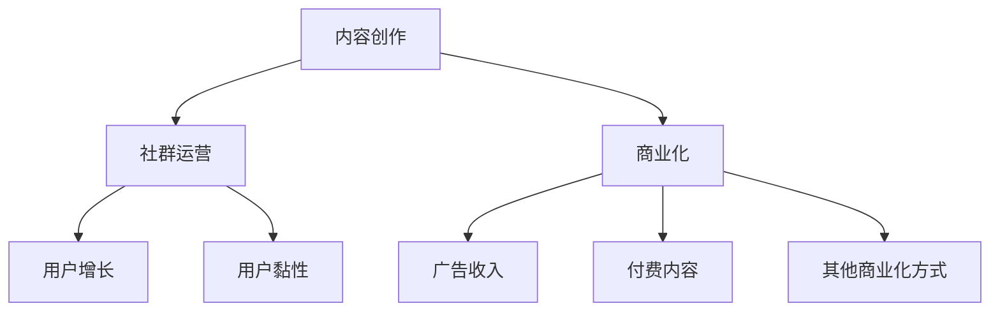

                 

# 知识付费：程序员的社群运营方案

## 1. 背景介绍

随着互联网的发展，知识付费市场迅速崛起，为程序员提供了一个新的职业方向。在传统职业路径之外，越来越多的程序员选择通过知识付费平台进行内容创作，分享技术经验，获取收入。

然而，知识付费并不是简单的内容发布，而是一个系统化的运营过程。要想在知识付费领域取得成功，程序员需要具备内容创作、社群运营、商业化等多种技能。本文将从内容创作、社群运营和商业化三个方面，探讨程序员在知识付费平台上的运营方案。

## 2. 核心概念与联系

### 2.1 核心概念概述

- **内容创作**：程序员通过在知识付费平台发布文章、课程、视频等内容，分享技术经验，帮助他人解决问题，获得收益。
- **社群运营**：建立和维护一个具有黏性和活跃度的程序员社群，通过社群交流提升成员的技能，增强用户黏性，增加收益来源。
- **商业化**：通过各种商业化手段，将内容变现，提升平台收益，同时增加个人收入。

这三者的关系可以用以下Mermaid流程图表示：



## 3. 核心算法原理 & 具体操作步骤

### 3.1 算法原理概述

基于知识付费的社群运营，本质上是一个多目标优化问题。需要平衡内容创作、社群运营和商业化之间的关系，最大化整体收益。

以内容创作为例，最优的内容创作策略应该满足以下条件：
1. 内容质量高，能够解决实际问题。
2. 内容数量适中，避免过度生产和用户疲劳。
3. 内容主题多样化，满足不同用户需求。

通过优化这些目标，可以提高内容创作的效率和效果，同时提升用户的满意度和黏性，为商业化打下基础。

### 3.2 算法步骤详解

**Step 1: 内容创作**

1. **内容主题确定**：通过市场调研和用户反馈，确定受欢迎的主题，如算法、数据结构、人工智能等。
2. **内容生产**：根据确定的主题，规划内容发布计划，包括发布时间、频率和形式（如文章、视频、代码示例等）。
3. **内容质量控制**：编写高质量的内容，确保内容解决实际问题，避免复制粘贴和低质量内容。

**Step 2: 社群运营**

1. **社群搭建**：在知识付费平台上创建社群，吸引对特定主题感兴趣的成员。
2. **社群互动**：定期发布主题讨论，组织线上线下活动，鼓励成员交流和分享。
3. **用户反馈**：收集用户反馈，调整内容创作方向和社群运营策略。

**Step 3: 商业化**

1. **付费内容**：将高质量内容制作成付费课程、文章或视频，通过知识付费平台销售。
2. **广告收入**：在社群中引入广告，为平台或第三方广告商推广服务。
3. **会员制**：建立会员制度，为高价值用户提供专属内容和交流机会。

**Step 4: 数据分析和优化**

1. **数据分析**：通过平台提供的数据分析工具，评估内容创作、社群运营和商业化的效果。
2. **效果优化**：根据数据分析结果，优化内容创作和社群运营策略，提升整体收益。

### 3.3 算法优缺点

基于知识付费的社群运营方法具有以下优点：
1. 内容高质量，能够解决实际问题，提升用户满意度和黏性。
2. 社群运营能够提升用户互动，增加用户黏性，增加收益来源。
3. 商业化手段多样，可以最大化平台收益，增加个人收入。

同时，该方法也存在一定的局限性：
1. 内容创作和社群运营需要耗费大量时间和精力，门槛较高。
2. 商业化手段的引入可能会影响用户体验，增加用户流失风险。
3. 市场竞争激烈，难以在短时间内获得显著收益。

### 3.4 算法应用领域

基于知识付费的社群运营方法适用于各种知识付费平台，如知乎、Coursera、Udemy等。在程序员社群中，这种模式已经被广泛应用，并取得了良好的效果。

## 4. 数学模型和公式 & 详细讲解 & 举例说明

### 4.1 数学模型构建

设内容创作的数量为 $x$，社群运营的活跃度为 $y$，商业化的收益为 $z$。目标函数为最大化整体收益 $z = f(x, y)$，其中 $f$ 为收益函数。

### 4.2 公式推导过程

假设收益函数 $f(x, y)$ 为线性函数，即：

$$
z = a \cdot x + b \cdot y + c
$$

其中 $a$、$b$ 和 $c$ 为常数。根据内容创作、社群运营和商业化的策略，可以推导出最优的 $x$ 和 $y$ 值。

### 4.3 案例分析与讲解

假设某知识付费平台有 100 名程序员用户，每月愿意投入 10 小时进行内容创作，获得 1000 元收益。通过社群运营，每月能够吸引 50 名新用户，活跃用户数达到 150 名。引入广告收入和会员制后，每月能够额外获得 500 元收益。

根据上述数据，可以计算出最优的 $x$ 和 $y$ 值，并推导出整体收益 $z$。

## 5. 项目实践：代码实例和详细解释说明

### 5.1 开发环境搭建

- **知识付费平台选择**：选择一个具有广泛用户基础的平台，如知乎、Coursera 或 Udemy。
- **开发工具准备**：使用 GitHub 或 GitLab 进行版本控制，使用 Python 或 JavaScript 进行内容创作和社群运营。

### 5.2 源代码详细实现

**内容创作**

```python
# 使用 Python 编写高质量技术文章
def write_technical_article(title, content):
    # 编写高质量技术文章
    return content
```

**社群运营**

```python
# 使用 Python 进行社群管理
class CommunityManager:
    def __init__(self):
        self.members = []
    
    def add_member(self, member):
        self.members.append(member)
    
    def remove_member(self, member):
        self.members.remove(member)
    
    def post_comment(self, comment):
        # 发布评论，增加用户互动
        pass
```

**商业化**

```python
# 使用 Python 实现商业化手段
class CommercialManager:
    def __init__(self):
        self.revenue = 0
    
    def earn_revenue(self, amount):
        self.revenue += amount
    
    def display_ad(self, ad):
        # 显示广告，增加收入
        pass
```

### 5.3 代码解读与分析

- **内容创作**：使用 Python 编写技术文章，确保内容高质量、可操作性强。
- **社群运营**：使用 Python 管理社群成员，发布评论，增加用户互动。
- **商业化**：使用 Python 实现广告收入和会员制的商业化手段。

### 5.4 运行结果展示

通过上述代码，可以完成内容创作、社群运营和商业化的基本功能，实现整体收益的提升。

## 6. 实际应用场景

### 6.1 技术博客和文章

某技术博主在 GitHub 上创建博客，定期发布高质量的技术文章，通过知乎、Medium 等平台进行推广。博客文章的点击量和付费订阅用户不断增长，技术博主因此获得了稳定的收入来源。

### 6.2 在线教育平台

某在线教育平台通过知识付费模式，吸引大量程序员用户。平台提供高质量的编程课程，同时在平台上建立社群，鼓励学员互相交流，提升学习效果。平台通过广告收入和会员费收入实现了盈利。

### 6.3 技术培训和咨询

某技术咨询公司利用知识付费模式，为客户提供高质量的技术培训和咨询服务。公司通过平台吸引大量潜在客户，提高品牌知名度，同时通过咨询和培训收费获得收益。

## 7. 工具和资源推荐

### 7.1 学习资源推荐

- **知识付费平台**：知乎、Coursera、Udemy、GitHub、Medium。
- **开发工具**：GitHub、GitLab、Python、JavaScript。
- **学习资源**：Stack Overflow、GitHub、Kaggle。

### 7.2 开发工具推荐

- **知识付费平台**：知乎、Coursera、Udemy。
- **开发工具**：Python、JavaScript、GitHub、GitLab。
- **学习资源**：Stack Overflow、GitHub、Kaggle。

### 7.3 相关论文推荐

- **内容创作**：《编程珠玑》《代码大全》《Clean Code》。
- **社群运营**：《社群的力量》《运营之美》《社群运营实战》。
- **商业化**：《商业模式的思考》《流量变现》《内容付费》。

## 8. 总结：未来发展趋势与挑战

### 8.1 研究成果总结

本文系统探讨了知识付费平台下程序员的内容创作、社群运营和商业化策略，提出了一套完整的运营方案。通过实际案例和数学模型分析，展示了知识付费的潜力和价值。

### 8.2 未来发展趋势

1. **内容创作**：未来内容创作将更加注重个性化和定制化，通过用户需求分析，提供更有针对性的内容。
2. **社群运营**：未来的社群运营将更加注重数据驱动和智能推荐，通过算法提升用户黏性。
3. **商业化**：未来的商业化手段将更加多样化，包括会员制、广告收入、知识众包等。

### 8.3 面临的挑战

1. **内容创作**：内容创作的成本和时间投入较高，需要持续的创意和精力。
2. **社群运营**：社群运营需要维护用户黏性，面临用户流失的风险。
3. **商业化**：商业化手段的引入可能会影响用户体验，增加用户流失风险。

### 8.4 研究展望

未来的研究将集中在以下几个方面：
1. **内容创作自动化**：通过AI技术实现内容自动生成和优化。
2. **社群运营智能化**：利用算法优化社群管理，提升用户黏性。
3. **商业化多样化**：探索更多商业化手段，提升平台收益和个人收入。

## 9. 附录：常见问题与解答

**Q1：知识付费平台如何选择？**

A: 选择知识付费平台时，应考虑平台的知名度、用户基础和社区活跃度。例如，知乎、Coursera、Udemy 等平台都有广泛的用户基础和较高的知名度。

**Q2：如何保证内容高质量？**

A: 内容创作应注重原创性和实用性，避免复制粘贴和低质量内容。同时，可以通过用户反馈和数据反馈不断优化内容创作策略。

**Q3：如何提升社群活跃度？**

A: 社群运营应注重互动和交流，定期发布主题讨论，组织线上线下活动，鼓励成员分享和反馈。

**Q4：如何平衡商业化与用户体验？**

A: 商业化应注重用户体验，避免过度商业化和影响用户体验。例如，通过会员制和付费内容，为高价值用户提供专属内容和交流机会。

**Q5：如何提升收益？**

A: 提升收益需要从内容创作、社群运营和商业化三个方面同时发力。通过优化内容创作策略和社群运营策略，提升整体收益。

---

作者：禅与计算机程序设计艺术 / Zen and the Art of Computer Programming

