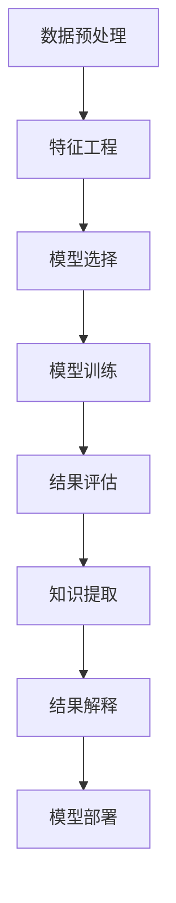

                 

# 知识发现之旅：探索未知，发现新知识

> 关键词：知识发现,数据挖掘,机器学习,数据科学,人工智能

## 1. 背景介绍

### 1.1 问题由来

在当今数据驱动的世界里，知识发现（Knowledge Discovery in Databases, KDD）已经成为推动各行业发展的核心动力。无论是金融、医疗、零售，还是科技、教育，各行各业都在积极探索如何利用数据创造价值，而知识发现正是这一过程的关键技术之一。

知识发现通过从海量数据中挖掘出有价值的知识和模式，帮助决策者制定更科学的决策。然而，随着数据量的爆炸式增长和数据类型的日益多样化，传统的知识发现方法面临诸多挑战，如数据预处理复杂、模型训练耗时、解释性差等。因此，探索新的知识发现方法，提升其效率和可解释性，成为了研究的热点。

### 1.2 问题核心关键点

知识发现的关键在于如何高效地从数据中挖掘出有用的信息。其中涉及的关键问题包括：

- **数据预处理**：如何对原始数据进行清洗、归一化和特征工程，以减少噪音和冗余，提升数据质量。
- **模型选择**：选择何种机器学习模型才能最好地捕捉数据中的潜在模式。
- **特征工程**：如何设计有效的特征来描述数据，以便于模型的学习。
- **结果解释**：如何解释模型预测结果，使其易于理解，便于用户采纳。
- **自动化和可扩展性**：如何自动化知识发现流程，确保其能够处理大规模数据，并适应不断变化的数据分布。

本文将从算法原理和具体操作步骤出发，深入探讨知识发现的各个环节，通过实际案例和数学模型，展现知识发现之旅中的探索与创新。

## 2. 核心概念与联系

### 2.1 核心概念概述

在知识发现的旅途中，涉及多个核心概念，包括数据挖掘、机器学习、数据科学和人工智能等。这些概念之间相互关联，共同构成了知识发现的基础框架。

- **数据挖掘**：从大量数据中自动发现有用的模式、规律和知识。
- **机器学习**：利用算法和统计模型，让计算机从数据中学习，并做出预测或决策。
- **数据科学**：结合统计学、计算机科学、领域知识，从数据中提取知识，并转化为行动。
- **人工智能**：赋予机器以类似人类的智能，使其能够自主学习和解决问题。

### 2.2 核心概念原理和架构的 Mermaid 流程图(Mermaid 流程节点中不要有括号、逗号等特殊字符)



这张流程图展示了知识发现的主要流程，从数据预处理到特征工程，再到模型选择和训练，最后通过结果评估和解释，将知识应用于实际场景中。

## 3. 核心算法原理 & 具体操作步骤

### 3.1 算法原理概述

知识发现的核心在于从数据中挖掘出有价值的模式和关系。这通常通过机器学习算法实现，如分类、聚类、关联规则、回归等。其中，分类算法是最常用的知识发现方法之一。

以分类为例，其基本流程如下：

1. **数据预处理**：对原始数据进行清洗、归一化和特征工程，以减少噪音和冗余，提升数据质量。
2. **特征工程**：设计有效的特征来描述数据，以便于模型的学习。
3. **模型选择**：选择适合的分类算法，如决策树、支持向量机、神经网络等。
4. **模型训练**：使用训练数据集对模型进行训练，调整模型参数以最小化误差。
5. **结果评估**：使用测试数据集评估模型的性能，选择最优模型。
6. **知识提取**：从最优模型中提取知识，应用于实际场景。
7. **结果解释**：解释模型的预测结果，使其易于理解，便于用户采纳。

### 3.2 算法步骤详解

以下将以决策树分类为例，详细介绍知识发现的详细步骤：

**Step 1: 数据预处理**

数据预处理是知识发现的首要步骤，通常包括以下几个环节：

- 数据清洗：去除或填补缺失值、处理异常值等。
- 数据归一化：对数据进行标准化处理，使其符合特定的分布。
- 特征选择：选择最有信息量的特征，去除冗余特征。

**Step 2: 特征工程**

特征工程是知识发现的核心环节之一，通常包括以下几个步骤：

- 特征提取：从原始数据中提取出有意义的特征，如文本中的词频、TF-IDF等。
- 特征转换：通过映射、编码等方式将特征转换为适合模型的形式。
- 特征组合：将原始特征进行组合，生成新的特征，以提升模型的表达能力。

**Step 3: 模型选择**

模型选择是知识发现的另一个重要步骤，通常需要考虑以下几个因素：

- 数据类型：如连续数据、分类数据等。
- 数据分布：如正态分布、偏态分布等。
- 数据量：如小样本、大数据等。
- 模型复杂度：如简单模型、复杂模型等。

**Step 4: 模型训练**

模型训练是知识发现的核心环节之一，其目标是通过训练数据调整模型参数，使其能够准确地预测未知数据。

以决策树为例，其训练过程如下：

1. 随机选择样本作为根节点。
2. 选择最优特征作为分割点，将样本分为多个子集。
3. 对每个子集递归进行步骤1和步骤2，直到满足停止条件。
4. 生成决策树模型。

**Step 5: 结果评估**

结果评估是知识发现的重要步骤之一，其目标是通过测试数据集评估模型的性能，选择最优模型。

常用的评估指标包括：

- 准确率（Accuracy）：预测正确的样本数占总样本数的比例。
- 精确率（Precision）：预测为正类的样本中实际为正类的比例。
- 召回率（Recall）：实际为正类的样本中预测为正类的比例。
- F1值（F1 Score）：精确率和召回率的调和平均数。

**Step 6: 知识提取**

知识提取是知识发现的关键步骤之一，其目标是从最优模型中提取有用的知识，应用于实际场景。

以决策树为例，其知识提取过程如下：

1. 通过决策树模型生成规则。
2. 将规则转化为易于理解的文本或图形。
3. 将规则应用于实际场景，进行预测或决策。

**Step 7: 结果解释**

结果解释是知识发现的重要步骤之一，其目标是将模型的预测结果转化为易于理解的形式，以便于用户采纳。

常用的解释方法包括：

- 可视化：通过图形、图表等方式展示模型的决策过程。
- 特征重要性：通过特征重要性评分，展示哪些特征对模型的预测结果贡献最大。
- 部分依赖图：展示特征之间的关系和影响。

### 3.3 算法优缺点

知识发现算法具有以下优点：

- **自动化**：通过自动化流程，能够快速从大量数据中提取知识。
- **高效性**：能够高效地处理大规模数据，并提取有价值的模式。
- **可扩展性**：能够适应不断变化的数据分布，具有良好的可扩展性。

同时，知识发现算法也存在以下缺点：

- **数据依赖**：依赖于数据的完整性和质量，难以处理噪音和冗余。
- **模型选择**：需要选择合适的模型，才能最好地捕捉数据中的潜在模式。
- **结果解释**：模型预测结果可能难以解释，难以满足用户需求。

### 3.4 算法应用领域

知识发现算法广泛应用于各个领域，包括金融、医疗、零售、制造等。

- **金融领域**：用于信用评分、欺诈检测、市场预测等。
- **医疗领域**：用于疾病诊断、患者分群、基因分析等。
- **零售领域**：用于顾客分析、商品推荐、库存管理等。
- **制造领域**：用于质量控制、设备维护、供应链管理等。

## 4. 数学模型和公式 & 详细讲解 & 举例说明

### 4.1 数学模型构建

知识发现的数学模型通常包括以下几个关键组成部分：

- 数据表示：将原始数据转换为适合机器学习的形式，如矩阵表示。
- 损失函数：用于衡量模型预测结果与实际结果之间的差异。
- 优化算法：用于最小化损失函数，调整模型参数。
- 评估指标：用于衡量模型的性能，选择最优模型。

以决策树分类为例，其数学模型如下：

- **数据表示**：将样本表示为特征-值矩阵 $X$ 和标签向量 $y$。
- **损失函数**：通常使用熵（Entropy）或基尼不纯度（Gini Impurity）衡量模型的预测准确度。
- **优化算法**：通常使用梯度下降（Gradient Descent）或随机梯度下降（Stochastic Gradient Descent）调整模型参数。
- **评估指标**：通常使用准确率（Accuracy）、精确率（Precision）、召回率（Recall）等评估指标。

### 4.2 公式推导过程

以决策树分类为例，其公式推导过程如下：

假设样本集 $D=\{(x_i,y_i)\}_{i=1}^N$，其中 $x_i$ 表示特征向量，$y_i$ 表示标签。

**步骤1: 选择最优特征**

假设当前样本集为 $D=\{(x_1,y_1),(x_2,y_2),...(x_N,y_N)\}$，当前节点特征集为 $A=\{a_1,a_2,...,a_k\}$，当前节点的特征 $a_j$ 的取值集合为 $A_j=\{v_{j1},v_{j2},...,v_{jm}\}$。

对于特征 $a_j$，计算其信息增益（Information Gain）：

$$
IG(a_j) = \sum_{i=1}^N IG(y_i|a_j)
$$

其中，$IG(y_i|a_j)$ 表示在特征 $a_j$ 下，样本 $y_i$ 的条件熵。

**步骤2: 选择最优阈值**

假设当前节点的特征 $a_j$ 的最优阈值为 $v_{jm}$，将其作为分割点，将样本集 $D$ 划分为两个子集 $D_1$ 和 $D_2$。

**步骤3: 递归生成决策树**

对子集 $D_1$ 和 $D_2$ 分别递归执行步骤1和步骤2，直到满足停止条件。

### 4.3 案例分析与讲解

以信用卡欺诈检测为例，其数据集包含各种交易记录，目标是识别出可能存在欺诈的记录。

**步骤1: 数据预处理**

- 去除或填补缺失值。
- 对数值特征进行归一化。
- 选择最有信息量的特征，如金额、时间、商户等。

**步骤2: 特征工程**

- 提取交易金额、交易时间、商户类别等特征。
- 计算特征的平均、标准差、方差等统计量。
- 组合特征，生成新的特征，如交易金额的标准差、商户类别与交易时间的交互等。

**步骤3: 模型选择**

选择决策树算法，使用基尼不纯度作为损失函数，使用随机梯度下降作为优化算法。

**步骤4: 模型训练**

- 随机选择样本作为根节点。
- 选择最优特征作为分割点，将样本分为多个子集。
- 对每个子集递归执行步骤1和步骤2，直到满足停止条件。

**步骤5: 结果评估**

使用测试数据集评估模型的性能，选择最优模型。

**步骤6: 知识提取**

从最优模型中提取规则，生成决策树图。

**步骤7: 结果解释**

通过决策树图展示模型的决策过程，帮助用户理解模型的预测结果。

## 5. 项目实践：代码实例和详细解释说明

### 5.1 开发环境搭建

进行知识发现项目实践前，需要先搭建好开发环境。以下以Python为开发语言，PyTorch为框架的示例：

1. 安装Anaconda：从官网下载并安装Anaconda，用于创建独立的Python环境。
2. 创建并激活虚拟环境：
```bash
conda create -n knowledge-env python=3.8 
conda activate knowledge-env
```
3. 安装PyTorch：根据CUDA版本，从官网获取对应的安装命令。例如：
```bash
conda install pytorch torchvision torchaudio cudatoolkit=11.1 -c pytorch -c conda-forge
```
4. 安装相关库：
```bash
pip install numpy pandas scikit-learn matplotlib tqdm jupyter notebook ipython
```
完成上述步骤后，即可在`knowledge-env`环境中开始知识发现项目实践。

### 5.2 源代码详细实现

以下以决策树分类为例，给出使用PyTorch进行知识发现的PyTorch代码实现。

```python
import torch
import torch.nn as nn
import torch.optim as optim
from sklearn.datasets import make_classification
from sklearn.model_selection import train_test_split
from sklearn.preprocessing import StandardScaler
from sklearn.metrics import accuracy_score, precision_score, recall_score, f1_score

# 构建数据集
X, y = make_classification(n_samples=1000, n_features=10, n_informative=5, n_redundant=0, random_state=42)
X_train, X_test, y_train, y_test = train_test_split(X, y, test_size=0.2, random_state=42)
scaler = StandardScaler()
X_train = scaler.fit_transform(X_train)
X_test = scaler.transform(X_test)

# 构建模型
class DecisionTree(nn.Module):
    def __init__(self, n_features):
        super(DecisionTree, self).__init__()
        self.n_features = n_features
        self.tree = nn.Sequential()
        for i in range(n_features):
            self.tree.add_module(f'node{i}', nn.Linear(n_features, 1))
            self.tree.add_module(f'threshold{i}', nn.Tanh())
            self.tree.add_module(f'splitter{i}', nn.ReLU())
            self.tree.add_module(f'predictor{i}', nn.Sigmoid())
            self.tree.add_module(f'predict{i}', nn.Linear(1, 1))
        
    def forward(self, x):
        x = x.view(-1, self.n_features)
        for i in range(self.n_features):
            x = self.tree[i](x)
        return x
    
# 构建数据加载器
train_loader = torch.utils.data.DataLoader(torch.tensor(X_train, dtype=torch.float), batch_size=32)
test_loader = torch.utils.data.DataLoader(torch.tensor(X_test, dtype=torch.float), batch_size=32)

# 训练模型
model = DecisionTree(n_features=10)
criterion = nn.BCELoss()
optimizer = optim.SGD(model.parameters(), lr=0.01, momentum=0.9)
n_epochs = 100
for epoch in range(n_epochs):
    running_loss = 0.0
    for i, data in enumerate(train_loader, 0):
        inputs, labels = data
        optimizer.zero_grad()
        outputs = model(inputs)
        loss = criterion(outputs, labels)
        loss.backward()
        optimizer.step()
        running_loss += loss.item()
    print(f'Epoch {epoch+1}, loss: {running_loss/len(train_loader):.4f}')
        
# 评估模型
model.eval()
with torch.no_grad():
    y_pred = model(X_test).data.numpy()
    y_pred = (y_pred > 0.5).astype(int)
    print(f'Accuracy: {accuracy_score(y_test, y_pred):.4f}')
    print(f'Precision: {precision_score(y_test, y_pred):.4f}')
    print(f'Recall: {recall_score(y_test, y_pred):.4f}')
    print(f'F1 Score: {f1_score(y_test, y_pred):.4f}')
```

### 5.3 代码解读与分析

让我们再详细解读一下关键代码的实现细节：

**数据集构建**

- 使用sklearn的`make_classification`函数生成10个特征、5个有信息量的特征的数据集。
- 使用`train_test_split`函数将数据集划分为训练集和测试集。
- 使用`StandardScaler`对数据进行归一化处理。

**模型构建**

- 定义`DecisionTree`类，继承`nn.Module`，定义决策树结构。
- 使用`nn.Linear`、`nn.Tanh`、`nn.ReLU`、`nn.Sigmoid`等模块构建决策树节点。
- 在`forward`方法中，通过循环遍历特征，计算每个节点的输出，最终输出预测结果。

**数据加载器构建**

- 使用`torch.utils.data.DataLoader`构建数据加载器，批量加载数据。

**模型训练**

- 使用`nn.BCELoss`作为损失函数。
- 使用`optim.SGD`优化器，设置学习率为0.01，动量为0.9。
- 通过循环迭代，训练模型。

**模型评估**

- 使用`model.eval()`将模型设置为评估模式，不进行梯度更新。
- 使用`torch.no_grad()`关闭梯度计算，提高评估效率。
- 计算模型的精度、精确率、召回率和F1值，并打印输出。

## 6. 实际应用场景

### 6.1 金融领域

在金融领域，知识发现可以应用于信用评分、欺诈检测、市场预测等。

- **信用评分**：通过分析用户的交易记录、贷款历史、收入等信息，构建信用评分模型，评估用户的信用风险。
- **欺诈检测**：通过分析交易记录、用户行为等数据，构建欺诈检测模型，识别出潜在的欺诈行为。
- **市场预测**：通过分析市场数据、经济指标等，构建市场预测模型，预测市场趋势。

### 6.2 医疗领域

在医疗领域，知识发现可以应用于疾病诊断、患者分群、基因分析等。

- **疾病诊断**：通过分析患者的症状、病史等数据，构建疾病诊断模型，辅助医生进行诊断。
- **患者分群**：通过分析患者的基本信息、治疗效果等数据，构建患者分群模型，识别出高风险患者。
- **基因分析**：通过分析基因序列、表型等信息，构建基因分析模型，研究基因与疾病之间的关系。

### 6.3 零售领域

在零售领域，知识发现可以应用于顾客分析、商品推荐、库存管理等。

- **顾客分析**：通过分析顾客的购买记录、行为数据等，构建顾客分析模型，识别出高价值顾客。
- **商品推荐**：通过分析商品的销售数据、用户反馈等，构建商品推荐模型，推荐最适合的商品。
- **库存管理**：通过分析销售数据、库存信息等，构建库存管理模型，优化库存管理策略。

## 7. 工具和资源推荐

### 7.1 学习资源推荐

为了帮助开发者系统掌握知识发现的理论基础和实践技巧，这里推荐一些优质的学习资源：

1. 《Pattern Recognition and Machine Learning》：周志华所著，系统介绍了机器学习和模式识别的基本概念和算法。
2. 《Data Science from Scratch》：Joel Grus所著，介绍了数据科学的基础知识和技能。
3. 《Hands-On Machine Learning with Scikit-Learn, Keras, and TensorFlow》：Aurélien Géron所著，介绍了机器学习的实用技巧和工具。
4. Kaggle平台：提供了大量数据集和竞赛项目，可以实践各种知识发现任务。
5. Coursera平台：提供了多门机器学习和数据科学课程，可以系统学习相关知识。

通过对这些资源的学习实践，相信你一定能够快速掌握知识发现的精髓，并用于解决实际的NLP问题。

### 7.2 开发工具推荐

高效的开发离不开优秀的工具支持。以下是几款用于知识发现开发的常用工具：

1. PyTorch：基于Python的开源深度学习框架，灵活动态的计算图，适合快速迭代研究。
2. TensorFlow：由Google主导开发的开源深度学习框架，生产部署方便，适合大规模工程应用。
3. Scikit-learn：Python机器学习库，提供了丰富的机器学习算法和工具。
4. Weights & Biases：模型训练的实验跟踪工具，可以记录和可视化模型训练过程中的各项指标。
5. TensorBoard：TensorFlow配套的可视化工具，可实时监测模型训练状态。

合理利用这些工具，可以显著提升知识发现任务的开发效率，加快创新迭代的步伐。

### 7.3 相关论文推荐

知识发现技术的发展源于学界的持续研究。以下是几篇奠基性的相关论文，推荐阅读：

1. ID3: Algorithms for Constructing Decision Trees - J. Ross Quinlan。
2. C4.5: Programs for Machine Learning - Ross Quinlan。
3. CART: Classification and Regression Trees - J. Friedman。
4. Random Forests - T. Breiman。
5. AdaBoost: A New Learning Algorithm - Y. Freund, R. Schapire。

这些论文代表了大数据挖掘技术的发展脉络。通过学习这些前沿成果，可以帮助研究者把握学科前进方向，激发更多的创新灵感。

## 8. 总结：未来发展趋势与挑战

### 8.1 研究成果总结

知识发现技术在多个领域展示了其强大的应用潜力，通过自动化流程，从海量数据中挖掘出有价值的模式和知识，帮助决策者制定更科学的决策。然而，随着数据量的爆炸式增长和数据类型的日益多样化，传统知识发现方法面临诸多挑战，如数据预处理复杂、模型训练耗时、结果解释性差等。

### 8.2 未来发展趋势

展望未来，知识发现技术将呈现以下几个发展趋势：

1. **自动化和可扩展性**：自动化知识发现流程，适应不断变化的数据分布，具有良好的可扩展性。
2. **多模态数据挖掘**：融合视觉、语音、文本等多模态数据，提升知识发现的效果。
3. **深度学习的应用**：利用深度学习技术，提升模型的表达能力和泛化能力。
4. **数据预处理技术**：发展高效的数据预处理技术，提升数据质量和特征提取能力。
5. **知识可视化**：通过可视化技术，展示知识发现的过程和结果，提高用户理解度。

### 8.3 面临的挑战

尽管知识发现技术已经取得了瞩目成就，但在迈向更加智能化、普适化应用的过程中，仍面临诸多挑战：

1. **数据依赖**：依赖于数据的完整性和质量，难以处理噪音和冗余。
2. **模型选择**：需要选择合适的模型，才能最好地捕捉数据中的潜在模式。
3. **结果解释**：模型预测结果可能难以解释，难以满足用户需求。
4. **可扩展性**：需要开发高效的知识发现算法，适应大规模数据。
5. **鲁棒性**：需要提高模型的鲁棒性，避免灾难性遗忘。

### 8.4 研究展望

面对知识发现面临的挑战，未来的研究需要在以下几个方面寻求新的突破：

1. **数据预处理技术**：发展高效的数据预处理技术，提升数据质量和特征提取能力。
2. **自动化流程**：构建自动化知识发现流程，适应不断变化的数据分布。
3. **多模态数据挖掘**：融合视觉、语音、文本等多模态数据，提升知识发现的效果。
4. **深度学习的应用**：利用深度学习技术，提升模型的表达能力和泛化能力。
5. **结果解释技术**：发展结果解释技术，提高模型的可解释性和用户理解度。

这些研究方向的探索，必将引领知识发现技术迈向更高的台阶，为构建智能系统提供更多数据和知识支持。相信随着学界和产业界的共同努力，知识发现技术必将走向更加智能化、普适化的未来，为数据驱动的决策提供更加可靠、高效的保障。

## 9. 附录：常见问题与解答

**Q1: 知识发现的过程是否总是自动化的？**

A: 知识发现的过程可以部分自动化，但往往需要人类专家的干预和指导。自动化流程可以处理大部分基础任务，但对于一些关键环节，如特征选择、模型选择等，仍需要人类的经验和智慧。

**Q2: 知识发现的过程是否总是需要大量的标注数据？**

A: 知识发现的过程不一定总是需要大量的标注数据，很多无监督学习算法可以通过数据本身的统计特性，从中提取有用的信息。但通常情况下，标注数据对模型训练和评估仍然起到重要作用。

**Q3: 知识发现的结果是否可以完全解释？**

A: 知识发现的结果往往具有黑盒性质，难以完全解释。但通过可视化技术、特征重要性评分等方法，可以提供一定的解释，帮助用户理解模型的决策过程。

**Q4: 知识发现的结果是否可以应用于多个领域？**

A: 知识发现的结果通常具有领域特定的性质，难以直接应用于多个领域。但通过领域知识与模型的结合，可以提升模型的泛化能力和应用范围。

**Q5: 知识发现的过程是否总是线性的？**

A: 知识发现的过程通常是非线性的，涉及复杂的计算和优化过程。但通过有效的特征选择和模型优化，可以提升模型的性能和效率。

**Q6: 知识发现的过程是否总是依赖于高质量的数据？**

A: 是的，知识发现的过程依赖于高质量的数据，数据的完整性、一致性和可靠性直接影响模型的效果。因此，数据预处理和特征工程环节尤为重要。

**Q7: 知识发现的结果是否总是准确无误？**

A: 知识发现的结果通常具有一定的误差，这取决于数据的质量、模型的复杂度和训练的充分性。因此，需要通过评估和优化，提高模型的准确性和鲁棒性。

通过以上分析，可以更好地理解知识发现的过程和应用，掌握关键技术和实践方法。希望本文能为你提供有价值的参考，助力你在知识发现的旅途中探索未知，发现新知识。

---

作者：禅与计算机程序设计艺术 / Zen and the Art of Computer Programming

