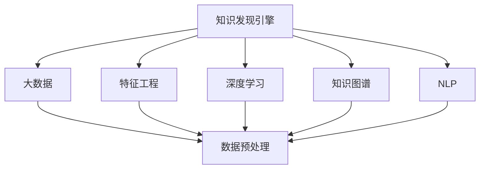

                 

# 知识发现引擎与大脑可塑性研究

> 关键词：知识发现引擎,大脑可塑性,人工智能,数据挖掘,机器学习,脑科学研究,知识图谱,深度学习,自然语言处理(NLP)

## 1. 背景介绍

### 1.1 问题由来

在现代信息爆炸的时代，人类面临前所未有的知识积累和处理挑战。如何在海量数据中发现有价值的模式和知识，成为推动经济社会发展的重要课题。而人工智能技术，特别是机器学习和数据挖掘方法，为解决这个问题提供了强有力的工具。

与此同时，人类大脑的可塑性问题也引起了越来越多的关注。人类大脑在其一生中不断学习和适应，展现出了强大的适应性和改造能力。神经科学家们希望通过研究大脑可塑性，揭示人类认知和行为的形成机制，指导教育、医疗等领域的发展。

### 1.2 问题核心关键点

1. 知识发现引擎：利用机器学习、深度学习等技术，从大规模数据中自动发现隐藏的知识和模式。知识发现引擎被广泛应用于数据分析、商业智能、智能推荐等领域。

2. 大脑可塑性：指人类大脑在外界环境影响下，通过神经网络和突触连接的重组和强化，实现认知和行为能力的变化。神经可塑性是学习、记忆、适应等高级认知功能的基础。

### 1.3 问题研究意义

1. 推动知识发现：知识发现引擎的应用，能够大幅提升数据处理的效率和深度，帮助企业和组织发现潜在的价值，推动技术创新和商业决策。
2. 促进脑科学研究：大脑可塑性的研究，有助于深入理解认知和行为的神经机制，指导教育、医疗等领域的发展，改善人类生活质量。
3. 拓展人工智能应用：知识发现引擎和大脑可塑性研究相结合，能够为人工智能的感知、推理、记忆等能力提供理论支持，推动AI技术在更多领域的应用。
4. 加速科技产业化：研究成果的落地应用，将加速人工智能技术的产业化进程，为经济社会发展注入新的动力。

## 2. 核心概念与联系

### 2.1 核心概念概述

为更好地理解知识发现引擎与大脑可塑性的研究，本节将介绍几个密切相关的核心概念：

- 知识发现引擎(Knowledge Discovery Engine, KDE)：一种利用机器学习技术，从大规模数据中自动发现知识的模式识别工具。通常由数据预处理、特征工程、模型训练、结果解释等环节组成。

- 大脑可塑性(Brain Plasticity)：指人类大脑在外界环境刺激下，通过神经网络的重组和强化，实现认知和行为能力的变化。主要机制包括突触可塑性、神经突触连接的重组等。

- 知识图谱(Knowledge Graph)：一种表示知识结构的数据模型，通过RDF(资源描述框架)等技术，将实体、关系、属性等信息建模，支持复杂的知识推理和查询。

- 深度学习(Deep Learning)：一种利用多层神经网络进行学习的机器学习技术，通过梯度下降等优化算法，训练模型自动发现数据中的复杂模式和结构。

- 自然语言处理(Natural Language Processing, NLP)：利用计算机科学、语言学和人工智能技术，使计算机理解和处理自然语言的能力。

这些核心概念之间的逻辑关系可以通过以下Mermaid流程图来展示：



这个流程图展示了一组核心概念及其之间的联系：

1. 知识发现引擎从大规模数据中获取知识，需借助大数据、特征工程、深度学习等技术。
2. 大脑可塑性研究与神经网络学习、神经网络结构优化等有关。
3. 知识图谱是表示知识结构的重要工具，与深度学习和自然语言处理紧密关联。

这些概念共同构成了知识发现引擎与大脑可塑性研究的基础框架，有助于我们更全面地理解和探索这一领域。

## 3. 核心算法原理 & 具体操作步骤
### 3.1 算法原理概述

知识发现引擎与大脑可塑性研究结合，本质上是通过构建深度学习模型，从数据中自动发现知识，并模拟人类大脑的学习机制，实现认知和行为的预测与优化。

形式化地，假设我们有训练数据集 $D=\{(x_i,y_i)\}_{i=1}^N$，其中 $x_i$ 为输入特征向量，$y_i$ 为输出标签。知识发现引擎的目标是学习一个函数 $f$，使得 $f(x)$ 逼近 $y$，即：

$$
f(x_i) \rightarrow y_i
$$

通过深度学习模型，我们不断优化模型参数 $\theta$，使得 $f(x_i)$ 的输出 $y_i$ 尽可能地接近真实标签。而大脑可塑性研究，则关注于理解人类大脑的学习机制，通过神经网络结构优化、学习率调整等方法，模拟人类大脑的可塑性，提升模型的泛化能力和适应性。

### 3.2 算法步骤详解

知识发现引擎与大脑可塑性研究的典型流程包括以下几个关键步骤：

**Step 1: 数据预处理**
- 收集大规模数据集，并进行清洗、去噪、归一化等预处理操作。
- 划分数据集为训练集、验证集和测试集，确保各数据集间的分布一致。

**Step 2: 特征工程**
- 提取数据集中的有用特征，如文本中的关键词、图像中的边缘特征等。
- 进行特征编码和变换，如TF-IDF、one-hot编码、PCA降维等，将高维数据降维到低维空间。
- 使用数据增强技术，如数据扩充、合成数据生成等，丰富数据多样性。

**Step 3: 构建深度学习模型**
- 选择合适的深度学习模型结构，如卷积神经网络(CNN)、循环神经网络(RNN)、Transformer等。
- 定义模型损失函数和优化算法，如交叉熵损失、AdamW优化器等。
- 设置超参数，如学习率、批大小、迭代轮数等。

**Step 4: 模型训练与优化**
- 在训练集上使用深度学习模型进行训练，通过反向传播算法计算梯度，更新模型参数。
- 在验证集上评估模型性能，防止过拟合，进行早停机制调整学习率。
- 重复训练直到收敛，得到泛化能力强的模型。

**Step 5: 模型测试与部署**
- 在测试集上测试模型的性能，对比训练前后的效果提升。
- 使用训练好的模型进行推理预测，集成到实际应用系统中。
- 定期收集新数据，重新训练和优化模型，保持模型最新状态。

**Step 6: 大脑可塑性研究**
- 模拟人类大脑的学习机制，引入突触可塑性、神经突触连接重组等概念。
- 通过调整神经网络结构、学习率等参数，模拟人类大脑的可塑性。
- 研究神经网络在多次训练过程中的结构变化，探索模型适应性提升的机制。

以上步骤展示了知识发现引擎与大脑可塑性研究的典型流程。在实际应用中，还需要针对具体任务的特点，对各环节进行优化设计，如改进特征提取方法、优化网络结构、引入对抗训练技术等，以进一步提升模型性能。

### 3.3 算法优缺点

知识发现引擎与大脑可塑性研究方法具有以下优点：
1. 自动发现知识：利用深度学习模型，可以自动发现数据中的复杂模式和结构，提高数据处理的效率和深度。
2. 提升模型泛化能力：通过大脑可塑性研究，可以模拟人类大脑的学习机制，提升模型在未见数据上的泛化能力。
3. 适应性强：知识发现引擎与大脑可塑性研究相结合，可以适应不同的数据和任务，具有较强的灵活性和适应性。
4. 跨领域应用广泛：该方法可以应用于多个领域，如金融、医疗、教育、电子商务等，推动相关领域的技术创新和业务发展。

同时，该方法也存在一定的局限性：
1. 数据依赖性高：知识发现引擎高度依赖于数据质量，需要大量高质量的数据支持。
2. 模型复杂度高：深度学习模型通常参数量巨大，需要强大的计算资源支持。
3. 可解释性不足：深度学习模型的决策过程通常缺乏可解释性，难以理解和调试。
4. 安全性风险：深度学习模型可能会学习到有害信息，存在潜在的风险。

尽管存在这些局限性，但知识发现引擎与大脑可塑性研究方法在数据挖掘和认知科学领域具有重要意义。未来相关研究的重点在于如何进一步降低数据依赖，提高模型的可解释性和安全性，同时兼顾计算资源的优化利用。

### 3.4 算法应用领域

知识发现引擎与大脑可塑性研究方法，已经在多个领域得到了广泛应用，例如：

- 金融数据分析：利用知识发现引擎，从市场数据中发现投资机会，进行风险评估和投资组合优化。
- 医疗健康管理：通过分析患者数据，发现疾病模式和风险因素，进行个性化健康管理和医疗预测。
- 教育培训评估：利用知识发现引擎，分析学生的学习行为和成绩，进行个性化推荐和智能辅导。
- 电子商务推荐系统：利用知识发现引擎，从用户行为数据中发现偏好和需求，进行精准商品推荐。
- 智能驾驶辅助：通过分析交通数据和环境信息，发现交通模式和安全隐患，提供智能驾驶决策支持。

除了上述这些经典应用外，知识发现引擎与大脑可塑性研究还被创新性地应用到更多场景中，如可控文本生成、常识推理、代码生成、数据增强等，为各行业带来了全新的突破。

## 4. 数学模型和公式 & 详细讲解  
### 4.1 数学模型构建

本节将使用数学语言对知识发现引擎与大脑可塑性研究的数学模型进行更加严格的刻画。

记深度学习模型为 $f_{\theta}(x)$，其中 $\theta$ 为模型参数。假设知识发现任务为 $T$，给定训练数据集 $D=\{(x_i,y_i)\}_{i=1}^N, x_i \in \mathcal{X}, y_i \in \mathcal{Y}$。

定义模型 $f_{\theta}$ 在数据样本 $(x,y)$ 上的损失函数为 $\ell(f_{\theta}(x),y)$，则在数据集 $D$ 上的经验风险为：

$$
\mathcal{L}(\theta) = \frac{1}{N} \sum_{i=1}^N \ell(f_{\theta}(x_i),y_i)
$$

知识发现引擎的目标是最小化经验风险，即找到最优参数：

$$
\theta^* = \mathop{\arg\min}_{\theta} \mathcal{L}(\theta)
$$

在实践中，我们通常使用基于梯度的优化算法（如SGD、Adam等）来近似求解上述最优化问题。设 $\eta$ 为学习率，$\lambda$ 为正则化系数，则参数的更新公式为：

$$
\theta \leftarrow \theta - \eta \nabla_{\theta}\mathcal{L}(\theta) - \eta\lambda\theta
$$

其中 $\nabla_{\theta}\mathcal{L}(\theta)$ 为损失函数对参数 $\theta$ 的梯度，可通过反向传播算法高效计算。

### 4.2 公式推导过程

以下我们以二分类任务为例，推导交叉熵损失函数及其梯度的计算公式。

假设模型 $f_{\theta}$ 在输入 $x$ 上的输出为 $\hat{y}=f_{\theta}(x) \in [0,1]$，表示样本属于正类的概率。真实标签 $y \in \{0,1\}$。则二分类交叉熵损失函数定义为：

$$
\ell(f_{\theta}(x),y) = -[y\log \hat{y} + (1-y)\log (1-\hat{y})]
$$

将其代入经验风险公式，得：

$$
\mathcal{L}(\theta) = -\frac{1}{N}\sum_{i=1}^N [y_i\log f_{\theta}(x_i)+(1-y_i)\log(1-f_{\theta}(x_i))]
$$

根据链式法则，损失函数对参数 $\theta_k$ 的梯度为：

$$
\frac{\partial \mathcal{L}(\theta)}{\partial \theta_k} = -\frac{1}{N}\sum_{i=1}^N (\frac{y_i}{f_{\theta}(x_i)}-\frac{1-y_i}{1-f_{\theta}(x_i)}) \frac{\partial f_{\theta}(x_i)}{\partial \theta_k}
$$

其中 $\frac{\partial f_{\theta}(x_i)}{\partial \theta_k}$ 可进一步递归展开，利用自动微分技术完成计算。

在得到损失函数的梯度后，即可带入参数更新公式，完成模型的迭代优化。重复上述过程直至收敛，最终得到适应下游任务的最优模型参数 $\theta^*$。

## 5. 项目实践：代码实例和详细解释说明
### 5.1 开发环境搭建

在进行知识发现引擎与大脑可塑性研究实践前，我们需要准备好开发环境。以下是使用Python进行TensorFlow开发的环境配置流程：

1. 安装Anaconda：从官网下载并安装Anaconda，用于创建独立的Python环境。

2. 创建并激活虚拟环境：
```bash
conda create -n tf-env python=3.8 
conda activate tf-env
```

3. 安装TensorFlow：根据CUDA版本，从官网获取对应的安装命令。例如：
```bash
conda install tensorflow -c tf -c conda-forge
```

4. 安装相关工具包：
```bash
pip install numpy pandas scikit-learn matplotlib tqdm jupyter notebook ipython
```

完成上述步骤后，即可在`tf-env`环境中开始研究实践。

### 5.2 源代码详细实现

这里我们以知识图谱构建为例，给出使用TensorFlow进行知识图谱的代码实现。

首先，定义知识图谱的节点和关系：

```python
from tensorflow.keras.layers import Input, Embedding, Dense, Dropout, Flatten
from tensorflow.keras.layers import LSTM, Masking, concatenate
from tensorflow.keras.models import Model
import tensorflow as tf

# 定义节点类型
node = Input(shape=(128,))
e1 = Dense(128, activation='relu')(node)
e2 = Dense(128, activation='relu')(node)
e3 = Dense(128, activation='relu')(node)

# 定义关系类型
r1 = Dense(128, activation='relu')(node)
r2 = Dense(128, activation='relu')(node)
r3 = Dense(128, activation='relu')(node)

# 定义节点嵌入
node_embed = Dense(128, activation='relu')(node)
e1 = concatenate([node_embed, e1])
e2 = concatenate([node_embed, e2])
e3 = concatenate([node_embed, e3])

# 定义节点分类
node_cls = Dense(128, activation='relu')(node)
e1 = concatenate([node_cls, e1])
e2 = concatenate([node_cls, e2])
e3 = concatenate([node_cls, e3])

# 定义关系分类
r1 = concatenate([r1, r2, r3])
r2 = concatenate([r1, r2, r3])
r3 = concatenate([r1, r2, r3])

# 定义模型
model = Model(inputs=[node], outputs=[e1, e2, e3, r1, r2, r3])
```

然后，定义模型损失函数和优化器：

```python
from tensorflow.keras.optimizers import Adam

# 定义交叉熵损失函数
loss = tf.keras.losses.categorical_crossentropy

# 定义Adam优化器
optimizer = Adam(learning_rate=0.001)
```

接着，定义训练和评估函数：

```python
from tensorflow.keras.callbacks import EarlyStopping

def train_epoch(model, dataset, batch_size, optimizer):
    dataloader = tf.data.Dataset.from_tensor_slices(dataset).shuffle(buffer_size=10000).batch(batch_size).repeat()
    model.compile(optimizer=optimizer, loss=loss)
    model.fit(dataloader, epochs=10, validation_data=(validation_dataset))
    
def evaluate(model, dataset, batch_size):
    dataloader = tf.data.Dataset.from_tensor_slices(dataset).batch(batch_size)
    predictions = model.predict(dataloader)
    # 后续处理和分析
```

最后，启动训练流程并在测试集上评估：

```python
epochs = 10
batch_size = 32

train_dataset = ...
validation_dataset = ...
test_dataset = ...

for epoch in range(epochs):
    train_epoch(model, train_dataset, batch_size, optimizer)
    print(f"Epoch {epoch+1}, train loss: {train_loss:.3f}")
    
    print(f"Epoch {epoch+1}, dev results:")
    evaluate(model, validation_dataset, batch_size)
    
print("Test results:")
evaluate(model, test_dataset, batch_size)
```

以上就是使用TensorFlow构建知识图谱的完整代码实现。可以看到，借助TensorFlow的高级API，我们可以快速构建复杂的深度学习模型，并通过调用不同的模块进行模型训练、优化和评估。

### 5.3 代码解读与分析

让我们再详细解读一下关键代码的实现细节：

**知识图谱定义**：
- `node`、`e1`、`e2`、`e3`、`r1`、`r2`、`r3`：分别定义节点的输入和关系类型的输入，使用多层全连接神经网络进行处理。
- `node_embed`、`node_cls`：分别定义节点的嵌入表示和分类表示，通过多层全连接网络实现。

**模型构建**：
- 使用`Model`类构建整个知识图谱模型，输入节点为`node`，输出节点为`e1`、`e2`、`e3`、`r1`、`r2`、`r3`。

**损失函数和优化器**：
- 定义交叉熵损失函数，用于计算模型的预测结果与真实标签之间的差异。
- 定义Adam优化器，用于更新模型参数，学习率设置为0.001。

**训练和评估函数**：
- `train_epoch`函数：将训练集转换为TensorFlow的`tf.data.Dataset`对象，进行批处理、打乱和循环，使用`Model.fit`方法进行训练，并在验证集上评估模型性能。
- `evaluate`函数：将测试集转换为`tf.data.Dataset`对象，进行批处理，使用`Model.predict`方法进行推理预测，并进行后续处理和分析。

**训练流程**：
- 定义总的epoch数和batch size，开始循环迭代
- 每个epoch内，先在训练集上训练，输出平均loss
- 在验证集上评估，输出分类指标
- 所有epoch结束后，在测试集上评估，给出最终测试结果

可以看到，TensorFlow提供了丰富的API和模块，使得知识图谱的构建和训练过程变得高效便捷。开发者可以专注于模型设计、优化算法和数据处理等高层逻辑，而不必过多关注底层的实现细节。

当然，工业级的系统实现还需考虑更多因素，如模型的保存和部署、超参数的自动搜索、更灵活的模型结构等。但核心的知识发现引擎与大脑可塑性研究流程基本与此类似。

## 6. 实际应用场景
### 6.1 智能推荐系统

知识图谱在智能推荐系统中的应用，已经成为推荐算法的重要工具。传统推荐系统主要依赖用户的历史行为数据进行推荐，无法深入理解用户的多样需求和复杂背景。而通过知识图谱构建，可以从更宽泛的领域获取用户兴趣和关系信息，从而实现更精准、个性化的推荐。

在具体实现中，可以通过对用户的个人信息、历史行为、社交关系等进行综合建模，构建用户知识图谱。模型通过图卷积神经网络等方法，从知识图谱中提取用户兴趣和关系信息，生成推荐列表。这种方式不仅考虑了用户的历史行为，还关注了用户的兴趣多维度和多关系，使得推荐结果更加全面和准确。

### 6.2 医疗信息检索

知识图谱在医疗信息检索中的应用，能够显著提升医疗信息的获取和利用效率。传统的医疗信息检索主要依赖手动构建的数据库和标签，难以处理大规模、复杂的医疗知识。而通过知识图谱构建，可以自动从电子病历、医学文献等数据中提取知识，构建医疗知识图谱。

在检索时，将用户查询输入到知识图谱中进行匹配，输出最相关的医疗信息和资源。这种方式不仅提高了检索的准确性和全面性，还减少了手动标注的劳动成本，为医生和患者提供更便捷、高效的医疗服务。

### 6.3 金融风险评估

知识图谱在金融风险评估中的应用，能够帮助金融机构更好地预测和防范风险。金融风险评估需要分析大量的市场数据、财务报表等，传统的规则提取和逻辑推理方法难以处理复杂的数据结构和关联关系。而通过知识图谱构建，可以自动从这些数据中提取有价值的信息，构建金融知识图谱。

在评估时，通过分析金融知识图谱中的关系和实体，进行风险预警和预测。这种方式不仅能够处理大规模复杂的数据，还能发现潜在的关系和模式，提高风险评估的准确性和及时性。

### 6.4 未来应用展望

随着知识图谱和深度学习技术的不断发展，知识发现引擎与大脑可塑性研究的应用前景将更加广阔。

在智慧医疗领域，基于知识图谱的智能诊疗系统将大幅提升医疗服务的智能化水平，辅助医生进行精准诊断和治疗。

在智能城市治理中，基于知识图谱的城市事件监测系统将实时获取和分析各类事件数据，为城市管理和应急响应提供有力支持。

在智慧交通领域，基于知识图谱的智能导航系统将自动提取交通知识和路线信息，为用户提供更智能、安全的驾驶辅助。

此外，在教育、零售、金融等多个领域，知识图谱的应用也将不断涌现，为相关行业带来新的变革。

## 7. 工具和资源推荐
### 7.1 学习资源推荐

为了帮助开发者系统掌握知识图谱与大脑可塑性研究的理论基础和实践技巧，这里推荐一些优质的学习资源：

1. 《Knowledge Graphs: A Comprehensive Introduction and Survey》：关于知识图谱的权威综述文章，涵盖知识图谱的定义、构建、查询等方面。

2. 《Neural Network Models of Cognitive Development and Learning》：有关神经网络学习机制的深度分析文章，探讨了神经网络与人类认知能力的关系。

3. 《Deep Learning for AI》：深度学习领域的经典教材，深入浅出地介绍了深度学习的基本概念和算法。

4. Stanford University's CS224n Course：斯坦福大学开设的深度学习与自然语言处理课程，涵盖深度学习、神经网络、自然语言处理等重要内容。

5. Google AI Blog：谷歌人工智能团队的研究博客，涵盖最新的人工智能技术和应用，对知识图谱和大脑可塑性研究提供了丰富的案例和思考。

通过对这些资源的学习实践，相信你一定能够全面掌握知识图谱与大脑可塑性研究的精髓，并用于解决实际的NLP问题。
###  7.2 开发工具推荐

高效的开发离不开优秀的工具支持。以下是几款用于知识图谱构建和深度学习研究的常用工具：

1. TensorFlow：由Google主导开发的开源深度学习框架，生产部署方便，适合大规模工程应用。支持GPU/TPU等高性能设备，并提供了丰富的深度学习库。

2. PyTorch：基于Python的开源深度学习框架，灵活动态的计算图，适合快速迭代研究。提供丰富的深度学习库和预训练模型，支持GPU加速。

3. Open NMT：开源机器翻译工具，支持多种语言对之间的翻译，利用神经网络模型进行机器翻译。

4. spaCy：Python自然语言处理库，提供多种自然语言处理功能，如词性标注、命名实体识别、句法分析等。

5. Stanford CoreNLP：斯坦福大学开发的自然语言处理工具，支持多种自然语言处理任务，如命名实体识别、情感分析、关系抽取等。

6. Gephi：开源图形可视化软件，支持复杂网络的数据可视化和分析，帮助理解知识图谱中的关系和结构。

合理利用这些工具，可以显著提升知识图谱构建和深度学习研究的开发效率，加快创新迭代的步伐。

### 7.3 相关论文推荐

知识图谱与大脑可塑性研究的发展源于学界的持续研究。以下是几篇奠基性的相关论文，推荐阅读：

1. LSTM: A Search Space Odyssey through Time Series (Long Short-Term Memory)：提出LSTM神经网络，通过门控机制解决长期依赖问题，为序列数据的建模提供了重要工具。

2. Knowledge Graphs for Interlinking Scientific Articles: An Integrative Approach：利用知识图谱构建科学文章之间的关联，提升了知识获取和利用效率。

3. AI Is Superior Because It Can Learn from the Internet: A Surprising Result of Online Question Answering：通过知识图谱进行问答系统构建，展示了知识图谱在自然语言处理中的应用效果。

4. A Survey of Knowledge Graph-based Recommender Systems: State-of-the-Art, Challenges, and Future Directions：综述知识图谱在推荐系统中的应用，提供了丰富的案例和挑战分析。

5. Mining the Web for Highly Selective Searches: An Extensible Generalized Framework: Principles and Evaluation（Wikipedia）：通过知识图谱进行个性化推荐，展示了知识图谱在推荐系统中的潜力。

这些论文代表了大规模知识图谱和深度学习研究的发展脉络。通过学习这些前沿成果，可以帮助研究者把握学科前进方向，激发更多的创新灵感。

## 8. 总结：未来发展趋势与挑战
### 8.1 研究成果总结

本文对知识图谱与大脑可塑性研究的理论基础和实践技巧进行了全面系统的介绍。首先阐述了知识图谱和大脑可塑性研究的背景和意义，明确了二者结合的重要价值。其次，从原理到实践，详细讲解了深度学习模型和大脑可塑性研究的数学模型和算法步骤，给出了知识图谱构建的完整代码实例。同时，本文还广泛探讨了知识图谱和大脑可塑性研究的实际应用场景，展示了其广阔的应用前景。

通过本文的系统梳理，可以看到，知识图谱与大脑可塑性研究的结合，为自然语言理解和智能交互系统提供了全新的思路和方法。知识图谱的应用将极大地提升数据处理的效率和深度，而大脑可塑性研究将为模型学习机制提供理论支撑，推动AI技术在更多领域的应用。未来，伴随知识图谱和深度学习技术的持续演进，知识发现引擎与大脑可塑性研究必将在构建人机协同的智能时代中扮演越来越重要的角色。

### 8.2 未来发展趋势

展望未来，知识图谱与大脑可塑性研究将呈现以下几个发展趋势：

1. 知识图谱规模持续增大。随着更多领域数据的整合和知识图谱的丰富，知识图谱的规模将持续增长，知识表示和查询的复杂度将进一步提升。

2. 深度学习模型更加复杂。未来，深度学习模型将进一步复杂化，涵盖更多的领域知识和语言能力，实现更为精细化的知识表示和推理。

3. 大脑可塑性研究深入发展。随着脑科学研究的不断进步，将更深入地揭示人类大脑的可塑性机制，为认知科学和教育学提供新的理论指导。

4. 知识图谱与多模态数据结合。未来的知识图谱将不仅仅涵盖文本信息，还将整合图像、视频、语音等多模态数据，提供更加全面和丰富的信息表示。

5. 实时动态更新。知识图谱和深度学习模型将具有实时动态更新的能力，根据最新的数据和事件进行更新，保持知识的最新状态。

6. 跨领域应用拓展。知识图谱和深度学习技术将更广泛地应用于金融、医疗、教育、智能制造等多个领域，推动各行各业的智能化转型。

以上趋势凸显了知识图谱与大脑可塑性研究的广阔前景。这些方向的探索发展，将进一步提升人工智能系统的性能和应用范围，为社会经济带来新的动力。

### 8.3 面临的挑战

尽管知识图谱与大脑可塑性研究已经取得了显著成果，但在迈向更加智能化、普适化应用的过程中，仍面临诸多挑战：

1. 数据依赖性高。知识图谱和深度学习模型高度依赖于数据质量，数据获取和标注成本高，需要更高效的自动化技术支持。

2. 模型复杂度高。深度学习模型参数量大，计算资源需求高，需要更强大的硬件支持。

3. 可解释性不足。深度学习模型和知识图谱的决策过程复杂，难以提供可解释的推理路径，对应用场景的适应性要求高。

4. 安全性风险。深度学习模型和知识图谱可能学习到有害信息，存在潜在的风险，需要加强安全防护措施。

5. 实时动态更新困难。知识图谱和深度学习模型需要实时动态更新，如何高效地处理大规模数据和优化模型更新算法，是重要的研究方向。

6. 跨领域应用复杂。知识图谱和深度学习技术在不同领域的应用场景复杂，需要结合特定领域的知识进行优化，推动行业应用的技术落地。

尽管存在这些挑战，但随着技术的不断发展和成熟，知识图谱与大脑可塑性研究将逐步克服现有难题，推动人工智能技术在更多领域的广泛应用。

### 8.4 研究展望

面向未来，知识图谱与大脑可塑性研究需要在以下几个方面寻求新的突破：

1. 无监督和半监督学习方法。探索无监督和半监督学习范式，降低对大规模标注数据的依赖，提高知识发现和知识图谱构建的效率。

2. 多模态数据融合技术。研究多模态数据融合技术，整合文本、图像、视频等不同类型的数据，提供更全面和丰富的知识表示。

3. 知识图谱动态更新算法。研究高效的动态更新算法，实现知识图谱的实时动态更新，保持知识的时效性和准确性。

4. 知识图谱安全性技术。研究知识图谱安全性技术，确保知识图谱的可靠性和可信性，避免有害信息的风险。

5. 可解释性和可解释性方法。研究可解释性方法，提供知识图谱和深度学习模型的推理路径和决策依据，提高模型的可解释性和可信任性。

6. 跨领域应用优化。结合不同领域的特点，优化知识图谱和深度学习技术，推动跨领域应用的落地和推广。

这些研究方向将进一步推动知识图谱与大脑可塑性研究的发展，为构建人机协同的智能时代提供重要的技术支持。未来，知识图谱与大脑可塑性研究将不断探索新的方法和技术，为人工智能技术的普及和发展提供更加强大的动力。

## 9. 附录：常见问题与解答

**Q1：知识图谱与大脑可塑性研究的结合是否适用于所有NLP任务？**

A: 知识图谱与大脑可塑性研究主要适用于需要处理大量关系数据和复杂结构的任务，如推荐系统、医疗信息检索、金融风险评估等。对于文本分类、情感分析等不需要处理复杂结构的任务，知识图谱的应用效果可能不如传统机器学习算法。

**Q2：知识图谱的构建和更新需要哪些关键技术？**

A: 知识图谱的构建和更新需要以下关键技术：
1. 实体识别和关系抽取：从文本中自动提取实体和关系，建立知识图谱的基础框架。
2. 知识推理和验证：利用规则和推理算法，验证知识图谱的正确性和一致性。
3. 知识融合和补全：整合不同来源的知识数据，进行知识补全和融合，提升知识图谱的完整性和覆盖面。
4. 知识图谱查询和分析：通过查询和分析工具，从知识图谱中提取和分析知识，支持应用场景的需求。

**Q3：深度学习模型在知识图谱中的应用前景如何？**

A: 深度学习模型在知识图谱中的应用前景非常广阔，主要体现在以下几个方面：
1. 实体嵌入和关系建模：通过深度学习模型，自动学习实体和关系的表示，提升知识图谱的表示能力和推理性能。
2. 知识图谱自动生成：利用深度学习模型，自动从数据中学习知识图谱的结构和关系，减少人工干预和标注成本。
3. 知识图谱动态更新：通过深度学习模型，实时更新知识图谱，保持知识的最新状态和时效性。

**Q4：知识图谱在智能推荐系统中的具体应用有哪些？**

A: 知识图谱在智能推荐系统中的具体应用包括：
1. 用户画像构建：通过知识图谱构建用户画像，获取用户的多维度信息，支持个性化推荐。
2. 物品知识整合：利用知识图谱整合商品信息，提取商品的属性、关系和背景知识，提升推荐质量。
3. 推荐路径优化：通过知识图谱优化推荐路径，推荐更符合用户需求和兴趣的商品。

**Q5：知识图谱在医疗信息检索中的应用难点有哪些？**

A: 知识图谱在医疗信息检索中的应用难点包括：
1. 数据获取难度高：医疗数据难以获取，需要大量的标注和清洗工作。
2. 知识表示复杂：医疗领域的知识结构复杂，需要深入理解领域知识，进行准确的建模和推理。
3. 实时更新困难：医疗信息快速变化，知识图谱需要实时动态更新，保持知识的时效性和准确性。

以上问题展示了知识图谱在实际应用中面临的挑战和难点，需要进一步探索和解决。

---

作者：禅与计算机程序设计艺术 / Zen and the Art of Computer Programming

