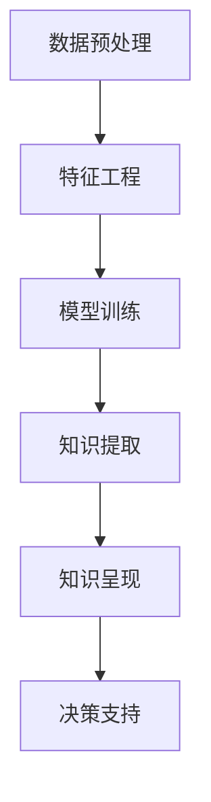

                 

## 1. 背景介绍

随着人工智能技术的迅猛发展，知识发现引擎（Knowledge Discovery Engine, KDE）在各行各业中的应用日益广泛。从零售、金融到医疗、教育，KDE在数据驱动决策、优化流程、提升服务质量等方面发挥着重要作用。同时，KDE也深刻影响着未来的工作技能演变，引导人们更注重数据分析、算法设计、知识应用等方面的能力提升。本文将详细探讨KDE的核心概念、原理与操作步骤，并展望其在未来工作技能演变中的角色。

## 2. 核心概念与联系

### 2.1 核心概念概述

KDE是一种利用数据挖掘、机器学习等技术，从大量数据中提取、分析、总结出有价值信息的系统。其主要功能包括数据预处理、特征工程、模型训练、知识提取与呈现等。与传统的决策支持系统（DSS）相比，KDE更加注重数据驱动，能够实时、自动地从动态数据流中提取有用的知识，为决策者提供更精准、全面的信息支持。

### 2.2 核心概念原理和架构的 Mermaid 流程图



这个流程图展示了KDE的核心流程。首先对原始数据进行预处理，然后进行特征工程，构建可用于训练的特征表示。接着，在训练好的模型上进行知识提取，最终将提取出的知识通过可视化等形式呈现给决策者，辅助决策支持。

### 2.3 核心概念之间的联系

KDE的各个环节互相依赖、互相影响。数据预处理和特征工程为模型训练提供了高质量的数据输入，模型训练的效果直接影响知识提取的精度，而知识提取又为决策支持提供了实证依据。整个流程形成一个闭环，不断迭代优化，逐步提升KDE的性能。

## 3. 核心算法原理 & 具体操作步骤

### 3.1 算法原理概述

KDE的核心算法原理主要包括数据挖掘、机器学习和可视化三个方面。其中，数据挖掘用于从原始数据中发现模式和关联；机器学习用于构建预测模型，提供决策建议；可视化用于将提取出的知识直观呈现给决策者。

数据挖掘和机器学习技术的结合，使得KDE具备以下几个特点：

- **自动发现知识**：KDE能够自动从数据中发现隐藏的模式和关联，无需人工干预。
- **实时处理**：KDE可以实时处理动态数据流，为决策提供即时的支持。
- **自适应性**：KDE能够根据数据变化自动调整模型参数，提升预测精度。

### 3.2 算法步骤详解

KDE的主要操作步骤如下：

#### 步骤1：数据预处理

数据预处理是KDE的第一步，主要包括以下几个步骤：

1. **数据清洗**：去除缺失值、异常值等不符合要求的数据点。
2. **数据归一化**：将数据缩放到[0,1]或[-1,1]等标准化区间，便于模型训练。
3. **特征选择**：从原始数据中筛选出最具代表性的特征，减少模型复杂度。

#### 步骤2：特征工程

特征工程是KDE的核心环节，主要包括以下几个步骤：

1. **特征提取**：从原始数据中提取特征，如文本数据的TF-IDF、词向量表示等。
2. **特征转换**：将提取出的特征进行变换，如降维、PCA等，减少数据维度。
3. **特征构造**：结合领域知识，构造新的特征，如时间序列的滑动窗口等。

#### 步骤3：模型训练

模型训练是KDE的关键步骤，主要包括以下几个步骤：

1. **选择模型**：根据数据特点选择合适的机器学习模型，如决策树、随机森林、神经网络等。
2. **训练模型**：在训练集上训练模型，调整模型参数。
3. **模型评估**：在验证集上评估模型性能，选择最优模型。

#### 步骤4：知识提取

知识提取是KDE的输出环节，主要包括以下几个步骤：

1. **模型预测**：在测试集上使用最优模型进行预测。
2. **知识表示**：将预测结果转化为可视化的知识表示，如图表、报告等。

#### 步骤5：知识呈现

知识呈现是KDE的最终环节，主要包括以下几个步骤：

1. **可视化展示**：将知识表示通过图表、仪表盘等形式展示给决策者。
2. **报告生成**：将关键发现和建议生成详细报告，辅助决策。
3. **交互式查询**：提供交互式查询接口，供决策者深入探索数据。

### 3.3 算法优缺点

KDE具有以下优点：

1. **高效性**：KDE能够自动化处理大量数据，显著提高数据分析效率。
2. **自适应性**：KDE能够根据数据变化自动调整模型参数，提升预测精度。
3. **实时性**：KDE能够实时处理动态数据流，为决策提供即时的支持。

但KDE也存在一些缺点：

1. **数据质量依赖**：KDE的效果高度依赖于数据质量和特征工程，数据质量差或特征工程不当可能导致模型效果不佳。
2. **模型复杂性**：KDE通常涉及复杂的模型和算法，模型的解释性和可理解性较难把握。
3. **资源消耗**：KDE需要处理大量数据，计算资源和存储空间消耗较大。

### 3.4 算法应用领域

KDE广泛应用于以下领域：

1. **零售行业**：通过分析顾客购买行为、商品销售数据，优化库存管理和销售策略。
2. **金融行业**：通过分析市场趋势、交易数据，优化投资组合、风险控制。
3. **医疗行业**：通过分析患者病历、实验室数据，优化诊疗方案、预测疾病发展。
4. **教育行业**：通过分析学生学习数据、教师教学数据，优化教学资源配置、提升教学效果。
5. **公共安全**：通过分析犯罪数据、社会事件，优化警务部署、预防犯罪。

## 4. 数学模型和公式 & 详细讲解 & 举例说明

### 4.1 数学模型构建

KDE的数学模型构建主要包括以下几个部分：

- **数据预处理**：对原始数据进行清洗、归一化等处理。
- **特征工程**：构建特征向量，如TF-IDF、词向量等。
- **模型训练**：使用机器学习算法训练模型，如决策树、随机森林、神经网络等。
- **知识提取**：使用模型预测，提取知识表示。
- **知识呈现**：将知识表示可视化，生成报告。

### 4.2 公式推导过程

以决策树模型为例，推导其基本公式：

$$
T=\sum_{i=1}^{N}\sum_{j=1}^{K}W_i\pi_j\log\frac{\pi_j}{\sum_{k=1}^{K}\pi_k}
$$

其中，$T$ 为信息熵，$W_i$ 为样本权重，$\pi_j$ 为特征$j$在样本$i$中出现的概率，$K$ 为特征总数。

### 4.3 案例分析与讲解

以零售行业为例，分析KDE的应用：

- **数据预处理**：清洗原始销售数据，去除缺失值和异常值。
- **特征工程**：提取商品类别、价格、促销活动等特征。
- **模型训练**：使用决策树模型训练预测顾客购买行为。
- **知识提取**：根据模型预测结果，提取顾客偏好、销售趋势等信息。
- **知识呈现**：通过可视化仪表盘展示预测结果，供管理层决策参考。

## 5. 项目实践：代码实例和详细解释说明

### 5.1 开发环境搭建

KDE开发环境搭建主要包括以下几个步骤：

1. **安装Python**：确保系统安装了Python 3.x版本。
2. **安装相关库**：安装Pandas、NumPy、Scikit-learn、Matplotlib等库。
3. **配置环境**：配置好开发环境，如虚拟环境、IDE等。

### 5.2 源代码详细实现

以下是一个基于Pandas和Scikit-learn库的KDE实现代码：

```python
import pandas as pd
from sklearn.ensemble import DecisionTreeClassifier
from sklearn.model_selection import train_test_split
from sklearn.metrics import accuracy_score

# 数据预处理
df = pd.read_csv('data.csv')
df = df.dropna()
df = df.drop_duplicates()

# 特征工程
X = df.drop('target', axis=1)
y = df['target']
X_train, X_test, y_train, y_test = train_test_split(X, y, test_size=0.2, random_state=42)

# 模型训练
clf = DecisionTreeClassifier()
clf.fit(X_train, y_train)

# 知识提取
y_pred = clf.predict(X_test)

# 知识呈现
accuracy = accuracy_score(y_test, y_pred)
print(f'Accuracy: {accuracy:.2f}')
```

### 5.3 代码解读与分析

以上代码实现了简单的KDE流程：

- **数据预处理**：使用Pandas库读取数据，去除缺失值和重复值。
- **特征工程**：将目标变量分离出来，作为测试集。
- **模型训练**：使用决策树模型训练模型，并评估准确率。
- **知识呈现**：输出模型准确率。

## 6. 实际应用场景

### 6.1 零售行业

在零售行业，KDE可以用于：

- **顾客行为分析**：分析顾客购买记录、行为数据，发现顾客偏好、消费规律。
- **库存管理**：预测商品销售趋势，优化库存水平，减少库存积压。
- **促销策略**：分析促销活动效果，优化促销策略，提升销售额。

### 6.2 金融行业

在金融行业，KDE可以用于：

- **市场趋势预测**：分析历史交易数据，预测市场走势。
- **风险评估**：评估贷款违约风险，优化信贷审批流程。
- **投资组合优化**：分析资产回报率，优化投资组合。

### 6.3 医疗行业

在医疗行业，KDE可以用于：

- **疾病预测**：分析患者病历、实验室数据，预测疾病发展趋势。
- **诊疗方案优化**：分析治疗效果，优化诊疗方案。
- **健康管理**：分析健康数据，提供健康建议。

### 6.4 未来应用展望

未来，KDE将在以下几个方面迎来新的发展：

1. **跨领域融合**：KDE将更多应用于多领域数据的融合分析，提升跨领域决策支持能力。
2. **自动化程度提高**：自动化数据清洗、特征选择、模型训练等步骤，提高KDE的易用性和可扩展性。
3. **实时性提升**：利用流式数据处理技术，实现KDE的实时处理能力。
4. **知识图谱结合**：将知识图谱与KDE结合，提供更全面的知识表示和推理能力。

## 7. 工具和资源推荐

### 7.1 学习资源推荐

1. **Coursera《机器学习》课程**：由斯坦福大学Andrew Ng教授主讲，涵盖了机器学习基本原理和实践应用。
2. **Kaggle竞赛**：参加Kaggle数据科学竞赛，实践KDE算法。
3. **机器学习书籍**：如《Pattern Recognition and Machine Learning》、《Hands-On Machine Learning with Scikit-Learn》等。

### 7.2 开发工具推荐

1. **PyCharm**：一款强大的Python开发工具，支持代码高亮、调试、版本控制等功能。
2. **Jupyter Notebook**：一个交互式的数据分析和编程环境，支持代码执行、数据可视化。
3. **Tableau**：一款流行的数据可视化工具，支持数据连接、图表制作。

### 7.3 相关论文推荐

1. **《K-Means Clustering Algorithm》**：介绍K-Means算法的基本原理和应用。
2. **《Support Vector Machines》**：介绍支持向量机算法的基本原理和应用。
3. **《Random Forests》**：介绍随机森林算法的基本原理和应用。

## 8. 总结：未来发展趋势与挑战

### 8.1 研究成果总结

KDE作为一种强大的数据分析工具，已经在零售、金融、医疗等多个领域取得了显著成效。通过KDE，决策者能够从海量数据中提取有价值的信息，支持科学决策。

### 8.2 未来发展趋势

未来，KDE将在以下几个方面迎来新的发展：

1. **跨领域融合**：KDE将更多应用于多领域数据的融合分析，提升跨领域决策支持能力。
2. **自动化程度提高**：自动化数据清洗、特征选择、模型训练等步骤，提高KDE的易用性和可扩展性。
3. **实时性提升**：利用流式数据处理技术，实现KDE的实时处理能力。
4. **知识图谱结合**：将知识图谱与KDE结合，提供更全面的知识表示和推理能力。

### 8.3 面临的挑战

尽管KDE已经取得了显著进展，但在以下方面仍面临挑战：

1. **数据质量依赖**：KDE的效果高度依赖于数据质量和特征工程，数据质量差或特征工程不当可能导致模型效果不佳。
2. **模型复杂性**：KDE通常涉及复杂的模型和算法，模型的解释性和可理解性较难把握。
3. **资源消耗**：KDE需要处理大量数据，计算资源和存储空间消耗较大。

### 8.4 研究展望

未来，KDE需要在以下几个方面进行深入研究：

1. **数据清洗技术**：开发更加高效、鲁棒的数据清洗技术，提升数据质量。
2. **特征选择算法**：研究更加智能、高效的特征选择算法，减少特征维度。
3. **模型解释性**：提高模型的可解释性和可理解性，增强用户信任。
4. **资源优化技术**：优化计算资源和存储空间的使用，降低资源消耗。

## 9. 附录：常见问题与解答

**Q1：KDE是否适用于所有数据类型？**

A: KDE主要适用于结构化数据，如表格、时间序列等。对于非结构化数据（如图像、文本），需要结合其他技术进行处理。

**Q2：KDE的计算复杂度如何？**

A: KDE的计算复杂度取决于数据规模和特征维度。在大数据和高维特征的情况下，需要优化算法效率，采用分布式计算、并行处理等技术。

**Q3：KDE在实际应用中存在哪些挑战？**

A: KDE在实际应用中主要面临以下挑战：

1. **数据质量依赖**：KDE的效果高度依赖于数据质量和特征工程，数据质量差或特征工程不当可能导致模型效果不佳。
2. **模型复杂性**：KDE通常涉及复杂的模型和算法，模型的解释性和可理解性较难把握。
3. **资源消耗**：KDE需要处理大量数据，计算资源和存储空间消耗较大。

**Q4：KDE在跨领域应用中的难点是什么？**

A: KDE在跨领域应用中的难点在于：

1. **领域知识缺乏**：不同领域的知识背景不同，难以直接应用KDE。
2. **数据格式不同**：不同领域的数据格式和结构差异较大，难以统一处理。
3. **数据融合复杂**：多源数据融合需要考虑数据一致性和冲突解决，技术难度较大。

**Q5：KDE在实时性要求较高的场景中如何使用？**

A: 在实时性要求较高的场景中，KDE可以采用流式数据处理技术，实现实时处理。具体实现方式包括：

1. **流式数据采集**：使用流式数据采集技术，实时获取数据。
2. **流式数据预处理**：对实时数据进行预处理，去除噪声和异常值。
3. **流式模型训练**：使用流式模型训练技术，实时更新模型参数。
4. **流式知识呈现**：实时生成可视化仪表盘和报告，辅助决策。

---

作者：禅与计算机程序设计艺术 / Zen and the Art of Computer Programming

