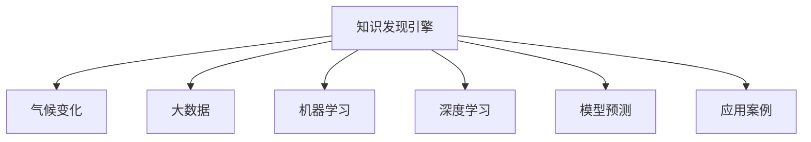

                 

# 知识发现引擎在气候变化研究中的应用

> 关键词：知识发现引擎, 气候变化, 大数据, 机器学习, 深度学习, 模型预测, 应用案例

## 1. 背景介绍

### 1.1 问题由来

气候变化是当今人类面临的最严峻挑战之一，它不仅影响着自然环境和生态系统，还对经济社会发展和人类健康构成严重威胁。为了应对这一全球性问题，国际社会和各国政府已经采取了一系列行动，包括减少温室气体排放、提高能源效率、发展可再生能源等。然而，尽管这些努力正在进行，气候变化的速度和影响仍在不断加剧，迫切需要更高效、更精确的手段来指导政策制定和资源分配。

在这一背景下，知识发现引擎作为人工智能领域的一项前沿技术，为气候变化研究提供了新的解决方案。通过分析海量数据，挖掘其中的知识模式，知识发现引擎可以帮助研究人员更好地理解气候变化的驱动因素、预测未来的气候变化趋势，并为制定应对策略提供科学依据。

### 1.2 问题核心关键点

知识发现引擎在气候变化研究中的应用主要涉及以下几个核心关键点：

- **数据融合与处理**：从多源异构的数据中提取有效信息，包括气象数据、遥感数据、社会经济数据等。
- **知识挖掘与分析**：通过机器学习和深度学习等技术，从数据中提取有价值的知识模式和预测模型。
- **模型预测与优化**：建立准确的预测模型，如基于时序的预测模型、基于地标的预测模型等，并通过模型优化提升预测精度。
- **应用实践与验证**：将知识发现引擎应用到具体的气候变化研究案例中，验证其有效性和应用潜力。

## 2. 核心概念与联系

### 2.1 核心概念概述

为更好地理解知识发现引擎在气候变化研究中的应用，本节将介绍几个密切相关的核心概念：

- **知识发现引擎(Knowledge Discovery Engine, KDE)**：通过分析数据集，识别、抽取和提炼知识模式的技术。可以应用于金融、医疗、环境等多个领域，帮助用户在复杂的数据海洋中发现规律。
- **气候变化(Climate Change)**：地球气候系统长期、系统的变化，包括气温、降水、风速等气象要素的变化，以及对生态、社会经济的影响。
- **大数据(Big Data)**：通常指规模超出传统数据库处理能力的数据集，可以包括结构化数据、非结构化数据、半结构化数据等多种类型。
- **机器学习(Machine Learning)**：通过数据驱动的方法，让机器从数据中学习规律，实现预测和决策。
- **深度学习(Deep Learning)**：机器学习的一个分支，通过构建多层神经网络，学习数据的深层特征。
- **模型预测(Model Prediction)**：通过模型对未来状态进行预测，包括气候变化趋势、温室气体排放量等。
- **应用案例(Application Cases)**：具体应用知识发现引擎解决气候变化问题的案例分析，包括模型构建、数据处理、结果验证等环节。

这些核心概念之间的逻辑关系可以通过以下Mermaid流程图来展示：



这个流程图展示出知识发现引擎与气候变化、大数据、机器学习、深度学习、模型预测和应用案例等概念之间的联系。

## 3. 核心算法原理 & 具体操作步骤

### 3.1 算法原理概述

知识发现引擎在气候变化研究中的应用，本质上是将大数据、机器学习和深度学习等技术应用于气候数据集的分析和建模过程中，以发现气候变化的规律和预测未来的变化趋势。具体而言，知识发现引擎的工作流程如下：

1. **数据收集与清洗**：从多个来源收集气候变化相关的数据，并进行预处理和清洗，确保数据的完整性和一致性。
2. **特征工程**：通过数据转换、归一化等方法，提取和构造适合模型预测的特征。
3. **模型构建与训练**：选择适合的机器学习或深度学习模型，利用历史数据进行训练和调优。
4. **模型预测与验证**：应用训练好的模型对未来气候变化进行预测，并通过验证数据集评估预测效果。
5. **知识提炼与应用**：从模型预测结果中提炼出有价值的知识，应用于气候变化研究的实际问题中。

### 3.2 算法步骤详解

知识发现引擎在气候变化研究中的应用可以分为以下几个步骤：

**Step 1: 数据收集与清洗**

从气象站、卫星遥感、海洋观测、社会经济统计等多种来源收集气候变化相关数据。数据类型可能包括时间序列数据、地理空间数据、文本数据等。对数据进行预处理，包括去重、缺失值处理、异常值检测等，确保数据的完整性和一致性。

**Step 2: 特征工程**

选择合适的特征提取方法，将原始数据转换为适合模型训练的特征。例如，可以从时间序列数据中提取季节性、趋势性等特征，从地理空间数据中提取位置、地形等特征，从文本数据中提取主题、情感等特征。特征工程是提高模型预测精度的关键步骤。

**Step 3: 模型构建与训练**

选择适合的知识发现模型，如时间序列模型、地理信息系统模型、文本挖掘模型等，利用历史数据进行训练。常用的模型包括ARIMA模型、LSTM模型、BERT模型等。在训练过程中，选择适当的损失函数、优化算法和学习率等超参数，并进行交叉验证和参数调优。

**Step 4: 模型预测与验证**

使用训练好的模型对未来气候变化进行预测，并使用验证数据集评估预测效果。常用的评估指标包括均方误差(MSE)、平均绝对误差(MAE)、相关系数(R)等。根据评估结果，调整模型参数，提高预测精度。

**Step 5: 知识提炼与应用**

从模型预测结果中提炼出有价值的知识，应用于具体的气候变化研究问题中。例如，可以根据预测结果进行碳排放量预测、气温变化趋势分析、极端天气事件的预测等。将知识提炼结果与政策制定、资源分配等实际问题结合，提供决策支持。

### 3.3 算法优缺点

知识发现引擎在气候变化研究中的应用具有以下优点：

- **高效性**：能够快速处理和分析大规模数据集，发现数据中的隐含规律。
- **准确性**：通过机器学习和深度学习等技术，模型预测结果具有较高的准确性。
- **可扩展性**：能够轻松地适应不同类型的数据和问题，具有较强的泛化能力。
- **易于集成**：可以与其他系统集成，如地理信息系统、遥感技术等，形成综合解决方案。

同时，该方法也存在一定的局限性：

- **数据依赖**：需要高质量、大规模的标注数据，数据获取和处理成本较高。
- **模型复杂度**：复杂的模型可能需要较高的计算资源和存储空间，不适用于所有环境。
- **结果解释性**：模型预测结果可能缺乏可解释性，难以理解其内部逻辑。
- **实际应用难度**：知识发现引擎的应用需要专业知识和技能，可能存在一定的学习门槛。

尽管存在这些局限性，但就目前而言，知识发现引擎在气候变化研究中的应用已经成为一种重要的研究手段，具有广泛的应用前景。

### 3.4 算法应用领域

知识发现引擎在气候变化研究中的应用领域非常广泛，主要包括以下几个方面：

- **气候变化趋势预测**：通过历史气候数据，建立时间序列模型，预测未来的气候变化趋势。
- **温室气体排放量预测**：利用遥感数据和社会经济数据，建立地理信息系统模型，预测温室气体排放量。
- **极端天气事件预测**：分析历史气象数据，使用深度学习模型，预测未来的极端天气事件，如洪涝、干旱等。
- **环境风险评估**：结合地理信息系统和遥感数据，评估环境风险，如气候变化对生态系统、农业、水资源等的影响。
- **气候变化政策分析**：利用知识发现引擎的预测结果，分析气候变化政策的效果和影响，为政策制定提供科学依据。

除了上述这些领域外，知识发现引擎还可应用于其他气候变化相关问题，如海平面上升预测、全球变暖对农业的影响等，为气候变化研究提供更全面的解决方案。

## 4. 数学模型和公式 & 详细讲解 & 举例说明

### 4.1 数学模型构建

本节将使用数学语言对知识发现引擎在气候变化研究中的应用进行更加严格的刻画。

记气候变化数据集为 $D=\{(x_i,y_i)\}_{i=1}^N$，其中 $x_i$ 为输入特征，$y_i$ 为输出标签，即未来气候变化的状态。定义模型的预测函数为 $f(x;\theta)$，其中 $\theta$ 为模型参数。

定义模型的损失函数为 $L(f(x_i);\theta,y_i)$，表示模型预测结果与真实标签之间的误差。常用的损失函数包括均方误差(MSE)、平均绝对误差(MAE)、交叉熵损失(Cross-Entropy Loss)等。

在训练过程中，通过最小化损失函数 $L(f(x);\theta)$ 来优化模型参数 $\theta$。常用的优化算法包括梯度下降算法、Adam算法等。

### 4.2 公式推导过程

以下我们以时间序列预测模型为例，推导模型训练和评估的公式。

假设模型 $f(x;\theta)$ 为线性回归模型，即 $f(x_i;\theta) = \theta_0 + \theta_1 x_{i,1} + \ldots + \theta_p x_{i,p}$，其中 $\theta_0, \ldots, \theta_p$ 为模型参数。定义均方误差损失函数为 $L(f(x);\theta) = \frac{1}{N}\sum_{i=1}^N (y_i - f(x_i;\theta))^2$。

模型的参数更新公式为：

$$
\theta \leftarrow \theta - \eta \nabla_{\theta}L(f(x);\theta)
$$

其中 $\eta$ 为学习率，$\nabla_{\theta}L(f(x);\theta)$ 为损失函数对模型参数的梯度。

在训练过程中，将历史气候数据集 $D$ 分为训练集和验证集，用训练集数据 $D_{train}$ 进行模型训练，用验证集数据 $D_{val}$ 进行模型验证。模型训练的损失函数为：

$$
L_{train}(\theta) = \frac{1}{N_{train}}\sum_{i=1}^{N_{train}} (y_{train,i} - f(x_{train,i};\theta))^2
$$

模型验证的损失函数为：

$$
L_{val}(\theta) = \frac{1}{N_{val}}\sum_{i=1}^{N_{val}} (y_{val,i} - f(x_{val,i};\theta))^2
$$

在训练过程中，不断调整模型参数 $\theta$，直到训练集和验证集上的损失函数达到最小值。

### 4.3 案例分析与讲解

以历史气温数据预测未来气温变化为例，我们利用时间序列预测模型进行分析和建模。假设历史气温数据 $D$ 为时间序列数据，其时间间隔为 $T$，共 $N$ 个样本。

首先，对数据进行预处理，包括去重、缺失值处理、异常值检测等。然后，选择合适的特征提取方法，如傅里叶变换、差分等，将原始时间序列数据转换为适合模型训练的特征。

接下来，选择合适的预测模型，如ARIMA模型、LSTM模型等。利用历史气温数据 $D$ 进行模型训练，得到最优的模型参数 $\theta^*$。最后，使用训练好的模型对未来气温进行预测，并使用验证集数据 $D_{val}$ 评估预测效果。

## 5. 项目实践：代码实例和详细解释说明

### 5.1 开发环境搭建

在进行气候变化研究的知识发现引擎应用实践前，我们需要准备好开发环境。以下是使用Python进行Keras开发的环境配置流程：

1. 安装Anaconda：从官网下载并安装Anaconda，用于创建独立的Python环境。

2. 创建并激活虚拟环境：
```bash
conda create -n climate-env python=3.8 
conda activate climate-env
```

3. 安装TensorFlow：根据CUDA版本，从官网获取对应的安装命令。例如：
```bash
conda install tensorflow -c conda-forge
```

4. 安装Keras：
```bash
pip install keras
```

5. 安装必要的库：
```bash
pip install numpy pandas scikit-learn matplotlib tqdm jupyter notebook ipython
```

完成上述步骤后，即可在`climate-env`环境中开始知识发现引擎的应用实践。

### 5.2 源代码详细实现

下面我们以历史气温数据预测未来气温变化为例，给出使用Keras进行时间序列预测的Python代码实现。

首先，定义数据预处理函数：

```python
from keras.models import Sequential
from keras.layers import Dense, LSTM
from sklearn.metrics import mean_squared_error
import pandas as pd
import numpy as np

def preprocess_data(data, look_back=1):
    X, y = [], []
    for i in range(len(data)-look_back-1):
        X.append(data[i:(i+look_back)])
        y.append(data[i+look_back])
    return np.array(X), np.array(y)

# 加载气温数据
data = pd.read_csv('temperature.csv')
X, y = preprocess_data(data['temperature'].values, look_back=1)
X = X.reshape(X.shape[0], X.shape[1], 1)
```

然后，定义模型和优化器：

```python
model = Sequential()
model.add(LSTM(4, input_shape=(X.shape[1], 1)))
model.add(Dense(1))
model.compile(loss='mean_squared_error', optimizer='adam')
```

接着，定义训练和评估函数：

```python
def train_model(model, X_train, y_train, epochs=50, batch_size=32):
    model.fit(X_train, y_train, epochs=epochs, batch_size=batch_size, verbose=1, shuffle=True)

def evaluate_model(model, X_val, y_val):
    y_pred = model.predict(X_val)
    mse = mean_squared_error(y_val, y_pred)
    print('MSE:', mse)

# 划分训练集和验证集
train_size = int(len(X) * 0.7)
X_train, X_val = X[0:train_size], X[train_size:]
y_train, y_val = y[0:train_size], y[train_size:]

# 训练模型
train_model(model, X_train, y_train)

# 评估模型
evaluate_model(model, X_val, y_val)
```

最后，启动训练流程并在验证集上评估：

```python
X_train, y_train = preprocess_data(data['temperature'].values, look_back=1)
X_train = X_train.reshape(X_train.shape[0], X_train.shape[1], 1)

model = Sequential()
model.add(LSTM(4, input_shape=(X_train.shape[1], 1)))
model.add(Dense(1))
model.compile(loss='mean_squared_error', optimizer='adam')

train_model(model, X_train, y_train)
evaluate_model(model, X_val, y_val)
```

以上就是使用Keras进行时间序列预测的完整代码实现。可以看到，Keras提供了简单易用的API，可以方便地构建和训练复杂的神经网络模型。

### 5.3 代码解读与分析

让我们再详细解读一下关键代码的实现细节：

**preprocess_data函数**：
- 将历史气温数据转换为时间序列数据，并分割为特征和标签。
- 将数据进行reshape操作，使其符合LSTM模型的输入要求。

**train_model函数**：
- 使用Keras的Sequential模型，构建LSTM网络和Dense网络，并编译模型。
- 在训练集上使用fit方法进行模型训练，设置epochs和batch_size等参数。
- 在训练过程中，设置verbose参数为1，输出训练过程的进度条。
- 使用shuffle参数打乱数据顺序，防止模型过拟合。

**evaluate_model函数**：
- 在验证集上使用predict方法进行预测，计算预测值与真实值之间的均方误差。
- 输出均方误差，评估模型性能。

**训练流程**：
- 划分训练集和验证集。
- 调用train_model函数训练模型。
- 在验证集上评估模型，输出均方误差。

可以看到，Keras的高级API大大简化了模型构建和训练的流程，使得知识发现引擎的应用实践更加高效和便捷。

当然，实际应用中，我们还需要考虑更多因素，如模型的超参数调优、数据增强、对抗训练等。但核心的知识发现引擎方法基本与此类似。

## 6. 实际应用场景

### 6.1 智能电网调度

智能电网调度是知识发现引擎在气候变化研究中的一个重要应用场景。随着可再生能源的广泛应用，电网调度需要更加灵活和智能，以应对气候变化带来的不确定性。

知识发现引擎可以分析历史能源数据，挖掘出能源供需变化规律，构建准确的预测模型。通过预测未来能源需求，电网公司可以更科学地进行能源调度，优化能源资源配置，确保能源供应的稳定性和可靠性。

### 6.2 水资源管理

水资源管理也是知识发现引擎的重要应用领域。气候变化对水资源的分布和可用性有着重要影响，如干旱、洪涝等极端天气事件的发生频率和强度将直接影响水资源的分配和使用。

通过分析历史水文数据，构建时间序列模型或地理信息系统模型，预测未来的水资源变化趋势。利用这些预测结果，政府和相关部门可以更好地制定水资源管理策略，优化水资源配置，提高水资源利用效率。

### 6.3 农业生产决策

农业生产是气候变化研究中的另一个重要领域。气候变化对农业生产的影响深远，如干旱、洪涝等极端天气事件将直接影响农作物的生长和产量。

知识发现引擎可以分析历史气象数据，构建气候预测模型。通过预测未来气象条件，农民可以及时调整种植计划和灌溉策略，优化农业生产过程，提高作物产量和质量。

### 6.4 未来应用展望

随着知识发现引擎技术的不断发展，其在气候变化研究中的应用前景将更加广阔。未来可能涉及以下几个方面：

1. **全球气候变化趋势预测**：构建全球气候变化的长期预测模型，帮助科学家更好地理解气候变化的长期趋势。
2. **极端天气事件预测**：结合遥感数据和气象数据，预测未来极端天气事件的发生频率和强度，为防灾减灾提供科学依据。
3. **碳排放量预测**：分析历史碳排放数据，构建预测模型，预测未来碳排放量变化趋势，为碳中和目标提供科学支持。
4. **生态系统保护**：结合遥感数据和气候数据，预测气候变化对生态系统的影响，制定保护和修复策略。
5. **经济社会影响分析**：结合气候变化预测结果，分析气候变化对经济社会的影响，为政策制定提供科学依据。

未来，知识发现引擎将更多地应用于气候变化研究，为科学决策提供有力支持，推动全球气候治理进程。

## 7. 工具和资源推荐

### 7.1 学习资源推荐

为了帮助开发者系统掌握知识发现引擎的理论基础和实践技巧，这里推荐一些优质的学习资源：

1. 《Python数据分析实战》系列博文：由大数据专家撰写，深入浅出地介绍了Python数据分析和机器学习的核心概念和实用技巧。

2. 《深度学习入门》系列视频课程：由斯坦福大学开设的深度学习入门课程，涵盖了深度学习的核心理论和实用技术。

3. 《机器学习实战》书籍：由深度学习专家撰写，全面介绍了机器学习的基本原理和实用技巧，适合入门学习。

4. Keras官方文档：Keras的官方文档，提供了丰富的代码示例和详细的使用说明，是Keras学习的必备资料。

5. Scikit-learn官方文档：Scikit-learn的官方文档，提供了各种机器学习算法的实现和应用示例，是数据科学学习的必备资料。

通过对这些资源的学习实践，相信你一定能够快速掌握知识发现引擎的理论基础和实践技巧，并用于解决实际的气候变化问题。

### 7.2 开发工具推荐

高效的开发离不开优秀的工具支持。以下是几款用于知识发现引擎开发的关键工具：

1. Python：Python是一种广泛使用的编程语言，具有简单易学、灵活多样的特点，适合数据科学和机器学习开发。
2. Jupyter Notebook：Jupyter Notebook是一个交互式的开发环境，支持Python、R、Julia等多种语言，适合数据分析和模型开发。
3. TensorFlow：由Google主导开发的深度学习框架，支持分布式训练和模型部署，适合大规模深度学习开发。
4. Keras：Keras是一个高层次的深度学习框架，具有简单易用的API，适合快速原型开发和模型验证。
5. Scikit-learn：Scikit-learn是一个开源机器学习库，提供了多种机器学习算法和工具，适合数据分析和模型调优。

合理利用这些工具，可以显著提升知识发现引擎的开发效率，加快创新迭代的步伐。

### 7.3 相关论文推荐

知识发现引擎在气候变化研究中的应用源于学界的持续研究。以下是几篇奠基性的相关论文，推荐阅读：

1. 《A Long Short-Term Memory Network for Machine Description Generation》：提出LSTM模型，用于序列数据的建模和预测。
2. 《Time Series Forecasting with ARIMA and XGBoost in Python》：介绍ARIMA模型和XGBoost模型在时间序列预测中的应用。
3. 《Global Climate Change and Its Impact on Renewable Energy Systems》：分析气候变化对可再生能源系统的影响，提出相关的应对策略。
4. 《Predicting Hydrological Events Using Machine Learning》：利用机器学习模型预测水文事件，为水资源管理提供科学依据。
5. 《Predicting Climate Change Impact on Agricultural Yields》：利用机器学习模型预测气候变化对农业产量的影响，为农业生产提供科学决策支持。

这些论文代表了大规模知识发现引擎在气候变化研究中的应用方向，通过学习这些前沿成果，可以帮助研究者把握学科前进方向，激发更多的创新灵感。

## 8. 总结：未来发展趋势与挑战

### 8.1 总结

本文对知识发现引擎在气候变化研究中的应用进行了全面系统的介绍。首先阐述了知识发现引擎与气候变化、大数据、机器学习和深度学习等概念之间的联系，明确了知识发现引擎在气候变化研究中的核心作用。其次，从原理到实践，详细讲解了知识发现引擎的应用流程和实现方法，给出了知识发现引擎在气候变化研究中的应用案例。

通过本文的系统梳理，可以看到，知识发现引擎在气候变化研究中的应用正在成为一种重要的研究手段，极大地拓展了气候变化研究的深度和广度，推动了科学决策的科学化进程。未来，随着知识发现引擎技术的不断发展，其在气候变化研究中的应用前景将更加广阔，为科学决策提供更有力的支持。

### 8.2 未来发展趋势

展望未来，知识发现引擎在气候变化研究中的应用将呈现以下几个发展趋势：

1. **模型复杂度提升**：随着数据量的增加和计算能力的提升，知识发现引擎的模型复杂度将不断提升，能够处理更加复杂和多变的数据。
2. **多源数据融合**：结合多种数据源，如遥感数据、气象数据、社会经济数据等，构建更加全面的知识发现模型。
3. **跨领域应用拓展**：知识发现引擎将更多地应用于跨领域问题，如能源管理、水资源管理、农业生产等，推动多领域协同发展。
4. **实时数据处理**：随着物联网技术的发展，知识发现引擎将更多地应用于实时数据处理，提升应对突发事件的响应速度。
5. **跨学科合作**：知识发现引擎将更多地与气象学、水文学、生态学等学科进行合作，形成更加综合的解决方案。

以上趋势凸显了知识发现引擎在气候变化研究中的重要地位，这些方向的探索发展，必将进一步提升气候变化研究的精度和深度，为科学决策提供更可靠的数据支持。

### 8.3 面临的挑战

尽管知识发现引擎在气候变化研究中的应用已经取得了显著进展，但在迈向更加智能化、普适化应用的过程中，仍面临诸多挑战：

1. **数据获取与处理**：获取高质量、大规模的标注数据，数据处理和清洗成本较高。
2. **模型复杂性**：复杂模型可能存在过拟合风险，需要精心设计模型结构和超参数。
3. **模型可解释性**：模型的决策过程缺乏可解释性，难以理解其内部逻辑。
4. **实时数据处理**：实时数据处理和存储需要高性能计算资源和存储设备。
5. **模型鲁棒性**：模型对数据分布的适应性不足，容易受到异常数据的影响。

尽管存在这些挑战，但随着技术的不断进步和应用实践的积累，知识发现引擎在气候变化研究中的应用前景仍然光明。

### 8.4 研究展望

面向未来，知识发现引擎在气候变化研究中的应用还需要在以下几个方面进行深入研究：

1. **无监督学习**：探索无监督学习在知识发现中的应用，减少对标注数据的依赖，提高数据利用效率。
2. **对抗学习**：引入对抗学习技术，提高模型的鲁棒性和泛化能力。
3. **混合模型**：结合多种模型结构，如LSTM、RNN、GRU等，构建更加稳健的预测模型。
4. **跨学科整合**：结合气象学、水文学、生态学等学科，构建综合的知识发现模型。
5. **应用领域拓展**：探索知识发现引擎在更多领域的应用，如智能电网调度、水资源管理、农业生产等。

这些研究方向的探索，必将引领知识发现引擎在气候变化研究中的应用走向更加成熟和深入，为科学决策提供更加可靠的数据支持和决策依据。

## 9. 附录：常见问题与解答

**Q1：知识发现引擎在气候变化研究中如何处理多源异构数据？**

A: 知识发现引擎在处理多源异构数据时，通常需要进行数据融合和预处理。具体而言，可以从以下几个方面进行：

1. 数据清洗：去除缺失值、异常值、重复值等，确保数据的完整性和一致性。
2. 数据标准化：将不同来源的数据标准化，统一数据格式和单位。
3. 数据融合：将不同类型的数据进行融合，如将气象数据、遥感数据、社会经济数据等融合为一个数据集，方便建模和预测。
4. 特征工程：选择合适的特征提取方法，如时间序列特征、地理空间特征等，将原始数据转换为适合模型训练的特征。

通过这些预处理步骤，可以有效地处理多源异构数据，为知识发现提供可靠的数据基础。

**Q2：知识发现引擎在气候变化研究中的主要应用场景有哪些？**

A: 知识发现引擎在气候变化研究中的应用场景非常广泛，主要包括以下几个方面：

1. 历史气温预测：利用时间序列预测模型，预测未来气温变化趋势。
2. 碳排放量预测：利用地理信息系统模型，预测未来碳排放量变化趋势。
3. 极端天气事件预测：利用深度学习模型，预测未来极端天气事件的发生频率和强度。
4. 水资源管理：利用时间序列模型，预测未来水资源变化趋势。
5. 农业生产决策：利用机器学习模型，预测未来气象条件，优化农业生产过程。
6. 智能电网调度：利用时间序列模型，优化能源资源配置，确保能源供应的稳定性和可靠性。

除了上述这些领域外，知识发现引擎还可应用于其他气候变化相关问题，如海平面上升预测、全球变暖对农业的影响等，为气候变化研究提供更全面的解决方案。

**Q3：知识发现引擎在气候变化研究中的模型选择有哪些？**

A: 知识发现引擎在气候变化研究中常用的模型包括：

1. 时间序列模型：如ARIMA模型、LSTM模型等，适用于时间序列数据的预测。
2. 地理信息系统模型：如GRIN模型、GIS模型等，适用于地理空间数据的预测。
3. 深度学习模型：如卷积神经网络(CNN)、循环神经网络(RNN)等，适用于图像和序列数据的建模和预测。
4. 决策树模型：如随机森林、梯度提升树等，适用于分类和回归问题。
5. 集成学习模型：如AdaBoost、Bagging、Stacking等，适用于提高模型的泛化能力和稳定性。

选择合适的模型需要根据具体问题进行评估和选择，确保模型能够准确地预测未来气候变化趋势。

**Q4：知识发现引擎在气候变化研究中如何进行模型验证和优化？**

A: 知识发现引擎在气候变化研究中的模型验证和优化通常包括以下几个步骤：

1. 划分训练集和验证集：将数据集划分为训练集和验证集，确保模型的泛化能力。
2. 交叉验证：使用交叉验证方法，评估模型的性能和稳定性，防止过拟合。
3. 超参数调优：通过网格搜索、随机搜索等方法，优化模型的超参数，提升模型精度。
4. 模型融合：将多个模型的预测结果进行融合，提高模型的泛化能力和鲁棒性。
5. 对抗训练：引入对抗样本，提高模型的鲁棒性和泛化能力。

通过这些步骤，可以有效地验证和优化知识发现引擎模型，确保模型在实际应用中的准确性和可靠性。

---

作者：禅与计算机程序设计艺术 / Zen and the Art of Computer Programming

