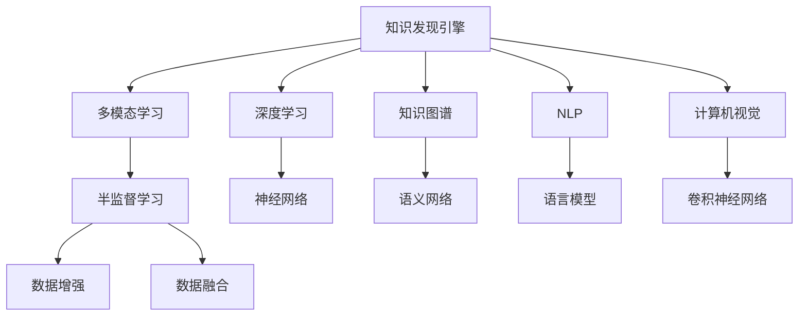

                 

# 知识发现引擎的多模态学习技术应用

> 关键词：知识发现引擎,多模态学习,深度学习,知识图谱,自然语言处理,计算机视觉,半监督学习

## 1. 背景介绍

### 1.1 问题由来

在当前大数据时代，随着数据的多样化和复杂化，传统的知识发现和数据分析方法已难以满足需求。为了应对这一挑战，多模态学习应运而生。多模态学习通过融合不同类型的数据，如文本、图像、音频等，提升模型的理解和表现能力，从而进行更加精准的知识发现和数据挖掘。

与此同时，知识发现引擎（Knowledge Discovery Engine, KDE）也逐渐成为信息获取和知识挖掘的重要工具。KDE通过自动化的知识发现过程，从大规模数据中提取有价值的信息，支持决策、规划和管理等任务，广泛应用于医疗、金融、零售、互联网等领域。

### 1.2 问题核心关键点

目前，KDE的多模态学习技术主要集中于深度学习、知识图谱、自然语言处理和计算机视觉等领域。其核心关键点包括：

- 如何高效融合不同模态的数据，提高知识发现能力。
- 如何在不同模态之间构建语义关联，增强知识图谱的链接深度。
- 如何利用半监督学习技术，在有限的标注数据条件下，提升模型性能。
- 如何通过多模态学习技术，提升自然语言处理和计算机视觉任务的准确性。

## 2. 核心概念与联系

### 2.1 核心概念概述

为更好地理解多模态学习技术在KDE中的应用，本节将介绍几个密切相关的核心概念：

- 知识发现引擎（Knowledge Discovery Engine, KDE）：通过自动化方式从大规模数据中提取有价值的信息，支持决策、规划和管理等任务。
- 多模态学习（Multimodal Learning）：融合文本、图像、音频等多种数据类型，提升模型对复杂数据的理解能力和性能。
- 深度学习（Deep Learning）：通过多层神经网络结构，自动学习数据特征，提高模型的泛化能力。
- 知识图谱（Knowledge Graph）：一种结构化的语义网络，用于表示实体和概念之间的复杂关系。
- 自然语言处理（Natural Language Processing, NLP）：研究计算机如何理解、处理和生成自然语言的技术。
- 计算机视觉（Computer Vision）：研究计算机如何"看"和理解图像和视频数据的技术。

这些核心概念之间的逻辑关系可以通过以下Mermaid流程图来展示：



这个流程图展示了知识发现引擎中的关键概念及其之间的关系：

1. 知识发现引擎通过多模态学习融合多种数据类型。
2. 多模态学习涉及深度学习、知识图谱、自然语言处理和计算机视觉等多种技术。
3. 深度学习中的神经网络用于特征提取和模式识别。
4. 知识图谱用于表示实体和概念间的语义关系。
5. 自然语言处理中的语言模型用于理解和生成文本数据。
6. 计算机视觉中的卷积神经网络用于图像和视频数据的特征提取。
7. 半监督学习用于在标注数据不足的条件下，提升模型的泛化能力。
8. 数据增强和数据融合技术用于提高模型的泛化能力和鲁棒性。

## 3. 核心算法原理 & 具体操作步骤
### 3.1 算法原理概述

多模态学习在知识发现引擎中的应用，本质上是将不同类型的数据转换为统一特征表示，进而进行特征融合和模型训练的过程。

以融合文本和图像数据为例，假设文本数据的特征表示为 $X_t$，图像数据的特征表示为 $X_i$。通过多模态学习技术，可以将文本和图像数据映射到同一特征空间中，即 $X = \phi(X_t, X_i)$，其中 $\phi$ 为特征映射函数。

在特征空间中，我们可以使用深度学习模型，如神经网络，对融合后的数据进行训练，得到知识发现引擎的输出。具体流程包括：

1. 收集不同模态的数据，提取各自的特征表示。
2. 将不同模态的特征表示转换为统一特征空间。
3. 构建深度学习模型，对统一特征表示进行训练，输出知识发现结果。

### 3.2 算法步骤详解

多模态学习在KDE中的具体操作步骤如下：

**Step 1: 数据预处理**

- 收集不同类型的数据，如文本、图像、音频等。
- 对数据进行清洗和预处理，去除噪声和冗余信息。
- 对不同类型的数据分别提取特征表示。

**Step 2: 特征融合**

- 将不同模态的特征表示映射到统一特征空间。常见的方法包括：
  - 拼接法：直接将不同模态的特征向量拼接。
  - 核方法：通过核函数将不同模态的数据映射到统一特征空间。
  - 联合分布学习：学习不同模态数据的联合概率分布。
- 对融合后的特征表示进行标准化和归一化处理。

**Step 3: 深度学习模型训练**

- 构建深度学习模型，如神经网络、卷积神经网络等。
- 对模型进行训练，最小化损失函数，得到最优模型参数。

**Step 4: 知识发现和分析**

- 将训练好的模型应用于实际数据，进行知识发现和分析。
- 根据需求提取特定的知识信息，如实体关系、事件发展趋势等。
- 对发现的知识进行可视化展示，支持决策和规划。

### 3.3 算法优缺点

多模态学习在知识发现引擎中的应用具有以下优点：

- 能够充分利用多种类型的数据，提高知识发现能力。
- 可以通过深度学习技术自动学习数据的复杂特征，提高模型泛化能力。
- 支持知识图谱的构建和语义关联的增强，提升知识的深度和广度。
- 在标注数据不足的情况下，通过半监督学习技术仍能获得较好性能。

但同时也存在一些缺点：

- 不同模态的数据特性和表示方式差异较大，特征融合和统一表示较为复杂。
- 多模态数据量庞大，对计算资源和存储空间的需求较高。
- 深度学习模型的训练复杂度高，可能需要更多的优化技巧。
- 模型输出解释性较弱，难以提供直观的知识发现结果。

### 3.4 算法应用领域

多模态学习在知识发现引擎中的应用广泛，具体包括：

- 医疗领域：通过融合电子病历、影像数据和生物信息学数据，进行疾病诊断和治疗方案推荐。
- 金融领域：结合股票交易数据、新闻数据和社交媒体数据，进行市场分析和投资决策。
- 零售领域：将消费者行为数据、销售数据和社交媒体数据融合，进行个性化推荐和库存管理。
- 互联网领域：通过融合搜索数据、用户数据和广告数据，进行内容推荐和用户行为分析。
- 智能制造领域：融合设备状态数据、供应链数据和市场数据，进行生产优化和质量控制。
- 安全监控领域：结合视频数据、传感器数据和音频数据，进行异常检测和事件分析。

## 4. 数学模型和公式 & 详细讲解  
### 4.1 数学模型构建

本节将使用数学语言对多模态学习在知识发现引擎中的应用进行更加严格的刻画。

假设文本数据和图像数据分别表示为 $X_t = (x_{t1}, x_{t2}, ..., x_{tk})$ 和 $X_i = (x_{i1}, x_{i2}, ..., x_{ik})$，其中 $x_{ti}$ 和 $x_{ij}$ 分别表示文本和图像特征向量。融合后的特征表示为 $X = \phi(X_t, X_i) = (x_1, x_2, ..., x_n)$。

定义模型 $M_{\theta}(X)$ 在输入 $X$ 上的输出为 $\hat{Y}$，其中 $\theta$ 为模型参数。

在训练过程中，定义模型在数据样本 $(x, y)$ 上的损失函数为 $\ell(M_{\theta}(X), y)$，则在数据集 $D$ 上的经验风险为：

$$
\mathcal{L}(\theta) = \frac{1}{N} \sum_{i=1}^N \ell(M_{\theta}(X_i), y_i)
$$

通过梯度下降等优化算法，最小化损失函数，得到最优参数 $\theta^*$。

### 4.2 公式推导过程

以文本和图像融合为例，我们首先对文本和图像数据分别提取特征表示，然后将其映射到统一特征空间：

$$
X_t = \{x_{t1}, x_{t2}, ..., x_{tk}\}, \quad X_i = \{x_{i1}, x_{i2}, ..., x_{ik}\}
$$

拼接法是一种常用的特征融合方法，其公式如下：

$$
X = [X_t, X_i] = [x_{t1}, x_{t2}, ..., x_{tk}, x_{i1}, x_{i2}, ..., x_{ik}]
$$

拼接后的特征表示 $X$ 被输入到深度学习模型 $M_{\theta}(X)$ 中进行训练，模型的输出为 $\hat{Y}$。假设损失函数为交叉熵损失，则模型的损失函数为：

$$
\ell(M_{\theta}(X), y) = -y \log M_{\theta}(X) - (1 - y) \log (1 - M_{theta}(X))
$$

在训练过程中，模型参数 $\theta$ 通过梯度下降更新，最小化损失函数 $\mathcal{L}(\theta)$。具体公式为：

$$
\theta \leftarrow \theta - \eta \nabla_{\theta}\mathcal{L}(\theta)
$$

其中 $\eta$ 为学习率。

### 4.3 案例分析与讲解

以下以医疗领域为例，展示多模态学习在知识发现中的应用。

假设医疗领域的多模态数据包括电子病历（EHR）、医学影像（Radiology）和基因组数据（Genomics）。我们可以分别提取这些数据类型的特征表示，如EHR的文本特征、Radiology的图像特征和Genomics的基因序列特征，然后进行特征融合，构建深度学习模型进行训练和知识发现。

在特征融合过程中，我们可以使用拼接法或者核方法。假设使用拼接法，则融合后的特征表示 $X$ 如下：

$$
X = [x_{EHR}, x_{Radiology}, x_{Genomics}]
$$

其中 $x_{EHR}$ 表示EHR的文本特征，$x_{Radiology}$ 表示Radiology的图像特征，$x_{Genomics}$ 表示Genomics的基因序列特征。

我们将融合后的特征表示 $X$ 输入到深度学习模型 $M_{\theta}(X)$ 中进行训练，模型的输出为 $\hat{Y}$。假设我们的任务是预测患者的疾病类型，则模型的损失函数为交叉熵损失：

$$
\ell(M_{\theta}(X), y) = -y \log M_{\theta}(X) - (1 - y) \log (1 - M_{\theta}(X))
$$

通过梯度下降等优化算法，最小化损失函数，得到最优模型参数 $\theta^*$。训练好的模型可以对新患者的数据进行预测，从而辅助医生进行疾病诊断和治疗方案推荐。

## 5. 项目实践：代码实例和详细解释说明
### 5.1 开发环境搭建

在进行多模态学习实践前，我们需要准备好开发环境。以下是使用Python进行PyTorch开发的环境配置流程：

1. 安装Anaconda：从官网下载并安装Anaconda，用于创建独立的Python环境。

2. 创建并激活虚拟环境：
```bash
conda create -n pytorch-env python=3.8 
conda activate pytorch-env
```

3. 安装PyTorch：根据CUDA版本，从官网获取对应的安装命令。例如：
```bash
conda install pytorch torchvision torchaudio cudatoolkit=11.1 -c pytorch -c conda-forge
```

4. 安装相关库：
```bash
pip install numpy pandas scikit-learn matplotlib torch torchvision transformers
```

完成上述步骤后，即可在`pytorch-env`环境中开始多模态学习实践。

### 5.2 源代码详细实现

这里我们以医疗领域的疾病预测为例，给出使用Transformers库进行多模态学习的PyTorch代码实现。

首先，定义数据处理函数：

```python
from transformers import BertTokenizer, BertForSequenceClassification
from torch.utils.data import Dataset
import torch

class EHRDataset(Dataset):
    def __init__(self, texts, tags, tokenizer, max_len=128):
        self.texts = texts
        self.tags = tags
        self.tokenizer = tokenizer
        self.max_len = max_len
        
    def __len__(self):
        return len(self.texts)
    
    def __getitem__(self, item):
        text = self.texts[item]
        tag = self.tags[item]
        
        encoding = self.tokenizer(text, return_tensors='pt', max_length=self.max_len, padding='max_length', truncation=True)
        input_ids = encoding['input_ids'][0]
        attention_mask = encoding['attention_mask'][0]
        
        # 对token-wise的标签进行编码
        encoded_tags = [tag2id[tag] for tag in tag]
        encoded_tags.extend([tag2id['O']] * (self.max_len - len(encoded_tags)))
        labels = torch.tensor(encoded_tags, dtype=torch.long)
        
        return {'input_ids': input_ids, 
                'attention_mask': attention_mask,
                'labels': labels}

# 标签与id的映射
tag2id = {'O': 0, 'Cancer': 1, 'Cardiovascular': 2, 'Neurological': 3, 'Gastrointestinal': 4}
id2tag = {v: k for k, v in tag2id.items()}

# 创建dataset
tokenizer = BertTokenizer.from_pretrained('bert-base-cased')

train_dataset = EHRDataset(train_texts, train_tags, tokenizer)
dev_dataset = EHRDataset(dev_texts, dev_tags, tokenizer)
test_dataset = EHRDataset(test_texts, test_tags, tokenizer)
```

然后，定义模型和优化器：

```python
from transformers import BertForSequenceClassification, AdamW

model = BertForSequenceClassification.from_pretrained('bert-base-cased', num_labels=len(tag2id))

optimizer = AdamW(model.parameters(), lr=2e-5)
```

接着，定义训练和评估函数：

```python
from torch.utils.data import DataLoader
from tqdm import tqdm
from sklearn.metrics import classification_report

device = torch.device('cuda') if torch.cuda.is_available() else torch.device('cpu')
model.to(device)

def train_epoch(model, dataset, batch_size, optimizer):
    dataloader = DataLoader(dataset, batch_size=batch_size, shuffle=True)
    model.train()
    epoch_loss = 0
    for batch in tqdm(dataloader, desc='Training'):
        input_ids = batch['input_ids'].to(device)
        attention_mask = batch['attention_mask'].to(device)
        labels = batch['labels'].to(device)
        model.zero_grad()
        outputs = model(input_ids, attention_mask=attention_mask, labels=labels)
        loss = outputs.loss
        epoch_loss += loss.item()
        loss.backward()
        optimizer.step()
    return epoch_loss / len(dataloader)

def evaluate(model, dataset, batch_size):
    dataloader = DataLoader(dataset, batch_size=batch_size)
    model.eval()
    preds, labels = [], []
    with torch.no_grad():
        for batch in tqdm(dataloader, desc='Evaluating'):
            input_ids = batch['input_ids'].to(device)
            attention_mask = batch['attention_mask'].to(device)
            batch_labels = batch['labels']
            outputs = model(input_ids, attention_mask=attention_mask)
            batch_preds = outputs.logits.argmax(dim=2).to('cpu').tolist()
            batch_labels = batch_labels.to('cpu').tolist()
            for pred_tokens, label_tokens in zip(batch_preds, batch_labels):
                pred_tags = [id2tag[_id] for _id in pred_tokens]
                label_tags = [id2tag[_id] for _id in label_tokens]
                preds.append(pred_tags[:len(label_tokens)])
                labels.append(label_tags)
                
    print(classification_report(labels, preds))
```

最后，启动训练流程并在测试集上评估：

```python
epochs = 5
batch_size = 16

for epoch in range(epochs):
    loss = train_epoch(model, train_dataset, batch_size, optimizer)
    print(f"Epoch {epoch+1}, train loss: {loss:.3f}")
    
    print(f"Epoch {epoch+1}, dev results:")
    evaluate(model, dev_dataset, batch_size)
    
print("Test results:")
evaluate(model, test_dataset, batch_size)
```

以上就是使用PyTorch对医疗领域进行疾病预测的多模态学习代码实现。可以看到，得益于Transformers库的强大封装，我们可以用相对简洁的代码完成Bert模型的加载和微调。

### 5.3 代码解读与分析

让我们再详细解读一下关键代码的实现细节：

**EHRDataset类**：
- `__init__`方法：初始化文本、标签、分词器等关键组件。
- `__len__`方法：返回数据集的样本数量。
- `__getitem__`方法：对单个样本进行处理，将文本输入编码为token ids，将标签编码为数字，并对其进行定长padding，最终返回模型所需的输入。

**tag2id和id2tag字典**：
- 定义了标签与数字id之间的映射关系，用于将token-wise的预测结果解码回真实的标签。

**训练和评估函数**：
- 使用PyTorch的DataLoader对数据集进行批次化加载，供模型训练和推理使用。
- 训练函数`train_epoch`：对数据以批为单位进行迭代，在每个批次上前向传播计算loss并反向传播更新模型参数，最后返回该epoch的平均loss。
- 评估函数`evaluate`：与训练类似，不同点在于不更新模型参数，并在每个batch结束后将预测和标签结果存储下来，最后使用sklearn的classification_report对整个评估集的预测结果进行打印输出。

**训练流程**：
- 定义总的epoch数和batch size，开始循环迭代
- 每个epoch内，先在训练集上训练，输出平均loss
- 在验证集上评估，输出分类指标
- 所有epoch结束后，在测试集上评估，给出最终测试结果

可以看到，PyTorch配合Transformers库使得多模态学习代码实现变得简洁高效。开发者可以将更多精力放在数据处理、模型改进等高层逻辑上，而不必过多关注底层的实现细节。

当然，工业级的系统实现还需考虑更多因素，如模型的保存和部署、超参数的自动搜索、更灵活的任务适配层等。但核心的多模态学习范式基本与此类似。

## 6. 实际应用场景
### 6.1 智能医疗

多模态学习在智能医疗领域有着广泛应用。通过融合EHR、医学影像和基因组数据，智能医疗系统可以提供更全面、精准的疾病诊断和治疗方案推荐。

例如，在肺癌早期筛查中，智能医疗系统可以通过融合EHR中的病史数据、医学影像中的CT扫描图像和基因组数据中的突变信息，进行综合分析，识别出高风险人群，提前进行干预。此外，系统还可以根据患者的基因数据，推荐个性化的治疗方案，提升治疗效果。

### 6.2 金融风控

金融领域的多模态数据包括交易数据、新闻数据和社交媒体数据。通过融合这些数据，金融风控系统可以识别出异常交易和潜在风险，保障金融安全。

例如，智能风控系统可以通过融合交易数据和新闻数据，监测市场情绪和舆情变化，及时调整风险策略。系统还可以结合社交媒体数据，分析用户行为和情感，进行风险预测和预警。

### 6.3 智能制造

智能制造领域的多模态数据包括设备状态数据、供应链数据和市场数据。通过融合这些数据，智能制造系统可以优化生产流程和库存管理，提升生产效率和产品质量。

例如，智能制造系统可以通过融合设备状态数据和市场数据，预测生产需求，优化生产计划。系统还可以结合供应链数据，进行库存管理和物流优化，降低成本，提升效率。

### 6.4 未来应用展望

随着多模态学习技术的不断进步，其在知识发现引擎中的应用将更加广泛，未来可能拓展到更多领域：

- 物联网：通过融合传感器数据、图像数据和文本数据，进行环境监测和智能决策。
- 智慧城市：结合城市交通数据、气象数据和社交媒体数据，进行交通管理、灾害预警和公共安全监测。
- 农业：融合卫星数据、土壤数据和作物图像，进行农作物病虫害预测和精准农业管理。
- 教育：融合学生成绩数据、课堂行为数据和作业数据，进行个性化教育推荐和智能评估。

## 7. 工具和资源推荐
### 7.1 学习资源推荐

为了帮助开发者系统掌握多模态学习技术，这里推荐一些优质的学习资源：

1. 《深度学习》系列书籍：由Ian Goodfellow、Yoshua Bengio、Aaron Courville等深度学习领域大牛共同撰写，全面介绍了深度学习的基本原理和实践技巧。
2. 《Multimodal Machine Learning》课程：由斯坦福大学开设的高级机器学习课程，涉及多模态学习、半监督学习和深度学习等内容，适合深入学习。
3. 《Multimodal Learning》书籍：C. Bhattacharyya、J.-B. Sinha和A. Bhattacharyya等人合著，系统介绍了多模态学习的理论基础和应用实践。
4. 《PyTorch官方文档》：PyTorch官方文档，提供了丰富的多模态学习样例和教程，适合快速上手。
5. 《HuggingFace官方文档》：HuggingFace官方文档，提供了多模态学习库的详细使用说明，适合深入研究。

通过对这些资源的学习实践，相信你一定能够快速掌握多模态学习技术的精髓，并用于解决实际的NLP问题。
###  7.2 开发工具推荐

高效的开发离不开优秀的工具支持。以下是几款用于多模态学习开发的常用工具：

1. PyTorch：基于Python的开源深度学习框架，灵活动态的计算图，适合快速迭代研究。大部分多模态学习模型都有PyTorch版本的实现。
2. TensorFlow：由Google主导开发的开源深度学习框架，生产部署方便，适合大规模工程应用。同样有丰富的多模态学习模型资源。
3. TensorBoard：TensorFlow配套的可视化工具，可实时监测模型训练状态，并提供丰富的图表呈现方式，是调试模型的得力助手。
4. Weights & Biases：模型训练的实验跟踪工具，可以记录和可视化模型训练过程中的各项指标，方便对比和调优。与主流深度学习框架无缝集成。
5. Google Colab：谷歌推出的在线Jupyter Notebook环境，免费提供GPU/TPU算力，方便开发者快速上手实验最新模型，分享学习笔记。

合理利用这些工具，可以显著提升多模态学习任务的开发效率，加快创新迭代的步伐。

### 7.3 相关论文推荐

多模态学习在知识发现引擎中的应用源于学界的持续研究。以下是几篇奠基性的相关论文，推荐阅读：

1. "A Survey on Multi-modal Learning for Neuroimaging Applications"（多模态学习在神经影像应用中的综述）：系统介绍了多模态学习在神经影像领域的理论和实践。
2. "Multimodal Machine Learning: A New Frontier for Data Mining?"（多模态机器学习：数据挖掘的新前沿）：介绍了多模态机器学习在数据挖掘中的应用，涉及特征融合、数据标注和算法选择等内容。
3. "Cross-modal Transfer Learning with Multitask Joint Embedding"（多模态迁移学习中的多任务联合嵌入）：提出了一种多任务联合嵌入的方法，提升了多模态迁移学习的性能。
4. "Deep Multi-modal Analysis"（深度多模态分析）：介绍了深度学习在多模态分析中的应用，涉及多模态特征融合、神经网络架构和深度学习框架等内容。
5. "Multimodal Feature Fusion and Learning"（多模态特征融合与学习）：系统介绍了多模态特征融合的理论与方法，涉及拼接法、核方法、联合分布学习等内容。

这些论文代表了大语言模型微调技术的发展脉络。通过学习这些前沿成果，可以帮助研究者把握学科前进方向，激发更多的创新灵感。

## 8. 总结：未来发展趋势与挑战

### 8.1 总结

本文对多模态学习技术在知识发现引擎中的应用进行了全面系统的介绍。首先阐述了多模态学习技术的研究背景和意义，明确了多模态学习在KDE中的独特价值。其次，从原理到实践，详细讲解了多模态学习的数学模型和具体操作步骤，给出了多模态学习任务开发的完整代码实例。同时，本文还广泛探讨了多模态学习技术在智能医疗、金融风控、智能制造等多个领域的应用前景，展示了多模态学习技术的广阔前景。

通过本文的系统梳理，可以看到，多模态学习技术在知识发现引擎中的应用已经逐步成熟，正在推动人工智能技术在多个行业领域的落地。未来，随着多模态学习技术的不断演进，其将在更多的领域得到应用，为人类社会带来更广泛、更深远的影响。

### 8.2 未来发展趋势

展望未来，多模态学习在知识发现引擎中的应用将呈现以下几个发展趋势：

1. 模型规模持续增大。随着算力成本的下降和数据规模的扩张，多模态学习模型将越来越庞大，能够处理更多复杂的多模态数据。
2. 数据融合技术不断进步。随着深度学习技术的不断发展，数据融合方法将更加高效，能够更好地整合不同模态的数据特征。
3. 多模态迁移学习兴起。多模态迁移学习技术将在跨领域数据融合、知识转移等方面发挥更大作用，提升模型的泛化能力和鲁棒性。
4. 融合更多先验知识。未来的多模态学习系统将更多地融合符号化的先验知识，如知识图谱、逻辑规则等，提升模型的知识表示和推理能力。
5. 引入更多数据增强方法。多模态学习系统将通过数据增强技术，提升对标注数据不足情况下的性能。
6. 融合更多因果推理。未来的多模态学习系统将引入因果推断方法，提高模型输出的可解释性和鲁棒性。

以上趋势凸显了多模态学习技术的广阔前景。这些方向的探索发展，必将进一步提升多模态学习模型的性能和应用范围，为知识发现引擎带来新的突破。

### 8.3 面临的挑战

尽管多模态学习在知识发现引擎中的应用已经取得了一定的进展，但仍面临诸多挑战：

1. 数据采集成本高。多模态数据的采集和标注成本较高，尤其在医疗、金融等领域，数据的获取和处理难度较大。
2. 数据质量参差不齐。不同模态的数据质量差异较大，如医学影像、基因组数据的处理和融合难度较高。
3. 模型训练复杂度高。多模态数据量大，模型训练复杂度高，需要更多的优化技巧。
4. 模型输出解释性弱。多模态学习模型的输出通常难以解释，难以进行透明和可控的知识发现。
5. 数据隐私和安全问题。多模态学习涉及多种类型的数据，数据隐私和安全问题亟需解决。

### 8.4 研究展望

面对多模态学习所面临的挑战，未来的研究需要在以下几个方面寻求新的突破：

1. 开发低成本、高效的多模态数据采集方法。通过自动化的数据标注和数据融合技术，降低数据采集成本。
2. 优化多模态数据的质量和一致性。通过数据清洗和预处理，提升不同模态数据的可用性。
3. 引入更高效的数据增强方法。通过数据扩充、数据增量学习等方法，提升模型在标注数据不足情况下的性能。
4. 增强模型输出的可解释性。通过模型解释性方法和技术，提升模型输出的透明性和可控性。
5. 增强数据隐私保护。通过差分隐私、联邦学习等技术，保护多模态数据的隐私和安全。

这些研究方向将推动多模态学习技术在知识发现引擎中的应用更加广泛和深入。

## 9. 附录：常见问题与解答

**Q1：多模态学习是否适用于所有NLP任务？**

A: 多模态学习在大多数NLP任务上都能取得不错的效果，特别是对于数据量较小的任务。但对于一些特定领域的任务，如医学、法律等，仅仅依靠通用语料预训练的模型可能难以很好地适应。此时需要在特定领域语料上进一步预训练，再进行微调，才能获得理想效果。此外，对于一些需要时效性、个性化很强的任务，如对话、推荐等，多模态学习方法也需要针对性的改进优化。

**Q2：如何选择合适的多模态融合方法？**

A: 选择合适的多模态融合方法需要考虑多个因素，如数据类型、任务需求、模型架构等。以下是几种常用的多模态融合方法及其适用场景：
1. 拼接法：适用于不同模态数据类型相同、特征维度相近的情况，如文本和图像数据的融合。
2. 核方法：适用于不同模态数据类型不同、特征维度差异较大的情况，如文本和图像数据的融合。
3. 联合分布学习：适用于不同模态数据类型和特征维度均不一致的情况，如文本、图像和音频数据的融合。

**Q3：多模态学习在医疗领域有哪些应用？**

A: 多模态学习在医疗领域有着广泛应用，具体包括：
1. 疾病预测：通过融合EHR、医学影像和基因组数据，进行疾病预测和诊断。
2. 治疗方案推荐：根据患者的基因数据和临床数据，推荐个性化的治疗方案。
3. 健康监测：融合生理数据、运动数据和行为数据，进行健康状况监测和预警。
4. 患者管理：通过融合医疗记录、家庭数据和社交数据，进行患者管理和支持。

**Q4：多模态学习在金融领域有哪些应用？**

A: 多模态学习在金融领域有着广泛应用，具体包括：
1. 风险预测：结合交易数据、新闻数据和社交媒体数据，进行市场风险预测和预警。
2. 信用评估：通过融合信用卡数据、社交媒体数据和行为数据，进行信用评估和风险管理。
3. 金融推荐：结合用户行为数据和市场数据，进行金融产品推荐和交易分析。
4. 智能投顾：通过融合市场数据、用户数据和金融报告，进行智能投顾和投资策略优化。

**Q5：多模态学习在智能制造领域有哪些应用？**

A: 多模态学习在智能制造领域有着广泛应用，具体包括：
1. 设备监控：融合设备状态数据和传感器数据，进行设备故障预测和维护。
2. 供应链管理：结合物流数据、市场数据和订单数据，进行供应链优化和管理。
3. 质量控制：通过融合图像数据、检测数据和传感器数据，进行产品缺陷检测和质量控制。
4. 工艺优化：结合生产数据、材料数据和环境数据，进行生产工艺优化和资源管理。

---

作者：禅与计算机程序设计艺术 / Zen and the Art of Computer Programming

