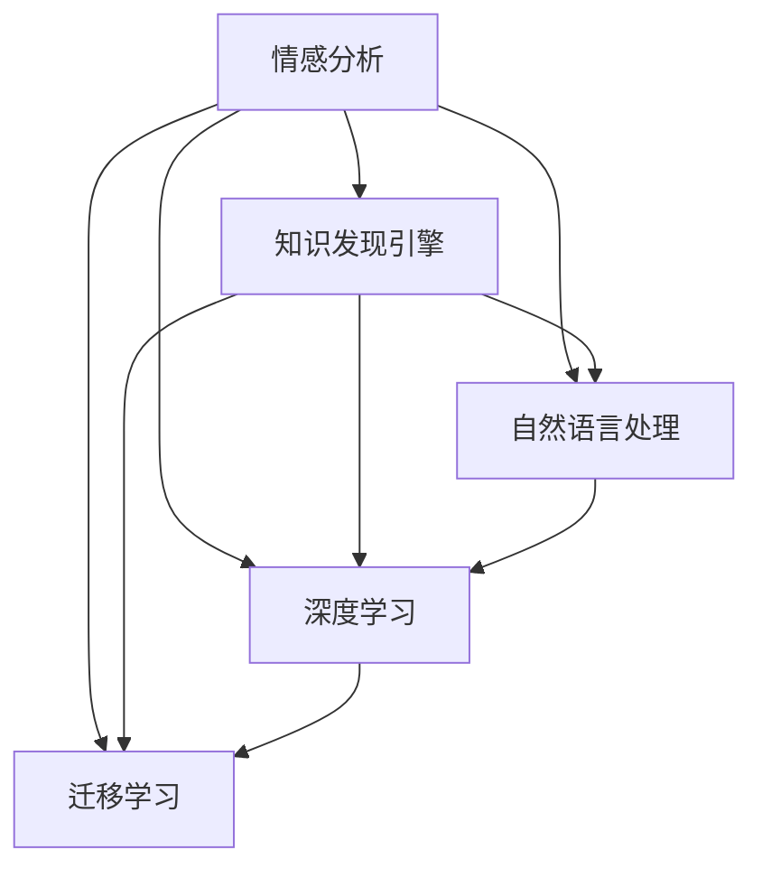

                 

# 知识发现引擎的情感分析技术应用

> 关键词：情感分析,知识发现引擎,自然语言处理,深度学习,大模型,迁移学习,数据挖掘

## 1. 背景介绍

### 1.1 问题由来

在互联网时代，社交媒体、评论平台、产品评价等数据中蕴含了大量的情感信息。情感分析作为自然语言处理(NLP)的重要任务，能够从文本中自动识别情感倾向（如正面、负面、中性），帮助企业了解用户意见、市场动态，从而制定更科学的决策。然而，情感分析涉及自然语言理解和海量数据处理，手工实现难度大、效率低，成为许多公司面临的挑战。

知识发现引擎(Knowledge Discovery Engine, KDE)通过深度学习技术，可以从海量数据中自动发现隐藏的、有价值的知识，提供智能化的解决方案。因此，将情感分析与知识发现引擎结合，能够大幅提升情感分析的自动化水平，挖掘出用户背后的真实需求，促进业务智能化转型。

### 1.2 问题核心关键点

知识发现引擎结合情感分析，旨在自动从文本数据中提取情感信息，发现用户偏好、意见倾向等隐含知识，辅助决策和业务优化。具体实现步骤包括：

1. **文本收集与预处理**：收集社交媒体、评论、产品评价等文本数据，进行分词、去噪、情感词标注等预处理。
2. **情感标注与数据增强**：在标注数据上应用多标签分类技术，利用迁移学习提升情感分类的准确性。
3. **情感特征提取与建模**：使用深度学习模型提取文本特征，构建情感分类模型。
4. **知识挖掘与发现**：结合规则、关联规则、聚类等方法，从情感分类结果中发现用户需求、市场趋势、情感变化规律等有价值知识。

### 1.3 问题研究意义

将知识发现引擎引入情感分析，能够大幅提升情感分析的自动化程度和智能化水平，带来以下几个方面的意义：

1. **降低人工成本**：自动化情感分析能够减少人工标注和审核工作量，提高效率。
2. **提升分类准确性**：结合迁移学习和大规模数据，能够有效提升情感分类的准确性，降低误分类率。
3. **发现隐藏知识**：通过知识发现技术，能够从情感数据中挖掘出用户行为模式、市场趋势等深层知识，辅助业务决策。
4. **支持智能应用**：为情感分析注入智能决策引擎，使得情感分析应用更具业务价值和落地性。

## 2. 核心概念与联系

### 2.1 核心概念概述

为更好地理解知识发现引擎的情感分析技术应用，本节将介绍几个密切相关的核心概念：

- **情感分析**：指从文本中自动识别情感倾向（如正面、负面、中性），广泛应用于舆情监测、产品评价、用户反馈等领域。
- **知识发现引擎**：基于深度学习、数据挖掘技术，自动从大量数据中发现隐藏的知识和规律，辅助决策支持。
- **自然语言处理**：涉及文本分析、语言理解、语音识别等技术，是情感分析、知识发现的重要基础。
- **深度学习**：指使用多层神经网络进行非线性建模，广泛应用于图像识别、语音处理、自然语言处理等领域。
- **迁移学习**：指将一个领域学到的知识迁移到另一个相关领域，提升模型在不同任务上的泛化能力。

这些核心概念之间的逻辑关系可以通过以下Mermaid流程图来展示：



这个流程图展示了大语言模型的核心概念及其之间的关系：

1. 情感分析利用自然语言处理技术进行文本分析，使用深度学习模型进行分类预测。
2. 知识发现引擎基于情感分类结果，通过数据挖掘技术发现用户需求、市场趋势等深层知识。
3. 深度学习与迁移学习技术为情感分析提供了更强大的模型和更广泛的泛化能力。

这些概念共同构成了知识发现引擎的情感分析应用框架，使其能够高效地从文本数据中提取情感信息，并进行深层次知识挖掘。

## 3. 核心算法原理 & 具体操作步骤
### 3.1 算法原理概述

情感分析与知识发现引擎的结合，本质上是一个深度学习驱动的数据挖掘过程。其核心思想是：通过深度学习模型自动从文本数据中识别情感倾向，并结合数据挖掘技术，发现背后的隐含知识。

具体实现步骤如下：

**Step 1: 文本收集与预处理**

首先，收集社交媒体、评论平台、产品评价等文本数据，进行分词、去除停用词、情感词标注等预处理。其中，情感词标注是情感分析的基础，涉及对文本中的情感词汇进行分类。常用的情感词标注方法包括基于词典、基于情感词典、基于机器学习等。

**Step 2: 情感标注与数据增强**

将预处理后的文本数据与情感词标注结合，形成标注样本。利用迁移学习技术，在大规模数据上微调预训练情感分类模型，提升情感分类的准确性。此外，还可以通过数据增强技术，利用回译、随机化、近义词替换等方式扩充训练数据，避免过拟合。

**Step 3: 情感特征提取与建模**

使用深度学习模型提取文本特征，构建情感分类模型。常用的深度学习模型包括卷积神经网络(CNN)、循环神经网络(RNN)、Transformer等。这些模型能够从文本中自动提取多层次的语义信息，构建准确的情感分类模型。

**Step 4: 知识挖掘与发现**

结合规则、关联规则、聚类等方法，从情感分类结果中发现用户需求、市场趋势、情感变化规律等有价值知识。具体实现时，可以采用关联规则挖掘技术，从情感分类数据中发现高频情感变化规律。也可以利用聚类技术，对用户情感进行分析分组，识别不同用户群体的情感特征。

### 3.2 算法步骤详解

以下将详细介绍情感分析和知识发现引擎结合的具体操作步骤：

**Step 1: 文本收集与预处理**

1. **文本收集**：从社交媒体、评论平台、产品评价等渠道收集文本数据，如评论内容、产品描述、用户评价等。
   
2. **预处理**：对文本数据进行分词、去除停用词、情感词标注等处理。其中，情感词标注是情感分析的基础，常用的标注方法包括基于词典、基于情感词典、基于机器学习等。

3. **数据增强**：利用回译、随机化、近义词替换等方式，扩充训练集，避免过拟合。

**Step 2: 情感标注与数据增强**

1. **情感标注**：将预处理后的文本数据与情感词标注结合，形成标注样本。例如，将评论内容与用户给出的情感评分结合，形成标注数据集。

2. **迁移学习**：在大规模数据上微调预训练情感分类模型，提升情感分类的准确性。常用的迁移学习方法包括微调BERT、GPT等大模型。

3. **数据增强**：利用回译、随机化、近义词替换等方式，扩充训练集，避免过拟合。

**Step 3: 情感特征提取与建模**

1. **特征提取**：使用深度学习模型提取文本特征。例如，使用Transformer模型提取文本的语义表示，提取多层次的语义信息。

2. **情感建模**：构建情感分类模型。例如，使用二分类交叉熵损失函数，对提取的特征进行分类预测。

3. **模型训练**：在标注数据上训练情感分类模型，使用优化器（如AdamW）进行参数更新，直到收敛。

**Step 4: 知识挖掘与发现**

1. **规则挖掘**：结合规则挖掘技术，从情感分类结果中发现用户需求、市场趋势等有价值知识。例如，利用关联规则挖掘技术，发现高频情感变化规律。

2. **聚类分析**：利用聚类技术，对用户情感进行分析分组，识别不同用户群体的情感特征。

3. **结果展示**：将挖掘出的知识展示为图表、报告等形式，辅助业务决策。

### 3.3 算法优缺点

知识发现引擎结合情感分析的方法具有以下优点：

1. **自动化程度高**：通过深度学习模型自动提取情感信息，减少人工标注和审核工作量，提高效率。
2. **分类准确性高**：利用迁移学习技术，结合大规模数据，提升情感分类的准确性。
3. **发现深层知识**：通过知识发现技术，挖掘用户需求、市场趋势等深层知识，辅助业务决策。
4. **智能决策支持**：为情感分析注入智能决策引擎，使得情感分析应用更具业务价值和落地性。

但该方法也存在一定的局限性：

1. **数据质量要求高**：情感标注和数据增强依赖高质量标注数据，获取高质量标注数据成本较高。
2. **模型复杂度高**：深度学习模型和知识发现算法复杂度高，实现难度较大。
3. **解释性不足**：情感分类和知识发现的输出结果缺乏可解释性，难以对其推理逻辑进行分析和调试。
4. **可扩展性差**：规则和聚类等技术对大规模数据处理能力要求高，扩展性较差。

尽管存在这些局限性，但就目前而言，知识发现引擎结合情感分析的方法仍是大语言模型应用的主流范式。未来相关研究的重点在于如何进一步降低对标注数据的依赖，提高模型的泛化能力，同时兼顾可解释性和可扩展性等因素。

### 3.4 算法应用领域

知识发现引擎结合情感分析的方法，已经在多个领域得到了广泛的应用，例如：

- **产品评价**：分析用户在电商平台上的产品评价，发现用户对不同产品的情感倾向，辅助优化产品设计和改进用户体验。
- **社交媒体分析**：从社交媒体平台中自动提取用户情感，识别情感变化规律，辅助企业舆情监测和危机应对。
- **市场趋势分析**：分析用户在评论平台上的情感倾向，发现市场趋势和用户需求，辅助企业制定营销策略。
- **品牌情感监测**：从用户评论中识别品牌情感倾向，评估品牌形象，辅助品牌管理。
- **情感驱动广告**：通过情感分析，发现用户情感与广告点击率之间的关系，优化广告投放策略。

除了上述这些经典应用外，情感分析技术还被创新性地应用于更多场景中，如用户画像分析、情感驱动搜索、情感驱动推荐等，为NLP技术带来了全新的突破。

## 4. 数学模型和公式 & 详细讲解 & 举例说明

### 4.1 数学模型构建

本节将使用数学语言对知识发现引擎的情感分析技术进行更加严格的刻画。

记情感分析任务为$T$，输入文本为$x$，标签为$y \in \{0, 1\}$，其中$0$表示负面情感，$1$表示正面情感。假设预训练情感分类模型为$M_{\theta}$，其中$\theta$为模型参数。定义模型在数据样本$(x, y)$上的损失函数为$\ell(M_{\theta}(x), y)$，则在数据集$D$上的经验风险为：

$$
\mathcal{L}(\theta) = \frac{1}{N} \sum_{i=1}^N \ell(M_{\theta}(x_i), y_i)
$$

其中$N$为训练集大小，$\ell$为情感分类损失函数，常用的情感分类损失函数包括交叉熵损失、均方误差损失等。

### 4.2 公式推导过程

以二分类任务为例，推导交叉熵损失函数及其梯度的计算公式。

假设模型$M_{\theta}$在输入$x$上的输出为$\hat{y}=M_{\theta}(x) \in [0,1]$，表示样本属于正类的概率。真实标签$y \in \{0,1\}$。则二分类交叉熵损失函数定义为：

$$
\ell(M_{\theta}(x),y) = -[y\log \hat{y} + (1-y)\log (1-\hat{y})]
$$

将其代入经验风险公式，得：

$$
\mathcal{L}(\theta) = -\frac{1}{N}\sum_{i=1}^N [y_i\log M_{\theta}(x_i)+(1-y_i)\log(1-M_{\theta}(x_i))]
$$

根据链式法则，损失函数对参数$\theta_k$的梯度为：

$$
\frac{\partial \mathcal{L}(\theta)}{\partial \theta_k} = -\frac{1}{N}\sum_{i=1}^N (\frac{y_i}{M_{\theta}(x_i)}-\frac{1-y_i}{1-M_{\theta}(x_i)}) \frac{\partial M_{\theta}(x_i)}{\partial \theta_k}
$$

其中$\frac{\partial M_{\theta}(x_i)}{\partial \theta_k}$可进一步递归展开，利用自动微分技术完成计算。

在得到损失函数的梯度后，即可带入参数更新公式，完成模型的迭代优化。重复上述过程直至收敛，最终得到适应情感分类任务的最优模型参数$\theta^*$。

## 5. 项目实践：代码实例和详细解释说明
### 5.1 开发环境搭建

在进行情感分析和知识发现应用开发前，我们需要准备好开发环境。以下是使用Python进行PyTorch开发的环境配置流程：

1. 安装Anaconda：从官网下载并安装Anaconda，用于创建独立的Python环境。

2. 创建并激活虚拟环境：
```bash
conda create -n pytorch-env python=3.8 
conda activate pytorch-env
```

3. 安装PyTorch：根据CUDA版本，从官网获取对应的安装命令。例如：
```bash
conda install pytorch torchvision torchaudio cudatoolkit=11.1 -c pytorch -c conda-forge
```

4. 安装Transformers库：
```bash
pip install transformers
```

5. 安装各类工具包：
```bash
pip install numpy pandas scikit-learn matplotlib tqdm jupyter notebook ipython
```

完成上述步骤后，即可在`pytorch-env`环境中开始应用开发。

### 5.2 源代码详细实现

下面以情感分类任务为例，给出使用Transformers库对BERT模型进行情感分析的PyTorch代码实现。

首先，定义情感分类任务的数据处理函数：

```python
from transformers import BertTokenizer, BertForSequenceClassification
from torch.utils.data import Dataset
import torch

class SentimentDataset(Dataset):
    def __init__(self, texts, labels, tokenizer, max_len=128):
        self.texts = texts
        self.labels = labels
        self.tokenizer = tokenizer
        self.max_len = max_len
        
    def __len__(self):
        return len(self.texts)
    
    def __getitem__(self, item):
        text = self.texts[item]
        label = self.labels[item]
        
        encoding = self.tokenizer(text, return_tensors='pt', max_length=self.max_len, padding='max_length', truncation=True)
        input_ids = encoding['input_ids'][0]
        attention_mask = encoding['attention_mask'][0]
        
        # 对label进行one-hot编码
        encoded_labels = torch.tensor([label], dtype=torch.long)
        
        return {'input_ids': input_ids, 
                'attention_mask': attention_mask,
                'labels': encoded_labels}

# 标签与id的映射
label2id = {0: 'negative', 1: 'positive'}
id2label = {v: k for k, v in label2id.items()}

# 创建dataset
tokenizer = BertTokenizer.from_pretrained('bert-base-cased')

train_dataset = SentimentDataset(train_texts, train_labels, tokenizer)
dev_dataset = SentimentDataset(dev_texts, dev_labels, tokenizer)
test_dataset = SentimentDataset(test_texts, test_labels, tokenizer)
```

然后，定义模型和优化器：

```python
from transformers import AdamW

model = BertForSequenceClassification.from_pretrained('bert-base-cased', num_labels=2)

optimizer = AdamW(model.parameters(), lr=2e-5)
```

接着，定义训练和评估函数：

```python
from torch.utils.data import DataLoader
from tqdm import tqdm
from sklearn.metrics import classification_report

device = torch.device('cuda') if torch.cuda.is_available() else torch.device('cpu')
model.to(device)

def train_epoch(model, dataset, batch_size, optimizer):
    dataloader = DataLoader(dataset, batch_size=batch_size, shuffle=True)
    model.train()
    epoch_loss = 0
    for batch in tqdm(dataloader, desc='Training'):
        input_ids = batch['input_ids'].to(device)
        attention_mask = batch['attention_mask'].to(device)
        labels = batch['labels'].to(device)
        model.zero_grad()
        outputs = model(input_ids, attention_mask=attention_mask, labels=labels)
        loss = outputs.loss
        epoch_loss += loss.item()
        loss.backward()
        optimizer.step()
    return epoch_loss / len(dataloader)

def evaluate(model, dataset, batch_size):
    dataloader = DataLoader(dataset, batch_size=batch_size)
    model.eval()
    preds, labels = [], []
    with torch.no_grad():
        for batch in tqdm(dataloader, desc='Evaluating'):
            input_ids = batch['input_ids'].to(device)
            attention_mask = batch['attention_mask'].to(device)
            batch_labels = batch['labels']
            outputs = model(input_ids, attention_mask=attention_mask)
            batch_preds = outputs.logits.argmax(dim=2).to('cpu').tolist()
            batch_labels = batch_labels.to('cpu').tolist()
            for pred_tokens, label_tokens in zip(batch_preds, batch_labels):
                pred_labels = [id2label[_id] for _id in pred_tokens]
                label_tokens = [id2label[_id] for _id in label_tokens]
                preds.append(pred_labels[:len(label_tokens)])
                labels.append(label_tokens)
                
    print(classification_report(labels, preds))
```

最后，启动训练流程并在测试集上评估：

```python
epochs = 5
batch_size = 16

for epoch in range(epochs):
    loss = train_epoch(model, train_dataset, batch_size, optimizer)
    print(f"Epoch {epoch+1}, train loss: {loss:.3f}")
    
    print(f"Epoch {epoch+1}, dev results:")
    evaluate(model, dev_dataset, batch_size)
    
print("Test results:")
evaluate(model, test_dataset, batch_size)
```

以上就是使用PyTorch对BERT进行情感分类任务开发的完整代码实现。可以看到，得益于Transformers库的强大封装，我们可以用相对简洁的代码完成BERT模型的加载和情感分类任务的微调。

### 5.3 代码解读与分析

让我们再详细解读一下关键代码的实现细节：

**SentimentDataset类**：
- `__init__`方法：初始化文本、标签、分词器等关键组件。
- `__len__`方法：返回数据集的样本数量。
- `__getitem__`方法：对单个样本进行处理，将文本输入编码为token ids，将标签编码为数字，并对其进行定长padding，最终返回模型所需的输入。

**label2id和id2label字典**：
- 定义了标签与数字id之间的映射关系，用于将模型输出结果解码回真实的情感标签。

**训练和评估函数**：
- 使用PyTorch的DataLoader对数据集进行批次化加载，供模型训练和推理使用。
- 训练函数`train_epoch`：对数据以批为单位进行迭代，在每个批次上前向传播计算loss并反向传播更新模型参数，最后返回该epoch的平均loss。
- 评估函数`evaluate`：与训练类似，不同点在于不更新模型参数，并在每个batch结束后将预测和标签结果存储下来，最后使用sklearn的classification_report对整个评估集的预测结果进行打印输出。

**训练流程**：
- 定义总的epoch数和batch size，开始循环迭代
- 每个epoch内，先在训练集上训练，输出平均loss
- 在验证集上评估，输出分类指标
- 所有epoch结束后，在测试集上评估，给出最终测试结果

可以看到，PyTorch配合Transformers库使得BERT情感分类的代码实现变得简洁高效。开发者可以将更多精力放在数据处理、模型改进等高层逻辑上，而不必过多关注底层的实现细节。

当然，工业级的系统实现还需考虑更多因素，如模型的保存和部署、超参数的自动搜索、更灵活的任务适配层等。但核心的情感分类范式基本与此类似。

## 6. 实际应用场景
### 6.1 智能客服系统

情感分析技术在智能客服系统中的应用，可以大幅提升客户咨询体验。传统客服往往需要配备大量人力，高峰期响应缓慢，且一致性和专业性难以保证。而使用情感分析技术，可以自动理解用户情绪，匹配最合适的回复，从而提升客服响应速度和满意度。

在技术实现上，可以收集企业内部的历史客服对话记录，将问题和最佳答复构建成监督数据，在此基础上对预训练情感分析模型进行微调。微调后的情感分析模型能够自动理解用户情绪，匹配最合适的回答。对于客户提出的新问题，还可以接入检索系统实时搜索相关内容，动态组织生成回答。如此构建的智能客服系统，能大幅提升客户咨询体验和问题解决效率。

### 6.2 金融舆情监测

金融机构需要实时监测市场舆论动向，以便及时应对负面信息传播，规避金融风险。传统的人工监测方式成本高、效率低，难以应对网络时代海量信息爆发的挑战。基于情感分析技术的舆情监测系统，可以自动从海量网络文本中提取情感信息，识别情感变化趋势，提前预警市场动向，帮助金融机构及时应对潜在风险。

具体而言，可以收集金融领域相关的新闻、报道、评论等文本数据，并对其进行情感标注。在标注数据上应用情感分析技术，自动判断文本属于何种情感倾向。将情感分析结果实时汇总分析，一旦发现负面信息激增等异常情况，系统便会自动预警，帮助金融机构快速应对潜在风险。

### 6.3 产品评价分析

产品评价分析是情感分析的重要应用之一，能够帮助企业了解用户对产品的真实反馈，优化产品设计和改进用户体验。通过情感分析技术，从电商平台上的用户评论中自动提取情感信息，发现用户对不同产品的情感倾向，辅助优化产品设计和改进用户体验。

具体而言，可以收集电商平台上的产品评价数据，进行情感标注和数据增强。在标注数据上应用情感分析技术，自动判断评论的情感倾向。将情感分析结果汇总分析，识别用户对不同产品功能的评价，辅助企业制定优化方案。

### 6.4 未来应用展望

随着情感分析技术的发展，其在多个领域的应用将不断拓展，为NLP技术带来新的突破。

在智慧医疗领域，基于情感分析的医患情感监测系统，能够自动识别医患互动中的情感变化，提升医疗服务质量，构建和谐医患关系。

在智能教育领域，情感分析技术可以用于分析学生的作业和考试情况，发现学生的情绪波动，提供个性化的心理辅导和学习建议，提高教育效果。

在智慧城市治理中，情感分析技术可以用于舆情监测和市民情绪分析，提高城市管理的自动化和智能化水平，构建更安全、高效的未来城市。

此外，在企业生产、社会治理、文娱传媒等众多领域，基于情感分析的舆情监测、情感驱动广告、情感驱动推荐等应用也将不断涌现，为NLP技术带来新的突破。

## 7. 工具和资源推荐
### 7.1 学习资源推荐

为了帮助开发者系统掌握情感分析和知识发现引擎的理论基础和实践技巧，这里推荐一些优质的学习资源：

1. 《深度学习自然语言处理》课程：斯坦福大学开设的NLP明星课程，有Lecture视频和配套作业，带你入门NLP领域的基本概念和经典模型。

2. CS224N《自然语言处理与深度学习》：斯坦福大学开设的NLP课程，详细讲解了NLP中的经典模型和深度学习技术，是学习情感分析的必备资源。

3. 《Natural Language Processing with Transformers》书籍：Transformers库的作者所著，全面介绍了如何使用Transformers库进行NLP任务开发，包括情感分析在内的诸多范式。

4. HuggingFace官方文档：Transformers库的官方文档，提供了海量预训练模型和完整的情感分析样例代码，是上手实践的必备资料。

5. Kaggle情感分析竞赛：通过参与情感分析竞赛，锻炼实践能力和团队协作，掌握情感分析的实际应用技巧。

通过对这些资源的学习实践，相信你一定能够快速掌握情感分析和知识发现引擎的精髓，并用于解决实际的NLP问题。
###  7.2 开发工具推荐

高效的开发离不开优秀的工具支持。以下是几款用于情感分析和知识发现引擎开发的常用工具：

1. PyTorch：基于Python的开源深度学习框架，灵活动态的计算图，适合快速迭代研究。大部分预训练语言模型都有PyTorch版本的实现。

2. TensorFlow：由Google主导开发的开源深度学习框架，生产部署方便，适合大规模工程应用。同样有丰富的预训练语言模型资源。

3. Transformers库：HuggingFace开发的NLP工具库，集成了众多SOTA语言模型，支持PyTorch和TensorFlow，是进行情感分析和知识发现应用的利器。

4. Weights & Biases：模型训练的实验跟踪工具，可以记录和可视化模型训练过程中的各项指标，方便对比和调优。与主流深度学习框架无缝集成。

5. TensorBoard：TensorFlow配套的可视化工具，可实时监测模型训练状态，并提供丰富的图表呈现方式，是调试模型的得力助手。

6. Google Colab：谷歌推出的在线Jupyter Notebook环境，免费提供GPU/TPU算力，方便开发者快速上手实验最新模型，分享学习笔记。

合理利用这些工具，可以显著提升情感分析和知识发现应用的开发效率，加快创新迭代的步伐。

### 7.3 相关论文推荐

情感分析与知识发现引擎的结合，正在成为自然语言处理领域的关注热点。以下是几篇奠基性的相关论文，推荐阅读：

1. Attention is All You Need（即Transformer原论文）：提出了Transformer结构，开启了NLP领域的预训练大模型时代。

2. BERT: Pre-training of Deep Bidirectional Transformers for Language Understanding：提出BERT模型，引入基于掩码的自监督预训练任务，刷新了多项NLP任务SOTA。

3. Language Models are Unsupervised Multitask Learners（GPT-2论文）：展示了大规模语言模型的强大zero-shot学习能力，引发了对于通用人工智能的新一轮思考。

4. Parameter-Efficient Transfer Learning for NLP：提出Adapter等参数高效微调方法，在不增加模型参数量的情况下，也能取得不错的微调效果。

5. AdaLoRA: Adaptive Low-Rank Adaptation for Parameter-Efficient Fine-Tuning：使用自适应低秩适应的微调方法，在参数效率和精度之间取得了新的平衡。

这些论文代表了大语言模型微调技术的发展脉络。通过学习这些前沿成果，可以帮助研究者把握学科前进方向，激发更多的创新灵感。

## 8. 总结：未来发展趋势与挑战

### 8.1 总结

本文对知识发现引擎的情感分析技术应用进行了全面系统的介绍。首先阐述了情感分析和知识发现引擎的研究背景和意义，明确了两者结合的独特价值。其次，从原理到实践，详细讲解了情感分析的数学原理和关键步骤，给出了情感分析任务开发的完整代码实例。同时，本文还广泛探讨了情感分析技术在多个行业领域的应用前景，展示了其巨大的潜力。

通过本文的系统梳理，可以看到，知识发现引擎结合情感分析技术，能够大幅提升情感分析的自动化程度和智能化水平，带来以下几个方面的意义：

1. **降低人工成本**：通过深度学习模型自动提取情感信息，减少人工标注和审核工作量，提高效率。
2. **分类准确性高**：利用迁移学习技术，结合大规模数据，提升情感分类的准确性。
3. **发现深层知识**：通过知识发现技术，挖掘用户需求、市场趋势等深层知识，辅助业务决策。
4. **智能决策支持**：为情感分析注入智能决策引擎，使得情感分析应用更具业务价值和落地性。

### 8.2 未来发展趋势

展望未来，情感分析与知识发现引擎的结合将呈现以下几个发展趋势：

1. **模型规模持续增大**：随着算力成本的下降和数据规模的扩张，预训练语言模型的参数量还将持续增长。超大批次的训练和推理也可能遇到显存不足的问题。因此需要采用一些资源优化技术，如梯度积累、混合精度训练、模型并行等，来突破硬件瓶颈。

2. **情感分类任务多样**：除了传统的二分类任务，未来将涌现更多情感分类任务，如三分类、多分类、情感极性分析等。同时，情感分析也将在多模态数据上展开应用，如文本+图片、文本+语音等。

3. **多领域知识融合**：情感分析与知识发现引擎的结合将更多地应用于跨领域知识融合，如情感驱动推荐、情感驱动搜索等。通过将情感分析结果与用户画像、市场趋势等知识结合，提供更加个性化的服务。

4. **实时情感分析**：未来，情感分析将更多地应用于实时分析场景，如智能客服、舆情监测等。通过实时提取情感信息，提升用户体验和市场响应速度。

5. **用户情感理解**：情感分析技术将从简单的情感分类，向用户情感理解发展，如情感驱动的用户画像分析、情感驱动的内容推荐等。通过挖掘用户情感的深层特征，提供更加个性化的服务。

6. **智能决策引擎**：未来的情感分析将结合智能决策引擎，构建更加智能的决策系统。如情感驱动的广告投放、情感驱动的客户服务、情感驱动的市场预测等。

这些趋势凸显了情感分析和知识发现引擎结合技术的广阔前景。这些方向的探索发展，必将进一步提升情感分析应用的自动化程度和智能化水平，为NLP技术带来新的突破。

### 8.3 面临的挑战

尽管情感分析与知识发现引擎的结合技术已经取得了瞩目成就，但在迈向更加智能化、普适化应用的过程中，它仍面临诸多挑战：

1. **数据质量要求高**：情感标注和数据增强依赖高质量标注数据，获取高质量标注数据成本较高。
2. **模型复杂度高**：深度学习模型和知识发现算法复杂度高，实现难度较大。
3. **解释性不足**：情感分类和知识发现的输出结果缺乏可解释性，难以对其推理逻辑进行分析和调试。
4. **可扩展性差**：规则和聚类等技术对大规模数据处理能力要求高，扩展性较差。
5. **情感变化复杂**：用户情感表达复杂多样，情感分析模型的鲁棒性和泛化能力需要进一步提升。
6. **多领域知识融合**：不同领域知识的融合和关联，增加了情感分析的复杂性。

尽管存在这些局限性，但就目前而言，情感分析与知识发现引擎的结合仍是自然语言处理领域的重要范式。未来相关研究的重点在于如何进一步降低对标注数据的依赖，提高模型的泛化能力，同时兼顾可解释性和可扩展性等因素。

### 8.4 未来突破

面对情感分析与知识发现引擎结合所面临的种种挑战，未来的研究需要在以下几个方面寻求新的突破：

1. **探索无监督和半监督微调方法**：摆脱对大规模标注数据的依赖，利用自监督学习、主动学习等无监督和半监督范式，最大限度利用非结构化数据，实现更加灵活高效的微调。

2. **研究参数高效和计算高效的微调范式**：开发更加参数高效的微调方法，在固定大部分预训练参数的同时，只更新极少量的任务相关参数。同时优化微调模型的计算图，减少前向传播和反向传播的资源消耗，实现更加轻量级、实时性的部署。

3. **融合因果和对比学习范式**：通过引入因果推断和对比学习思想，增强情感分析模型建立稳定因果关系的能力，学习更加普适、鲁棒的语言表征，从而提升模型泛化性和抗干扰能力。

4. **引入更多先验知识**：将符号化的先验知识，如知识图谱、逻辑规则等，与神经网络模型进行巧妙融合，引导情感分析过程学习更准确、合理的语言模型。同时加强不同模态数据的整合，实现视觉、语音等多模态信息与文本信息的协同建模。

5. **结合因果分析和博弈论工具**：将因果分析方法引入情感分析模型，识别出模型决策的关键特征，增强输出解释的因果性和逻辑性。借助博弈论工具刻画人机交互过程，主动探索并规避模型的脆弱点，提高系统稳定性。

6. **纳入伦理道德约束**：在模型训练目标中引入伦理导向的评估指标，过滤和惩罚有偏见、有害的输出倾向。同时加强人工干预和审核，建立模型行为的监管机制，确保输出符合人类价值观和伦理道德。

这些研究方向的探索，必将引领情感分析与知识发现引擎结合技术迈向更高的台阶，为构建安全、可靠、可解释、可控的智能系统铺平道路。面向未来，情感分析与知识发现引擎的结合技术还需要与其他人工智能技术进行更深入的融合，如知识表示、因果推理、强化学习等，多路径协同发力，共同推动自然语言理解和智能交互系统的进步。只有勇于创新、敢于突破，才能不断拓展情感分析和知识发现引擎的边界，让智能技术更好地造福人类社会。

## 9. 附录：常见问题与解答

**Q1：情感分析的输入数据需要哪些特征？**

A: 情感分析的输入数据需要包含情感倾向的信息，通常包括文本内容、情感标签等。为了提高模型性能，还可以引入更多特征，如用户ID、时间戳、文本长度等。

**Q2：情感分析的输出结果应该如何解释？**

A: 情感分析的输出结果通常是一个概率分布，表示文本属于正情感、负情感或中性情感的概率。为了更好地解释输出结果，可以引入阈值判断，将概率映射为具体的情感标签。此外，还可以结合上下文信息，综合用户行为和反馈，更准确地理解用户情感。

**Q3：情感分析的训练数据应该包含哪些类型的文本？**

A: 情感分析的训练数据应该包含不同类型的文本，如评论、微博、新闻、产品描述等。不同领域的文本数据可以带来更多的训练样本和更丰富的情感表达方式，有助于提高模型泛化能力。

**Q4：情感分析的模型如何应对用户情感表达的复杂性？**

A: 用户情感表达复杂多样，情感分析模型需要结合上下文信息，综合多层次语义特征，才能更准确地理解用户情感。此外，还可以通过多标签分类技术，捕捉用户情感的细微变化，提高模型的鲁棒性和泛化能力。

**Q5：情感分析模型如何提升实时性？**

A: 提升情感分析模型的实时性，可以通过优化模型结构、减少计算量、采用并行计算等方式实现。例如，可以使用轻量级模型，如MobileBERT，加速推理速度。同时，可以结合缓存技术，预先生成部分情感分析结果，进一步提升实时性。

---

作者：禅与计算机程序设计艺术 / Zen and the Art of Computer Programming

