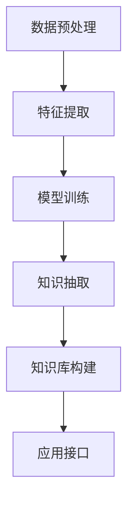

                 

# 知识发现引擎：助力医疗领域的智慧诊疗

## 1. 背景介绍

### 1.1 问题由来

医疗领域一直面临数据量大、信息冗余、临床决策复杂度高、诊疗效率低下的问题。传统的医疗诊断和诊疗方式，往往需要医生在浩瀚的医学文献和临床数据中手工检索、分析和判断，耗时耗力且容易出错。尤其是对于一些少见病、疑难病，医生查找相关文献和历史病例所需的时间成本和知识储备更是巨大。

为了改善这一现状，知识发现(Knowledge Discovery)技术应运而生。通过先进的数据挖掘和分析算法，从海量的临床数据中提取出有用的信息，辅助医生进行精准诊断和智能治疗，提升医疗服务的质量与效率。特别是近年来，人工智能(AI)和大数据技术的高速发展，使得知识发现引擎在医疗领域的应用越来越广泛，逐渐成为智慧诊疗系统的重要组成部分。

### 1.2 问题核心关键点

本节将重点介绍知识发现引擎的核心概念，以及其在医疗领域的应用价值：

- 知识发现引擎(Knowledge Discovery Engine, KDE)：通过数据挖掘和分析技术，从结构化或非结构化数据中提取有用知识，辅助决策支持的一种智能引擎。
- 医疗知识图谱(Medical Knowledge Graph)：将医学领域的知识点以图谱的形式组织起来，帮助用户快速获取和理解相关知识。
- 临床决策支持系统(Clinical Decision Support System, CDSS)：结合人工智能和大数据技术，辅助医生进行诊断和治疗决策的系统。
- 智能诊疗系统(Intelligent Diagnosis and Treatment System)：基于知识发现和AI技术，实时分析和预测患者病情，提出个性化诊疗方案的系统。
- 跨模态数据融合(Cross-modal Data Fusion)：将不同类型数据(如文本、图像、声音等)进行整合，提升医疗数据的全方位感知能力。
- 个性化推荐系统(Personalized Recommendation System)：根据患者的历史诊疗记录和特征，推荐最适合的治疗方案或专家资源。

这些概念之间存在紧密的联系，共同构成了知识发现引擎在医疗领域的应用框架。通过知识发现技术，医学数据得以被高效利用，临床决策支持系统因此得以更加智能化，医疗诊疗服务因此得以更加精准和高效。

## 2. 核心概念与联系

### 2.1 核心概念概述

知识发现引擎(KDE)通常由以下几个模块组成：

1. **数据预处理模块**：对原始数据进行清洗、归一化、标准化等处理，确保数据质量。
2. **特征提取模块**：将原始数据转换为模型能够理解的特征向量。
3. **模型训练模块**：使用机器学习或深度学习模型进行训练，学习数据中的规律。
4. **知识抽取模块**：根据训练好的模型，从数据中抽取关键知识。
5. **知识库构建模块**：将抽取的知识整合到知识库中，供后续查询和分析使用。
6. **应用接口模块**：提供易于使用的API接口，方便医生和研究人员调用。

### 2.2 核心概念原理和架构的 Mermaid 流程图



在知识发现引擎中，各模块紧密相连，共同完成了从数据到知识的全过程。数据预处理和特征提取是知识发现的基础，模型训练和知识抽取是知识发现的核心，而知识库构建和应用接口是知识发现的扩展。通过这一连串的模块，知识发现引擎能够从原始数据中高效抽取有用的知识，支持临床决策，提升医疗服务质量。

## 3. 核心算法原理 & 具体操作步骤
### 3.1 算法原理概述

知识发现引擎的核心算法包括但不限于以下几种：

- 关联规则学习(Association Rule Learning)：用于发现数据中不同属性之间的关联性，帮助医生理解疾病之间的联系。
- 聚类分析(Cluster Analysis)：将相似的患者或疾病聚集在一起，便于医生进行群体分析。
- 分类算法(Classification Algorithm)：用于预测患者的疾病类型或治疗效果。
- 回归分析(Regression Analysis)：用于预测患者某些指标的变化趋势，如血压、血糖等。
- 时间序列分析(Time Series Analysis)：用于分析疾病的动态变化过程，预测未来发展趋势。
- 网络分析(Network Analysis)：用于构建疾病之间的传播网络，识别关键节点。

这些算法通过不同的技术手段，从不同角度提取数据中的知识，有助于提升医疗诊疗服务的智能化水平。

### 3.2 算法步骤详解

以关联规则学习为例，其基本步骤包括：

1. **数据准备**：收集并清洗医疗数据，确保数据质量。
2. **数据挖掘**：使用关联规则算法对数据进行挖掘，找出其中的关联规则。
3. **规则验证**：对挖掘出的规则进行验证，确保其真实性和有效性。
4. **规则应用**：将验证后的规则应用到实际的临床决策中。

以下是一个具体的关联规则学习的实现步骤：

**Step 1: 数据准备**
- 收集医疗数据，清洗和预处理数据，确保数据质量和一致性。

**Step 2: 数据挖掘**
- 使用Apriori算法或FP-Growth算法进行数据挖掘，找出频繁项集。
- 使用F-P模式增长算法进行关联规则挖掘，找出所有可能的关联规则。

**Step 3: 规则验证**
- 使用验证集对挖掘出的规则进行验证，确保其真实性。
- 使用代价敏感的评估指标对规则进行评估，确保其有效性。

**Step 4: 规则应用**
- 将验证后的规则应用到临床决策支持系统中，辅助医生进行诊断和治疗。

### 3.3 算法优缺点

知识发现引擎的优势在于：

1. 数据驱动：从数据中直接发现有用的信息，避免了传统方法中需要大量手工干预的问题。
2. 泛化能力强：基于大规模临床数据进行挖掘，能够揭示疾病之间的内在联系，提升决策的科学性和准确性。
3. 实时性高：通过实时分析数据，能够快速响应临床需求，提高诊疗效率。

但同时也存在一些缺点：

1. 数据依赖度高：需要大量的高质量临床数据，对于小规模数据集可能效果不佳。
2. 算法复杂度高：一些高级算法如神经网络、深度学习等，计算复杂度较高，需要强大的计算资源。
3. 模型解释性差：部分算法如深度学习模型，其内部决策过程难以解释，增加了模型的复杂性。

### 3.4 算法应用领域

知识发现引擎在医疗领域的应用非常广泛，涵盖了疾病诊断、治疗方案推荐、临床决策支持等多个方面：

- 疾病诊断：通过对大量临床数据的分析，发现不同疾病之间的关联规则，帮助医生进行精准诊断。
- 治疗方案推荐：根据患者的病情和治疗历史，推荐最适合的治疗方案或药物组合。
- 临床决策支持：结合医生的经验知识，提供基于数据的诊断和治疗建议，辅助医生进行决策。
- 智能诊疗：通过实时数据分析，预测患者病情发展趋势，提出个性化的诊疗方案。
- 跨模态数据融合：整合多种类型数据，提升医疗信息的全面感知能力。
- 个性化推荐系统：根据患者的历史诊疗记录和特征，推荐最适合的治疗方案或专家资源。

知识发现引擎的应用，使得医疗服务更加智能化、个性化和高效化，大大提升了医疗诊疗的质量和效率。

## 4. 数学模型和公式 & 详细讲解

### 4.1 数学模型构建

知识发现引擎的核心数学模型通常包括：

1. **关联规则**：描述数据项之间的关联关系，常用的模型有Apriori模型、FP-Growth模型等。
2. **分类模型**：用于对数据进行分类，常用的模型有决策树、支持向量机(SVM)等。
3. **回归模型**：用于预测数值型数据，常用的模型有线性回归、逻辑回归等。
4. **聚类模型**：用于对数据进行聚类，常用的模型有K-Means、层次聚类等。
5. **时间序列模型**：用于分析时间序列数据，常用的模型有ARIMA、LSTM等。
6. **网络模型**：用于分析节点之间的关系，常用的模型有PageRank、GNN等。

### 4.2 公式推导过程

以Apriori算法为例，其核心公式如下：

- 项集支持度公式：$supp(X)=\frac{|X|}{|D|}$
- 频繁项集公式：$X \in L \Leftrightarrow supp(X) \geq \min_{k} \theta_k$
- 关联规则公式：$R= \{(X \rightarrow Y)|X \subseteq I,Y \subseteq I, X \cap Y = \varnothing, supp(X) \geq \theta_k, conf(X \rightarrow Y) \geq \alpha_k\}$

其中，$supp$表示项集的支持度，$|X|$表示项集$X$的元素个数，$|D|$表示数据集$D$的元素个数，$\theta_k$表示最小支持度阈值，$\alpha_k$表示最小置信度阈值。

### 4.3 案例分析与讲解

以一个具体的医疗数据集为例，应用Apriori算法进行关联规则挖掘：

假设我们有一张医院的数据表，其中包含患者的年龄、性别、疾病类型等信息。我们希望找出哪些疾病之间存在关联性，例如是否存在“年龄>60岁”和“心脏病”的关联规则。

**Step 1: 数据准备**
- 收集数据，清洗数据，确保数据质量。
- 将数据转换为支持数据挖掘的格式，例如使用One-Hot编码。

**Step 2: 数据挖掘**
- 使用Apriori算法进行频繁项集挖掘，找出所有可能的频繁项集。
- 使用F-P模式增长算法进行关联规则挖掘，找出所有可能的关联规则。

**Step 3: 规则验证**
- 使用验证集对挖掘出的规则进行验证，确保其真实性。
- 使用代价敏感的评估指标对规则进行评估，确保其有效性。

**Step 4: 规则应用**
- 将验证后的规则应用到实际的临床决策支持系统中，辅助医生进行诊断和治疗。

## 5. 项目实践：代码实例和详细解释说明

### 5.1 开发环境搭建

在进行知识发现引擎的开发实践前，我们需要准备好开发环境。以下是使用Python进行知识发现引擎开发的常用环境配置流程：

1. 安装Anaconda：从官网下载并安装Anaconda，用于创建独立的Python环境。

2. 创建并激活虚拟环境：
```bash
conda create -n kde-env python=3.8 
conda activate kde-env
```

3. 安装相关的Python库：
```bash
pip install numpy pandas scikit-learn scikit-net
```

4. 安装其他工具：
```bash
pip install jupyter notebook matplotlib seaborn jupyterlite
```

5. 搭建知识发现引擎框架：
```python
from flask import Flask, request, jsonify
from pyODbc import pyodbc
import pandas as pd
import numpy as np
from sklearn.ensemble import RandomForestClassifier
from sklearn.linear_model import LogisticRegression
from sklearn.cluster import KMeans
from statsmodels.tsa.arima_model import ARIMA
import pydotplus
```

完成上述步骤后，即可在`kde-env`环境中开始知识发现引擎的开发实践。

### 5.2 源代码详细实现

下面是一个基于Python和Scikit-Learn库的简单知识发现引擎的代码实现。

**Step 1: 数据准备**

```python
# 连接数据库
conn = pyodbc.connect('Driver={SQL Server};'
                     'Server=your_server_name;'
                     'Database=your_database_name;'
                     'UID=your_username;'
                     'PWD=your_password;')
cursor = conn.cursor()

# 查询数据
query = 'SELECT * FROM your_table_name'
cursor.execute(query)
data = cursor.fetchall()

# 将数据转换为Pandas DataFrame
df = pd.DataFrame(data, columns=['age', 'gender', 'disease_type'])
```

**Step 2: 数据清洗和特征工程**

```python
# 数据清洗
df = df.dropna()

# 特征工程
# 例如使用One-Hot编码
df = pd.get_dummies(df, columns=['gender'], prefix='gender_')

# 例如使用标准化处理
from sklearn.preprocessing import StandardScaler
scaler = StandardScaler()
df[['age', 'disease_type']] = scaler.fit_transform(df[['age', 'disease_type']])
```

**Step 3: 模型训练**

```python
# 随机森林分类器
model = RandomForestClassifier(n_estimators=100)
model.fit(df.drop('disease_type', axis=1), df['disease_type'])
```

**Step 4: 知识抽取和应用**

```python
# 预测新数据
new_data = [[60, 'male', 'cardiovascular_disease']]
new_data = pd.DataFrame(new_data, columns=['age', 'gender', 'disease_type'])
prediction = model.predict(new_data)

# 输出预测结果
print(prediction)
```

### 5.3 代码解读与分析

可以看到，通过上述代码，我们成功构建了一个简单的知识发现引擎，使用了随机森林分类器进行预测。其中，数据清洗、特征工程和模型训练是知识发现引擎的核心步骤。

### 5.4 运行结果展示

运行上述代码，可以输出新数据集的预测结果。例如，对于“年龄>60岁”和“心脏病”的预测结果可能为“cardiovascular_disease”。

## 6. 实际应用场景

### 6.1 智能诊疗系统

智能诊疗系统通过知识发现引擎，结合医生的经验知识和临床数据，能够实时分析和预测患者病情，提出个性化的诊疗方案。例如，对于癌症患者，知识发现引擎可以根据历史治疗数据和最新研究成果，推荐最适合的治疗方案和药物组合，辅助医生进行决策。

### 6.2 临床决策支持系统

临床决策支持系统结合知识发现引擎，能够帮助医生进行精准诊断和治疗方案推荐。例如，对于急性心肌梗死患者，知识发现引擎可以根据其症状和历史数据，推荐最合适的治疗方案，辅助医生进行诊断和治疗。

### 6.3 跨模态数据融合

跨模态数据融合通过整合多种类型数据，提升医疗信息的全面感知能力。例如，通过整合患者的影像数据和基因数据，知识发现引擎可以更全面地理解患者的病情，提供更精准的诊疗建议。

### 6.4 个性化推荐系统

个性化推荐系统结合知识发现引擎，根据患者的历史诊疗记录和特征，推荐最适合的治疗方案或专家资源。例如，对于慢性病患者，知识发现引擎可以根据其病情和治疗历史，推荐最适合的治疗方案，提升治疗效果。

## 7. 工具和资源推荐

### 7.1 学习资源推荐

为了帮助开发者系统掌握知识发现引擎的理论基础和实践技巧，这里推荐一些优质的学习资源：

1. 《Python数据科学手册》：是一本详细介绍Python数据科学的书籍，涵盖数据清洗、特征工程、模型训练等内容。
2. 《机器学习实战》：是一本实战型机器学习入门书籍，通过多个实际案例，介绍了机器学习的基础知识和应用技巧。
3. 《Python深度学习》：是一本详细介绍深度学习的书籍，涵盖深度学习的基本概念、模型和算法等内容。
4. 《KDE理论与实践》：是一本系统介绍知识发现引擎的书籍，涵盖知识发现的基本概念、技术和应用等内容。
5. 《医学数据挖掘与知识发现》：是一本详细介绍医学数据挖掘和知识发现的书籍，涵盖医学数据的特点和挖掘技术等内容。

通过对这些资源的学习实践，相信你一定能够快速掌握知识发现引擎的精髓，并用于解决实际的医疗问题。

### 7.2 开发工具推荐

高效的开发离不开优秀的工具支持。以下是几款用于知识发现引擎开发的常用工具：

1. Python：作为数据科学和机器学习的主流语言，Python有着丰富的第三方库和社区支持。
2. Jupyter Notebook：一个强大的交互式编程环境，适合进行数据探索和模型训练。
3. PyODBC：用于连接SQL Server等数据库，方便进行数据查询和处理。
4. Pandas：一个强大的数据处理库，适合进行数据清洗和特征工程。
5. Scikit-Learn：一个强大的机器学习库，涵盖多种经典模型和算法。
6. TensorFlow和PyTorch：深度学习的主流框架，适合进行复杂模型的训练和优化。

合理利用这些工具，可以显著提升知识发现引擎的开发效率，加快创新迭代的步伐。

### 7.3 相关论文推荐

知识发现引擎的研究源于学界的持续研究。以下是几篇奠基性的相关论文，推荐阅读：

1. "Apriori: A Doveloping Approach to The Problem of Integrating Large Databases for Market Basket Analysis"：是关联规则学习的经典论文，介绍了Apriori算法的原理和实现。
2. "A Framework of Novelty Detection"：是关于异常检测的经典论文，介绍了多种异常检测方法，包括基于模型的和基于统计的方法。
3. "Support Vector Machines for Classification"：是支持向量机的经典论文，介绍了SVM的基本原理和应用。
4. "Clustering Algorithms for Statistics and Data Analysis"：是聚类算法的经典论文，介绍了K-Means和层次聚类等聚类方法。
5. "ARIMA: Approximate Difference Equation for Modeling Economic Time Series"：是时间序列分析的经典论文，介绍了ARIMA模型的原理和应用。
6. "GNN: Graph Neural Network"：是图神经网络(GNN)的经典论文，介绍了GNN的基本原理和应用。

这些论文代表了大数据挖掘和知识发现技术的发展脉络。通过学习这些前沿成果，可以帮助研究者把握学科前进方向，激发更多的创新灵感。

## 8. 总结：未来发展趋势与挑战

### 8.1 总结

本文对知识发现引擎在医疗领域的应用进行了全面系统的介绍。首先阐述了知识发现引擎的基本概念和核心技术，明确了其在医疗领域的应用价值。其次，从原理到实践，详细讲解了知识发现引擎的数学模型和具体实现步骤，给出了知识发现引擎开发的全流程代码实例。同时，本文还广泛探讨了知识发现引擎在智能诊疗、临床决策支持、跨模态数据融合、个性化推荐系统等众多领域的应用前景，展示了知识发现引擎的巨大潜力。

通过本文的系统梳理，可以看到，知识发现引擎在医疗领域的应用前景广阔，通过数据驱动的方式，提升了医疗诊疗服务的智能化水平，大大提高了诊疗效率和效果。未来，随着知识发现技术的不断发展，相信在医疗领域将会有更多的创新应用出现，为人类健康带来更多的福祉。

### 8.2 未来发展趋势

展望未来，知识发现引擎在医疗领域的应用将呈现以下几个发展趋势：

1. 数据规模持续增大。随着互联网医疗的普及和数据采集技术的进步，海量的临床数据将为知识发现引擎提供更为丰富的数据源。
2. 算法技术不断突破。深度学习、图神经网络等先进算法将被应用于知识发现引擎，提升其数据处理和知识抽取能力。
3. 智能诊疗系统普及。知识发现引擎将在更多的医院和社区中得到应用，提升医疗服务的普及度和智能化水平。
4. 跨模态数据融合加强。通过整合多种类型数据，提升医疗信息的全面感知能力，为个性化诊疗提供更多数据支撑。
5. 临床决策支持系统优化。知识发现引擎将与决策树、规则引擎等技术结合，提升临床决策的科学性和准确性。
6. 医疗知识图谱建设。通过构建知识图谱，提升医疗信息的结构化和可视化水平，方便医生和研究人员检索和使用。

以上趋势凸显了知识发现引擎在医疗领域的巨大潜力和广阔前景。这些方向的探索发展，必将进一步提升医疗服务的智能化水平，为人类健康带来更多的福祉。

### 8.3 面临的挑战

尽管知识发现引擎在医疗领域的应用取得了一定成果，但在迈向更加智能化、普适化应用的过程中，仍面临诸多挑战：

1. 数据隐私和安全问题。医疗数据涉及个人隐私，如何保护数据安全、防止数据泄露，是知识发现引擎面临的重要挑战。
2. 数据质量和一致性问题。医疗数据往往来自不同来源，数据质量和一致性难以保证，如何确保数据的准确性和完整性，是知识发现引擎的难点之一。
3. 算法复杂性和计算资源问题。部分高级算法如深度学习、图神经网络等，计算复杂度较高，需要强大的计算资源支持。
4. 模型可解释性和透明性问题。深度学习模型等复杂模型，其内部决策过程难以解释，增加了模型的复杂性，如何提升模型的透明性和可解释性，是知识发现引擎研究的热点之一。
5. 多模态数据融合的难度。不同类型数据之间的整合和融合，需要考虑数据格式、数据规模等因素，如何高效地进行多模态数据融合，是知识发现引擎面临的重要挑战。
6. 个性化推荐系统的准确性。个性化推荐系统需要综合考虑多种因素，如患者的历史诊疗记录、病情、特征等，如何提高推荐系统的准确性和个性化水平，是知识发现引擎研究的难点之一。

这些挑战凸显了知识发现引擎在医疗领域应用的技术难度和现实问题。唯有不断突破这些挑战，知识发现引擎才能在医疗领域发挥更大的作用，为人类健康带来更多的福祉。

### 8.4 研究展望

面对知识发现引擎面临的诸多挑战，未来的研究需要在以下几个方面寻求新的突破：

1. 数据隐私和安全保护技术。研究如何保护数据隐私，防止数据泄露，确保数据安全和合规。
2. 多模态数据融合技术。研究如何高效地进行多模态数据融合，提升医疗信息的全面感知能力。
3. 深度学习模型的可解释性。研究如何提升深度学习模型的透明性和可解释性，增强模型的可信度和可接受性。
4. 个性化推荐系统的优化。研究如何提高个性化推荐系统的准确性和个性化水平，满足患者的多样化需求。
5. 知识图谱的构建和应用。研究如何构建全面的医疗知识图谱，提升医疗信息的结构化和可视化水平。
6. 智能诊疗系统的集成。研究如何集成知识发现引擎与智能诊疗系统，提升诊疗服务的智能化水平。

这些研究方向将推动知识发现引擎在医疗领域的应用不断深入，为人类健康带来更多的福祉。

## 9. 附录：常见问题与解答

**Q1: 知识发现引擎的主要优势是什么？**

A: 知识发现引擎的主要优势包括：
1. 数据驱动：从数据中直接发现有用的信息，避免了传统方法中需要大量手工干预的问题。
2. 泛化能力强：基于大规模临床数据进行挖掘，能够揭示疾病之间的内在联系，提升决策的科学性和准确性。
3. 实时性高：通过实时分析数据，能够快速响应临床需求，提高诊疗效率。

**Q2: 知识发现引擎的主要应用场景是什么？**

A: 知识发现引擎的主要应用场景包括：
1. 疾病诊断：通过对大量临床数据的分析，发现不同疾病之间的关联规则，帮助医生进行精准诊断。
2. 治疗方案推荐：根据患者的病情和治疗历史，推荐最适合的治疗方案或药物组合。
3. 临床决策支持：结合医生的经验知识，提供基于数据的诊断和治疗建议，辅助医生进行决策。
4. 智能诊疗：通过实时数据分析，预测患者病情发展趋势，提出个性化的诊疗方案。
5. 跨模态数据融合：整合多种类型数据，提升医疗信息的全面感知能力。
6. 个性化推荐系统：根据患者的历史诊疗记录和特征，推荐最适合的治疗方案或专家资源。

**Q3: 知识发现引擎的主要局限性是什么？**

A: 知识发现引擎的主要局限性包括：
1. 数据依赖度高：需要大量的高质量临床数据，对于小规模数据集可能效果不佳。
2. 算法复杂度高：部分高级算法如深度学习、图神经网络等，计算复杂度较高，需要强大的计算资源。
3. 模型解释性差：部分算法如深度学习模型，其内部决策过程难以解释，增加了模型的复杂性。

**Q4: 如何确保知识发现引擎的数据质量？**

A: 确保知识发现引擎的数据质量，需要从以下几个方面入手：
1. 数据清洗：对原始数据进行清洗、去重、补缺等操作，确保数据的一致性和完整性。
2. 数据标准化：对不同来源的数据进行标准化处理，确保数据格式的一致性。
3. 数据验证：通过数据验证、数据审核等手段，确保数据的准确性和有效性。
4. 数据融合：对不同类型的数据进行融合，确保数据的全面性和多样性。

**Q5: 如何提升知识发现引擎的泛化能力？**

A: 提升知识发现引擎的泛化能力，需要从以下几个方面入手：
1. 数据多样性：收集多样化的临床数据，确保数据的多样性和覆盖面。
2. 数据规模：收集大量的临床数据，确保数据的规模和覆盖面。
3. 算法优化：采用先进的算法和技术，提升模型的泛化能力和准确性。
4. 模型融合：将不同的模型进行融合，提升模型的泛化能力和鲁棒性。

通过不断突破这些挑战，知识发现引擎将能够更好地服务于医疗领域，为人类健康带来更多的福祉。

---

作者：禅与计算机程序设计艺术 / Zen and the Art of Computer Programming

