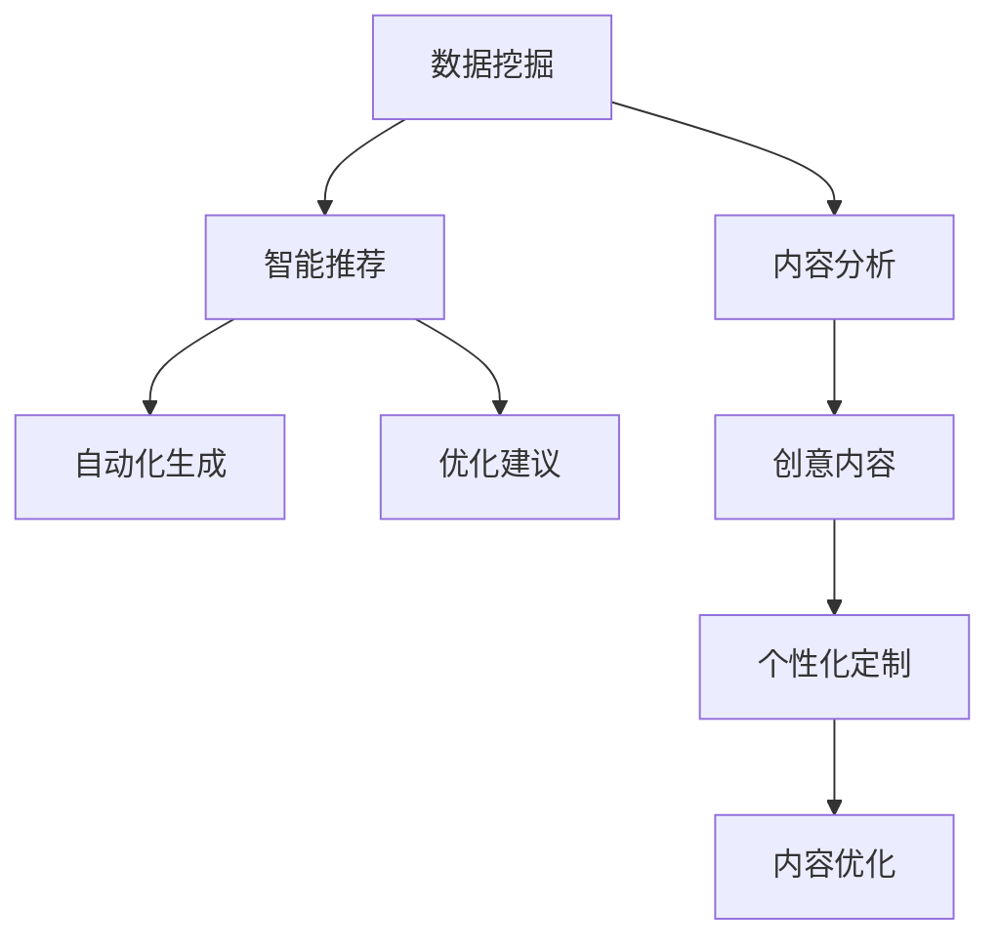

                 

# 知识发现引擎：推动创意产业的内容革命

> 关键词：知识发现引擎, 内容分析, 创意产业, 数据挖掘, 数据分析

## 1. 背景介绍

### 1.1 问题由来

在数字化时代，创意产业的内容创造与消费模式发生了翻天覆地的变化。一方面，互联网和移动设备的普及使得内容生产与传播的门槛大幅降低，内容创作人群呈指数级增长；另一方面，消费者对个性化、互动性、真实性等内容质量的要求也在不断提高。面对这一趋势，如何通过先进技术手段提升创意产业内容分析与处理的效率，挖掘其中的知识价值，成为行业内外的焦点。

知识发现引擎（Knowledge Discovery Engine, KDE）作为一门结合了数据挖掘、人工智能和内容分析的前沿技术，为创意产业带来了革命性的变化。该技术能够深度挖掘大规模数据中的知识模式和潜在信息，通过分析用户行为、内容创作和传播效果，提供精准的内容推荐、个性化定制和创意优化方案，从而显著提升创意内容的质量和市场竞争力。

### 1.2 问题核心关键点

知识发现引擎的核心目标是通过对大规模数据进行分析，挖掘其中的知识模式和潜在信息。其核心算法包括数据挖掘、自然语言处理（NLP）、图像识别、音频分析等，综合运用机器学习、深度学习和人工智能技术，提升内容的创作效率和质量，实现内容自动生成、推荐、优化和优化等功能。

知识发现引擎的关键点在于：
1. **数据挖掘**：从海量数据中提取出有价值的信息和知识模式。
2. **内容分析**：理解创意内容的语义和结构，为后续分析提供依据。
3. **智能推荐**：基于用户行为和内容属性，提供个性化的内容推荐。
4. **自动化生成**：通过模型自动生成创意内容，提升创作效率。
5. **优化建议**：根据分析结果提供优化建议，提升内容质量。

这些关键点共同构成知识发现引擎的核心功能，通过它们可以极大地提升创意产业的内容处理能力，为内容创作者、出版商、广告商等提供有力支持。

## 2. 核心概念与联系

### 2.1 核心概念概述

为更好地理解知识发现引擎的概念与架构，本节将介绍几个密切相关的核心概念：

- **知识发现引擎**：一种能够从大规模数据中挖掘知识模式和潜在信息的数据分析工具。它通常结合了数据挖掘、机器学习、自然语言处理和图像识别等技术，用于分析创意内容的数据集，识别其中的关键信息，并生成可操作的洞察。

- **数据挖掘**：通过算法从大规模数据中提取出有价值的信息和知识模式。常用的数据挖掘技术包括关联规则学习、聚类分析、分类和回归等。

- **内容分析**：指对文本、图像、音频等创意内容进行语义和结构分析，提取其中的关键词、情感、主题等关键信息。

- **智能推荐**：基于用户行为和内容属性，推荐符合用户兴趣和需求的内容，实现个性化定制。

- **自动化生成**：利用机器学习模型自动生成创意内容，如新闻稿、广告文案等，提升内容创作效率。

- **优化建议**：根据分析结果提供内容质量提升的优化建议，如调整内容主题、优化风格等。

这些核心概念之间的逻辑关系可以通过以下Mermaid流程图来展示：



这个流程图展示了数据挖掘、内容分析、智能推荐、自动化生成和优化建议之间的联系：

1. 数据挖掘从原始数据中提取出有价值的信息和知识模式。
2. 内容分析用于理解创意内容的语义和结构，为后续分析提供依据。
3. 智能推荐基于用户行为和内容属性，提供个性化的内容推荐。
4. 自动化生成利用模型自动生成创意内容，提升创作效率。
5. 优化建议根据分析结果提供优化建议，提升内容质量。

这些核心概念共同构成了知识发现引擎的分析与处理框架，使其能够在各种场景下发挥强大的知识挖掘和内容优化能力。

## 3. 核心算法原理 & 具体操作步骤

### 3.1 算法原理概述

知识发现引擎的算法原理主要围绕以下几个关键步骤展开：

1. **数据预处理**：对原始数据进行清洗、去重、归一化等处理，保证数据质量。
2. **特征提取**：从处理后的数据中提取关键特征，为后续分析提供依据。
3. **模型训练**：利用机器学习算法训练模型，提取数据中的知识模式和潜在信息。
4. **内容分析**：对创意内容进行语义和结构分析，提取其中的关键词、情感、主题等关键信息。
5. **智能推荐**：基于用户行为和内容属性，推荐符合用户兴趣和需求的内容。
6. **自动化生成**：利用模型自动生成创意内容，提升创作效率。
7. **优化建议**：根据分析结果提供内容质量提升的优化建议。

这些步骤共同构成知识发现引擎的核心算法流程，通过它们可以极大地提升创意产业的内容处理能力，为内容创作者、出版商、广告商等提供有力支持。

### 3.2 算法步骤详解

以下是知识发现引擎的核心算法步骤详解：

**Step 1: 数据预处理**

数据预处理是知识发现引擎的第一步，主要包括以下几个关键步骤：

1. **数据清洗**：去除数据中的噪声和异常值，确保数据质量。
2. **数据归一化**：将数据转换为标准格式，便于后续处理。
3. **特征选择**：选择对目标任务有重要影响的关键特征。
4. **数据划分**：将数据划分为训练集和测试集，用于模型训练和评估。

**Step 2: 特征提取**

特征提取是将原始数据转换为模型可处理的特征向量的过程。常用的特征提取方法包括：

1. **文本特征提取**：将文本转换为TF-IDF、词袋模型、词嵌入等形式。
2. **图像特征提取**：使用CNN等深度学习模型提取图像的特征向量。
3. **音频特征提取**：使用MFCC等算法提取音频的特征向量。

**Step 3: 模型训练**

模型训练是知识发现引擎的核心步骤，主要包括以下几个关键算法：

1. **分类算法**：用于将数据分为不同类别，如朴素贝叶斯、支持向量机等。
2. **聚类算法**：用于将数据分为不同的群组，如K-means、层次聚类等。
3. **关联规则算法**：用于挖掘数据中的关联规则，如Apriori、FP-growth等。
4. **回归算法**：用于预测数值型数据，如线性回归、逻辑回归等。

**Step 4: 内容分析**

内容分析是将创意内容进行语义和结构分析的过程。常用的内容分析方法包括：

1. **文本情感分析**：判断文本的情感倾向，如正面、负面、中性等。
2. **文本主题分析**：提取文本的主题和关键词，如LDA、TF-IDF等。
3. **文本分类**：将文本分为不同的类别，如情感分类、主题分类等。

**Step 5: 智能推荐**

智能推荐是基于用户行为和内容属性，推荐符合用户兴趣和需求的内容。常用的智能推荐算法包括：

1. **协同过滤算法**：通过分析用户历史行为，推荐相似用户喜欢的内容。
2. **基于内容的推荐**：通过分析内容的特征，推荐与用户兴趣相似的内容。
3. **混合推荐算法**：结合协同过滤和基于内容的推荐算法，提升推荐效果。

**Step 6: 自动化生成**

自动化生成是利用模型自动生成创意内容的过程。常用的自动化生成方法包括：

1. **文本生成模型**：如GPT、Transformer等，用于生成新闻稿、广告文案等。
2. **图像生成模型**：如GAN、VAE等，用于生成创意图像。
3. **音频生成模型**：如WaveNet等，用于生成创意音频。

**Step 7: 优化建议**

优化建议是根据分析结果提供内容质量提升的优化建议。常用的优化方法包括：

1. **内容主题优化**：调整内容的主题和关键词，提升内容的相关性和吸引力。
2. **内容风格优化**：调整内容的语言风格和表达方式，提升内容的可读性和吸引力。
3. **内容结构优化**：调整内容的结构和组织方式，提升内容的逻辑性和结构性。

### 3.3 算法优缺点

知识发现引擎具有以下优点：

1. **高效性**：通过自动化和智能化的方式，能够快速处理大规模数据，提取有价值的信息和知识模式。
2. **精确性**：利用机器学习和深度学习技术，能够精确地分析创意内容，提供精准的推荐和优化建议。
3. **个性化**：通过分析用户行为和内容属性，能够提供个性化的内容推荐，提升用户体验。
4. **自动化**：能够自动生成创意内容，提升创作效率，降低人工成本。

同时，知识发现引擎也存在一些缺点：

1. **数据质量依赖**：需要高质量的数据才能提取有价值的信息和知识模式，数据质量不好会影响分析结果。
2. **模型复杂度较高**：需要训练复杂的机器学习模型，对计算资源和算法要求较高。
3. **需要专业人才**：需要专业的数据科学家和算法工程师进行模型设计和调参，技术门槛较高。
4. **结果解释性差**：由于使用了深度学习模型，结果解释性较差，难以理解和调试。

尽管存在这些缺点，但知识发现引擎在创意产业的应用中仍然具有广泛的前景，其高效、精确和个性化的优势可以显著提升创意内容的质量和市场竞争力。

### 3.4 算法应用领域

知识发现引擎在创意产业的应用领域非常广泛，涵盖以下几个方面：

- **内容推荐**：根据用户的历史行为和兴趣，推荐符合其需求的内容。
- **创意优化**：分析创意内容的质量和效果，提供优化建议，提升创作质量。
- **版权保护**：通过分析创意内容，识别版权侵权行为，保护知识产权。
- **广告优化**：分析广告效果，优化广告投放策略，提升广告效果。
- **市场分析**：分析市场趋势和用户需求，提供市场洞察，指导商业决策。
- **用户行为分析**：分析用户行为数据，提供用户洞察，提升用户体验。

这些应用领域展示了知识发现引擎在创意产业的广泛应用价值，为内容创作者、出版商、广告商等提供了有力的支持。

## 4. 数学模型和公式 & 详细讲解  
### 4.1 数学模型构建

本节将使用数学语言对知识发现引擎的算法进行更加严格的刻画。

假设原始数据集为 $D=\{(x_i, y_i)\}_{i=1}^N$，其中 $x_i$ 为输入特征，$y_i$ 为输出标签。知识发现引擎的目标是找到一个模型 $M$，使得模型预测的标签 $\hat{y}$ 与真实标签 $y$ 的误差最小化。

定义模型的预测函数为 $M(x)$，则知识发现引擎的优化目标为：

$$
\min_{M} \frac{1}{N} \sum_{i=1}^N \ell(M(x_i), y_i)
$$

其中 $\ell$ 为损失函数，常用的损失函数包括均方误差（MSE）、交叉熵（Cross Entropy）等。

在模型训练过程中，需要从数据集 $D$ 中随机抽取 $N$ 个样本进行训练，然后计算损失函数的梯度，更新模型参数 $\theta$，公式如下：

$$
\theta \leftarrow \theta - \eta \nabla_{\theta} \frac{1}{N} \sum_{i=1}^N \ell(M(x_i), y_i)
$$

其中 $\eta$ 为学习率，$\nabla_{\theta} \ell$ 为损失函数对模型参数的梯度。

### 4.2 公式推导过程

以下我们以文本分类任务为例，推导交叉熵损失函数及其梯度的计算公式。

假设模型 $M_{\theta}$ 在输入 $x$ 上的输出为 $\hat{y}=M_{\theta}(x) \in [0,1]$，表示样本属于类别 $i$ 的概率。真实标签 $y \in \{1,0\}$。则二分类交叉熵损失函数定义为：

$$
\ell(M_{\theta}(x),y) = -[y\log \hat{y} + (1-y)\log(1-\hat{y})]
$$

将其代入优化目标公式，得：

$$
\min_{\theta} \frac{1}{N} \sum_{i=1}^N \ell(M_{\theta}(x_i), y_i)
$$

根据链式法则，损失函数对模型参数 $\theta_k$ 的梯度为：

$$
\frac{\partial \ell(M_{\theta}(x),y)}{\partial \theta_k} = -\frac{1}{N} \sum_{i=1}^N \left( \frac{y_i}{\hat{y}_i} - \frac{1-y_i}{1-\hat{y}_i} \right) \frac{\partial \hat{y}_i}{\partial \theta_k}
$$

其中 $\frac{\partial \hat{y}_i}{\partial \theta_k}$ 可进一步递归展开，利用自动微分技术完成计算。

在得到损失函数的梯度后，即可带入参数更新公式，完成模型的迭代优化。重复上述过程直至收敛，最终得到适应特定任务的最优模型参数 $\theta^*$。

## 5. 项目实践：代码实例和详细解释说明
### 5.1 开发环境搭建

在进行知识发现引擎的实践前，我们需要准备好开发环境。以下是使用Python进行PyTorch开发的环境配置流程：

1. 安装Anaconda：从官网下载并安装Anaconda，用于创建独立的Python环境。

2. 创建并激活虚拟环境：
```bash
conda create -n pytorch-env python=3.8 
conda activate pytorch-env
```

3. 安装PyTorch：根据CUDA版本，从官网获取对应的安装命令。例如：
```bash
conda install pytorch torchvision torchaudio cudatoolkit=11.1 -c pytorch -c conda-forge
```

4. 安装各类工具包：
```bash
pip install numpy pandas scikit-learn matplotlib tqdm jupyter notebook ipython
```

完成上述步骤后，即可在`pytorch-env`环境中开始知识发现引擎的实践。

### 5.2 源代码详细实现

这里我们以文本分类任务为例，给出使用Transformers库对BERT模型进行文本分类微调的PyTorch代码实现。

首先，定义文本分类任务的数据处理函数：

```python
from transformers import BertTokenizer
from torch.utils.data import Dataset
import torch

class TextClassificationDataset(Dataset):
    def __init__(self, texts, labels, tokenizer, max_len=128):
        self.texts = texts
        self.labels = labels
        self.tokenizer = tokenizer
        self.max_len = max_len
        
    def __len__(self):
        return len(self.texts)
    
    def __getitem__(self, item):
        text = self.texts[item]
        label = self.labels[item]
        
        encoding = self.tokenizer(text, return_tensors='pt', max_length=self.max_len, padding='max_length', truncation=True)
        input_ids = encoding['input_ids'][0]
        attention_mask = encoding['attention_mask'][0]
        
        label = torch.tensor(label, dtype=torch.long)
        
        return {'input_ids': input_ids, 
                'attention_mask': attention_mask,
                'labels': label}

# 加载BERT模型和分词器
model = BertForSequenceClassification.from_pretrained('bert-base-cased', num_labels=2)
tokenizer = BertTokenizer.from_pretrained('bert-base-cased')

# 准备训练集和测试集
train_dataset = TextClassificationDataset(train_texts, train_labels, tokenizer)
test_dataset = TextClassificationDataset(test_texts, test_labels, tokenizer)
```

然后，定义模型和优化器：

```python
from transformers import AdamW

optimizer = AdamW(model.parameters(), lr=2e-5)
```

接着，定义训练和评估函数：

```python
from torch.utils.data import DataLoader
from tqdm import tqdm
from sklearn.metrics import accuracy_score, precision_score, recall_score, f1_score

device = torch.device('cuda') if torch.cuda.is_available() else torch.device('cpu')
model.to(device)

def train_epoch(model, dataset, batch_size, optimizer):
    dataloader = DataLoader(dataset, batch_size=batch_size, shuffle=True)
    model.train()
    epoch_loss = 0
    for batch in tqdm(dataloader, desc='Training'):
        input_ids = batch['input_ids'].to(device)
        attention_mask = batch['attention_mask'].to(device)
        labels = batch['labels'].to(device)
        model.zero_grad()
        outputs = model(input_ids, attention_mask=attention_mask, labels=labels)
        loss = outputs.loss
        epoch_loss += loss.item()
        loss.backward()
        optimizer.step()
    return epoch_loss / len(dataloader)

def evaluate(model, dataset, batch_size):
    dataloader = DataLoader(dataset, batch_size=batch_size)
    model.eval()
    preds, labels = [], []
    with torch.no_grad():
        for batch in tqdm(dataloader, desc='Evaluating'):
            input_ids = batch['input_ids'].to(device)
            attention_mask = batch['attention_mask'].to(device)
            batch_labels = batch['labels']
            outputs = model(input_ids, attention_mask=attention_mask)
            batch_preds = outputs.logits.argmax(dim=2).to('cpu').tolist()
            batch_labels = batch_labels.to('cpu').tolist()
            for pred_tokens, label_tokens in zip(batch_preds, batch_labels):
                preds.append(pred_tokens)
                labels.append(label_tokens)
                
    print(f'Accuracy: {accuracy_score(labels, preds)}')
    print(f'Precision: {precision_score(labels, preds, average="macro")}')
    print(f'Recall: {recall_score(labels, preds, average="macro")}')
    print(f'F1 Score: {f1_score(labels, preds, average="macro")}')
```

最后，启动训练流程并在测试集上评估：

```python
epochs = 5
batch_size = 16

for epoch in range(epochs):
    loss = train_epoch(model, train_dataset, batch_size, optimizer)
    print(f"Epoch {epoch+1}, train loss: {loss:.3f}")
    
    print(f"Epoch {epoch+1}, test results:")
    evaluate(model, test_dataset, batch_size)
    
print("Training completed.")
```

以上就是使用PyTorch对BERT进行文本分类任务微调的完整代码实现。可以看到，得益于Transformers库的强大封装，我们可以用相对简洁的代码完成BERT模型的加载和微调。

### 5.3 代码解读与分析

让我们再详细解读一下关键代码的实现细节：

**TextClassificationDataset类**：
- `__init__`方法：初始化文本、标签、分词器等关键组件。
- `__len__`方法：返回数据集的样本数量。
- `__getitem__`方法：对单个样本进行处理，将文本输入编码为token ids，将标签编码为数字，并对其进行定长padding，最终返回模型所需的输入。

**模型加载与优化器设置**：
- `BertForSequenceClassification`：从HuggingFace的模型库中加载预训练的BERT模型。
- `AdamW`：设置AdamW优化器，用于更新模型参数。

**训练和评估函数**：
- 使用PyTorch的DataLoader对数据集进行批次化加载，供模型训练和推理使用。
- 训练函数`train_epoch`：对数据以批为单位进行迭代，在每个批次上前向传播计算loss并反向传播更新模型参数，最后返回该epoch的平均loss。
- 评估函数`evaluate`：与训练类似，不同点在于不更新模型参数，并在每个batch结束后将预测和标签结果存储下来，最后使用sklearn的指标计算函数对整个评估集的预测结果进行打印输出。

**训练流程**：
- 定义总的epoch数和batch size，开始循环迭代
- 每个epoch内，先在训练集上训练，输出平均loss
- 在测试集上评估，输出分类指标
- 所有epoch结束后，输出训练完成消息

可以看到，PyTorch配合Transformers库使得BERT微调的代码实现变得简洁高效。开发者可以将更多精力放在数据处理、模型改进等高层逻辑上，而不必过多关注底层的实现细节。

当然，工业级的系统实现还需考虑更多因素，如模型的保存和部署、超参数的自动搜索、更灵活的任务适配层等。但核心的微调范式基本与此类似。

## 6. 实际应用场景

### 6.1 内容推荐

内容推荐是知识发现引擎的重要应用场景之一。在搜索引擎、视频网站、电商平台等平台，内容推荐能够显著提升用户体验，增加用户粘性，带来更高的商业价值。

在技术实现上，知识发现引擎可以通过分析用户历史行为和偏好，挖掘创意内容中的关键信息，提供个性化的内容推荐。例如，在电商平台中，可以收集用户浏览、购买、评价等数据，将其转换为向量形式，输入到模型中进行训练。模型能够学习用户的历史行为和偏好，并预测用户对未来内容的兴趣，从而提供精准的推荐结果。

### 6.2 创意优化

创意优化是知识发现引擎的另一重要应用场景。创意产业中，内容的创作与质量直接影响其市场表现。知识发现引擎可以通过分析创意内容的数据集，识别其中的知识模式和潜在信息，提供优化建议，提升内容质量。

在新闻媒体领域，知识发现引擎可以分析热门新闻的标题、关键词、主题等，提取其中的关键信息，提供新闻标题优化建议，提升新闻的点击率和阅读量。在广告营销中，知识发现引擎可以分析广告的效果和用户反馈，提供广告内容优化建议，提升广告的投放效果和转化率。

### 6.3 版权保护

版权保护是创意产业的重要需求之一。知识发现引擎可以通过分析创意内容的数据集，识别其中的版权信息，保护知识产权。

在数字出版领域，知识发现引擎可以分析版权声明、标注信息等数据，自动识别内容是否存在版权侵权行为，提供版权保护建议，保护作者的权益。在音乐、影视等领域，知识发现引擎可以分析音频、视频等数据，自动识别其中的版权信息，保护创作者的权益。

### 6.4 市场分析

市场分析是知识发现引擎的重要应用场景之一。通过分析市场数据，知识发现引擎能够提供市场趋势、用户需求等洞察，指导商业决策。

在金融领域，知识发现引擎可以分析股票市场的数据，提取其中的关键信息，提供市场趋势预测和风险预警，指导投资决策。在零售领域，知识发现引擎可以分析消费数据，提取其中的市场趋势和用户需求，提供市场洞察，指导商品采购和库存管理。

### 6.5 用户行为分析

用户行为分析是知识发现引擎的重要应用场景之一。通过分析用户行为数据，知识发现引擎能够提供用户洞察，提升用户体验。

在社交媒体领域，知识发现引擎可以分析用户的评论、点赞、分享等行为数据，提取其中的关键信息，提供用户洞察，指导内容创作和广告投放。在在线教育领域，知识发现引擎可以分析学生的学习数据，提取其中的关键信息，提供学习效果评估和个性化推荐，提升学习效果。

## 7. 工具和资源推荐
### 7.1 学习资源推荐

为了帮助开发者系统掌握知识发现引擎的理论基础和实践技巧，这里推荐一些优质的学习资源：

1. 《数据挖掘导论》：详细介绍了数据挖掘的基本概念和常用算法，适合初学者系统入门。
2. 《深度学习》：吴恩达教授的经典课程，介绍了深度学习的基本概念和应用场景，适合进阶学习。
3. 《自然语言处理综论》：林达华教授的课程，介绍了自然语言处理的基本概念和常用技术，适合进阶学习。
4. 《Python数据科学手册》：详细介绍Python在数据科学中的应用，适合动手实践。
5. Weights & Biases：模型训练的实验跟踪工具，可以记录和可视化模型训练过程中的各项指标，方便对比和调优。

通过对这些资源的学习实践，相信你一定能够快速掌握知识发现引擎的核心技术，并用于解决实际的创意产业问题。

### 7.2 开发工具推荐

高效的开发离不开优秀的工具支持。以下是几款用于知识发现引擎开发的常用工具：

1. PyTorch：基于Python的开源深度学习框架，灵活动态的计算图，适合快速迭代研究。
2. TensorFlow：由Google主导开发的开源深度学习框架，生产部署方便，适合大规模工程应用。
3. HuggingFace Transformers库：提供了多种预训练模型和工具，方便进行自然语言处理任务。
4. Weights & Biases：模型训练的实验跟踪工具，可以记录和可视化模型训练过程中的各项指标，方便对比和调优。
5. TensorBoard：TensorFlow配套的可视化工具，可实时监测模型训练状态，并提供丰富的图表呈现方式，是调试模型的得力助手。

合理利用这些工具，可以显著提升知识发现引擎的开发效率，加快创新迭代的步伐。

### 7.3 相关论文推荐

知识发现引擎的技术发展源于学界的持续研究。以下是几篇奠基性的相关论文，推荐阅读：

1. Association Rules: Mining, Evaluation, and Generalization：提出了关联规则学习的基本框架，是数据挖掘领域的经典论文。
2. Text Mining: Techniques and Applications：介绍了文本挖掘的基本概念和常用算法，是自然语言处理领域的经典教材。
3. Deep Learning for NLP：吴恩达教授的深度学习在NLP中的应用，介绍了多种NLP任务和模型。
4. Knowledge Discovery in Databases: An Introduction：介绍了知识发现的基本概念和常用技术，是知识发现领域的经典教材。
5. Mining Massive Datasets: Pattern Discovery in Large Data Sets：介绍了大规模数据挖掘的基本概念和常用算法，是数据挖掘领域的经典教材。

这些论文代表了大语言模型微调技术的发展脉络。通过学习这些前沿成果，可以帮助研究者把握学科前进方向，激发更多的创新灵感。

## 8. 总结：未来发展趋势与挑战

### 8.1 总结

本文对知识发现引擎的理论基础和实践技巧进行了全面系统的介绍。首先阐述了知识发现引擎的研究背景和意义，明确了知识发现引擎在创意产业中的重要价值。其次，从原理到实践，详细讲解了知识发现引擎的核心算法流程，给出了微调任务开发的完整代码实例。同时，本文还广泛探讨了知识发现引擎在内容推荐、创意优化、版权保护、市场分析等众多领域的应用前景，展示了知识发现引擎的广阔应用价值。

通过本文的系统梳理，可以看到，知识发现引擎通过深度挖掘大规模数据中的知识模式和潜在信息，显著提升了创意产业的内容处理能力，为内容创作者、出版商、广告商等提供了有力的支持。未来，伴随知识发现引擎技术的不断演进，相信创意产业的内容分析和处理能力将得到进一步提升，为创意产业的创新发展注入新的动力。

### 8.2 未来发展趋势

展望未来，知识发现引擎将呈现以下几个发展趋势：

1. **自动化程度提升**：通过引入自动化的模型训练和优化技术，进一步提升知识发现引擎的自动化水平，减少人工干预。
2. **多模态融合**：结合文本、图像、音频等多种模态数据，提升知识发现引擎的综合分析能力。
3. **实时分析**：通过引入实时数据处理和流计算技术，实现知识发现引擎的实时分析能力，满足动态变化的业务需求。
4. **跨领域应用**：结合其他人工智能技术，如计算机视觉、自然语言处理等，拓展知识发现引擎的应用领域。
5. **联邦学习**：通过联邦学习等技术，在保证数据隐私和安全的前提下，提升知识发现引擎的数据融合能力。

以上趋势凸显了知识发现引擎在创意产业的应用前景，其自动化、多模态、实时分析等特性将为创意产业带来新的变革。

### 8.3 面临的挑战

尽管知识发现引擎在创意产业的应用中取得了显著成效，但在迈向更加智能化、普适化应用的过程中，它仍面临着诸多挑战：

1. **数据质量依赖**：需要高质量的数据才能提取有价值的信息和知识模式，数据质量不好会影响分析结果。
2. **模型复杂度较高**：需要训练复杂的机器学习模型，对计算资源和算法要求较高。
3. **结果解释性差**：由于使用了深度学习模型，结果解释性较差，难以理解和调试。
4. **需要专业人才**：需要专业的数据科学家和算法工程师进行模型设计和调参，技术门槛较高。
5. **需要大规模数据**：需要大量数据才能训练出高质量的知识发现引擎，数据获取成本较高。

尽管存在这些挑战，但知识发现引擎在创意产业的应用中仍然具有广泛的前景，其自动化、多模态、实时分析等特性将为创意产业带来新的变革。

### 8.4 研究展望

面向未来，知识发现引擎的研究需要在以下几个方面寻求新的突破：

1. **数据获取与预处理**：研究如何获取高质量的数据，并对其进行有效的预处理，提升数据质量。
2. **模型优化与调参**：研究如何优化模型的训练和调参过程，提升模型的性能和泛化能力。
3. **多模态融合**：研究如何融合多种模态数据，提升知识发现引擎的综合分析能力。
4. **实时分析与流计算**：研究如何实现知识发现引擎的实时分析能力，满足动态变化的业务需求。
5. **联邦学习与数据隐私**：研究如何在保证数据隐私和安全的前提下，提升知识发现引擎的数据融合能力。

这些研究方向的探索发展，必将引领知识发现引擎技术迈向更高的台阶，为创意产业的创新发展注入新的动力。

## 9. 附录：常见问题与解答

**Q1：知识发现引擎是否适用于所有创意产业？**

A: 知识发现引擎在大多数创意产业中都能取得良好的效果，特别是在内容推荐、创意优化等领域。但对于一些特定领域的创意产业，如医学、法律等，可能需要结合专业领域的知识进行进一步优化。

**Q2：知识发现引擎在实际应用中需要注意哪些问题？**

A: 在实际应用中，知识发现引擎需要注意以下几个问题：
1. 数据质量：需要高质量的数据才能提取有价值的信息和知识模式，数据质量不好会影响分析结果。
2. 模型复杂度：需要训练复杂的机器学习模型，对计算资源和算法要求较高。
3. 结果解释性：由于使用了深度学习模型，结果解释性较差，难以理解和调试。
4. 需要专业人才：需要专业的数据科学家和算法工程师进行模型设计和调参，技术门槛较高。
5. 需要大规模数据：需要大量数据才能训练出高质量的知识发现引擎，数据获取成本较高。

**Q3：知识发现引擎的自动化程度如何？**

A: 知识发现引擎的自动化程度正在不断提高。通过引入自动化的模型训练和优化技术，如自动超参数调整、自动化模型选择等，进一步提升了知识发现引擎的自动化水平，减少了人工干预。

**Q4：知识发现引擎在创意产业中的应用前景如何？**

A: 知识发现引擎在创意产业中的应用前景非常广阔。它可以通过深度挖掘大规模数据中的知识模式和潜在信息，显著提升创意产业的内容处理能力，为内容创作者、出版商、广告商等提供有力的支持。未来，伴随知识发现引擎技术的不断演进，相信创意产业的内容分析和处理能力将得到进一步提升，为创意产业的创新发展注入新的动力。

**Q5：知识发现引擎如何结合多模态数据？**

A: 知识发现引擎可以通过引入多模态数据融合技术，提升综合分析能力。例如，在视频分析中，可以结合视频内容、音频和文本数据，提取其中的关键信息，提供更加全面、准确的市场洞察。

这些问题的解答，可以帮助开发者更好地理解知识发现引擎的核心技术和应用场景，进一步提升其实际应用能力。

---

作者：禅与计算机程序设计艺术 / Zen and the Art of Computer Programming

