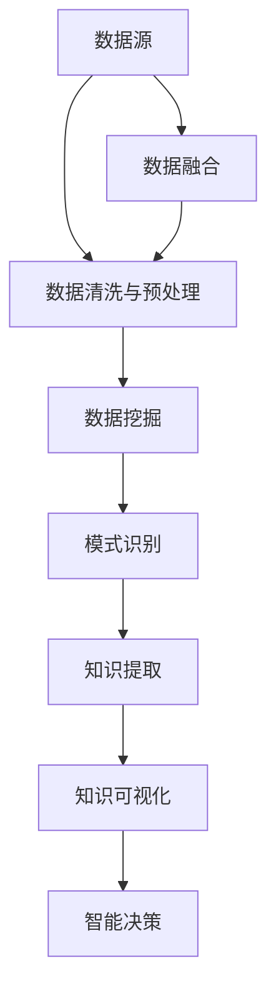

                 

# 知识发现引擎：推动创意产业的创新变革

## 1. 背景介绍

### 1.1 问题由来

随着人工智能(AI)和机器学习(ML)技术的飞速发展，知识发现引擎(Knowledge Discovery Engine, KDE)已成为推动创新变革的关键技术。它通过分析和挖掘大数据中的隐含知识和模式，提供新的洞见和价值，激发创意产业的创新潜力。

在创意产业中，如广告、设计、媒体、游戏等，数据是其核心资源。传统的数据分析方法往往依赖于人工标注和复杂算法，难以处理大规模、复杂的数据集，难以捕捉到创意产业中的深层次规律。知识发现引擎则通过自动化和智能化的方法，可以快速、准确地提取和呈现知识，从而助力创意产业的决策和创新。

### 1.2 问题核心关键点

知识发现引擎的核心思想是：通过分析、学习大量结构化和非结构化数据，提取、总结和呈现深层次的知识和规律，为创意产业的创意设计、市场推广、客户服务等环节提供智能支持。关键点包括：

- **数据源多样性**：数据源包括社交媒体、客户反馈、市场调研、创意作品等，来源广泛。
- **数据规模巨大**：数据量从GB到TB级不等，数据复杂性高。
- **知识提取和呈现**：需要高效的算法和工具，将数据转换为有用的知识。
- **交互性和可视化**：知识发现引擎应具备良好的交互性和可视化效果，帮助用户理解分析结果。

## 2. 核心概念与联系

### 2.1 核心概念概述

为更好地理解知识发现引擎的工作原理，本节将介绍几个密切相关的核心概念：

- **知识发现(Knowledge Discovery)**：通过数据挖掘、统计分析等手段，从大量数据中提取和发现知识的过程。知识发现是数据科学的重要组成部分，其目的是揭示数据背后的深层次关系和模式。
- **知识挖掘(Knowledge Mining)**：一种自动化和半自动化的知识发现技术，通过算法自动识别和提取数据中的知识模式。知识挖掘广泛应用于市场分析、客户行为分析、医疗诊断等领域。
- **数据挖掘(Data Mining)**：从数据集中选择、清洗、转换和建模，发现知识的过程。数据挖掘是知识发现的重要技术手段，通过算法从数据中提取有价值的知识和模式。
- **模式识别(Pattern Recognition)**：识别和分类数据集中的模式，用于图像识别、语音识别、行为识别等领域。模式识别依赖于深度学习和机器学习算法。
- **智能可视化(Intelligent Visualization)**：将复杂的数据和知识以图形、动画等形式呈现，便于理解和分析。智能可视化是知识发现和数据挖掘的重要输出形式，能够增强用户的理解力和洞察力。

这些核心概念之间的逻辑关系可以通过以下Mermaid流程图来展示：



这个流程图展示的知识发现引擎的核心概念及其之间的关系：

1. 数据源提供原始数据。
2. 数据清洗与预处理对原始数据进行处理，确保数据质量。
3. 数据挖掘从处理后的数据中发现知识模式。
4. 模式识别对挖掘出的模式进行分类和识别。
5. 知识提取从数据中提取有用知识，如关联规则、分类规则等。
6. 知识可视化将提取的知识以图形、动画等形式呈现。
7. 智能决策利用可视化结果，指导创意产业的创意设计、市场推广、客户服务等环节。
8. 数据融合将多源数据进行整合，增加知识发现的多样性和全面性。

这些概念共同构成了知识发现引擎的知识发现和应用框架，使其能够在各种场景下发挥作用。通过理解这些核心概念，我们可以更好地把握知识发现引擎的工作原理和优化方向。

## 3. 核心算法原理 & 具体操作步骤
### 3.1 算法原理概述

知识发现引擎的核心原理是数据驱动的知识发现和模式识别。它通过以下步骤从原始数据中提取知识和模式：

1. **数据预处理**：对原始数据进行清洗、归一化、特征选择等处理，为后续分析提供数据质量保证。
2. **数据挖掘**：通过算法从处理后的数据中挖掘出知识模式，如关联规则、分类规则、聚类结果等。
3. **知识提取**：对挖掘出的知识模式进行抽象和提炼，形成有价值的知识表示，如知识图谱、特征库、规则库等。
4. **知识可视化**：将知识表示以图形、动画等形式呈现，便于理解和分析。
5. **智能决策**：利用可视化结果指导创意产业的创意设计、市场推广、客户服务等环节，提供智能决策支持。

具体算法流程可以概括为：数据预处理 -> 数据挖掘 -> 知识提取 -> 知识可视化 -> 智能决策。

### 3.2 算法步骤详解

#### 3.2.1 数据预处理

数据预处理是知识发现引擎的第一步，目的是对原始数据进行清洗、归一化、特征选择等处理，为后续分析提供数据质量保证。主要包括以下步骤：

- **数据清洗**：去除噪声、处理缺失值、异常值等。例如，使用均值填补缺失值，使用回归算法处理异常值。
- **数据归一化**：将不同尺度的数据映射到[0, 1]或[-1, 1]之间，方便后续处理。例如，使用Z-score标准化。
- **特征选择**：选择对知识发现有用的特征，去除冗余和无关特征。例如，使用信息增益、卡方检验等特征选择算法。

#### 3.2.2 数据挖掘

数据挖掘是知识发现引擎的核心步骤，主要通过算法从处理后的数据中挖掘出知识模式。常用算法包括：

- **关联规则挖掘**：如Apriori算法，挖掘项集间的关联关系，常用于市场篮分析、交叉销售分析等。
- **分类算法**：如决策树、随机森林、支持向量机(SVM)等，用于分类和预测。
- **聚类算法**：如K-means、层次聚类等，用于发现数据中的自然分组。

#### 3.2.3 知识提取

知识提取是将挖掘出的知识模式进行抽象和提炼，形成有价值的知识表示。常用方法包括：

- **知识图谱**：通过构建实体和关系图谱，展示数据中的复杂结构和关系。例如，使用Neo4j等图形数据库构建知识图谱。
- **特征库**：通过提取数据中的特征，形成特征库，用于后续的分类和预测。例如，使用TF-IDF、词袋模型等提取文本特征。
- **规则库**：通过挖掘出分类规则、决策规则等，形成规则库，用于指导决策。例如，使用RIF语言表示规则库。

#### 3.2.4 知识可视化

知识可视化是将知识表示以图形、动画等形式呈现，便于理解和分析。常用方法包括：

- **静态可视化**：使用图表、热力图、散点图等形式呈现知识，例如使用D3.js、ECharts等可视化库。
- **交互式可视化**：提供交互式界面，支持用户查询和探索知识，例如使用Tableau、Power BI等工具。
- **动态可视化**：使用动画和交互式界面，展示知识的变化和演化，例如使用Gephi等工具。

#### 3.2.5 智能决策

智能决策是知识发现引擎的最终目标，利用可视化结果指导创意产业的创意设计、市场推广、客户服务等环节，提供智能决策支持。常用方法包括：

- **决策支持系统**：通过可视化结果，提供决策建议和方案，例如使用IBM Cognos等工具。
- **用户界面设计**：设计友好的用户界面，支持用户查询和探索知识，例如使用Oracle BI等工具。
- **知识管理系统**：构建知识管理系统，存储和检索知识，支持持续学习和知识更新。例如使用SharePoint、Alfresco等系统。

### 3.3 算法优缺点

知识发现引擎具有以下优点：

- **高效性**：通过自动化算法，快速发现和提取知识，节省人力成本。
- **全面性**：能够处理大规模、复杂的数据集，覆盖不同领域和行业。
- **实用性**：通过知识可视化，支持创意产业的决策和创新。

同时，该算法也存在一定的局限性：

- **数据质量依赖**：数据预处理的质量直接影响最终结果，数据质量差可能导致错误的发现。
- **算法复杂性高**：数据挖掘和知识提取算法复杂，需要较强的计算资源。
- **结果可解释性不足**：发现的知识模式和规则可能难以解释，影响用户信任。
- **适用性受限**：部分算法和模型可能不适用于特定领域和数据类型。

尽管存在这些局限性，但知识发现引擎在创意产业中的应用前景广阔，正逐渐成为推动产业创新的重要工具。

### 3.4 算法应用领域

知识发现引擎在创意产业的应用已经得到了广泛认可，覆盖了广告、设计、媒体、游戏等多个领域，具体应用包括：

- **广告创意设计**：通过分析用户行为和市场趋势，发现新的广告创意和创意组合。例如，使用关联规则挖掘发现用户行为与广告效果之间的关系。
- **设计趋势分析**：通过分析设计作品和市场反馈，发现设计趋势和流行元素。例如，使用分类算法分析设计师的作品风格和用户偏好。
- **媒体内容推荐**：通过分析用户行为和内容特征，推荐个性化的媒体内容。例如，使用协同过滤算法推荐视频和文章。
- **游戏玩法设计**：通过分析用户行为和游戏数据，发现新的游戏玩法和规则。例如，使用聚类算法发现用户的游戏偏好和行为模式。
- **客户服务优化**：通过分析客户反馈和行为数据，优化客户服务和产品设计。例如，使用关联规则挖掘发现客户投诉与产品质量之间的关系。

## 4. 数学模型和公式 & 详细讲解 & 举例说明

### 4.1 数学模型构建

知识发现引擎的数学模型构建主要涉及数据预处理、数据挖掘和知识提取三个步骤。以广告创意设计为例，我们假设原始数据为广告样本集 $D = \{(x_i, y_i)\}_{i=1}^N$，其中 $x_i$ 为广告特征向量，$y_i$ 为广告效果标签。

定义数据预处理函数 $f(x)$，将原始数据转换为处理后的数据集 $D' = \{(x'_i)\}_{i=1}^N$。定义数据挖掘函数 $g(D')$，在处理后的数据集上挖掘出知识模式。定义知识提取函数 $h(g(D'))$，将知识模式转换为知识表示。最终的目标函数为：

$$
\min_{\theta} \mathcal{L}(h(g(f(D))))
$$

其中 $\mathcal{L}$ 为损失函数，用于衡量知识表示与真实标签之间的差异。

### 4.2 公式推导过程

以广告创意设计为例，我们详细推导广告效果预测的分类算法。

假设广告特征 $x_i = [a_1, a_2, ..., a_n]$，广告效果 $y_i \in \{0, 1\}$。分类算法的目标是最小化分类误差，即：

$$
\min_{\theta} \frac{1}{N} \sum_{i=1}^N \ell(M_{\theta}(x_i), y_i)
$$

其中 $\ell$ 为损失函数，$M_{\theta}(x)$ 为分类模型。假设使用逻辑回归模型，模型形式为：

$$
M_{\theta}(x) = \sigma(\theta^T x)
$$

其中 $\sigma$ 为 sigmoid 函数，$\theta$ 为模型参数。

定义损失函数为交叉熵损失：

$$
\ell(y, \hat{y}) = -(y\log \hat{y} + (1-y)\log (1-\hat{y}))
$$

带入分类模型，得到最终目标函数：

$$
\min_{\theta} \frac{1}{N} \sum_{i=1}^N \ell(\sigma(\theta^T x_i), y_i)
$$

通过梯度下降算法，求得 $\theta$ 的值：

$$
\theta \leftarrow \theta - \eta \nabla_{\theta} \mathcal{L}(\theta)
$$

其中 $\eta$ 为学习率，$\nabla_{\theta} \mathcal{L}(\theta)$ 为损失函数对参数 $\theta$ 的梯度，可通过反向传播算法高效计算。

### 4.3 案例分析与讲解

以一家在线广告公司为例，展示知识发现引擎在广告创意设计中的应用过程。

该公司收集了大量的广告样本数据，包括用户点击率、展示次数、广告内容等特征，以及广告效果标签（点击与否）。首先，使用数据预处理函数对原始数据进行清洗和归一化处理，得到处理后的数据集。然后，使用分类算法对处理后的数据进行挖掘，提取广告效果与特征之间的关联关系。最后，将挖掘出的关联规则转换为知识表示，用于指导广告创意设计。例如，发现用户对某个特定词组的广告反应较好，可以在新广告中增加该词组，提升点击率。

## 5. 项目实践：代码实例和详细解释说明

### 5.1 开发环境搭建

在进行知识发现引擎开发前，需要准备好开发环境。以下是使用Python进行Scikit-learn开发的Python环境配置流程：

1. 安装Anaconda：从官网下载并安装Anaconda，用于创建独立的Python环境。

2. 创建并激活虚拟环境：
```bash
conda create -n kde-env python=3.8 
conda activate kde-env
```

3. 安装Scikit-learn：
```bash
conda install scikit-learn
```

4. 安装Pandas和NumPy：
```bash
conda install pandas numpy
```

5. 安装Matplotlib和Seaborn：
```bash
conda install matplotlib seaborn
```

完成上述步骤后，即可在`kde-env`环境中开始知识发现引擎的开发。

### 5.2 源代码详细实现

下面以广告创意设计为例，给出使用Scikit-learn进行知识发现引擎的Python代码实现。

首先，定义数据预处理函数：

```python
import pandas as pd
from sklearn.preprocessing import StandardScaler
from sklearn.feature_selection import SelectKBest, f_classif

def preprocess_data(data):
    # 数据清洗
    data.dropna(inplace=True)
    
    # 数据归一化
    scaler = StandardScaler()
    data = scaler.fit_transform(data)
    
    # 特征选择
    selector = SelectKBest(f_classif, k=10)
    data = selector.fit_transform(data, data['y'])
    
    return data
```

然后，定义数据挖掘函数：

```python
from sklearn.ensemble import RandomForestClassifier
from sklearn.model_selection import train_test_split

def train_model(data):
    # 划分训练集和测试集
    X_train, X_test, y_train, y_test = train_test_split(data[:, :-1], data[:, -1], test_size=0.2)
    
    # 训练模型
    model = RandomForestClassifier(n_estimators=100, random_state=42)
    model.fit(X_train, y_train)
    
    # 评估模型
    score = model.score(X_test, y_test)
    print(f"Accuracy: {score:.3f}")
    
    return model
```

最后，启动训练流程并在测试集上评估：

```python
# 加载数据
data = pd.read_csv('ad_data.csv')

# 数据预处理
processed_data = preprocess_data(data)

# 训练模型
model = train_model(processed_data)

# 测试模型
test_data = pd.read_csv('test_ad_data.csv')
processed_test_data = preprocess_data(test_data)
score = model.score(processed_test_data[:, :-1], processed_test_data[:, -1])
print(f"Test Accuracy: {score:.3f}")
```

以上就是使用Scikit-learn进行广告创意设计知识发现引擎的完整代码实现。可以看到，Scikit-learn提供了丰富的数据挖掘和机器学习算法，可以方便快捷地构建知识发现引擎。

### 5.3 代码解读与分析

让我们再详细解读一下关键代码的实现细节：

**preprocess_data函数**：
- 使用Pandas进行数据加载和清洗。
- 使用StandardScaler进行归一化处理。
- 使用SelectKBest进行特征选择，选择前10个特征。

**train_model函数**：
- 使用train_test_split进行数据划分，训练集占80%，测试集占20%。
- 使用RandomForestClassifier进行模型训练，设置随机种子和树数。
- 使用测试集评估模型准确率，并返回训练好的模型。

**训练流程**：
- 加载数据集。
- 预处理数据，使用preprocess_data函数。
- 训练模型，使用train_model函数。
- 测试模型，使用测试集评估模型准确率。

可以看到，Scikit-learn的API设计简洁高效，开发者可以将更多精力放在数据处理和算法选择上，而不必过多关注底层的实现细节。

当然，工业级的系统实现还需考虑更多因素，如模型的保存和部署、超参数的自动搜索、更灵活的任务适配层等。但核心的知识发现引擎算法基本与此类似。

## 6. 实际应用场景

### 6.1 广告创意设计

知识发现引擎在广告创意设计中的应用非常广泛。通过分析用户点击率、展示次数、广告内容等特征，可以发现广告效果与特征之间的关联关系，指导广告创意设计。

例如，一家在线广告公司收集了大量的广告样本数据，包括用户点击率、展示次数、广告内容等特征，以及广告效果标签（点击与否）。使用知识发现引擎对数据进行分析和挖掘，提取广告效果与特征之间的关联规则。例如，发现用户对某个特定词组的广告反应较好，可以在新广告中增加该词组，提升点击率。

### 6.2 设计趋势分析

设计趋势分析是知识发现引擎在创意产业中的另一个重要应用。通过分析设计作品和市场反馈，可以发现设计趋势和流行元素。

例如，一家设计公司收集了大量的设计作品数据，包括设计风格、设计师背景、用户评价等特征。使用知识发现引擎对数据进行分析和挖掘，提取设计趋势和流行元素。例如，发现近期流行的设计风格是极简主义，可以指导设计师在未来的设计中更多采用极简主义风格。

### 6.3 媒体内容推荐

媒体内容推荐是知识发现引擎在创意产业中的常见应用。通过分析用户行为和内容特征，可以推荐个性化的媒体内容。

例如，一家视频网站收集了大量的用户观看数据，包括用户观看历史、视频播放时长、视频分类等特征。使用知识发现引擎对数据进行分析和挖掘，提取用户行为和内容特征之间的关系。例如，发现用户喜欢观看动作片，可以推荐更多动作片视频。

### 6.4 游戏玩法设计

游戏玩法设计是知识发现引擎在创意产业中的另一个重要应用。通过分析用户行为和游戏数据，可以发现新的游戏玩法和规则。

例如，一家游戏公司收集了大量的用户游戏数据，包括用户游戏时间、游戏评分、游戏道具使用等特征。使用知识发现引擎对数据进行分析和挖掘，提取用户行为和游戏数据之间的关系。例如，发现用户喜欢使用某个道具，可以在新游戏设计中增加该道具。

### 6.5 客户服务优化

客户服务优化是知识发现引擎在创意产业中的常见应用。通过分析客户反馈和行为数据，可以优化客户服务和产品设计。

例如，一家电商平台收集了大量的客户反馈数据，包括客户评价、客户投诉、客服对话等特征。使用知识发现引擎对数据进行分析和挖掘，提取客户反馈和行为数据之间的关系。例如，发现客户投诉最多的问题是产品质量问题，可以优化产品质量设计。

## 7. 工具和资源推荐

### 7.1 学习资源推荐

为了帮助开发者系统掌握知识发现引擎的理论基础和实践技巧，这里推荐一些优质的学习资源：

1. **《数据挖掘与统计学习基础》**：由吴恩达等专家合著的教材，系统介绍了数据挖掘和统计学习的基础知识和常用算法。
2. **《Python数据科学手册》**：由Jake VanderPlas著，介绍了使用Python进行数据科学实践的全面指南。
3. **《机器学习实战》**：由Peter Harrington著，通过实际案例展示了机器学习算法在各行各业的应用。
4. **Coursera《数据科学导论》**：由Johns Hopkins大学开设的课程，涵盖数据科学的基本概念和常用技术。
5. **Kaggle竞赛平台**：Kaggle是全球最大的数据科学竞赛平台，提供了大量数据集和模型，帮助用户学习和实践。

通过学习这些资源，相信你一定能够快速掌握知识发现引擎的理论基础和实践技巧，并用于解决实际的创意产业问题。

### 7.2 开发工具推荐

高效的开发离不开优秀的工具支持。以下是几款用于知识发现引擎开发的常用工具：

1. **Python**：Python是数据科学和机器学习的主流编程语言，具有丰富的第三方库和工具支持。
2. **Scikit-learn**：Scikit-learn是Python最流行的机器学习库之一，提供了丰富的算法和工具支持。
3. **TensorFlow**：TensorFlow是Google开发的深度学习框架，支持分布式计算和大规模数据处理。
4. **PyTorch**：PyTorch是Facebook开发的深度学习框架，支持动态计算图和高效GPU计算。
5. **Keras**：Keras是Google开发的高级神经网络API，易于使用，支持多种深度学习模型。

合理利用这些工具，可以显著提升知识发现引擎的开发效率，加快创新迭代的步伐。

### 7.3 相关论文推荐

知识发现引擎的研究源于学界的持续研究。以下是几篇奠基性的相关论文，推荐阅读：

1. **《A Survey of Association Rule Mining Algorithms》**：由Zhang Z.和Rajkumar R.合著的综述文章，系统介绍了关联规则挖掘的常用算法和应用。
2. **《Causal Inference in Statistics: A Primer》**：由Pearl J.著的教材，介绍了因果推断的基本概念和常用方法。
3. **《Data Mining and Statistical Learning》**：由Hastie T.等合著的教材，介绍了数据挖掘和统计学习的基础知识和常用算法。
4. **《Knowledge Discovery in Databases: An Overview》**：由Zhang T.和Choi W.合著的综述文章，系统介绍了知识发现和数据挖掘的常用技术和应用。
5. **《Mining of Massive Datasets》**：由Jiang J.等合著的综述文章，介绍了大数据挖掘和处理的基础知识和常用算法。

这些论文代表了大规模知识发现和数据挖掘的研究方向，通过学习这些前沿成果，可以帮助研究者把握学科前进方向，激发更多的创新灵感。

## 8. 总结：未来发展趋势与挑战

### 8.1 总结

本文对知识发现引擎在创意产业的应用进行了全面系统的介绍。首先阐述了知识发现引擎的背景和意义，明确了其在创意产业中的应用前景和价值。其次，从原理到实践，详细讲解了知识发现引擎的数学模型和核心步骤，给出了知识发现引擎的完整代码实现。同时，本文还广泛探讨了知识发现引擎在广告创意设计、设计趋势分析、媒体内容推荐、游戏玩法设计、客户服务优化等多个领域的应用前景，展示了知识发现引擎的广阔应用范围。此外，本文精选了知识发现引擎的学习资源、开发工具和相关论文，力求为读者提供全方位的技术指引。

通过本文的系统梳理，可以看到，知识发现引擎在创意产业中的应用前景广阔，通过数据驱动的知识发现和模式识别，能够提供强大的决策支持和创意灵感。未来，伴随数据规模的不断扩大和算法技术的持续进步，知识发现引擎必将在更多领域得到应用，为创意产业带来深远影响。

### 8.2 未来发展趋势

展望未来，知识发现引擎在创意产业中的应用将呈现以下几个发展趋势：

1. **数据规模不断增大**：随着大数据技术的不断发展，数据规模将不断增大，知识发现引擎能够处理更复杂、更丰富的数据集。
2. **算法技术不断优化**：新的算法和技术不断涌现，如深度学习、强化学习、因果推断等，将进一步提升知识发现引擎的准确性和效率。
3. **多源数据融合**：多源数据的融合和整合，将增加知识发现引擎的多样性和全面性，提升分析的深度和广度。
4. **实时分析能力提升**：实时分析和在线分析能力的提升，将使知识发现引擎能够及时响应创意产业的需求变化。
5. **智能化和自动化**：智能化和自动化的提升，将使知识发现引擎能够更灵活地处理各种场景和需求，减少人工干预。

以上趋势凸显了知识发现引擎在创意产业中的重要价值，未来在更多领域将发挥关键作用。

### 8.3 面临的挑战

尽管知识发现引擎在创意产业中的应用前景广阔，但在迈向更加智能化、普适化应用的过程中，它仍面临诸多挑战：

1. **数据质量问题**：数据预处理的质量直接影响知识发现引擎的性能，数据质量差可能导致错误的发现。
2. **算法复杂性高**：知识发现引擎的算法复杂，需要较强的计算资源和时间。
3. **结果可解释性不足**：发现的知识模式和规则可能难以解释，影响用户信任。
4. **适用性受限**：部分算法和模型可能不适用于特定领域和数据类型。
5. **数据隐私和安全**：创意产业涉及大量敏感数据，如何保护数据隐私和安全，成为一大挑战。

尽管存在这些挑战，但知识发现引擎在创意产业中的应用前景广阔，正逐渐成为推动产业创新的重要工具。

### 8.4 研究展望

面对知识发现引擎面临的挑战，未来的研究需要在以下几个方面寻求新的突破：

1. **数据预处理技术提升**：研究新的数据清洗和归一化技术，提升数据质量。
2. **算法优化和融合**：研究新的算法和模型，提升算法效率和准确性，融合多种算法和技术。
3. **知识表示和可视化**：研究新的知识表示和可视化方法，提升知识发现引擎的灵活性和可解释性。
4. **实时分析能力提升**：研究实时分析和在线分析技术，提升知识发现引擎的响应速度和准确性。
5. **数据隐私和安全**：研究数据保护和安全技术，保护创意产业的数据隐私和安全。

这些研究方向的探索，必将引领知识发现引擎技术迈向更高的台阶，为创意产业带来深远影响。面向未来，知识发现引擎需要与其他人工智能技术进行更深入的融合，如自然语言处理、计算机视觉、深度学习等，多路径协同发力，共同推动创意产业的创新和变革。只有勇于创新、敢于突破，才能不断拓展知识发现引擎的边界，让智能技术更好地造福创意产业。

## 9. 附录：常见问题与解答

**Q1：知识发现引擎是否适用于所有创意产业任务？**

A: 知识发现引擎在大多数创意产业任务上都能取得不错的效果，特别是对于数据量较大的任务。但对于一些特定领域的任务，如文学创作、艺术品评价等，仅依赖数据驱动的知识发现可能难以获得满意的结论。此时需要结合领域专家的知识和经验，进行专家系统和半监督学习等方法的结合，以提升分析的全面性和准确性。

**Q2：知识发现引擎在数据预处理阶段需要注意哪些问题？**

A: 数据预处理是知识发现引擎的第一步，对最终结果影响较大。需要注意以下问题：

1. **数据清洗**：去除噪声、处理缺失值、异常值等。例如，使用均值填补缺失值，使用回归算法处理异常值。
2. **数据归一化**：将不同尺度的数据映射到[0, 1]或[-1, 1]之间，方便后续处理。例如，使用Z-score标准化。
3. **特征选择**：选择对知识发现有用的特征，去除冗余和无关特征。例如，使用信息增益、卡方检验等特征选择算法。

**Q3：知识发现引擎在数据挖掘阶段如何选择算法？**

A: 数据挖掘是知识发现引擎的核心步骤，常用算法包括关联规则挖掘、分类算法、聚类算法等。选择算法时需要考虑数据类型、任务目标、数据规模等因素。例如，对于分类任务，可以使用决策树、随机森林、支持向量机(SVM)等算法。对于关联规则挖掘，可以使用Apriori算法。对于聚类任务，可以使用K-means、层次聚类等算法。

**Q4：知识发现引擎在知识提取阶段有哪些常用方法？**

A: 知识提取是将挖掘出的知识模式进行抽象和提炼，形成有价值的知识表示。常用方法包括知识图谱、特征库、规则库等。例如，通过构建实体和关系图谱，展示数据中的复杂结构和关系。通过提取数据中的特征，形成特征库，用于后续的分类和预测。通过挖掘出分类规则、决策规则等，形成规则库，用于指导决策。

**Q5：知识发现引擎在实际应用中需要注意哪些问题？**

A: 将知识发现引擎转化为实际应用，还需要考虑以下问题：

1. **模型裁剪**：去除不必要的层和参数，减小模型尺寸，加快推理速度。
2. **量化加速**：将浮点模型转为定点模型，压缩存储空间，提高计算效率。
3. **服务化封装**：将模型封装为标准化服务接口，便于集成调用。
4. **弹性伸缩**：根据请求流量动态调整资源配置，平衡服务质量和成本。
5. **监控告警**：实时采集系统指标，设置异常告警阈值，确保服务稳定性。
6. **安全防护**：采用访问鉴权、数据脱敏等措施，保障数据和模型安全。

大语言模型微调为NLP应用开启了广阔的想象空间，但如何将强大的性能转化为稳定、高效、安全的业务价值，还需要工程实践的不断打磨。唯有从数据、算法、工程、业务等多个维度协同发力，才能真正实现人工智能技术在垂直行业的规模化落地。总之，知识发现引擎需要开发者根据具体任务，不断迭代和优化模型、数据和算法，方能得到理想的效果。

---

作者：禅与计算机程序设计艺术 / Zen and the Art of Computer Programming

