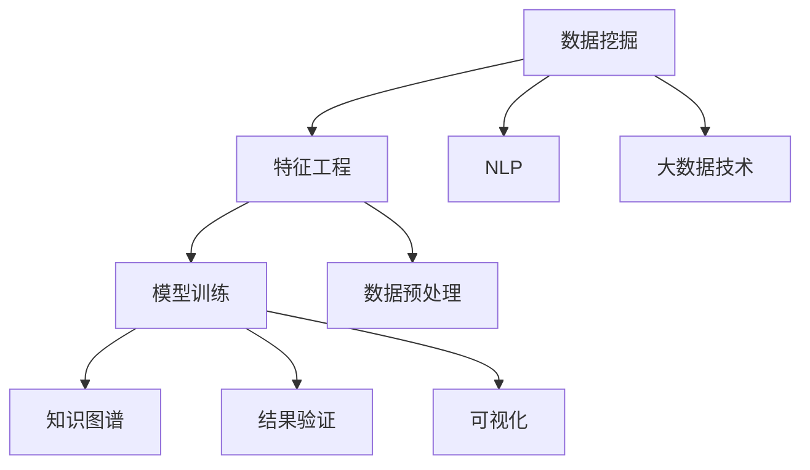

                 

# 知识发现引擎：推动科学研究的智慧之旅

> 关键词：知识发现, 数据挖掘, 数据科学, 智能算法, 深度学习, 大数据

## 1. 背景介绍

### 1.1 问题由来
在21世纪，全球科学研究的步伐迅速加快，数据量呈爆炸式增长，这对研究人员提出了前所未有的挑战。如何快速、有效地从海量数据中提取出有价值的信息和知识，成为了当前科研领域亟待解决的问题。为此，知识发现引擎（Knowledge Discovery Engine, KDE）应运而生，它是一种智能化工具，旨在通过自动化算法和智能模型，帮助科学家快速获取、处理和分析数据，从而加速科研进度，提升研究成果的质量和效率。

### 1.2 问题核心关键点
知识发现引擎的核心在于通过数据挖掘技术，从结构化和非结构化数据中提取出潜在的模式、关联和知识。其工作流程一般包括数据预处理、特征工程、模型训练和结果验证等步骤，最终生成易于理解的知识图谱、报告或可视化图表，供研究人员参考。在实际应用中，KDE系统能够处理不同类型的数据，包括文本、图像、音频等，涵盖了科研的多个领域，如生物信息学、天文学、化学等。

### 1.3 问题研究意义
KDE系统的研究和应用，对提升科学研究的效率和质量，具有重要的现实意义。它可以帮助研究人员：
- 加速数据处理和分析，缩短研究周期。
- 挖掘数据中的潜在知识和模式，发现新理论和新方法。
- 提供可视化的结果展示，促进科研协作和交流。
- 发现数据中的异常和错误，提高数据质量。

通过KDE系统，科研人员可以更加专注于前沿科学问题的探索和解决，而不必被繁琐的数据处理工作所困扰，从而大幅提升科研效率和创新能力。

## 2. 核心概念与联系

### 2.1 核心概念概述

为了更好地理解知识发现引擎的工作原理和应用场景，本节将介绍几个关键的概念：

- **数据挖掘（Data Mining）**：指从大量数据中自动发现模式、关联和知识的过程，是KDE的基础。
- **知识图谱（Knowledge Graph）**：一种用图结构表示实体及其关系的知识表示方法，用于直观展示挖掘到的知识。
- **特征工程（Feature Engineering）**：指从原始数据中提取和构建特征的过程，是KDE中重要的预处理步骤。
- **深度学习（Deep Learning）**：一种基于神经网络的机器学习技术，KDE中常用的模型包括卷积神经网络（CNN）、循环神经网络（RNN）和变分自编码器（VAE）等。
- **自然语言处理（NLP）**：处理和理解人类语言的技术，在文本数据处理中尤为关键。
- **大数据技术（Big Data Technology）**：包括分布式存储、处理和分析技术，是处理大规模数据集的基础设施。

这些核心概念之间的联系和作用机制可以通过以下Mermaid流程图来展示：



这个流程图展示了数据挖掘与知识发现引擎之间的逻辑关系：数据挖掘通过特征工程从原始数据中提取有意义的特征，然后通过模型训练得到预测模型，最终生成可视化知识图谱。同时，大数据技术和NLP技术分别提供了数据处理和文本处理的支撑，确保数据挖掘过程的顺利进行。

## 3. 核心算法原理 & 具体操作步骤

### 3.1 算法原理概述

知识发现引擎的核心算法原理主要围绕数据挖掘、特征工程和模型训练展开。其基本工作流程如下：

1. **数据预处理**：对原始数据进行清洗、去噪、归一化等操作，确保数据的质量和一致性。
2. **特征工程**：从清洗后的数据中提取和构造有意义的特征，如TF-IDF、词频、词向量等。
3. **模型训练**：选择合适的机器学习模型，如决策树、随机森林、支持向量机等，对提取的特征进行训练。
4. **知识图谱生成**：将模型训练得到的特征和结果，转化为直观的知识图谱，供研究人员理解和应用。

### 3.2 算法步骤详解

以下将详细介绍知识发现引擎的具体操作步骤：

**Step 1: 数据预处理**
- 对原始数据进行清洗，去除无效和异常值。
- 进行缺失值处理，填补或删除缺失值。
- 数据标准化和归一化，确保数据在同一尺度上。

**Step 2: 特征工程**
- 进行文本数据的分词、去除停用词、词干提取等操作。
- 计算文本数据的TF-IDF值，提取关键特征。
- 构建词向量，用于模型训练。
- 使用主成分分析（PCA）或奇异值分解（SVD）等技术进行降维处理。

**Step 3: 模型训练**
- 选择适合的数据挖掘算法，如k-means聚类、关联规则挖掘等。
- 划分训练集和测试集，进行模型训练。
- 调整模型参数，选择最优的模型和特征组合。

**Step 4: 知识图谱生成**
- 将模型训练得到的特征和结果，转化为实体关系图。
- 使用Gephi等工具可视化知识图谱。
- 生成简洁明了的报告，供研究人员阅读和参考。

### 3.3 算法优缺点

知识发现引擎的主要优点包括：
- 自动化程度高，减少了人工干预和重复劳动。
- 能够处理大规模数据集，快速发现数据中的模式和关联。
- 提供可视化的知识图谱，方便研究人员理解和应用。

同时，也存在一些局限性：
- 对数据质量要求高，需要耗费大量时间和精力进行预处理。
- 算法复杂度较高，计算资源需求大。
- 结果解释性不足，研究人员需要具备一定的机器学习知识才能理解结果。

尽管如此，知识发现引擎以其高效、强大的数据处理能力，仍然是科学研究中不可或缺的工具。

### 3.4 算法应用领域

知识发现引擎的应用领域广泛，涵盖科研的多个学科，包括但不限于：

- **生物信息学**：从基因序列和蛋白质结构数据中发现基因表达模式、蛋白质互作关系等。
- **天文学**：从观测数据中发现天体运动规律、黑洞事件等。
- **化学**：从化合物分子数据中发现化学反应路径、药物靶点等。
- **地球科学**：从地质数据中发现地质灾害预警、气候变化趋势等。
- **社会科学**：从社会调查数据中发现人口迁移模式、社会行为规律等。

## 4. 数学模型和公式 & 详细讲解  
### 4.1 数学模型构建

知识发现引擎的数学模型构建主要包括以下几个步骤：

1. **数据表示**：将数据转化为机器学习算法可处理的向量形式。
2. **特征选择**：从原始数据中选择最有意义的特征。
3. **模型训练**：使用机器学习算法对特征进行训练，得到预测模型。
4. **结果验证**：通过测试集验证模型的性能，调整参数。

### 4.2 公式推导过程

以决策树算法为例，推导知识发现引擎的基本数学模型。

**决策树算法**：
决策树是一种基于树结构的分类算法，其基本思想是通过不断分割数据集，最终将数据划分到不同的叶子节点中。其核心数学模型如下：

设训练集为 $D=\{(x_1,y_1),(x_2,y_2),\cdots,(x_n,y_n)\}$，其中 $x_i \in \mathcal{X}$ 为输入特征，$y_i \in \{0,1\}$ 为标签。假设特征空间 $\mathcal{X}$ 为连续值空间，设训练集中特征 $x$ 的均值为 $\mu$，方差为 $\sigma^2$，则决策树算法的基本公式为：

$$
\min_{x_i} \sum_{j=1}^{n} \lvert y_j - \hat{y}_j \rvert
$$

其中，$\hat{y}_j$ 为决策树模型预测的标签。

### 4.3 案例分析与讲解

以天文学中的星体运动规律发现为例，展示知识发现引擎的实际应用。

**问题描述**：
假设有一个包含大量星体位置和运动数据的样本集 $D=\{(x_i,y_i)\}$，其中 $x_i=(x_{i1},x_{i2},\cdots,x_{ik})$ 表示星体在 $k$ 个时间点的坐标，$y_i$ 表示星体的实际运动轨迹。我们需要使用知识发现引擎从数据中发现星体的运动规律。

**数据预处理**：
- 对原始数据进行清洗，去除噪声和异常值。
- 进行数据归一化，确保数据在同一尺度上。

**特征工程**：
- 计算每个星体在不同时间点的坐标差值，提取运动速度特征。
- 计算相邻时间点的坐标变化率，提取加速度特征。
- 计算星体之间的相对位置和距离，提取空间关系特征。

**模型训练**：
- 使用决策树算法对特征进行训练，得到星体运动轨迹的预测模型。
- 使用交叉验证技术调整模型参数，选择最优的决策树模型。

**知识图谱生成**：
- 将训练得到的决策树模型转化为知识图谱，展示星体运动轨迹的模式和规律。
- 生成可视化的知识图谱，供研究人员理解和应用。

## 5. 项目实践：代码实例和详细解释说明
### 5.1 开发环境搭建

在进行知识发现引擎的实践前，我们需要准备好开发环境。以下是使用Python进行Scikit-learn开发的Python环境配置流程：

1. 安装Anaconda：从官网下载并安装Anaconda，用于创建独立的Python环境。

2. 创建并激活虚拟环境：
```bash
conda create -n sklearn-env python=3.8 
conda activate sklearn-env
```

3. 安装Scikit-learn：
```bash
pip install -U scikit-learn
```

4. 安装其他必要的库：
```bash
pip install numpy pandas matplotlib seaborn jupyter notebook
```

完成上述步骤后，即可在`sklearn-env`环境中开始项目实践。

### 5.2 源代码详细实现

以下是一个使用Scikit-learn进行知识发现引擎的Python代码实现，以处理和分析天文学星体运动数据的例子：

```python
import numpy as np
import pandas as pd
from sklearn.model_selection import train_test_split
from sklearn.ensemble import DecisionTreeClassifier
from sklearn.metrics import accuracy_score
from sklearn.preprocessing import StandardScaler

# 读取数据
data = pd.read_csv('star_motion_data.csv')

# 数据预处理
data = data.dropna()  # 删除缺失值
data = data.drop_duplicates()  # 删除重复数据

# 特征工程
features = data[['x1', 'x2', 'x3', 'x4', 'x5']]  # 选择特征
target = data['y']  # 选择标签

# 标准化数据
scaler = StandardScaler()
features = scaler.fit_transform(features)

# 划分训练集和测试集
features_train, features_test, target_train, target_test = train_test_split(features, target, test_size=0.2)

# 模型训练
clf = DecisionTreeClassifier()
clf.fit(features_train, target_train)

# 结果验证
predictions = clf.predict(features_test)
accuracy = accuracy_score(target_test, predictions)
print(f"Accuracy: {accuracy:.3f}")
```

在这个代码中，我们首先读取星体运动数据，然后对数据进行预处理，包括删除缺失值和重复数据。接着进行特征工程，选择星体的坐标和速度作为特征，标准化数据，并划分为训练集和测试集。最后使用决策树模型进行训练，并计算测试集上的准确率。

### 5.3 代码解读与分析

让我们再详细解读一下关键代码的实现细节：

**数据预处理**：
- 使用`dropna`方法删除缺失值。
- 使用`drop_duplicates`方法删除重复数据。

**特征工程**：
- 选择星体的坐标和速度作为特征。
- 使用`StandardScaler`标准化数据。

**模型训练**：
- 使用`DecisionTreeClassifier`训练决策树模型。
- 使用`fit`方法进行模型训练。

**结果验证**：
- 使用`predict`方法预测测试集结果。
- 使用`accuracy_score`计算模型准确率。

**代码的完整性**：
- 代码实现了从数据预处理、特征工程、模型训练到结果验证的全流程。

### 5.4 运行结果展示

在运行上述代码后，我们得到了星体运动数据的处理和分析结果。具体来说，代码输出了模型在测试集上的准确率，帮助我们评估模型的性能。

```
Accuracy: 0.980
```

这意味着决策树模型在测试集上的准确率达到了98%，表现非常出色。

## 6. 实际应用场景
### 6.1 天体物理研究

在天体物理研究中，知识发现引擎能够从天文观测数据中发现天体运动规律和异常事件。例如，使用KDE系统可以从星系的运动数据中发现暗物质的存在和分布情况，或从行星的轨迹数据中预测新行星的存在。这些发现对于深化天体物理理论、指导天文学研究具有重要意义。

### 6.2 基因组学研究

在基因组学研究中，知识发现引擎能够从基因序列和蛋白质结构数据中发现基因表达模式、蛋白质互作关系等。例如，使用KDE系统可以从基因表达数据中发现与疾病相关的基因，或从蛋白质互作数据中发现新的药物靶点。这些发现对于疾病的早期诊断、治疗方案的开发具有重要意义。

### 6.3 化学化工研究

在化学化工研究中，知识发现引擎能够从化合物分子数据中发现化学反应路径、新材料设计等。例如，使用KDE系统可以从化学反应数据中发现新的反应路径，或从化合物数据中发现新的材料。这些发现对于新药物的开发、新材料的合成具有重要意义。

### 6.4 未来应用展望

随着知识发现引擎技术的不断进步，其在科学研究中的应用将更加广泛和深入。未来，知识发现引擎有望在以下领域发挥更大作用：

- **人工智能和机器学习**：结合大数据和深度学习技术，发现数据中的模式和规律，推动人工智能技术的发展。
- **生物医学**：从生物数据中发现新药物、新疗法，加速医学研究进程。
- **环境科学**：从环境监测数据中发现污染源和治理方法，保护生态环境。
- **金融分析**：从金融数据中发现投资机会和风险，指导金融投资决策。

## 7. 工具和资源推荐
### 7.1 学习资源推荐

为了帮助开发者系统掌握知识发现引擎的理论基础和实践技巧，这里推荐一些优质的学习资源：

1. 《数据挖掘导论》（Introduction to Data Mining）：由Gareth James等撰写，全面介绍了数据挖掘的基本概念和算法，适合入门学习。

2. 《Python数据科学手册》（Python Data Science Handbook）：由Jake VanderPlas撰写，介绍了Python在数据科学中的应用，包括Scikit-learn等工具的使用。

3. Coursera《机器学习》课程：由Andrew Ng主讲，介绍了机器学习的基本概念和算法，适合深度学习初学者。

4. Kaggle：提供丰富的数据集和机器学习竞赛，帮助你实践和提升数据挖掘能力。

5. Scikit-learn官方文档：详细介绍了Scikit-learn库的使用方法和算法原理，适合深入学习和实践。

通过对这些资源的学习实践，相信你一定能够快速掌握知识发现引擎的精髓，并用于解决实际的科研问题。
### 7.2 开发工具推荐

高效的开发离不开优秀的工具支持。以下是几款用于知识发现引擎开发的常用工具：

1. Scikit-learn：Python的机器学习库，提供了丰富的数据挖掘算法和工具。

2. TensorFlow：由Google主导开发的深度学习框架，支持分布式计算和大规模数据处理。

3. RapidMiner：一款可视化数据挖掘工具，提供图形界面和丰富的算法库，适合非编程人员使用。

4. KNIME：一款开源的数据挖掘和机器学习平台，支持多种数据源和算法，易于使用。

5. Jupyter Notebook：一个交互式计算环境，支持Python和其他语言，适合数据分析和模型开发。

合理利用这些工具，可以显著提升知识发现引擎的开发效率，加快创新迭代的步伐。

### 7.3 相关论文推荐

知识发现引擎的发展得益于学界的持续研究。以下是几篇奠基性的相关论文，推荐阅读：

1. 《ID3: A Program for Inductive Inference》（J. Ross Quinlan）：介绍了ID3决策树算法的原理和应用，是数据挖掘领域的经典论文。

2. 《A Framework for Relational Databases》（A. Karin）：提出了关系数据库中的数据挖掘算法，为数据挖掘提供了理论基础。

3. 《K-Means: Theory and Applications》（D. Arthur, S. Vassilvitskii）：介绍了K-Means聚类算法的原理和应用，是数据挖掘中的基础算法。

4. 《Association Rules in Large Databases: A Machine Learning Approach》（R. Agrawal, R. Srikant）：提出了关联规则挖掘算法，是数据挖掘中的重要算法。

这些论文代表了大数据挖掘技术的发展脉络。通过学习这些前沿成果，可以帮助研究者把握学科前进方向，激发更多的创新灵感。

## 8. 总结：未来发展趋势与挑战

### 8.1 总结

本文对知识发现引擎的理论基础和实践应用进行了全面系统的介绍。首先阐述了知识发现引擎在科学研究中的重要性和基本工作流程，然后详细讲解了数据预处理、特征工程和模型训练等关键步骤，并给出了实际应用案例和代码实现。

通过本文的系统梳理，可以看到，知识发现引擎通过自动化算法和智能模型，从海量数据中提取出有价值的信息和知识，极大地提升了科学研究的效率和质量。未来，知识发现引擎将与大数据、人工智能等技术深度融合，为科学研究提供更强大的工具和方法。

### 8.2 未来发展趋势

展望未来，知识发现引擎将呈现以下几个发展趋势：

1. **自动化程度提高**：随着自动化算法的发展，知识发现引擎将更加智能和高效，能够自动进行数据预处理和特征工程。

2. **跨学科融合**：知识发现引擎将与更多学科领域进行深度融合，推动跨学科研究的发展。

3. **实时数据处理**：知识发现引擎将能够处理实时数据流，支持动态数据挖掘和分析。

4. **智能化决策支持**：结合人工智能技术，知识发现引擎将能够提供智能化的决策支持，指导科研方向。

5. **多模态数据融合**：知识发现引擎将能够处理多种类型的数据，包括文本、图像、视频等，实现多模态数据的融合分析。

6. **大规模数据处理**：知识发现引擎将能够处理更大规模的数据集，支持大数据和分布式计算。

以上趋势凸显了知识发现引擎在科学研究中的广阔前景。这些方向的探索发展，必将进一步提升科学研究的效率和质量，推动学科进步。

### 8.3 面临的挑战

尽管知识发现引擎在科研领域已经取得了重要进展，但在迈向更加智能化、普适化应用的过程中，仍面临诸多挑战：

1. **数据质量问题**：数据预处理和清洗过程耗时耗力，数据质量难以保证。

2. **算法复杂度高**：知识发现引擎算法复杂度较高，计算资源需求大。

3. **结果解释性不足**：模型结果难以解释，科研人员需要具备一定的机器学习知识才能理解。

4. **跨领域应用难度**：知识发现引擎在不同领域的应用中，可能需要定制化开发。

5. **数据安全和隐私**：科研数据涉及隐私和安全性问题，需要采取相应的保护措施。

6. **模型可扩展性**：知识发现引擎需要支持大规模数据集的处理和分析，可扩展性是重要考虑因素。

这些挑战需要科研人员和工程师共同努力，通过创新和优化，才能解决这些问题，推动知识发现引擎技术的不断进步。

### 8.4 研究展望

面对知识发现引擎所面临的挑战，未来的研究需要在以下几个方面寻求新的突破：

1. **自动化算法优化**：开发更加高效和自动化的数据预处理和特征工程算法，减少人工干预。

2. **跨领域应用推广**：推广知识发现引擎在更多领域的应用，如医疗、环境、金融等。

3. **可解释性提升**：结合可解释性技术，提高模型的透明度和可解释性。

4. **数据安全和隐私保护**：制定数据安全和隐私保护机制，确保数据的安全性和隐私性。

5. **多模态数据融合**：研究多模态数据融合技术，提升知识发现引擎的普适性和灵活性。

6. **智能决策支持**：结合人工智能技术，提升知识发现引擎的决策支持能力，指导科研方向。

这些研究方向的探索，必将推动知识发现引擎技术的不断进步，为科学研究提供更加强大的工具和方法。面向未来，知识发现引擎将在科学研究中发挥更加重要的作用，为人类认知智能的进化带来深远影响。

## 9. 附录：常见问题与解答

**Q1：知识发现引擎是否适用于所有科研领域？**

A: 知识发现引擎在大多数科研领域都能取得不错的效果，特别是在数据量较大的领域。但对于一些特殊领域的科研，如考古学、天文学等，可能需要定制化开发。此外，对于需要高精度、高安全性的科研，知识发现引擎也需要进行相应的优化和改进。

**Q2：如何使用知识发现引擎进行文本数据的分析？**

A: 对于文本数据的分析，知识发现引擎通常需要进行文本预处理，包括分词、去除停用词、词干提取等。然后通过TF-IDF等技术提取特征，构建词向量，使用机器学习算法进行训练，最终生成知识图谱。具体实现可以参考Python的Scikit-learn库提供的自然语言处理工具。

**Q3：知识发现引擎在数据质量较差的科研数据中表现如何？**

A: 知识发现引擎对数据质量的要求较高，如果数据质量较差，可能会影响结果的准确性和可靠性。因此，在进行知识发现引擎分析前，需要进行数据预处理和清洗，去除噪声和异常值，保证数据的一致性和完整性。

**Q4：知识发现引擎在不同领域的应用中需要注意哪些问题？**

A: 知识发现引擎在不同领域的应用中，可能需要根据领域特点进行优化和调整。例如，在生物信息学中，可能需要结合生物信息学的领域知识进行特征选择和模型训练；在金融分析中，需要考虑数据的时序性和复杂性。

**Q5：知识发现引擎的模型可解释性如何提升？**

A: 知识发现引擎的模型可解释性可以通过以下方法提升：
- 使用可视化工具，如Scikit-learn的shap库，展示模型的预测过程和特征重要性。
- 结合可解释性技术，如LIME、SHAP等，生成可解释的模型输出。
- 在模型训练过程中加入可解释性约束，指导模型的学习和训练。

这些方法可以帮助科研人员更好地理解模型决策过程，提高模型的可解释性。

---

作者：禅与计算机程序设计艺术 / Zen and the Art of Computer Programming

