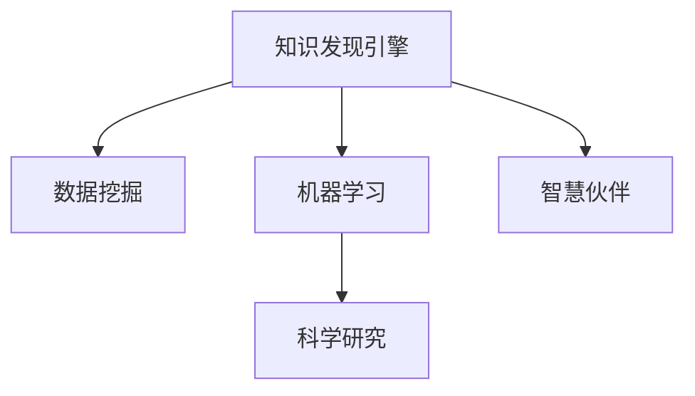

                 

# 知识发现引擎：推动科学研究的智慧伙伴

> 关键词：知识发现,数据挖掘,机器学习,科学研究,智慧伙伴

## 1. 背景介绍

### 1.1 问题由来

知识发现（Knowledge Discovery，KD），简称为KDD，是指从数据中自动或半自动地提取有用信息和知识的过程。随着大数据时代的到来，数据量呈爆炸性增长，传统的基于人工洞察与知识积累的科学研究方法显得力不从心。知识发现引擎应运而生，它利用先进的数据挖掘技术和机器学习算法，能够自动揭示数据背后的复杂模式与关系，极大地推动了科学研究的进展。

在生命科学领域，知识发现引擎已用于基因序列分析、蛋白质结构预测、药物发现等重要任务，为生物学研究提供了强大的工具。在物理学、天文学等领域，知识发现引擎也被用于研究宇宙结构、粒子物理等前沿问题，成为科学家不可或缺的智慧伙伴。

### 1.2 问题核心关键点

知识发现引擎的核心任务包括数据预处理、特征提取、模型训练和知识表示。其主要特点在于能够自动化处理海量的科学数据，并从中提取结构化和非结构化知识，提供决策支持，加速科学研究进程。

- **数据预处理**：包括数据清洗、去噪、归一化等步骤，目的是让数据更加适合进行分析。
- **特征提取**：从原始数据中提取对模型训练有帮助的特征，如频谱特征、时序特征等。
- **模型训练**：利用机器学习算法，对提取出的特征进行建模，得到模型参数。
- **知识表示**：将模型结果转换为结构化知识，以便人类理解和利用。

## 2. 核心概念与联系

### 2.1 核心概念概述

为更好地理解知识发现引擎的工作原理和优化方向，本节将介绍几个密切相关的核心概念：

- **知识发现引擎**：一种利用数据挖掘和机器学习技术，自动分析海量科学数据并提取知识的系统。它能够识别数据中的模式、趋势和异常，提供科学研究的决策支持。
- **数据挖掘**：从大量数据中发现有用知识和规律的过程。数据挖掘算法包括分类、聚类、关联规则学习、时序分析等。
- **机器学习**：研究如何让计算机从数据中学习经验，并做出预测或决策的学科。
- **科学研究**：使用科学方法和工具，系统地观察、分析和解释自然现象的学科。
- **智慧伙伴**：通过数据驱动的知识发现，支持人类决策，辅助科学研究的技术系统。

这些核心概念之间的逻辑关系可以通过以下Mermaid流程图来展示：



这个流程图展示了这个系统的工作流程：

1. 从科学数据中提取特征，并进行预处理。
2. 利用机器学习算法训练模型，进行特征学习和规律挖掘。
3. 将模型结果转换为结构化知识，辅助科学研究。
4. 知识发现引擎作为科学研究中的智慧伙伴，提供决策支持。

## 3. 核心算法原理 & 具体操作步骤
### 3.1 算法原理概述

知识发现引擎的核心算法是机器学习算法，其中最常用的包括监督学习、无监督学习和半监督学习。这些算法通过学习数据中隐藏的规律，从数据中提取有用的知识。

### 3.2 算法步骤详解

知识发现引擎的构建过程通常包括以下几个关键步骤：

**Step 1: 数据准备**
- 收集科学数据，并将其分为训练集和测试集。
- 对数据进行预处理，包括数据清洗、归一化和缺失值处理等。

**Step 2: 特征提取**
- 利用特征工程技术从原始数据中提取有用的特征。
- 对特征进行可视化，以帮助理解特征之间的关系。

**Step 3: 模型训练**
- 选择合适的机器学习算法，并在训练集上训练模型。
- 调整模型参数，确保模型能够泛化到测试集上。

**Step 4: 模型评估**
- 在测试集上对模型进行评估，测量其性能指标。
- 根据评估结果调整模型参数或选择新的算法。

**Step 5: 知识表示**
- 将模型结果转换为结构化知识，如模式、规则或摘要。
- 利用可视化工具呈现知识发现结果，帮助研究人员理解和应用。

### 3.3 算法优缺点

知识发现引擎具有以下优点：

1. **自动化分析**：能够处理大规模科学数据，自动发现其中蕴含的知识。
2. **加速研究**：通过自动化模型训练，可以大幅缩短科学研究的周期。
3. **提高准确性**：利用先进算法，能够从数据中提取更准确的规律。
4. **降低成本**：减少了人工数据分析的复杂性和成本。

同时，该方法也存在一定的局限性：

1. **数据质量依赖**：对数据的清洗和处理要求较高，数据噪声和不完整性可能影响结果。
2. **模型选择复杂**：不同的机器学习算法可能对相同数据产生不同的结果，需要谨慎选择。
3. **结果解释性不足**：许多模型结果难以解释，特别是复杂的深度学习模型。
4. **算法偏见**：机器学习算法可能学习到数据中的偏见，导致结果偏差。
5. **隐私保护问题**：科学数据往往包含敏感信息，如何保护数据隐私是一大挑战。

尽管存在这些局限性，但就目前而言，基于机器学习的知识发现引擎仍是科学数据处理的主流范式。未来相关研究的重点在于如何进一步提高算法的可解释性、泛化性和鲁棒性，同时兼顾隐私保护和数据质量。

### 3.4 算法应用领域

知识发现引擎已经在多个领域得到了应用，包括但不限于：

- **生命科学**：用于基因组学、蛋白质组学、药物发现等领域，帮助科学家理解生物体系的结构与功能。
- **天文学**：分析宇宙射线数据、星系运动、黑洞等现象，揭示宇宙的奥秘。
- **物理学**：研究粒子物理、高能物理等领域的实验数据，寻找新物理现象。
- **社会科学**：分析社会调查数据、经济数据，预测社会行为和经济趋势。
- **金融分析**：处理金融市场数据，发现市场模式和风险点。
- **健康医疗**：分析医疗数据，支持临床决策和治疗方案优化。

## 4. 数学模型和公式 & 详细讲解 & 举例说明

### 4.1 数学模型构建

知识发现引擎的数学模型通常包括以下部分：

- **训练数据**：原始科学数据，如基因序列、天文观测数据等。
- **特征**：从原始数据中提取的特征，如基因表达水平、星系运动速度等。
- **模型**：选择的机器学习算法，如决策树、随机森林、神经网络等。
- **损失函数**：用于衡量模型预测结果与真实值之间的差异。
- **优化算法**：用于最小化损失函数，调整模型参数。

### 4.2 公式推导过程

以决策树为例，我们推导决策树的训练过程。假设训练数据集为$D=\{(x_i,y_i)\}_{i=1}^N$，其中$x_i$为输入特征，$y_i$为输出标签，决策树的目标是找到一个最佳的决策树结构$T$，使得对任意输入$x$，都有$T(x)=y$。

决策树的训练过程可以概括为以下几步：

1. **特征选择**：从所有特征中选择一个最佳的特征作为当前节点的分割点。
2. **划分数据集**：根据选择的特征，将数据集划分为两个子集$D_1$和$D_2$。
3. **递归调用**：对每个子集递归执行特征选择和划分过程，直到子集中的样本数量小于预设阈值或无法划分为止。
4. **剪枝优化**：对生成的决策树进行剪枝优化，避免过拟合。

决策树训练的损失函数通常使用信息增益或信息增益比，目标是最小化损失函数：

$$
\mathcal{L}(T) = \frac{1}{N}\sum_{i=1}^N \ell(T(x_i),y_i)
$$

其中$\ell$为损失函数，如分类误差率。

### 4.3 案例分析与讲解

以基因组数据分析为例，解释知识发现引擎如何帮助科学家提取有用的知识。

假设有一组基因表达数据，包含若干基因在不同样本中的表达水平。科学家希望通过这些数据预测某个基因是否与癌症有关。

**数据预处理**：首先对数据进行清洗和归一化，去除噪声和缺失值。

**特征提取**：提取基因表达水平、基因长度、基因功能分类等特征。

**模型训练**：利用随机森林等算法在训练集上训练模型，调整树的数量和深度等参数。

**模型评估**：在测试集上评估模型性能，如准确率、召回率等。

**知识表示**：将模型结果转换为基因表达模式和癌症相关的特征，帮助科学家理解基因与癌症的关系。

## 5. 项目实践：代码实例和详细解释说明
### 5.1 开发环境搭建

在进行知识发现引擎的开发前，我们需要准备好开发环境。以下是使用Python进行Scikit-learn开发的环境配置流程：

1. 安装Anaconda：从官网下载并安装Anaconda，用于创建独立的Python环境。

2. 创建并激活虚拟环境：
```bash
conda create -n sk-learn-env python=3.8 
conda activate sk-learn-env
```

3. 安装Scikit-learn：从官网获取对应的安装命令。例如：
```bash
conda install scikit-learn==0.24.2
```

4. 安装各类工具包：
```bash
pip install numpy pandas matplotlib seaborn joblib jupyter notebook ipython
```

完成上述步骤后，即可在`sk-learn-env`环境中开始知识发现引擎的开发。

### 5.2 源代码详细实现

下面我们以基因表达数据分析为例，给出使用Scikit-learn进行决策树模型训练的Python代码实现。

首先，定义数据处理函数：

```python
import pandas as pd
import numpy as np
from sklearn.model_selection import train_test_split
from sklearn.ensemble import RandomForestClassifier

def load_data(file_path):
    data = pd.read_csv(file_path)
    features = data.drop('label', axis=1)
    labels = data['label']
    return features, labels

def split_data(features, labels, test_size=0.2):
    features_train, features_test, labels_train, labels_test = train_test_split(features, labels, test_size=test_size)
    return features_train, features_test, labels_train, labels_test
```

然后，定义模型训练函数：

```python
def train_model(features_train, labels_train, features_test, labels_test):
    model = RandomForestClassifier(n_estimators=100, max_depth=3, random_state=42)
    model.fit(features_train, labels_train)
    score = model.score(features_test, labels_test)
    return model, score
```

接着，定义评估函数：

```python
from sklearn.metrics import accuracy_score, precision_score, recall_score

def evaluate_model(model, features_test, labels_test):
    predictions = model.predict(features_test)
    accuracy = accuracy_score(labels_test, predictions)
    precision = precision_score(labels_test, predictions)
    recall = recall_score(labels_test, predictions)
    return accuracy, precision, recall
```

最后，启动训练流程并在测试集上评估：

```python
file_path = 'gene_expression.csv'
features, labels = load_data(file_path)
features_train, features_test, labels_train, labels_test = split_data(features, labels, test_size=0.2)

model, score = train_model(features_train, labels_train, features_test, labels_test)
accuracy, precision, recall = evaluate_model(model, features_test, labels_test)

print(f'Accuracy: {accuracy:.2f}, Precision: {precision:.2f}, Recall: {recall:.2f}')
```

以上就是使用Scikit-learn进行决策树模型训练的完整代码实现。可以看到，得益于Scikit-learn的强大封装，我们可以用相对简洁的代码完成数据处理、模型训练和评估。

### 5.3 代码解读与分析

让我们再详细解读一下关键代码的实现细节：

**load_data函数**：
- 加载原始数据集，将其分为特征和标签两部分。

**split_data函数**：
- 对数据进行划分，生成训练集和测试集。

**train_model函数**：
- 定义随机森林模型，并在训练集上训练模型。
- 返回训练好的模型和在测试集上的得分。

**evaluate_model函数**：
- 在测试集上评估模型的性能指标，包括准确率、精确率和召回率。

**训练流程**：
- 加载数据集。
- 对数据进行划分。
- 训练随机森林模型。
- 评估模型性能。
- 输出评估结果。

可以看到，Scikit-learn库使得知识发现引擎的代码实现变得简洁高效。开发者可以将更多精力放在数据处理、模型改进等高层逻辑上，而不必过多关注底层的实现细节。

当然，工业级的系统实现还需考虑更多因素，如模型的保存和部署、超参数的自动搜索、更灵活的任务适配层等。但核心的知识发现引擎原理基本与此类似。

## 6. 实际应用场景
### 6.1 智能诊断系统

在医学领域，知识发现引擎可以用于构建智能诊断系统，辅助医生进行疾病诊断和治疗方案设计。传统医学诊断往往依赖于经验丰富的专家，而知识发现引擎能够通过分析海量的病历数据，自动提取疾病特征和规律，提供快速准确的诊断建议。

在技术实现上，可以收集医疗机构的历史病历数据，将其标注为疾病和无病状态，在此基础上对预训练模型进行微调。微调后的模型能够自动识别输入病历中的疾病特征，推荐相应的治疗方案。对于新的病历数据，模型也可以自动分析和评估，快速给出诊断结果。

### 6.2 天文观测数据分析

天文学领域的数据量庞大且复杂，传统的手工分析方法难以处理。知识发现引擎能够自动分析天文观测数据，提取天体运动规律和物理参数，帮助天文学家研究宇宙结构、恒星演化等重要问题。

具体而言，知识发现引擎可以对天文观测数据进行时序分析和频谱分析，提取天体的运动轨迹、光谱特征等关键信息。然后，利用机器学习算法进行模式识别和预测，识别出可能的恒星爆发、新星等天文现象。通过不断训练和优化模型，知识发现引擎能够提供更加准确和深入的宇宙研究支持。

### 6.3 市场行为预测

金融领域的数据具有高度的时序性和非线性特征，传统统计方法难以处理。知识发现引擎能够通过分析历史市场数据，预测未来的市场趋势和波动。

在技术实现上，知识发现引擎可以利用时序分析和深度学习算法，对历史股价、交易量等数据进行分析。通过识别市场模式和异常，模型能够预测未来的市场走势，帮助投资者做出更好的投资决策。知识发现引擎还可以与其他金融分析工具结合，形成更加全面的金融风险评估体系。

### 6.4 未来应用展望

随着知识发现引擎的发展，未来其在更多领域的应用将更加广泛。

在环境科学领域，知识发现引擎可以用于分析大气数据、海洋数据等，提取环境变化规律，预测气候变化趋势。

在农业领域，知识发现引擎可以分析土壤数据、气候数据等，优化农业生产方案，提高作物产量和质量。

在城市管理领域，知识发现引擎可以分析城市交通数据、环境数据等，优化城市资源配置，提高城市治理水平。

此外，在教育、交通、能源等众多领域，知识发现引擎都将发挥重要作用，推动各行各业向智能化、自动化方向发展。相信随着技术的不断进步，知识发现引擎将在更广阔的领域大放异彩，成为人类智慧的强大伙伴。

## 7. 工具和资源推荐
### 7.1 学习资源推荐

为了帮助开发者系统掌握知识发现引擎的理论基础和实践技巧，这里推荐一些优质的学习资源：

1. 《Python数据科学手册》系列博文：由数据科学专家撰写，深入浅出地介绍了Python在数据科学中的应用，包括数据处理、机器学习、可视化等。

2. 《机器学习》课程：斯坦福大学开设的机器学习经典课程，涵盖理论基础和实践技巧，适合入门和进阶学习。

3. 《数据挖掘导论》书籍：由数据挖掘专家所著，全面介绍了数据挖掘的原理、算法和应用，适合系统学习。

4. Kaggle数据科学竞赛平台：提供了丰富的数据集和实际问题，通过竞赛的形式推动学习者提升数据挖掘和机器学习技能。

5. GitHub开源项目：Github上众多数据挖掘和机器学习项目，可以学习优秀实践，推动项目创新。

通过对这些资源的学习实践，相信你一定能够快速掌握知识发现引擎的精髓，并用于解决实际的科学问题。
### 7.2 开发工具推荐

高效的开发离不开优秀的工具支持。以下是几款用于知识发现引擎开发的常用工具：

1. Python：开源编程语言，拥有丰富的科学计算库，如NumPy、Pandas等，适合数据处理和机器学习。

2. R：另一款广泛使用的统计分析语言，拥有丰富的数据挖掘和统计分析库，如ggplot2、caret等。

3. Scikit-learn：Python中的机器学习库，提供了众多经典的机器学习算法和工具，如决策树、随机森林、支持向量机等。

4. TensorFlow：由Google主导开发的深度学习框架，生产部署方便，适合大规模工程应用。

5. Apache Spark：分布式计算框架，适合处理大规模数据集，支持机器学习和数据挖掘任务。

6. Jupyter Notebook：交互式编程环境，支持多种语言和库，适合快速原型开发和实验。

合理利用这些工具，可以显著提升知识发现引擎的开发效率，加快创新迭代的步伐。

### 7.3 相关论文推荐

知识发现引擎的发展源于学界的持续研究。以下是几篇奠基性的相关论文，推荐阅读：

1. J. Han和M. Kamber的《数据挖掘：概念与技术》：经典的机器学习与数据挖掘教材，系统介绍了数据挖掘的基本概念和算法。

2. Y. Bengio等人的《深度学习》：深度学习领域的经典教材，介绍了深度学习的基本原理和应用。

3. J. Friedman的《广义可添加模型》：介绍了广义可添加模型及其在机器学习中的应用，强调模型的可解释性和泛化性。

4. R. Bhatia和V. Le等的《深度学习在知识发现中的应用》：综述了深度学习在知识发现中的最新进展和应用案例。

这些论文代表了大规模知识发现引擎的发展脉络。通过学习这些前沿成果，可以帮助研究者把握学科前进方向，激发更多的创新灵感。

## 8. 总结：未来发展趋势与挑战
### 8.1 总结

本文对知识发现引擎的构建方法和实际应用进行了全面系统的介绍。首先阐述了知识发现引擎的背景和意义，明确了其在推动科学研究进程中的重要价值。其次，从原理到实践，详细讲解了知识发现引擎的数学模型和操作步骤，给出了具体的代码实例。同时，本文还广泛探讨了知识发现引擎在多个领域的应用前景，展示了其广泛的应用范围。

通过本文的系统梳理，可以看到，知识发现引擎已经广泛应用于科学数据的处理和分析中，成为推动科学研究的重要工具。未来，伴随技术的不断演进，知识发现引擎将发挥更加重要的作用，进一步提升科学研究的效率和精度。

### 8.2 未来发展趋势

展望未来，知识发现引擎将呈现以下几个发展趋势：

1. **智能化提升**：随着深度学习和大规模并行计算技术的发展，知识发现引擎将具备更强的智能化处理能力，能够自动学习复杂模式和规律。

2. **自动化优化**：利用自动化超参优化技术，知识发现引擎能够自动选择和优化模型参数，提升模型性能和效率。

3. **跨领域融合**：知识发现引擎将与其他领域的技术结合，如自然语言处理、图像处理等，形成跨领域知识发现引擎，提升综合应用能力。

4. **实时化应用**：知识发现引擎将具备实时处理数据的能力，能够对数据进行实时分析和预测，提供更及时的研究支持。

5. **多样化数据源**：知识发现引擎将支持多种数据源，包括结构化数据、非结构化数据、时序数据等，提升数据处理能力。

6. **安全性保障**：数据安全和隐私保护将成为知识发现引擎的重要研究方向，保证数据在处理和应用过程中的安全性。

以上趋势凸显了知识发现引擎的广阔前景。这些方向的探索发展，必将进一步提升知识发现引擎的智能化水平，为科学研究提供更强大的支持。

### 8.3 面临的挑战

尽管知识发现引擎已经取得了瞩目成就，但在迈向更加智能化、自动化应用的过程中，它仍面临着诸多挑战：

1. **数据质量和多样性**：数据清洗和预处理复杂，不同领域和类型的数据需要适配不同的处理方式。

2. **模型复杂性和解释性**：深度学习模型复杂，难以解释，可能面临模型的"黑盒"问题。

3. **计算资源消耗**：大规模数据的处理和分析需要大量的计算资源，可能导致算力成本较高。

4. **数据隐私保护**：科学数据往往包含敏感信息，如何保护数据隐私是一大挑战。

5. **算法偏见**：机器学习算法可能学习到数据中的偏见，导致结果偏差。

6. **技术推广和应用**：知识发现引擎需要与具体领域的技术和知识结合，才能发挥最大效用，推广和应用难度较大。

尽管存在这些挑战，但随着学界和产业界的共同努力，这些问题终将逐步解决，知识发现引擎必将在科学研究和工程技术中发挥更大的作用。

### 8.4 研究展望

面向未来，知识发现引擎的研究需要在以下几个方面寻求新的突破：

1. **自动化学习与推理**：发展自动化学习技术，让知识发现引擎具备更强的逻辑推理和自我优化能力。

2. **跨模态数据融合**：研究多模态数据的融合技术，提升知识发现引擎的综合处理能力。

3. **多任务学习**：研究多任务学习技术，让知识发现引擎同时处理多个任务，提升综合应用能力。

4. **边缘计算与联邦学习**：发展边缘计算和联邦学习技术，提升知识发现引擎的实时处理和隐私保护能力。

5. **智能诊断与预测**：研究智能诊断和预测技术，提升知识发现引擎在医疗、金融等领域的应用效果。

6. **知识驱动的决策支持**：研究知识驱动的决策支持系统，提升知识发现引擎的决策辅助能力。

这些研究方向的探索，必将引领知识发现引擎技术迈向新的高度，为科学研究和技术应用提供更强大的支持。

## 9. 附录：常见问题与解答

**Q1：知识发现引擎是否适用于所有科学数据？**

A: 知识发现引擎在大多数科学数据上都能取得较好的效果，但需要注意数据的清洗和预处理。特别是对于不规范的数据，需要进行特殊处理。

**Q2：如何提高知识发现引擎的泛化能力？**

A: 可以通过数据增强、正则化、交叉验证等技术，提高模型的泛化能力。选择合适的特征和算法也是提升泛化能力的关键。

**Q3：知识发现引擎的计算复杂度如何控制？**

A: 可以通过模型裁剪、并行计算、分布式计算等技术，控制知识发现引擎的计算复杂度，提高处理效率。

**Q4：知识发现引擎是否需要人工干预？**

A: 在实际应用中，知识发现引擎通常需要结合领域专家的人工干预，才能得到更准确和有意义的结果。

**Q5：知识发现引擎的部署和集成难度大吗？**

A: 知识发现引擎的部署和集成相对复杂，需要考虑数据源、模型选择、系统架构等多方面因素。但随着技术的发展，这个问题将逐步得到解决。

综上所述，知识发现引擎已经成为推动科学研究和技术应用的重要工具。未来，伴随技术的不断进步，知识发现引擎将在更多领域发挥重要作用，为科学研究和技术创新提供更加强大的支持。

---

作者：禅与计算机程序设计艺术 / Zen and the Art of Computer Programming

