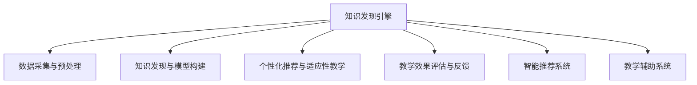

                 

# 知识发现引擎：教育领域的个性化变革

> 关键词：知识发现引擎,个性化学习,自适应教育,智能推荐系统,教学辅助系统

## 1. 背景介绍

### 1.1 问题由来
在21世纪教育领域，个性化学习已成为教育改革和创新的重要方向。传统的一刀切教学方式无法满足学生的不同需求，每个学生的能力和兴趣差异较大，统一的教学计划无法真正适应学生的个性化需求。个性化学习旨在提供量身定制的教育方案，帮助学生更好地实现自身潜力。然而，由于数据采集、分析和应用上的挑战，实现个性化学习的目标仍然面临诸多困难。

个性化学习需要系统地采集、分析、存储和应用学生数据，以动态调整教学内容、教学方式和评估标准。这涉及大数据、机器学习、人工智能等多个技术领域，具有极高的复杂性和技术挑战。在这一背景下，知识发现引擎（Knowledge Discovery Engine, KDE）作为个性化学习的重要技术工具，成为教育领域研究的热点。

### 1.2 问题核心关键点
知识发现引擎是一种智能数据处理系统，通过对学生学习数据和教育资源数据的分析，自动发现知识，并基于这些知识提供个性化学习路径和教学策略。其核心关键点包括：
1. 数据采集与预处理：收集学生学习行为、心理特征、学习效果等数据，并对数据进行清洗和标准化处理。
2. 知识发现与模型构建：通过机器学习、深度学习等算法，自动发现教育资源之间的关联，构建知识图谱。
3. 个性化推荐与适应性教学：基于知识图谱和学生特征，动态调整教学内容、教学策略和评估标准，实现个性化学习。
4. 教学效果评估与反馈：定期评估教学效果，分析教学过程中的问题，并根据评估结果优化教学方案。

这些关键点共同构成了知识发现引擎在教育领域的核心功能。通过有效利用知识发现引擎，可以大大提升教育质量和学生的学习效率。

### 1.3 问题研究意义
知识发现引擎在教育领域的应用，具有以下重要意义：

1. 提高教学效率：通过自动化数据处理和智能分析，知识发现引擎能够帮助教师快速理解学生的学习状态，及时调整教学内容，优化教学方法，提高教学效率。

2. 促进个性化学习：通过分析学生的学习习惯、兴趣和能力，知识发现引擎能够提供个性化的学习路径和资源，使每个学生都能在最适合自己的方式下学习，最大化发挥其学习潜力。

3. 改善学习效果：通过实时监控和评估学习效果，知识发现引擎能够及时发现学生学习中的问题，并提供针对性的解决方案，从而提高学习效果。

4. 推动教育公平：知识发现引擎能够为每个学生提供平等的教育机会，通过个性化学习路径，弥补传统教育中资源不均衡的问题，实现教育公平。

5. 促进教育创新：知识发现引擎的引入，能够推动教育模式创新，为学生提供更灵活、更高效的学习方式，激发学生的学习兴趣和创造力。

## 2. 核心概念与联系

### 2.1 核心概念概述

为了更好地理解知识发现引擎在教育领域的应用，我们首先介绍几个核心概念：

- 知识发现引擎（KDE）：一种智能数据处理系统，通过对学习数据和教育资源数据的分析，自动发现知识，并提供个性化学习路径和教学策略。

- 个性化学习：根据学生的个体差异和需求，量身定制的学习方案，旨在帮助学生最有效地实现其潜能。

- 自适应教育：通过实时监控和分析学生的学习状态，动态调整教学内容和策略，提供个性化的教育体验。

- 智能推荐系统：根据用户的历史行为和特征，自动推荐合适的教育资源和学习路径，支持个性化学习。

- 教学辅助系统：结合知识发现和智能推荐，为教师和学生提供全方位的教学支持，如作业布置、课程推荐、学习路径等。

这些概念之间存在密切的联系。知识发现引擎是实现个性化学习和自适应教育的核心技术工具，通过智能推荐和教学辅助系统，知识发现引擎能够为每个学生提供个性化的学习方案，并辅助教师进行有效的教学工作。

### 2.2 核心概念原理和架构的 Mermaid 流程图



这个流程图展示了知识发现引擎的核心功能和数据流向。数据采集与预处理是基础，知识发现与模型构建是核心，个性化推荐与适应性教学和教学效果评估与反馈是应用，智能推荐系统和教学辅助系统是服务。

## 3. 核心算法原理 & 具体操作步骤
### 3.1 算法原理概述

知识发现引擎的算法原理主要基于机器学习和深度学习的技术，通过对大量数据的学习，发现其中的规律和知识，并用于个性化学习路径和教学策略的生成。具体来说，知识发现引擎包括以下几个核心步骤：

1. 数据采集与预处理：收集学生学习行为、心理特征、学习效果等数据，并对数据进行清洗和标准化处理。
2. 知识发现与模型构建：通过机器学习、深度学习等算法，自动发现教育资源之间的关联，构建知识图谱。
3. 个性化推荐与适应性教学：基于知识图谱和学生特征，动态调整教学内容、教学策略和评估标准，实现个性化学习。
4. 教学效果评估与反馈：定期评估教学效果，分析教学过程中的问题，并根据评估结果优化教学方案。

### 3.2 算法步骤详解

下面详细介绍知识发现引擎的算法步骤：

**Step 1: 数据采集与预处理**

1. 学习行为数据：收集学生在学习过程中的行为数据，如学习时间、学习频率、使用的学习工具等。
2. 心理特征数据：收集学生的心理特征数据，如性格、兴趣、情绪状态等。
3. 学习效果数据：收集学生的学习效果数据，如考试成绩、作业完成情况等。
4. 数据标准化处理：对采集的数据进行清洗和标准化处理，如去除异常值、填补缺失值等。

**Step 2: 知识发现与模型构建**

1. 特征工程：根据采集的数据，提取关键特征，如学习频率、考试成绩、情绪状态等。
2. 数据建模：构建机器学习模型，如决策树、随机森林、神经网络等，对数据进行建模。
3. 知识图谱构建：利用深度学习算法，如图神经网络(Graph Neural Network, GNN)，构建知识图谱，发现教育资源之间的关联。
4. 模型评估：对构建的模型进行评估，选择最优模型用于后续分析。

**Step 3: 个性化推荐与适应性教学**

1. 学生特征提取：提取学生的特征，如兴趣、学习能力、学习偏好等。
2. 学习路径生成：基于知识图谱和学生特征，生成个性化的学习路径和资源推荐。
3. 教学策略调整：根据学生的学习状态和效果，动态调整教学策略，如调整教学内容、学习难度、学习方式等。
4. 学习效果评估：实时监控学生的学习效果，分析学习过程中的问题，提供及时的反馈和支持。

**Step 4: 教学效果评估与反馈**

1. 学习效果评估：定期评估学生的学习效果，如考试成绩、作业完成情况等。
2. 问题分析：分析学习过程中的问题，如学习难度、学习兴趣等。
3. 教学方案优化：根据评估结果，优化教学方案，提高教学效果。
4. 反馈机制建立：建立教学反馈机制，收集学生和教师的反馈，进一步优化教学方案。

### 3.3 算法优缺点

知识发现引擎在教育领域的应用，具有以下优点：

1. 提高教学效率：通过自动化数据处理和智能分析，知识发现引擎能够帮助教师快速理解学生的学习状态，及时调整教学内容，优化教学方法，提高教学效率。
2. 促进个性化学习：通过分析学生的学习习惯、兴趣和能力，知识发现引擎能够提供个性化的学习路径和资源，使每个学生都能在最适合自己的方式下学习，最大化发挥其学习潜力。
3. 改善学习效果：通过实时监控和评估学习效果，知识发现引擎能够及时发现学生学习中的问题，并提供针对性的解决方案，从而提高学习效果。
4. 推动教育公平：知识发现引擎能够为每个学生提供平等的教育机会，通过个性化学习路径，弥补传统教育中资源不均衡的问题，实现教育公平。

同时，知识发现引擎也存在一定的局限性：

1. 数据依赖性高：知识发现引擎依赖于高质量的数据，数据的采集、清洗和标准化处理需要大量的技术和人力投入。
2. 模型复杂度高：知识发现引擎构建的模型复杂度高，需要大量的计算资源和时间，对硬件设施要求较高。
3. 解释性不足：知识发现引擎的决策过程通常缺乏可解释性，难以对其推理逻辑进行分析和调试。
4. 伦理与安全问题：知识发现引擎在处理学生数据时，需要注意数据隐私和安全问题，避免数据泄露和滥用。

尽管存在这些局限性，但知识发现引擎在教育领域的应用前景仍然广阔。未来，随着技术的进步和数据的积累，这些问题有望得到更好的解决。

### 3.4 算法应用领域

知识发现引擎在教育领域的应用范围非常广泛，主要包括以下几个方面：

1. 个性化学习路径：通过分析学生的学习行为、兴趣和能力，知识发现引擎能够提供个性化的学习路径，帮助学生在最适合自己的方式下学习。

2. 智能推荐系统：根据学生的学习行为和历史数据，知识发现引擎能够自动推荐合适的教育资源和学习路径，支持个性化学习。

3. 教学辅助系统：结合知识发现和智能推荐，知识发现引擎能够为教师和学生提供全方位的教学支持，如作业布置、课程推荐、学习路径等。

4. 自适应教育平台：通过实时监控和分析学生的学习状态，知识发现引擎能够动态调整教学内容和策略，提供个性化的教育体验。

5. 教学效果评估：通过定期评估教学效果，分析教学过程中的问题，知识发现引擎能够优化教学方案，提高教学效果。

## 4. 数学模型和公式 & 详细讲解 & 举例说明

### 4.1 数学模型构建

知识发现引擎的数学模型构建主要基于机器学习和深度学习的技术，通过对大量数据的学习，发现其中的规律和知识，并用于个性化学习路径和教学策略的生成。

设学生数据集为 $D=\{(x_i,y_i)\}_{i=1}^N$，其中 $x_i$ 为学生特征，$y_i$ 为学习效果。假设学生特征空间为 $\mathcal{X}$，学习效果空间为 $\mathcal{Y}$。定义知识发现引擎的目标函数为：

$$
\min_{\theta} \mathcal{L}(\theta; D)
$$

其中 $\mathcal{L}$ 为损失函数，用于衡量模型预测与真实标签之间的差异。

### 4.2 公式推导过程

以下以学生兴趣分析为例，推导知识发现引擎的基本模型。

假设学生兴趣空间为 $\mathcal{Z}$，学习行为数据为 $B=\{(b_i,r_i)\}_{i=1}^M$，其中 $b_i$ 为行为数据，$r_i$ 为兴趣评分。构建一个兴趣预测模型 $M_{\theta}:\mathcal{X} \rightarrow \mathcal{Z}$，其中 $\theta$ 为模型参数。

定义模型在数据样本 $(x_i,y_i)$ 上的损失函数为 $\ell(M_{\theta}(x_i),y_i)$，则在数据集 $D$ 上的经验风险为：

$$
\mathcal{L}(\theta) = \frac{1}{N} \sum_{i=1}^N \ell(M_{\theta}(x_i),y_i)
$$

通过梯度下降等优化算法，最小化经验风险，得到最优参数：

$$
\theta^* = \mathop{\arg\min}_{\theta} \mathcal{L}(\theta)
$$

在得到模型参数 $\theta^*$ 后，知识发现引擎可以基于学生特征 $x_i$ 预测其兴趣 $z_i = M_{\theta^*}(x_i)$，进一步生成个性化的学习路径和资源推荐。

### 4.3 案例分析与讲解

以在线教育平台为例，分析知识发现引擎在个性化学习路径中的应用。

**案例背景**：某在线教育平台需要根据学生的学习行为数据和历史成绩，推荐合适的学习路径和资源。平台收集了学生每天的登录时间、观看视频时间、完成作业时间等行为数据，以及学生的考试成绩和历史成绩。

**案例分析**：

1. 数据采集与预处理：平台收集学生每天的登录时间、观看视频时间、完成作业时间等行为数据，以及学生的考试成绩和历史成绩，并对数据进行清洗和标准化处理。

2. 知识发现与模型构建：平台构建一个机器学习模型，如随机森林，对学生的行为数据和学习效果进行建模。模型输出学生对不同科目的兴趣评分，构建知识图谱，发现教育资源之间的关联。

3. 个性化推荐与适应性教学：平台根据学生的兴趣评分和历史成绩，生成个性化的学习路径和资源推荐。动态调整教学内容、学习难度和学习方式，提供个性化的教育体验。

4. 教学效果评估与反馈：平台定期评估学生的学习效果，如考试成绩和作业完成情况，分析学习过程中的问题，优化教学方案。建立教学反馈机制，收集学生和教师的反馈，进一步优化教学方案。

## 5. 项目实践：代码实例和详细解释说明

### 5.1 开发环境搭建

在进行知识发现引擎的开发实践前，我们需要准备好开发环境。以下是使用Python进行TensorFlow开发的环境配置流程：

1. 安装Anaconda：从官网下载并安装Anaconda，用于创建独立的Python环境。

2. 创建并激活虚拟环境：
```bash
conda create -n tf-env python=3.8 
conda activate tf-env
```

3. 安装TensorFlow：根据CUDA版本，从官网获取对应的安装命令。例如：
```bash
pip install tensorflow
```

4. 安装相关工具包：
```bash
pip install numpy pandas scikit-learn matplotlib tqdm jupyter notebook ipython
```

完成上述步骤后，即可在`tf-env`环境中开始开发实践。

### 5.2 源代码详细实现

这里我们以学生兴趣分析为例，给出使用TensorFlow进行知识发现引擎的PyTorch代码实现。

首先，定义学生兴趣预测模型的输入和输出：

```python
import tensorflow as tf
from tensorflow.keras.layers import Input, Dense, Dropout
from tensorflow.keras.models import Model

# 定义输入层
input_layer = Input(shape=(5,), name='input_layer')
# 定义隐藏层
hidden_layer = Dense(128, activation='relu', name='hidden_layer')(input_layer)
# 定义输出层
output_layer = Dense(1, activation='sigmoid', name='output_layer')(hidden_layer)

# 定义模型
model = Model(inputs=input_layer, outputs=output_layer)
model.compile(optimizer='adam', loss='binary_crossentropy', metrics=['accuracy'])

# 打印模型结构
model.summary()
```

然后，定义模型训练的函数：

```python
# 定义训练函数
def train_model(model, train_data, epochs=10, batch_size=32):
    model.fit(train_data, epochs=epochs, batch_size=batch_size, validation_split=0.2)

# 加载数据集
train_dataset = tf.data.Dataset.from_tensor_slices(train_data)
train_dataset = train_dataset.shuffle(buffer_size=10000).batch(batch_size)

# 训练模型
train_model(model, train_dataset)
```

最后，使用训练好的模型进行兴趣预测和个性化推荐：

```python
# 加载测试数据
test_data = tf.data.Dataset.from_tensor_slices(test_data)
test_data = test_data.shuffle(buffer_size=10000).batch(batch_size)

# 预测兴趣
predictions = model.predict(test_data)

# 输出预测结果
print(predictions)
```

以上就是使用TensorFlow进行学生兴趣分析的完整代码实现。可以看到，得益于TensorFlow的强大封装，我们能够用相对简洁的代码完成模型的训练和预测。

### 5.3 代码解读与分析

让我们再详细解读一下关键代码的实现细节：

**学生兴趣预测模型**：
- `Input`层：定义输入层，接收5维特征向量作为输入。
- `Dense`层：定义一个128维的隐藏层，使用ReLU激活函数。
- `Dense`层：定义一个输出层，使用Sigmoid激活函数，输出单个兴趣评分。
- `Model`：将输入层、隐藏层和输出层组合成模型。
- `compile`：定义模型的优化器、损失函数和评估指标。
- `summary`：打印模型结构。

**训练函数**：
- `train_model`函数：定义训练函数，使用Adam优化器和二元交叉熵损失函数，进行模型训练。
- `fit`方法：对数据集进行迭代训练，每次训练一个epoch，使用验证集进行模型评估。
- `shuffle`方法：对数据集进行打乱，避免模型过拟合。
- `batch`方法：对数据集进行批处理，提高训练效率。

**测试函数**：
- `test_data`：定义测试数据集。
- `shuffle`方法：对测试数据集进行打乱。
- `batch`方法：对测试数据集进行批处理。
- `predict`方法：对测试数据集进行兴趣预测，输出预测结果。

可以看到，TensorFlow提供了强大的机器学习库，可以方便地实现模型的训练、评估和预测。开发者可以将更多精力放在模型设计和数据处理上，而不必过多关注底层的实现细节。

当然，工业级的系统实现还需考虑更多因素，如模型的保存和部署、超参数的自动搜索、更灵活的任务适配层等。但核心的知识发现引擎基本与此类似。

## 6. 实际应用场景
### 6.1 在线教育平台

知识发现引擎在在线教育平台中的应用，可以大大提升平台的个性化推荐能力和教学效果。在线教育平台收集了大量的学生学习行为数据，如登录时间、观看视频时间、完成作业时间等，以及学生的考试成绩和历史成绩。通过知识发现引擎，平台可以生成个性化的学习路径和资源推荐，动态调整教学内容和策略，提供个性化的教育体验。

例如，某在线教育平台通过知识发现引擎，分析学生的学习行为和历史成绩，发现大部分学生对数学科目兴趣较低，观看视频时间较少。平台根据这一发现，推荐学生观看更多数学视频，并提供一些有趣的数学问题，激发学生的学习兴趣。同时，平台根据学生的学习效果，动态调整教学内容，如增加难度、调整学习方式等，提高教学效果。

### 6.2 智能教育管理

知识发现引擎在智能教育管理中的应用，可以提供全方位的教学支持和管理方案。智能教育管理平台收集了大量学生的学习行为数据，如学习时间、考试成绩、作业完成情况等，以及教师的教学行为数据，如上课时间、上课方式、授课内容等。通过知识发现引擎，平台可以生成个性化的教学方案和管理方案，提升教学效果和管理效率。

例如，某智能教育管理平台通过知识发现引擎，分析学生的学习效果和教师的教学效果，发现学生对某门课程的考试成绩较低，教师的教学方式不适合学生的学习习惯。平台根据这一发现，向学生推荐合适的学习资源，并向教师推荐合适的教学方法，帮助教师调整教学策略，提高教学效果。

### 6.3 在线答疑系统

知识发现引擎在在线答疑系统中的应用，可以提供智能化的答疑服务。在线答疑系统收集了大量的学生提问数据，以及教师的答疑数据。通过知识发现引擎，系统可以生成智能化的答疑方案，提升答疑效果。

例如，某在线答疑系统通过知识发现引擎，分析学生的问题和教师的答疑数据，发现学生对某些问题难以理解，教师的答疑方式不够清晰。系统根据这一发现，向教师推荐合适的答疑策略，如使用更清晰的语言、提供更多示例等，帮助教师提升答疑效果。同时，系统根据学生的提问数据，生成个性化的答疑方案，帮助学生更快地解决问题。

## 7. 工具和资源推荐
### 7.1 学习资源推荐

为了帮助开发者系统掌握知识发现引擎的理论基础和实践技巧，这里推荐一些优质的学习资源：

1. 《深度学习》课程：由吴恩达教授讲授的《深度学习》课程，涵盖了深度学习的基本概念和常用算法，是入门深度学习领域的经典课程。

2. 《Python机器学习》书籍：由Sebastian Raschka和Vahid Mirjalili所著，介绍了Python在机器学习中的应用，包括数据预处理、模型训练、评估等。

3. 《TensorFlow实战》书籍：由Manning和Hao-Chun Chen所著，介绍了TensorFlow的使用方法和最佳实践，适合初学者和进阶开发者。

4. 《Keras深度学习教程》：由Keras官方文档提供，介绍了Keras的使用方法和示例，适合快速上手深度学习模型。

5. 《KDE: A Survey》论文：论文综述了知识发现引擎的发展历程、应用领域和未来趋势，适合深入了解该领域的最新进展。

通过对这些资源的学习实践，相信你一定能够快速掌握知识发现引擎的精髓，并用于解决实际的个性化学习问题。

### 7.2 开发工具推荐

高效的开发离不开优秀的工具支持。以下是几款用于知识发现引擎开发的常用工具：

1. TensorFlow：由Google主导开发的开源深度学习框架，生产部署方便，适合大规模工程应用。

2. PyTorch：基于Python的开源深度学习框架，灵活易用，适合快速迭代研究。

3. Scikit-learn：Python中的机器学习库，提供了大量的机器学习算法和工具，适合快速实现模型训练和评估。

4. Jupyter Notebook：支持多种编程语言的交互式编程环境，可以方便地进行模型训练和可视化。

5. Weights & Biases：模型训练的实验跟踪工具，可以记录和可视化模型训练过程中的各项指标，方便对比和调优。

合理利用这些工具，可以显著提升知识发现引擎的开发效率，加快创新迭代的步伐。

### 7.3 相关论文推荐

知识发现引擎的研究源于学界的持续研究。以下是几篇奠基性的相关论文，推荐阅读：

1. A Survey of Knowledge Discovery Techniques：综述了知识发现引擎的发展历程、应用领域和未来趋势，适合深入了解该领域的最新进展。

2. Knowledge Discovery in Educational Datasets：介绍知识发现引擎在教育领域的应用，分析了教育数据的特点和应用方式。

3. Personalized Learning Paths in E-Learning：介绍了个性化学习路径的构建方法，讨论了知识发现引擎在该领域的应用。

4. Intelligent Recommendation System for Online Education：讨论了智能推荐系统在在线教育中的应用，分析了推荐算法的实现方式。

5. Adaptive Learning Management System：介绍自适应学习管理系统的实现方法和效果，分析了知识发现引擎在该系统中的应用。

这些论文代表了大语言模型微调技术的发展脉络。通过学习这些前沿成果，可以帮助研究者把握学科前进方向，激发更多的创新灵感。

## 8. 总结：未来发展趋势与挑战

### 8.1 总结

本文对知识发现引擎在教育领域的应用进行了全面系统的介绍。首先阐述了知识发现引擎的研究背景和意义，明确了其在个性化学习、自适应教育、智能推荐系统等方面的核心功能。其次，从原理到实践，详细讲解了知识发现引擎的算法步骤和关键技术，给出了知识发现引擎的代码实现。同时，本文还探讨了知识发现引擎在实际应用中的多种场景，展示了其在在线教育、智能教育管理、在线答疑系统等方面的巨大潜力。

通过本文的系统梳理，可以看到，知识发现引擎在教育领域的应用前景广阔，具有巨大的发展潜力和应用价值。未来，随着技术的不断进步和数据的积累，知识发现引擎有望在更多领域得到广泛应用，为教育领域带来新的变革。

### 8.2 未来发展趋势

展望未来，知识发现引擎在教育领域的应用将呈现以下几个发展趋势：

1. 数据采集与预处理自动化：通过自动化的数据采集和预处理工具，降低人工干预的难度，提高数据处理的效率和质量。

2. 模型构建智能化：引入更多先进的机器学习算法和深度学习模型，提升模型的预测能力和泛化能力。

3. 个性化推荐多样化：结合更多先验知识，如知识图谱、逻辑规则等，实现更加多样化和个性化的推荐。

4. 自适应教学动态化：引入因果分析和博弈论工具，提高教学方案的动态调整能力，增强系统的适应性和稳定性。

5. 教学效果评估精确化：引入更精确的教学效果评估方法，如多指标评估、学习曲线分析等，提升教学效果评估的准确性。

6. 系统集成一体化：将知识发现引擎与其他教育系统进行更深入的集成，如智能教育管理平台、在线教育平台等，形成更完整的教育生态系统。

以上趋势凸显了知识发现引擎在教育领域的应用前景，未来还有更多的应用场景和技术突破有待探索。

### 8.3 面临的挑战

尽管知识发现引擎在教育领域的应用前景广阔，但在实现过程中仍然面临诸多挑战：

1. 数据依赖性高：知识发现引擎依赖于高质量的数据，数据的采集、清洗和标准化处理需要大量的技术和人力投入。

2. 模型复杂度高：知识发现引擎构建的模型复杂度高，需要大量的计算资源和时间，对硬件设施要求较高。

3. 解释性不足：知识发现引擎的决策过程通常缺乏可解释性，难以对其推理逻辑进行分析和调试。

4. 伦理与安全问题：知识发现引擎在处理学生数据时，需要注意数据隐私和安全问题，避免数据泄露和滥用。

尽管存在这些挑战，但知识发现引擎在教育领域的应用前景仍然广阔。未来，随着技术的进步和数据的积累，这些问题有望得到更好的解决。

### 8.4 研究展望

面对知识发现引擎所面临的种种挑战，未来的研究需要在以下几个方面寻求新的突破：

1. 探索无监督和半监督学习方法：摆脱对大规模标注数据的依赖，利用自监督学习、主动学习等无监督和半监督范式，最大限度利用非结构化数据，实现更加灵活高效的微调。

2. 研究参数高效和计算高效的微调范式：开发更加参数高效的微调方法，在固定大部分预训练参数的同时，只更新极少量的任务相关参数。同时优化微调模型的计算图，减少前向传播和反向传播的资源消耗，实现更加轻量级、实时性的部署。

3. 引入因果分析和博弈论工具：将因果分析方法引入微调模型，识别出模型决策的关键特征，增强输出解释的因果性和逻辑性。借助博弈论工具刻画人机交互过程，主动探索并规避模型的脆弱点，提高系统稳定性。

4. 结合因果分析和博弈论工具：将因果分析方法引入微调模型，识别出模型决策的关键特征，增强输出解释的因果性和逻辑性。借助博弈论工具刻画人机交互过程，主动探索并规避模型的脆弱点，提高系统稳定性。

这些研究方向的探索，必将引领知识发现引擎技术迈向更高的台阶，为构建安全、可靠、可解释、可控的智能系统铺平道路。面向未来，知识发现引擎技术还需要与其他人工智能技术进行更深入的融合，如知识表示、因果推理、强化学习等，多路径协同发力，共同推动自然语言理解和智能交互系统的进步。只有勇于创新、敢于突破，才能不断拓展知识发现引擎的边界，让智能技术更好地造福人类社会。

## 9. 附录：常见问题与解答

**Q1：知识发现引擎如何处理数据质量问题？**

A: 知识发现引擎在处理数据时，需要注意数据质量问题。可以通过以下方法处理：

1. 数据清洗：对数据进行去重、去噪、填补缺失值等处理，去除异常数据和噪声。
2. 数据标准化：对数据进行标准化处理，如归一化、标准化等，使数据分布更加合理。
3. 数据增强：通过数据增强技术，如数据生成、数据增强等，增加数据量和多样性。

**Q2：知识发现引擎在教育领域有哪些应用场景？**

A: 知识发现引擎在教育领域的应用场景非常广泛，主要包括以下几个方面：

1. 个性化学习路径：通过分析学生的学习行为、兴趣和能力，知识发现引擎能够提供个性化的学习路径，帮助学生在最适合自己的方式下学习。

2. 智能推荐系统：根据学生的学习行为和历史数据，知识发现引擎能够自动推荐合适的教育资源和学习路径，支持个性化学习。

3. 教学辅助系统：结合知识发现和智能推荐，知识发现引擎能够为教师和学生提供全方位的教学支持，如作业布置、课程推荐、学习路径等。

4. 自适应教育平台：通过实时监控和分析学生的学习状态，知识发现引擎能够动态调整教学内容和策略，提供个性化的教育体验。

5. 教学效果评估：通过定期评估学生的学习效果，分析学习过程中的问题，知识发现引擎能够优化教学方案，提高教学效果。

**Q3：知识发现引擎的模型构建复杂度如何控制？**

A: 知识发现引擎的模型构建复杂度可以通过以下方法进行控制：

1. 特征选择：通过特征选择技术，去除无关特征，降低模型的复杂度。
2. 模型简化：通过模型简化技术，如剪枝、融合等，减少模型的参数量。
3. 模型并行：通过模型并行技术，分布式计算，提高模型的计算效率。

**Q4：知识发现引擎在实际应用中需要注意哪些问题？**

A: 知识发现引擎在实际应用中需要注意以下问题：

1. 数据隐私与安全：知识发现引擎在处理学生数据时，需要注意数据隐私和安全问题，避免数据泄露和滥用。
2. 模型解释性：知识发现引擎的决策过程通常缺乏可解释性，难以对其推理逻辑进行分析和调试。
3. 系统鲁棒性：知识发现引擎在处理数据时，需要注意系统的鲁棒性，避免数据噪声和异常对模型的影响。
4. 应用效果：知识发现引擎在实际应用中，需要评估其应用效果，确保其能够真正提升教学效果和学习效果。

通过回答这些问题，我们可以更好地理解知识发现引擎在教育领域的应用，为其在实际应用中的发展和优化提供参考。

---

作者：禅与计算机程序设计艺术 / Zen and the Art of Computer Programming

