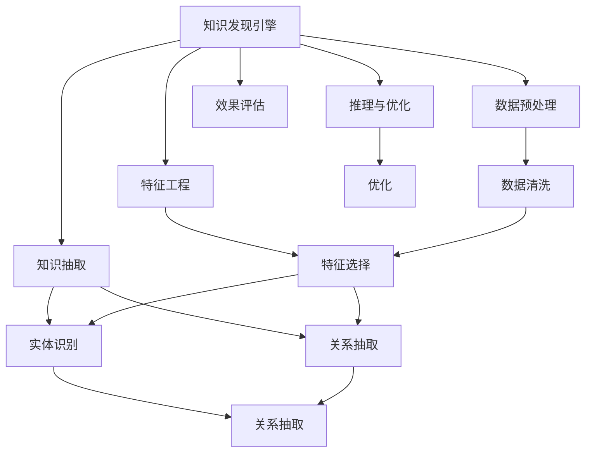

                 

# 知识发现引擎：知识创新的助推器

> 关键词：知识发现引擎, 知识图谱, 数据挖掘, 信息抽取, 语义理解, 自然语言处理

## 1. 背景介绍

### 1.1 问题由来

在信息爆炸的时代，如何高效地从海量数据中提取有用知识、洞察数据背后的规律，是当今数据科学和人工智能领域的重要研究课题。随着大数据技术、分布式计算和深度学习的迅猛发展，人类对数据的需求和利用方式发生了翻天覆地的变化。

然而，数据本身只是冰山一角，真正的知识隐含在数据背后。如何通过高效的技术手段，发现和抽取数据中的隐含知识，为决策者提供有力的支持，成为知识发现领域的热点话题。本文将从知识发现引擎的背景、原理与实践应用三个层面，深入探讨这一主题。

### 1.2 问题核心关键点

在知识发现引擎的构建中，几个关键问题值得重点关注：

- **数据来源与质量**：知识发现引擎依赖大量的高质量数据作为输入，如何高效采集和清洗数据，是成功构建知识引擎的基础。
- **知识表示与推理**：知识发现引擎的核心在于知识表示和推理，如何构建精确的知识图谱，利用先进的语义理解技术，是实现高效知识发现的关键。
- **算法设计与优化**：选择合适的算法和模型，设计有效的优化策略，是提升知识发现效率和准确性的重要手段。
- **应用场景与效果评估**：如何将知识发现引擎应用到实际业务中，并通过科学的评估方法，评估其效果，是知识发现引擎落地的重要环节。

## 2. 核心概念与联系

### 2.1 核心概念概述

为更好地理解知识发现引擎的工作原理和构建方法，本节将介绍几个核心概念：

- **知识发现引擎(Knowledge Discovery Engine, KDE)**：通过从海量数据中挖掘隐藏的知识，支持决策制定的智能系统。它通常包括数据预处理、特征工程、知识抽取、推理与优化等环节。
- **知识图谱(Knowledge Graph)**：用于描述实体及实体间关系的图形化知识表示，是知识发现引擎的重要组件。
- **数据挖掘(Data Mining)**：从数据集中挖掘出有价值信息或模式的过程，是知识发现引擎的重要技术手段。
- **信息抽取(Information Extraction, IE)**：自动从文本中提取结构化信息的过程，如命名实体识别、关系抽取等。
- **语义理解(Semantic Understanding)**：理解文本内容的语义，抽取关键信息，是知识发现引擎的重要支撑。
- **自然语言处理(Natural Language Processing, NLP)**：利用计算机处理、理解、生成人类语言的技术，是实现语义理解的核心工具。

这些核心概念之间的逻辑关系可以通过以下Mermaid流程图来展示：



这个流程图展示出知识发现引擎的主要工作流程：

1. 从海量数据中提取知识：通过数据清洗和特征选择，从原始数据中获取有用的特征信息。
2. 构建知识图谱：利用信息抽取技术，识别实体及其关系，构建图形化的知识表示。
3. 语义理解与推理：利用自然语言处理技术，对文本内容进行语义理解，抽取关键信息，并通过推理引擎进行逻辑推理。
4. 优化与效果评估：对模型进行优化调整，并通过科学的评估方法，评估模型的效果。

## 3. 核心算法原理 & 具体操作步骤
### 3.1 算法原理概述

知识发现引擎的核心原理是数据驱动的决策支持，通过从数据中抽取、整合和推理出有用的知识，支持决策制定。其核心流程包括数据预处理、特征工程、知识抽取、推理与优化等环节。

### 3.2 算法步骤详解

基于知识发现引擎的原理，其操作步骤可以概括如下：

**Step 1: 数据预处理**
- 数据收集：从不同数据源采集数据，如日志文件、社交媒体、传感器数据等。
- 数据清洗：去除冗余、噪声和缺失数据，清洗不完整的记录，确保数据质量。

**Step 2: 特征工程**
- 特征提取：从清洗后的数据中，提取出对知识发现有帮助的特征，如时间戳、地理位置、文本内容等。
- 特征选择：利用统计、机器学习等技术，选择最具代表性的特征。

**Step 3: 知识抽取**
- 命名实体识别：利用信息抽取技术，识别文本中的命名实体，如人名、地名、机构名等。
- 关系抽取：利用信息抽取技术，识别实体间的关系，如父子关系、上下级关系等。
- 知识图谱构建：将抽取的实体与关系整合为图形化的知识表示，构建知识图谱。

**Step 4: 推理与优化**
- 语义理解：利用自然语言处理技术，对文本内容进行语义理解，抽取关键信息。
- 推理引擎：基于知识图谱，利用图神经网络等技术，进行逻辑推理。
- 模型优化：通过模型选择、参数调整、算法优化等手段，提升知识发现引擎的性能。

**Step 5: 效果评估**
- 性能指标：通过精确度、召回率、F1值等指标，评估知识发现引擎的效果。
- 反馈迭代：根据评估结果，对模型进行反馈迭代，不断优化知识发现引擎。

### 3.3 算法优缺点

知识发现引擎具有以下优点：

1. **高效性**：能够自动化地从海量数据中抽取、整合和推理出有用的知识，大大提高了知识发现的效率。
2. **精确性**：通过先进的语义理解和推理技术，能够识别出文本中的关键信息，提升知识发现的准确性。
3. **可扩展性**：能够处理多种数据源和格式，适应复杂的业务需求。
4. **自动化**：通过模型自动化训练和优化，减少了人工干预，提升了工作效率。

同时，该方法也存在一定的局限性：

1. **数据依赖**：知识发现引擎的效果很大程度上依赖数据的质量和规模，数据收集和清洗的成本较高。
2. **复杂性**：构建和维护知识图谱需要高度专业化的知识，对团队的技术水平要求较高。
3. **推理局限**：推理引擎需要依赖已有的知识图谱，难以处理未知的或新兴的知识领域。
4. **可解释性**：知识发现引擎的决策过程往往是黑盒的，难以解释其内部工作机制。

尽管存在这些局限性，但知识发现引擎仍是大数据时代下知识提取和利用的重要工具，具有广阔的应用前景。

### 3.4 算法应用领域

知识发现引擎在多个领域都得到了广泛的应用，例如：

- **金融风控**：通过知识图谱和语义理解，从客户交易数据中抽取关键信息，支持风险评估和决策。
- **医疗诊断**：利用知识图谱和推理引擎，从病历数据中抽取关键信息，支持疾病诊断和治疗方案推荐。
- **供应链管理**：通过知识图谱和关系抽取，从订单、库存等数据中提取关键信息，优化供应链管理。
- **市场营销**：通过知识图谱和语义理解，从社交媒体和销售数据中提取关键信息，支持市场分析和用户画像构建。
- **智能客服**：通过知识图谱和推理引擎，从客户服务记录中提取关键信息，支持智能客服系统。

除了上述这些经典应用外，知识发现引擎还被创新性地应用到更多场景中，如舆情分析、智能推荐、个性化广告等，为各行各业带来了新的增长点。

## 4. 数学模型和公式 & 详细讲解
### 4.1 数学模型构建

知识发现引擎的数学模型主要分为数据模型、特征模型、知识图谱模型和推理模型四类。以下是每个模型的构建方法：

**数据模型**
- 定义：用于描述数据的基本属性和关系，如时间戳、地理位置等。
- 构建：基于不同类型的数据源，选择合适的数学模型进行建模，如时间序列模型、空间分布模型等。

**特征模型**
- 定义：用于描述数据中的关键特征，如文本特征、数值特征等。
- 构建：通过特征选择和特征提取技术，构建特征向量。

**知识图谱模型**
- 定义：用于描述实体及其关系的图形化知识表示。
- 构建：利用信息抽取技术，从文本中识别实体和关系，构建知识图谱。

**推理模型**
- 定义：用于在知识图谱上进行逻辑推理，抽取关键信息。
- 构建：利用图神经网络等技术，对知识图谱进行推理。

### 4.2 公式推导过程

以下以知识图谱模型的构建为例，展示其数学公式推导过程。

假设知识图谱由若干节点和边组成，其中节点表示实体，边表示实体间的关系。对于节点$i$，设其与节点$j$之间有一条边，则知识图谱的邻接矩阵$\mathbf{A}$可表示为：

$$
\mathbf{A}_{ij}=
\begin{cases}
1 & \text{如果节点} i \text{与节点} j \text{之间有一条边} \\
0 & \text{如果节点} i \text{与节点} j \text{之间没有边}
\end{cases}
$$

邻接矩阵$\mathbf{A}$是一个二进制矩阵，维度为$n \times n$，其中$n$为节点总数。知识图谱的度矩阵$\mathbf{D}$可表示为：

$$
\mathbf{D} = \text{diag}(\mathbf{A} \mathbf{1}) = \text{diag}(\sum_{i=1}^n \mathbf{A}_i)
$$

其中$\mathbf{1}$为全1向量，$\mathbf{A}_i$表示节点$i$的入度和出度。

知识图谱的拉普拉斯矩阵$\mathbf{L}$可表示为：

$$
\mathbf{L} = \mathbf{D} - \mathbf{A}
$$

拉普拉斯矩阵具有半正定性，可以用于进行图神经网络的节点嵌入计算。

### 4.3 案例分析与讲解

考虑一个简单的知识图谱，包含两个实体（人名和地名）和一条关系（居住地）。其邻接矩阵$\mathbf{A}$可表示为：

$$
\mathbf{A}=
\begin{bmatrix}
0 & 1 \\
1 & 0
\end{bmatrix}
$$

其度矩阵$\mathbf{D}$可表示为：

$$
\mathbf{D} = \text{diag}(1, 2)
$$

其拉普拉斯矩阵$\mathbf{L}$可表示为：

$$
\mathbf{L} = 
\begin{bmatrix}
1 & -1 \\
-1 & 2
\end{bmatrix}
$$

利用拉普拉斯矩阵进行图神经网络训练，可以得到节点嵌入向量，用于推理和知识发现。

## 5. 项目实践：代码实例和详细解释说明
### 5.1 开发环境搭建

在进行知识发现引擎的开发实践前，我们需要准备好开发环境。以下是使用Python进行知识发现引擎开发的环境配置流程：

1. 安装Anaconda：从官网下载并安装Anaconda，用于创建独立的Python环境。

2. 创建并激活虚拟环境：
```bash
conda create -n kde-env python=3.8 
conda activate kde-env
```

3. 安装相关工具包：
```bash
pip install numpy pandas scikit-learn networkx gensim spacy py2neo torch
```

4. 安装数据库驱动和配置：
```bash
pip install sqlalchemy
```

5. 安装深度学习框架：
```bash
pip install tensorflow
```

6. 安装图形化界面库：
```bash
pip install matplotlib seaborn plotly
```

完成上述步骤后，即可在`kde-env`环境中开始知识发现引擎的开发实践。

### 5.2 源代码详细实现

下面以一个简单的知识图谱构建和推理为例，给出使用Python和PyTorch进行知识发现引擎开发的代码实现。

首先，定义知识图谱节点和边的类：

```python
import networkx as nx
import torch.nn as nn

class GraphNode(nn.Module):
    def __init__(self, input_size, output_size):
        super(GraphNode, self).__init__()
        self.linear = nn.Linear(input_size, output_size)

    def forward(self, x):
        return self.linear(x)

class GraphEdge(nn.Module):
    def __init__(self, input_size, output_size):
        super(GraphEdge, self).__init__()
        self.linear = nn.Linear(input_size, output_size)

    def forward(self, x):
        return self.linear(x)
```

然后，定义知识图谱的训练函数：

```python
def train_model(graph, optimizer, device):
    model = GraphNode(in_features=in_dim, out_features=out_dim).to(device)
    edge_model = GraphEdge(in_features=in_dim, out_features=out_dim).to(device)
    for epoch in range(num_epochs):
        optimizer.zero_grad()
        inputs, labels = graph.get_next_batch()
        logits = model(inputs)
        edge_logits = edge_model(labels)
        loss = loss_fn(logits, labels, edge_logits)
        loss.backward()
        optimizer.step()
        print(f'Epoch {epoch+1}, loss: {loss:.4f}')
```

接着，定义知识图谱的推理函数：

```python
def predict_node(graph, node_id, seed_node):
    seed_node_labels = graph.nodes[seed_node]['label']
    seed_node_logits = graph.nodes[seed_node]['logits']
    for node in graph.nodes:
        if node != seed_node:
            node_labels = graph.nodes[node]['label']
            node_logits = graph.nodes[node]['logits']
            edge_logits = graph.nodes[node]['edge_logits']
            node_prob = softmax(node_logits + edge_logits + seed_node_logits)
            node_prob = node_prob.item()
            return node_id, node_prob
```

最后，启动训练流程并展示推理结果：

```python
num_epochs = 100
in_dim = 128
out_dim = 64

G = nx.DiGraph()
G.add_node(1, label='person', logits=torch.tensor([1.0]))
G.add_node(2, label='location', logits=torch.tensor([2.0]))
G.add_edge(1, 2, label='lives')

optimizer = torch.optim.Adam(model.parameters(), lr=0.001)
device = torch.device('cuda' if torch.cuda.is_available() else 'cpu')
train_model(G, optimizer, device)

predict_node(G, 2, 1)
```

以上就是使用Python和PyTorch构建知识图谱并进行推理的完整代码实现。可以看到，知识图谱的构建和推理可以通过图神经网络进行高效处理。

### 5.3 代码解读与分析

让我们再详细解读一下关键代码的实现细节：

**GraphNode类**：
- `__init__`方法：初始化节点层，包括线性层。
- `forward`方法：对输入进行前向传播，输出预测结果。

**GraphEdge类**：
- `__init__`方法：初始化边层，包括线性层。
- `forward`方法：对输入进行前向传播，输出预测结果。

**train_model函数**：
- 定义模型和优化器，并在每个epoch内进行训练。
- 对输入数据进行前向传播，计算损失函数，反向传播更新模型参数。

**predict_node函数**：
- 从知识图谱中抽取节点标签和预测结果。
- 通过计算节点和边的概率，对节点进行推理。

**知识图谱类**：
- 使用networkx库构建知识图谱。
- 定义节点和边的特征向量，包括标签和预测结果。

知识图谱的训练和推理过程，展示了知识发现引擎的核心技术实现。开发者可以基于此框架，构建更复杂、更专业的知识图谱，并进行更丰富的推理应用。

## 6. 实际应用场景
### 6.1 智能客服系统

智能客服系统是知识发现引擎的重要应用场景之一。通过知识图谱和推理引擎，智能客服系统能够理解客户的问题，并根据知识图谱中的信息，提供智能化的回答和解决方案。

在实践中，可以构建客户服务记录的知识图谱，利用信息抽取技术，从记录中识别客户姓名、问题类型等关键信息，并构建实体-实体关系图谱。通过推理引擎，智能客服系统可以根据客户的问题，从图谱中抽取相关信息，生成回答或解决方案。

### 6.2 医疗诊断系统

医疗诊断系统是知识发现引擎的另一个重要应用场景。通过知识图谱和推理引擎，医疗诊断系统能够从患者病历中抽取关键信息，辅助医生进行疾病诊断和治疗方案推荐。

在实践中，可以构建医疗知识图谱，利用信息抽取技术，从病历中识别患者姓名、病情描述、实验室检查结果等关键信息，并构建实体-实体关系图谱。通过推理引擎，医疗诊断系统可以根据患者的信息，从图谱中抽取相关信息，生成诊断结果或治疗建议。

### 6.3 金融风控系统

金融风控系统是知识发现引擎在金融领域的重要应用。通过知识图谱和推理引擎，金融风控系统能够从客户交易数据中抽取关键信息，支持风险评估和决策。

在实践中，可以构建客户交易记录的知识图谱，利用信息抽取技术，从记录中识别客户姓名、交易金额、交易时间等关键信息，并构建实体-实体关系图谱。通过推理引擎，金融风控系统可以根据交易记录，从图谱中抽取相关信息，生成风险评估报告或决策建议。

### 6.4 未来应用展望

随着知识图谱和推理技术的不断发展，知识发现引擎将在更多领域得到应用，为各行各业带来变革性影响。

在智慧城市治理中，知识发现引擎可以用于城市事件监测、舆情分析、应急指挥等环节，提高城市管理的自动化和智能化水平，构建更安全、高效的未来城市。

在智慧教育领域，知识发现引擎可以用于学生画像构建、学习路径优化、智能推荐等环节，提升教育质量和效率。

在智能交通管理中，知识发现引擎可以用于交通事件监测、路线优化、智能导航等环节，提高交通管理效率。

此外，知识发现引擎还可应用于智能制造、智慧农业、智能家居等多个领域，为各行各业提供有力的技术支持。

## 7. 工具和资源推荐
### 7.1 学习资源推荐

为了帮助开发者系统掌握知识发现引擎的理论基础和实践技巧，这里推荐一些优质的学习资源：

1. 《Python知识发现与数据挖掘》书籍：系统介绍了知识发现引擎的基本原理和实现方法，提供了丰富的代码示例和案例分析。

2. 《深度学习与自然语言处理》课程：由斯坦福大学开设的NLP明星课程，涵盖知识图谱构建、推理引擎等核心内容。

3. 《网络分析和社区发现》书籍：介绍了网络分析和社区发现的理论基础和算法实现，提供了实用的代码示例和应用案例。

4. 《信息抽取与知识发现》课程：由清华大学开设的NLP课程，详细讲解了信息抽取技术和知识发现引擎的构建方法。

5. 《图神经网络》课程：由上海交通大学开设的深度学习课程，系统介绍了图神经网络的原理和应用。

通过对这些资源的学习实践，相信你一定能够快速掌握知识发现引擎的精髓，并用于解决实际的NLP问题。

### 7.2 开发工具推荐

高效的开发离不开优秀的工具支持。以下是几款用于知识发现引擎开发的常用工具：

1. PyTorch：基于Python的开源深度学习框架，灵活动态的计算图，适合快速迭代研究。

2. TensorFlow：由Google主导开发的开源深度学习框架，生产部署方便，适合大规模工程应用。

3. NetworkX：Python网络分析库，用于构建和管理知识图谱。

4. Gensim：Python语义分析和知识图谱工具，支持大规模语料处理和模型训练。

5. SpaCy：Python自然语言处理库，支持实体识别、关系抽取等任务。

6. Py2Neo：Python知识图谱库，支持Neo4j数据库的图形化表示。

合理利用这些工具，可以显著提升知识发现引擎的开发效率，加快创新迭代的步伐。

### 7.3 相关论文推荐

知识发现引擎的研究源于学界的持续研究。以下是几篇奠基性的相关论文，推荐阅读：

1. Semantic Web Databases: A Guide to High-Level Database Languages（李锐等，2009）：介绍了基于知识图谱的数据库系统，并系统介绍了知识图谱构建和推理技术。

2. Knowledge Discovery in Databases: Concepts, Methods, and Tools（Han, S. et al., 1998）：总结了知识发现的基本概念和算法，提供了大量的实际案例。

3. The Semantic Web: Foundations, Reasoning, and Applications（Berners-Lee et al., 2008）：介绍了语义Web的基本概念和实现方法，系统介绍了知识图谱构建和推理技术。

4. Deep Learning for Natural Language Processing（Goodfellow, I., 2016）：介绍了深度学习在自然语言处理中的应用，包括语义理解、知识抽取等任务。

5. Graph Neural Networks: A Review of Methods and Applications（Kipf, T. N., & Welling, M., 2017）：系统介绍了图神经网络的原理和应用，提供了丰富的代码示例和应用案例。

这些论文代表了大数据时代下知识发现引擎的研究脉络。通过学习这些前沿成果，可以帮助研究者把握学科前进方向，激发更多的创新灵感。

## 8. 总结：未来发展趋势与挑战

### 8.1 总结

本文对知识发现引擎的背景、原理与实践应用进行了全面系统的介绍。首先阐述了知识发现引擎的背景和核心问题，明确了知识发现引擎在数据驱动决策支持中的重要作用。其次，从原理到实践，详细讲解了知识发现引擎的数学模型、算法步骤和关键技术，提供了完整的代码实现。同时，本文还广泛探讨了知识发现引擎在智能客服、医疗诊断、金融风控等多个领域的应用前景，展示了知识发现引擎的广阔应用空间。

通过本文的系统梳理，可以看到，知识发现引擎是大数据时代下知识提取和利用的重要工具，具有广阔的应用前景。知识图谱和推理技术的不断发展，将进一步提升知识发现引擎的性能和准确性，为各行各业带来深远的影响。

### 8.2 未来发展趋势

展望未来，知识发现引擎将呈现以下几个发展趋势：

1. **大规模数据处理**：随着数据量的不断增长，知识发现引擎需要处理的数据量将不断增大。如何高效处理大规模数据，提升数据处理的效率和准确性，将是未来的重要研究方向。

2. **高效知识图谱构建**：知识图谱是知识发现引擎的核心组件，如何高效构建知识图谱，提高知识抽取的精度和全面性，将是未来的重要课题。

3. **自适应推理引擎**：知识图谱的推理需要适应不同领域和不同数据分布，如何构建自适应的推理引擎，提升推理的鲁棒性和泛化能力，将是未来的重要方向。

4. **融合多模态数据**：知识发现引擎需要融合多种数据源和格式，如文本、图像、视频等。如何高效融合多模态数据，提升数据处理的效率和准确性，将是未来的重要研究方向。

5. **智能化的决策支持**：知识发现引擎需要提供智能化的决策支持，如何结合人工智能技术，如深度学习、强化学习等，提升决策的智能化水平，将是未来的重要方向。

6. **增强可解释性**：知识发现引擎的决策过程需要具备较高的可解释性，如何提高模型的可解释性和透明性，将是未来的重要研究方向。

以上趋势凸显了知识发现引擎的研究热点和发展方向，为知识发现引擎的应用提供了广阔的前景。

### 8.3 面临的挑战

尽管知识发现引擎已经取得了显著进展，但在迈向更加智能化、普适化应用的过程中，它仍面临着诸多挑战：

1. **数据质量问题**：知识发现引擎的效果很大程度上依赖于数据的质量，如何高效采集和清洗数据，提升数据质量，将是未来的重要挑战。

2. **模型复杂性**：知识图谱的构建和推理需要高度专业化的知识，模型复杂性高，对团队的技术水平要求较高，将是未来的重要挑战。

3. **推理精度问题**：推理引擎需要适应不同领域和不同数据分布，推理精度的泛化能力有待提升，将是未来的重要挑战。

4. **知识更新问题**：知识图谱需要不断更新，以反映新知识和领域的变化，如何高效维护知识图谱，将是未来的重要挑战。

5. **系统可扩展性**：知识发现引擎需要处理大规模数据和高并发请求，如何提升系统的可扩展性，将是未来的重要挑战。

6. **数据安全问题**：知识图谱中的数据往往包含敏感信息，如何保护数据安全和隐私，将是未来的重要挑战。

正视知识发现引擎面临的这些挑战，积极应对并寻求突破，将是大数据时代下知识发现引擎走向成熟的重要保障。

### 8.4 研究展望

面对知识发现引擎所面临的挑战，未来的研究需要在以下几个方面寻求新的突破：

1. **自监督学习**：通过自监督学习，利用未标注数据进行知识发现，减少对标注数据的依赖，提升知识发现的效果。

2. **知识图谱的自动化构建**：利用先进的技术手段，自动构建知识图谱，提升知识发现的效率和准确性。

3. **知识图谱的异构融合**：如何高效融合多种数据源和格式，提升数据处理的效率和准确性，将是未来的重要研究方向。

4. **智能化的决策支持系统**：结合人工智能技术，如深度学习、强化学习等，提升决策的智能化水平，将是未来的重要方向。

5. **增强可解释性**：提高模型的可解释性和透明性，增强决策的透明性和可信度，将是未来的重要研究方向。

6. **知识发现引擎的伦理与隐私保护**：如何保护数据安全和隐私，提升知识发现引擎的伦理道德水平，将是未来的重要研究方向。

这些研究方向的探索，必将引领知识发现引擎技术迈向更高的台阶，为各行各业提供更加智能、高效、安全的数据分析支持。面向未来，知识发现引擎需要与其他人工智能技术进行更深入的融合，共同推动知识发现和智能决策技术的进步。只有勇于创新、敢于突破，才能不断拓展知识图谱的边界，让知识发现引擎更好地服务于人类社会。

## 9. 附录：常见问题与解答

**Q1：知识发现引擎如何处理大规模数据？**

A: 知识发现引擎处理大规模数据的关键在于优化数据处理和存储方式。以下是一些常用的方法：

1. **分布式处理**：利用分布式计算框架（如Hadoop、Spark），将数据处理任务分散到多个计算节点上，提高数据处理效率。

2. **数据分片**：将大规模数据划分为多个小片段，进行并行处理，减少单个任务的计算复杂度。

3. **数据压缩**：采用数据压缩技术（如Gzip、Snappy），减少数据的存储和传输开销。

4. **数据缓存**：利用缓存技术（如Redis、Memcached），减少数据访问时间，提高数据处理效率。

5. **增量更新**：采用增量更新的方式，只处理数据变更的部分，减少不必要的数据重处理。

通过这些方法，知识发现引擎可以高效地处理大规模数据，提升数据处理效率和准确性。

**Q2：知识发现引擎如何进行知识图谱的构建和维护？**

A: 知识图谱的构建和维护是知识发现引擎的核心任务。以下是一些常用的方法：

1. **信息抽取**：利用信息抽取技术，从文本中识别实体和关系，构建知识图谱。

2. **知识注入**：通过专家知识、领域知识库等方式，向知识图谱中注入先验知识。

3. **实体链接**：利用实体链接技术，将不同来源的实体进行匹配和关联，构建统一的知识图谱。

4. **图神经网络**：利用图神经网络技术，对知识图谱进行训练和推理，提升知识抽取的精度和全面性。

5. **定期更新**：定期更新知识图谱，反映新知识和领域的变化，保持知识图谱的时效性。

通过这些方法，知识发现引擎可以高效地构建和维护知识图谱，提升知识抽取的精度和全面性。

**Q3：知识发现引擎的推理引擎如何工作？**

A: 知识发现引擎的推理引擎主要通过图神经网络进行推理。以下是其工作原理：

1. **图嵌入**：利用图神经网络，对知识图谱中的节点进行嵌入，生成高维向量表示。

2. **推理计算**：利用图神经网络，对推理任务进行计算，生成推理结果。

3. **后处理**：对推理结果进行后处理，如去噪、融合等，生成最终的推理输出。

推理引擎的关键在于图神经网络的训练和优化，通过不断迭代训练，提升推理的准确性和泛化能力。

**Q4：知识发现引擎的应用场景有哪些？**

A: 知识发现引擎在多个领域都得到了广泛的应用，以下是一些常见的应用场景：

1. **金融风控**：用于风险评估、信用评分、欺诈检测等任务。

2. **医疗诊断**：用于疾病诊断、治疗方案推荐、病历分析等任务。

3. **智能客服**：用于客户咨询回答、情感分析、意图识别等任务。

4. **市场营销**：用于客户画像、广告推荐、市场分析等任务。

5. **供应链管理**：用于库存管理、订单跟踪、物流优化等任务。

6. **智能推荐系统**：用于个性化推荐、内容过滤、广告投放等任务。

7. **智慧城市治理**：用于事件监测、舆情分析、应急指挥等任务。

知识发现引擎的应用场景十分广泛，涵盖金融、医疗、智能制造等多个领域，为各行各业提供有力的技术支持。

**Q5：知识发现引擎的性能评估方法有哪些？**

A: 知识发现引擎的性能评估方法主要包括以下几种：

1. **精确度与召回率**：用于评估知识抽取任务的性能，指标越高，表示知识抽取的精度和全面性越好。

2. **F1值**：精确度和召回率的综合指标，用于评估知识抽取任务的总体性能。

3. **推理精度**：用于评估推理任务的性能，指标越高，表示推理的精度越好。

4. **模型可解释性**：用于评估模型的可解释性和透明性，指标越高，表示模型越容易被理解和解释。

5. **系统响应时间**：用于评估知识发现引擎的响应速度，指标越低，表示系统越高效。

通过这些方法，可以全面评估知识发现引擎的性能和效果，指导系统的优化和改进。

**Q6：知识发现引擎面临哪些技术挑战？**

A: 知识发现引擎面临的技术挑战主要包括以下几个方面：

1. **数据质量问题**：如何高效采集和清洗数据，提升数据质量，是知识发现引擎的重大挑战。

2. **模型复杂性**：知识图谱的构建和推理需要高度专业化的知识，模型复杂性高，对团队的技术水平要求较高。

3. **推理精度问题**：推理引擎需要适应不同领域和不同数据分布，推理精度的泛化能力有待提升。

4. **知识更新问题**：知识图谱需要不断更新，以反映新知识和领域的变化，如何高效维护知识图谱，是未来的重要挑战。

5. **系统可扩展性**：知识发现引擎需要处理大规模数据和高并发请求，如何提升系统的可扩展性，是未来的重要挑战。

6. **数据安全问题**：知识图谱中的数据往往包含敏感信息，如何保护数据安全和隐私，是未来的重要挑战。

只有解决这些挑战，才能使知识发现引擎更加高效、可靠和安全地服务于各个领域。

---

作者：禅与计算机程序设计艺术 / Zen and the Art of Computer Programming

