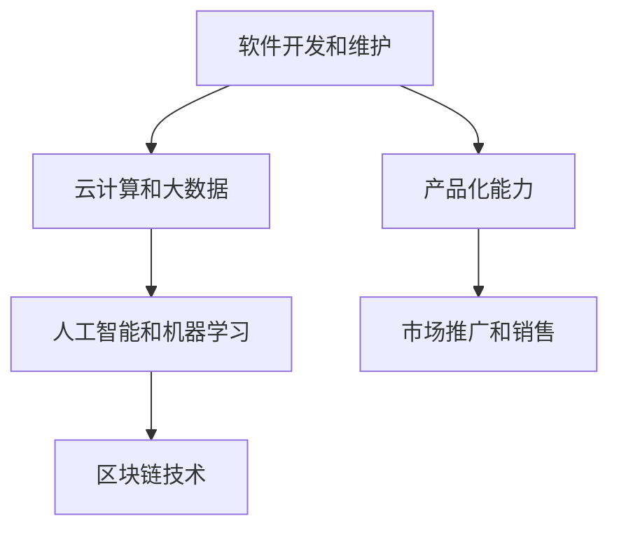

                 

# 知识变现：程序员的第二职业

## 1. 背景介绍

### 1.1 问题由来

在当今快速变化的科技浪潮中，程序员不仅需要持续更新技能以保持竞争力，还面临职业发展的多重挑战。传统的职业路径，如晋升、加薪等，往往难以应对经济增长放缓和技术发展加速的双重压力。因此，程序员开发第二职业，成为一种新趋势。

在IT行业，技术不断迭代更新，新的技术框架、工具和编程语言层出不穷。对于那些已经掌握了主流编程语言和框架的程序员而言，开发第二职业成为他们拓展职业道路，实现职业增值的有效途径。

### 1.2 问题核心关键点

开发第二职业，不仅需要技术和业务知识的储备，更需要理解市场需求和用户痛点，以及如何将知识转化为产品或服务的能力。本节将详细介绍这些关键点：

- **市场需求**：分析当前技术市场的需求，识别高增长、高潜力领域，如云计算、大数据、人工智能等。
- **用户痛点**：了解目标用户的需求和痛点，通过提供有价值的解决方案，吸引用户。
- **技术储备**：掌握编程、软件工程、系统设计等核心技术，并不断学习和更新新知识。
- **业务知识**：理解业务流程、管理、市场营销等商业运作知识，增强综合能力。
- **产品化能力**：将技术想法转化为可用的产品或服务，具备项目管理和团队协作的能力。

这些关键点将帮助程序员在开发第二职业时，更具针对性和系统性，更好地利用现有技能和资源。

### 1.3 问题研究意义

开发第二职业，不仅能够帮助程序员实现职业转型和职业增值，还能促进技术的进一步应用和发展。其研究意义主要体现在以下几个方面：

- **提高竞争力**：不断学习和更新技能，保持职业活力和市场竞争力。
- **拓展收入来源**：通过技术变现，获得新的收入来源，提高生活质量。
- **实现社会价值**：利用技术解决实际问题，提升生活质量和社会效益。
- **创新驱动**：不断创新和尝试新技术，推动行业发展和技术进步。

## 2. 核心概念与联系

### 2.1 核心概念概述

为了更好地理解程序员开发第二职业的过程，本节将介绍几个核心概念：

- **软件开发和维护**：指从需求分析、设计、编码、测试到部署和维护的软件开发生命周期过程。
- **云计算和大数据**：指通过互联网提供计算和数据存储服务，以弹性资源和数据处理能力为核心优势的技术领域。
- **人工智能和机器学习**：指模拟人类智能和知识获取能力的计算技术，广泛应用于数据处理、自然语言处理、图像识别等领域。
- **区块链技术**：指去中心化、加密的分布式账本技术，具有高安全性和透明性，广泛应用于金融、供应链管理等领域。
- **产品化能力**：指将技术想法转化为可用的产品或服务，具备项目管理和团队协作的能力。
- **市场推广和销售**：指通过市场调研、产品推广和销售活动，将产品推向市场并实现商业化的过程。

这些核心概念构成了程序员开发第二职业的基础框架，帮助理解各个环节的逻辑关系和技术要点。

### 2.2 核心概念原理和架构的 Mermaid 流程图



这个流程图展示了程序员开发第二职业时，涉及的关键技术和能力。通过云计算、大数据、人工智能等技术，开发和维护软件产品；结合区块链技术，提升数据的安全性和透明性；通过产品化能力和市场推广，实现商业化。

## 3. 核心算法原理 & 具体操作步骤

### 3.1 算法原理概述

程序员开发第二职业，本质上是将技术和业务知识融合，创造有价值的产品或服务的过程。这一过程可以分解为以下几个关键步骤：

1. **需求分析**：识别市场中的需求，确定目标用户和应用场景。
2. **技术选型**：选择合适的技术栈和工具，确保产品的高效和可靠。
3. **产品设计**：根据用户需求和技术选型，设计产品的功能架构和用户体验。
4. **开发与测试**：实现产品功能，并进行测试和调试，确保产品质量。
5. **部署和维护**：将产品部署到生产环境，并持续监控和维护，保证产品稳定运行。
6. **市场推广**：通过市场营销和销售活动，将产品推向市场，实现商业化。

这些步骤涉及从技术实现到市场推广的各个方面，需要程序员具备全面的技能和经验。

### 3.2 算法步骤详解

下面将详细介绍每个步骤的详细步骤和技术要点：

#### 3.2.1 需求分析

需求分析是开发第二职业的第一步，其目标是明确目标市场和用户需求，确定产品的方向和功能。

**步骤1：市场调研**
- 分析当前技术市场，识别高增长、高潜力领域。
- 使用工具如市场分析报告、技术白皮书等，获取市场数据和趋势。
- 参加行业会议、技术研讨会，了解最新技术动态和应用案例。

**步骤2：用户调研**
- 通过问卷调查、用户访谈等方法，获取目标用户的真实需求和痛点。
- 分析用户反馈，识别关键问题和改进机会。
- 使用工具如用户故事、用户画像等，建立详细的用户画像。

#### 3.2.2 技术选型

技术选型是选择适合产品的技术栈和工具的过程，直接影响产品的性能和可靠性。

**步骤1：技术栈选择**
- 根据产品需求，选择适合的语言和框架。如Python、JavaScript、React等。
- 考虑性能、扩展性、开发效率等因素，进行综合评估。
- 参考已有项目和技术社区的推荐，避免重复造轮子。

**步骤2：工具选择**
- 选择适合开发和部署的开发工具和平台。如Git、Docker、Kubernetes等。
- 考虑工具的易用性和可维护性，避免增加开发复杂度。
- 使用开源工具和框架，降低开发成本，提高开发效率。

#### 3.2.3 产品设计

产品设计是确定产品功能和用户体验的关键步骤，需要综合考虑技术实现和用户需求。

**步骤1：功能架构设计**
- 根据用户需求和技术选型，设计产品的功能模块。如登录、注册、搜索等。
- 使用工具如UML、ER图等，明确各个模块之间的关系。
- 进行功能优先级排序，确定关键功能和次要功能。

**步骤2：用户体验设计**
- 分析用户行为和心理，设计友好的界面和操作流程。
- 使用工具如原型设计工具、用户测试工具等，进行用户体验迭代。
- 设计反馈机制，收集用户反馈并不断优化。

#### 3.2.4 开发与测试

开发与测试是实现产品功能并确保产品质量的过程，需要严格执行开发和测试流程。

**步骤1：编码实现**
- 根据设计文档，编写代码实现功能模块。
- 使用版本控制工具如Git，进行代码管理。
- 进行代码审查，确保代码质量和技术一致性。

**步骤2：测试和调试**
- 进行单元测试、集成测试和系统测试，确保产品质量。
- 使用测试框架和工具如JUnit、Selenium等，提高测试效率。
- 分析和解决测试中发现的问题，优化代码实现。

#### 3.2.5 部署和维护

部署和维护是将产品推向生产环境并持续监控的过程，需要确保产品稳定运行和用户满意度。

**步骤1：环境搭建**
- 搭建开发、测试和生产环境，确保环境一致性。
- 使用容器技术如Docker，实现环境隔离和自动化部署。
- 使用CI/CD工具如Jenkins、GitLab CI等，实现自动化流水线。

**步骤2：持续监控**
- 使用监控工具如Prometheus、Grafana等，实时监控系统状态和性能。
- 分析监控数据，及时发现和解决性能问题。
- 定期进行系统升级和更新，确保产品持续稳定运行。

#### 3.2.6 市场推广

市场推广是将产品推向市场并实现商业化的关键步骤，需要综合考虑营销策略和销售手段。

**步骤1：市场定位**
- 分析目标市场和竞争对手，确定产品定位和差异化优势。
- 使用SWOT分析等方法，分析市场优势和劣势。
- 制定市场推广策略，明确推广目标和资源分配。

**步骤2：产品推广**
- 通过广告投放、社交媒体、搜索引擎优化等方式，提升产品曝光率。
- 组织产品发布会、技术讲座等活动，提升品牌知名度。
- 建立社区和用户反馈机制，增强用户粘性和口碑效应。

**步骤3：销售转化**
- 制定销售目标和策略，选择适合的销售渠道和方式。
- 进行客户跟进和转化，提升销售转化率。
- 分析销售数据，不断优化销售策略和渠道选择。

### 3.3 算法优缺点

程序员开发第二职业，在技术选型和市场推广等方面具有天然的优势，但也面临一些挑战和局限性。

**优点**：
- **技术储备**：具备编程和软件开发的基础技能，可以快速实现产品功能。
- **学习能力强**：具备快速学习和掌握新知识的能力，适应技术迭代和市场变化。
- **创业灵活性**：具备技术和管理双重优势，可以灵活调整产品方向和团队结构。

**缺点**：
- **市场经验不足**：缺乏市场营销和销售经验，可能需要花费时间和资源进行学习和实践。
- **业务知识缺乏**：对特定领域的业务流程和管理知识可能不熟悉，需要额外学习和培训。
- **资源有限**：可能缺乏足够的资金和资源支持产品开发和市场推广。

### 3.4 算法应用领域

程序员开发第二职业，可以在多个领域探索和实践，如云计算、大数据、人工智能、区块链等。

- **云计算**：开发和管理云平台和云服务，提升企业的云化水平。
- **大数据**：处理和分析海量数据，提供数据驱动的决策支持。
- **人工智能**：开发智能应用和服务，如聊天机器人、推荐系统等。
- **区块链**：开发和应用区块链技术，提升数据安全和透明性。
- **软件开发**：提供定制化的软件开发和维护服务，提升企业IT能力。
- **市场营销**：提供数字营销和广告投放服务，提升品牌影响力和市场份额。

## 4. 数学模型和公式 & 详细讲解 & 举例说明

### 4.1 数学模型构建

本节将使用数学语言对程序员开发第二职业的过程进行更加严格的刻画。

**步骤1：市场调研**
- 使用市场份额分析模型，计算市场份额和增长率。
- 使用SWOT分析模型，评估市场优势和劣势。

**步骤2：用户调研**
- 使用用户反馈分析模型，分析用户需求和痛点。
- 使用用户画像模型，建立详细的用户画像。

**步骤3：技术选型**
- 使用技术栈评估模型，评估技术栈的性能和扩展性。
- 使用工具选择模型，评估工具的易用性和可维护性。

**步骤4：产品设计**
- 使用功能架构设计模型，设计产品的功能模块。
- 使用用户体验设计模型，设计友好的界面和操作流程。

**步骤5：开发与测试**
- 使用代码审查模型，确保代码质量和技术一致性。
- 使用测试框架和工具，提高测试效率。

**步骤6：部署和维护**
- 使用环境搭建模型，搭建开发、测试和生产环境。
- 使用持续监控模型，实时监控系统状态和性能。

**步骤7：市场推广**
- 使用市场定位模型，确定产品定位和差异化优势。
- 使用产品推广模型，提升产品曝光率和品牌知名度。

### 4.2 公式推导过程

以下是几个关键模型的公式推导：

#### 4.2.1 市场调研模型

假设市场总规模为 $M$，产品市场份额为 $S$，市场增长率为 $r$，则市场规模的预测模型为：

$$
M_{t+1} = M_t(1+r)
$$

其中 $M_t$ 为当前市场规模，$t$ 为时间。

#### 4.2.2 用户调研模型

假设用户需求和痛点分布为 $D$，用户画像为 $P$，则用户调研的模型为：

$$
D = \sum_{i=1}^n p_i \times c_i
$$

其中 $n$ 为用户需求种类，$p_i$ 为需求权重，$c_i$ 为需求内容。

### 4.3 案例分析与讲解

以下是一个基于云计算和人工智能的案例分析：

假设某公司需要开发一款基于人工智能的云平台服务，用于自动化数据分析和决策支持。首先，公司进行市场调研，发现云计算和大数据领域需求旺盛，竞争激烈。然后，通过用户调研，确定目标用户为中小企业，主要痛点为数据处理和分析成本高、缺乏专业人才。接着，选择Python和TensorFlow为技术栈，使用Jenkins为CI/CD工具，进行开发和部署。在设计产品时，设计了数据上传、数据处理、数据分析和可视化等功能模块，并通过用户体验设计，确保界面友好和操作便捷。在开发与测试阶段，使用单元测试和集成测试，确保功能实现和性能稳定。在部署和维护阶段，使用Docker进行环境隔离和自动化部署，使用Prometheus进行持续监控。最后，通过市场推广，利用广告投放和社交媒体，提升产品曝光率，并通过客户跟进和转化，实现销售目标。

## 5. 项目实践：代码实例和详细解释说明

### 5.1 开发环境搭建

在进行第二职业项目开发前，需要进行开发环境的搭建。以下是使用Python进行开发的环境配置流程：

1. 安装Anaconda：从官网下载并安装Anaconda，用于创建独立的Python环境。

2. 创建并激活虚拟环境：
```bash
conda create -n myenv python=3.8 
conda activate myenv
```

3. 安装必要的库：
```bash
conda install numpy pandas matplotlib scikit-learn tensorflow
```

4. 配置开发工具：
- 安装Git：`conda install git`
- 安装Jenkins：`conda install jenkins`
- 安装Docker：`conda install docker`

5. 配置测试工具：
- 安装JUnit：`conda install junit`
- 安装Selenium：`conda install selenium`

6. 配置持续集成工具：
- 安装Jenkins：`conda install jenkins`
- 安装Jenkins插件：`conda install jenkins`
- 配置Jenkins：在`~/.conda/myenv/`目录下找到`conda.jenkins`文件，修改配置项。

### 5.2 源代码详细实现

下面以一个简单的云平台服务开发为例，展示如何使用Python进行开发和部署。

**步骤1：项目初始化**
```python
!pip install flask
!pip install requests
```

**步骤2：开发云平台服务**
```python
from flask import Flask, request

app = Flask(__name__)

@app.route('/')
def index():
    return '欢迎使用云平台服务！'

@app.route('/analyze', methods=['POST'])
def analyze():
    data = request.json
    # 处理数据，进行数据分析和决策支持
    return '分析完成！'

if __name__ == '__main__':
    app.run(host='0.0.0.0', port=5000)
```

**步骤3：使用Docker进行部署**
```bash
docker build -t cloud-platform .
docker run -p 5000:5000 cloud-platform
```

**步骤4：使用Jenkins进行持续集成**
在Jenkins上创建项目，配置Source Code Management、Build Trigger、Build Pipeline等，实现自动化构建和测试。

**步骤5：使用JUnit进行单元测试**
编写单元测试代码，使用JUnit工具进行测试。

### 5.3 代码解读与分析

代码实现展示了如何使用Python和Docker进行云平台服务的开发和部署。具体步骤如下：

1. 安装Flask框架：使用`pip install flask`安装Flask。
2. 编写云平台服务代码：在Python脚本中定义路由函数，实现云平台的基本功能。
3. 使用Docker进行部署：在Dockerfile中定义应用环境和构建命令，使用`docker build`和`docker run`命令进行应用部署。
4. 使用Jenkins进行持续集成：在Jenkins上创建项目，配置Source Code Management、Build Trigger、Build Pipeline等，实现自动化构建和测试。
5. 使用JUnit进行单元测试：编写单元测试代码，使用JUnit工具进行测试。

通过以上步骤，可以实现一个简单的云平台服务的开发和部署，具备自动化测试和持续集成的能力。

### 5.4 运行结果展示

运行结果包括：

1. 云平台服务成功启动，并在本地5000端口监听请求。
2. 通过Postman等工具发送请求，验证服务是否正常运行。
3. 使用Jenkins触发CI/CD流程，验证自动化构建和测试是否正常。
4. 使用JUnit运行单元测试，验证代码的正确性和健壮性。

## 6. 实际应用场景

### 6.1 智能客服系统

智能客服系统是程序员开发第二职业的重要应用场景之一。通过开发智能客服机器人，可以大幅提升客户服务效率和客户满意度。

假设某公司需要开发一款智能客服系统，用于处理客户的常见问题和咨询。首先，进行市场调研，确定智能客服的市场需求和痛点。然后，通过用户调研，确定目标用户为中小企业，主要痛点为客服成本高、响应速度慢、服务质量不稳定。接着，选择Python和TensorFlow为技术栈，使用Jenkins为CI/CD工具，进行开发和部署。在设计产品时，设计了客户交互、问题识别、自动回复等功能模块，并通过用户体验设计，确保界面友好和操作便捷。在开发与测试阶段，使用单元测试和集成测试，确保功能实现和性能稳定。在部署和维护阶段，使用Docker进行环境隔离和自动化部署，使用Prometheus进行持续监控。最后，通过市场推广，利用广告投放和社交媒体，提升产品曝光率，并通过客户跟进和转化，实现销售目标。

### 6.2 医疗健康系统

医疗健康系统是程序员开发第二职业的另一个重要应用场景。通过开发医疗健康应用，可以提升医疗服务效率和医疗质量，改善患者体验。

假设某公司需要开发一款医疗健康应用，用于提供在线健康咨询和医疗指导。首先，进行市场调研，确定医疗健康应用的市场需求和痛点。然后，通过用户调研，确定目标用户为慢性病患者，主要痛点为就医成本高、医疗资源不足、健康管理困难。接着，选择Python和Django为技术栈，使用Jenkins为CI/CD工具，进行开发和部署。在设计产品时，设计了健康咨询、在线诊疗、健康管理等功能模块，并通过用户体验设计，确保界面友好和操作便捷。在开发与测试阶段，使用单元测试和集成测试，确保功能实现和性能稳定。在部署和维护阶段，使用Docker进行环境隔离和自动化部署，使用Prometheus进行持续监控。最后，通过市场推广，利用广告投放和社交媒体，提升产品曝光率，并通过客户跟进和转化，实现销售目标。

### 6.3 金融理财系统

金融理财系统是程序员开发第二职业的另一个热门应用场景。通过开发金融理财应用，可以提升金融服务效率和理财质量，满足用户多样化的金融需求。

假设某公司需要开发一款金融理财应用，用于提供个性化的理财规划和投资建议。首先，进行市场调研，确定金融理财应用的市场需求和痛点。然后，通过用户调研，确定目标用户为中产阶级，主要痛点为理财知识缺乏、投资风险高、收益不稳定。接着，选择Python和Flask为技术栈，使用Jenkins为CI/CD工具，进行开发和部署。在设计产品时，设计了理财规划、投资建议、风险评估等功能模块，并通过用户体验设计，确保界面友好和操作便捷。在开发与测试阶段，使用单元测试和集成测试，确保功能实现和性能稳定。在部署和维护阶段，使用Docker进行环境隔离和自动化部署，使用Prometheus进行持续监控。最后，通过市场推广，利用广告投放和社交媒体，提升产品曝光率，并通过客户跟进和转化，实现销售目标。

## 7. 工具和资源推荐

### 7.1 学习资源推荐

为了帮助程序员系统掌握第二职业开发的知识和技术，这里推荐一些优质的学习资源：

1. 《Python编程：从入门到实践》：一本适合初学者的Python入门书籍，涵盖了Python基础知识和实践技巧。
2. 《深入理解TensorFlow》：一本深入讲解TensorFlow的书籍，适合有一定编程基础的读者。
3. 《深入浅出Docker》：一本介绍Docker技术的书籍，适合了解容器化技术的读者。
4. 《Jenkins权威指南》：一本介绍Jenkins的书籍，适合了解持续集成和自动化测试的读者。
5. 《深度学习与Python》：一本介绍深度学习技术的书籍，适合对深度学习感兴趣的读者。

### 7.2 开发工具推荐

高效的开发离不开优秀的工具支持。以下是几款用于开发第二职业的常用工具：

1. Python：作为最流行的编程语言之一，Python简单易用，适合快速迭代开发。
2. Flask：一个轻量级的Web框架，适合快速开发和部署Web应用。
3. TensorFlow：谷歌开源的深度学习框架，支持多种语言和平台，适合大规模的深度学习项目。
4. Docker：一个开源的应用容器引擎，适合实现应用环境的隔离和自动化部署。
5. Jenkins：一个开源的持续集成和持续部署工具，适合自动化构建和测试。
6. Git：一个分布式版本控制系统，适合团队协作和代码管理。

### 7.3 相关论文推荐

程序员开发第二职业的研究方向涉及多个领域，以下是几篇奠基性的相关论文，推荐阅读：

1. "Deep Learning for Cloud Computing"：介绍深度学习在云计算中的应用，适合了解云计算和大数据领域的研究进展。
2. "Natural Language Processing with Transformers"：介绍Transformer在大语言模型中的应用，适合了解自然语言处理领域的研究进展。
3. "Blockchain and Artificial Intelligence"：介绍区块链技术在人工智能中的应用，适合了解区块链和人工智能融合领域的研究进展。
4. "The Future of Artificial Intelligence"：介绍人工智能的未来发展趋势，适合了解人工智能领域的研究方向和应用前景。

## 8. 总结：未来发展趋势与挑战

### 8.1 总结

本文对程序员开发第二职业进行了全面系统的介绍。首先阐述了程序员开发第二职业的背景和核心关键点，明确了需求分析、技术选型、产品设计、开发与测试、部署和维护、市场推广等关键步骤。通过案例分析，展示了云计算、大数据、人工智能等领域的应用场景和开发过程。最后推荐了学习资源、开发工具和相关论文，帮助程序员更好地进行第二职业开发。

通过本文的系统梳理，可以看到，程序员开发第二职业不仅需要技术和业务知识，还需要具备项目管理和市场营销等综合能力。开发第二职业，能够帮助程序员实现职业转型和职业增值，提升技术应用能力，拓宽职业发展道路。

### 8.2 未来发展趋势

展望未来，程序员开发第二职业将呈现以下几个发展趋势：

1. **技术多样化**：随着新技术的不断涌现，程序员将开发更加多样化的应用和服务，涵盖云计算、大数据、人工智能、区块链等领域。
2. **市场需求增长**：随着数字化转型的加速，程序员将开发更多面向企业和个人用户的应用，满足不同领域的需求。
3. **合作与创新**：程序员将更多地与其他技术专家、产品经理、市场团队等进行合作，实现技术创新和市场突破。
4. **国际化**：随着全球化的推进，程序员将开发面向全球市场的应用，提升国际竞争力和影响力。
5. **伦理与合规**：程序员将更多地考虑产品的伦理和合规问题，确保技术应用的公正和透明。

### 8.3 面临的挑战

尽管程序员开发第二职业具有广阔的前景，但在实现过程中，仍面临以下挑战：

1. **技术栈学习**：需要掌握新的技术栈和工具，可能会遇到学习曲线陡峭的问题。
2. **市场竞争激烈**：需要应对激烈的市场竞争，确保产品在市场上有竞争力。
3. **资源有限**：可能面临资金和资源不足的问题，需要灵活利用开源工具和资源。
4. **团队协作**：需要与多个团队进行协作，确保项目按时交付。
5. **市场需求变化**：需要不断调整产品策略和市场推广策略，适应市场需求的变化。

### 8.4 研究展望

面对程序员开发第二职业所面临的挑战，未来的研究需要在以下几个方面寻求新的突破：

1. **快速学习和迭代**：研究如何快速学习和掌握新技术，提高开发效率。
2. **开源工具和社区**：推广和使用开源工具和社区，降低开发成本。
3. **持续集成和自动化**：研究如何实现持续集成和自动化，提高开发质量和效率。
4. **市场推广和销售**：研究如何制定有效的市场推广和销售策略，提升产品市场份额。
5. **产品迭代和优化**：研究如何根据用户反馈和市场需求，进行产品迭代和优化。

通过这些研究方向的探索，程序员将能够更好地开发第二职业，实现职业转型和职业增值，为未来的技术发展和应用提供新的动力。

## 9. 附录：常见问题与解答

**Q1：如何选择合适的技术栈和工具？**

A: 选择合适的技术栈和工具需要综合考虑功能需求、性能要求、开发效率和资源限制等因素。可以参考已有项目和技术社区的推荐，避免重复造轮子。

**Q2：如何进行用户调研和市场调研？**

A: 用户调研可以通过问卷调查、用户访谈等方式，了解目标用户的真实需求和痛点。市场调研可以通过分析市场报告、技术白皮书等方式，获取市场数据和趋势。

**Q3：如何设计产品的功能和用户体验？**

A: 设计产品功能和用户体验需要综合考虑用户需求和技术选型。使用UML、ER图等工具进行功能架构设计，使用原型设计工具进行用户体验设计。

**Q4：如何进行持续集成和自动化测试？**

A: 使用Jenkins等工具进行持续集成和自动化测试。配置Source Code Management、Build Trigger、Build Pipeline等，实现自动化构建和测试。

**Q5：如何进行市场推广和销售？**

A: 市场推广可以通过广告投放、社交媒体、搜索引擎优化等方式，提升产品曝光率。销售转化可以通过客户跟进和转化，提升销售转化率。

---

作者：禅与计算机程序设计艺术 / Zen and the Art of Computer Programming

