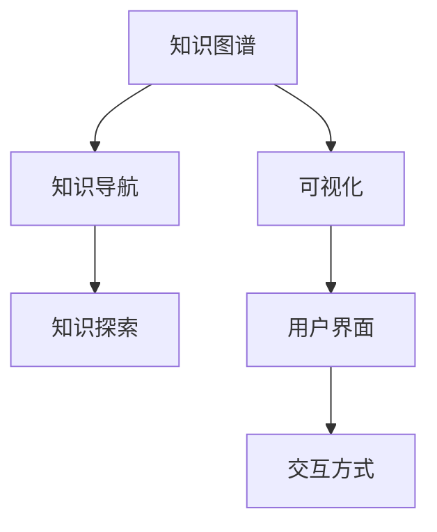

                 

# 知识图谱的可视化技术:知识导航和知识探索

## 1. 背景介绍

### 1.1 问题由来
随着信息技术的飞速发展，数据的海量增长和复杂度提升对知识的存储和获取提出了新的挑战。传统的数据仓库、文档管理系统等工具已无法满足日益增长的知识获取需求。知识图谱作为大数据时代的知识表示和获取新范式，逐渐成为学界和产业界关注的焦点。知识图谱构建了实体及其关系的语义网络，将复杂的知识结构化和关联化，能够高效支持语义查询和推理，在智能问答、推荐系统、自然语言处理等领域展示了广泛的应用前景。

### 1.2 问题核心关键点
知识图谱的可视化技术是帮助用户理解和探索知识图谱的有效工具。通过可视化，用户可以直观地了解图谱的实体、关系和结构，从而进行知识导航和探索，提升知识的获取效率。知识图谱的可视化通常包括节点（实体）的展示、边（关系）的连接以及布局等关键元素。核心关键点包括：

- **知识表示：**如何表示实体、属性和关系，保证知识图谱的准确性和完整性。
- **布局算法：**如何设计节点和边的布局，最大化信息展示和用户理解。
- **交互方式：**如何设计交互界面，支持用户操作和查询。
- **性能优化：**如何在处理大规模知识图谱时保证可视化的实时性和高效性。

## 2. 核心概念与联系

### 2.1 核心概念概述

为更好地理解知识图谱的可视化技术，本节将介绍几个密切相关的核心概念：

- **知识图谱(Knowledge Graph)**：一种语义化的知识表示方法，以实体、属性和关系的形式，将复杂的知识结构化，便于机器理解和推理。

- **可视化(Visualization)**：将抽象的数据、知识等转换为图形、图像等可视化的形式，以增强用户理解和交互体验。

- **知识导航(Knowledge Navigation)**：利用可视化技术，帮助用户快速定位和检索知识图谱中的实体和关系，支持知识探索和知识发现。

- **知识探索(Knowledge Exploration)**：通过交互式可视化界面，用户可以进行查询、分析等操作，获取深层次的知识洞见。

- **用户界面(UI)**：设计直观、易用的用户交互界面，支持用户进行可视化操作，提升用户满意度。

- **交互方式(Interactive Style)**：提供多种交互方式，如点击、拖拽、筛选等，增强用户与知识图谱的互动。

这些核心概念之间的逻辑关系可以通过以下Mermaid流程图来展示：



这个流程图展示了几大核心概念及其之间的关系：

1. 知识图谱是可视化技术的基础，通过可视化展示其结构和内容。
2. 知识导航和知识探索是知识图谱可视化的两个主要功能。
3. 用户界面是知识图谱可视化的展示和交互界面。
4. 交互方式丰富了用户界面的互动性，增强了用户体验。

## 3. 核心算法原理 & 具体操作步骤

### 3.1 算法原理概述

知识图谱的可视化技术，其核心是利用图形化方法展示知识图谱的实体、关系和结构，并设计互动式用户界面，帮助用户进行知识导航和探索。一般而言，知识图谱的可视化包含以下几个步骤：

1. **数据采集与预处理**：收集知识图谱数据，进行清洗、去重等预处理。
2. **图谱构建与存储**：构建知识图谱的模型，存储实体、属性和关系，构建边结构。
3. **布局设计**：根据节点的属性和边权重等，设计节点的布局和边的连接方式。
4. **渲染与显示**：将设计好的布局进行渲染，显示在用户界面上。
5. **交互设计**：设计互动式界面，支持用户对图谱进行操作和查询。

### 3.2 算法步骤详解

知识图谱的可视化算法可以分为两个主要部分：布局设计和交互设计。

#### 布局设计

布局设计是知识图谱可视化的关键环节，其主要目标是设计合理的节点和边布局，最大化信息的展示和用户理解。以下是常见的布局算法：

- **力导向布局(Force-Directed Layout)**：利用力的概念，通过计算节点之间的距离和边权重，生成自然布局。常见算法包括Fruchterman-Reingold算法和Younes-Berwanger算法。
- **树形布局(Tree Layout)**：适用于层级结构的图谱，通过树形结构展示节点关系。
- **邻接矩阵布局(Adjacency Matrix Layout)**：将知识图谱转换为邻接矩阵，通过矩阵排序展示节点关系。
- **自适应布局(Adaptive Layout)**：根据用户交互行为自适应调整布局，提升用户体验。

#### 交互设计

交互设计是知识图谱可视化的重要补充，通过设计直观易用的用户界面，增强用户与图谱的互动。以下是常见的交互方式：

- **点击、拖拽**：支持用户点击节点或边进行查询，拖拽节点进行移动和连接。
- **筛选、排序**：提供筛选器、排序器等，帮助用户快速定位感兴趣的节点和边。
- **高级查询**：支持SQL-like查询语言，使用复杂查询语句获取知识洞见。
- **可视化呈现**：使用图表、动态效果等增强用户理解，如节点大小、颜色代表属性值。

### 3.3 算法优缺点

知识图谱的可视化技术具有以下优点：

1. **直观展示**：可视化技术将复杂的数据和知识转换为直观图形，便于用户理解和记忆。
2. **快速导航**：通过互动式界面，用户可以快速定位和检索感兴趣的节点和边。
3. **深入探索**：用户可以通过高级查询和分析工具，进行深入的知识探索和发现。

同时，该技术也存在一定的局限性：

1. **数据处理复杂**：知识图谱的数据处理和构建复杂，需要大量的时间和资源。
2. **交互体验有限**：高级交互功能需要较高的技术要求，部分用户可能难以掌握。
3. **性能瓶颈**：处理大规模知识图谱时，可视化渲染和交互可能存在性能瓶颈。
4. **数据可视化准确性**：节点和边的布局设计可能存在准确性问题，影响用户理解。

尽管存在这些局限性，但就目前而言，知识图谱的可视化技术是展示和探索知识图谱的重要工具，对知识图谱的研究和应用具有重要意义。未来相关研究的方向主要集中在如何进一步提升可视化的性能和互动性，同时优化数据处理和渲染算法，以应对更大规模的知识图谱。

### 3.4 算法应用领域

知识图谱的可视化技术已经在多个领域得到了广泛应用，例如：

- **智能问答系统**：利用可视化技术，用户可以快速定位相关实体和关系，进行智能问答。
- **推荐系统**：展示用户行为和商品关系的知识图谱，帮助用户发现推荐商品。
- **自然语言处理(NLP)**：可视化知识图谱中的实体和关系，辅助语义分析和情感分析。
- **医疗信息管理**：展示医疗知识和病历数据，帮助医生进行诊断和治疗。
- **金融数据分析**：可视化金融市场数据和实体关系，辅助风险分析和投资决策。

## 4. 数学模型和公式 & 详细讲解 & 举例说明

### 4.1 数学模型构建

知识图谱的可视化通常涉及图的表示和渲染过程。以下以力导向布局为例，说明数学模型的构建。

设知识图谱中有$N$个节点，每个节点的坐标表示为$(x_i,y_i)$，节点$i$和节点$j$之间的边权重为$w_{ij}$，则力导向布局的能量函数为：

$$
E = \sum_{i,j} f_{ij}(w_{ij})
$$

其中$f_{ij}$为边$i$和$j$的势能函数，根据边的权重$w_{ij}$计算，常见形式包括$\log w_{ij}$和$1/w_{ij}$等。

### 4.2 公式推导过程

力导向布局的势能函数$f_{ij}(w_{ij})$可以表示为：

$$
f_{ij}(w_{ij}) = \frac{k_1 \cdot (x_i - x_j)^2 + k_2 \cdot (y_i - y_j)^2}{w_{ij}}
$$

其中$k_1$和$k_2$为常数，调节节点间距离的权重。

根据能量最小化原理，力导向布局的优化目标为：

$$
\min_{(x_i,y_i)} E = \sum_{i,j} f_{ij}(w_{ij})
$$

通过求解上述优化问题，可以得到节点的新坐标，完成布局设计。

### 4.3 案例分析与讲解

以展示一个包含学生、课程和成绩关系的知识图谱为例。假设节点大小表示节点的重要性，节点颜色表示节点的类型（如学生、课程、成绩），边权重表示学生与课程的关系权重（如选修课程数、课程难度等）。


该图谱展示了一个学校的知识图谱，其中节点包含学生、课程和成绩信息，边表示选修关系和成绩关系。通过可视化展示，用户可以直观地了解学生选修的课程、课程的难度和学生的成绩分布，进行知识导航和探索。

## 5. 项目实践：代码实例和详细解释说明

### 5.1 开发环境搭建

在进行可视化实践前，我们需要准备好开发环境。以下是使用Python进行D3.js开发的环境配置流程：

1. 安装Node.js：从官网下载并安装Node.js，用于安装和运行D3.js库。
2. 安装D3.js：使用npm安装D3.js库，支持图形渲染和交互功能。
3. 安装Jupyter Notebook：使用pip安装Jupyter Notebook，用于数据可视化和交互式编程。

完成上述步骤后，即可在Jupyter Notebook环境中开始可视化实践。

### 5.2 源代码详细实现

下面我们以展示一个包含学生、课程和成绩关系的知识图谱为例，给出使用D3.js进行知识图谱可视化的Python代码实现。

```python
# 导入所需的库
import networkx as nx
import matplotlib.pyplot as plt
import d3py

# 创建知识图谱
G = nx.Graph()

# 添加节点和边
G.add_node('Alice', type='Student', score=3.8)
G.add_node('Bob', type='Student', score=3.5)
G.add_node('Math', type='Course', score=4.0)
G.add_node('CS', type='Course', score=4.0)
G.add_edge('Alice', 'Math', weight=0.8)
G.add_edge('Alice', 'CS', weight=0.5)
G.add_edge('Bob', 'Math', weight=0.9)
G.add_edge('Bob', 'CS', weight=0.7)

# 绘制知识图谱
pos = nx.spring_layout(G, k=1.0, alpha=0.5, iterations=100)
nx.draw(G, pos=pos, with_labels=True, node_size=[v*20 for v in nx.degree(G)], node_color=['lightblue' if v[0][1] == 'Student' else 'lightgreen', 'lightyellow'], edge_color=['darkblue', 'darkgreen'], arrows=True, font_size=10)

# 显示图谱
plt.show()

# 使用D3.js可视化知识图谱
d3py.Graph(G)
```

在代码中，我们首先使用networkx库创建知识图谱，并添加节点和边。然后，使用spring布局算法进行节点布局，并通过matplotlib和d3py库进行可视化展示。最终，在Jupyter Notebook中运行代码，即可在网页中显示知识图谱。

### 5.3 代码解读与分析

让我们再详细解读一下关键代码的实现细节：

**网络x库**：
- `G = nx.Graph()`：创建无向图，用于存储知识图谱。
- `G.add_node(node, **kwargs)`：添加节点，参数`kwargs`用于定义节点的属性。
- `G.add_edge(from, to, weight)`：添加边，参数`weight`表示边权重。

**可视化代码**：
- `pos = nx.spring_layout(G, k=1.0, alpha=0.5, iterations=100)`：使用spring布局算法，计算节点的新坐标，设置参数`k`和`alpha`控制布局效果。
- `nx.draw(...)`：使用matplotlib库绘制知识图谱，设置节点大小、颜色和形状，以及边颜色和箭头。
- `d3py.Graph(G)`：使用D3.js库进行可视化展示，支持动态调整和交互。

通过以上代码，我们展示了如何使用网络x和D3.js库对知识图谱进行可视化展示。D3.js库提供了丰富的图形渲染和交互功能，可以支持复杂的知识图谱可视化需求。

## 6. 实际应用场景

### 6.1 智能问答系统

智能问答系统通过知识图谱展示相关实体和关系，帮助用户快速定位答案。在知识图谱中，通常包含问题的实体和相关事实，通过展示这些信息，用户可以快速理解问题背景和答案来源。

在技术实现上，可以使用D3.js等工具，将知识图谱渲染为互动式网页，支持用户点击节点进行查询。同时，结合自然语言处理技术，自动匹配用户输入的问题和知识图谱中的实体，提供更准确的回答。

### 6.2 推荐系统

推荐系统利用知识图谱展示用户行为和商品关系，帮助用户发现推荐商品。在知识图谱中，通常包含用户行为数据和商品信息，通过展示这些信息，用户可以了解不同商品之间的关系和用户兴趣点，从而做出更有针对性的选择。

在技术实现上，可以使用D3.js等工具，将知识图谱渲染为互动式网页，支持用户点击节点进行查询。同时，结合用户行为数据和商品信息，自动生成推荐列表，提升推荐系统的精准度。

### 6.3 自然语言处理(NLP)

自然语言处理(NLP)通过知识图谱展示相关实体和关系，辅助语义分析和情感分析。在知识图谱中，通常包含实体和属性信息，通过展示这些信息，可以帮助用户理解文本中的实体和关系，从而提升NLP任务的准确度。

在技术实现上，可以使用D3.js等工具，将知识图谱渲染为互动式网页，支持用户点击节点进行查询。同时，结合文本数据和知识图谱，进行实体链接、情感分析等任务，提升NLP系统的能力。

### 6.4 未来应用展望

随着知识图谱和可视化技术的不断发展，未来的知识导航和探索将面临更多的机遇和挑战。以下是一些可能的未来应用方向：

1. **多模态知识图谱**：结合图像、音频等多模态数据，构建多模态知识图谱，支持更丰富的知识表示和展示。
2. **交互式可视分析**：结合可视化技术和数据分析工具，提供更灵活的交互式分析功能，帮助用户深入探索知识图谱中的洞见。
3. **自动化知识图谱生成**：结合自动化生成技术，自动识别和构建知识图谱，降低人工标注成本，加速知识图谱的构建和更新。
4. **知识图谱演进分析**：通过可视化技术展示知识图谱的演进过程，帮助用户理解知识的动态变化和趋势。
5. **知识图谱的社会化交互**：结合社会网络分析技术，展示知识图谱中的社会关系，支持知识的社会化互动和传播。

## 7. 工具和资源推荐

### 7.1 学习资源推荐

为了帮助开发者系统掌握知识图谱可视化技术，这里推荐一些优质的学习资源：

1. 《Knowledge Graphs: An Introduction》系列书籍：由领域专家撰写，介绍了知识图谱的基本概念、构建方法和应用场景。
2. Coursera《Knowledge Graphs》课程：斯坦福大学开设的课程，介绍了知识图谱的构建、存储和查询技术。
3. D3.js官方文档：D3.js库的官方文档，提供了丰富的图表和交互功能，是可视化开发的重要参考。
4. NetworkX官方文档：网络x库的官方文档，提供了强大的图处理功能，支持知识图谱的构建和分析。
5. Knowledge Graphs with Python：由DataCamp提供的教程，介绍了使用Python和networkx库构建和可视化知识图谱。

通过对这些资源的学习实践，相信你一定能够快速掌握知识图谱可视化的精髓，并用于解决实际的NLP问题。

### 7.2 开发工具推荐

高效的开发离不开优秀的工具支持。以下是几款用于知识图谱可视化开发的常用工具：

1. D3.js：一个流行的JavaScript库，提供了丰富的图表和交互功能，支持复杂的可视化需求。
2. NetworkX：一个Python库，提供了强大的图处理功能，支持知识图谱的构建和分析。
3. GraphLab：一个Python库，提供了分布式图处理功能，支持大规模知识图谱的处理和分析。
4. Tableau：一个商业可视化工具，支持拖放式可视化，提供了丰富的图表和交互功能。
5. Power BI：一个商业可视化工具，支持连接多种数据源，提供了丰富的可视化模板和报表功能。

合理利用这些工具，可以显著提升知识图谱可视化的开发效率，加快创新迭代的步伐。

### 7.3 相关论文推荐

知识图谱可视化技术的发展源于学界的持续研究。以下是几篇奠基性的相关论文，推荐阅读：

1. Lehigh H. Knowledge Graphs: Semantic Networks for Machine Learning. 2020.
2. Wang Y., Wang C., Zhang Z., Guo L., & Fu C. (2019). Knowledge Graphs for AI and Beyond: A Survey.
3. Kuang X., Leng Y., & Yang H. (2019). Visualization for Knowledge Graphs: An Overview.
4. Kielmann S., Lin Y., & Wang C. (2021). Knowledge Graph Visualization: A Survey on Interfaces and Visualization Techniques.
5. OrR. (2019). Survey on Graph Mining and Statistical Learning for Knowledge Graphs.

这些论文代表了大规模知识图谱可视化的发展脉络。通过学习这些前沿成果，可以帮助研究者把握学科前进方向，激发更多的创新灵感。

## 8. 总结：未来发展趋势与挑战

### 8.1 总结

本文对知识图谱的可视化技术进行了全面系统的介绍。首先阐述了知识图谱和可视化的核心概念及其在NLP中的重要性，明确了知识图谱可视化的主要应用场景和功能。其次，从原理到实践，详细讲解了知识图谱可视化的数学模型和算法步骤，给出了知识图谱可视化的完整代码实例。同时，本文还广泛探讨了知识图谱可视化在多个行业领域的应用前景，展示了知识图谱可视化技术的巨大潜力。此外，本文精选了知识图谱可视化的各类学习资源，力求为读者提供全方位的技术指引。

通过本文的系统梳理，可以看到，知识图谱的可视化技术正在成为知识图谱研究和应用的重要工具，极大地拓展了知识图谱的应用边界，为知识图谱的研究和应用提供了新的视角。未来，伴随知识图谱和可视化技术的持续演进，相信知识图谱在构建人机协同的智能系统中的作用将更加显著，推动NLP技术不断向前发展。

### 8.2 未来发展趋势

展望未来，知识图谱可视化技术将呈现以下几个发展趋势：

1. **多模态可视化**：结合图像、音频等多模态数据，展示更丰富的知识信息，支持更全面的知识导航和探索。
2. **交互式可视化**：提供更灵活的交互功能，支持用户进行实时查询、分析和互动，提升用户满意度。
3. **自动化生成**：结合自动化生成技术，自动识别和构建知识图谱，降低人工标注成本，加速知识图谱的构建和更新。
4. **动态演化**：展示知识图谱的动态变化和演化过程，帮助用户理解知识的动态变化和趋势。
5. **社会化交互**：结合社会网络分析技术，展示知识图谱中的社会关系，支持知识的社会化互动和传播。

以上趋势凸显了知识图谱可视化技术的广阔前景。这些方向的探索发展，必将进一步提升知识图谱系统的性能和应用范围，为知识图谱的研究和应用提供新的突破。

### 8.3 面临的挑战

尽管知识图谱可视化技术已经取得了瞩目成就，但在迈向更加智能化、普适化应用的过程中，它仍面临着诸多挑战：

1. **数据处理复杂**：知识图谱的数据处理和构建复杂，需要大量的时间和资源。如何高效构建和更新知识图谱，是未来的研究方向。
2. **交互体验有限**：高级交互功能需要较高的技术要求，部分用户可能难以掌握。如何设计直观易用的交互界面，提升用户体验，是未来的重要任务。
3. **性能瓶颈**：处理大规模知识图谱时，可视化渲染和交互可能存在性能瓶颈。如何优化算法和工具，提高可视化效率，是未来的重要方向。
4. **数据可视化准确性**：节点和边的布局设计可能存在准确性问题，影响用户理解。如何设计合理的布局算法，提高可视化效果，是未来的研究方向。
5. **知识表示准确性**：知识图谱的实体和关系表示可能存在不准确或缺失的问题，影响知识的获取和应用。如何提高知识图谱的表示准确性，是未来的重要任务。

尽管存在这些挑战，但未来的研究需要在以下几个方面寻求新的突破：

1. **自动化知识图谱生成**：结合自动化生成技术，自动识别和构建知识图谱，降低人工标注成本，加速知识图谱的构建和更新。
2. **多模态知识图谱**：结合图像、音频等多模态数据，展示更丰富的知识信息，支持更全面的知识导航和探索。
3. **交互式可视分析**：结合可视化技术和数据分析工具，提供更灵活的交互式分析功能，帮助用户深入探索知识图谱中的洞见。
4. **动态演化**：展示知识图谱的动态变化和演化过程，帮助用户理解知识的动态变化和趋势。
5. **社会化交互**：结合社会网络分析技术，展示知识图谱中的社会关系，支持知识的社会化互动和传播。

这些研究方向的探索，必将引领知识图谱可视化技术迈向更高的台阶，为知识图谱的研究和应用提供新的突破。

### 8.4 研究展望

面对知识图谱可视化面临的种种挑战，未来的研究需要在以下几个方面寻求新的突破：

1. **自动化知识图谱生成**：结合自动化生成技术，自动识别和构建知识图谱，降低人工标注成本，加速知识图谱的构建和更新。
2. **多模态知识图谱**：结合图像、音频等多模态数据，展示更丰富的知识信息，支持更全面的知识导航和探索。
3. **交互式可视分析**：结合可视化技术和数据分析工具，提供更灵活的交互式分析功能，帮助用户深入探索知识图谱中的洞见。
4. **动态演化**：展示知识图谱的动态变化和演化过程，帮助用户理解知识的动态变化和趋势。
5. **社会化交互**：结合社会网络分析技术，展示知识图谱中的社会关系，支持知识的社会化互动和传播。

这些研究方向的探索，必将引领知识图谱可视化技术迈向更高的台阶，为知识图谱的研究和应用提供新的突破。

## 9. 附录：常见问题与解答

**Q1：知识图谱的可视化技术是否适用于所有知识类型？**

A: 知识图谱的可视化技术适用于结构化、半结构化的知识表示，但对于非结构化的知识（如文本、音频等），需要结合其他技术进行处理和展示。

**Q2：知识图谱可视化是否适用于大规模知识图谱？**

A: 知识图谱可视化技术可以处理大规模知识图谱，但随着图谱规模的增大，可视化渲染和交互可能存在性能瓶颈。需要优化算法和工具，提高可视化效率。

**Q3：知识图谱可视化技术是否能够支持实时更新？**

A: 知识图谱可视化技术可以支持实时更新，但需要结合自动化生成和动态演化技术，实时更新图谱中的实体和关系，保证知识的及时性和准确性。

**Q4：如何设计合理的可视化布局？**

A: 设计合理的可视化布局需要结合知识图谱的特性和用户需求，常用的布局算法包括力导向布局、树形布局和邻接矩阵布局等，需要根据具体情况选择合适的算法。

**Q5：如何提升知识图谱可视化的互动性？**

A: 提升知识图谱可视化的互动性需要结合交互式技术，支持用户点击、拖拽、筛选等操作，提供更灵活的交互界面，增强用户体验。

这些解答有助于理解知识图谱可视化技术的核心概念和应用实践，帮助开发者在实际项目中更好地应用这些技术，提升知识图谱的展示和导航效果，为知识的获取和应用提供新的思路。

