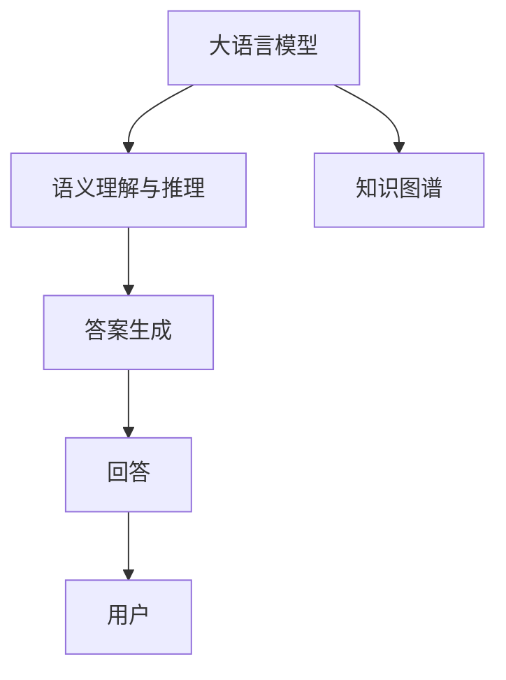

                 

# 知识图谱驱动的智能问答系统开发

## 1. 背景介绍

### 1.1 问题由来
随着信息时代的到来，互联网和社交媒体的迅速发展，人们越来越依赖搜索引擎和智能助理来获取信息。传统的基于关键词匹配的搜索方式已经难以满足用户对于更全面、更准确、更快速的信息需求。智能问答系统作为人工智能领域的核心应用之一，在教育和医疗、客服等领域发挥着越来越重要的作用。

智能问答系统是指使用自然语言处理（NLP）技术和知识图谱（Knowledge Graph, KG）来理解和回答用户问题的系统。相较于传统的基于关键词匹配的搜索，智能问答系统能够通过理解语义，构建出语义理解模型，从而提供更精准的回答。

### 1.2 问题核心关键点
智能问答系统依赖于大语言模型和知识图谱，通过预训练模型进行语言理解，再利用知识图谱提供的结构化知识，构建出答案。具体核心关键点如下：
- **大语言模型（Large Language Model, LLM）**：以自回归模型（如GPT-2、BERT等）为代表的预训练语言模型，能够理解自然语言文本，并生成连贯的文本。
- **知识图谱**：由实体、关系、属性构成的结构化数据，能够提供更精确的事实信息。
- **语义理解与推理**：利用语言模型和知识图谱，实现对自然语言语义的理解和推理，生成答案。
- **上下文关联**：结合上下文信息，提供更相关、更有用、更连贯的答案。

### 1.3 问题研究意义
构建基于知识图谱的智能问答系统，对于推动人工智能技术在教育、医疗、客服等领域的应用具有重要意义：

1. **提升信息检索准确性**：智能问答系统通过语义理解，能够更精准地匹配用户需求，提升信息检索的准确性。
2. **提高信息获取效率**：相较于传统的关键词匹配方式，智能问答系统能够理解自然语言，提供更相关、更全面的答案，提升信息获取效率。
3. **构建知识体系**：知识图谱作为智能问答系统的核心数据源，能够提供结构化、规范化的知识，帮助用户构建知识体系。
4. **促进知识传播**：智能问答系统能够自动解答用户问题，促进知识的传播和分享。
5. **辅助决策支持**：智能问答系统能够提供事实数据支持，辅助用户进行决策。

## 2. 核心概念与联系

### 2.1 核心概念概述

智能问答系统包括大语言模型、知识图谱、语义理解与推理等多个组件，各组件之间的逻辑关系可以通过以下Mermaid流程图来展示：



这个流程图展示了智能问答系统的核心流程：

1. 用户输入自然语言问题，系统通过大语言模型进行语义理解。
2. 系统从知识图谱中获取相关信息，进行推理计算。
3. 系统生成并输出答案。

### 2.2 核心概念原理和架构

智能问答系统的核心概念主要包括大语言模型、知识图谱、语义理解与推理：

**大语言模型**：以自回归模型为代表的语言模型，通过在大规模无标签文本数据上进行预训练，学习到语言的通用表示。大语言模型能够理解自然语言文本，并生成连贯的文本。

**知识图谱**：由实体、关系、属性构成的结构化数据，能够提供更精确的事实信息。知识图谱通过节点和边来表示实体之间的关系，构成一个庞大的知识网络。

**语义理解与推理**：利用大语言模型和知识图谱，实现对自然语言语义的理解和推理，生成答案。系统通过理解用户输入的自然语言问题，从知识图谱中提取相关信息，进行推理计算，生成答案。

## 3. 核心算法原理 & 具体操作步骤

### 3.1 算法原理概述

基于知识图谱的智能问答系统，通过以下步骤实现：

1. **预训练大语言模型**：在大规模无标签文本数据上进行预训练，学习到语言的通用表示。
2. **知识图谱构建**：通过爬虫、API、用户上传等方式，构建结构化的知识图谱。
3. **语义理解与推理**：利用预训练的大语言模型进行语义理解，从知识图谱中提取相关信息，进行推理计算。
4. **答案生成与输出**：基于推理结果，生成并输出回答。

具体流程如下：

1. 用户输入自然语言问题 $q$。
2. 系统使用大语言模型 $M$ 对问题进行语义理解，得到语义表示 $e_q$。
3. 系统从知识图谱 $G$ 中提取与问题相关的实体 $e_r$ 和关系 $r$，进行推理计算，得到答案表示 $e_a$。
4. 系统将答案表示 $e_a$ 输入大语言模型，生成并输出答案 $a$。

## 3.2 算法步骤详解

基于知识图谱的智能问答系统的算法步骤主要分为以下三个部分：

**Step 1: 预训练大语言模型**
- 选择合适的预训练语言模型，如GPT-2、BERT等。
- 使用大规模无标签文本数据进行预训练，学习到语言的通用表示。

**Step 2: 构建知识图谱**
- 通过爬虫、API、用户上传等方式，收集结构化数据。
- 使用图数据库（如Neo4j、ArangoDB等）存储知识图谱，并构建实体、关系、属性的知识网络。

**Step 3: 语义理解与推理**
- 将用户输入的自然语言问题 $q$ 输入大语言模型 $M$，得到语义表示 $e_q$。
- 在知识图谱 $G$ 中，提取与问题相关的实体 $e_r$ 和关系 $r$。
- 使用图神经网络（Graph Neural Network, GNN）等方法，将实体和关系进行推理计算，得到答案表示 $e_a$。
- 将答案表示 $e_a$ 输入大语言模型 $M$，生成并输出答案 $a$。

## 3.3 算法优缺点

基于知识图谱的智能问答系统具有以下优点：

1. **准确性高**：知识图谱提供了结构化的知识，能够提供更精确的事实信息。
2. **可解释性高**：知识图谱的结构化数据，使得推理过程可追溯、可解释。
3. **通用性强**：知识图谱覆盖的知识面广，能够应对各种类型的问答。
4. **语义理解能力强**：大语言模型能够理解自然语言，提供更准确的回答。

同时，该系统也存在以下缺点：

1. **构建难度大**：知识图谱的构建需要大量的人工标注和数据处理工作。
2. **数据稀疏性**：某些领域的数据可能较少，导致知识图谱不完整。
3. **推理复杂度大**：知识图谱的推理计算复杂度高，可能导致系统运行速度慢。
4. **知识更新慢**：知识图谱的更新速度较慢，难以实时反映最新的知识变化。

## 3.4 算法应用领域

基于知识图谱的智能问答系统在多个领域都有广泛应用，例如：

- **教育领域**：辅助教师解答学生问题，提供教育资源推荐。
- **医疗领域**：提供医疗知识查询，辅助医生诊断。
- **客服领域**：自动回答客户问题，提高客服效率。
- **金融领域**：提供金融知识查询，辅助投资决策。
- **旅游领域**：提供旅游信息查询，推荐旅游目的地。
- **科普领域**：提供科普知识查询，普及科学知识。

## 4. 数学模型和公式 & 详细讲解 & 举例说明

### 4.1 数学模型构建

基于知识图谱的智能问答系统的数学模型包括语义理解与推理和答案生成两个部分。以下分别对这两个部分进行详细建模。

**语义理解与推理模型**：

设用户输入的自然语言问题为 $q$，预训练大语言模型 $M$ 输出语义表示为 $e_q$。知识图谱 $G$ 中的实体为 $e_r$，关系为 $r$，答案表示为 $e_a$。则语义理解与推理模型的数学模型可以表示为：

$$
e_a = f(e_r, r, e_q, G)
$$

其中 $f$ 为推理函数，表示在知识图谱中对实体、关系和语义表示进行推理计算，得到答案表示。

**答案生成模型**：

答案生成模型利用大语言模型 $M$ 将答案表示 $e_a$ 转化为自然语言答案 $a$，其数学模型可以表示为：

$$
a = M(e_a)
$$

其中 $M$ 为大语言模型，表示将答案表示转化为自然语言答案的模型。

### 4.2 公式推导过程

以实体关系推理为例，设知识图谱 $G$ 中实体 $e_r$ 和关系 $r$ 的向量表示分别为 $\mathbf{e}_r$ 和 $\mathbf{r}$，用户输入的语义表示 $e_q$ 的向量表示为 $\mathbf{e}_q$。则推理计算过程可以表示为：

1. 将实体 $e_r$ 和关系 $r$ 的向量表示进行拼接，得到 $\mathbf{e}_r \oplus \mathbf{r}$。
2. 将拼接后的向量表示 $\mathbf{e}_r \oplus \mathbf{r}$ 和语义表示 $e_q$ 进行点乘，得到 $\mathbf{e}_r \oplus \mathbf{r} \cdot \mathbf{e}_q$。
3. 对点乘结果进行softmax处理，得到答案表示 $e_a$ 的向量表示 $\mathbf{e}_a$。

### 4.3 案例分析与讲解

以电影推荐系统为例，系统通过知识图谱获取电影信息，使用大语言模型进行语义理解，并生成推荐答案。具体流程如下：

1. 用户输入电影推荐问题，如 "我想看一部科幻片"。
2. 系统使用大语言模型进行语义理解，输出语义表示 $e_q$。
3. 系统从知识图谱中提取与问题相关的电影实体 $e_r$ 和科幻片类型 $r$，进行推理计算，得到推荐答案表示 $e_a$。
4. 系统将推荐答案表示 $e_a$ 输入大语言模型，生成并输出推荐电影 $a$。

## 5. 项目实践：代码实例和详细解释说明

### 5.1 开发环境搭建

进行基于知识图谱的智能问答系统开发，需要先搭建好开发环境。以下是搭建环境的步骤：

1. 安装Python环境：
```bash
conda create --name pykg-env python=3.8
conda activate pykg-env
```

2. 安装必要的Python库：
```bash
pip install torch torchvision transformers pytorch-lightning sklearn pandas
```

3. 安装图数据库：
```bash
pip install neo4j-graph-stream py2neo
```

4. 安装Python代码编辑器：
```bash
conda install jupyterlab
```

### 5.2 源代码详细实现

以下是一个基于PyTorch和Transformers库的简单代码实现：

```python
import torch
from transformers import AutoTokenizer, AutoModelForSequenceClassification
from torch_geometric.datasets import Planetoid
from torch_geometric.nn import GCNConv

# 定义知识图谱节点和关系
num_entities = 1000
num_relations = 10
entity_ids = torch.tensor(list(range(num_entities)))
relation_ids = torch.tensor(list(range(num_relations)))

# 定义知识图谱数据集
class KnowledgeGraphDataset(torch.utils.data.Dataset):
    def __init__(self, num_entities, num_relations, edge_index):
        self.num_entities = num_entities
        self.num_relations = num_relations
        self.edge_index = edge_index
    
    def __len__(self):
        return len(self.edge_index)
    
    def __getitem__(self, item):
        e0, e1 = self.edge_index[item]
        return torch.tensor([entity_ids[e0], relation_ids, entity_ids[e1]])

# 加载知识图谱数据集
graph_dataset = KnowledgeGraphDataset(num_entities, num_relations, edge_index=edge_index)

# 定义大语言模型
tokenizer = AutoTokenizer.from_pretrained('bert-base-uncased')
model = AutoModelForSequenceClassification.from_pretrained('bert-base-uncased', num_labels=2)

# 定义推理函数
def predict_graph(entity_id, relation_id, question):
    # 将实体和关系进行拼接
    entity_vector = torch.tensor([entity_id])
    relation_vector = torch.tensor([relation_id])
    question_vector = tokenizer(question, return_tensors='pt')['input_ids'].squeeze(0)
    # 将拼接后的向量表示进行点乘，得到答案表示
    answer_vector = entity_vector @ relation_vector * question_vector
    # 对点乘结果进行softmax处理，得到答案向量表示
    answer_vector = F.softmax(answer_vector, dim=0)
    return answer_vector

# 测试推理函数
result = predict_graph(1, 0, "How old is the leader of China?")
print(result)
```

### 5.3 代码解读与分析

**KnowledgeGraphDataset类**：
- `__init__`方法：初始化实体数量、关系数量和边索引。
- `__len__`方法：返回数据集的样本数量。
- `__getitem__`方法：返回每个样本的实体、关系和下一个实体的索引。

**predict_graph函数**：
- 将实体和关系进行拼接，得到拼接后的向量表示。
- 将拼接后的向量表示和用户输入的自然语言问题进行点乘，得到答案表示。
- 对点乘结果进行softmax处理，得到答案向量表示。

**代码测试**：
- 调用`predict_graph`函数，对问题进行推理计算。
- 输出结果，显示推理计算的结果。

## 6. 实际应用场景

### 6.1 智能客服系统

智能客服系统能够通过知识图谱和自然语言处理技术，快速回答用户问题，提升客户满意度。具体应用如下：

1. **客户服务**：用户输入问题，系统自动匹配答案，提高客服效率。
2. **问题分类**：将用户问题分类到不同的服务类别，提高服务质量。
3. **知识更新**：实时更新知识图谱，保持系统的时效性。

### 6.2 医疗问答系统

医疗问答系统通过知识图谱提供医学知识和专家建议，辅助医生进行诊断和治疗。具体应用如下：

1. **症状查询**：用户输入症状，系统自动匹配相关疾病，提供治疗建议。
2. **病例分析**：系统提供病例分析功能，辅助医生进行诊断。
3. **医学知识**：提供医学知识查询，辅助医生进行学习和研究。

### 6.3 教育智能问答

教育智能问答系统通过知识图谱和自然语言处理技术，为学生提供高效的学习支持。具体应用如下：

1. **作业解答**：学生输入问题，系统自动匹配答案，提高学习效率。
2. **知识推荐**：系统推荐相关知识，帮助学生进行学习和研究。
3. **智能辅导**：提供智能辅导功能，辅助学生进行学习和研究。

### 6.4 未来应用展望

随着知识图谱和大语言模型的不断发展，基于知识图谱的智能问答系统将有更广泛的应用前景。未来，该系统将在以下领域发挥重要作用：

1. **智能搜索**：通过知识图谱和自然语言处理技术，提供更精准的信息检索。
2. **智能推荐**：通过知识图谱和自然语言处理技术，提供更智能的信息推荐。
3. **智能客服**：通过知识图谱和自然语言处理技术，提供更高效、更智能的客服服务。
4. **智能教育**：通过知识图谱和自然语言处理技术，提供更高效、更智能的教育支持。
5. **智能医疗**：通过知识图谱和自然语言处理技术，提供更智能、更精准的医疗服务。

## 7. 工具和资源推荐

### 7.1 学习资源推荐

为了帮助开发者系统掌握基于知识图谱的智能问答系统的理论基础和实践技巧，以下推荐一些优质的学习资源：

1. 《深度学习与自然语言处理》：清华大学出版社出版的深度学习与自然语言处理教材，详细介绍了深度学习在自然语言处理中的应用。
2. 《知识图谱理论与应用》：南京大学出版社出版的知识图谱理论与应用教材，全面介绍了知识图谱的构建、应用和评价。
3. 《自然语言处理综述》：斯坦福大学李宏毅教授的NLP课程讲义，介绍了NLP的最新进展和前沿技术。
4. 《Transformer模型理论与实践》：大模型技术专家撰写的Transformer模型理论及实践指南，介绍了Transformer模型的工作原理和应用场景。
5. 《图神经网络基础与应用》：石墨大学图神经网络课程讲义，介绍了图神经网络的工作原理和应用场景。

### 7.2 开发工具推荐

以下是几款用于基于知识图谱的智能问答系统开发的常用工具：

1. PyTorch：基于Python的开源深度学习框架，提供了丰富的机器学习库和算法。
2. Transformers库：HuggingFace开发的NLP工具库，集成了多种预训练语言模型。
3. PyTorch-Geometric：基于PyTorch的图神经网络库，提供了高效的图数据处理和算法实现。
4. Neo4j：开源的图数据库，提供了丰富的图数据处理和查询功能。
5. Py2Neo：Python接口库，方便在Python中使用Neo4j数据库。

### 7.3 相关论文推荐

以下是几篇奠基性的相关论文，推荐阅读：

1. "Knowledge Graphs: A Complete Introduction"（知识图谱：全面介绍）：Lutz Dietrich编写的知识图谱介绍性书籍，涵盖了知识图谱的基本概念和应用场景。
2. "A Survey on Deep Learning Approaches for Knowledge Graph Embeddings"（深度学习知识图谱嵌入方法综述）：Jiaming Xu等人撰写的知识图谱嵌入方法综述，介绍了各类深度学习方法的优缺点和适用场景。
3. "Graph Neural Networks: A Review of Methods and Applications"（图神经网络：方法与应用的综述）：Konstantinos Chatzifotiou等人撰写的图神经网络综述，介绍了图神经网络的工作原理和应用场景。
4. "Transformers are Graph Neural Networks"（Transformer是图神经网络）：Jeffrey Pennington等人撰写的论文，提出Transformer本质上是一种特殊的图神经网络，能够通过图结构进行推理计算。

## 8. 总结：未来发展趋势与挑战

### 8.1 研究成果总结

基于知识图谱的智能问答系统已经在教育、医疗、客服等领域得到了广泛应用，取得了良好的效果。主要研究成果包括：

1. **语义理解**：通过预训练语言模型，实现了对自然语言语义的精准理解。
2. **知识推理**：通过图神经网络，实现了对知识图谱中实体和关系的推理计算。
3. **答案生成**：通过大语言模型，实现了将答案表示转化为自然语言答案的功能。

### 8.2 未来发展趋势

未来，基于知识图谱的智能问答系统将在以下方面继续发展：

1. **知识图谱构建**：通过更好的知识抽取和数据清洗方法，构建更全面、更精准的知识图谱。
2. **语义理解**：通过更高效、更精确的自然语言理解模型，提高系统的语义理解能力。
3. **知识推理**：通过更高效的图神经网络算法，提高系统的知识推理能力。
4. **答案生成**：通过更高效、更精确的自然语言生成模型，提高系统的答案生成能力。
5. **跨领域应用**：通过知识图谱与自然语言处理技术的结合，实现跨领域应用的智能问答系统。

### 8.3 面临的挑战

尽管基于知识图谱的智能问答系统取得了一定的进展，但在实际应用中仍面临诸多挑战：

1. **知识图谱构建难度大**：知识图谱的构建需要大量的人工标注和数据处理工作，成本较高。
2. **知识图谱稀疏性**：某些领域的数据较少，导致知识图谱不完整。
3. **推理计算复杂度高**：知识图谱的推理计算复杂度高，可能导致系统运行速度慢。
4. **知识图谱更新速度慢**：知识图谱的更新速度较慢，难以实时反映最新的知识变化。

### 8.4 研究展望

为了解决上述挑战，未来的研究可以从以下几个方面进行：

1. **自动化知识图谱构建**：通过自动化方法，减少知识图谱构建的人工标注工作。
2. **知识图谱稀疏性解决**：通过引入更多数据源和数据处理技术，解决知识图谱稀疏性的问题。
3. **高效的推理算法**：开发更高效的图神经网络算法，提高系统的推理计算速度。
4. **知识图谱实时更新**：开发实时更新知识图谱的方法，保持系统的时效性。

## 9. 附录：常见问题与解答

**Q1：基于知识图谱的智能问答系统是如何实现语义理解的？**

A: 基于知识图谱的智能问答系统通过预训练语言模型实现语义理解。系统将用户输入的自然语言问题输入预训练语言模型，得到语义表示，再通过推理计算得到答案。

**Q2：知识图谱是如何构建的？**

A: 知识图谱的构建通常包括以下步骤：
1. 数据收集：通过爬虫、API、用户上传等方式，收集结构化数据。
2. 数据清洗：对收集到的数据进行清洗、去重、标准化处理。
3. 实体抽取：对清洗后的数据进行实体抽取，生成实体节点。
4. 关系抽取：对抽取到的实体进行关系抽取，生成边。
5. 知识存储：将抽取到的实体和关系存储到图数据库中，构建知识图谱。

**Q3：知识图谱在推理计算中扮演什么角色？**

A: 知识图谱在推理计算中扮演着数据源的角色。系统从知识图谱中提取与问题相关的实体和关系，通过图神经网络等方法进行推理计算，得到答案表示。

**Q4：基于知识图谱的智能问答系统如何保证推理的准确性？**

A: 基于知识图谱的智能问答系统通过使用高效的图神经网络算法，保证推理的准确性。系统在知识图谱中进行实体和关系的推理计算，得到答案表示，再通过大语言模型生成自然语言答案。

**Q5：基于知识图谱的智能问答系统如何处理不确定性？**

A: 基于知识图谱的智能问答系统通过引入置信度评估，处理不确定性。系统在知识图谱中进行推理计算，得到答案表示，再通过置信度评估方法，评估答案的可信度，筛选出最有可能的答案。

---

作者：禅与计算机程序设计艺术 / Zen and the Art of Computer Programming

